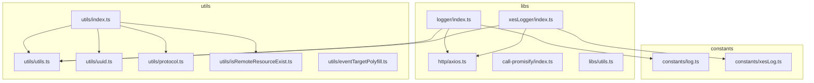
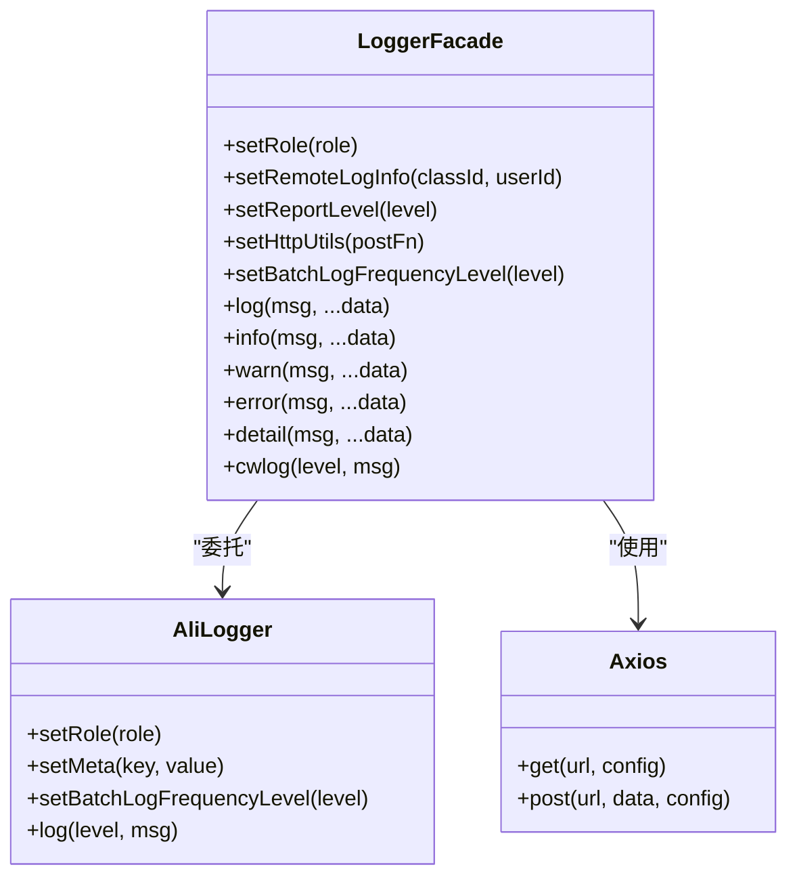
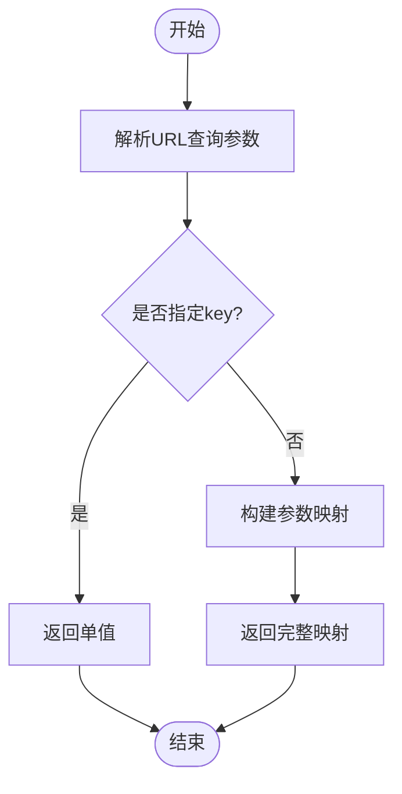
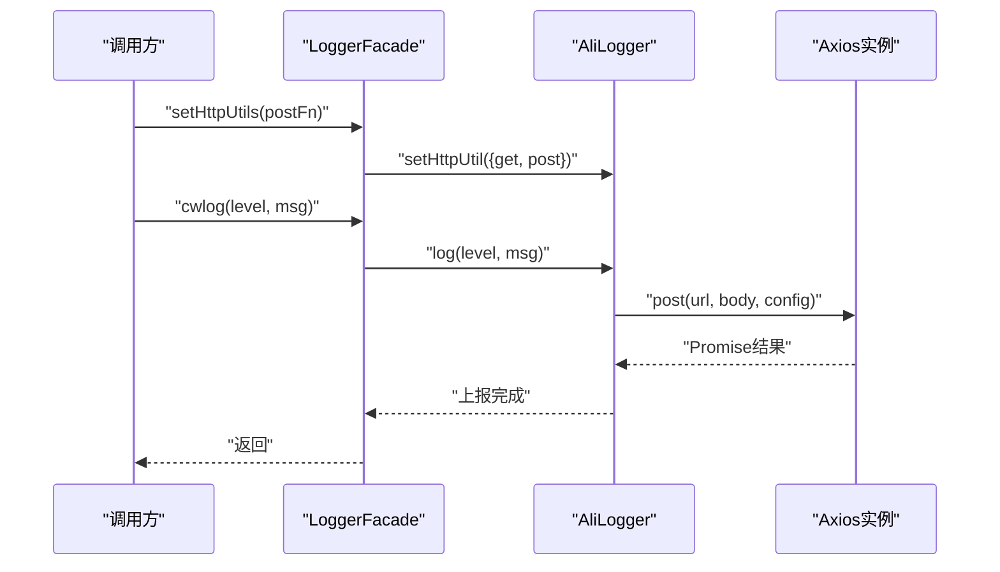
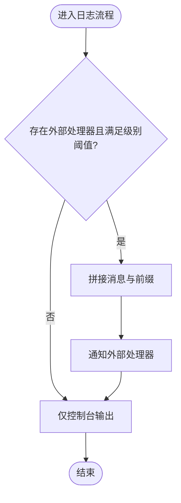
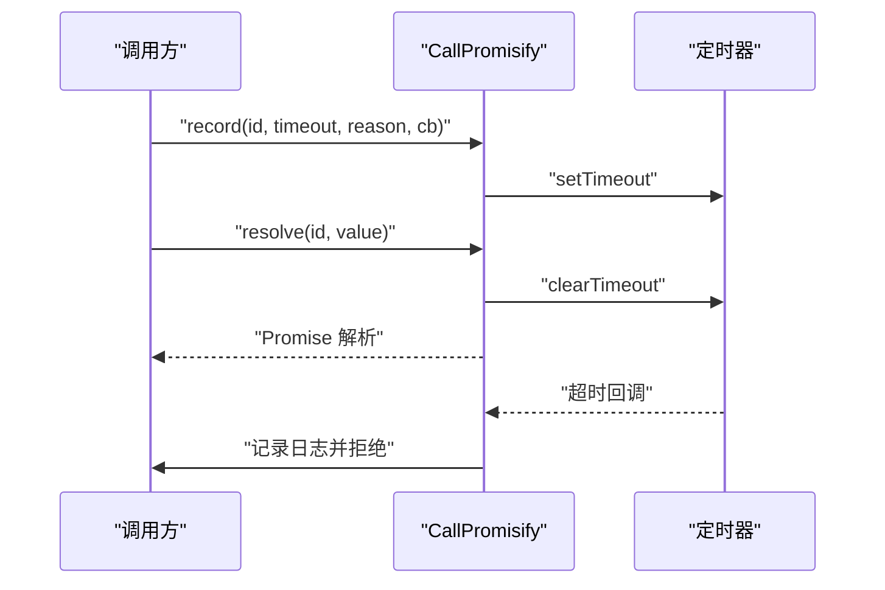
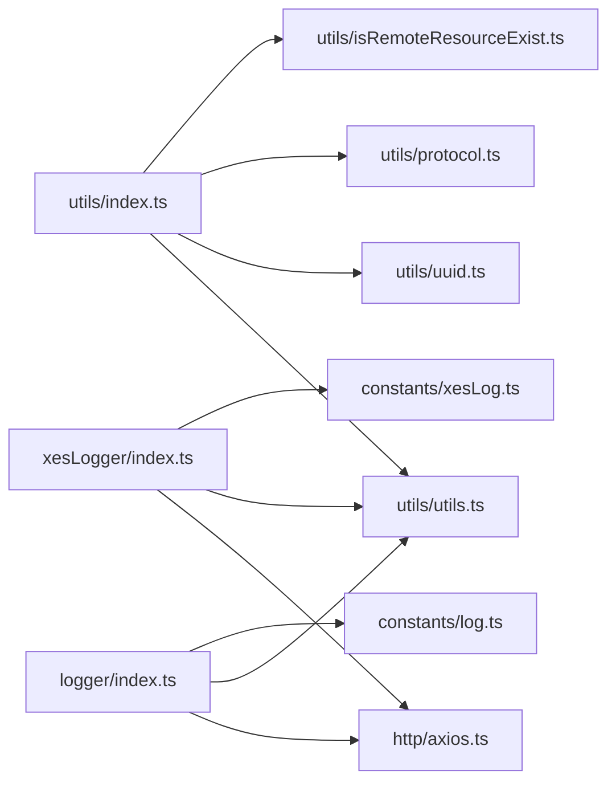

# 桥接工具库

<cite>
**本文引用的文件**
- [libs/utils.ts](file://bridge/mcc-player/src/libs/utils.ts)
- [utils/utils.ts](file://bridge/mcc-player/src/utils/utils.ts)
- [utils/index.ts](file://bridge/mcc-player/src/utils/index.ts)
- [libs/http/axios.ts](file://bridge/mcc-player/src/libs/http/axios.ts)
- [libs/logger/index.ts](file://bridge/mcc-player/src/libs/logger/index.ts)
- [libs/xesLogger/index.ts](file://bridge/mcc-player/src/libs/xesLogger/index.ts)
- [constants/log.ts](file://bridge/mcc-player/src/constants/log.ts)
- [constants/xesLog.ts](file://bridge/mcc-player/src/constants/xesLog.ts)
- [libs/call-promisify/index.ts](file://bridge/mcc-player/src/libs/call-promisify/index.ts)
- [utils/uuid.ts](file://bridge/mcc-player/src/utils/uuid.ts)
- [utils/protocol.ts](file://bridge/mcc-player/src/utils/protocol.ts)
- [utils/isRemoteResourceExist.ts](file://bridge/mcc-player/src/utils/isRemoteResourceExist.ts)
- [utils/eventTargetPolyfill.ts](file://bridge/mcc-player/src/utils/eventTargetPolyfill.ts)
</cite>

## 目录
1. [简介](#简介)
2. [项目结构](#项目结构)
3. [核心组件](#核心组件)
4. [架构总览](#架构总览)
5. [详细组件分析](#详细组件分析)
6. [依赖关系分析](#依赖关系分析)
7. [性能考量](#性能考量)
8. [故障排查指南](#故障排查指南)
9. [结论](#结论)
10. [附录：使用示例与最佳实践](#附录使用示例与最佳实践)

## 简介
本文件面向“桥接工具库”模块，系统性梳理并说明以下内容：
- 通用工具函数：数据转换、格式化、验证与平台检测
- HTTP 客户端：基于 axios 的封装与超时配置
- 日志系统：统一日志门面、阿里云日志上报、批量上报频率控制与多级日志级别
- 异步调用管理：Promise 化调用记录与超时处理
- 使用示例与最佳实践：如何正确使用各工具、如何扩展与自定义
- 测试策略与质量保障：建议的测试维度与落地方式

## 项目结构
桥接工具库主要位于 bridge/mcc-player/src/libs 与 bridge/mcc-player/src/utils 下，按职责划分为：
- libs：对外暴露的工具库集合，含 http、logger、xesLogger、call-promisify、lz4、utils 等子目录
- utils：通用工具函数与导出入口
- constants：日志常量与上报配置

图表来源
- [libs/http/axios.ts:1-7](file://bridge/mcc-player/src/libs/http/axios.ts#L1-L7)
- [libs/logger/index.ts:1-191](file://bridge/mcc-player/src/libs/logger/index.ts#L1-L191)
- [libs/xesLogger/index.ts:1-191](file://bridge/mcc-player/src/libs/xesLogger/index.ts#L1-L191)
- [libs/utils.ts:1-39](file://bridge/mcc-player/src/libs/utils.ts#L1-L39)
- [utils/utils.ts:1-143](file://bridge/mcc-player/src/utils/utils.ts#L1-L143)
- [utils/index.ts:1-5](file://bridge/mcc-player/src/utils/index.ts#L1-L5)
- [constants/log.ts:1-48](file://bridge/mcc-player/src/constants/log.ts#L1-L48)
- [constants/xesLog.ts:1-50](file://bridge/mcc-player/src/constants/xesLog.ts#L1-L50)

章节来源
- [libs/http/axios.ts:1-7](file://bridge/mcc-player/src/libs/http/axios.ts#L1-L7)
- [libs/logger/index.ts:1-191](file://bridge/mcc-player/src/libs/logger/index.ts#L1-L191)
- [libs/xesLogger/index.ts:1-191](file://bridge/mcc-player/src/libs/xesLogger/index.ts#L1-L191)
- [libs/utils.ts:1-39](file://bridge/mcc-player/src/libs/utils.ts#L1-L39)
- [utils/utils.ts:1-143](file://bridge/mcc-player/src/utils/utils.ts#L1-L143)
- [utils/index.ts:1-5](file://bridge/mcc-player/src/utils/index.ts#L1-L5)
- [constants/log.ts:1-48](file://bridge/mcc-player/src/constants/log.ts#L1-L48)
- [constants/xesLog.ts:1-50](file://bridge/mcc-player/src/constants/xesLog.ts#L1-L50)

## 核心组件
- 通用工具函数
  - URL 参数解析与模板占位符替换
  - 数据结构转换与对象深拷贝
  - 对象清洗与等值判断
- HTTP 客户端
  - 基于 axios 的实例化与超时配置
- 日志系统
  - 统一日志门面：info/warn/error/detail/cwlog 等
  - 阿里云日志上报与批量频率控制
  - 角色与元信息注入
- 异步调用管理
  - Promise 化调用记录、超时回调与批量处理

章节来源
- [utils/utils.ts:7-20](file://bridge/mcc-player/src/utils/utils.ts#L7-L20)
- [utils/utils.ts:23-33](file://bridge/mcc-player/src/utils/utils.ts#L23-L33)
- [utils/utils.ts:42-77](file://bridge/mcc-player/src/utils/utils.ts#L42-L77)
- [utils/utils.ts:86-88](file://bridge/mcc-player/src/utils/utils.ts#L86-L88)
- [utils/utils.ts:92-118](file://bridge/mcc-player/src/utils/utils.ts#L92-L118)
- [utils/utils.ts:126-141](file://bridge/mcc-player/src/utils/utils.ts#L126-L141)
- [libs/http/axios.ts:4-6](file://bridge/mcc-player/src/libs/http/axios.ts#L4-L6)
- [libs/logger/index.ts:12-21](file://bridge/mcc-player/src/libs/logger/index.ts#L12-L21)
- [libs/logger/index.ts:108-157](file://bridge/mcc-player/src/libs/logger/index.ts#L108-L157)
- [libs/logger/index.ts:133-143](file://bridge/mcc-player/src/libs/logger/index.ts#L133-L143)
- [libs/call-promisify/index.ts:8-20](file://bridge/mcc-player/src/libs/call-promisify/index.ts#L8-L20)

## 架构总览
桥接工具库采用“门面 + 子系统”的分层设计：
- 门面层：logger 与 xesLogger 提供统一接口，屏蔽底层实现差异
- 子系统层：HTTP 客户端、阿里云日志上报、批量频率控制、平台检测与工具函数
- 外部集成：通过 setHttpUtils 注入网络层，支持自定义 POST 实现

图表来源
- [libs/logger/index.ts:23-185](file://bridge/mcc-player/src/libs/logger/index.ts#L23-L185)
- [libs/http/axios.ts:4-6](file://bridge/mcc-player/src/libs/http/axios.ts#L4-L6)

章节来源
- [libs/logger/index.ts:1-191](file://bridge/mcc-player/src/libs/logger/index.ts#L1-L191)
- [libs/http/axios.ts:1-7](file://bridge/mcc-player/src/libs/http/axios.ts#L1-L7)

## 详细组件分析

### 通用工具函数
- URL 参数解析
  - 支持从完整 URL 中提取查询参数，可按 key 返回单值或返回完整映射
  - 兼容空值与特殊字符
- 数据转换
  - 将数组按 pageId 转换为以 pageId 为键的对象映射
- 对象等值判断
  - 基于 JSON 序列化比较，快速判断两对象是否完全一致
- 占位符替换
  - 支持模板字符串中花括号占位符的替换
- 深拷贝
  - 递归复制对象与数组，避免引用污染
- 对象清洗
  - 过滤掉空键、空值与空字符串，生成干净对象

图表来源
- [utils/utils.ts:7-20](file://bridge/mcc-player/src/utils/utils.ts#L7-L20)

章节来源
- [utils/utils.ts:7-20](file://bridge/mcc-player/src/utils/utils.ts#L7-L20)
- [utils/utils.ts:23-33](file://bridge/mcc-player/src/utils/utils.ts#L23-L33)
- [utils/utils.ts:42-77](file://bridge/mcc-player/src/utils/utils.ts#L42-L77)
- [utils/utils.ts:86-88](file://bridge/mcc-player/src/utils/utils.ts#L86-L88)
- [utils/utils.ts:92-118](file://bridge/mcc-player/src/utils/utils.ts#L92-L118)
- [utils/utils.ts:126-141](file://bridge/mcc-player/src/utils/utils.ts#L126-L141)

### 平台检测与工具补充
- 平台检测
  - 判断 iOS 与 Android 环境，用于日志上报策略选择
- 导出入口
  - utils/index.ts 统一导出远程资源检测、通用工具、UUID、协议工具

章节来源
- [libs/utils.ts:21-36](file://bridge/mcc-player/src/libs/utils.ts#L21-L36)
- [utils/index.ts:1-5](file://bridge/mcc-player/src/utils/index.ts#L1-L5)

### HTTP 客户端
- 基于 axios 创建实例，统一设置超时时间
- 通过 setHttpUtils 注入 GET/POST 方法，便于替换或增强网络层

图表来源
- [libs/logger/index.ts:85-96](file://bridge/mcc-player/src/libs/logger/index.ts#L85-L96)
- [libs/http/axios.ts:4-6](file://bridge/mcc-player/src/libs/http/axios.ts#L4-L6)

章节来源
- [libs/http/axios.ts:1-7](file://bridge/mcc-player/src/libs/http/axios.ts#L1-L7)
- [libs/logger/index.ts:85-96](file://bridge/mcc-player/src/libs/logger/index.ts#L85-L96)

### 日志系统
- 日志级别
  - 内部级别：error/warn/info/detail
  - 内容云课件级别：cwerror/cwwarn/cwinfo/cwdetail
- 输出行为
  - 满足阈值后触发外部处理器（如阿里云日志）
  - 同时输出到浏览器控制台
- 批量上报频率
  - 通过频率等级控制上报时间窗与单次上限
- 元信息与角色
  - 支持设置角色与远程日志元信息（如班级与用户）

图表来源
- [libs/logger/index.ts:145-157](file://bridge/mcc-player/src/libs/logger/index.ts#L145-L157)
- [libs/logger/index.ts:165-184](file://bridge/mcc-player/src/libs/logger/index.ts#L165-L184)

章节来源
- [libs/logger/index.ts:12-21](file://bridge/mcc-player/src/libs/logger/index.ts#L12-L21)
- [libs/logger/index.ts:108-157](file://bridge/mcc-player/src/libs/logger/index.ts#L108-L157)
- [libs/logger/index.ts:165-184](file://bridge/mcc-player/src/libs/logger/index.ts#L165-L184)
- [constants/log.ts:16-32](file://bridge/mcc-player/src/constants/log.ts#L16-L32)
- [constants/xesLog.ts:18-34](file://bridge/mcc-player/src/constants/xesLog.ts#L18-L34)

### XES 日志系统
- 结构与 Logger 类似，但针对特定业务场景的常量与项目名配置不同
- 适用于不同环境下的日志上报

章节来源
- [libs/xesLogger/index.ts:1-191](file://bridge/mcc-player/src/libs/xesLogger/index.ts#L1-L191)
- [constants/xesLog.ts:1-50](file://bridge/mcc-player/src/constants/xesLog.ts#L1-L50)

### 异步调用管理（CallPromisify）
- 记录每次异步调用的 Promise 解析器与定时器
- 支持按 ID 成功/失败解析，或全局拒绝/解析
- 超时自动触发拒绝并记录日志

图表来源
- [libs/call-promisify/index.ts:11-20](file://bridge/mcc-player/src/libs/call-promisify/index.ts#L11-L20)
- [libs/call-promisify/index.ts:38-55](file://bridge/mcc-player/src/libs/call-promisify/index.ts#L38-L55)

章节来源
- [libs/call-promisify/index.ts:1-80](file://bridge/mcc-player/src/libs/call-promisify/index.ts#L1-L80)

## 依赖关系分析
- logger/xesLogger 依赖 http/axios 与 utils 工具
- logger/xesLogger 依赖 constants 中的日志常量与频率配置
- utils/index.ts 统一导出多个工具模块，便于上层按需引入

图表来源
- [utils/index.ts:1-5](file://bridge/mcc-player/src/utils/index.ts#L1-L5)
- [libs/logger/index.ts:1-10](file://bridge/mcc-player/src/libs/logger/index.ts#L1-L10)
- [libs/xesLogger/index.ts:1-10](file://bridge/mcc-player/src/libs/xesLogger/index.ts#L1-L10)
- [libs/http/axios.ts:1-7](file://bridge/mcc-player/src/libs/http/axios.ts#L1-L7)
- [constants/log.ts:1-48](file://bridge/mcc-player/src/constants/log.ts#L1-L48)
- [constants/xesLog.ts:1-50](file://bridge/mcc-player/src/constants/xesLog.ts#L1-L50)

章节来源
- [utils/index.ts:1-5](file://bridge/mcc-player/src/utils/index.ts#L1-L5)
- [libs/logger/index.ts:1-10](file://bridge/mcc-player/src/libs/logger/index.ts#L1-L10)
- [libs/xesLogger/index.ts:1-10](file://bridge/mcc-player/src/libs/xesLogger/index.ts#L1-L10)
- [libs/http/axios.ts:1-7](file://bridge/mcc-player/src/libs/http/axios.ts#L1-L7)
- [constants/log.ts:1-48](file://bridge/mcc-player/src/constants/log.ts#L1-L48)
- [constants/xesLog.ts:1-50](file://bridge/mcc-player/src/constants/xesLog.ts#L1-L50)

## 性能考量
- 日志上报频率控制
  - 通过频率等级限制上报频率与单次上限，降低网络压力
- 批量上报
  - 合并多次日志为批次上报，减少请求次数
- 控制台输出
  - 在满足阈值后再进行远程上报，避免不必要的网络开销
- 深拷贝与对象清洗
  - 在需要传递大对象时，优先使用深拷贝与清洗，避免污染源数据

章节来源
- [constants/log.ts:16-32](file://bridge/mcc-player/src/constants/log.ts#L16-L32)
- [constants/xesLog.ts:18-34](file://bridge/mcc-player/src/constants/xesLog.ts#L18-L34)
- [utils/utils.ts:92-118](file://bridge/mcc-player/src/utils/utils.ts#L92-L118)
- [utils/utils.ts:126-141](file://bridge/mcc-player/src/utils/utils.ts#L126-L141)

## 故障排查指南
- 日志未上报
  - 检查 setReportLevel 是否低于 cw 级别
  - 检查 setBatchLogFrequencyLevel 是否被设置为关闭
  - 确认 setHttpUtils 已正确注入 POST 方法
- 上报频繁导致性能问题
  - 调整频率等级至 LOW/MEDIUM
  - 合理合并日志，避免密集 detail 级别日志
- 超时未触发
  - 检查 record 调用是否传入了正确的 id 与 timeout
  - 确认 resolve/reject 是否在超时前被调用

章节来源
- [libs/logger/index.ts:59-61](file://bridge/mcc-player/src/libs/logger/index.ts#L59-L61)
- [libs/logger/index.ts:102-104](file://bridge/mcc-player/src/libs/logger/index.ts#L102-L104)
- [libs/logger/index.ts:85-96](file://bridge/mcc-player/src/libs/logger/index.ts#L85-L96)
- [libs/call-promisify/index.ts:11-20](file://bridge/mcc-player/src/libs/call-promisify/index.ts#L11-L20)

## 结论
桥接工具库通过统一的门面与清晰的职责划分，提供了稳定、可扩展的工具能力：
- 通用工具函数覆盖常见数据处理需求
- HTTP 客户端与日志系统解耦，便于替换与扩展
- 批量上报与频率控制兼顾性能与可观测性
- 异步调用管理提升跨端通信的可靠性

## 附录：使用示例与最佳实践
- 使用 URL 参数解析
  - 从 URL 中获取单个参数或完整映射，避免手动正则
  - 参考路径：[utils/utils.ts:7-20](file://bridge/mcc-player/src/utils/utils.ts#L7-L20)
- 使用数据转换与清洗
  - 将数组转为对象映射，或清洗无效字段，减少后续判断成本
  - 参考路径：[utils/utils.ts:23-33](file://bridge/mcc-player/src/utils/utils.ts#L23-L33)、[utils/utils.ts:126-141](file://bridge/mcc-player/src/utils/utils.ts#L126-L141)
- 使用日志系统
  - 设置角色与远程元信息，按需调整上报级别与频率
  - 通过 setHttpUtils 注入自定义 POST 实现
  - 参考路径：[libs/logger/index.ts:54-61](file://bridge/mcc-player/src/libs/logger/index.ts#L54-L61)、[libs/logger/index.ts:85-96](file://bridge/mcc-player/src/libs/logger/index.ts#L85-L96)、[libs/logger/index.ts:102-104](file://bridge/mcc-player/src/libs/logger/index.ts#L102-L104)
- 使用 HTTP 客户端
  - 统一设置超时，避免请求悬挂
  - 参考路径：[libs/http/axios.ts:4-6](file://bridge/mcc-player/src/libs/http/axios.ts#L4-L6)
- 使用异步调用管理
  - 为跨端消息或长连接调用设置超时与回调，确保资源释放
  - 参考路径：[libs/call-promisify/index.ts:11-20](file://bridge/mcc-player/src/libs/call-promisify/index.ts#L11-L20)