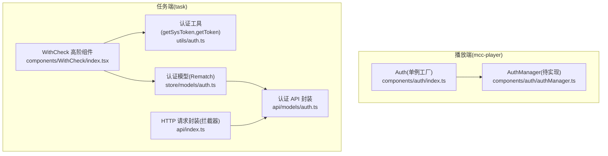
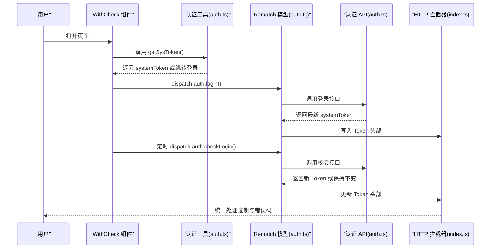
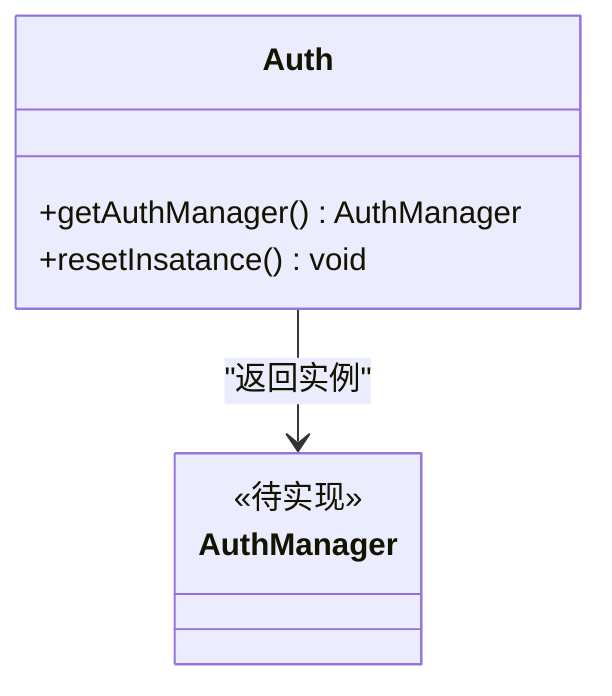
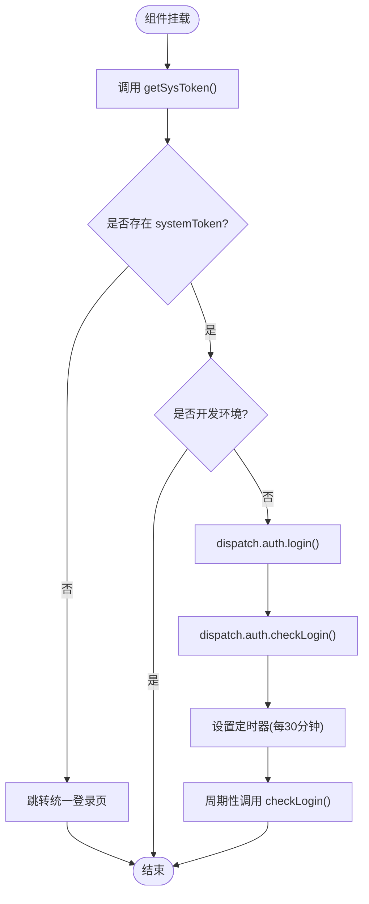
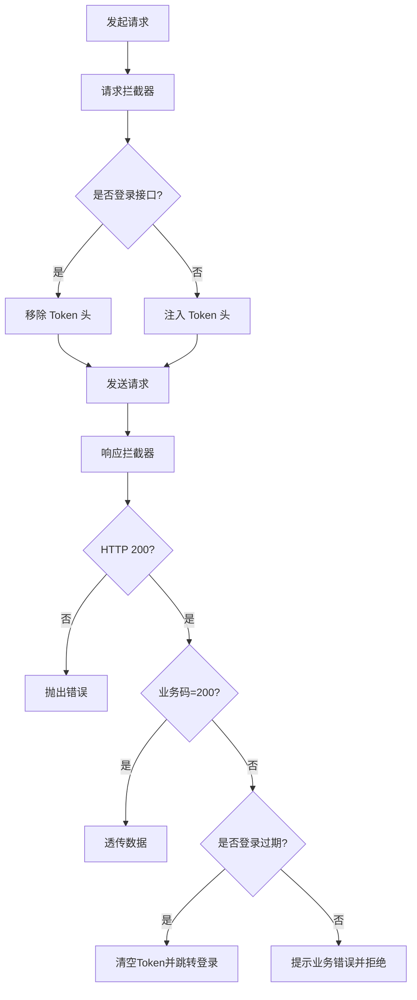
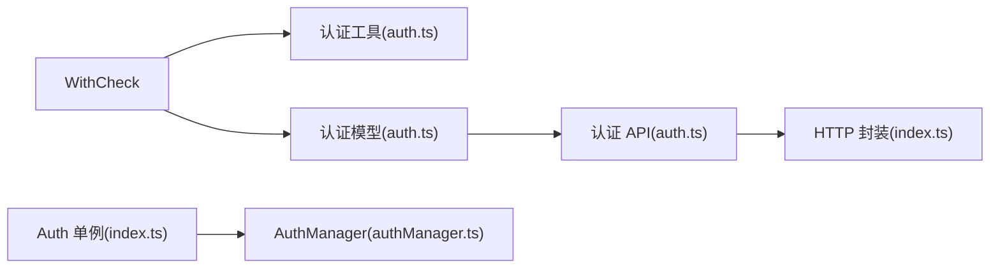
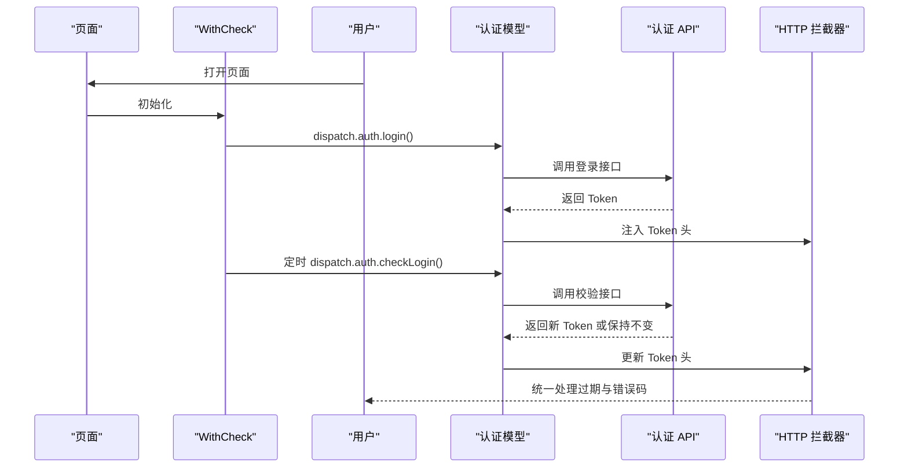

# 认证管理器

<cite>
**本文引用的文件**
- [authManager.ts](file://bridge/mcc-player/src/components/auth/authManager.ts)
- [index.ts](file://bridge/mcc-player/src/components/auth/index.ts)
- [auth.ts](file://task/src/utils/auth.ts)
- [auth.ts（模型）](file://task/src/store/models/auth.ts)
- [auth.ts（API 模型）](file://task/src/api/models/auth.ts)
- [index.tsx（WithCheck 高阶组件）](file://task/src/components/WithCheck/index.tsx)
- [index.ts（HTTP 请求封装）](file://task/src/api/index.ts)
- [auth.ts（编辑器 API）](file://editor/src/api/auth.ts)
</cite>

## 目录
1. [简介](#简介)
2. [项目结构](#项目结构)
3. [核心组件](#核心组件)
4. [架构总览](#架构总览)
5. [详细组件分析](#详细组件分析)
6. [依赖关系分析](#依赖关系分析)
7. [性能考虑](#性能考虑)
8. [故障排查指南](#故障排查指南)
9. [结论](#结论)
10. [附录：认证流程示例与最佳实践](#附录认证流程示例与最佳实践)

## 简介
本文件面向“认证管理器”模块，系统性梳理用户身份验证机制的设计与实现，覆盖登录流程、令牌管理、权限验证与会话控制；解释认证状态的维护方式（本地存储策略、过期处理与自动刷新机制）；阐述权限控制与访问校验的实现路径；并提供从登录到登出、权限验证的完整示例，以及异常处理与安全最佳实践。

## 项目结构
认证相关代码主要分布在两个子系统：
- 播放端（mcc-player）：提供认证管理器的入口与单例封装，但当前实现为空白骨架，尚未填充具体逻辑。
- 任务端（task）：提供完整的认证链路，包括令牌获取、本地存储、请求拦截器注入 Token、周期性校验与刷新、登录跳转等。

图表来源
- [index.ts:1-17](file://bridge/mcc-player/src/components/auth/index.ts#L1-L17)
- [authManager.ts:1-9](file://bridge/mcc-player/src/components/auth/authManager.ts#L1-L9)
- [index.tsx（WithCheck 高阶组件）:1-34](file://task/src/components/WithCheck/index.tsx#L1-L34)
- [auth.ts（模型）:1-55](file://task/src/store/models/auth.ts#L1-L55)
- [auth.ts（API 模型）:1-39](file://task/src/api/models/auth.ts#L1-L39)
- [index.ts（HTTP 请求封装）:1-90](file://task/src/api/index.ts#L1-L90)

章节来源
- [index.ts:1-17](file://bridge/mcc-player/src/components/auth/index.ts#L1-L17)
- [authManager.ts:1-9](file://bridge/mcc-player/src/components/auth/authManager.ts#L1-L9)
- [index.tsx（WithCheck 高阶组件）:1-34](file://task/src/components/WithCheck/index.tsx#L1-L34)
- [auth.ts（模型）:1-55](file://task/src/store/models/auth.ts#L1-L55)
- [auth.ts（API 模型）:1-39](file://task/src/api/models/auth.ts#L1-L39)
- [index.ts（HTTP 请求封装）:1-90](file://task/src/api/index.ts#L1-L90)

## 核心组件
- 播放端认证入口（Auth 单例）
  - 提供静态方法获取 AuthManager 实例，并支持重置实例，便于测试或切换上下文。
  - 当前 AuthManager 类体为空，后续应在此处实现登录、登出、令牌刷新、权限校验等逻辑。
- 任务端认证体系
  - WithCheck 高阶组件：在组件挂载时触发令牌获取与登录校验，并以固定周期轮询校验与刷新。
  - 认证工具：负责从 URL 或本地存储提取 systemToken，缺失时跳转统一登录页。
  - 认证模型：使用 Rematch 维护 sysToken 状态，提供 login 与 checkLogin 的副作用。
  - 认证 API：封装登录、校验、版本查询等接口。
  - HTTP 请求封装：全局拦截器自动注入 Token，处理登录过期与业务错误码。

章节来源
- [index.ts:1-17](file://bridge/mcc-player/src/components/auth/index.ts#L1-L17)
- [authManager.ts:1-9](file://bridge/mcc-player/src/components/auth/authManager.ts#L1-L9)
- [index.tsx（WithCheck 高阶组件）:1-34](file://task/src/components/WithCheck/index.tsx#L1-L34)
- [auth.ts（模型）:1-55](file://task/src/store/models/auth.ts#L1-L55)
- [auth.ts（API 模型）:1-39](file://task/src/api/models/auth.ts#L1-L39)
- [index.ts（HTTP 请求封装）:1-90](file://task/src/api/index.ts#L1-L90)

## 架构总览
整体认证流程围绕“令牌获取—本地持久化—请求注入—周期校验—过期处理—自动刷新—统一登录跳转”的闭环展开。

图表来源
- [index.tsx（WithCheck 高阶组件）:1-34](file://task/src/components/WithCheck/index.tsx#L1-L34)
- [auth.ts（模型）:1-55](file://task/src/store/models/auth.ts#L1-L55)
- [auth.ts（API 模型）:1-39](file://task/src/api/models/auth.ts#L1-L39)
- [index.ts（HTTP 请求封装）:1-90](file://task/src/api/index.ts#L1-L90)

## 详细组件分析

### 播放端认证入口（Auth 单例）
- 设计意图：通过静态工厂模式提供 AuthManager 的单例实例，便于跨模块共享与替换。
- 当前状态：AuthManager 类体为空，未实现任何功能，属于待开发状态。
- 建议扩展点：在 AuthManager 中实现登录、登出、令牌刷新、权限校验、会话状态维护等方法，并与播放端业务集成。

图表来源
- [index.ts:1-17](file://bridge/mcc-player/src/components/auth/index.ts#L1-L17)
- [authManager.ts:1-9](file://bridge/mcc-player/src/components/auth/authManager.ts#L1-L9)

章节来源
- [index.ts:1-17](file://bridge/mcc-player/src/components/auth/index.ts#L1-L17)
- [authManager.ts:1-9](file://bridge/mcc-player/src/components/auth/authManager.ts#L1-L9)

### 任务端 WithCheck 高阶组件
- 功能职责：在组件挂载时执行令牌获取、登录校验；随后每 30 分钟轮询一次校验与刷新；清理定时器释放资源。
- 关键行为：
  - 触发 getSysToken，若无 Token 则跳转统一登录页。
  - 在非开发环境调用模型 login 与 checkLogin。
  - 使用定时器周期性调用 checkLogin，实现自动刷新。

图表来源
- [index.tsx（WithCheck 高阶组件）:1-34](file://task/src/components/WithCheck/index.tsx#L1-L34)
- [auth.ts（模型）:1-55](file://task/src/store/models/auth.ts#L1-L55)
- [auth.ts（API 模型）:1-39](file://task/src/api/models/auth.ts#L1-L39)

章节来源
- [index.tsx（WithCheck 高阶组件）:1-34](file://task/src/components/WithCheck/index.tsx#L1-L34)

### 认证工具（auth.ts）
- 职责：统一登录地址构造、systemToken 的读取与 URL 参数处理占位逻辑、无 Token 时跳转登录。
- 行为要点：
  - LoginUrl 包含回调地址拼接，确保登录后回到当前页面。
  - getToken 从本地存储读取 systemToken。
  - getSysToken 若无 Token 则移除本地记录并跳转登录。

章节来源
- [auth.ts（模型）:1-55](file://task/src/store/models/auth.ts#L1-L55)
- [auth.ts（API 模型）:1-39](file://task/src/api/models/auth.ts#L1-L39)
- [auth.ts（编辑器 API）:1-32](file://editor/src/api/auth.ts#L1-L32)

### 认证模型（Rematch）
- 状态：sysToken 字符串。
- 方法：
  - setSysToken/updateSysToken：更新状态。
  - login：若本地存在 systemToken，则写入状态并调用登录接口。
  - checkLogin：若本地存在 systemToken，则写入状态并调用校验接口；若返回的新 Token 存在，则更新状态与本地存储。

复杂度分析
- 时间复杂度：O(1)，仅涉及本地存储读取与一次网络请求。
- 空间复杂度：O(1)，仅维护少量状态。

章节来源
- [auth.ts（模型）:1-55](file://task/src/store/models/auth.ts#L1-L55)

### 认证 API（models/auth.ts）
- 接口定义：
  - login：携带 systemToken 登录。
  - checkLogin：校验并可能返回新的 systemToken。
  - getSysVersion：按系统名查询版本号（需 Token 头）。
  - setSysVersion：保存或更新系统版本。
- 特点：通过 VITE_API_SERVER 拼接服务端地址，统一管理接口路径。

章节来源
- [auth.ts（API 模型）:1-39](file://task/src/api/models/auth.ts#L1-L39)

### HTTP 请求封装与拦截器（index.ts）
- 请求拦截：非登录接口统一注入 Token 头；登录接口显式移除旧头避免污染。
- 响应拦截：统一处理状态码与业务错误码；当检测到登录过期时清空 Token 并跳转登录页。
- 全局配置：超时、内容类型等默认值集中管理。

图表来源
- [index.ts（HTTP 请求封装）:1-90](file://task/src/api/index.ts#L1-L90)

章节来源
- [index.ts（HTTP 请求封装）:1-90](file://task/src/api/index.ts#L1-L90)

### 编辑器侧认证 API（editor/src/api/auth.ts）
- 提供系统 Token 校验与版本管理接口，用于编辑器场景下的认证与版本控制。
- 与任务端认证模型形成互补，分别服务于不同前端子系统。

章节来源
- [auth.ts（编辑器 API）:1-32](file://editor/src/api/auth.ts#L1-L32)

## 依赖关系分析
- WithCheck 依赖认证工具与认证模型；认证模型依赖认证 API；认证 API 依赖 HTTP 封装。
- 播放端 Auth 单例依赖 AuthManager，后者目前为空，尚未与任务端逻辑耦合。

图表来源
- [index.tsx（WithCheck 高阶组件）:1-34](file://task/src/components/WithCheck/index.tsx#L1-L34)
- [auth.ts（模型）:1-55](file://task/src/store/models/auth.ts#L1-L55)
- [auth.ts（API 模型）:1-39](file://task/src/api/models/auth.ts#L1-L39)
- [index.ts（HTTP 请求封装）:1-90](file://task/src/api/index.ts#L1-L90)
- [index.ts:1-17](file://bridge/mcc-player/src/components/auth/index.ts#L1-L17)
- [authManager.ts:1-9](file://bridge/mcc-player/src/components/auth/authManager.ts#L1-L9)

章节来源
- [index.tsx（WithCheck 高阶组件）:1-34](file://task/src/components/WithCheck/index.tsx#L1-L34)
- [auth.ts（模型）:1-55](file://task/src/store/models/auth.ts#L1-L55)
- [auth.ts（API 模型）:1-39](file://task/src/api/models/auth.ts#L1-L39)
- [index.ts（HTTP 请求封装）:1-90](file://task/src/api/index.ts#L1-L90)
- [index.ts:1-17](file://bridge/mcc-player/src/components/auth/index.ts#L1-L17)
- [authManager.ts:1-9](file://bridge/mcc-player/src/components/auth/authManager.ts#L1-L9)

## 性能考虑
- 轮询频率：当前每 30 分钟校验一次，建议根据业务风险动态调整或在页面可见性变化时暂停/恢复。
- 请求合并：对频繁触发的 checkLogin 可增加防抖或节流，避免短时间内的重复请求。
- 缓存策略：对不敏感的只读接口可结合缓存提升首屏体验，但认证相关接口应严格禁用缓存。
- 资源释放：离开页面时及时清理定时器与事件监听，防止内存泄漏。

## 故障排查指南
- 无法获取 Token
  - 检查 getSysToken 是否正确从 URL 或本地存储读取 systemToken。
  - 若无 Token，确认 LoginUrl 的回调拼接是否正确。
- 登录过期
  - 查看响应拦截器是否命中登录过期分支，确认 Token 清理与跳转逻辑是否执行。
- Token 注入失败
  - 确认请求拦截器未对登录接口误删 Token 头，且非登录接口已成功注入。
- 轮询无效
  - 检查 WithCheck 的定时器是否被正确创建与清理，确认 dispatch.auth.checkLogin 是否被调用。

章节来源
- [auth.ts（模型）:1-55](file://task/src/store/models/auth.ts#L1-L55)
- [auth.ts（API 模型）:1-39](file://task/src/api/models/auth.ts#L1-L39)
- [index.ts（HTTP 请求封装）:1-90](file://task/src/api/index.ts#L1-L90)
- [index.tsx（WithCheck 高阶组件）:1-34](file://task/src/components/WithCheck/index.tsx#L1-L34)

## 结论
- 播放端认证入口已完成单例框架搭建，AuthManager 有待完善。
- 任务端已形成完整的认证闭环：令牌获取、本地持久化、请求注入、周期校验、过期处理与自动刷新。
- 建议尽快补齐播放端 AuthManager 的具体实现，并将播放端与任务端的认证策略统一，确保跨端一致的用户体验与安全基线。

## 附录：认证流程示例与最佳实践

### 认证流程示例（登录—校验—刷新—登出）
- 登录
  - 用户访问页面，WithCheck 调用 getSysToken。
  - 若无 Token，跳转统一登录页；登录成功后携带回调地址返回。
  - WithCheck 调用 dispatch.auth.login，写入状态并调用登录接口。
- 权限验证
  - 页面加载完成后，定时器触发 dispatch.auth.checkLogin。
  - 若接口返回新 Token，更新状态与本地存储；否则维持现状。
- 登出
  - 清空本地 Token，跳转登录页（由拦截器在登录过期时统一处理）。

图表来源
- [index.tsx（WithCheck 高阶组件）:1-34](file://task/src/components/WithCheck/index.tsx#L1-L34)
- [auth.ts（模型）:1-55](file://task/src/store/models/auth.ts#L1-L55)
- [auth.ts（API 模型）:1-39](file://task/src/api/models/auth.ts#L1-L39)
- [index.ts（HTTP 请求封装）:1-90](file://task/src/api/index.ts#L1-L90)

### 安全最佳实践
- Token 存储
  - 优先使用 HttpOnly Cookie（服务端）或受限存储（客户端），避免明文 localStorage。
  - 对敏感操作启用二次校验（如短信/邮箱验证码）。
- 传输安全
  - 强制 HTTPS，开启 HSTS；对 Token 进行最小暴露原则（仅在必要接口注入）。
- 生命周期管理
  - 后端设置合理过期时间与刷新窗口；前端实现静默刷新与失败兜底。
- 权限控制
  - 前端仅做 UX 辅助，后端必须进行强校验；RBAC/ABAC 模型结合 ACL 使用。
- 异常处理
  - 明确区分网络错误与业务错误；对登录过期统一跳转登录页；对业务错误给出明确提示并记录日志。