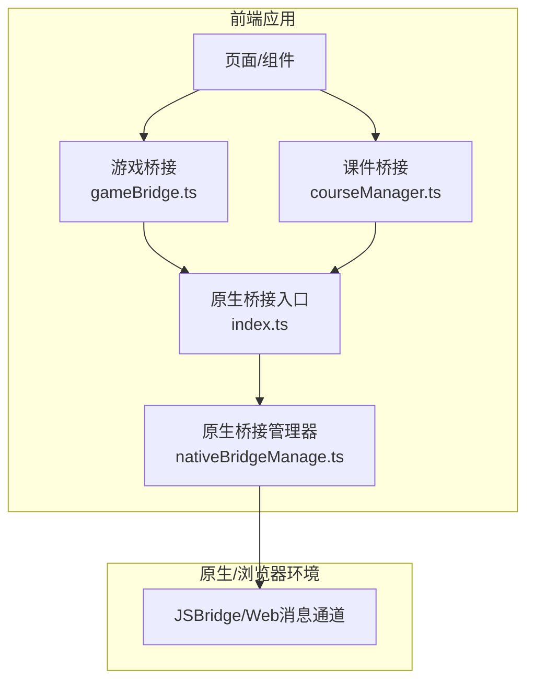
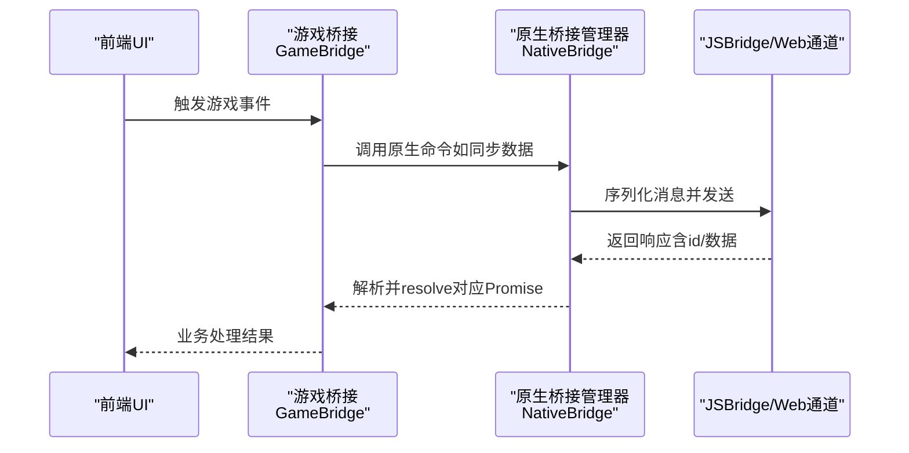
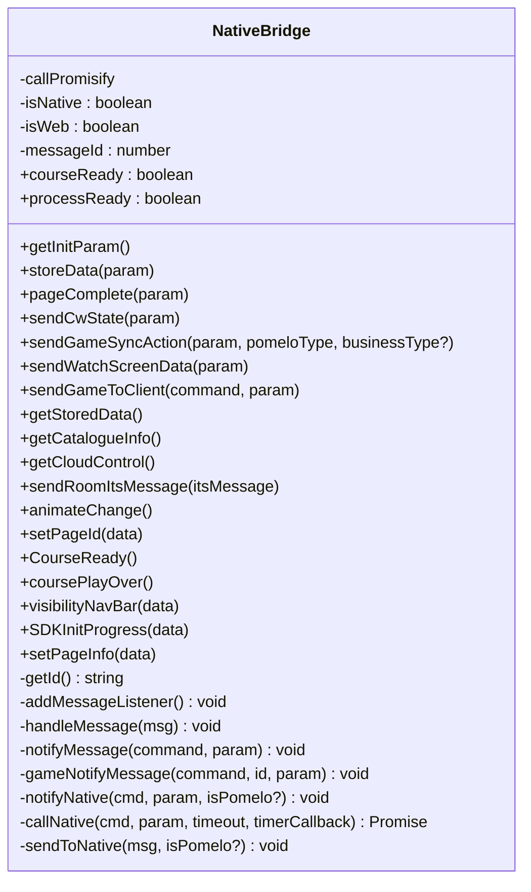
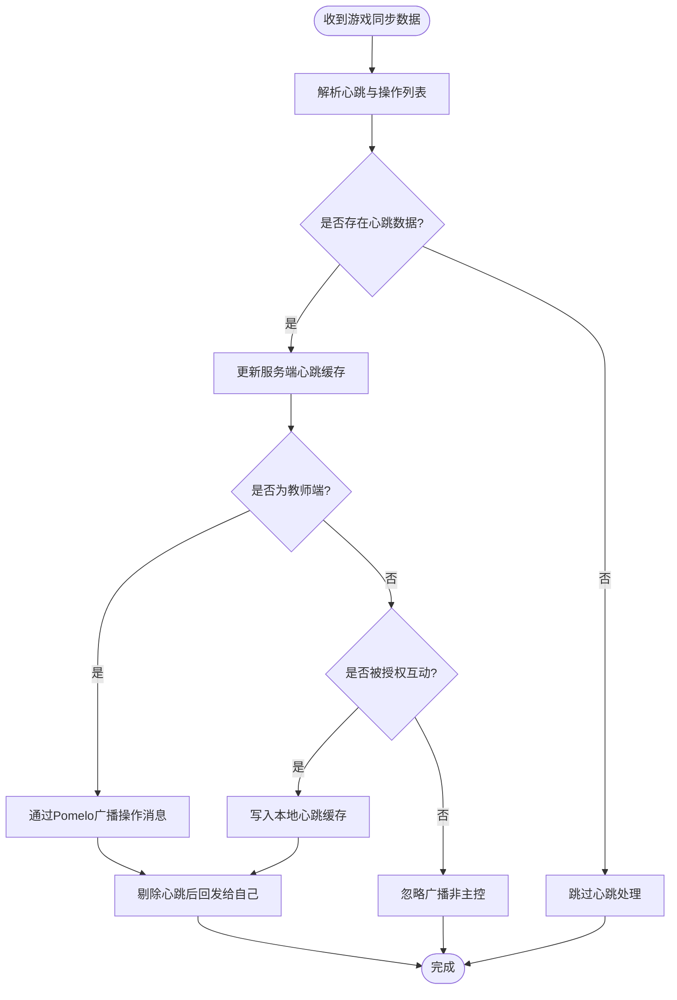
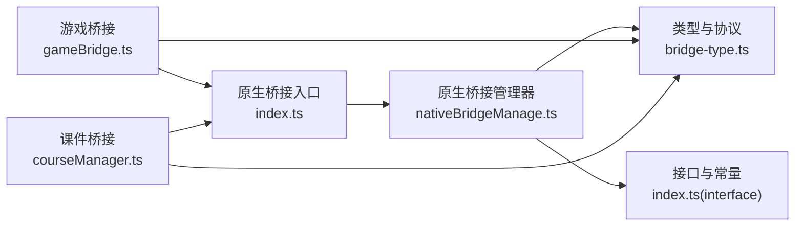

# 原生桥接系统

<cite>
**本文引用的文件**
- [index.ts](file://bridge/mcc-player/src/components/native-bridge/index.ts)
- [nativeBridgeManage.ts](file://bridge/mcc-player/src/components/native-bridge/nativeBridgeManage.ts)
- [bridge-type.ts](file://bridge/mcc-player/src/components/native-bridge/bridge-type.ts)
- [gameBridge.ts](file://bridge/mcc-player/src/components/game-manage/gameBridge.ts)
- [courseManager.ts](file://bridge/mcc-player/src/components/course-bridge/courseManager.ts)
- [type.ts（课程桥接）](file://bridge/mcc-player/src/components/course-bridge/type.ts)
- [type.ts（游戏桥接）](file://bridge/mcc-player/src/components/game-manage/type.ts)
- [index.ts（接口与常量）](file://bridge/mcc-player/src/interface/index.ts)
- [protocol.ts](file://bridge/mcc-player/src/utils/protocol.ts)
</cite>

## 目录
1. [简介](#简介)
2. [项目结构](#项目结构)
3. [核心组件](#核心组件)
4. [架构总览](#架构总览)
5. [详细组件分析](#详细组件分析)
6. [依赖关系分析](#依赖关系分析)
7. [性能考量](#性能考量)
8. [故障排查指南](#故障排查指南)
9. [结论](#结论)
10. [附录](#附录)

## 简介
本文件面向原生桥接系统，系统性阐述前端与原生（移动端/浏览器环境下的 JSBridge）之间的通信机制，包括消息协议、数据序列化、异步处理模式、桥接管理器设计（连接建立、心跳与断线重连思路）、不同桥接类型的实现（命令枚举、参数校验、返回值处理）、以及安全与权限控制策略。同时提供架构图、通信流程图与实际使用示例，帮助开发者理解并扩展原生桥接能力。

## 项目结构
围绕“原生桥接”主题，相关代码主要集中在以下模块：
- 原生桥接入口与管理器：负责消息监听、分发、调用原生能力、Promise 化调用与超时处理
- 游戏桥接：负责游戏与 MCC 的交互，转发/透传原生消息，处理心跳与同步数据
- 课件桥接：负责与课件容器的通信，翻页、恢复状态、尺寸调整等
- 类型与协议：统一命令枚举、通知类型、初始化参数、协议识别工具

图表来源
- [index.ts:1-17](file://bridge/mcc-player/src/components/native-bridge/index.ts#L1-L17)
- [nativeBridgeManage.ts:26-58](file://bridge/mcc-player/src/components/native-bridge/nativeBridgeManage.ts#L26-L58)
- [gameBridge.ts:22-42](file://bridge/mcc-player/src/components/game-manage/gameBridge.ts#L22-L42)
- [courseManager.ts:13-23](file://bridge/mcc-player/src/components/course-bridge/courseManager.ts#L13-L23)

章节来源
- [index.ts:1-17](file://bridge/mcc-player/src/components/native-bridge/index.ts#L1-L17)
- [nativeBridgeManage.ts:26-58](file://bridge/mcc-player/src/components/native-bridge/nativeBridgeManage.ts#L26-L58)
- [gameBridge.ts:22-42](file://bridge/mcc-player/src/components/game-manage/gameBridge.ts#L22-L42)
- [courseManager.ts:13-23](file://bridge/mcc-player/src/components/course-bridge/courseManager.ts#L13-L23)

## 核心组件
- 原生桥接入口（单例）：提供全局唯一的原生管理器实例，避免重复初始化
- 原生桥接管理器：负责消息监听、消息派发、调用原生能力、Promise 化调用与超时处理
- 游戏桥接：负责游戏侧事件与原生/课件的桥接，处理心跳、互动授权、看屏场景等
- 课件桥接：负责与课件容器的通信，翻页、恢复状态、尺寸调整等
- 类型与协议：统一命令枚举、通知类型、初始化参数、协议识别工具

章节来源
- [index.ts:1-17](file://bridge/mcc-player/src/components/native-bridge/index.ts#L1-L17)
- [nativeBridgeManage.ts:26-58](file://bridge/mcc-player/src/components/native-bridge/nativeBridgeManage.ts#L26-L58)
- [gameBridge.ts:22-42](file://bridge/mcc-player/src/components/game-manage/gameBridge.ts#L22-L42)
- [courseManager.ts:13-23](file://bridge/mcc-player/src/components/course-bridge/courseManager.ts#L13-L23)
- [bridge-type.ts:1-73](file://bridge/mcc-player/src/components/native-bridge/bridge-type.ts#L1-L73)
- [index.ts（接口与常量）:1-71](file://bridge/mcc-player/src/interface/index.ts#L1-L71)
- [protocol.ts:1-66](file://bridge/mcc-player/src/utils/protocol.ts#L1-L66)

## 架构总览
原生桥接系统采用“事件驱动 + Promise 化调用”的架构：
- 前端通过桥接管理器向原生发送消息，原生通过 JSBridge 或 postMessage 通道回传
- 管理器对消息进行解析、分发，并对需要返回值的调用进行 Promise 化与超时处理
- 游戏桥接与课件桥接分别订阅各自领域的通知，实现业务逻辑解耦

图表来源
- [nativeBridgeManage.ts:156-175](file://bridge/mcc-player/src/components/native-bridge/nativeBridgeManage.ts#L156-L175)
- [nativeBridgeManage.ts:182-205](file://bridge/mcc-player/src/components/native-bridge/nativeBridgeManage.ts#L182-L205)
- [gameBridge.ts:116-163](file://bridge/mcc-player/src/components/game-manage/gameBridge.ts#L116-L163)

章节来源
- [nativeBridgeManage.ts:156-175](file://bridge/mcc-player/src/components/native-bridge/nativeBridgeManage.ts#L156-L175)
- [nativeBridgeManage.ts:182-205](file://bridge/mcc-player/src/components/native-bridge/nativeBridgeManage.ts#L182-L205)
- [gameBridge.ts:116-163](file://bridge/mcc-player/src/components/game-manage/gameBridge.ts#L116-L163)

## 详细组件分析

### 原生桥接管理器（NativeBridge）
职责与特性：
- 消息监听：根据来源（web/app）选择不同的消息通道（postMessage 或 window.jsHandler）
- 消息解析：支持字符串与对象两种输入，自动尝试 JSON 解析
- 事件分发：区分普通事件与 Pomelo 事件，分别 emit 到全局事件中心
- 原生调用：提供两类调用方式
  - 通知类：无需返回值
  - 调用类：Promise 化，带超时与可选回调
- 数据序列化：统一将消息封装为 {type, data} 结构，按需转换为 Pomelo 格式
- 超时控制：基于 CallPromisify 实现超时与错误回调

图表来源
- [nativeBridgeManage.ts:26-395](file://bridge/mcc-player/src/components/native-bridge/nativeBridgeManage.ts#L26-L395)

章节来源
- [nativeBridgeManage.ts:26-395](file://bridge/mcc-player/src/components/native-bridge/nativeBridgeManage.ts#L26-L395)

### 原生桥接入口（NativeBridge 单例）
- 提供静态方法获取原生管理器实例，支持重置实例
- 保证全局唯一性，避免重复绑定监听器

章节来源
- [index.ts:1-17](file://bridge/mcc-player/src/components/native-bridge/index.ts#L1-L17)

### 游戏桥接（GameBridge）
职责与特性：
- 订阅游戏侧事件，统一转发至原生或课件
- 处理心跳与同步数据：区分教师端与学生端，分别上报/下发
- 互动授权：记录互动状态，必要时从本地存储读取历史心跳数据
- 看屏场景：当被教师端查看时，将游戏动作透传给教师端
- 透传原生到游戏的消息：如暂停/恢复、FPS 设置、互动授权等

图表来源
- [gameBridge.ts:116-163](file://bridge/mcc-player/src/components/game-manage/gameBridge.ts#L116-L163)

章节来源
- [gameBridge.ts:22-388](file://bridge/mcc-player/src/components/game-manage/gameBridge.ts#L22-L388)

### 课件桥接（CourseBridge）
职责与特性：
- 通过微应用数据通道与课件容器通信
- 提供 Promise 化的调用封装，确保 setData 异步返回
- 支持翻页、恢复状态、尺寸调整、UID 设置等常用命令

章节来源
- [courseManager.ts:13-117](file://bridge/mcc-player/src/components/course-bridge/courseManager.ts#L13-L117)

### 类型与协议定义
- 命令枚举：统一定义 MCC -> 原生、原生 -> MCC、原生 -> 游戏的消息命令
- 通知类型：区分普通通知与 Pomelo 通知
- 初始化参数：包含角色、直播/用户信息、设备信息、环境变量等
- 协议识别：提供常见协议的识别与分类工具

章节来源
- [bridge-type.ts:1-73](file://bridge/mcc-player/src/components/native-bridge/bridge-type.ts#L1-L73)
- [index.ts（接口与常量）:1-71](file://bridge/mcc-player/src/interface/index.ts#L1-L71)
- [protocol.ts:1-66](file://bridge/mcc-player/src/utils/protocol.ts#L1-L66)

## 依赖关系分析
- 原生桥接入口依赖原生桥接管理器
- 游戏桥接与课件桥接均依赖原生桥接入口
- 原生桥接管理器依赖事件中心、Promise 化工具、日志工具、URL 参数解析工具
- 游戏桥接依赖页面管理器、微应用全局数据、日志工具
- 课件桥接依赖微应用数据通道与 Promise 化工具

图表来源
- [index.ts:1-17](file://bridge/mcc-player/src/components/native-bridge/index.ts#L1-L17)
- [nativeBridgeManage.ts:1-30](file://bridge/mcc-player/src/components/native-bridge/nativeBridgeManage.ts#L1-L30)
- [gameBridge.ts:1-14](file://bridge/mcc-player/src/components/game-manage/gameBridge.ts#L1-L14)
- [courseManager.ts:1-12](file://bridge/mcc-player/src/components/course-bridge/courseManager.ts#L1-L12)
- [bridge-type.ts:1-14](file://bridge/mcc-player/src/components/native-bridge/bridge-type.ts#L1-L14)
- [index.ts（接口与常量）:1-6](file://bridge/mcc-player/src/interface/index.ts#L1-L6)

章节来源
- [index.ts:1-17](file://bridge/mcc-player/src/components/native-bridge/index.ts#L1-L17)
- [nativeBridgeManage.ts:1-30](file://bridge/mcc-player/src/components/native-bridge/nativeBridgeManage.ts#L1-L30)
- [gameBridge.ts:1-14](file://bridge/mcc-player/src/components/game-manage/gameBridge.ts#L1-L14)
- [courseManager.ts:1-12](file://bridge/mcc-player/src/components/course-bridge/courseManager.ts#L1-L12)
- [bridge-type.ts:1-14](file://bridge/mcc-player/src/components/native-bridge/bridge-type.ts#L1-L14)
- [index.ts（接口与常量）:1-6](file://bridge/mcc-player/src/interface/index.ts#L1-L6)

## 性能考量
- 消息序列化与反序列化：统一 JSON 序列化，减少传输体积与解析成本
- 超时控制：对需要返回值的调用设置合理超时，避免阻塞
- 事件去抖与幂等：对频繁触发的事件（如心跳）进行去抖与幂等处理
- 缓存策略：对心跳数据采用本地缓存与服务端缓存结合，降低网络压力
- 日志分级：区分调试与生产日志，避免过度打印影响性能

## 故障排查指南
- 无法收到原生回调：检查消息是否携带 id，确认 Promise 化调用与超时设置
- 消息格式异常：确认消息是否为合法 JSON，必要时进行容错解析
- 通道不可用：检查来源标记（from=app/web），确认对应通道是否可用
- 心跳丢失：核对心跳命令与业务类型，确认广播与回发逻辑
- 权限问题：核对角色与授权状态，确认互动授权流程是否正确

章节来源
- [nativeBridgeManage.ts:65-90](file://bridge/mcc-player/src/components/native-bridge/nativeBridgeManage.ts#L65-L90)
- [nativeBridgeManage.ts:156-175](file://bridge/mcc-player/src/components/native-bridge/nativeBridgeManage.ts#L156-L175)
- [nativeBridgeManage.ts:182-205](file://bridge/mcc-player/src/components/native-bridge/nativeBridgeManage.ts#L182-L205)
- [gameBridge.ts:194-212](file://bridge/mcc-player/src/components/game-manage/gameBridge.ts#L194-L212)

## 结论
原生桥接系统通过统一的命令枚举、事件分发与 Promise 化调用，实现了前端与原生之间的稳定通信。配合游戏与课件桥接，系统能够覆盖心跳同步、互动授权、看屏透传、翻页与状态恢复等关键场景。建议在扩展新功能时遵循现有协议与命名规范，确保消息一致性与可维护性。

## 附录
- 使用示例（路径参考）
  - 获取初始化参数：[nativeBridgeManage.ts:211-214](file://bridge/mcc-player/src/components/native-bridge/nativeBridgeManage.ts#L211-L214)
  - 存储数据到服务端：[nativeBridgeManage.ts:224-227](file://bridge/mcc-player/src/components/native-bridge/nativeBridgeManage.ts#L224-L227)
  - 发送课件实时数据：[nativeBridgeManage.ts:245-248](file://bridge/mcc-player/src/components/native-bridge/nativeBridgeManage.ts#L245-L248)
  - 发送游戏同步动作（Pomelo/教师端）：[nativeBridgeManage.ts:254-262](file://bridge/mcc-player/src/components/native-bridge/nativeBridgeManage.ts#L254-L262)
  - 透传游戏到端的消息：[nativeBridgeManage.ts:278-280](file://bridge/mcc-player/src/components/native-bridge/nativeBridgeManage.ts#L278-L280)
  - 获取服务端存储数据：[nativeBridgeManage.ts:286-291](file://bridge/mcc-player/src/components/native-bridge/nativeBridgeManage.ts#L286-L291)
  - 获取课件目录：[nativeBridgeManage.ts:297-300](file://bridge/mcc-player/src/components/native-bridge/nativeBridgeManage.ts#L297-L300)
  - 获取云控配置：[nativeBridgeManage.ts:303-306](file://bridge/mcc-player/src/components/native-bridge/nativeBridgeManage.ts#L303-L306)
  - 发送 ITS 消息：[nativeBridgeManage.ts:314-317](file://bridge/mcc-player/src/components/native-bridge/nativeBridgeManage.ts#L314-L317)
  - 动画状态变更：[nativeBridgeManage.ts:324-327](file://bridge/mcc-player/src/components/native-bridge/nativeBridgeManage.ts#L324-L327)
  - 切页：[nativeBridgeManage.ts:334-337](file://bridge/mcc-player/src/components/native-bridge/nativeBridgeManage.ts#L334-L337)
  - 课件准备就绪：[nativeBridgeManage.ts:345-349](file://bridge/mcc-player/src/components/native-bridge/nativeBridgeManage.ts#L345-L349)
  - 先导课播放结束：[nativeBridgeManage.ts:355-358](file://bridge/mcc-player/src/components/native-bridge/nativeBridgeManage.ts#L355-L358)
  - 导航栏显隐控制：[nativeBridgeManage.ts:364-367](file://bridge/mcc-player/src/components/native-bridge/nativeBridgeManage.ts#L364-L367)
  - SDK 初始化进度上报：[nativeBridgeManage.ts:375-388](file://bridge/mcc-player/src/components/native-bridge/nativeBridgeManage.ts#L375-L388)
  - 获取页面信息：[nativeBridgeManage.ts:391-394](file://bridge/mcc-player/src/components/native-bridge/nativeBridgeManage.ts#L391-L394)
  - 游戏侧事件处理（心跳/同步/授权/看屏）：[gameBridge.ts:59-243](file://bridge/mcc-player/src/components/game-manage/gameBridge.ts#L59-L243)
  - 课件侧命令封装（翻页/恢复/尺寸调整）：[courseManager.ts:54-92](file://bridge/mcc-player/src/components/course-bridge/courseManager.ts#L54-L92)