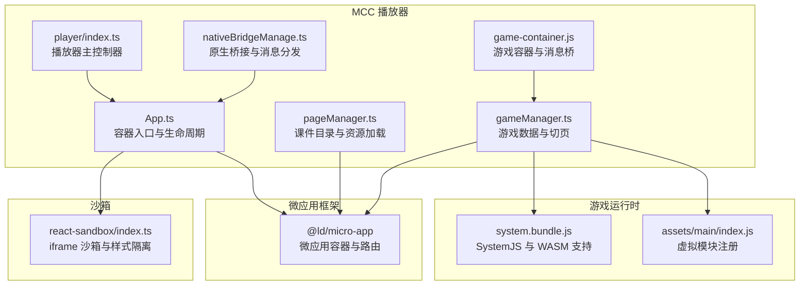
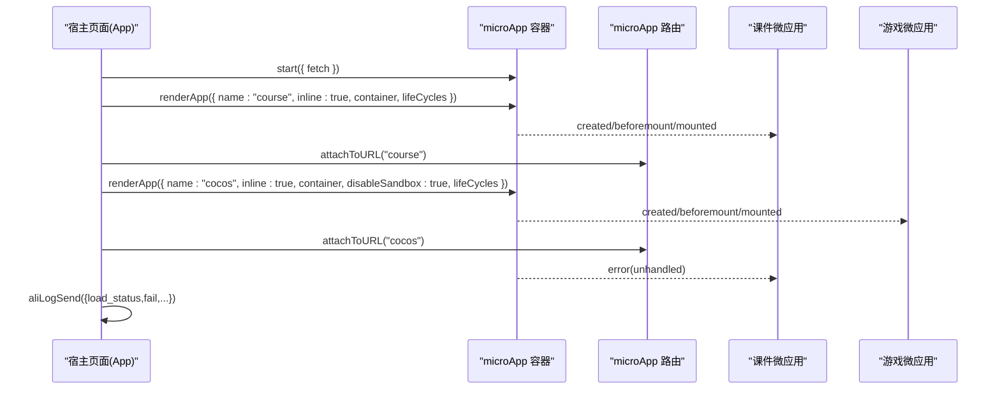
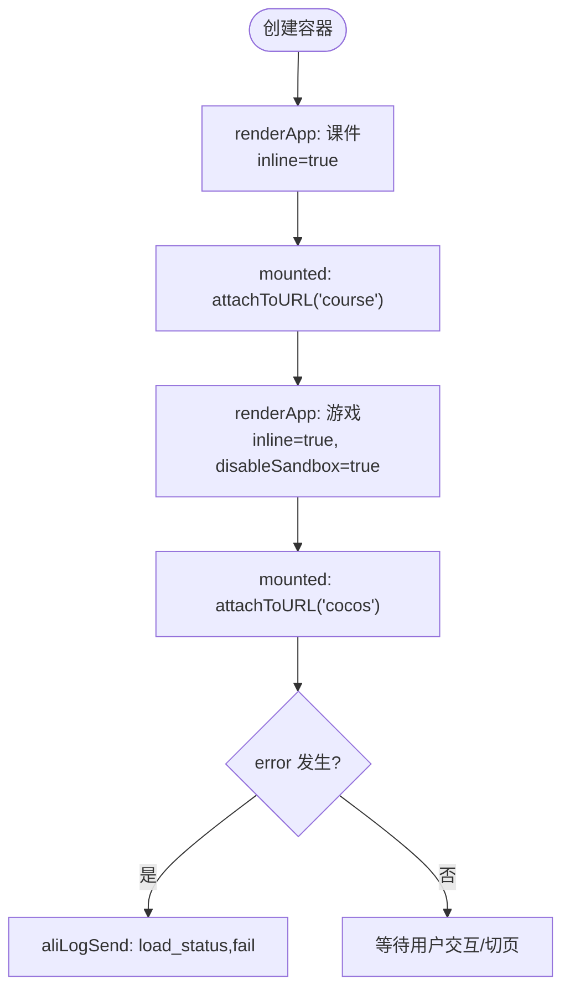
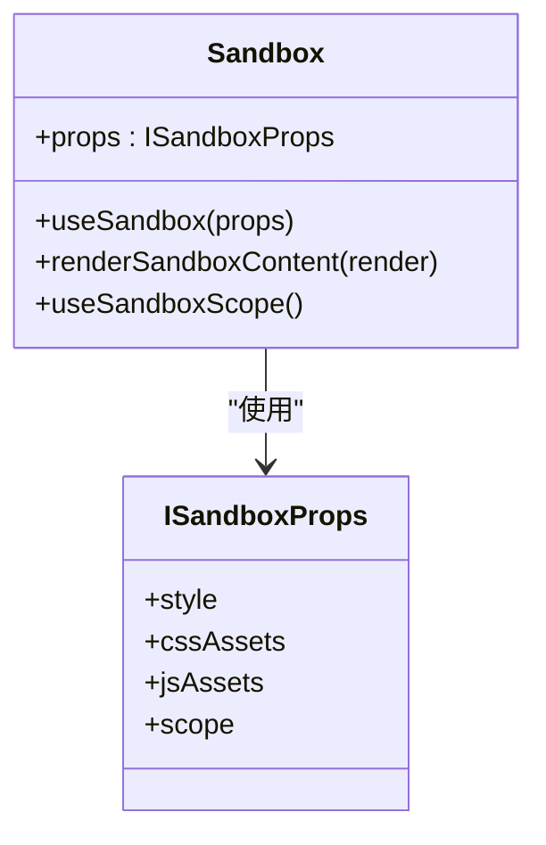
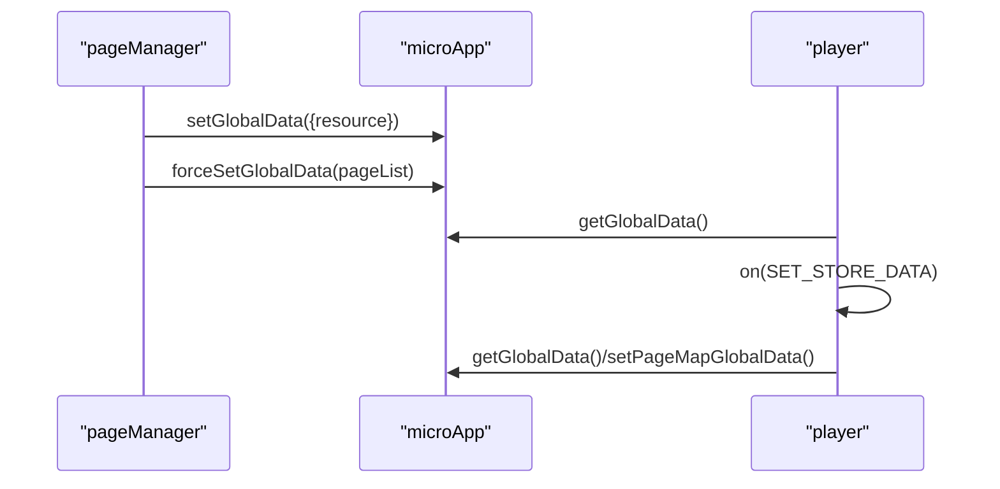
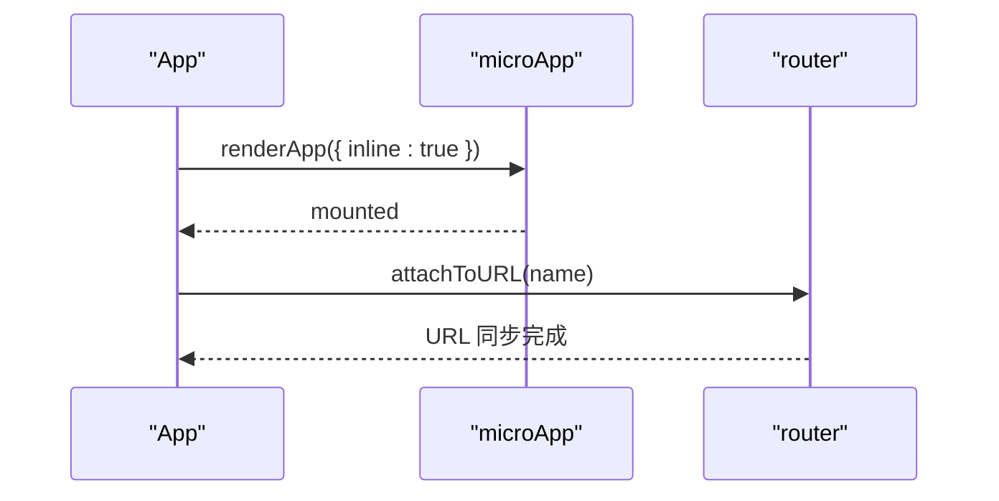
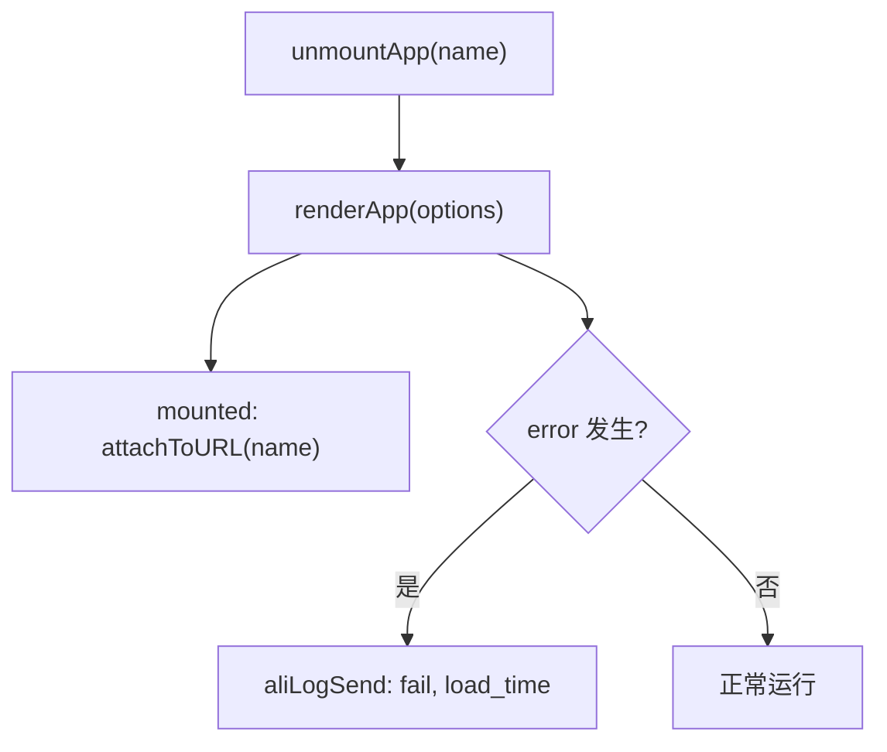
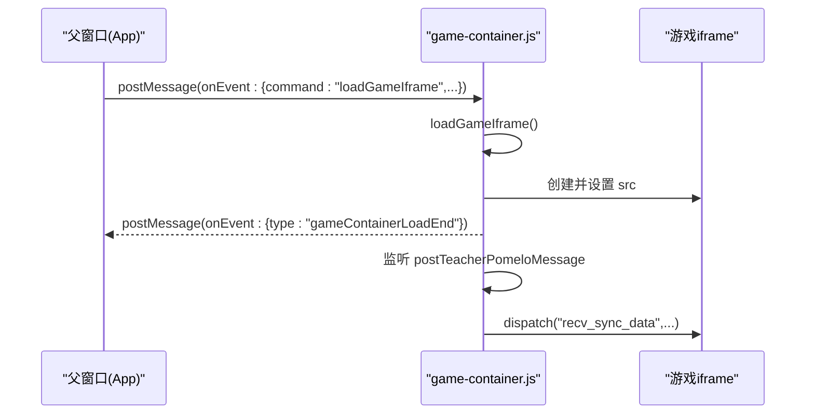
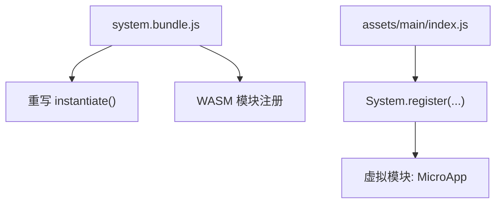
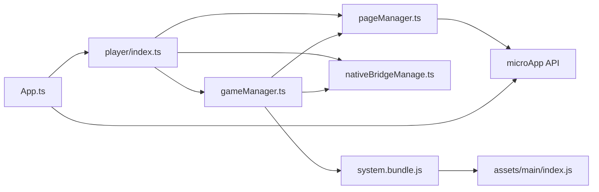

# 微应用容器架构

<cite>
**本文引用的文件**
- [App.ts](file://bridge/mcc-player/src/App.ts)
- [game-container.js](file://bridge/mcc-player/gameStatic/game-container.js)
- [index.ts](file://packages/react-sandbox/src/index.ts)
- [index.ts](file://bridge/mcc-player/src/components/player/index.ts)
- [pageManager.ts](file://bridge/mcc-player/src/components/page/pageManager.ts)
- [gameManager.ts](file://bridge/mcc-player/src/components/game-manage/gameManager.ts)
- [nativeBridgeManage.ts](file://bridge/mcc-player/src/components/native-bridge/nativeBridgeManage.ts)
- [index.d.ts](file://preview/index.d.ts)
- [system.bundle.js](file://bridge/cocos-game-player/src/system.bundle.js)
- [index.js](file://bridge/cocos-game-player/assets/main/index.js)
</cite>

## 目录
1. [引言](#引言)
2. [项目结构](#项目结构)
3. [核心组件](#核心组件)
4. [架构总览](#架构总览)
5. [详细组件分析](#详细组件分析)
6. [依赖分析](#依赖分析)
7. [性能考虑](#性能考虑)
8. [故障排查指南](#故障排查指南)
9. [结论](#结论)
10. [附录](#附录)

## 引言
本技术文档围绕微应用容器架构展开，重点解释 microApp 框架在 MCC（课程与游戏）播放器中的集成方式与容器化设计原理。内容涵盖应用生命周期管理、沙箱隔离机制、资源加载策略、DOM 结构管理与样式隔离、inline 模式与路由绑定、应用挂载/卸载与错误处理、fetch 自定义配置以及全局数据监听机制。文档提供架构图与组件关系说明，帮助开发者快速理解并扩展该容器体系。

## 项目结构
本仓库包含多个子项目与包，其中与微应用容器直接相关的关键模块如下：
- bridge/mcc-player：MCC 播放器前端，负责微应用容器的创建、生命周期编排、资源加载与全局数据同步。
- packages/react-sandbox：基于 iframe 的 React 沙箱实现，用于编辑器场景下的隔离渲染。
- bridge/cocos-game-player：Cocos 游戏运行时与 SystemJS 打包脚本，支撑游戏主包与框架包加载。
- preview：预览环境类型声明，包含微应用运行时环境变量声明。

**图表来源**
- [App.ts:15-29](file://bridge/mcc-player/src/App.ts#L15-L29)
- [index.ts:18-97](file://packages/react-sandbox/src/index.ts#L18-L97)
- [system.bundle.js:536-538](file://bridge/cocos-game-player/src/system.bundle.js#L536-L538)
- [index.js:551-558](file://bridge/cocos-game-player/assets/main/index.js#L551-L558)

**章节来源**
- [App.ts:15-29](file://bridge/mcc-player/src/App.ts#L15-L29)
- [index.ts:18-97](file://packages/react-sandbox/src/index.ts#L18-L97)
- [system.bundle.js:536-538](file://bridge/cocos-game-player/src/system.bundle.js#L536-L538)
- [index.js:551-558](file://bridge/cocos-game-player/assets/main/index.js#L551-L558)

## 核心组件
- 容器入口与生命周期编排：App 类负责创建容器、启动微应用、挂载/卸载微应用、绑定生命周期钩子与路由。
- 播放器主控制器：player/index.ts 管理初始化参数、课件/游戏 URL 设置、全局数据同步与错误监听。
- 课件目录与资源加载：pageManager.ts 负责目录与页面 JSON 的拉取、本地/远程回退策略、全局数据注入。
- 游戏数据与切页：gameManager.ts 维护游戏页映射、预加载、切页消息与 URL 参数生成。
- 原生桥接与消息分发：nativeBridgeManage.ts 提供统一消息通道、Pomelo 通信与超时处理。
- 游戏容器与消息桥：game-container.js 负责 iframe 加载、消息转发与事件回调。
- 微应用框架：@ld/micro-app 提供容器、路由、生命周期钩子与全局数据 API。
- React 沙箱：react-sandbox/index.ts 提供 iframe 沙箱、样式隔离与根节点渲染。
- 游戏运行时：system.bundle.js 与 assets/main/index.js 提供 SystemJS 注册与 WASM 支持。

**章节来源**
- [App.ts:31-197](file://bridge/mcc-player/src/App.ts#L31-L197)
- [index.ts:24-363](file://bridge/mcc-player/src/components/player/index.ts#L24-L363)
- [pageManager.ts:17-498](file://bridge/mcc-player/src/components/page/pageManager.ts#L17-L498)
- [gameManager.ts:65-368](file://bridge/mcc-player/src/components/game-manage/gameManager.ts#L65-L368)
- [nativeBridgeManage.ts:26-395](file://bridge/mcc-player/src/components/native-bridge/nativeBridgeManage.ts#L26-L395)
- [game-container.js:1-173](file://bridge/mcc-player/gameStatic/game-container.js#L1-L173)
- [index.ts:18-133](file://packages/react-sandbox/src/index.ts#L18-L133)
- [system.bundle.js:536-538](file://bridge/cocos-game-player/src/system.bundle.js#L536-L538)
- [index.js:551-558](file://bridge/cocos-game-player/assets/main/index.js#L551-L558)

## 架构总览
微应用容器采用“播放器主控制器 + 微应用容器 + 路由绑定 + 全局数据监听”的组合模式：
- 容器入口通过 microApp.start 配置自定义 fetch，随后使用 renderApp 挂载课件与游戏微应用。
- inline 模式确保微应用 DOM 直接插入指定容器，便于与游戏容器叠加显示。
- disableSandbox 用于游戏主包，避免重复隔离导致的复杂性。
- 生命周期钩子 created/beforemount/mounted/unmount/error 串联应用状态与日志上报。
- 全局数据通过 microApp.setGlobalData/forceSetGlobalData 注入，支持按页聚合与增量更新。
- 原生桥接统一处理消息与超时，Pomelo 通道用于跨端同步。

**图表来源**
- [App.ts:15-29](file://bridge/mcc-player/src/App.ts#L15-L29)
- [App.ts:119-152](file://bridge/mcc-player/src/App.ts#L119-L152)
- [App.ts:163-187](file://bridge/mcc-player/src/App.ts#L163-L187)

**章节来源**
- [App.ts:15-29](file://bridge/mcc-player/src/App.ts#L15-L29)
- [App.ts:119-152](file://bridge/mcc-player/src/App.ts#L119-L152)
- [App.ts:163-187](file://bridge/mcc-player/src/App.ts#L163-L187)

## 详细组件分析

### 容器创建与生命周期管理
- 容器创建：App 构造函数中创建 mcc-container 容器并挂载到 rootElement。
- 生命周期钩子：在 renderApp 中传入 lifeCycles，分别记录 created/beforemount/mounted/unmount/error。
- 错误处理：error 钩子中触发 aliLogSend 上报加载失败与耗时。
- 路由绑定：mounted 后调用 router.attachToURL 将微应用与 URL 绑定，实现基于 URL 的路由同步。

**图表来源**
- [App.ts:48-52](file://bridge/mcc-player/src/App.ts#L48-L52)
- [App.ts:119-152](file://bridge/mcc-player/src/App.ts#L119-L152)
- [App.ts:163-187](file://bridge/mcc-player/src/App.ts#L163-L187)

**章节来源**
- [App.ts:38-52](file://bridge/mcc-player/src/App.ts#L38-L52)
- [App.ts:119-152](file://bridge/mcc-player/src/App.ts#L119-L152)
- [App.ts:163-187](file://bridge/mcc-player/src/App.ts#L163-L187)

### 沙箱隔离机制与样式隔离
- iframe 沙箱：useSandbox 在目标 iframe 中写入样式与脚本，注入设计器上下文变量，设置根节点 __SANDBOX_ROOT__。
- 样式隔离：通过内联样式与 CSS 变量继承，确保沙箱内滚动条与背景色与宿主一致，避免样式污染。
- 内存回收：在 iframe unload 事件中主动卸载 React 根节点，防止内存泄漏。

**图表来源**
- [index.ts:11-16](file://packages/react-sandbox/src/index.ts#L11-L16)
- [index.ts:18-97](file://packages/react-sandbox/src/index.ts#L18-L97)
- [index.ts:110-117](file://packages/react-sandbox/src/index.ts#L110-L117)

**章节来源**
- [index.ts:18-97](file://packages/react-sandbox/src/index.ts#L18-L97)
- [index.ts:110-117](file://packages/react-sandbox/src/index.ts#L110-L117)

### 资源加载策略与全局数据监听
- fetch 自定义：microApp.start 中提供自定义 fetch，统一走 axios，设置 Accept 并返回 res.data。
- 全局数据注入：pageManager.setCatalogueData 中通过 microApp.setGlobalData 注入资源路径；setGlobalData 使用 forceSetGlobalData 实现强制更新。
- 全局数据监听：player.on(SET_STORE_DATA) 与 microApp.getGlobalData() 结合，周期性上报与恢复状态。

**图表来源**
- [pageManager.ts:264-269](file://bridge/mcc-player/src/components/page/pageManager.ts#L264-L269)
- [pageManager.ts:391-396](file://bridge/mcc-player/src/components/page/pageManager.ts#L391-L396)
- [index.ts:147-223](file://bridge/mcc-player/src/components/player/index.ts#L147-L223)

**章节来源**
- [App.ts:15-29](file://bridge/mcc-player/src/App.ts#L15-L29)
- [pageManager.ts:264-269](file://bridge/mcc-player/src/components/page/pageManager.ts#L264-L269)
- [pageManager.ts:391-396](file://bridge/mcc-player/src/components/page/pageManager.ts#L391-L396)
- [index.ts:147-223](file://bridge/mcc-player/src/components/player/index.ts#L147-L223)

### inline 模式与路由绑定
- inline 模式：课件与游戏均以 inline: true 方式渲染，DOM 直接插入容器，便于叠加显示与定位。
- 路由绑定：mounted 后调用 router.attachToURL，将微应用与 URL 绑定，实现基于 URL 的路由同步与状态恢复。

**图表来源**
- [App.ts:119-152](file://bridge/mcc-player/src/App.ts#L119-L152)
- [App.ts:163-187](file://bridge/mcc-player/src/App.ts#L163-L187)

**章节来源**
- [App.ts:119-152](file://bridge/mcc-player/src/App.ts#L119-L152)
- [App.ts:163-187](file://bridge/mcc-player/src/App.ts#L163-L187)

### 应用挂载、卸载与错误处理
- 卸载：在切换应用时先 unmountApp，确保旧应用资源释放。
- 挂载：renderApp 完成后通过 router.attachToURL 绑定路由。
- 错误处理：error 钩子中记录错误并上报 aliLogSend，包含加载耗时统计。

**图表来源**
- [App.ts:117-118](file://bridge/mcc-player/src/App.ts#L117-L118)
- [App.ts:161-162](file://bridge/mcc-player/src/App.ts#L161-L162)
- [App.ts:140-149](file://bridge/mcc-player/src/App.ts#L140-L149)

**章节来源**
- [App.ts:117-118](file://bridge/mcc-player/src/App.ts#L117-L118)
- [App.ts:161-162](file://bridge/mcc-player/src/App.ts#L161-L162)
- [App.ts:140-149](file://bridge/mcc-player/src/App.ts#L140-L149)

### 游戏容器与消息桥
- 游戏容器：game-container.js 创建并管理游戏 iframe，监听来自父窗口的消息，转发至游戏。
- 事件回调：支持 loadGameIframe、sendGameSyncAction 等命令，实现加载与同步。
- 与播放器联动：通过 window.parent.postMessage 与父窗口通信，实现加载完成与状态同步。

**图表来源**
- [game-container.js:19-34](file://bridge/mcc-player/gameStatic/game-container.js#L19-L34)
- [game-container.js:37-55](file://bridge/mcc-player/gameStatic/game-container.js#L37-L55)
- [game-container.js:165-171](file://bridge/mcc-player/gameStatic/game-container.js#L165-L171)

**章节来源**
- [game-container.js:19-34](file://bridge/mcc-player/gameStatic/game-container.js#L19-L34)
- [game-container.js:37-55](file://bridge/mcc-player/gameStatic/game-container.js#L37-L55)
- [game-container.js:165-171](file://bridge/mcc-player/gameStatic/game-container.js#L165-L171)

### 游戏运行时与 SystemJS
- SystemJS 注册：system.bundle.js 重写 instantiate 与 wasmModules，确保模块化加载与 WASM 支持。
- 虚拟模块：assets/main/index.js 中注册虚拟模块（如 MicroApp），供游戏侧引用。

**图表来源**
- [system.bundle.js:536-538](file://bridge/cocos-game-player/src/system.bundle.js#L536-L538)
- [system.bundle.js:1020-1042](file://bridge/cocos-game-player/src/system.bundle.js#L1020-L1042)
- [index.js:551-558](file://bridge/cocos-game-player/assets/main/index.js#L551-L558)

**章节来源**
- [system.bundle.js:536-538](file://bridge/cocos-game-player/src/system.bundle.js#L536-L538)
- [system.bundle.js:1020-1042](file://bridge/cocos-game-player/src/system.bundle.js#L1020-L1042)
- [index.js:551-558](file://bridge/cocos-game-player/assets/main/index.js#L551-L558)

## 依赖分析
- 容器入口依赖微应用框架与播放器控制器，控制器进一步依赖页面管理器、游戏管理器与原生桥接。
- 游戏管理器依赖页面管理器与原生桥接，负责游戏 URL 参数与切页消息。
- 页面管理器依赖微应用全局数据 API 与网络请求库，负责目录与页面 JSON 的拉取与缓存。
- 原生桥接提供统一消息通道，支持超时与 Promise 化调用。
- 游戏容器依赖父窗口消息协议，实现加载与同步。

**图表来源**
- [App.ts:1-200](file://bridge/mcc-player/src/App.ts#L1-L200)
- [index.ts:24-363](file://bridge/mcc-player/src/components/player/index.ts#L24-L363)
- [pageManager.ts:17-498](file://bridge/mcc-player/src/components/page/pageManager.ts#L17-L498)
- [gameManager.ts:65-368](file://bridge/mcc-player/src/components/game-manage/gameManager.ts#L65-L368)
- [nativeBridgeManage.ts:26-395](file://bridge/mcc-player/src/components/native-bridge/nativeBridgeManage.ts#L26-L395)
- [system.bundle.js:536-538](file://bridge/cocos-game-player/src/system.bundle.js#L536-L538)
- [index.js:551-558](file://bridge/cocos-game-player/assets/main/index.js#L551-L558)

**章节来源**
- [App.ts:1-200](file://bridge/mcc-player/src/App.ts#L1-L200)
- [index.ts:24-363](file://bridge/mcc-player/src/components/player/index.ts#L24-L363)
- [pageManager.ts:17-498](file://bridge/mcc-player/src/components/page/pageManager.ts#L17-L498)
- [gameManager.ts:65-368](file://bridge/mcc-player/src/components/game-manage/gameManager.ts#L65-L368)
- [nativeBridgeManage.ts:26-395](file://bridge/mcc-player/src/components/native-bridge/nativeBridgeManage.ts#L26-L395)
- [system.bundle.js:536-538](file://bridge/cocos-game-player/src/system.bundle.js#L536-L538)
- [index.js:551-558](file://bridge/cocos-game-player/assets/main/index.js#L551-L558)

## 性能考虑
- 资源加载优先级：优先尝试本地资源，失败后按 CDN 列表回退；对页面 JSON 采用并发请求与缓存策略，减少重复请求。
- 渲染策略：inline 模式减少额外容器层级，降低 DOM 树深度；游戏主包 disableSandbox 避免重复隔离带来的性能损耗。
- 错误与日志：在 error 钩子中记录失败与耗时，便于定位慢加载与失败原因。
- 内存回收：iframe unload 时主动卸载 React 根节点，避免长期驻留导致的内存增长。

[本节为通用建议，无需列出具体文件来源]

## 故障排查指南
- 微应用加载失败：检查 error 生命周期钩子是否触发，查看 aliLogSend 的失败信息与耗时。
- 路由不同步：确认 mounted 后是否调用 router.attachToURL，检查 URL 与路由配置一致性。
- 全局数据异常：核对 pageManager.setGlobalData 与 player.on(SET_STORE_DATA) 的调用顺序，确保数据注入与监听时机正确。
- 游戏 iframe 无法加载：检查 game-container.js 的消息监听与 loadGameIframe 流程，确认父窗口消息通道是否畅通。
- 原生通信超时：检查 nativeBridgeManage 的 callNative 超时设置与消息回调，确认端上响应是否及时。

**章节来源**
- [App.ts:140-149](file://bridge/mcc-player/src/App.ts#L140-L149)
- [App.ts:133-136](file://bridge/mcc-player/src/App.ts#L133-L136)
- [index.ts:147-223](file://bridge/mcc-player/src/components/player/index.ts#L147-L223)
- [game-container.js:19-34](file://bridge/mcc-player/gameStatic/game-container.js#L19-L34)
- [nativeBridgeManage.ts:156-175](file://bridge/mcc-player/src/components/native-bridge/nativeBridgeManage.ts#L156-L175)

## 结论
该微应用容器架构通过 microApp 框架实现了课件与游戏的统一挂载、路由绑定与生命周期管理，并结合 fetch 自定义、全局数据监听与原生桥接，构建了稳定可扩展的播放器体系。inline 模式与 disableSandbox 的合理使用兼顾了性能与隔离需求；React 沙箱与 SystemJS 运行时为编辑器与游戏提供了可靠的隔离与模块化支持。整体设计清晰、职责明确，便于二次开发与功能扩展。

[本节为总结性内容，无需列出具体文件来源]

## 附录
- 微应用运行时环境变量声明：用于标识微应用运行环境，辅助调试与兼容性处理。

**章节来源**
- [index.d.ts:1-4](file://preview/index.d.ts#L1-L4)