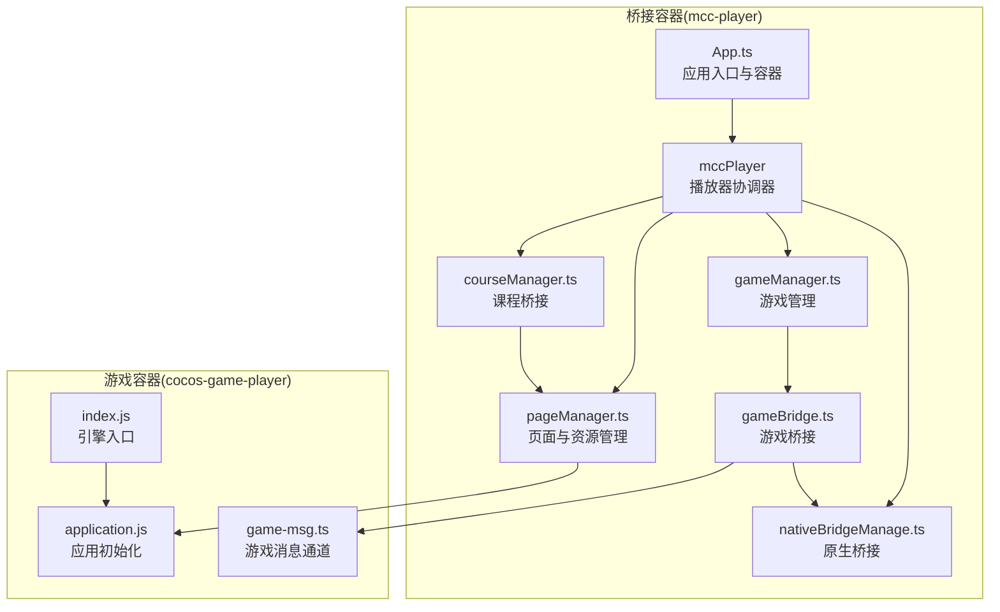
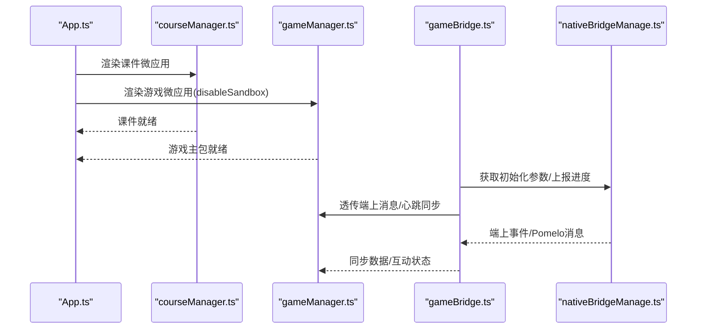
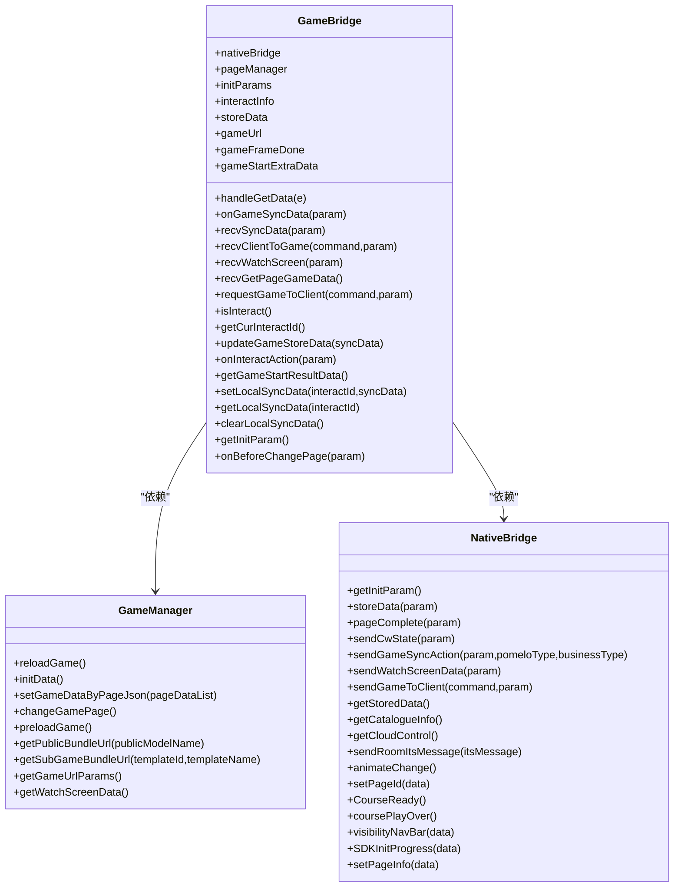
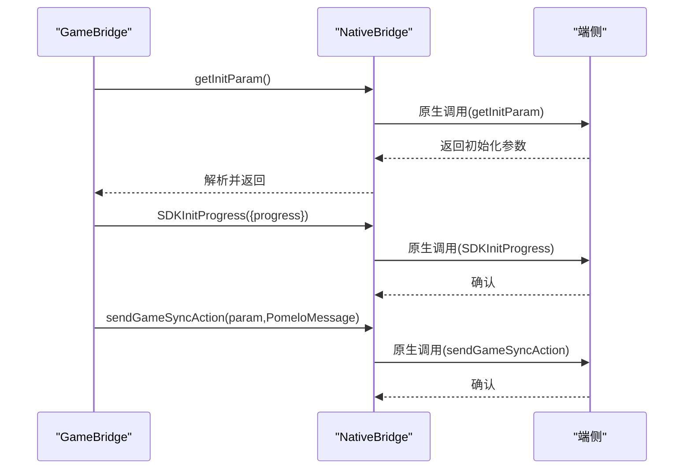
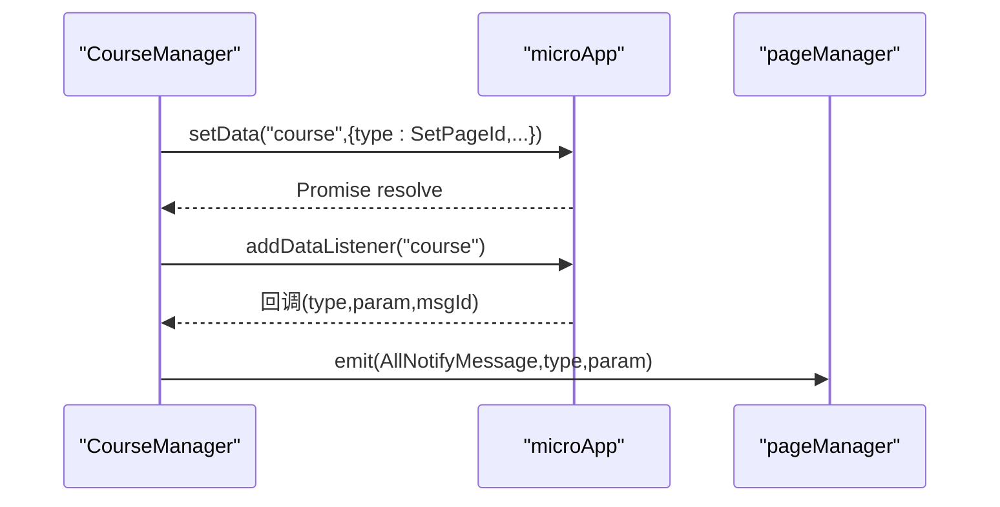
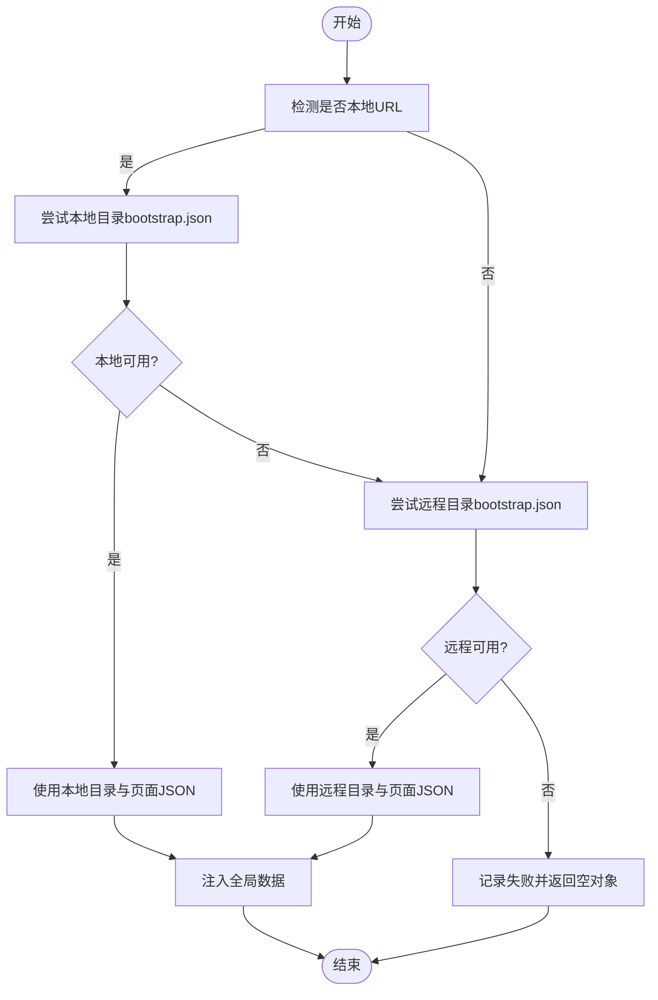
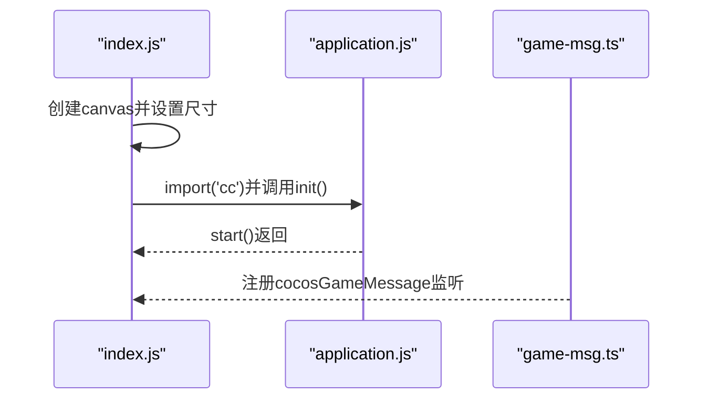
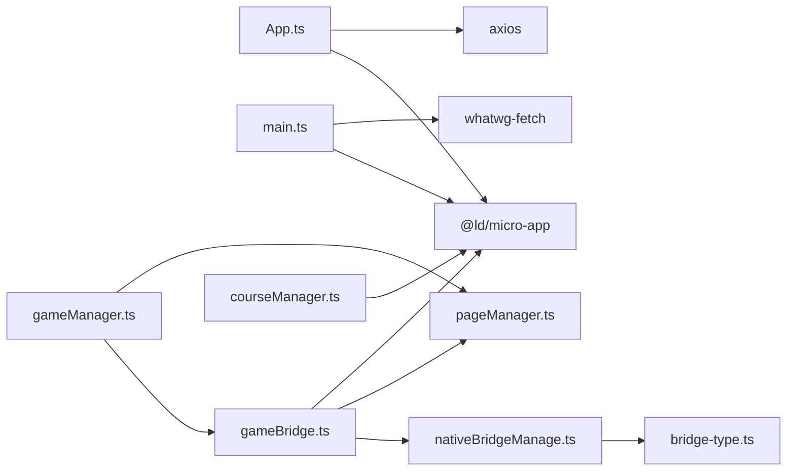

# 桥接架构设计

<cite>
**本文档引用的文件**
- [bridge/mcc-player/src/App.ts](file://bridge/mcc-player/src/App.ts)
- [bridge/mcc-player/src/main.ts](file://bridge/mcc-player/src/main.ts)
- [bridge/mcc-player/src/components/game-manage/gameBridge.ts](file://bridge/mcc-player/src/components/game-manage/gameBridge.ts)
- [bridge/mcc-player/src/components/game-manage/gameManager.ts](file://bridge/mcc-player/src/components/game-manage/gameManager.ts)
- [bridge/mcc-player/src/components/game-manage/type.ts](file://bridge/mcc-player/src/components/game-manage/type.ts)
- [bridge/mcc-player/src/components/native-bridge/nativeBridgeManage.ts](file://bridge/mcc-player/src/components/native-bridge/nativeBridgeManage.ts)
- [bridge/mcc-player/src/components/native-bridge/bridge-type.ts](file://bridge/mcc-player/src/components/native-bridge/bridge-type.ts)
- [bridge/mcc-player/src/components/course-bridge/courseManager.ts](file://bridge/mcc-player/src/components/course-bridge/courseManager.ts)
- [bridge/mcc-player/src/components/course-bridge/type.ts](file://bridge/mcc-player/src/components/course-bridge/type.ts)
- [bridge/mcc-player/src/components/page/pageManager.ts](file://bridge/mcc-player/src/components/page/pageManager.ts)
- [bridge/mcc-player/src/components/game-manage/game-msg.ts](file://bridge/mcc-player/src/components/game-manage/game-msg.ts)
- [bridge/cocos-game-player/application.js](file://bridge/cocos-game-player/application.js)
- [bridge/cocos-game-player/index.js](file://bridge/cocos-game-player/index.js)
- [bridge/mcc-player/package.json](file://bridge/mcc-player/package.json)
</cite>

## 目录
1. [引言](#引言)
2. [项目结构](#项目结构)
3. [核心组件](#核心组件)
4. [架构总览](#架构总览)
5. [详细组件分析](#详细组件分析)
6. [依赖分析](#依赖分析)
7. [性能考虑](#性能考虑)
8. [故障排查指南](#故障排查指南)
9. [结论](#结论)
10. [附录](#附录)

## 引言
本技术文档围绕“游戏桥接系统”的架构设计展开，重点阐述微应用容器架构与 microApp 框架的集成方式、应用生命周期管理、应用隔离与资源共享、通信机制，以及原生桥接与课程桥接的双重架构模式。文档旨在帮助开发者快速理解系统整体设计思路与扩展点，并提供架构图与组件关系说明。

## 项目结构
本仓库包含三大核心部分：
- 游戏容器与运行时：基于 Cocos 引擎的应用入口与初始化逻辑，负责游戏生命周期与资源加载。
- 桥接容器（mcc-player）：基于 microApp 的微前端容器，承载课件与游戏两个微应用，统一调度与通信。
- 桥接层（Native/Course/Game）：提供与端侧（Native）的通信、课件桥接与游戏桥接的协议与实现。

**图表来源**
- [bridge/mcc-player/src/App.ts:15-29](file://bridge/mcc-player/src/App.ts#L15-L29)
- [bridge/mcc-player/src/components/page/pageManager.ts:17-76](file://bridge/mcc-player/src/components/page/pageManager.ts#L17-L76)
- [bridge/mcc-player/src/components/native-bridge/nativeBridgeManage.ts:26-30](file://bridge/mcc-player/src/components/native-bridge/nativeBridgeManage.ts#L26-L30)
- [bridge/mcc-player/src/components/course-bridge/courseManager.ts:13-17](file://bridge/mcc-player/src/components/course-bridge/courseManager.ts#L13-L17)
- [bridge/mcc-player/src/components/game-manage/gameManager.ts:65-72](file://bridge/mcc-player/src/components/game-manage/gameManager.ts#L65-L72)
- [bridge/mcc-player/src/components/game-manage/gameBridge.ts:22-42](file://bridge/mcc-player/src/components/game-manage/gameBridge.ts#L22-L42)
- [bridge/cocos-game-player/index.js:14-29](file://bridge/cocos-game-player/index.js#L14-L29)
- [bridge/cocos-game-player/application.js:14-62](file://bridge/cocos-game-player/application.js#L14-L62)
- [bridge/mcc-player/src/components/game-manage/game-msg.ts:6-50](file://bridge/mcc-player/src/components/game-manage/game-msg.ts#L6-L50)

**章节来源**
- [bridge/mcc-player/src/App.ts:15-29](file://bridge/mcc-player/src/App.ts#L15-L29)
- [bridge/mcc-player/src/main.ts:7-20](file://bridge/mcc-player/src/main.ts#L7-L20)
- [bridge/mcc-player/package.json:21-27](file://bridge/mcc-player/package.json#L21-L27)

## 核心组件
- 容器与入口
  - App.ts：初始化 microApp，挂载课件与游戏微应用，管理容器样式与可见性切换。
  - main.ts：polyfill 注入、事件中心初始化、应用启动。
- 页面与资源管理
  - pageManager.ts：目录解析、本地/远程资源拉取、全局数据注入、埋点日志。
- 原生桥接
  - nativeBridgeManage.ts：统一消息分发、与端侧通信、Pomelo 消息转发、进度上报。
  - bridge-type.ts：命令枚举与参数类型定义。
- 课程桥接
  - courseManager.ts：基于 microApp 的跨应用数据通道，封装 setData/setDataListener。
  - course-bridge/type.ts：课件事件与命令枚举。
- 游戏桥接与管理
  - gameBridge.ts：游戏与 MCC 的消息编排、心跳与同步、互动状态管理、与原生桥接联动。
  - gameManager.ts：游戏资源路径计算、切页与暂停/恢复、预加载、与页面管理联动。
  - game-manage/type.ts：游戏事件与命令枚举。
- 游戏运行时
  - index.js / application.js：Cocos 引擎入口与应用初始化。
  - game-msg.ts：游戏侧消息通道，供游戏与 MCC 通信。

**章节来源**
- [bridge/mcc-player/src/App.ts:31-90](file://bridge/mcc-player/src/App.ts#L31-L90)
- [bridge/mcc-player/src/main.ts:7-20](file://bridge/mcc-player/src/main.ts#L7-L20)
- [bridge/mcc-player/src/components/page/pageManager.ts:17-76](file://bridge/mcc-player/src/components/page/pageManager.ts#L17-L76)
- [bridge/mcc-player/src/components/native-bridge/nativeBridgeManage.ts:26-30](file://bridge/mcc-player/src/components/native-bridge/nativeBridgeManage.ts#L26-L30)
- [bridge/mcc-player/src/components/native-bridge/bridge-type.ts:3-73](file://bridge/mcc-player/src/components/native-bridge/bridge-type.ts#L3-L73)
- [bridge/mcc-player/src/components/course-bridge/courseManager.ts:13-17](file://bridge/mcc-player/src/components/course-bridge/courseManager.ts#L13-L17)
- [bridge/mcc-player/src/components/course-bridge/type.ts:1-55](file://bridge/mcc-player/src/components/course-bridge/type.ts#L1-L55)
- [bridge/mcc-player/src/components/game-manage/gameBridge.ts:22-42](file://bridge/mcc-player/src/components/game-manage/gameBridge.ts#L22-L42)
- [bridge/mcc-player/src/components/game-manage/gameManager.ts:65-72](file://bridge/mcc-player/src/components/game-manage/gameManager.ts#L65-L72)
- [bridge/mcc-player/src/components/game-manage/type.ts:1-67](file://bridge/mcc-player/src/components/game-manage/type.ts#L1-L67)
- [bridge/cocos-game-player/index.js:14-29](file://bridge/cocos-game-player/index.js#L14-L29)
- [bridge/cocos-game-player/application.js:14-62](file://bridge/cocos-game-player/application.js#L14-L62)
- [bridge/mcc-player/src/components/game-manage/game-msg.ts:6-50](file://bridge/mcc-player/src/components/game-manage/game-msg.ts#L6-L50)

## 架构总览
系统采用“双桥接 + 微应用容器”的架构模式：
- 原生桥接：MCC 与端侧（Native/Web）通信，负责参数获取、状态上报、切页、进度上报、Pomelo 消息转发等。
- 课程桥接：MCC 与课件微应用通过 microApp 数据通道通信，实现页 ID 设置、状态恢复、尺寸变更等。
- 游戏桥接：MCC 与游戏微应用通过自定义消息通道与 microApp 全局数据通信，实现心跳同步、互动授权、切页与暂停/恢复等。
- 容器化设计：使用 microApp 管理课件与游戏两个微应用，支持 inline 渲染、生命周期钩子、路由绑定与沙箱禁用策略。

**图表来源**
- [bridge/mcc-player/src/App.ts:115-196](file://bridge/mcc-player/src/App.ts#L115-L196)
- [bridge/mcc-player/src/components/course-bridge/courseManager.ts:40-72](file://bridge/mcc-player/src/components/course-bridge/courseManager.ts#L40-L72)
- [bridge/mcc-player/src/components/game-manage/gameManager.ts:200-260](file://bridge/mcc-player/src/components/game-manage/gameManager.ts#L200-L260)
- [bridge/mcc-player/src/components/game-manage/gameBridge.ts:59-110](file://bridge/mcc-player/src/components/game-manage/gameBridge.ts#L59-L110)
- [bridge/mcc-player/src/components/native-bridge/nativeBridgeManage.ts:211-214](file://bridge/mcc-player/src/components/native-bridge/nativeBridgeManage.ts#L211-L214)

## 详细组件分析

### 游戏桥接组件分析
- 设计要点
  - 使用自定义全局消息通道（cocosGameMessage）实现游戏与 MCC 的双向通信。
  - 基于 microApp 全局数据与事件中心实现跨应用数据共享与生命周期联动。
  - 通过 PageManage 与 GameManager 协同，实现切页、暂停/恢复、预加载与资源路径计算。
- 关键流程
  - 游戏启动阶段：请求主包/框架加载完成，回调参数由 GameManager 提供。
  - 心跳与同步：区分“主端”与“互动端”，分别写入全局数据或本地存储，并广播操作数据。
  - 互动授权：记录互动状态与互动 ID，支持开始/取消互动时的数据回放与透传。
  - 端上消息透传：将端上指令（如暂停/恢复、FPS 设置）转换为游戏可识别的消息。

**图表来源**
- [bridge/mcc-player/src/components/game-manage/gameBridge.ts:22-388](file://bridge/mcc-player/src/components/game-manage/gameBridge.ts#L22-L388)
- [bridge/mcc-player/src/components/game-manage/gameManager.ts:65-368](file://bridge/mcc-player/src/components/game-manage/gameManager.ts#L65-L368)
- [bridge/mcc-player/src/components/native-bridge/nativeBridgeManage.ts:26-395](file://bridge/mcc-player/src/components/native-bridge/nativeBridgeManage.ts#L26-L395)

**章节来源**
- [bridge/mcc-player/src/components/game-manage/gameBridge.ts:59-163](file://bridge/mcc-player/src/components/game-manage/gameBridge.ts#L59-L163)
- [bridge/mcc-player/src/components/game-manage/gameBridge.ts:194-243](file://bridge/mcc-player/src/components/game-manage/gameBridge.ts#L194-L243)
- [bridge/mcc-player/src/components/game-manage/gameBridge.ts:286-320](file://bridge/mcc-player/src/components/game-manage/gameBridge.ts#L286-L320)
- [bridge/mcc-player/src/components/game-manage/gameManager.ts:198-260](file://bridge/mcc-player/src/components/game-manage/gameManager.ts#L198-L260)
- [bridge/mcc-player/src/components/game-manage/gameManager.ts:264-332](file://bridge/mcc-player/src/components/game-manage/gameManager.ts#L264-L332)

### 原生桥接组件分析
- 设计要点
  - 统一消息监听与分发，兼容 Web 与 Native 环境。
  - 通过 Pomelo 消息类型区分常规消息与教师端定向消息。
  - 提供丰富的命令集：初始化参数、存储数据、目录信息、切页、进度上报、动画状态等。
- 关键流程
  - 初始化参数获取：调用端侧接口并等待响应。
  - 数据存储与读取：支持服务端数据拉取与本地存储。
  - 切页与进度上报：在合适时机上报 SDK 初始化进度，配合页面加载状态。

**图表来源**
- [bridge/mcc-player/src/components/native-bridge/nativeBridgeManage.ts:211-214](file://bridge/mcc-player/src/components/native-bridge/nativeBridgeManage.ts#L211-L214)
- [bridge/mcc-player/src/components/native-bridge/nativeBridgeManage.ts:375-388](file://bridge/mcc-player/src/components/native-bridge/nativeBridgeManage.ts#L375-L388)
- [bridge/mcc-player/src/components/native-bridge/nativeBridgeManage.ts:254-262](file://bridge/mcc-player/src/components/native-bridge/nativeBridgeManage.ts#L254-L262)

**章节来源**
- [bridge/mcc-player/src/components/native-bridge/nativeBridgeManage.ts:65-90](file://bridge/mcc-player/src/components/native-bridge/nativeBridgeManage.ts#L65-L90)
- [bridge/mcc-player/src/components/native-bridge/nativeBridgeManage.ts:144-175](file://bridge/mcc-player/src/components/native-bridge/nativeBridgeManage.ts#L144-L175)
- [bridge/mcc-player/src/components/native-bridge/nativeBridgeManage.ts:254-262](file://bridge/mcc-player/src/components/native-bridge/nativeBridgeManage.ts#L254-L262)

### 课程桥接组件分析
- 设计要点
  - 基于 microApp 的全局数据通道，封装 setData/setDataListener，实现课件与 MCC 的解耦通信。
  - 提供页 ID 设置、状态恢复、尺寸变更、UID 设置等常用命令。
- 关键流程
  - 目录与页面 JSON 的本地/远程优先级拉取与回退策略。
  - 全局数据注入与跨应用数据监听，确保课件与 MCC 的状态一致。

**图表来源**
- [bridge/mcc-player/src/components/course-bridge/courseManager.ts:40-72](file://bridge/mcc-player/src/components/course-bridge/courseManager.ts#L40-L72)
- [bridge/mcc-player/src/components/page/pageManager.ts:391-396](file://bridge/mcc-player/src/components/page/pageManager.ts#L391-L396)

**章节来源**
- [bridge/mcc-player/src/components/course-bridge/courseManager.ts:20-47](file://bridge/mcc-player/src/components/course-bridge/courseManager.ts#L20-L47)
- [bridge/mcc-player/src/components/course-bridge/type.ts:14-21](file://bridge/mcc-player/src/components/course-bridge/type.ts#L14-L21)

### 页面与资源管理分析
- 设计要点
  - 统一的 HTTP 实例与拦截器，支持本地/远程资源路径替换与 CDN 备用域名轮询。
  - 目录与页面 JSON 的优先级策略：本地可用则优先本地，否则远程回退。
  - 全局数据注入：为课件提供资源路径与目录信息。
- 关键流程
  - 目录数据获取：根据 isLocalUrl 判定本地/远程，动态拼接路径。
  - 页面 JSON 拉取：按 hosts 列表轮询，失败自动切换下一域名。
  - 全局数据设置：transformData 后强制注入，供课件使用。

**图表来源**
- [bridge/mcc-player/src/components/page/pageManager.ts:194-307](file://bridge/mcc-player/src/components/page/pageManager.ts#L194-L307)
- [bridge/mcc-player/src/components/page/pageManager.ts:403-465](file://bridge/mcc-player/src/components/page/pageManager.ts#L403-L465)
- [bridge/mcc-player/src/components/page/pageManager.ts:391-396](file://bridge/mcc-player/src/components/page/pageManager.ts#L391-L396)

**章节来源**
- [bridge/mcc-player/src/components/page/pageManager.ts:120-154](file://bridge/mcc-player/src/components/page/pageManager.ts#L120-L154)
- [bridge/mcc-player/src/components/page/pageManager.ts:194-307](file://bridge/mcc-player/src/components/page/pageManager.ts#L194-L307)
- [bridge/mcc-player/src/components/page/pageManager.ts:403-465](file://bridge/mcc-player/src/components/page/pageManager.ts#L403-L465)

### 游戏运行时分析
- 设计要点
  - Cocos 引擎入口通过 System.register 与顶层 import 初始化 Application。
  - 游戏侧通过自定义消息通道与 MCC 通信，实现事件监听与派发。
- 关键流程
  - Canvas 尺寸适配与 Application 初始化。
  - 引擎加载完成后启动游戏主循环。

**图表来源**
- [bridge/cocos-game-player/index.js:14-29](file://bridge/cocos-game-player/index.js#L14-L29)
- [bridge/cocos-game-player/application.js:24-56](file://bridge/cocos-game-player/application.js#L24-L56)
- [bridge/mcc-player/src/components/game-manage/game-msg.ts:6-50](file://bridge/mcc-player/src/components/game-manage/game-msg.ts#L6-L50)

**章节来源**
- [bridge/cocos-game-player/index.js:14-29](file://bridge/cocos-game-player/index.js#L14-L29)
- [bridge/cocos-game-player/application.js:24-56](file://bridge/cocos-game-player/application.js#L24-L56)
- [bridge/mcc-player/src/components/game-manage/game-msg.ts:6-50](file://bridge/mcc-player/src/components/game-manage/game-msg.ts#L6-L50)

## 依赖分析
- 容器与运行时
  - App.ts 依赖 microApp 启动与渲染，依赖 axios 作为 fetch polyfill。
  - main.ts 注入事件中心与 fetch polyfill，初始化应用。
- 桥接层
  - gameBridge 依赖 nativeBridge 与 pageManager，依赖 microApp 全局数据。
  - courseManager 依赖 microApp 数据通道。
  - nativeBridge 依赖 Command/Notify/GameNotify 类型定义。
- 游戏运行时
  - index.js 与 application.js 依赖 Cocos 引擎，依赖游戏消息通道。

**图表来源**
- [bridge/mcc-player/src/App.ts:2,15:2-15](file://bridge/mcc-player/src/App.ts#L2-L15)
- [bridge/mcc-player/src/main.ts:7,12,13:7-13](file://bridge/mcc-player/src/main.ts#L7-L13)
- [bridge/mcc-player/src/components/game-manage/gameBridge.ts:2,5,7:2-7](file://bridge/mcc-player/src/components/game-manage/gameBridge.ts#L2-L7)
- [bridge/mcc-player/src/components/course-bridge/courseManager.ts:7](file://bridge/mcc-player/src/components/course-bridge/courseManager.ts#L7)
- [bridge/mcc-player/src/components/native-bridge/nativeBridgeManage.ts:4,13:4-13](file://bridge/mcc-player/src/components/native-bridge/nativeBridgeManage.ts#L4-L13)

**章节来源**
- [bridge/mcc-player/src/App.ts:2,15:2-15](file://bridge/mcc-player/src/App.ts#L2-L15)
- [bridge/mcc-player/src/main.ts:7,12,13:7-13](file://bridge/mcc-player/src/main.ts#L7-L13)
- [bridge/mcc-player/src/components/game-manage/gameBridge.ts:2,5,7:2-7](file://bridge/mcc-player/src/components/game-manage/gameBridge.ts#L2-L7)
- [bridge/mcc-player/src/components/course-bridge/courseManager.ts:7](file://bridge/mcc-player/src/components/course-bridge/courseManager.ts#L7)
- [bridge/mcc-player/src/components/native-bridge/nativeBridgeManage.ts:4,13:4-13](file://bridge/mcc-player/src/components/native-bridge/nativeBridgeManage.ts#L4-L13)

## 性能考虑
- 资源加载策略
  - 本地优先、远程回退，CDN 多域名轮询，减少单点失败风险。
  - 通过 pageManager 的 HTTP 拦截器统一处理状态码与错误，避免重复请求。
- 渲染与生命周期
  - 容器内课件与游戏均使用 inline 渲染，减少额外层级开销。
  - 游戏微应用禁用沙箱（disableSandbox），提升性能与兼容性。
- 通信与同步
  - 使用 microApp 全局数据与事件中心，降低跨应用通信成本。
  - 游戏心跳与同步数据分离，仅广播操作数据，避免重复接收自身心跳。

[本节为通用性能建议，无需特定文件引用]

## 故障排查指南
- 课件/游戏加载失败
  - 检查目录与页面 JSON 的本地/远程可用性，确认 CDN 轮询是否正常。
  - 查看容器错误生命周期钩子中的日志输出。
- 与端侧通信异常
  - 确认消息监听与分发逻辑，检查 isWeb 与 Native 环境分支。
  - 核对 Pomelo 消息类型与业务类型字段。
- 游戏同步与互动
  - 核对心跳数据写入与广播逻辑，确认主端与互动端的数据路径。
  - 检查本地存储键值与清理逻辑，避免脏数据影响。

**章节来源**
- [bridge/mcc-player/src/App.ts:140-150](file://bridge/mcc-player/src/App.ts#L140-L150)
- [bridge/mcc-player/src/components/native-bridge/nativeBridgeManage.ts:182-205](file://bridge/mcc-player/src/components/native-bridge/nativeBridgeManage.ts#L182-L205)
- [bridge/mcc-player/src/components/game-manage/gameBridge.ts:116-163](file://bridge/mcc-player/src/components/game-manage/gameBridge.ts#L116-L163)

## 结论
本桥接系统通过 microApp 容器化架构实现了课件与游戏的解耦与协同，结合原生桥接与课程桥接，形成完整的教学场景闭环。容器化设计提供了良好的应用隔离与资源共享能力，同时通过事件中心与全局数据通道实现高效通信。原生桥接与课程桥接的双重模式覆盖了端侧交互与课件协作两大关键场景，满足教学过程中的多样化需求。

## 附录
- 关键术语
  - 微应用容器：基于 microApp 的应用容器，支持多应用并行与生命周期管理。
  - 原生桥接：MCC 与端侧（Native/Web）通信的抽象层。
  - 课程桥接：MCC 与课件微应用的跨应用通信通道。
  - 游戏桥接：MCC 与游戏微应用的通信与状态同步机制。
- 扩展建议
  - 引入更细粒度的错误边界与重试策略。
  - 增强资源缓存与离线能力，提升弱网体验。
  - 优化心跳与同步算法，降低带宽与延迟。