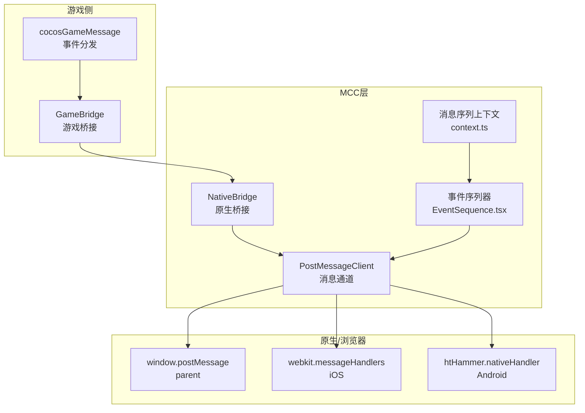
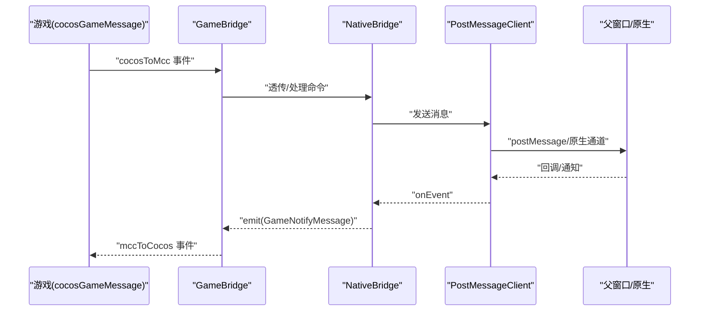
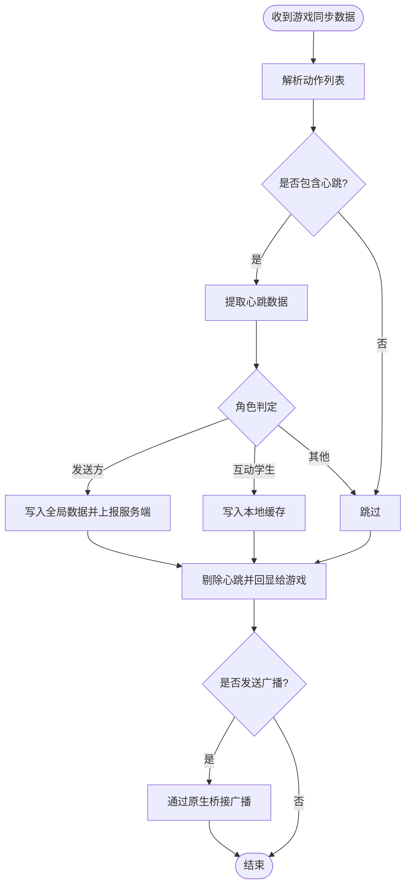
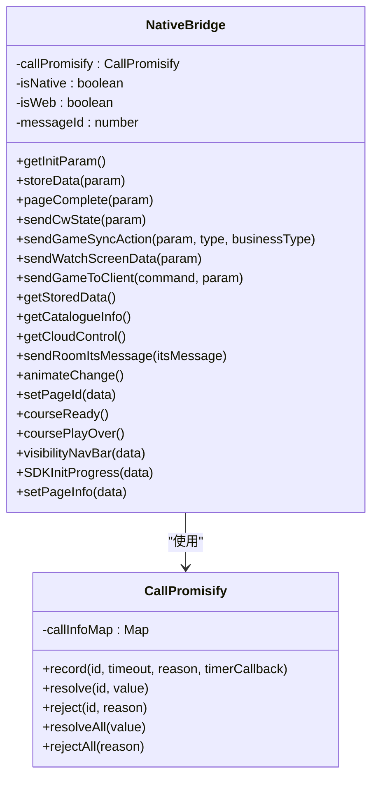
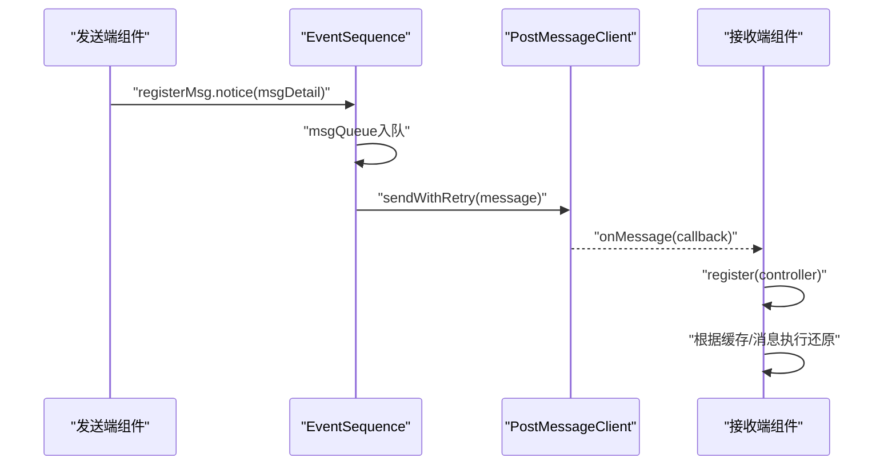
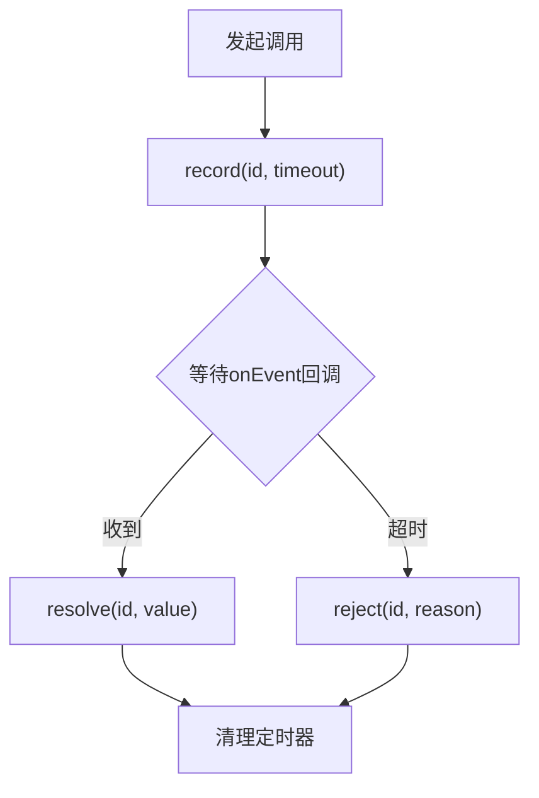
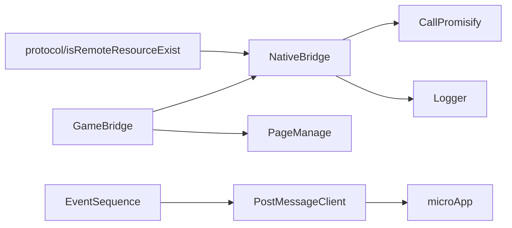

# 桥接通信机制

<cite>
**本文引用的文件**
- [bridge/mcc-player/src/components/game-manage/gameBridge.ts](file://bridge/mcc-player/src/components/game-manage/gameBridge.ts)
- [bridge/mcc-player/src/components/native-bridge/nativeBridgeManage.ts](file://bridge/mcc-player/src/components/native-bridge/nativeBridgeManage.ts)
- [bridge/mcc-player/src/components/native-bridge/bridge-type.ts](file://bridge/mcc-player/src/components/native-bridge/bridge-type.ts)
- [bridge/mcc-player/src/components/game-manage/type.ts](file://bridge/mcc-player/src/components/game-manage/type.ts)
- [common/render-core/components/PostMessageClient.ts](file://common/render-core/components/PostMessageClient.ts)
- [common/render-core/models/context.ts](file://common/render-core/models/context.ts)
- [common/render-core/components/EventSequence.tsx](file://common/render-core/components/EventSequence.tsx)
- [bridge/mcc-player/src/libs/call-promisify/index.ts](file://bridge/mcc-player/src/libs/call-promisify/index.ts)
- [bridge/mcc-player/src/libs/logger/index.ts](file://bridge/mcc-player/src/libs/logger/index.ts)
- [bridge/mcc-player/src/utils/protocol.ts](file://bridge/mcc-player/src/utils/protocol.ts)
- [bridge/mcc-player/src/constants/index.ts](file://bridge/mcc-player/src/constants/index.ts)
- [bridge/mcc-player/gameStatic/game-msg.js](file://bridge/mcc-player/gameStatic/game-msg.js)
- [bridge/mcc-player/src/utils/isRemoteResourceExist.ts](file://bridge/mcc-player/src/utils/isRemoteResourceExist.ts)
- [bridge/mcc-demo/src/utils/isRemoteResourceExist.ts](file://bridge/mcc-demo/src/utils/isRemoteResourceExist.ts)
- [common/render-components/src/utils/index.ts](file://common/render-components/src/utils/index.ts)
</cite>

## 目录
1. [引言](#引言)
2. [项目结构](#项目结构)
3. [核心组件](#核心组件)
4. [架构总览](#架构总览)
5. [详细组件分析](#详细组件分析)
6. [依赖关系分析](#依赖关系分析)
7. [性能考量](#性能考量)
8. [故障排查指南](#故障排查指南)
9. [结论](#结论)
10. [附录](#附录)

## 引言
本文件面向桥接通信机制，系统性梳理“MCC（课程控制）层”与“原生端/浏览器环境”、“游戏引擎”之间的通信协议、消息格式、事件驱动模型、消息队列与异步回调机制。重点覆盖以下方面：
- 事件驱动模型与消息分发
- 游戏桥接的实现原理（状态同步、用户交互传递、实时数据更新）
- 通信安全与验证（消息来源识别、角色与权限）
- 异常处理与重试策略（超时、网络中断、断线重连）
- 协议规范、消息格式定义与调试工具使用

## 项目结构
围绕桥接通信的关键模块分布如下：
- 游戏桥接层：负责游戏与MCC之间的消息编解码、事件路由与状态同步
- 原生桥接层：封装原生/浏览器消息通道，统一调用端能力并处理回调
- 课件消息序列：基于React全局状态的消息序列化与回放
- 异步回调与超时：统一的Promise式回调与超时处理
- 协议与工具：URL协议识别、HTTP超时、远程资源探测等

图表来源
- [bridge/mcc-player/src/components/game-manage/gameBridge.ts:44-54](file://bridge/mcc-player/src/components/game-manage/gameBridge.ts#L44-L54)
- [bridge/mcc-player/src/components/native-bridge/nativeBridgeManage.ts:51-58](file://bridge/mcc-player/src/components/native-bridge/nativeBridgeManage.ts#L51-L58)
- [common/render-core/components/PostMessageClient.ts:10-47](file://common/render-core/components/PostMessageClient.ts#L10-L47)
- [common/render-core/models/context.ts:157-225](file://common/render-core/models/context.ts#L157-L225)
- [common/render-core/components/EventSequence.tsx:72-91](file://common/render-core/components/EventSequence.tsx#L72-L91)

章节来源
- [bridge/mcc-player/src/components/game-manage/gameBridge.ts:1-388](file://bridge/mcc-player/src/components/game-manage/gameBridge.ts#L1-L388)
- [bridge/mcc-player/src/components/native-bridge/nativeBridgeManage.ts:1-395](file://bridge/mcc-player/src/components/native-bridge/nativeBridgeManage.ts#L1-L395)
- [common/render-core/components/PostMessageClient.ts:1-80](file://common/render-core/components/PostMessageClient.ts#L1-L80)
- [common/render-core/models/context.ts:1-226](file://common/render-core/models/context.ts#L1-L226)
- [common/render-core/components/EventSequence.tsx:61-91](file://common/render-core/components/EventSequence.tsx#L61-L91)

## 核心组件
- 游戏桥接 GameBridge：负责游戏事件的统一入口、心跳与同步数据处理、互动状态管理、与原生桥接的联动
- 原生桥接 NativeBridge：抽象跨平台消息通道，统一封装postMessage、webkit.messageHandlers、htHammer.nativeHandler，并提供Promise式回调与超时处理
- 课件消息序列：基于全局状态的消息序列化、控制器注册与回放
- 异步回调 CallPromisify：统一记录/解析/拒绝回调，支持超时与批量处理
- 日志与协议：Logger集中输出，protocol统一协议识别

章节来源
- [bridge/mcc-player/src/components/game-manage/gameBridge.ts:22-42](file://bridge/mcc-player/src/components/game-manage/gameBridge.ts#L22-L42)
- [bridge/mcc-player/src/components/native-bridge/nativeBridgeManage.ts:26-30](file://bridge/mcc-player/src/components/native-bridge/nativeBridgeManage.ts#L26-L30)
- [common/render-core/models/context.ts:157-225](file://common/render-core/models/context.ts#L157-L225)
- [bridge/mcc-player/src/libs/call-promisify/index.ts:8-80](file://bridge/mcc-player/src/libs/call-promisify/index.ts#L8-L80)
- [bridge/mcc-player/src/libs/logger/index.ts:23-191](file://bridge/mcc-player/src/libs/logger/index.ts#L23-L191)
- [bridge/mcc-player/src/utils/protocol.ts:1-66](file://bridge/mcc-player/src/utils/protocol.ts#L1-L66)

## 架构总览
桥接通信采用“事件驱动 + 消息序列 + Promise回调”的组合模式：
- 游戏侧通过cocosGameMessage发布事件，GameBridge统一处理并转发至NativeBridge
- NativeBridge根据来源（web/iOS/Android）选择合适通道，同时维护Promise回调映射
- 课件侧通过PostMessageClient与微应用通道交互，EventSequence按序发送消息并支持重试
- 消息序列上下文负责消息收集、控制器注册与回放，确保接收端可还原状态

图表来源
- [bridge/mcc-player/src/components/game-manage/gameBridge.ts:48-54](file://bridge/mcc-player/src/components/game-manage/gameBridge.ts#L48-L54)
- [bridge/mcc-player/src/components/native-bridge/nativeBridgeManage.ts:182-205](file://bridge/mcc-player/src/components/native-bridge/nativeBridgeManage.ts#L182-L205)
- [common/render-core/components/PostMessageClient.ts:49-62](file://common/render-core/components/PostMessageClient.ts#L49-L62)

## 详细组件分析

### 游戏桥接 GameBridge
职责与流程：
- 订阅cocosGameMessage事件，统一处理游戏侧请求
- 处理游戏生命周期事件（主包/框架加载完成、游戏开始、获取参数、埋点）
- 处理游戏同步数据（心跳提取、本地/服务端存储、广播与回显）
- 处理互动授权与观看态（发起/取消互动、被老师端查看时的数据透传）
- 透传端上消息到游戏与反向透传

关键要点：
- 心跳与同步：从动作列表中提取心跳事件，区分角色（发送方/接收方/互动学生），分别写入服务端或本地缓存
- 互动状态：记录当前页互动信息，加载完成后主动下发
- 数据一致性：对自身操作数据做去重与回显，避免重复消费

图表来源
- [bridge/mcc-player/src/components/game-manage/gameBridge.ts:116-163](file://bridge/mcc-player/src/components/game-manage/gameBridge.ts#L116-L163)

章节来源
- [bridge/mcc-player/src/components/game-manage/gameBridge.ts:44-110](file://bridge/mcc-player/src/components/game-manage/gameBridge.ts#L44-L110)
- [bridge/mcc-player/src/components/game-manage/gameBridge.ts:116-189](file://bridge/mcc-player/src/components/game-manage/gameBridge.ts#L116-L189)
- [bridge/mcc-player/src/components/game-manage/gameBridge.ts:194-243](file://bridge/mcc-player/src/components/game-manage/gameBridge.ts#L194-L243)
- [bridge/mcc-player/src/components/game-manage/gameBridge.ts:286-320](file://bridge/mcc-player/src/components/game-manage/gameBridge.ts#L286-L320)
- [bridge/mcc-player/src/components/game-manage/gameBridge.ts:322-388](file://bridge/mcc-player/src/components/game-manage/gameBridge.ts#L322-L388)

### 原生桥接 NativeBridge
职责与流程：
- 统一消息监听（web使用window.postMessage，iOS使用webkit.messageHandlers，Android使用htHammer.nativeHandler）
- Promise式回调：callNative生成消息ID，等待onEvent回调resolve/reject
- 事件分发：notifyMessage与gameNotifyMessage分别向MCC与游戏侧广播
- Pomelo消息：封装pomeloNative与teacherPomeloNative两类消息类型

关键要点：
- 跨端适配：自动检测来源并选择通道
- 超时控制：CallPromisify统一记录与清理
- 事件路由：GameNotifyType与NotifyType枚举保证消息语义清晰

图表来源
- [bridge/mcc-player/src/components/native-bridge/nativeBridgeManage.ts:26-30](file://bridge/mcc-player/src/components/native-bridge/nativeBridgeManage.ts#L26-L30)
- [bridge/mcc-player/src/libs/call-promisify/index.ts:8-80](file://bridge/mcc-player/src/libs/call-promisify/index.ts#L8-L80)

章节来源
- [bridge/mcc-player/src/components/native-bridge/nativeBridgeManage.ts:51-90](file://bridge/mcc-player/src/components/native-bridge/nativeBridgeManage.ts#L51-L90)
- [bridge/mcc-player/src/components/native-bridge/nativeBridgeManage.ts:156-175](file://bridge/mcc-player/src/components/native-bridge/nativeBridgeManage.ts#L156-L175)
- [bridge/mcc-player/src/components/native-bridge/nativeBridgeManage.ts:182-205](file://bridge/mcc-player/src/components/native-bridge/nativeBridgeManage.ts#L182-L205)
- [bridge/mcc-player/src/components/native-bridge/nativeBridgeManage.ts:254-262](file://bridge/mcc-player/src/components/native-bridge/nativeBridgeManage.ts#L254-L262)

### 课件消息序列与事件序列
职责与流程：
- 消息序列上下文：提供addMsg/registerMsg，支持消息收集、控制器注册与缓存回放
- 事件序列器：按序发送消息队列，过滤状态类消息，支持重试
- PostMessageClient：封装消息发送与接收，支持预览模式下的BroadcastChannel与生产模式下的微应用通道

图表来源
- [common/render-core/models/context.ts:191-214](file://common/render-core/models/context.ts#L191-L214)
- [common/render-core/components/EventSequence.tsx:72-91](file://common/render-core/components/EventSequence.tsx#L72-L91)
- [common/render-core/components/PostMessageClient.ts:49-75](file://common/render-core/components/PostMessageClient.ts#L49-L75)

章节来源
- [common/render-core/models/context.ts:157-225](file://common/render-core/models/context.ts#L157-L225)
- [common/render-core/components/EventSequence.tsx:72-91](file://common/render-core/components/EventSequence.tsx#L72-L91)
- [common/render-core/components/PostMessageClient.ts:10-75](file://common/render-core/components/PostMessageClient.ts#L10-L75)

### 异步回调与超时处理
- CallPromisify：为每个消息ID维护定时器与回调队列，超时统一reject并可触发timerCallback
- HTTP请求：统一超时时间常量，结合远程资源探测工具进行重试

图表来源
- [bridge/mcc-player/src/libs/call-promisify/index.ts:11-36](file://bridge/mcc-player/src/libs/call-promisify/index.ts#L11-L36)

章节来源
- [bridge/mcc-player/src/libs/call-promisify/index.ts:8-80](file://bridge/mcc-player/src/libs/call-promisify/index.ts#L8-L80)
- [bridge/mcc-player/src/constants/index.ts:3-5](file://bridge/mcc-player/src/constants/index.ts#L3-L5)
- [bridge/mcc-player/src/utils/isRemoteResourceExist.ts:1-39](file://bridge/mcc-player/src/utils/isRemoteResourceExist.ts#L1-L39)
- [bridge/mcc-demo/src/utils/isRemoteResourceExist.ts:1-39](file://bridge/mcc-demo/src/utils/isRemoteResourceExist.ts#L1-L39)
- [common/render-components/src/utils/index.ts:115-157](file://common/render-components/src/utils/index.ts#L115-L157)

### 通信安全与权限
- 角色与权限：InitParam中包含角色（发送方/接收方）、用户ID、直播ID等，用于判定消息处理策略
- 事件类型约束：GameNotifyType/NotifyType枚举限定消息类型，避免非法注入
- 本地存储隔离：互动数据以交互ID+用户ID为键，避免跨用户污染

章节来源
- [bridge/mcc-player/src/components/native-bridge/bridge-type.ts:56-73](file://bridge/mcc-player/src/components/native-bridge/bridge-type.ts#L56-L73)
- [bridge/mcc-player/src/components/game-manage/gameBridge.ts:341-371](file://bridge/mcc-player/src/components/game-manage/gameBridge.ts#L341-L371)

## 依赖关系分析
- GameBridge依赖NativeBridge与PageManage，间接依赖microApp与Logger
- NativeBridge依赖CallPromisify与Logger，依赖桥接类型枚举
- 课件消息序列依赖PostMessageClient与微应用通道
- 协议与工具为通用能力，被多处模块复用

图表来源
- [bridge/mcc-player/src/components/game-manage/gameBridge.ts:1-14](file://bridge/mcc-player/src/components/game-manage/gameBridge.ts#L1-L14)
- [bridge/mcc-player/src/components/native-bridge/nativeBridgeManage.ts:1-17](file://bridge/mcc-player/src/components/native-bridge/nativeBridgeManage.ts#L1-L17)
- [common/render-core/components/PostMessageClient.ts:10-24](file://common/render-core/components/PostMessageClient.ts#L10-L24)
- [bridge/mcc-player/src/utils/protocol.ts:1-66](file://bridge/mcc-player/src/utils/protocol.ts#L1-L66)
- [bridge/mcc-player/src/utils/isRemoteResourceExist.ts:1-39](file://bridge/mcc-player/src/utils/isRemoteResourceExist.ts#L1-L39)

章节来源
- [bridge/mcc-player/src/components/game-manage/gameBridge.ts:1-14](file://bridge/mcc-player/src/components/game-manage/gameBridge.ts#L1-L14)
- [bridge/mcc-player/src/components/native-bridge/nativeBridgeManage.ts:1-17](file://bridge/mcc-player/src/components/native-bridge/nativeBridgeManage.ts#L1-L17)
- [common/render-core/components/PostMessageClient.ts:1-80](file://common/render-core/components/PostMessageClient.ts#L1-L80)

## 性能考量
- 消息批处理：EventSequence按序发送，避免并发风暴
- 缓存与回放：消息序列上下文支持缓存与回放，减少重复计算
- 超时与重试：统一超时阈值与重试策略，降低阻塞风险
- 资源探测：远程资源HEAD探测与指数退避，提升可用性

## 故障排查指南
- 日志定位：使用Logger集中输出，区分普通日志与课件日志等级
- 回调超时：CallPromisify记录超时原因，便于快速定位
- 通道诊断：确认来源（web/iOS/Android），核对消息通道是否可达
- 消息序列：通过copyLog导出消息队列，比对发送/接收一致性
- 远程资源：利用isRemoteResourceExist进行探测与重试

章节来源
- [bridge/mcc-player/src/libs/logger/index.ts:106-191](file://bridge/mcc-player/src/libs/logger/index.ts#L106-L191)
- [bridge/mcc-player/src/libs/call-promisify/index.ts:11-36](file://bridge/mcc-player/src/libs/call-promisify/index.ts#L11-L36)
- [common/render-core/models/context.ts:184-186](file://common/render-core/models/context.ts#L184-L186)
- [bridge/mcc-player/src/utils/isRemoteResourceExist.ts:1-39](file://bridge/mcc-player/src/utils/isRemoteResourceExist.ts#L1-L39)

## 结论
本桥接通信机制通过“事件驱动 + 消息序列 + Promise回调 + 统一协议”的设计，实现了游戏、MCC与原生端之间的稳定协作。其关键优势在于：
- 明确的消息边界与类型约束，降低误用风险
- 统一的超时与重试策略，提升鲁棒性
- 本地缓存与回放能力，保障状态一致性
建议在后续迭代中进一步完善：
- 加密与签名（如需）
- 更细粒度的权限校验
- 通道健康监测与自动切换

## 附录

### 通信协议规范与消息格式
- 游戏事件（GameEvent）与命令（GameCommand）枚举定义了游戏侧消息类型
- 原生通知（NotifyType）与游戏通知（GameNotifyType）定义了MCC与游戏侧的消息类型
- Pomelo消息类型（PomeloMessage、PostTeacherPomeloMessage）用于广播与定向传输

章节来源
- [bridge/mcc-player/src/components/game-manage/type.ts:1-67](file://bridge/mcc-player/src/components/game-manage/type.ts#L1-L67)
- [bridge/mcc-player/src/components/native-bridge/bridge-type.ts:1-73](file://bridge/mcc-player/src/components/native-bridge/bridge-type.ts#L1-L73)

### 调试工具使用指南
- Logger：设置角色、上报级别、外部处理器，输出到控制台与远端
- CallPromisify：记录回调、超时与批量处理
- isRemoteResourceExist：远程资源HEAD探测与重试
- protocol：协议识别与本地主机判断

章节来源
- [bridge/mcc-player/src/libs/logger/index.ts:23-104](file://bridge/mcc-player/src/libs/logger/index.ts#L23-L104)
- [bridge/mcc-player/src/libs/call-promisify/index.ts:8-80](file://bridge/mcc-player/src/libs/call-promisify/index.ts#L8-L80)
- [bridge/mcc-player/src/utils/isRemoteResourceExist.ts:1-39](file://bridge/mcc-player/src/utils/isRemoteResourceExist.ts#L1-L39)
- [bridge/mcc-player/src/utils/protocol.ts:14-66](file://bridge/mcc-player/src/utils/protocol.ts#L14-L66)