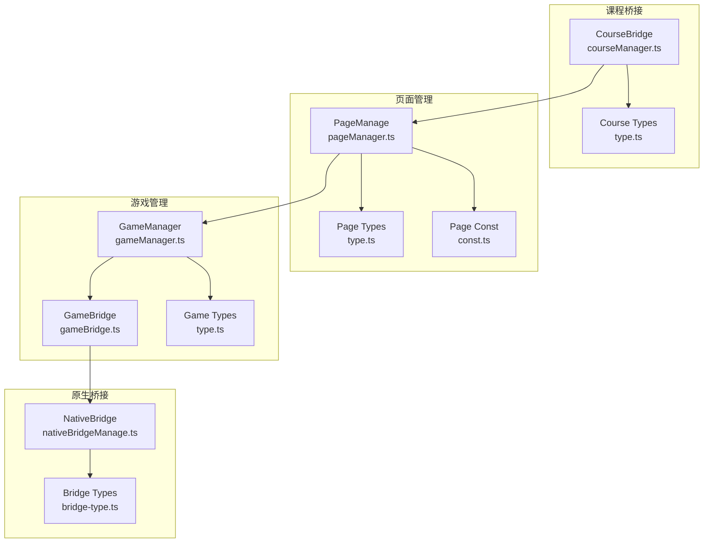
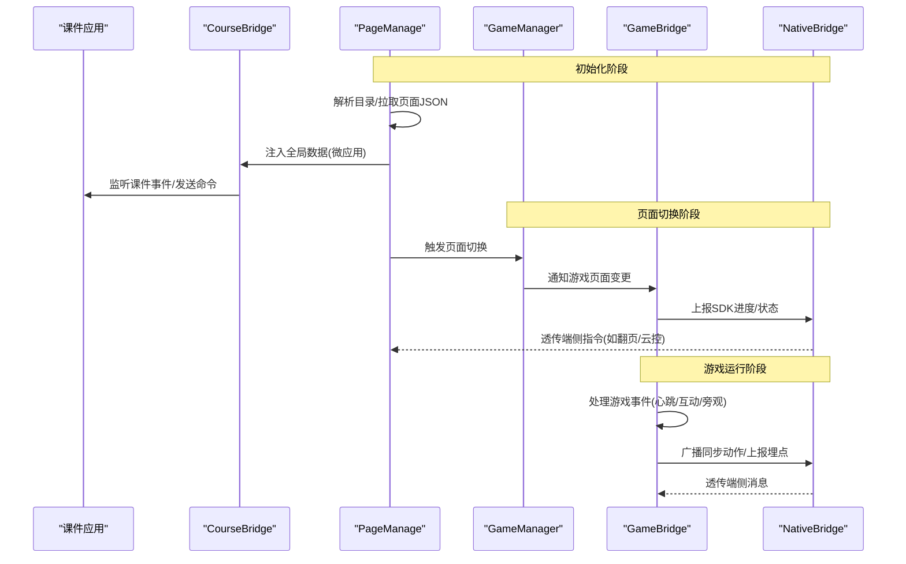
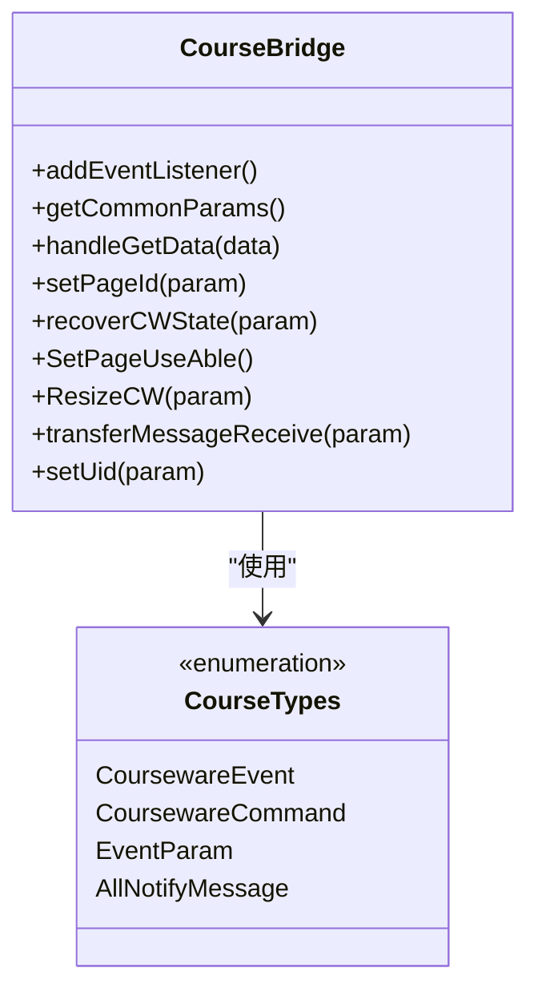
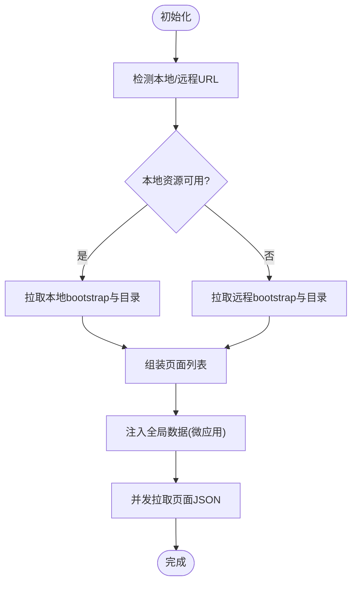
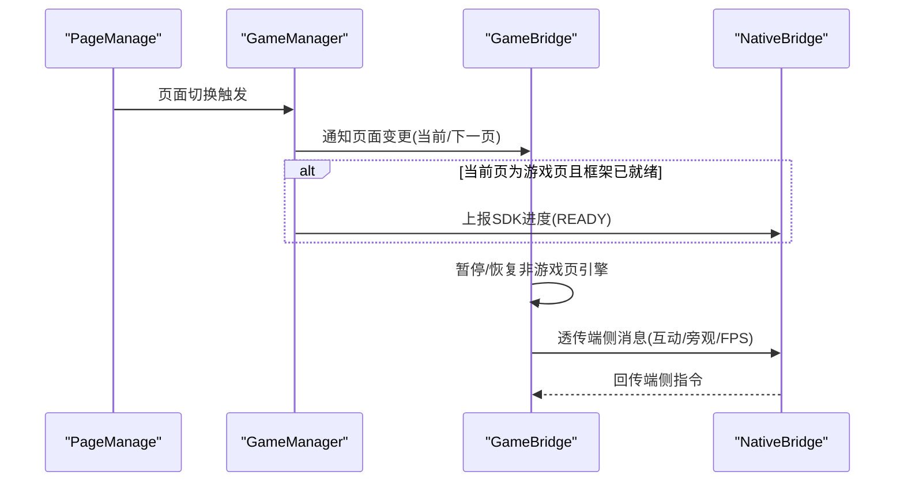
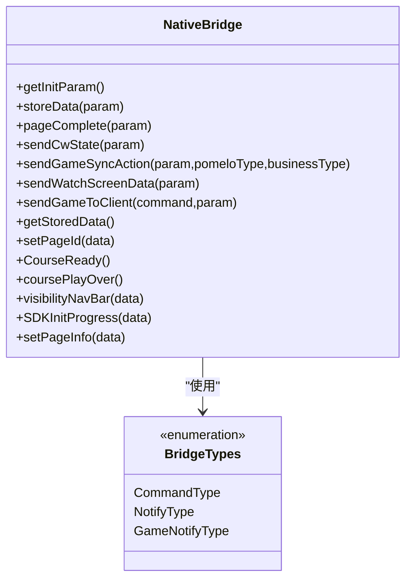
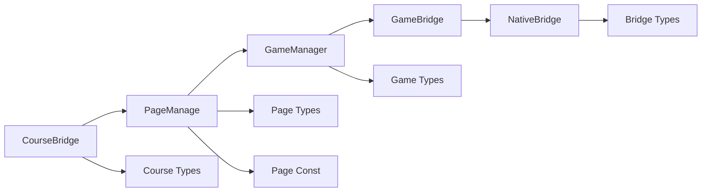

# 课程桥接系统

<cite>
**本文引用的文件**
- [courseManager.ts](file://bridge/mcc-player/src/components/course-bridge/courseManager.ts)
- [type.ts](file://bridge/mcc-player/src/components/course-bridge/type.ts)
- [index.ts](file://bridge/mcc-player/src/components/course-bridge/index.ts)
- [gameManager.ts](file://bridge/mcc-player/src/components/game-manage/gameManager.ts)
- [gameBridge.ts](file://bridge/mcc-player/src/components/game-manage/gameBridge.ts)
- [type.ts](file://bridge/mcc-player/src/components/game-manage/type.ts)
- [nativeBridgeManage.ts](file://bridge/mcc-player/src/components/native-bridge/nativeBridgeManage.ts)
- [bridge-type.ts](file://bridge/mcc-player/src/components/native-bridge/bridge-type.ts)
- [pageManager.ts](file://bridge/mcc-player/src/components/page/pageManager.ts)
- [type.ts](file://bridge/mcc-player/src/components/page/type.ts)
- [const.ts](file://bridge/mcc-player/src/components/page/const.ts)
- [index.ts](file://bridge/mcc-player/src/interface/index.ts)
</cite>

## 目录
1. [简介](#简介)
2. [项目结构](#项目结构)
3. [核心组件](#核心组件)
4. [架构总览](#架构总览)
5. [详细组件分析](#详细组件分析)
6. [依赖关系分析](#依赖关系分析)
7. [性能考量](#性能考量)
8. [故障排查指南](#故障排查指南)
9. [结论](#结论)
10. [附录](#附录)

## 简介
本技术文档围绕“课程桥接系统”展开，聚焦于课程内容与游戏应用之间的数据交换与状态同步机制。系统通过统一的桥接层实现以下目标：
- 课程参数传递与页面切换控制
- 游戏资源加载管理与生命周期协调
- 课程信息的结构化存储与查询
- 事件驱动的跨域通信与错误恢复策略

文档将从架构、数据流、关键类与接口定义入手，逐步深入到组件内部实现，并提供可视化图示与集成示例，帮助开发者快速理解并高效实现课程桥接。

## 项目结构
课程桥接系统主要分布在以下模块：
- 课程桥接：负责与课件应用的数据交换、事件分发与参数封装
- 页面管理：负责课件目录解析、页面资源拉取与全局数据注入
- 游戏管理：负责游戏包加载、页面切换、预加载与运行时通信
- 原生桥接：负责与端侧（App/Web）的通信、消息路由与云控下发
- 类型与常量：统一事件枚举、命令字典与数据模型

**图表来源**
- [courseManager.ts:1-117](file://bridge/mcc-player/src/components/course-bridge/courseManager.ts#L1-L117)
- [type.ts:1-55](file://bridge/mcc-player/src/components/course-bridge/type.ts#L1-L55)
- [pageManager.ts:1-498](file://bridge/mcc-player/src/components/page/pageManager.ts#L1-L498)
- [type.ts:1-52](file://bridge/mcc-player/src/components/page/type.ts#L1-L52)
- [const.ts:1-26](file://bridge/mcc-player/src/components/page/const.ts#L1-L26)
- [gameManager.ts:1-368](file://bridge/mcc-player/src/components/game-manage/gameManager.ts#L1-L368)
- [gameBridge.ts:1-388](file://bridge/mcc-player/src/components/game-manage/gameBridge.ts#L1-L388)
- [type.ts:1-67](file://bridge/mcc-player/src/components/game-manage/type.ts#L1-L67)
- [nativeBridgeManage.ts:1-395](file://bridge/mcc-player/src/components/native-bridge/nativeBridgeManage.ts#L1-L395)
- [bridge-type.ts:1-73](file://bridge/mcc-player/src/components/native-bridge/bridge-type.ts#L1-L73)

**章节来源**
- [courseManager.ts:1-117](file://bridge/mcc-player/src/components/course-bridge/courseManager.ts#L1-L117)
- [pageManager.ts:1-498](file://bridge/mcc-player/src/components/page/pageManager.ts#L1-L498)
- [gameManager.ts:1-368](file://bridge/mcc-player/src/components/game-manage/gameManager.ts#L1-L368)
- [nativeBridgeManage.ts:1-395](file://bridge/mcc-player/src/components/native-bridge/nativeBridgeManage.ts#L1-L395)

## 核心组件
- 课程桥接（CourseBridge）
  - 负责监听/发送课件事件，统一封装 setData 与 Promise 化回调，提供页面切换、状态恢复、尺寸变更、UID 设置等命令
  - 通过微应用框架的跨应用通信通道与课件应用交互
- 页面管理（PageManage）
  - 解析课件目录，按本地/远程优先级拉取 bootstrap 与页面 JSON
  - 注入全局数据至微应用环境，支撑课件渲染与资源路径解析
- 游戏管理（GameBridge/GameManager）
  - 统一处理游戏生命周期事件：框架加载完成、主包加载完成、页面切换、预加载、暂停/恢复
  - 实现游戏同步数据的收集、广播与回放，支持互动授权与旁观模式
- 原生桥接（NativeBridge）
  - 提供与端侧（App/Web）通信的统一入口，封装消息发送、Promise 化调用与事件分发
  - 支持云控、目录、状态存储、翻页、进度上报等命令

**章节来源**
- [courseManager.ts:13-117](file://bridge/mcc-player/src/components/course-bridge/courseManager.ts#L13-L117)
- [pageManager.ts:17-498](file://bridge/mcc-player/src/components/page/pageManager.ts#L17-L498)
- [gameBridge.ts:22-388](file://bridge/mcc-player/src/components/game-manage/gameBridge.ts#L22-L388)
- [gameManager.ts:65-368](file://bridge/mcc-player/src/components/game-manage/gameManager.ts#L65-L368)
- [nativeBridgeManage.ts:26-395](file://bridge/mcc-player/src/components/native-bridge/nativeBridgeManage.ts#L26-L395)

## 架构总览
课程桥接系统采用“事件驱动 + 命令模式”的架构，围绕页面管理器作为数据中枢，课程桥接与游戏桥接分别向上游（课件）与下游（游戏/端侧）提供能力。

**图表来源**
- [pageManager.ts:194-307](file://bridge/mcc-player/src/components/page/pageManager.ts#L194-L307)
- [courseManager.ts:20-47](file://bridge/mcc-player/src/components/course-bridge/courseManager.ts#L20-L47)
- [gameManager.ts:200-260](file://bridge/mcc-player/src/components/game-manage/gameManager.ts#L200-L260)
- [gameBridge.ts:59-110](file://bridge/mcc-player/src/components/game-manage/gameBridge.ts#L59-L110)
- [nativeBridgeManage.ts:65-90](file://bridge/mcc-player/src/components/native-bridge/nativeBridgeManage.ts#L65-L90)

## 详细组件分析

### 课程桥接组件分析
课程桥接通过事件与命令字典实现与课件应用的解耦通信，提供页面切换、状态恢复、尺寸调整与 UID 设置等能力。

- 事件与命令
  - 课件 -> 系统：SetPageIdResult、TransferMessageSend、CWStateChange、PageComplete、RecoverCWStateResult、SetNextPageId、Ready、SendLog
  - 系统 -> 课件：SetPageId、TransferMessageReceive、RecoverCWState、SetUid、SetPageUseAble、onCourseWareSizeChanged
- 数据交换
  - 使用微应用的跨应用通信通道，setData 与 Promise 化回调结合，确保消息可靠送达与响应
- 生命周期
  - 在页面切换前后，课程桥接负责设置页面 ID、恢复状态、通知可使用性与尺寸变更

**图表来源**
- [courseManager.ts:13-117](file://bridge/mcc-player/src/components/course-bridge/courseManager.ts#L13-L117)
- [type.ts:1-55](file://bridge/mcc-player/src/components/course-bridge/type.ts#L1-L55)

**章节来源**
- [courseManager.ts:20-117](file://bridge/mcc-player/src/components/course-bridge/courseManager.ts#L20-L117)
- [type.ts:1-55](file://bridge/mcc-player/src/components/course-bridge/type.ts#L1-L55)
- [index.ts:1-17](file://bridge/mcc-player/src/components/course-bridge/index.ts#L1-L17)

### 页面管理组件分析
页面管理器负责课件目录解析、页面 JSON 拉取与全局数据注入，是课程桥接与游戏管理的枢纽。

- 资源优先级
  - 本地优先：若本地根目录可用且资源存在，则优先使用本地资源
  - 远程降级：本地不可用时自动切换至远程 CDN，支持多主机轮询
- 全局数据
  - 将资源路径、CDN 列表与页面 JSON 注入微应用全局数据，供课件与游戏读取
- 错误恢复
  - 当本地/远程均不可用时，返回空对象并记录日志，避免阻塞后续流程

**图表来源**
- [pageManager.ts:194-307](file://bridge/mcc-player/src/components/page/pageManager.ts#L194-L307)
- [pageManager.ts:403-465](file://bridge/mcc-player/src/components/page/pageManager.ts#L403-L465)

**章节来源**
- [pageManager.ts:17-498](file://bridge/mcc-player/src/components/page/pageManager.ts#L17-L498)
- [type.ts:1-52](file://bridge/mcc-player/src/components/page/type.ts#L1-L52)
- [const.ts:1-26](file://bridge/mcc-player/src/components/page/const.ts#L1-L26)

### 游戏管理组件分析
游戏管理器负责游戏包加载、页面切换、预加载与运行时通信，同时通过桥接层与原生桥接协同。

- 页面切换
  - 计算当前页与下一页的游戏数据，向游戏发送 pageChanged 事件
  - 非游戏页暂停引擎，游戏页恢复引擎
- 预加载
  - 预加载下一页游戏资源，减少首帧延迟
- 同步与互动
  - 收集心跳数据，区分教师端与学生端的存储策略
  - 通过 Pomelo 广播操作消息，支持“接着玩/重新玩”授权

**图表来源**
- [gameManager.ts:200-260](file://bridge/mcc-player/src/components/game-manage/gameManager.ts#L200-L260)
- [gameBridge.ts:59-110](file://bridge/mcc-player/src/components/game-manage/gameBridge.ts#L59-L110)
- [nativeBridgeManage.ts:254-262](file://bridge/mcc-player/src/components/native-bridge/nativeBridgeManage.ts#L254-L262)

**章节来源**
- [gameManager.ts:65-368](file://bridge/mcc-player/src/components/game-manage/gameManager.ts#L65-L368)
- [gameBridge.ts:22-388](file://bridge/mcc-player/src/components/game-manage/gameBridge.ts#L22-L388)
- [type.ts:1-67](file://bridge/mcc-player/src/components/game-manage/type.ts#L1-L67)

### 原生桥接组件分析
原生桥接提供统一的消息通道，支持 Web/App 双端，封装 Promise 化调用与事件分发。

- 消息路由
  - onEvent/onPomelo 两类消息入口，分别处理普通事件与 Pomelo 通信
  - 透传端上发给游戏的消息，以及从游戏发往端侧的消息
- 超时与回调
  - 通过 Promise 化包装，设置超时与兜底回调，提升稳定性
- 云控与目录
  - 支持动态下发云控配置与课件目录，实现运行时策略调整

**图表来源**
- [nativeBridgeManage.ts:26-395](file://bridge/mcc-player/src/components/native-bridge/nativeBridgeManage.ts#L26-L395)
- [bridge-type.ts:1-73](file://bridge/mcc-player/src/components/native-bridge/bridge-type.ts#L1-L73)

**章节来源**
- [nativeBridgeManage.ts:26-395](file://bridge/mcc-player/src/components/native-bridge/nativeBridgeManage.ts#L26-L395)
- [bridge-type.ts:1-73](file://bridge/mcc-player/src/components/native-bridge/bridge-type.ts#L1-L73)

## 依赖关系分析
课程桥接系统的依赖关系如下：

- 低耦合高内聚
  - 各模块职责清晰，通过统一事件与命令字典解耦
- 可观测与可恢复
  - 日志与埋点贯穿全链路，异常路径具备降级与兜底策略

**图表来源**
- [courseManager.ts:1-117](file://bridge/mcc-player/src/components/course-bridge/courseManager.ts#L1-L117)
- [pageManager.ts:1-498](file://bridge/mcc-player/src/components/page/pageManager.ts#L1-L498)
- [gameManager.ts:1-368](file://bridge/mcc-player/src/components/game-manage/gameManager.ts#L1-L368)
- [gameBridge.ts:1-388](file://bridge/mcc-player/src/components/game-manage/gameBridge.ts#L1-L388)
- [nativeBridgeManage.ts:1-395](file://bridge/mcc-player/src/components/native-bridge/nativeBridgeManage.ts#L1-L395)

**章节来源**
- [courseManager.ts:1-117](file://bridge/mcc-player/src/components/course-bridge/courseManager.ts#L1-L117)
- [pageManager.ts:1-498](file://bridge/mcc-player/src/components/page/pageManager.ts#L1-L498)
- [gameManager.ts:1-368](file://bridge/mcc-player/src/components/game-manage/gameManager.ts#L1-L368)
- [gameBridge.ts:1-388](file://bridge/mcc-player/src/components/game-manage/gameBridge.ts#L1-L388)
- [nativeBridgeManage.ts:1-395](file://bridge/mcc-player/src/components/native-bridge/nativeBridgeManage.ts#L1-L395)

## 性能考量
- 资源加载
  - 本地优先、远程降级与多 CDN 轮询，降低首开延迟与失败率
  - 并发拉取页面 JSON，缩短页面渲染等待时间
- 游戏预加载
  - 预加载下一页游戏资源，显著减少切页卡顿
- 事件与消息
  - Promise 化回调与超时控制，避免阻塞主线程
- 存储与同步
  - 教师端与学生端差异化存储策略，减少网络往返与带宽占用

[本节为通用性能建议，无需列出具体文件来源]

## 故障排查指南
- 课件无法接收命令
  - 检查课程桥接的事件监听与 setData 调用是否正确
  - 确认微应用跨应用通信通道是否可用
- 页面切换无效
  - 核对页面管理器的目录解析与全局数据注入是否完成
  - 检查游戏管理器的页面切换逻辑与事件分发
- 游戏无法加载或白屏
  - 确认框架与主包加载完成事件是否触发
  - 检查资源路径与 CDN 可用性
- 同步数据不同步
  - 核对心跳数据收集与广播逻辑
  - 检查端侧消息透传与 Pomelo 通信状态
- 原生桥接无响应
  - 检查消息路由与超时回调
  - 确认 Web/App 双端消息通道是否建立

**章节来源**
- [courseManager.ts:20-47](file://bridge/mcc-player/src/components/course-bridge/courseManager.ts#L20-L47)
- [pageManager.ts:274-306](file://bridge/mcc-player/src/components/page/pageManager.ts#L274-L306)
- [gameManager.ts:200-260](file://bridge/mcc-player/src/components/game-manage/gameManager.ts#L200-L260)
- [gameBridge.ts:116-163](file://bridge/mcc-player/src/components/game-manage/gameBridge.ts#L116-L163)
- [nativeBridgeManage.ts:65-90](file://bridge/mcc-player/src/components/native-bridge/nativeBridgeManage.ts#L65-L90)

## 结论
课程桥接系统通过清晰的模块划分与事件驱动设计，实现了课程内容与游戏应用之间的稳定数据交换与状态同步。其核心优势在于：
- 统一的命令与事件字典，降低耦合度
- 完善的资源加载与降级策略，保障体验
- 丰富的生命周期管理与错误恢复机制，提升可靠性

开发者可基于本文档提供的架构图、数据流图与接口定义，快速集成并扩展课程桥接能力。

[本节为总结性内容，无需列出具体文件来源]

## 附录
- 课程信息结构化存储与查询
  - 通过页面管理器将目录与页面 JSON 注入微应用全局数据，支持按页 ID 查询与缓存
- 生命周期协调
  - 课件：Ready/OnCourseWareSizeChanged/SetPageId/RecoverCWState
  - 游戏：框架加载完成/主包加载完成/页面切换/心跳同步
  - 端侧：SDK 初始化进度/翻页/云控/状态存储
- 集成示例（步骤说明）
  - 初始化：页面管理器解析目录并注入全局数据
  - 课件交互：课程桥接监听事件并发送命令
  - 页面切换：游戏管理器计算当前/下一页数据并通知游戏
  - 同步与互动：原生桥接广播操作消息并上报埋点

**章节来源**
- [pageManager.ts:264-396](file://bridge/mcc-player/src/components/page/pageManager.ts#L264-L396)
- [courseManager.ts:40-117](file://bridge/mcc-player/src/components/course-bridge/courseManager.ts#L40-L117)
- [gameManager.ts:200-260](file://bridge/mcc-player/src/components/game-manage/gameManager.ts#L200-L260)
- [nativeBridgeManage.ts:334-394](file://bridge/mcc-player/src/components/native-bridge/nativeBridgeManage.ts#L334-L394)