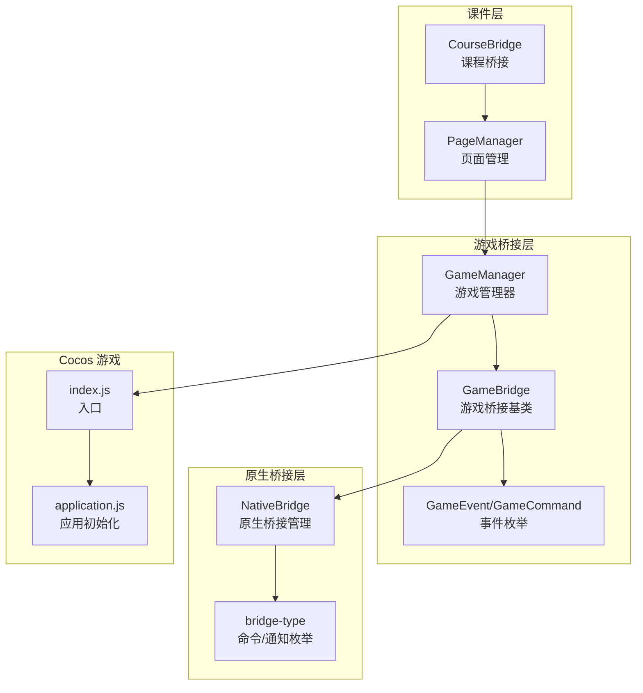
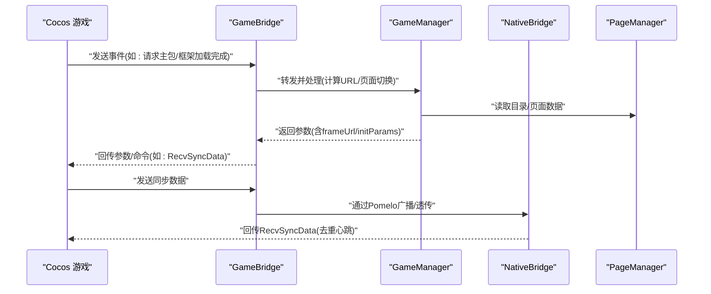
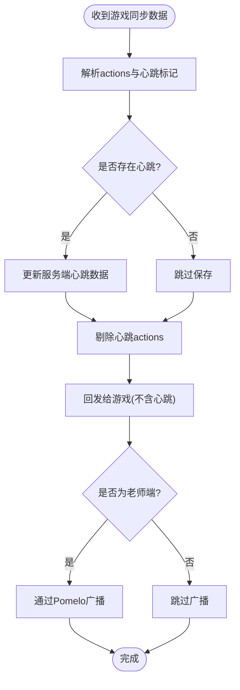
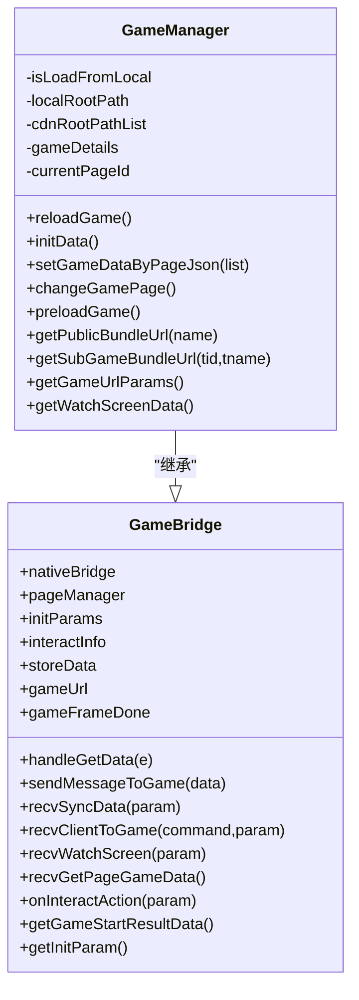
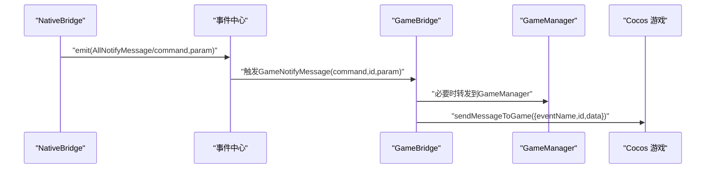
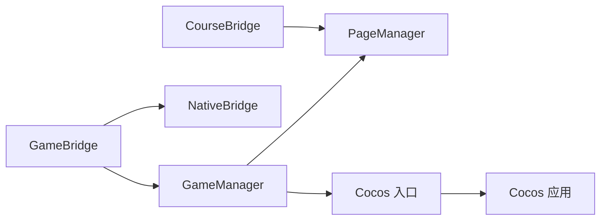

# 游戏桥接系统

<cite>
**本文引用的文件**
- [bridge/mcc-player/src/components/game-manage/gameManager.ts](file://bridge/mcc-player/src/components/game-manage/gameManager.ts)
- [bridge/mcc-player/src/components/game-manage/gameBridge.ts](file://bridge/mcc-player/src/components/game-manage/gameBridge.ts)
- [bridge/mcc-player/src/components/game-manage/type.ts](file://bridge/mcc-player/src/components/game-manage/type.ts)
- [bridge/mcc-player/src/components/native-bridge/nativeBridgeManage.ts](file://bridge/mcc-player/src/components/native-bridge/nativeBridgeManage.ts)
- [bridge/mcc-player/src/components/native-bridge/bridge-type.ts](file://bridge/mcc-player/src/components/native-bridge/bridge-type.ts)
- [bridge/mcc-player/src/components/course-bridge/courseManager.ts](file://bridge/mcc-player/src/components/course-bridge/courseManager.ts)
- [bridge/mcc-player/src/components/page/pageManager.ts](file://bridge/mcc-player/src/components/page/pageManager.ts)
- [bridge/mcc-player/src/components/page/type.ts](file://bridge/mcc-player/src/components/page/type.ts)
- [bridge/mcc-player/src/components/page/const.ts](file://bridge/mcc-player/src/components/page/const.ts)
- [bridge/mcc-player/src/components/game-manage/index.ts](file://bridge/mcc-player/src/components/game-manage/index.ts)
- [bridge/mcc-player/src/components/native-bridge/index.ts](file://bridge/mcc-player/src/components/native-bridge/index.ts)
- [bridge/mcc-player/src/interface/index.ts](file://bridge/mcc-player/src/interface/index.ts)
- [bridge/cocos-game-player/index.js](file://bridge/cocos-game-player/index.js)
- [bridge/cocos-game-player/application.js](file://bridge/cocos-game-player/application.js)
- [bridge/mcc-player/src/utils/index.ts](file://bridge/mcc-player/src/utils/index.ts)
</cite>

## 目录
1. [简介](#简介)
2. [项目结构](#项目结构)
3. [核心组件](#核心组件)
4. [架构总览](#架构总览)
5. [组件详解](#组件详解)
6. [依赖关系分析](#依赖关系分析)
7. [性能考量](#性能考量)
8. [故障排查指南](#故障排查指南)
9. [结论](#结论)
10. [附录](#附录)

## 简介
本文件面向 Slides Engine 游戏桥接系统，系统性阐述“微应用容器 + 游戏管理器 + 通信机制”的整体架构，以及 Cocos 游戏与课件系统的集成方案，包括游戏加载、状态同步与实时通信的实现方式。文档同时给出 Bridge API 的设计与使用方法，覆盖游戏生命周期管理、事件传递与数据交换，并说明原生桥接如何封装设备访问、系统调用与平台特定能力。最后提供从游戏选择到嵌入课件的完整流程与最佳实践。

## 项目结构
围绕“课件 + 游戏桥接 + 原生桥接”的三层结构组织：
- 课件层：通过微应用容器承载课件内容，负责页面编排、资源加载与全局数据分发。
- 游戏桥接层：负责游戏生命周期管理、与 Cocos 游戏的通信、状态同步与实时广播。
- 原生桥接层：负责与端侧（App/Web）通信，封装设备能力与平台特性。

图表来源
- [bridge/mcc-player/src/components/course-bridge/courseManager.ts:13-117](file://bridge/mcc-player/src/components/course-bridge/courseManager.ts#L13-L117)
- [bridge/mcc-player/src/components/page/pageManager.ts:17-498](file://bridge/mcc-player/src/components/page/pageManager.ts#L17-L498)
- [bridge/mcc-player/src/components/game-manage/gameManager.ts:65-368](file://bridge/mcc-player/src/components/game-manage/gameManager.ts#L65-L368)
- [bridge/mcc-player/src/components/game-manage/gameBridge.ts:22-388](file://bridge/mcc-player/src/components/game-manage/gameBridge.ts#L22-L388)
- [bridge/mcc-player/src/components/native-bridge/nativeBridgeManage.ts:26-395](file://bridge/mcc-player/src/components/native-bridge/nativeBridgeManage.ts#L26-L395)
- [bridge/mcc-player/src/components/native-bridge/bridge-type.ts:1-73](file://bridge/mcc-player/src/components/native-bridge/bridge-type.ts#L1-L73)
- [bridge/cocos-game-player/index.js:1-30](file://bridge/cocos-game-player/index.js#L1-L30)
- [bridge/cocos-game-player/application.js:1-63](file://bridge/cocos-game-player/application.js#L1-L63)

章节来源
- [bridge/mcc-player/src/components/course-bridge/courseManager.ts:13-117](file://bridge/mcc-player/src/components/course-bridge/courseManager.ts#L13-L117)
- [bridge/mcc-player/src/components/page/pageManager.ts:17-498](file://bridge/mcc-player/src/components/page/pageManager.ts#L17-L498)
- [bridge/mcc-player/src/components/game-manage/gameManager.ts:65-368](file://bridge/mcc-player/src/components/game-manage/gameManager.ts#L65-L368)
- [bridge/mcc-player/src/components/game-manage/gameBridge.ts:22-388](file://bridge/mcc-player/src/components/game-manage/gameBridge.ts#L22-L388)
- [bridge/mcc-player/src/components/native-bridge/nativeBridgeManage.ts:26-395](file://bridge/mcc-player/src/components/native-bridge/nativeBridgeManage.ts#L26-L395)
- [bridge/mcc-player/src/components/native-bridge/bridge-type.ts:1-73](file://bridge/mcc-player/src/components/native-bridge/bridge-type.ts#L1-L73)
- [bridge/cocos-game-player/index.js:1-30](file://bridge/cocos-game-player/index.js#L1-L30)
- [bridge/cocos-game-player/application.js:1-63](file://bridge/cocos-game-player/application.js#L1-L63)

## 核心组件
- 课件桥接（CourseBridge）：负责与微应用容器交互，封装翻页、恢复状态、尺寸变更等课件控制命令。
- 页面管理（PageManager）：负责课件目录解析、页面 JSON 加载、资源路径计算、全局数据注入与埋点。
- 游戏桥接（GameBridge）：作为游戏与端侧/课件之间的中转，统一处理游戏事件、同步数据、互动授权与端侧透传。
- 游戏管理（GameManager）：负责游戏数据初始化、页面切换、预加载、资源 URL 计算与状态上报。
- 原生桥接（NativeBridge）：封装与 App/Web 的通信协议，提供命令调用、Pomelo 消息、进度上报、数据存储等能力。
- Cocos 游戏：通过入口与应用初始化脚本接入系统，遵循桥接约定的事件与参数规范。

章节来源
- [bridge/mcc-player/src/components/course-bridge/courseManager.ts:13-117](file://bridge/mcc-player/src/components/course-bridge/courseManager.ts#L13-L117)
- [bridge/mcc-player/src/components/page/pageManager.ts:17-498](file://bridge/mcc-player/src/components/page/pageManager.ts#L17-L498)
- [bridge/mcc-player/src/components/game-manage/gameBridge.ts:22-388](file://bridge/mcc-player/src/components/game-manage/gameBridge.ts#L22-L388)
- [bridge/mcc-player/src/components/game-manage/gameManager.ts:65-368](file://bridge/mcc-player/src/components/game-manage/gameManager.ts#L65-L368)
- [bridge/mcc-player/src/components/native-bridge/nativeBridgeManage.ts:26-395](file://bridge/mcc-player/src/components/native-bridge/nativeBridgeManage.ts#L26-L395)
- [bridge/cocos-game-player/index.js:1-30](file://bridge/cocos-game-player/index.js#L1-L30)
- [bridge/cocos-game-player/application.js:1-63](file://bridge/cocos-game-player/application.js#L1-L63)

## 架构总览
系统采用“事件驱动 + 微应用容器 + 原生通道”的架构模式：
- 事件驱动：游戏通过 GameEvent 向 MCC 发送事件，MCC 通过 GameCommand 或原生命令回推给游戏或端侧。
- 微应用容器：课件与游戏均运行于同一容器内，通过 setData/setDataListener 实现跨应用通信。
- 原生通道：NativeBridge 统一封装消息类型（OnEvent/OnPomelo），并适配 Web/App 环境的消息通道。

图表来源
- [bridge/mcc-player/src/components/game-manage/gameBridge.ts:59-110](file://bridge/mcc-player/src/components/game-manage/gameBridge.ts#L59-L110)
- [bridge/mcc-player/src/components/game-manage/gameManager.ts:265-277](file://bridge/mcc-player/src/components/game-manage/gameManager.ts#L265-L277)
- [bridge/mcc-player/src/components/native-bridge/nativeBridgeManage.ts:254-262](file://bridge/mcc-player/src/components/native-bridge/nativeBridgeManage.ts#L254-L262)
- [bridge/mcc-player/src/components/page/pageManager.ts:377-396](file://bridge/mcc-player/src/components/page/pageManager.ts#L377-L396)

## 组件详解

### 游戏桥接基类（GameBridge）
职责与行为：
- 统一接收来自游戏的消息，按事件类型分派处理。
- 维护游戏启动附加参数（如 FPS、暂停状态）。
- 管理互动授权状态与本地/服务端心跳数据存储。
- 透传端上消息至游戏，或将游戏消息透传至端侧。
- 与 PageManager、NativeBridge 协同完成页面切换与状态上报。

关键流程图（同步数据处理）：

图表来源
- [bridge/mcc-player/src/components/game-manage/gameBridge.ts:116-163](file://bridge/mcc-player/src/components/game-manage/gameBridge.ts#L116-L163)

章节来源
- [bridge/mcc-player/src/components/game-manage/gameBridge.ts:22-388](file://bridge/mcc-player/src/components/game-manage/gameBridge.ts#L22-L388)

### 游戏管理器（GameManager）
职责与行为：
- 初始化游戏数据：基于课件目录构建游戏页映射，填充模板与包信息。
- 计算资源 URL：根据本地/远程配置与路径模板生成公共模块与子游戏包地址。
- 页面切换：在游戏页之间切换时，向游戏发送 pageChanged 事件，并根据状态暂停/恢复引擎。
- 预加载：在当前页基础上预加载下一页游戏数据。
- 屏幕旁观：为教师端“旁观学生游戏”场景提供数据通道。

类关系图：

图表来源
- [bridge/mcc-player/src/components/game-manage/gameBridge.ts:22-388](file://bridge/mcc-player/src/components/game-manage/gameBridge.ts#L22-L388)
- [bridge/mcc-player/src/components/game-manage/gameManager.ts:65-368](file://bridge/mcc-player/src/components/game-manage/gameManager.ts#L65-L368)

章节来源
- [bridge/mcc-player/src/components/game-manage/gameManager.ts:65-368](file://bridge/mcc-player/src/components/game-manage/gameManager.ts#L65-L368)

### 原生桥接（NativeBridge）
职责与行为：
- 统一消息监听：兼容 Web 与 App 环境，接收端上消息并分发。
- 命令封装：提供获取初始化参数、存储数据、翻页、进度上报、Pomelo 通信等命令。
- 事件透传：将端上消息透传给游戏，或将游戏消息透传给端侧。
- 超时与 Promise 化：对需要端侧响应的调用进行 Promise 化处理，避免阻塞。

序列图（端侧消息到游戏）：

图表来源
- [bridge/mcc-player/src/components/native-bridge/nativeBridgeManage.ts:50-90](file://bridge/mcc-player/src/components/native-bridge/nativeBridgeManage.ts#L50-L90)
- [bridge/mcc-player/src/components/game-manage/gameBridge.ts:194-212](file://bridge/mcc-player/src/components/game-manage/gameBridge.ts#L194-L212)

章节来源
- [bridge/mcc-player/src/components/native-bridge/nativeBridgeManage.ts:26-395](file://bridge/mcc-player/src/components/native-bridge/nativeBridgeManage.ts#L26-L395)

### 课件桥接（CourseBridge）
职责与行为：
- 与微应用容器交互，封装翻页、恢复状态、尺寸变更、UID 设置等命令。
- 使用 Promise 化的 setData/setDataListener，确保异步调用的可追踪性。
- 提供公共参数注入，便于课件侧统一获取时间戳等上下文。

章节来源
- [bridge/mcc-player/src/components/course-bridge/courseManager.ts:13-117](file://bridge/mcc-player/src/components/course-bridge/courseManager.ts#L13-L117)

### 页面管理（PageManager）
职责与行为：
- 解析课件目录，支持本地/远程资源优先级策略与 CDN 备用链路。
- 组装页面 JSON 请求，统一处理资源存在性检测与失败重试。
- 注入全局数据到微应用容器，供课件与游戏共享。
- 提供页面类型判断、前后页 ID 查询与埋点能力。

章节来源
- [bridge/mcc-player/src/components/page/pageManager.ts:17-498](file://bridge/mcc-player/src/components/page/pageManager.ts#L17-L498)
- [bridge/mcc-player/src/components/page/type.ts:1-52](file://bridge/mcc-player/src/components/page/type.ts#L1-L52)
- [bridge/mcc-player/src/components/page/const.ts:1-26](file://bridge/mcc-player/src/components/page/const.ts#L1-L26)

### Cocos 游戏播放器
职责与行为：
- 通过入口脚本初始化 Canvas 尺寸并启动应用。
- 应用初始化脚本负责 Cocos 引擎的初始化与运行。

章节来源
- [bridge/cocos-game-player/index.js:1-30](file://bridge/cocos-game-player/index.js#L1-L30)
- [bridge/cocos-game-player/application.js:1-63](file://bridge/cocos-game-player/application.js#L1-L63)

## 依赖关系分析
- 组件耦合与内聚
  - GameBridge 与 GameManager 高内聚，共同处理游戏生命周期与状态同步。
  - NativeBridge 与 PageManager 低耦合，通过事件总线与命令枚举解耦。
  - CourseBridge 与 PageManager 通过微应用容器共享数据，降低耦合度。
- 外部依赖
  - 微应用容器：用于课件与游戏的运行与数据共享。
  - 原生通道：通过 window.webkit/window.htHammer 或 postMessage 适配多端。
  - 资源加载：Axios 封装与路径模板替换，支持本地/远程与 CDN 备用。

图表来源
- [bridge/mcc-player/src/components/game-manage/gameBridge.ts:22-388](file://bridge/mcc-player/src/components/game-manage/gameBridge.ts#L22-L388)
- [bridge/mcc-player/src/components/game-manage/gameManager.ts:65-368](file://bridge/mcc-player/src/components/game-manage/gameManager.ts#L65-L368)
- [bridge/mcc-player/src/components/native-bridge/nativeBridgeManage.ts:26-395](file://bridge/mcc-player/src/components/native-bridge/nativeBridgeManage.ts#L26-L395)
- [bridge/mcc-player/src/components/page/pageManager.ts:17-498](file://bridge/mcc-player/src/components/page/pageManager.ts#L17-L498)
- [bridge/cocos-game-player/index.js:1-30](file://bridge/cocos-game-player/index.js#L1-L30)

章节来源
- [bridge/mcc-player/src/components/game-manage/gameBridge.ts:22-388](file://bridge/mcc-player/src/components/game-manage/gameBridge.ts#L22-L388)
- [bridge/mcc-player/src/components/game-manage/gameManager.ts:65-368](file://bridge/mcc-player/src/components/game-manage/gameManager.ts#L65-L368)
- [bridge/mcc-player/src/components/native-bridge/nativeBridgeManage.ts:26-395](file://bridge/mcc-player/src/components/native-bridge/nativeBridgeManage.ts#L26-L395)
- [bridge/mcc-player/src/components/page/pageManager.ts:17-498](file://bridge/mcc-player/src/components/page/pageManager.ts#L17-L498)
- [bridge/cocos-game-player/index.js:1-30](file://bridge/cocos-game-player/index.js#L1-L30)

## 性能考量
- 资源加载
  - 本地优先、CDN 备用链路，减少首屏等待与失败重试成本。
  - 页面 JSON 按需加载，结合微应用容器的全局数据缓存，避免重复请求。
- 通信效率
  - 事件去重：心跳数据在回发时剔除，降低带宽与处理开销。
  - Promise 化调用：避免阻塞主线程，提升交互响应速度。
- 渲染与帧率
  - 通过 GameNotifyType.SetGameFPS 与 gameStartExtraData.fps 控制帧率，平衡性能与体验。
- 状态同步
  - 服务端心跳与本地心跳分离，减少网络抖动对同步的影响。

## 故障排查指南
- 无法加载游戏资源
  - 检查本地根目录与 CDN 配置是否正确，确认路径模板替换后的 URL 可达。
  - 关注 PageManager 的资源存在性检测与失败重试逻辑。
- 同步数据不同步
  - 确认 GameBridge 的心跳过滤与广播逻辑是否生效。
  - 核对 NativeBridge 的 Pomelo 消息类型与透传路径。
- 翻页卡顿
  - 检查 PageManager 的页面 JSON 请求与全局数据注入是否完成。
  - 确认 GameManager 的页面切换与暂停/恢复逻辑是否按预期执行。
- 互动授权异常
  - 核对 GameBridge 的互动状态存储与本地存储键值，清理无效键值。

章节来源
- [bridge/mcc-player/src/components/page/pageManager.ts:426-465](file://bridge/mcc-player/src/components/page/pageManager.ts#L426-L465)
- [bridge/mcc-player/src/components/game-manage/gameBridge.ts:116-163](file://bridge/mcc-player/src/components/game-manage/gameBridge.ts#L116-L163)
- [bridge/mcc-player/src/components/native-bridge/nativeBridgeManage.ts:254-262](file://bridge/mcc-player/src/components/native-bridge/nativeBridgeManage.ts#L254-L262)

## 结论
本系统通过清晰的分层与事件驱动机制，实现了课件与 Cocos 游戏的无缝集成。GameBridge 与 GameManager 负责游戏生命周期与状态同步，NativeBridge 封装原生能力，CourseBridge 与 PageManager 提供课件编排与资源管理。依托微应用容器与统一的 Bridge API，系统具备良好的扩展性与可维护性。

## 附录

### Bridge API 设计与使用
- 游戏事件（GameEvent）
  - 主包/框架加载完成、游戏开始、资源加载阶段、同步初始化、静态资源 URL 请求、端侧消息透传、页面切换、初始化参数请求、事件埋点等。
- 游戏命令（GameCommand）
  - 是否主控心跳、接收同步数据、接收 3 秒心跳、继续/重新授权、静态资源 URL、端侧消息透传等。
- 原生命令（CommandType）与通知（NotifyType）
  - 初始化参数、存储/拉取数据、目录/云控、Pomelo 通信、页面切换、进度上报、旁观学生游戏数据等。
- 使用建议
  - 游戏侧严格区分“事件”与“命令”，事件由游戏主动上报，命令由 MCC/端侧下发。
  - 使用 Promise 化调用与超时处理，保证交互稳定性。

章节来源
- [bridge/mcc-player/src/components/game-manage/type.ts:1-67](file://bridge/mcc-player/src/components/game-manage/type.ts#L1-L67)
- [bridge/mcc-player/src/components/native-bridge/bridge-type.ts:1-73](file://bridge/mcc-player/src/components/native-bridge/bridge-type.ts#L1-L73)
- [bridge/mcc-player/src/interface/index.ts:42-52](file://bridge/mcc-player/src/interface/index.ts#L42-L52)

### 原生桥接功能清单
- 设备访问与系统调用
  - 通过 window.webkit 或 window.htHammer 适配 iOS/Android 环境。
  - Web 环境通过 postMessage 与父窗口通信。
- 平台特定能力
  - SDK 初始化进度上报、页面完成、导航栏显隐、动画状态变更等。
- 数据与通信
  - 存储/拉取数据、Pomelo 消息广播、端侧消息透传、旁观数据回传。

章节来源
- [bridge/mcc-player/src/components/native-bridge/nativeBridgeManage.ts:18-205](file://bridge/mcc-player/src/components/native-bridge/nativeBridgeManage.ts#L18-L205)

### 游戏集成流程（从选择到嵌入）
- 步骤一：课件目录解析与页面数据注入
  - PageManager 解析目录，按本地/远程策略加载页面 JSON，并注入微应用全局数据。
- 步骤二：游戏数据初始化
  - GameManager 基于页面类型构建游戏页映射，解析模板与包信息，计算公共模块与子游戏包 URL。
- 步骤三：游戏加载与启动
  - 通过微应用容器传递参数，Cocos 游戏初始化并启动。
- 步骤四：状态同步与实时通信
  - GameBridge 处理心跳与操作数据，NativeBridge 通过 Pomelo 广播，实现全班/旁观场景的实时同步。
- 步骤五：页面切换与授权
  - 切页时暂停/恢复引擎，处理互动授权与旁观模式，保障教学流程顺畅。

章节来源
- [bridge/mcc-player/src/components/page/pageManager.ts:194-307](file://bridge/mcc-player/src/components/page/pageManager.ts#L194-L307)
- [bridge/mcc-player/src/components/game-manage/gameManager.ts:99-176](file://bridge/mcc-player/src/components/game-manage/gameManager.ts#L99-L176)
- [bridge/mcc-player/src/components/game-manage/gameBridge.ts:65-110](file://bridge/mcc-player/src/components/game-manage/gameBridge.ts#L65-L110)
- [bridge/mcc-player/src/components/native-bridge/nativeBridgeManage.ts:254-262](file://bridge/mcc-player/src/components/native-bridge/nativeBridgeManage.ts#L254-L262)

### 最佳实践
- 资源路径
  - 明确本地根目录与 CDN 列表，确保路径模板替换正确。
- 事件命名
  - 保持 GameEvent/GameCommand 命名一致性，避免歧义。
- 同步策略
  - 心跳与操作分离，广播前进行去重处理。
- 错误处理
  - 对端侧调用设置超时与兜底策略，保证 UI 不阻塞。
- 旁观模式
  - 教师端旁观时，仅透传必要的操作数据，避免干扰学生游戏。