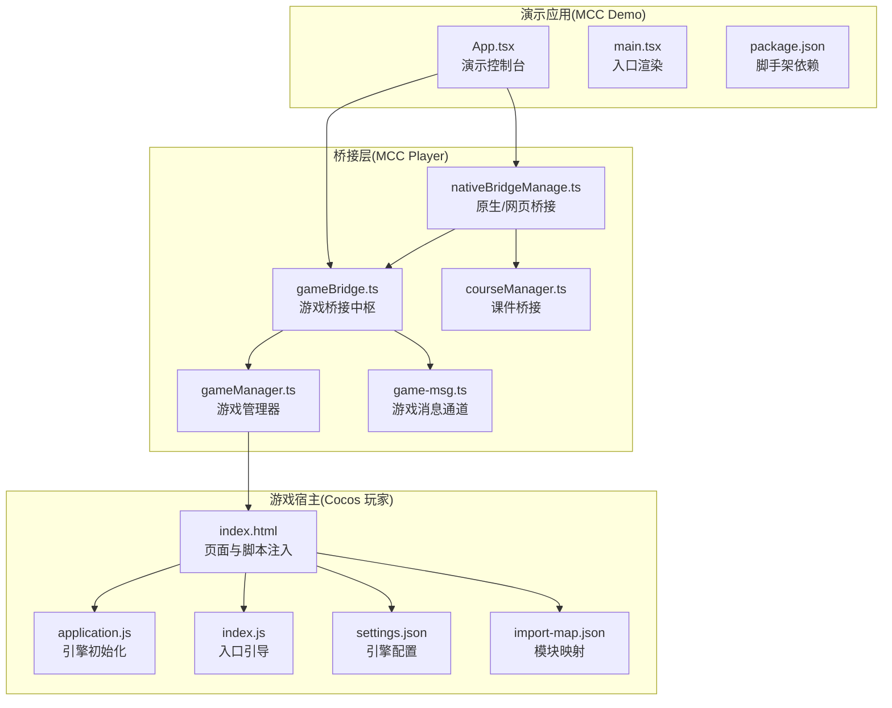
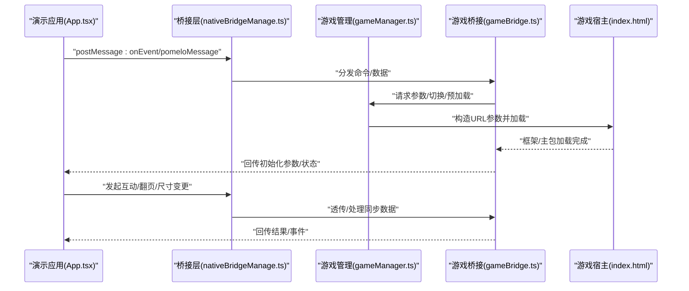
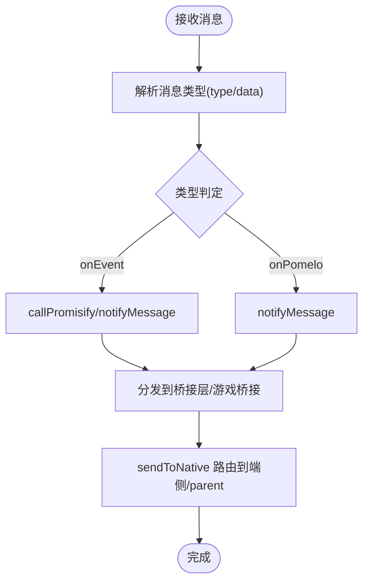
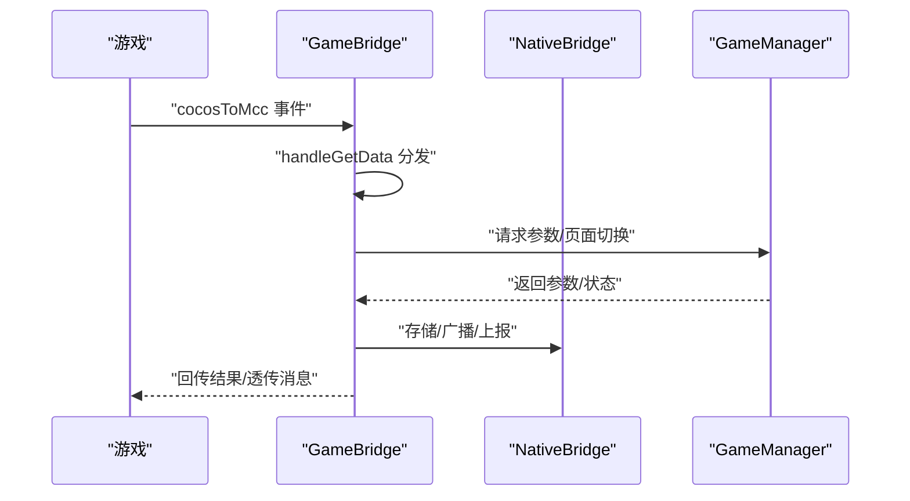
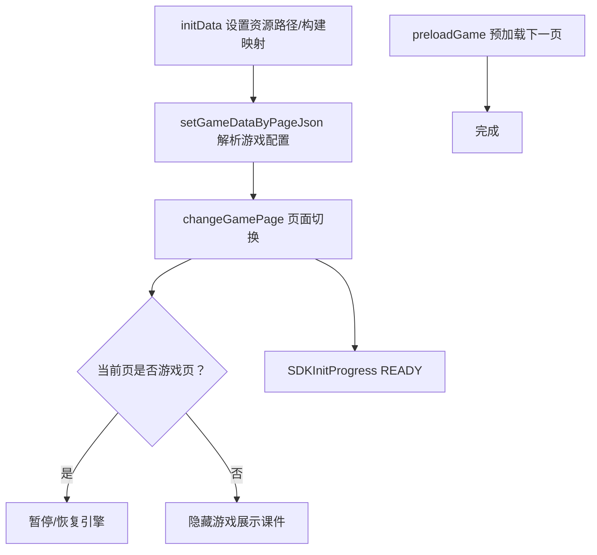
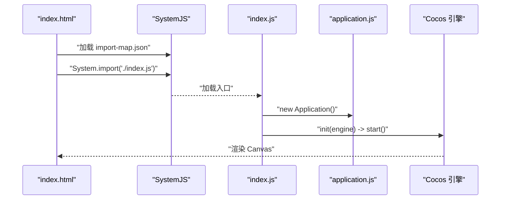
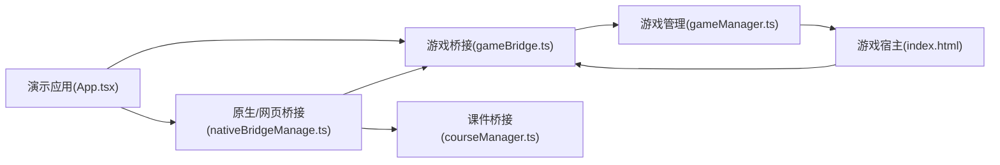

# 演示示例

<cite>
**本文引用的文件**   
- [README.md](file://bridge/mcc-demo/README.md)
- [package.json](file://bridge/mcc-demo/package.json)
- [App.tsx](file://bridge/mcc-demo/src/App.tsx)
- [main.tsx](file://bridge/mcc-demo/src/main.tsx)
- [config.json](file://bridge/mcc-demo/src/config.json)
- [gameManager.ts](file://bridge/mcc-player/src/components/game-manage/gameManager.ts)
- [gameBridge.ts](file://bridge/mcc-player/src/components/game-manage/gameBridge.ts)
- [game-msg.ts](file://bridge/mcc-player/src/components/game-manage/game-msg.ts)
- [nativeBridgeManage.ts](file://bridge/mcc-player/src/components/native-bridge/nativeBridgeManage.ts)
- [courseManager.ts](file://bridge/mcc-player/src/components/course-bridge/courseManager.ts)
- [application.js](file://bridge/cocos-game-player/application.js)
- [index.js](file://bridge/cocos-game-player/index.js)
- [settings.json](file://bridge/cocos-game-player/src/settings.json)
- [import-map.json](file://bridge/cocos-game-player/src/import-map.json)
- [index.html](file://bridge/cocos-game-player/index.html)
</cite>

## 目录
1. [简介](#简介)
2. [项目结构](#项目结构)
3. [核心组件](#核心组件)
4. [架构总览](#架构总览)
5. [详细组件分析](#详细组件分析)
6. [依赖关系分析](#依赖关系分析)
7. [性能考量](#性能考量)
8. [故障排除指南](#故障排除指南)
9. [结论](#结论)
10. [附录](#附录)

## 简介
本演示示例面向希望快速集成“游戏桥接系统”的开发者，围绕 MCC Demo 应用与 Cocos 游戏玩家两大模块，提供从项目结构、配置选项、运行方式到完整集成流程的系统化说明。文档同时覆盖多类游戏的集成案例、部署与测试策略以及常见问题排查，帮助你在本地开发与生产环境中稳定落地。

## 项目结构
本仓库包含三部分关键演示与实现：
- MCC Demo（演示应用）：基于 React + Vite + TypeScript，负责拉取课件配置、与课件/游戏通信、发起互动与翻页控制。
- MCC Player（桥接层）：负责与端侧/网页端通信、管理游戏生命周期、资源路径解析、互动与同步数据处理。
- Cocos 游戏玩家（游戏宿主）：基于 Cocos Creator 引擎，承载子游戏加载、事件上报、错误监控与重载机制。

图表来源
- [App.tsx:1-427](file://bridge/mcc-demo/src/App.tsx#L1-L427)
- [main.tsx:1-39](file://bridge/mcc-demo/src/main.tsx#L1-L39)
- [package.json:1-39](file://bridge/mcc-demo/package.json#L1-L39)
- [nativeBridgeManage.ts:1-395](file://bridge/mcc-player/src/components/native-bridge/nativeBridgeManage.ts#L1-L395)
- [gameBridge.ts:1-388](file://bridge/mcc-player/src/components/game-manage/gameBridge.ts#L1-L388)
- [gameManager.ts:1-368](file://bridge/mcc-player/src/components/game-manage/gameManager.ts#L1-L368)
- [game-msg.ts:1-90](file://bridge/mcc-player/src/components/game-manage/game-msg.ts#L1-L90)
- [courseManager.ts:1-117](file://bridge/mcc-player/src/components/course-bridge/courseManager.ts#L1-L117)
- [index.html:1-368](file://bridge/cocos-game-player/index.html#L1-L368)
- [application.js:1-63](file://bridge/cocos-game-player/application.js#L1-L63)
- [index.js:1-30](file://bridge/cocos-game-player/index.js#L1-L30)
- [settings.json:1-112](file://bridge/cocos-game-player/src/settings.json#L1-L112)
- [import-map.json:1-5](file://bridge/cocos-game-player/src/import-map.json#L1-L5)

章节来源
- [README.md:1-28](file://bridge/mcc-demo/README.md#L1-L28)
- [package.json:1-39](file://bridge/mcc-demo/package.json#L1-L39)

## 核心组件
- 演示应用（MCC Demo）
  - 负责拉取课件发布记录、解析目录、创建 iframe 嵌入游戏宿主，并通过 postMessage 与游戏通信。
  - 提供翻页、互动发起/停止、尺寸调整、直播房间号与课件 ID 设置等演示控制。
- 桥接层（MCC Player）
  - 原生/网页桥接：统一处理端侧/网页消息、Pomelo 通信、SDK 进度上报、存储与目录获取。
  - 游戏桥接中枢：承接游戏事件、转发/透传消息、处理互动与同步数据、与课件桥接协同。
  - 游戏管理器：解析课件目录中的游戏配置、计算资源路径、预加载与切页逻辑。
  - 课件桥接：与课件公共模块通信，支持翻页、恢复状态、尺寸变更等。
- 游戏宿主（Cocos 玩家）
  - 引擎初始化与启动、资源加载、事件上报、错误监控与自动重启、日志采集。

章节来源
- [App.tsx:1-427](file://bridge/mcc-demo/src/App.tsx#L1-L427)
- [nativeBridgeManage.ts:1-395](file://bridge/mcc-player/src/components/native-bridge/nativeBridgeManage.ts#L1-L395)
- [gameBridge.ts:1-388](file://bridge/mcc-player/src/components/game-manage/gameBridge.ts#L1-L388)
- [gameManager.ts:1-368](file://bridge/mcc-player/src/components/game-manage/gameManager.ts#L1-L368)
- [courseManager.ts:1-117](file://bridge/mcc-player/src/components/course-bridge/courseManager.ts#L1-L117)
- [index.html:1-368](file://bridge/cocos-game-player/index.html#L1-L368)

## 架构总览
演示应用作为控制中枢，通过消息协议与桥接层交互；桥接层再与端侧/网页端及课件模块协同；游戏宿主承载 Cocos 引擎与子游戏，通过统一消息通道与桥接层互通。

图表来源
- [App.tsx:66-129](file://bridge/mcc-demo/src/App.tsx#L66-L129)
- [nativeBridgeManage.ts:65-90](file://bridge/mcc-player/src/components/native-bridge/nativeBridgeManage.ts#L65-L90)
- [gameBridge.ts:59-110](file://bridge/mcc-player/src/components/game-manage/gameBridge.ts#L59-L110)
- [gameManager.ts:99-124](file://bridge/mcc-player/src/components/game-manage/gameManager.ts#L99-L124)
- [index.html:250-364](file://bridge/cocos-game-player/index.html#L250-L364)

## 详细组件分析

### 演示应用（MCC Demo）
- 关键职责
  - 拉取课件发布记录与目录，拼装 CDN 路径并加载游戏宿主。
  - 通过 postMessage 与游戏宿主通信，处理初始化参数、目录信息、云控、存储数据、翻页与动画切换。
  - 提供演示按钮：上一页/下一页、互动发起/停止、设置直播房间与课件 ID、设置课件尺寸。
- 配置与运行
  - 使用 Vite + React + TypeScript，脚手架模板已内置 ESLint 与插件配置。
  - 通过环境变量选择测试/生产主机与 CDN 路径，支持本地持久化存储课件 ID。
- 代码要点（路径引用）
  - [演示应用入口:14-18](file://bridge/mcc-demo/src/main.tsx#L14-L18)
  - [演示应用控制台:16-61](file://bridge/mcc-demo/src/App.tsx#L16-L61)
  - [消息处理与命令分发:66-129](file://bridge/mcc-demo/src/App.tsx#L66-L129)
  - [初始化参数与翻页控制:217-252](file://bridge/mcc-demo/src/App.tsx#L217-L252)
  - [互动发起/停止:263-308](file://bridge/mcc-demo/src/App.tsx#L263-L308)
  - [目录与页面跳转:310-335](file://bridge/mcc-demo/src/App.tsx#L310-L335)
  - [尺寸变更与断线重连:361-372](file://bridge/mcc-demo/src/App.tsx#L361-L372)
  - [Vite 脚手架说明:1-28](file://bridge/mcc-demo/README.md#L1-L28)
  - [依赖与脚本:6-11](file://bridge/mcc-demo/package.json#L6-L11)

章节来源
- [main.tsx:1-39](file://bridge/mcc-demo/src/main.tsx#L1-L39)
- [App.tsx:1-427](file://bridge/mcc-demo/src/App.tsx#L1-L427)
- [README.md:1-28](file://bridge/mcc-demo/README.md#L1-L28)
- [package.json:1-39](file://bridge/mcc-demo/package.json#L1-L39)

### 桥接层（MCC Player）

#### 原生/网页桥接（nativeBridgeManage.ts）
- 职责
  - 统一监听来自端侧/网页的消息，分发到桥接层与游戏桥接。
  - 通过 Pomelo 通道与服务端通信，支持存储数据、目录信息、云控、动画切换、翻页等。
  - 向端侧上报 SDK 进度、课件状态、游戏数据等。
- 关键流程
  - 添加消息监听、解析消息类型、分发到对应处理函数。
  - 通过 sendToNative 将消息路由到端侧或 parent window。
  - 提供 Promise 化调用，等待端侧返回数据。

图表来源
- [nativeBridgeManage.ts:65-90](file://bridge/mcc-player/src/components/native-bridge/nativeBridgeManage.ts#L65-L90)
- [nativeBridgeManage.ts:182-205](file://bridge/mcc-player/src/components/native-bridge/nativeBridgeManage.ts#L182-L205)

章节来源
- [nativeBridgeManage.ts:1-395](file://bridge/mcc-player/src/components/native-bridge/nativeBridgeManage.ts#L1-L395)

#### 游戏桥接中枢（gameBridge.ts）
- 职责
  - 统一处理游戏发来的事件，如框架/主包加载完成、游戏启动参数、同步数据、埋点等。
  - 与 nativeBridge 协同，处理互动、暂停/恢复、FPS 等参数。
  - 与 GameManager 协作，下发初始化参数、页面切换、预加载等。
- 关键流程
  - 监听 cocosGameMessage，根据事件名分发处理。
  - 处理同步数据：区分心跳与操作，透传/广播/存储。
  - 透传端上消息到游戏，或处理互动状态。

图表来源
- [gameBridge.ts:59-110](file://bridge/mcc-player/src/components/game-manage/gameBridge.ts#L59-L110)
- [gameBridge.ts:116-163](file://bridge/mcc-player/src/components/game-manage/gameBridge.ts#L116-L163)
- [gameBridge.ts:194-212](file://bridge/mcc-player/src/components/game-manage/gameBridge.ts#L194-L212)

章节来源
- [gameBridge.ts:1-388](file://bridge/mcc-player/src/components/game-manage/gameBridge.ts#L1-L388)

#### 游戏管理器（gameManager.ts）
- 职责
  - 解析课件目录中的游戏配置，计算资源路径（本地/CDN），构造游戏 URL 参数。
  - 处理页面切换、预加载、暂停/恢复、隐藏游戏展示课件等。
  - 支持观看端场景下的数据透传与进度上报。
- 关键流程
  - 初始化：设置资源路径、构建游戏详情映射。
  - 页面切换：下发 pageChanged 事件，处理暂停/恢复与进度上报。
  - 预加载：预取下一页游戏数据，提升体验。

图表来源
- [gameManager.ts:99-124](file://bridge/mcc-player/src/components/game-manage/gameManager.ts#L99-L124)
- [gameManager.ts:130-176](file://bridge/mcc-player/src/components/game-manage/gameManager.ts#L130-L176)
- [gameManager.ts:200-260](file://bridge/mcc-player/src/components/game-manage/gameManager.ts#L200-L260)
- [gameManager.ts:265-277](file://bridge/mcc-player/src/components/game-manage/gameManager.ts#L265-L277)

章节来源
- [gameManager.ts:1-368](file://bridge/mcc-player/src/components/game-manage/gameManager.ts#L1-L368)

#### 课件桥接（courseManager.ts）
- 职责
  - 与课件公共模块通信，支持翻页、恢复状态、尺寸变更、UID 设置等。
  - 封装 Promise 化调用，确保 setData 异步结果可追踪。
- 关键流程
  - 监听课件数据，分发事件。
  - 提供 setPageId、recoverCWState、ResizeCW、SetPageUseAble、transferMessageReceive、setUid 等接口。

章节来源
- [courseManager.ts:1-117](file://bridge/mcc-player/src/components/course-bridge/courseManager.ts#L1-L117)

#### 游戏消息通道（game-msg.ts）
- 职责
  - 提供全局 cocosGameMessage 事件总线，支持注册/移除监听、派发事件。
  - 用于游戏与桥接层之间的解耦通信。
- 关键流程
  - on/off/dispatch/removeAll 实现事件管理。
  - 与游戏桥接配合，实现消息路由。

章节来源
- [game-msg.ts:1-90](file://bridge/mcc-player/src/components/game-manage/game-msg.ts#L1-L90)

### 游戏宿主（Cocos 玩家）
- 引擎初始化与启动
  - 通过 application.js 注册 Application，设置 settingsPath、调试模式与引擎启动。
  - index.js 获取 canvas，初始化并启动引擎。
- 配置与资源
  - settings.json 定义引擎版本、平台、宏、内置资源、脚本包、启动场景、屏幕适配等。
  - import-map.json 映射 cc 模块路径，便于 SystemJS 加载。
- 页面与脚本
  - index.html 注入日志、上传、消息脚本，初始化 Aliyun 日志、错误上报、WebGL Lost 监控与自动重启。
  - 通过 System.import 加载入口 index.js，进而引导引擎初始化。

图表来源
- [index.html:356-364](file://bridge/cocos-game-player/index.html#L356-L364)
- [index.js:14-28](file://bridge/cocos-game-player/index.js#L14-L28)
- [application.js:24-56](file://bridge/cocos-game-player/application.js#L24-L56)

章节来源
- [index.html:1-368](file://bridge/cocos-game-player/index.html#L1-L368)
- [index.js:1-30](file://bridge/cocos-game-player/index.js#L1-L30)
- [application.js:1-63](file://bridge/cocos-game-player/application.js#L1-L63)
- [settings.json:1-112](file://bridge/cocos-game-player/src/settings.json#L1-L112)
- [import-map.json:1-5](file://bridge/cocos-game-player/src/import-map.json#L1-L5)

## 依赖关系分析
- 演示应用依赖桥接层提供的消息通道与命令，桥接层内部依赖原生/网页桥接与游戏桥接中枢，游戏桥接中枢再依赖游戏管理器与课件桥接。
- 游戏宿主依赖 Cocos 引擎与模块映射，通过消息通道与桥接层互通。
- 资源路径解析由游戏管理器结合本地/CDN 配置生成，确保跨环境一致性。

图表来源
- [App.tsx:1-427](file://bridge/mcc-demo/src/App.tsx#L1-L427)
- [nativeBridgeManage.ts:1-395](file://bridge/mcc-player/src/components/native-bridge/nativeBridgeManage.ts#L1-L395)
- [gameBridge.ts:1-388](file://bridge/mcc-player/src/components/game-manage/gameBridge.ts#L1-L388)
- [gameManager.ts:1-368](file://bridge/mcc-player/src/components/game-manage/gameManager.ts#L1-L368)
- [courseManager.ts:1-117](file://bridge/mcc-player/src/components/course-bridge/courseManager.ts#L1-L117)
- [index.html:1-368](file://bridge/cocos-game-player/index.html#L1-L368)

章节来源
- [App.tsx:1-427](file://bridge/mcc-demo/src/App.tsx#L1-L427)
- [nativeBridgeManage.ts:1-395](file://bridge/mcc-player/src/components/native-bridge/nativeBridgeManage.ts#L1-L395)
- [gameBridge.ts:1-388](file://bridge/mcc-player/src/components/game-manage/gameBridge.ts#L1-L388)
- [gameManager.ts:1-368](file://bridge/mcc-player/src/components/game-manage/gameManager.ts#L1-L368)
- [courseManager.ts:1-117](file://bridge/mcc-player/src/components/course-bridge/courseManager.ts#L1-L117)
- [index.html:1-368](file://bridge/cocos-game-player/index.html#L1-L368)

## 性能考量
- 资源加载
  - 优先使用本地资源路径以降低首屏延迟；CDN 回退策略确保稳定性。
  - 预加载下一页游戏数据，减少页面切换卡顿。
- 通信与事件
  - 使用事件总线与 Promise 化调用，避免阻塞主线程。
  - 对同步数据进行心跳与操作分离，仅广播操作消息，降低带宽与处理压力。
- 错误与监控
  - 游戏宿主对 WebGL Lost、错误堆栈进行上报与自动重启，保障稳定性。
  - 桥接层对消息超时进行统一处理，避免死锁。

## 故障排除指南
- 无法加载游戏或白屏
  - 检查演示应用是否正确拉取课件发布记录与目录，确认 CDN 路径与版本号。
  - 核对游戏管理器的资源路径解析逻辑，确保本地/CDN 配置一致。
  - 查看游戏宿主的错误上报与自动重启逻辑，定位 WebGL 或资源加载问题。
- 互动不同步或延迟
  - 确认桥接层是否正确区分心跳与操作消息，并按角色（教师/学生）进行广播/存储。
  - 核对 Pomelo 通道是否正常，消息是否被正确透传。
- 翻页无效或状态错乱
  - 检查页面切换流程是否触发 SDK 进度上报与暂停/恢复逻辑。
  - 确认课件桥接的 setPageId 与 SetPageUseAble 是否按序调用。
- 环境差异导致的问题
  - 使用演示应用的环境变量切换测试/生产主机与 CDN，确保配置一致。
  - 在本地开发时优先使用本地资源路径，生产环境再切换为 CDN。

章节来源
- [gameManager.ts:200-260](file://bridge/mcc-player/src/components/game-manage/gameManager.ts#L200-L260)
- [gameBridge.ts:116-163](file://bridge/mcc-player/src/components/game-manage/gameBridge.ts#L116-L163)
- [nativeBridgeManage.ts:156-175](file://bridge/mcc-player/src/components/native-bridge/nativeBridgeManage.ts#L156-L175)
- [index.html:286-321](file://bridge/cocos-game-player/index.html#L286-L321)

## 结论
本演示示例提供了从演示应用到桥接层再到游戏宿主的完整链路，覆盖多类游戏的集成与部署场景。通过清晰的职责划分、标准化的消息协议与完善的错误监控机制，可在本地与生产环境中稳定运行。建议在实际项目中结合自身业务对资源路径、Pomelo 通道与日志上报进行定制化配置。

## 附录
- 配置文件参考
  - [演示应用配置:1-161](file://bridge/mcc-demo/src/config.json#L1-L161)
  - [引擎设置:1-112](file://bridge/cocos-game-player/src/settings.json#L1-L112)
  - [模块映射:1-5](file://bridge/cocos-game-player/src/import-map.json#L1-L5)
- 运行与开发
  - 使用 Vite 脚手架进行开发与预览，遵循模板中的 ESLint 配置与脚本命令。
  - 在演示应用中通过环境变量切换测试/生产环境，确保资源路径与主机一致。

章节来源
- [config.json:1-161](file://bridge/mcc-demo/src/config.json#L1-L161)
- [settings.json:1-112](file://bridge/cocos-game-player/src/settings.json#L1-L112)
- [import-map.json:1-5](file://bridge/cocos-game-player/src/import-map.json#L1-L5)
- [README.md:1-28](file://bridge/mcc-demo/README.md#L1-L28)
- [package.json:6-11](file://bridge/mcc-demo/package.json#L6-L11)