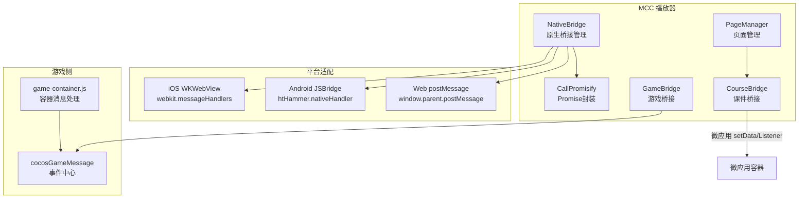
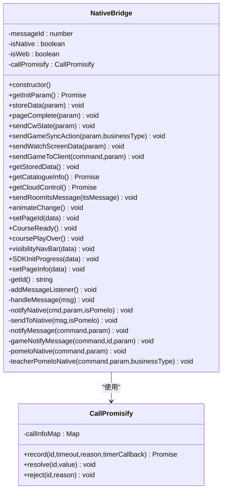
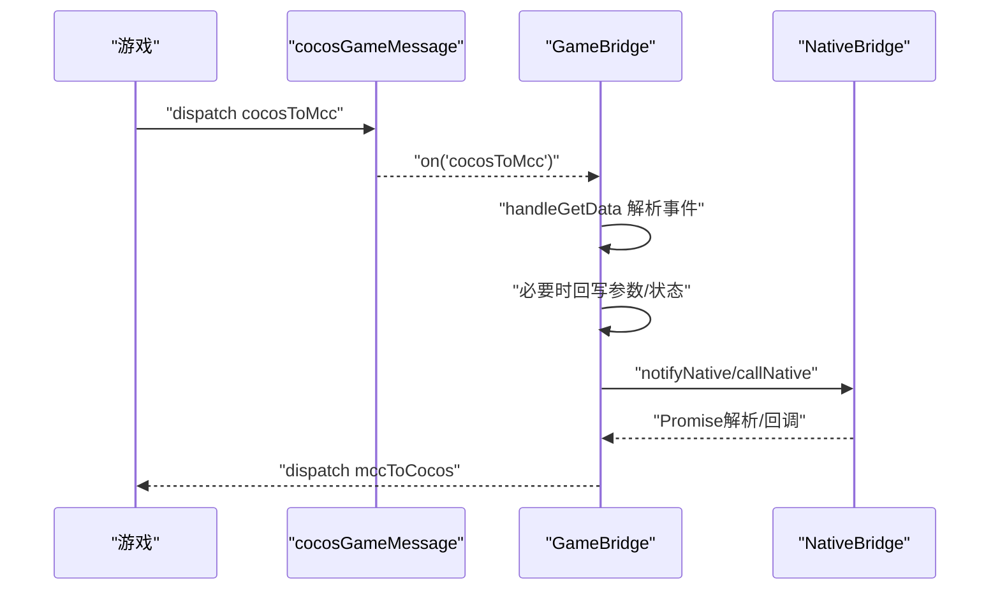
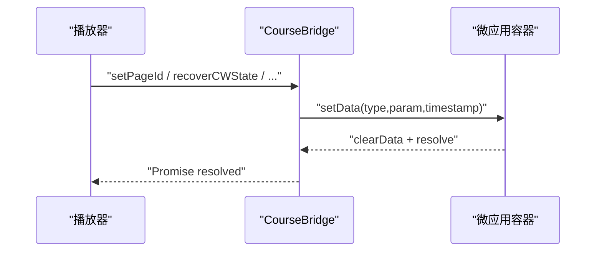
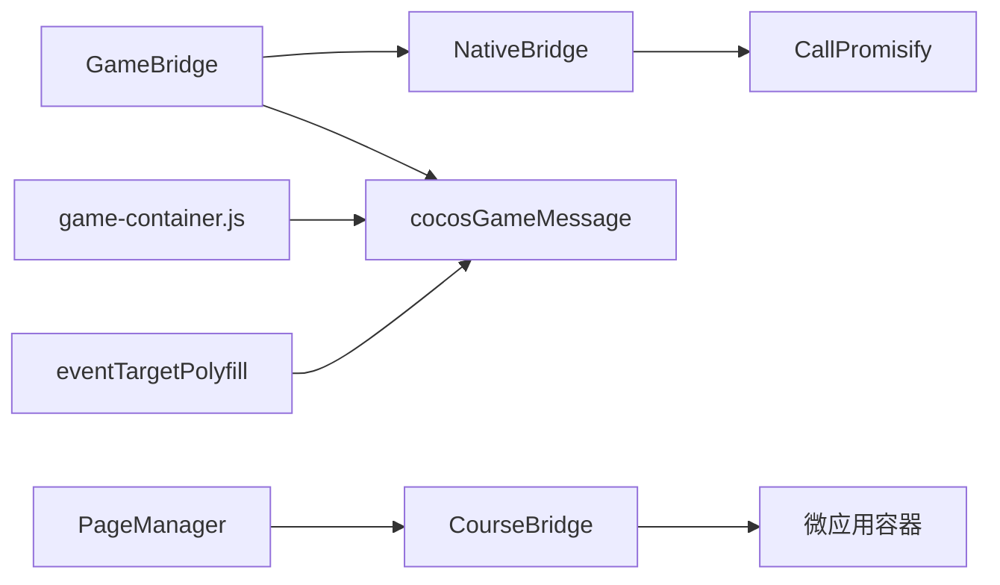

# 原生桥接通信

<cite>
**本文引用的文件**   
- [bridge/mcc-player/src/components/native-bridge/bridge-type.ts](file://bridge/mcc-player/src/components/native-bridge/bridge-type.ts)
- [bridge/mcc-player/src/components/native-bridge/nativeBridgeManage.ts](file://bridge/mcc-player/src/components/native-bridge/nativeBridgeManage.ts)
- [bridge/mcc-player/src/components/native-bridge/index.ts](file://bridge/mcc-player/src/components/native-bridge/index.ts)
- [bridge/mcc-player/src/libs/call-promisify/index.ts](file://bridge/mcc-player/src/libs/call-promisify/index.ts)
- [bridge/mcc-player/src/components/game-manage/gameBridge.ts](file://bridge/mcc-player/src/components/game-manage/gameBridge.ts)
- [bridge/mcc-player/src/components/game-manage/game-msg.ts](file://bridge/mcc-player/src/components/game-manage/game-msg.ts)
- [bridge/mcc-player/gameStatic/game-msg.js](file://bridge/mcc-player/gameStatic/game-msg.js)
- [bridge/mcc-player/gameStatic/game-container.js](file://bridge/mcc-player/gameStatic/game-container.js)
- [common/render-core/components/PostMessageClient.ts](file://common/render-core/components/PostMessageClient.ts)
- [bridge/mcc-player/src/components/course-bridge/courseManager.ts](file://bridge/mcc-player/src/components/course-bridge/courseManager.ts)
- [bridge/mcc-player/src/components/page/pageManager.ts](file://bridge/mcc-player/src/components/page/pageManager.ts)
- [bridge/mcc-player/src/components/game-manage/type.ts](file://bridge/mcc-player/src/components/game-manage/type.ts)
- [bridge/mcc-player/src/components/course-bridge/type.ts](file://bridge/mcc-player/src/components/course-bridge/type.ts)
- [bridge/mcc-player/src/interface/index.ts](file://bridge/mcc-player/src/interface/index.ts)
- [bridge/mcc-player/src/utils/eventTargetPolyfill.ts](file://bridge/mcc-player/src/utils/eventTargetPolyfill.ts)
</cite>

## 目录
1. [引言](#引言)
2. [项目结构](#项目结构)
3. [核心组件](#核心组件)
4. [架构总览](#架构总览)
5. [详细组件分析](#详细组件分析)
6. [依赖关系分析](#依赖关系分析)
7. [性能考量](#性能考量)
8. [故障排查指南](#故障排查指南)
9. [结论](#结论)
10. [附录](#附录)

## 引言
本技术文档聚焦于“原生桥接通信”，系统性阐述MCC播放器与原生端（iOS、Android、Web）之间的双向通信机制，涵盖消息监听、事件处理、数据传递、Promise封装与超时控制、消息格式规范与编码、错误处理策略，以及跨平台差异与适配方案。同时给出原生API调用示例（如初始化参数获取、数据存储、页面状态通知），并提供调试技巧与常见问题解决方案。

## 项目结构
围绕原生桥接通信的关键模块分布如下：
- 原生桥接管理：负责消息监听、消息分发、Promise封装与超时、平台适配（iOS WKWebView、Android JSBridge、Web postMessage）。
- 游戏侧桥接：负责游戏与MCC之间的事件转发、同步数据处理、端到游戏的消息透传。
- 课件桥接：负责与微应用容器的通信，实现页面切换、状态恢复、尺寸变更等。
- 通用工具：Promise封装与超时控制、事件中心polyfill、PostMessage客户端等。



图表来源
- [bridge/mcc-player/src/components/native-bridge/nativeBridgeManage.ts:182-205](file://bridge/mcc-player/src/components/native-bridge/nativeBridgeManage.ts#L182-L205)
- [bridge/mcc-player/src/components/game-manage/gameBridge.ts:44-54](file://bridge/mcc-player/src/components/game-manage/gameBridge.ts#L44-L54)
- [bridge/mcc-player/gameStatic/game-container.js:75-94](file://bridge/mcc-player/gameStatic/game-container.js#L75-L94)
- [common/render-core/components/PostMessageClient.ts:10-47](file://common/render-core/components/PostMessageClient.ts#L10-L47)

章节来源
- [bridge/mcc-player/src/components/native-bridge/nativeBridgeManage.ts:18-30](file://bridge/mcc-player/src/components/native-bridge/nativeBridgeManage.ts#L18-L30)
- [bridge/mcc-player/src/components/game-manage/gameBridge.ts:22-46](file://bridge/mcc-player/src/components/game-manage/gameBridge.ts#L22-L46)
- [bridge/mcc-player/src/components/course-bridge/courseManager.ts:13-23](file://bridge/mcc-player/src/components/course-bridge/courseManager.ts#L13-L23)

## 核心组件
- 原生桥接管理（NativeBridge）：统一消息入口与出口，封装Promise与超时，适配iOS/Android/Web三端。
- Promise封装（CallPromisify）：基于消息ID的Promise记录、解析与超时处理。
- 游戏桥接（GameBridge）：游戏与MCC之间的事件转发、同步数据处理、端到游戏的消息透传。
- 课件桥接（CourseBridge）：与微应用容器通信，实现页面切换、状态恢复、尺寸变更等。
- 页面管理（PageManager）：课件资源加载、目录拉取、全局数据注入与埋点。
- 事件中心（cocosGameMessage）：游戏侧事件订阅与派发。
- Web容器（game-container.js）：Web环境下的消息监听与转发。

章节来源
- [bridge/mcc-player/src/components/native-bridge/nativeBridgeManage.ts:26-90](file://bridge/mcc-player/src/components/native-bridge/nativeBridgeManage.ts#L26-L90)
- [bridge/mcc-player/src/libs/call-promisify/index.ts:8-80](file://bridge/mcc-player/src/libs/call-promisify/index.ts#L8-L80)
- [bridge/mcc-player/src/components/game-manage/gameBridge.ts:22-110](file://bridge/mcc-player/src/components/game-manage/gameBridge.ts#L22-L110)
- [bridge/mcc-player/src/components/course-bridge/courseManager.ts:13-47](file://bridge/mcc-player/src/components/course-bridge/courseManager.ts#L13-L47)
- [bridge/mcc-player/src/components/page/pageManager.ts:17-76](file://bridge/mcc-player/src/components/page/pageManager.ts#L17-L76)
- [bridge/mcc-player/src/components/game-manage/game-msg.ts:6-50](file://bridge/mcc-player/src/components/game-manage/game-msg.ts#L6-L50)
- [bridge/mcc-player/gameStatic/game-container.js:75-130](file://bridge/mcc-player/gameStatic/game-container.js#L75-L130)

## 架构总览
原生桥接通信采用“事件驱动 + Promise + 超时”的模式，消息在MCC与原生端之间双向流动，并在Web环境下通过postMessage桥接到父窗口。游戏侧通过cocosGameMessage与MCC交互，课件侧通过微应用容器进行消息中转。

```mermaid
sequenceDiagram
participant Game as "游戏"
participant GB as "GameBridge"
participant NB as "NativeBridge"
participant IOS as "iOS WKWebView"
participant AND as "Android JSBridge"
participant WEB as "Web postMessage"
Game->>GB : "cocosToMcc 事件"
GB->>GB : "处理事件并转发"
GB->>NB : "callNative / notifyNative"
alt iOS
NB->>IOS : "webkit.messageHandlers.nativeHandler.postMessage"
else Android
NB->>AND : "window.htHammer.nativeHandler"
else Web
NB->>WEB : "window.parent.postMessage"
end
WEB-->>NB : "OnEvent/OnPomelo 回调"
NB-->>GB : "emit GameNotifyMessage"
GB-->>Game : "mccToCocos 事件"
```

图表来源
- [bridge/mcc-player/src/components/game-manage/gameBridge.ts:59-110](file://bridge/mcc-player/src/components/game-manage/gameBridge.ts#L59-L110)
- [bridge/mcc-player/src/components/native-bridge/nativeBridgeManage.ts:156-205](file://bridge/mcc-player/src/components/native-bridge/nativeBridgeManage.ts#L156-L205)
- [bridge/mcc-player/gameStatic/game-container.js:96-130](file://bridge/mcc-player/gameStatic/game-container.js#L96-L130)

## 详细组件分析

### 原生桥接类（NativeBridge）实现原理
- 消息ID生成：自增ID，确保一次请求与响应一一对应。
- Promise封装与超时：通过CallPromisify记录消息ID，设置超时定时器，超时触发reject并可回调。
- 平台适配：iOS使用WKWebView的messageHandlers，Android使用自定义JSBridge（htHammer），Web使用postMessage。
- 事件分发：统一处理OnEvent与OnPomelo两类消息，分别映射到通用通知与游戏通知通道。
- API封装：提供初始化参数获取、数据存储、页面完成、课件状态上报、切页、心跳、导航栏控制、SDK进度上报、页面信息上报等方法。



图表来源
- [bridge/mcc-player/src/components/native-bridge/nativeBridgeManage.ts:26-395](file://bridge/mcc-player/src/components/native-bridge/nativeBridgeManage.ts#L26-L395)
- [bridge/mcc-player/src/libs/call-promisify/index.ts:8-80](file://bridge/mcc-player/src/libs/call-promisify/index.ts#L8-L80)

章节来源
- [bridge/mcc-player/src/components/native-bridge/nativeBridgeManage.ts:32-90](file://bridge/mcc-player/src/components/native-bridge/nativeBridgeManage.ts#L32-L90)
- [bridge/mcc-player/src/libs/call-promisify/index.ts:11-36](file://bridge/mcc-player/src/libs/call-promisify/index.ts#L11-L36)

### 游戏桥接（GameBridge）与事件中心（cocosGameMessage）
- 事件中心：提供on/off/dispatch机制，支持游戏侧事件订阅与派发。
- 游戏桥接：监听cocosGameMessage事件，处理主包/框架加载完成、游戏开始、同步数据、透传消息等。
- 端到游戏透传：对互动授权、暂停/恢复、FPS设置等命令进行本地处理后再透传给游戏。
- 同步数据处理：区分教师端与学生端（含被授权）的存储策略，支持心跳数据提取与广播。



图表来源
- [bridge/mcc-player/src/components/game-manage/gameBridge.ts:44-110](file://bridge/mcc-player/src/components/game-manage/gameBridge.ts#L44-L110)
- [bridge/mcc-player/src/components/game-manage/game-msg.ts:6-50](file://bridge/mcc-player/src/components/game-manage/game-msg.ts#L6-L50)
- [bridge/mcc-player/gameStatic/game-msg.js:6-45](file://bridge/mcc-player/gameStatic/game-msg.js#L6-L45)

章节来源
- [bridge/mcc-player/src/components/game-manage/gameBridge.ts:44-110](file://bridge/mcc-player/src/components/game-manage/gameBridge.ts#L44-L110)
- [bridge/mcc-player/src/components/game-manage/game-msg.ts:6-50](file://bridge/mcc-player/src/components/game-manage/game-msg.ts#L6-L50)
- [bridge/mcc-player/gameStatic/game-msg.js:6-45](file://bridge/mcc-player/gameStatic/game-msg.js#L6-L45)

### 课件桥接（CourseBridge）与微应用容器
- 使用微应用容器的setData/addDataListener实现消息中转，封装Promise以等待课件侧确认。
- 提供页面切换、状态恢复、尺寸变更、UID设置、消息接收等常用命令。



图表来源
- [bridge/mcc-player/src/components/course-bridge/courseManager.ts:54-80](file://bridge/mcc-player/src/components/course-bridge/courseManager.ts#L54-L80)

章节来源
- [bridge/mcc-player/src/components/course-bridge/courseManager.ts:13-81](file://bridge/mcc-player/src/components/course-bridge/courseManager.ts#L13-L81)

### 页面管理（PageManager）与资源加载
- 统一管理课件目录、远程/本地资源路径、Axios实例与拦截器。
- 通过微应用容器注入全局数据，支持多CDN回退与容错。

章节来源
- [bridge/mcc-player/src/components/page/pageManager.ts:117-154](file://bridge/mcc-player/src/components/page/pageManager.ts#L117-L154)
- [bridge/mcc-player/src/components/page/pageManager.ts:194-307](file://bridge/mcc-player/src/components/page/pageManager.ts#L194-L307)

### Web 容器与事件中心 Polyfill
- Web容器负责监听postMessage并分发至cocosGameMessage。
- 事件中心polyfill用于在缺少原生Event/EventTarget时提供基础能力。

章节来源
- [bridge/mcc-player/gameStatic/game-container.js:75-130](file://bridge/mcc-player/gameStatic/game-container.js#L75-L130)
- [bridge/mcc-player/src/utils/eventTargetPolyfill.ts:1-76](file://bridge/mcc-player/src/utils/eventTargetPolyfill.ts#L1-L76)

## 依赖关系分析
- NativeBridge依赖CallPromisify进行消息ID管理与超时控制。
- GameBridge依赖cocosGameMessage与NativeBridge进行双向通信。
- CourseBridge依赖微应用容器实现与课件的通信。
- PageManager为课程资源与全局数据提供支撑。
- Web环境通过game-container.js与eventTargetPolyfill保证事件机制可用。



图表来源
- [bridge/mcc-player/src/components/native-bridge/nativeBridgeManage.ts:33-34](file://bridge/mcc-player/src/components/native-bridge/nativeBridgeManage.ts#L33-L34)
- [bridge/mcc-player/src/components/game-manage/gameBridge.ts:22-24](file://bridge/mcc-player/src/components/game-manage/gameBridge.ts#L22-L24)
- [bridge/mcc-player/src/components/course-bridge/courseManager.ts:13-17](file://bridge/mcc-player/src/components/course-bridge/courseManager.ts#L13-L17)
- [bridge/mcc-player/gameStatic/game-container.js:75-94](file://bridge/mcc-player/gameStatic/game-container.js#L75-L94)
- [bridge/mcc-player/src/utils/eventTargetPolyfill.ts:26-32](file://bridge/mcc-player/src/utils/eventTargetPolyfill.ts#L26-L32)

章节来源
- [bridge/mcc-player/src/components/native-bridge/nativeBridgeManage.ts:33-34](file://bridge/mcc-player/src/components/native-bridge/nativeBridgeManage.ts#L33-L34)
- [bridge/mcc-player/src/components/game-manage/gameBridge.ts:22-24](file://bridge/mcc-player/src/components/game-manage/gameBridge.ts#L22-L24)
- [bridge/mcc-player/src/components/course-bridge/courseManager.ts:13-17](file://bridge/mcc-player/src/components/course-bridge/courseManager.ts#L13-L17)

## 性能考量
- 消息超时控制：合理设置超时时间，避免长时间阻塞；对长耗时操作（如目录拉取、资源加载）采用并发与CDN回退策略。
- 事件中心去抖：对高频事件（心跳、同步数据）进行合并或节流，减少消息风暴。
- Promise批处理：对批量上报（如日志、状态）采用队列与批量提交，降低网络压力。
- 资源预加载：在页面切换前预取关键资源，缩短白屏时间。

## 故障排查指南
- 无法收到回调
  - 检查消息ID是否正确传递与解析。
  - 确认超时时间设置是否过短，必要时延长。
  - 查看Promise封装是否正确reject或resolve。
- Web环境消息丢失
  - 确认postMessage目标域与消息格式一致。
  - 检查Web容器是否正确监听message事件并转发。
- iOS/Android 无响应
  - 确认messageHandlers/JSBridge是否正确注入。
  - 检查原生端是否正确实现nativeHandler回调。
- 同步数据异常
  - 核对教师端与学生端的存储策略（本地/服务端）。
  - 确保心跳数据提取逻辑与广播条件正确。

章节来源
- [bridge/mcc-player/src/libs/call-promisify/index.ts:11-36](file://bridge/mcc-player/src/libs/call-promisify/index.ts#L11-L36)
- [bridge/mcc-player/gameStatic/game-container.js:75-94](file://bridge/mcc-player/gameStatic/game-container.js#L75-L94)
- [bridge/mcc-player/src/components/native-bridge/nativeBridgeManage.ts:196-204](file://bridge/mcc-player/src/components/native-bridge/nativeBridgeManage.ts#L196-L204)

## 结论
本方案通过统一的原生桥接管理、完善的Promise封装与超时控制、清晰的事件中心与平台适配，实现了MCC播放器与原生端及Web环境的稳定双向通信。结合课件桥接与页面管理，能够高效完成初始化参数获取、数据存储、页面状态通知等核心功能。建议在生产环境中持续优化消息超时策略、资源加载与事件节流，以提升稳定性与性能。

## 附录

### 消息格式规范与编码
- 通用字段
  - type：消息类型（如OnEvent、OnPomelo、command枚举）。
  - data：消息体，包含command、param、id等。
- 编码方式
  - JSON字符串化后传输，接收端尝试解析。
- 错误处理
  - 解析失败时按原始数据透传，避免中断流程。
  - 超时统一reject并触发timerCallback。

章节来源
- [bridge/mcc-player/src/components/native-bridge/nativeBridgeManage.ts:65-72](file://bridge/mcc-player/src/components/native-bridge/nativeBridgeManage.ts#L65-L72)
- [bridge/mcc-player/src/libs/call-promisify/index.ts:11-18](file://bridge/mcc-player/src/libs/call-promisify/index.ts#L11-L18)

### 不同平台（iOS、Android、Web）的消息传递差异与适配策略
- iOS（WKWebView）
  - 使用webkit.messageHandlers.nativeHandler.postMessage。
- Android（JSBridge）
  - 使用window.htHammer.nativeHandler。
- Web（postMessage）
  - 使用window.parent.postMessage，目标域为“*”。

章节来源
- [bridge/mcc-player/src/components/native-bridge/nativeBridgeManage.ts:196-204](file://bridge/mcc-player/src/components/native-bridge/nativeBridgeManage.ts#L196-L204)
- [bridge/mcc-player/gameStatic/game-container.js:92-94](file://bridge/mcc-player/gameStatic/game-container.js#L92-L94)

### 原生API调用示例（步骤说明）
- 初始化参数获取
  - 调用NativeBridge.getInitParam，内部通过callNative生成消息ID并等待Promise解析。
- 数据存储
  - 调用NativeBridge.storeData，内部通过notifyNative直接上报，无需回调。
- 页面状态通知
  - 调用NativeBridge.pageComplete、CourseReady、coursePlayOver等，按需携带参数。
- SDK初始化进度
  - 调用NativeBridge.SDKInitProgress，注意去重与READY标记。
- 页面信息上报
  - 调用NativeBridge.setPageInfo，用于课件侧页面状态同步。

章节来源
- [bridge/mcc-player/src/components/native-bridge/nativeBridgeManage.ts:211-214](file://bridge/mcc-player/src/components/native-bridge/nativeBridgeManage.ts#L211-L214)
- [bridge/mcc-player/src/components/native-bridge/nativeBridgeManage.ts:224-227](file://bridge/mcc-player/src/components/native-bridge/nativeBridgeManage.ts#L224-L227)
- [bridge/mcc-player/src/components/native-bridge/nativeBridgeManage.ts:235-238](file://bridge/mcc-player/src/components/native-bridge/nativeBridgeManage.ts#L235-L238)
- [bridge/mcc-player/src/components/native-bridge/nativeBridgeManage.ts:345-358](file://bridge/mcc-player/src/components/native-bridge/nativeBridgeManage.ts#L345-L358)
- [bridge/mcc-player/src/components/native-bridge/nativeBridgeManage.ts:375-388](file://bridge/mcc-player/src/components/native-bridge/nativeBridgeManage.ts#L375-L388)
- [bridge/mcc-player/src/components/native-bridge/nativeBridgeManage.ts:391-394](file://bridge/mcc-player/src/components/native-bridge/nativeBridgeManage.ts#L391-L394)

### 通信调试技巧
- 打印消息流转：在NativeBridge与GameBridge中输出关键消息（发送/接收/解析）。
- 监控Promise超时：记录超时原因与timerCallback，便于定位慢响应。
- Web调试：在浏览器开发者工具中检查postMessage事件与容器转发逻辑。
- iOS/Android调试：通过原生端日志确认nativeHandler回调是否到达。

章节来源
- [bridge/mcc-player/src/components/native-bridge/nativeBridgeManage.ts:194-195](file://bridge/mcc-player/src/components/native-bridge/nativeBridgeManage.ts#L194-L195)
- [bridge/mcc-player/src/libs/call-promisify/index.ts:13-16](file://bridge/mcc-player/src/libs/call-promisify/index.ts#L13-L16)
- [bridge/mcc-player/gameStatic/game-container.js:75-94](file://bridge/mcc-player/gameStatic/game-container.js#L75-L94)