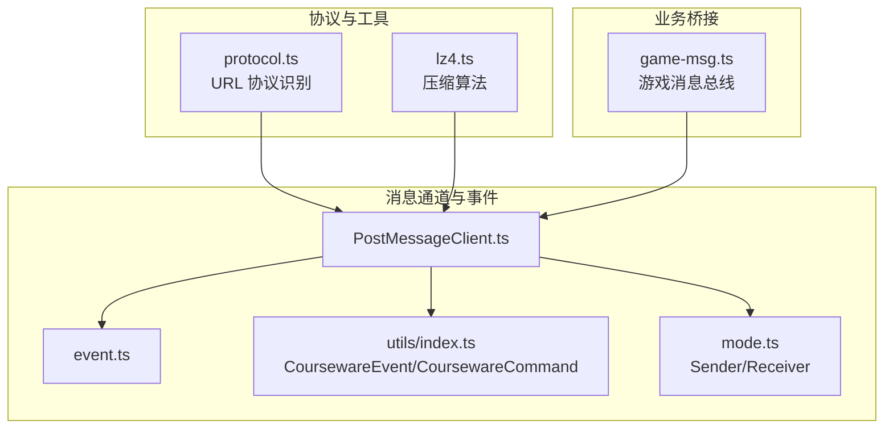
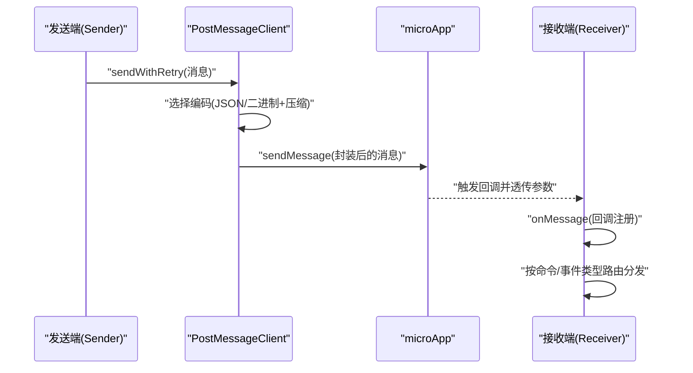
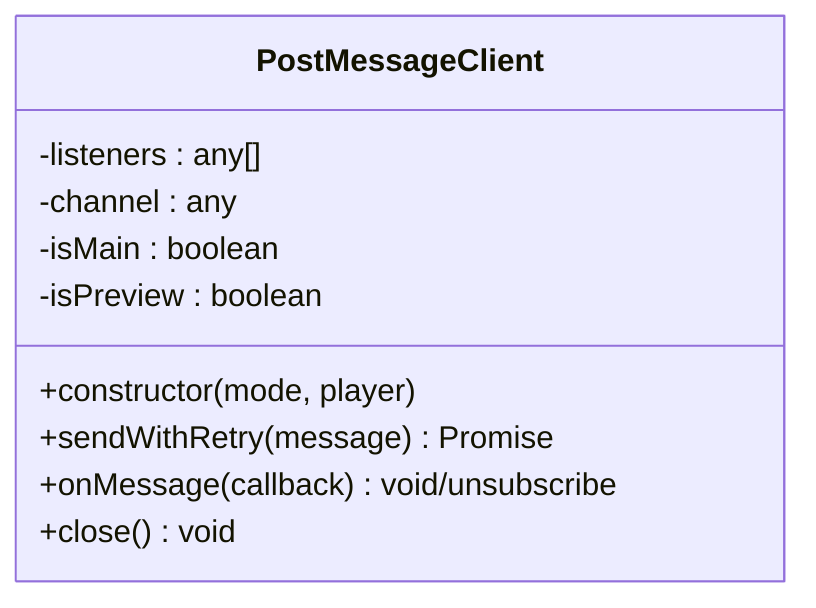
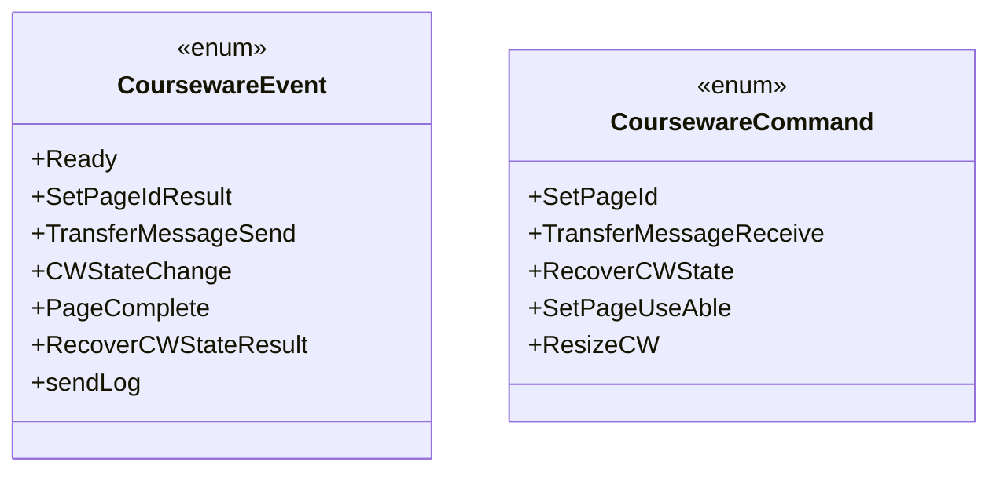
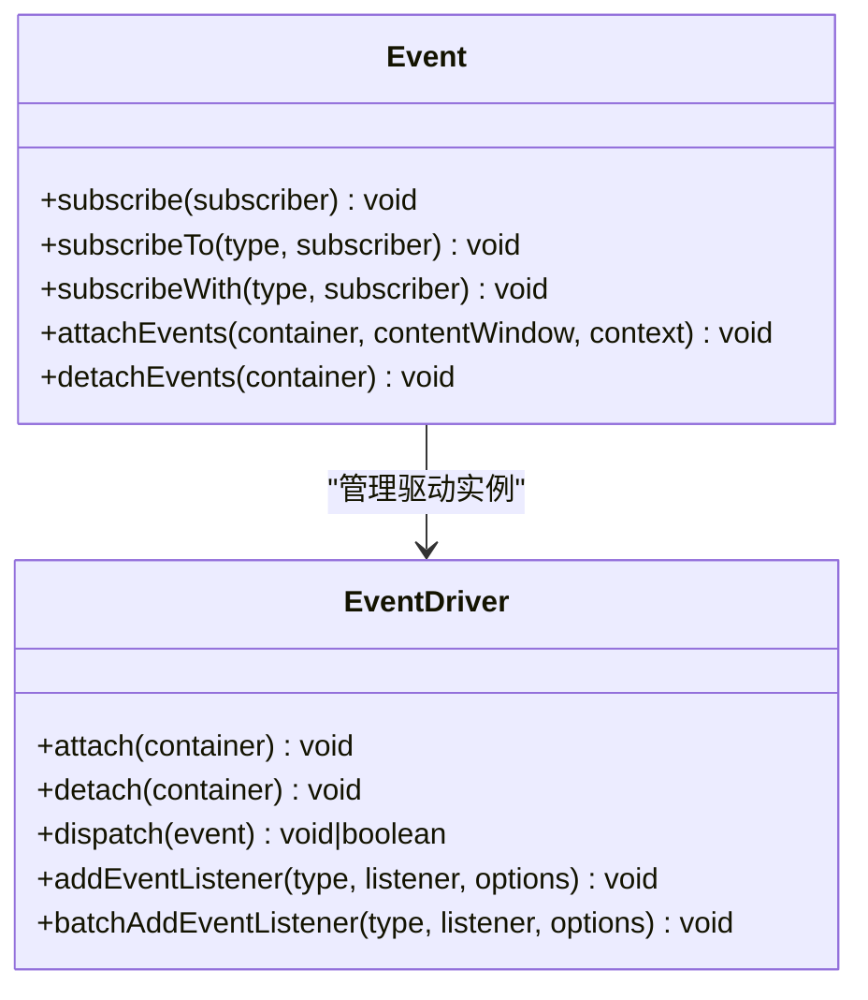
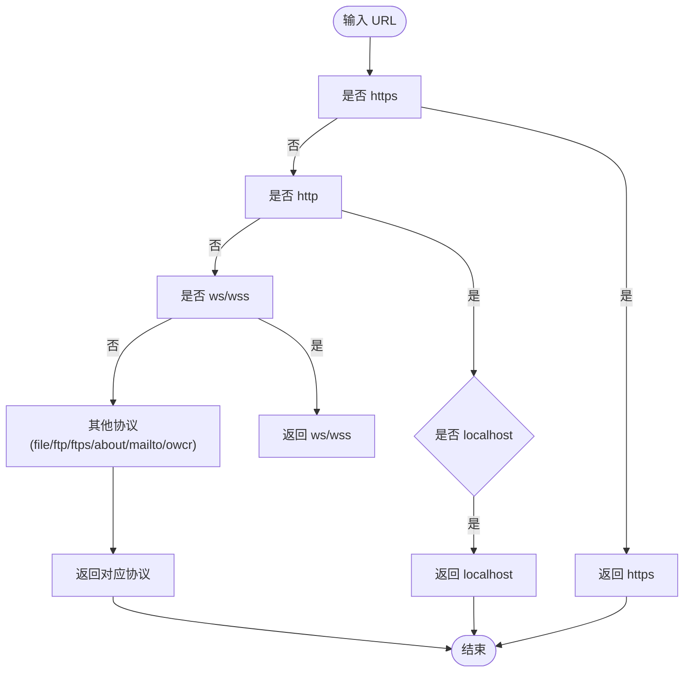
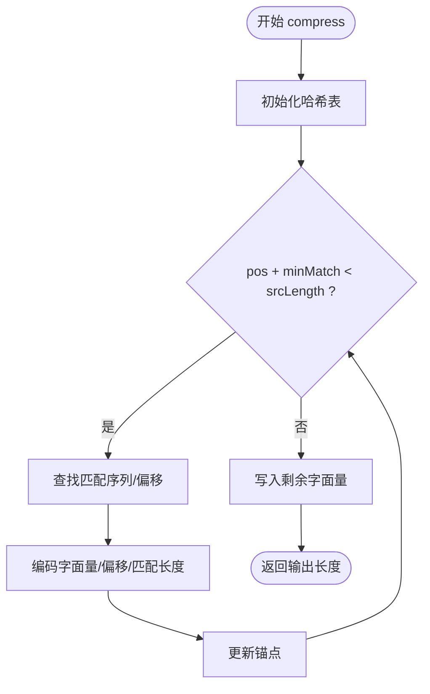
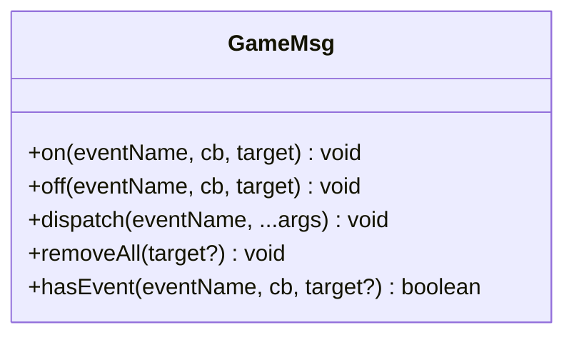
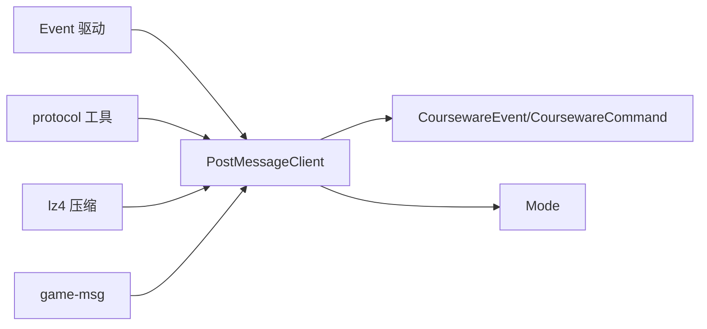

# 消息协议规范

<cite>
**本文引用的文件**
- [common/render-core/components/PostMessageClient.ts](file://common/render-core/components/PostMessageClient.ts)
- [common/render-core/utils/index.ts](file://common/render-core/utils/index.ts)
- [common/render-core/shared/mode.ts](file://common/render-core/shared/mode.ts)
- [packages/shared/src/event.ts](file://packages/shared/src/event.ts)
- [bridge/mcc-player/src/utils/protocol.ts](file://bridge/mcc-player/src/utils/protocol.ts)
- [bridge/mcc-demo/src/utils/protocol.ts](file://bridge/mcc-demo/src/utils/protocol.ts)
- [bridge/mcc-player/src/libs/lz4/lz4.ts](file://bridge/mcc-player/src/libs/lz4/lz4.ts)
- [bridge/mcc-player/src/components/game-manage/game-msg.ts](file://bridge/mcc-player/src/components/game-manage/game-msg.ts)
- [project-analysis/05_高频面试问题.md](file://project-analysis/05_高频面试问题.md)
- [project-analysis/08_工程化能力分析.md](file://project-analysis/08_工程化能力分析.md)
- [project-analysis/10_系统演进路线.md](file://project-analysis/10_系统演进路线.md)
</cite>

## 目录
1. [引言](#引言)
2. [项目结构](#项目结构)
3. [核心组件](#核心组件)
4. [架构总览](#架构总览)
5. [详细组件分析](#详细组件分析)
6. [依赖分析](#依赖分析)
7. [性能考虑](#性能考虑)
8. [故障排查指南](#故障排查指南)
9. [结论](#结论)
10. [附录](#附录)

## 引言
本文件面向“消息协议规范”的制定与落地，结合仓库中现有的消息通道实现与工具库，给出统一的消息格式标准、消息类型分类、编码与解码规则、路由与分发机制、版本管理策略以及测试与质量保障建议。目标是在多端（如课件端、预览端、MCC 端、原生桥等）之间建立稳定、可演进、可验证的消息契约。

## 项目结构
围绕消息协议的关键实现分布在以下模块：
- 事件与消息通道：PostMessageClient、CoursewareEvent/CoursewareCommand、Event 驱动
- 协议识别与校验：protocol 工具
- 压缩算法：lz4 实现
- 游戏与 MCC 通信：game-msg
- 版本与兼容策略：工作区协议与 schemaVersion 的实践

**图表来源**
- [common/render-core/components/PostMessageClient.ts:1-80](file://common/render-core/components/PostMessageClient.ts#L1-L80)
- [common/render-core/utils/index.ts:24-40](file://common/render-core/utils/index.ts#L24-L40)
- [common/render-core/shared/mode.ts:1-4](file://common/render-core/shared/mode.ts#L1-L4)
- [packages/shared/src/event.ts:1-380](file://packages/shared/src/event.ts#L1-L380)
- [bridge/mcc-player/src/utils/protocol.ts:1-66](file://bridge/mcc-player/src/utils/protocol.ts#L1-L66)
- [bridge/mcc-player/src/libs/lz4/lz4.ts:1-191](file://bridge/mcc-player/src/libs/lz4/lz4.ts#L1-L191)
- [bridge/mcc-player/src/components/game-manage/game-msg.ts:1-90](file://bridge/mcc-player/src/components/game-manage/game-msg.ts#L1-L90)

**章节来源**
- [common/render-core/components/PostMessageClient.ts:1-80](file://common/render-core/components/PostMessageClient.ts#L1-L80)
- [common/render-core/utils/index.ts:24-40](file://common/render-core/utils/index.ts#L24-L40)
- [common/render-core/shared/mode.ts:1-4](file://common/render-core/shared/mode.ts#L1-L4)
- [packages/shared/src/event.ts:1-380](file://packages/shared/src/event.ts#L1-L380)
- [bridge/mcc-player/src/utils/protocol.ts:1-66](file://bridge/mcc-player/src/utils/protocol.ts#L1-L66)
- [bridge/mcc-player/src/libs/lz4/lz4.ts:1-191](file://bridge/mcc-player/src/libs/lz4/lz4.ts#L1-L191)
- [bridge/mcc-player/src/components/game-manage/game-msg.ts:1-90](file://bridge/mcc-player/src/components/game-manage/game-msg.ts#L1-L90)

## 核心组件
- 消息通道与路由
  - PostMessageClient：封装发送/接收逻辑，支持预览模式（BroadcastChannel）与生产模式（microApp.forceDispatch），并区分 Sender/Receiver 角色。
  - CoursewareEvent/CoursewareCommand：定义事件与命令枚举，作为消息类型与路由标识。
  - Event 驱动：提供订阅/发布、批量事件绑定、容器附加/分离等能力，支撑消息分发与生命周期管理。
- 协议与校验
  - protocol 工具：提供 URL 协议识别与本地主机判定，辅助消息路由与安全策略。
- 编码与压缩
  - lz4：提供压缩边界估算与压缩流程，可用于大体量数据传输的压缩编码。
- 业务桥接
  - game-msg：游戏与 MCC 间的事件总线，便于游戏侧消息的注册、派发与移除。

**章节来源**
- [common/render-core/components/PostMessageClient.ts:1-80](file://common/render-core/components/PostMessageClient.ts#L1-L80)
- [common/render-core/utils/index.ts:24-40](file://common/render-core/utils/index.ts#L24-L40)
- [packages/shared/src/event.ts:282-380](file://packages/shared/src/event.ts#L282-L380)
- [bridge/mcc-player/src/utils/protocol.ts:1-66](file://bridge/mcc-player/src/utils/protocol.ts#L1-L66)
- [bridge/mcc-player/src/libs/lz4/lz4.ts:40-53](file://bridge/mcc-player/src/libs/lz4/lz4.ts#L40-L53)
- [bridge/mcc-player/src/components/game-manage/game-msg.ts:1-90](file://bridge/mcc-player/src/components/game-manage/game-msg.ts#L1-L90)

## 架构总览
消息协议在多端之间的交互路径如下：
- 发送端（Sender）构造消息，选择编码方式（JSON 或二进制+压缩），通过 PostMessageClient 发送。
- 接收端（Receiver）注册监听，根据命令/事件类型进行路由分发。
- 可选：使用 protocol 工具进行协议校验，使用 lz4 进行压缩以降低带宽。
- 可选：游戏桥接通过 game-msg 提供事件总线，便于游戏侧消息统一管理。

**图表来源**
- [common/render-core/components/PostMessageClient.ts:49-62](file://common/render-core/components/PostMessageClient.ts#L49-L62)
- [common/render-core/utils/index.ts:24-40](file://common/render-core/utils/index.ts#L24-L40)
- [packages/shared/src/event.ts:282-380](file://packages/shared/src/event.ts#L282-L380)

## 详细组件分析

### 组件A：PostMessageClient（消息通道）
- 职责
  - 封装消息发送与接收，屏蔽预览模式与生产模式差异。
  - 根据角色（Sender/Receiver）与目标（预览/生产）选择不同通道与回调。
- 关键行为
  - 发送：在 Sender 模式下，预览模式使用 BroadcastChannel，生产模式通过 microApp.forceDispatch 发送，并标记消息已发送。
  - 接收：在 Receiver 模式下，注册监听并转发到内部回调队列。
- 与协议的关系
  - 可结合 protocol 工具进行 URL/协议校验，确保消息路由安全。

**图表来源**
- [common/render-core/components/PostMessageClient.ts:4-80](file://common/render-core/components/PostMessageClient.ts#L4-L80)

**章节来源**
- [common/render-core/components/PostMessageClient.ts:1-80](file://common/render-core/components/PostMessageClient.ts#L1-L80)
- [common/render-core/shared/mode.ts:1-4](file://common/render-core/shared/mode.ts#L1-L4)

### 组件B：CoursewareEvent/CoursewareCommand（消息类型）
- 分类
  - 事件（Event）：如 ready、transferMessageSend、cwStateChange、pageComplete 等，用于状态同步与通知。
  - 命令（Command）：如 setPageId、transferMessageReceive、recoverCWState、setPageUseAble、onCourseWareSizeChanged 等，用于控制与数据下发。
- 用途
  - 事件用于“告知”与“上报”，命令用于“请求”与“控制”。

**图表来源**
- [common/render-core/utils/index.ts:24-40](file://common/render-core/utils/index.ts#L24-L40)

**章节来源**
- [common/render-core/utils/index.ts:24-40](file://common/render-core/utils/index.ts#L24-L40)

### 组件C：Event 驱动（订阅/发布与容器绑定）
- 能力
  - 订阅/取消订阅、按类型过滤、批量事件绑定/解绑、容器附加/分离。
  - 支持仅一次监听、仅父/子容器模式等高级选项。
- 价值
  - 为消息分发提供统一抽象，便于在不同容器（window/document/element）上进行事件传播。

**图表来源**
- [packages/shared/src/event.ts:282-380](file://packages/shared/src/event.ts#L282-L380)
- [packages/shared/src/event.ts:103-148](file://packages/shared/src/event.ts#L103-L148)

**章节来源**
- [packages/shared/src/event.ts:1-380](file://packages/shared/src/event.ts#L1-L380)

### 组件D：protocol 工具（协议识别与校验）
- 功能
  - 判断 URL 协议类型（http/https/ws/wss/file/ftp/ftps/about/mailto/owcr 等），并支持 localhost 识别。
- 用途
  - 在消息路由前进行协议校验，确保跨域/跨协议的安全性与正确性。

**图表来源**
- [bridge/mcc-player/src/utils/protocol.ts:28-63](file://bridge/mcc-player/src/utils/protocol.ts#L28-L63)

**章节来源**
- [bridge/mcc-player/src/utils/protocol.ts:1-66](file://bridge/mcc-player/src/utils/protocol.ts#L1-L66)
- [bridge/mcc-demo/src/utils/protocol.ts:1-66](file://bridge/mcc-demo/src/utils/protocol.ts#L1-L66)

### 组件E：lz4 压缩（二进制编码与压缩）
- 能力
  - 提供 compressBound（最大压缩长度估算）、compress（压缩主流程）。
  - 基于 LZ4 算法的哈希表与匹配逻辑，支持大块数据压缩。
- 用途
  - 在消息体较大时，采用二进制+压缩的方式降低带宽与传输时间。

**图表来源**
- [bridge/mcc-player/src/libs/lz4/lz4.ts:46-53](file://bridge/mcc-player/src/libs/lz4/lz4.ts#L46-L53)
- [bridge/mcc-player/src/libs/lz4/lz4.ts:55-188](file://bridge/mcc-player/src/libs/lz4/lz4.ts#L55-L188)

**章节来源**
- [bridge/mcc-player/src/libs/lz4/lz4.ts:1-191](file://bridge/mcc-player/src/libs/lz4/lz4.ts#L1-L191)

### 组件F：game-msg（游戏桥接消息总线）
- 能力
  - on/off/dispatch/removeAll/hasEvent，支持按 target 维度的事件管理。
- 用途
  - 将游戏侧事件统一注册与派发，便于与 MCC 通信。

**图表来源**
- [bridge/mcc-player/src/components/game-manage/game-msg.ts:10-87](file://bridge/mcc-player/src/components/game-manage/game-msg.ts#L10-L87)

**章节来源**
- [bridge/mcc-player/src/components/game-manage/game-msg.ts:1-90](file://bridge/mcc-player/src/components/game-manage/game-msg.ts#L1-L90)

## 依赖分析
- 组件耦合
  - PostMessageClient 依赖 CoursewareEvent/CoursewareCommand 与 Mode，用于消息类型与角色判断。
  - Event 驱动为消息分发提供基础设施，被多种消息场景复用。
  - protocol 工具独立存在，可前置用于路由决策。
  - lz4 作为可选编码组件，与消息体大小相关。
  - game-msg 作为业务桥接，与消息通道解耦。
- 外部依赖
  - microApp（生产模式下的消息桥接）。
  - 浏览器 BroadcastChannel（预览模式）。

**图表来源**
- [common/render-core/components/PostMessageClient.ts:1-80](file://common/render-core/components/PostMessageClient.ts#L1-L80)
- [common/render-core/utils/index.ts:24-40](file://common/render-core/utils/index.ts#L24-L40)
- [common/render-core/shared/mode.ts:1-4](file://common/render-core/shared/mode.ts#L1-L4)
- [packages/shared/src/event.ts:282-380](file://packages/shared/src/event.ts#L282-L380)
- [bridge/mcc-player/src/utils/protocol.ts:1-66](file://bridge/mcc-player/src/utils/protocol.ts#L1-L66)
- [bridge/mcc-player/src/libs/lz4/lz4.ts:1-191](file://bridge/mcc-player/src/libs/lz4/lz4.ts#L1-L191)
- [bridge/mcc-player/src/components/game-manage/game-msg.ts:1-90](file://bridge/mcc-player/src/components/game-manage/game-msg.ts#L1-L90)

**章节来源**
- [common/render-core/components/PostMessageClient.ts:1-80](file://common/render-core/components/PostMessageClient.ts#L1-L80)
- [packages/shared/src/event.ts:1-380](file://packages/shared/src/event.ts#L1-L380)

## 性能考虑
- 压缩策略
  - 使用 lz4 对大体量消息进行压缩，减少网络开销；在 compressBound 估算不足时及时扩容输出缓冲。
- 编码选择
  - 小消息优先 JSON；大消息可采用二进制+压缩组合，提升吞吐。
- 路由与分发
  - 使用 Event 驱动的批量绑定与一次性监听，降低重复绑定成本。
- 生产与预览差异
  - 预览模式使用 BroadcastChannel，生产模式通过 microApp，注意两者性能与可靠性差异。

[本节为通用指导，无需特定文件引用]

## 故障排查指南
- 跨窗口 postMessage 无统一错误码
  - 建议在消息发送/接收处增加显式校验与重试策略，避免运行期才暴露问题。
- 微前端宿主未注入
  - 建议在启动阶段进行 feature-detect，提前发现宿主缺失。
- 协议校验失败
  - 使用 protocol 工具对 URL/协议进行校验，确保路由安全。
- 消息未到达
  - 检查 PostMessageClient 的角色（Sender/Receiver）与目标（预览/生产）配置，确认回调注册与消息标记。

**章节来源**
- [project-analysis/08_工程化能力分析.md:47-56](file://project-analysis/08_工程化能力分析.md#L47-L56)

## 结论
通过将消息类型、通道实现、事件驱动、协议校验与压缩算法有机结合，可在多端之间形成稳定的消息协议。建议在此基础上进一步完善消息头、字段规范与版本管理策略，确保向前/向后兼容与平滑迁移。

[本节为总结，无需特定文件引用]

## 附录

### A. 消息格式与字段规范（建议）
- 消息头（建议字段）
  - messageId：消息唯一标识（UUID）
  - timestamp：消息时间戳（毫秒）
  - type：消息类型（事件/命令）
  - senderId/receiverId：发送方/接收方标识
  - priority：优先级（低/中/高）
  - flags：标志位（压缩/加密/分片标记）
- 消息体
  - data：实际载荷（JSON/二进制）
  - attachments：附件列表（如资源引用）
- 编码与压缩
  - JSON：小消息、易调试
  - 二进制+lz4：大消息、高性能

[本节为规范建议，无需特定文件引用]

### B. 消息类型分类与用途
- 命令消息
  - 用于控制与下发，如 setPageId、transferMessageReceive、recoverCWState、setPageUseAble、onCourseWareSizeChanged。
- 通知消息
  - 用于状态同步与上报，如 ready、transferMessageSend、cwStateChange、pageComplete、sendLog。
- 数据传输消息
  - 用于页面/资源数据的传输，建议结合压缩与分片策略。

**章节来源**
- [common/render-core/utils/index.ts:24-40](file://common/render-core/utils/index.ts#L24-L40)

### C. 版本管理策略（建议）
- 向前兼容
  - 新增字段时保持默认值，未知字段忽略。
- 向后兼容
  - 旧端忽略未知字段，保证基本功能可用。
- 迁移方案
  - 通过 schemaVersion 与迁移脚本，逐步推进协议升级。

**章节来源**
- [project-analysis/05_高频面试问题.md:60-64](file://project-analysis/05_高频面试问题.md#L60-L64)

### D. 测试规范与质量保证
- 单元测试
  - 针对消息发送/接收、事件订阅/取消、协议识别、压缩流程进行覆盖。
- 端到端测试
  - 预览与生产模式双通路验证，包含握手、错误回退与重试。
- 质量门禁
  - 契约测试：序列化样例与预览端 updatePage 对拍。
  - CI 矩阵：构建、单测、类型检查。

**章节来源**
- [project-analysis/08_工程化能力分析.md:66-76](file://project-analysis/08_工程化能力分析.md#L66-L76)
- [project-analysis/10_系统演进路线.md:62-68](file://project-analysis/10_系统演进路线.md#L62-L68)