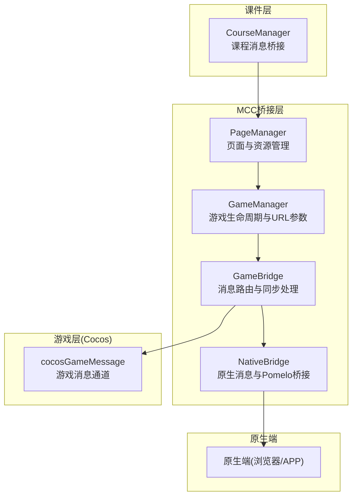
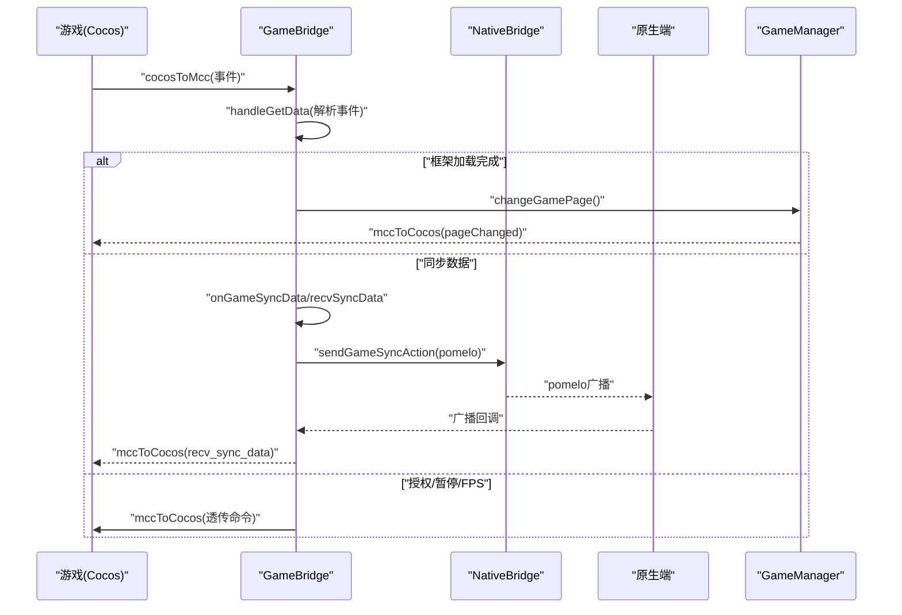
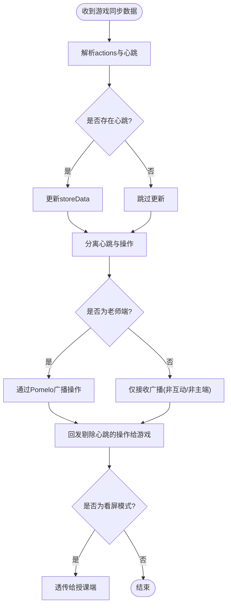
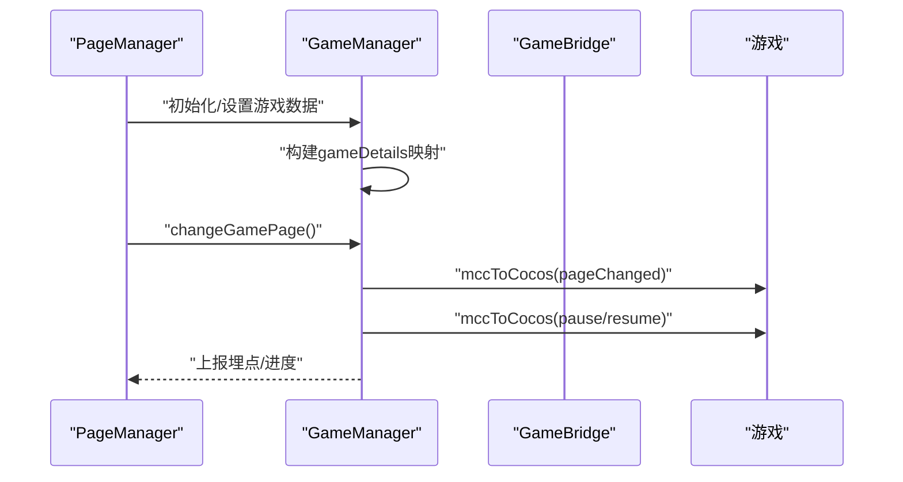
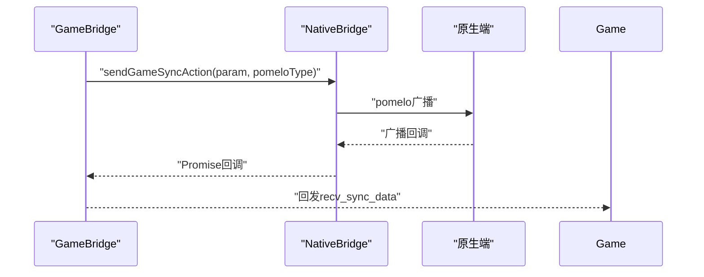
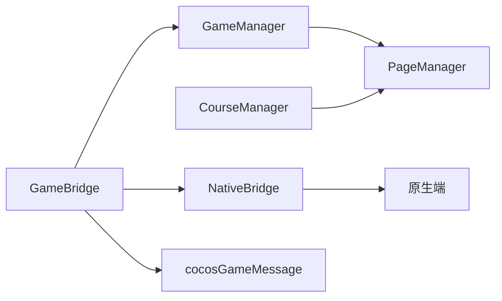

# 游戏通信

<cite>
**本文引用的文件**
- [bridge/mcc-player/src/components/game-manage/gameBridge.ts](file://bridge/mcc-player/src/components/game-manage/gameBridge.ts)
- [bridge/mcc-player/src/components/game-manage/gameManager.ts](file://bridge/mcc-player/src/components/game-manage/gameManager.ts)
- [bridge/mcc-player/src/components/game-manage/type.ts](file://bridge/mcc-player/src/components/game-manage/type.ts)
- [bridge/mcc-player/src/components/game-manage/game-msg.ts](file://bridge/mcc-player/src/components/game-manage/game-msg.ts)
- [bridge/mcc-player/src/components/native-bridge/nativeBridgeManage.ts](file://bridge/mcc-player/src/components/native-bridge/nativeBridgeManage.ts)
- [bridge/mcc-player/src/components/native-bridge/bridge-type.ts](file://bridge/mcc-player/src/components/native-bridge/bridge-type.ts)
- [bridge/mcc-player/src/components/page/pageManager.ts](file://bridge/mcc-player/src/components/page/pageManager.ts)
- [bridge/mcc-player/src/components/course-bridge/courseManager.ts](file://bridge/mcc-player/src/components/course-bridge/courseManager.ts)
- [bridge/mcc-player/src/utils/protocol.ts](file://bridge/mcc-player/src/utils/protocol.ts)
- [bridge/cocos-game-player/index.js](file://bridge/cocos-game-player/index.js)
- [bridge/cocos-game-player/application.js](file://bridge/cocos-game-player/application.js)
</cite>

## 目录
1. [引言](#引言)
2. [项目结构](#项目结构)
3. [核心组件](#核心组件)
4. [架构总览](#架构总览)
5. [详细组件分析](#详细组件分析)
6. [依赖关系分析](#依赖关系分析)
7. [性能考虑](#性能考虑)
8. [故障排除指南](#故障排除指南)
9. [结论](#结论)
10. [附录](#附录)

## 引言
本技术文档围绕“游戏通信机制”展开，聚焦于课件与游戏之间的实时通信实现，涵盖游戏状态同步、动作传递与数据交换、消息管理器设计、同步协议细节、生命周期管理以及使用示例与优化建议。文档基于仓库中的桥接层与Cocos游戏运行时代码，梳理出从课件到游戏、再到原生端的完整消息链路，并给出可操作的排障与优化建议。

## 项目结构
本项目采用多层桥接架构：
- 课件层：通过统一的消息通道与MCC桥接交互，负责页面切换、状态恢复与参数下发。
- MCC桥接层：负责游戏生命周期管理、消息路由、同步数据聚合与下发、原生端交互。
- 游戏层（Cocos）：通过全局消息通道与MCC通信，接收指令、上报动作与状态。
- 原生端：通过Web消息或iOS/Android注入通道与MCC通信，承载Pomelo广播、心跳与控制命令。

图表来源
- [bridge/mcc-player/src/components/course-bridge/courseManager.ts:13-117](file://bridge/mcc-player/src/components/course-bridge/courseManager.ts#L13-L117)
- [bridge/mcc-player/src/components/page/pageManager.ts:17-498](file://bridge/mcc-player/src/components/page/pageManager.ts#L17-L498)
- [bridge/mcc-player/src/components/game-manage/gameManager.ts:65-368](file://bridge/mcc-player/src/components/game-manage/gameManager.ts#L65-L368)
- [bridge/mcc-player/src/components/game-manage/gameBridge.ts:22-388](file://bridge/mcc-player/src/components/game-manage/gameBridge.ts#L22-L388)
- [bridge/mcc-player/src/components/native-bridge/nativeBridgeManage.ts:26-395](file://bridge/mcc-player/src/components/native-bridge/nativeBridgeManage.ts#L26-L395)
- [bridge/mcc-player/src/components/game-manage/game-msg.ts:6-90](file://bridge/mcc-player/src/components/game-manage/game-msg.ts#L6-L90)

章节来源
- [bridge/mcc-player/src/components/course-bridge/courseManager.ts:13-117](file://bridge/mcc-player/src/components/course-bridge/courseManager.ts#L13-L117)
- [bridge/mcc-player/src/components/page/pageManager.ts:17-498](file://bridge/mcc-player/src/components/page/pageManager.ts#L17-L498)
- [bridge/mcc-player/src/components/game-manage/gameManager.ts:65-368](file://bridge/mcc-player/src/components/game-manage/gameManager.ts#L65-L368)
- [bridge/mcc-player/src/components/game-manage/gameBridge.ts:22-388](file://bridge/mcc-player/src/components/game-manage/gameBridge.ts#L22-L388)
- [bridge/mcc-player/src/components/native-bridge/nativeBridgeManage.ts:26-395](file://bridge/mcc-player/src/components/native-bridge/nativeBridgeManage.ts#L26-L395)
- [bridge/mcc-player/src/components/game-manage/game-msg.ts:6-90](file://bridge/mcc-player/src/components/game-manage/game-msg.ts#L6-L90)

## 核心组件
- GameBridge：消息路由中枢，负责游戏消息解析、同步数据聚合、互动状态处理、与原生端的Pomelo桥接。
- GameManager：游戏生命周期与资源参数管理，负责页面切换、预加载、URL参数组装与“看屏模式”数据下发。
- GameBridge消息类型：定义游戏与MCC之间的事件枚举，覆盖启动、同步、资源、授权、透传等。
- NativeBridge：原生消息与Pomelo桥接，负责命令下发、回调Promise化、Pomelo广播与透传。
- PageManager：课件页面与资源管理，负责目录拉取、页面JSON加载、全局数据注入、埋点上报。
- CourseManager：课件侧消息桥接，负责页面切换、状态恢复、尺寸调整等。
- 游戏消息通道：cocosGameMessage，提供注册、派发、移除监听等能力，供游戏侧订阅与广播。

章节来源
- [bridge/mcc-player/src/components/game-manage/gameBridge.ts:22-388](file://bridge/mcc-player/src/components/game-manage/gameBridge.ts#L22-L388)
- [bridge/mcc-player/src/components/game-manage/gameManager.ts:65-368](file://bridge/mcc-player/src/components/game-manage/gameManager.ts#L65-L368)
- [bridge/mcc-player/src/components/game-manage/type.ts:1-67](file://bridge/mcc-player/src/components/game-manage/type.ts#L1-L67)
- [bridge/mcc-player/src/components/native-bridge/nativeBridgeManage.ts:26-395](file://bridge/mcc-player/src/components/native-bridge/nativeBridgeManage.ts#L26-L395)
- [bridge/mcc-player/src/components/page/pageManager.ts:17-498](file://bridge/mcc-player/src/components/page/pageManager.ts#L17-L498)
- [bridge/mcc-player/src/components/course-bridge/courseManager.ts:13-117](file://bridge/mcc-player/src/components/course-bridge/courseManager.ts#L13-L117)
- [bridge/mcc-player/src/components/game-manage/game-msg.ts:6-90](file://bridge/mcc-player/src/components/game-manage/game-msg.ts#L6-L90)

## 架构总览
游戏通信链路由四段组成：
- 游戏到MCC：通过cocosGameMessage派发事件，GameBridge统一解析并分发至相应处理逻辑。
- MCC到原生：NativeBridge将命令与Pomelo消息转发至原生端，或通过postMessage/Web通道。
- 原生到MCC：原生端回调或Pomelo广播经NativeBridge转发，GameBridge/ GameManager处理并回推给游戏。
- 原生到游戏：通过透传命令将原生侧能力暴露给游戏，如授权、暂停/恢复、FPS设置等。

图表来源
- [bridge/mcc-player/src/components/game-manage/gameBridge.ts:44-110](file://bridge/mcc-player/src/components/game-manage/gameBridge.ts#L44-L110)
- [bridge/mcc-player/src/components/game-manage/gameBridge.ts:116-189](file://bridge/mcc-player/src/components/game-manage/gameBridge.ts#L116-L189)
- [bridge/mcc-player/src/components/game-manage/gameManager.ts:197-260](file://bridge/mcc-player/src/components/game-manage/gameManager.ts#L197-L260)
- [bridge/mcc-player/src/components/native-bridge/nativeBridgeManage.ts:254-262](file://bridge/mcc-player/src/components/native-bridge/nativeBridgeManage.ts#L254-L262)

## 详细组件分析

### 游戏消息管理器（cocosGameMessage）
- 设计要点
  - 提供事件注册、注销、派发与全量移除能力。
  - 通过目标对象绑定回调，避免重复注册与内存泄漏。
  - 作为游戏侧与MCC之间的唯一消息通道，确保事件有序分发。
- 使用建议
  - 在组件卸载时调用移除监听，防止重复回调。
  - 事件命名遵循GameEvent枚举，便于统一管理。

章节来源
- [bridge/mcc-player/src/components/game-manage/game-msg.ts:6-90](file://bridge/mcc-player/src/components/game-manage/game-msg.ts#L6-L90)

### GameBridge（消息路由与同步处理）
- 消息路由
  - 监听cocosGameMessage的cocosToMcc事件，按事件名分发处理。
  - 支持主包/框架加载完成、游戏启动、同步数据、透传命令、埋点等。
- 同步数据处理
  - 解析心跳与操作动作，分别处理心跳与操作数据。
  - 老师端将心跳数据上报至服务端并更新storeData；学生端在互动时写入localStorage。
  - 将剔除心跳后的操作数据回发给游戏，同时通过Pomelo广播操作。
  - 被授权学生在“看屏模式”下，将同步消息透传给授课端。
- 互动与状态
  - 维护互动信息与当前页匹配关系，动态计算是否为主/从端。
  - 通过localStorage按互动ID隔离同步数据，避免跨互动污染。
- 生命周期与透传
  - 透传原生端发给游戏的命令（如授权、暂停/恢复、FPS设置）。
  - “看屏模式”下，将当前页游戏数据打包下发给原生端。

图表来源
- [bridge/mcc-player/src/components/game-manage/gameBridge.ts:116-189](file://bridge/mcc-player/src/components/game-manage/gameBridge.ts#L116-L189)
- [bridge/mcc-player/src/components/game-manage/gameBridge.ts:194-243](file://bridge/mcc-player/src/components/game-manage/gameBridge.ts#L194-L243)

章节来源
- [bridge/mcc-player/src/components/game-manage/gameBridge.ts:44-110](file://bridge/mcc-player/src/components/game-manage/gameBridge.ts#L44-L110)
- [bridge/mcc-player/src/components/game-manage/gameBridge.ts:116-189](file://bridge/mcc-player/src/components/game-manage/gameBridge.ts#L116-L189)
- [bridge/mcc-player/src/components/game-manage/gameBridge.ts:194-243](file://bridge/mcc-player/src/components/game-manage/gameBridge.ts#L194-L243)

### GameManager（游戏生命周期与URL参数）
- 生命周期
  - 页面切换：向游戏发送pageChanged事件，触发游戏侧切页逻辑。
  - 预加载：向游戏发送pagePreload事件，提前加载下一页面游戏资源。
  - 暂停/恢复：根据当前页是否为游戏页，向游戏发送暂停或恢复指令。
  - 隐藏游戏：若为游戏页但未配置游戏，向课件隐藏游戏容器。
- URL参数与资源
  - 组装公共模块与子游戏包URL，支持本地/CDN双路径。
  - 提供“看屏模式”数据打包，包含游戏URL、初始化参数与同步数据。
- 数据初始化
  - 从课件目录构建游戏详情映射，记录上下页关系，便于切页与预加载。

图表来源
- [bridge/mcc-player/src/components/game-manage/gameManager.ts:99-176](file://bridge/mcc-player/src/components/game-manage/gameManager.ts#L99-L176)
- [bridge/mcc-player/src/components/game-manage/gameManager.ts:197-260](file://bridge/mcc-player/src/components/game-manage/gameManager.ts#L197-L260)
- [bridge/mcc-player/src/components/game-manage/gameManager.ts:265-277](file://bridge/mcc-player/src/components/game-manage/gameManager.ts#L265-L277)

章节来源
- [bridge/mcc-player/src/components/game-manage/gameManager.ts:99-176](file://bridge/mcc-player/src/components/game-manage/gameManager.ts#L99-L176)
- [bridge/mcc-player/src/components/game-manage/gameManager.ts:197-260](file://bridge/mcc-player/src/components/game-manage/gameManager.ts#L197-L260)
- [bridge/mcc-player/src/components/game-manage/gameManager.ts:265-277](file://bridge/mcc-player/src/components/game-manage/gameManager.ts#L265-L277)

### NativeBridge（原生桥接与Pomelo）
- 命令与回调
  - 通过callNative实现命令到原生的Promise化调用，支持超时与回调。
  - 通过notifyNative将消息发送至原生端，兼容Web与移动端通道。
- Pomelo桥接
  - sendGameSyncAction将游戏同步动作广播至Pomelo，支持普通广播与“仅教师端”广播。
  - 支持透传游戏侧命令到原生端，再由原生端下发给游戏。
- 看屏模式
  - 将GameManager打包的“看屏模式”数据通过sendWatchScreenData下发给原生端。

图表来源
- [bridge/mcc-player/src/components/native-bridge/nativeBridgeManage.ts:254-262](file://bridge/mcc-player/src/components/native-bridge/nativeBridgeManage.ts#L254-L262)
- [bridge/mcc-player/src/components/game-manage/gameBridge.ts:154-157](file://bridge/mcc-player/src/components/game-manage/gameBridge.ts#L154-L157)

章节来源
- [bridge/mcc-player/src/components/native-bridge/nativeBridgeManage.ts:254-262](file://bridge/mcc-player/src/components/native-bridge/nativeBridgeManage.ts#L254-L262)
- [bridge/mcc-player/src/components/game-manage/gameBridge.ts:154-157](file://bridge/mcc-player/src/components/game-manage/gameBridge.ts#L154-L157)

### PageManager（页面与资源）
- 目录与资源
  - 支持本地/远程目录优先级策略，自动降级与CDN回退。
  - 注入全局资源路径，供课件与游戏侧使用。
- 页面状态
  - 维护页面切换状态、加载状态与埋点上报。
- 与GameManager协作
  - 提供isGame判断、pageLoadSuccess标记，驱动GameManager的页面切换流程。

章节来源
- [bridge/mcc-player/src/components/page/pageManager.ts:194-307](file://bridge/mcc-player/src/components/page/pageManager.ts#L194-L307)
- [bridge/mcc-player/src/components/page/pageManager.ts:377-396](file://bridge/mcc-player/src/components/page/pageManager.ts#L377-L396)
- [bridge/mcc-player/src/components/page/pageManager.ts:490-496](file://bridge/mcc-player/src/components/page/pageManager.ts#L490-L496)

### CourseManager（课件桥接）
- 课件侧消息桥接
  - 提供页面切换、状态恢复、尺寸调整、UID设置等命令的Promise封装。
  - 统一事件分发，便于课件侧订阅与响应。

章节来源
- [bridge/mcc-player/src/components/course-bridge/courseManager.ts:40-117](file://bridge/mcc-player/src/components/course-bridge/courseManager.ts#L40-L117)

### Cocos游戏运行时（集成入口）
- 应用初始化
  - 通过index.js加载Cocos引擎，初始化Application并启动。
  - 为游戏侧提供消息通道cocosGameMessage，供游戏注册与派发事件。

章节来源
- [bridge/cocos-game-player/index.js:14-28](file://bridge/cocos-game-player/index.js#L14-L28)
- [bridge/cocos-game-player/application.js:24-56](file://bridge/cocos-game-player/application.js#L24-L56)

## 依赖关系分析
- 组件耦合
  - GameBridge依赖GameManager进行页面切换与URL参数组装；依赖NativeBridge进行Pomelo广播与原生透传。
  - GameManager依赖PageManager进行目录与页面状态管理；依赖NativeBridge进行进度上报。
  - CourseManager与PageManager配合，完成课件侧页面切换与状态恢复。
- 外部依赖
  - 原生端通过postMessage或webkit消息通道与MCC通信；Pomelo用于跨端广播。
  - 协议工具用于判断本地/远程资源路径，保障资源加载稳定性。

图表来源
- [bridge/mcc-player/src/components/game-manage/gameBridge.ts:22-42](file://bridge/mcc-player/src/components/game-manage/gameBridge.ts#L22-L42)
- [bridge/mcc-player/src/components/game-manage/gameManager.ts:65-72](file://bridge/mcc-player/src/components/game-manage/gameManager.ts#L65-L72)
- [bridge/mcc-player/src/components/page/pageManager.ts:17-28](file://bridge/mcc-player/src/components/page/pageManager.ts#L17-L28)
- [bridge/mcc-player/src/components/course-bridge/courseManager.ts:13-17](file://bridge/mcc-player/src/components/course-bridge/courseManager.ts#L13-L17)
- [bridge/mcc-player/src/components/game-manage/game-msg.ts:6-14](file://bridge/mcc-player/src/components/game-manage/game-msg.ts#L6-L14)
- [bridge/mcc-player/src/components/native-bridge/nativeBridgeManage.ts:50-58](file://bridge/mcc-player/src/components/native-bridge/nativeBridgeManage.ts#L50-L58)

章节来源
- [bridge/mcc-player/src/components/game-manage/gameBridge.ts:22-42](file://bridge/mcc-player/src/components/game-manage/gameBridge.ts#L22-L42)
- [bridge/mcc-player/src/components/game-manage/gameManager.ts:65-72](file://bridge/mcc-player/src/components/game-manage/gameManager.ts#L65-L72)
- [bridge/mcc-player/src/components/page/pageManager.ts:17-28](file://bridge/mcc-player/src/components/page/pageManager.ts#L17-L28)
- [bridge/mcc-player/src/components/course-bridge/courseManager.ts:13-17](file://bridge/mcc-player/src/components/course-bridge/courseManager.ts#L13-L17)
- [bridge/mcc-player/src/components/game-manage/game-msg.ts:6-14](file://bridge/mcc-player/src/components/game-manage/game-msg.ts#L6-L14)
- [bridge/mcc-player/src/components/native-bridge/nativeBridgeManage.ts:50-58](file://bridge/mcc-player/src/components/native-bridge/nativeBridgeManage.ts#L50-L58)

## 性能考虑
- 资源加载
  - 本地优先、CDN回退策略，减少首屏等待；对不可用资源快速降级。
  - PageManager对每个页面JSON请求进行幂等缓存，避免重复请求。
- 消息处理
  - 同步数据按心跳与操作分离，避免重复回发心跳；仅透传必要操作。
  - 互动场景下使用localStorage隔离数据，降低服务端压力。
- 生命周期
  - 非游戏页自动暂停引擎，减少GPU/CPU占用；游戏页恢复播放。
  - 预加载下一页面游戏资源，缩短切页时延。

章节来源
- [bridge/mcc-player/src/components/page/pageManager.ts:403-415](file://bridge/mcc-player/src/components/page/pageManager.ts#L403-L415)
- [bridge/mcc-player/src/components/game-manage/gameBridge.ts:145-157](file://bridge/mcc-player/src/components/game-manage/gameBridge.ts#L145-L157)
- [bridge/mcc-player/src/components/game-manage/gameManager.ts:265-277](file://bridge/mcc-player/src/components/game-manage/gameManager.ts#L265-L277)

## 故障排除指南
- 游戏无法接收初始化参数
  - 检查GameBridge是否正确注册cocosGameMessage监听；确认GameEvent.GetInitParam处理逻辑。
  - 确认PageManager已注入全局资源路径，避免URL拼接错误。
- 同步数据未生效
  - 核对心跳与操作分离逻辑，确保心跳不回发给游戏。
  - 确认老师端已上报心跳至服务端，学生端已从storeData或localStorage读取。
- 切页异常
  - 检查GameManager的pageChanged事件是否正确下发；确认非游戏页是否触发暂停。
  - 确认PageManager的pageLoadSuccess标志位与SDK进度上报。
- 原生端无回调
  - 检查NativeBridge的callNative超时与Promise回调；确认消息通道（postMessage/WebKit）是否可用。
- 资源加载失败
  - 检查protocol工具对本地/远程路径的判定；确认CDN回退链路是否正常。

章节来源
- [bridge/mcc-player/src/components/game-manage/gameBridge.ts:44-110](file://bridge/mcc-player/src/components/game-manage/gameBridge.ts#L44-L110)
- [bridge/mcc-player/src/components/game-manage/gameBridge.ts:116-189](file://bridge/mcc-player/src/components/game-manage/gameBridge.ts#L116-L189)
- [bridge/mcc-player/src/components/game-manage/gameManager.ts:197-260](file://bridge/mcc-player/src/components/game-manage/gameManager.ts#L197-L260)
- [bridge/mcc-player/src/components/native-bridge/nativeBridgeManage.ts:156-175](file://bridge/mcc-player/src/components/native-bridge/nativeBridgeManage.ts#L156-L175)
- [bridge/mcc-player/src/utils/protocol.ts:14-66](file://bridge/mcc-player/src/utils/protocol.ts#L14-L66)

## 结论
本方案通过清晰的消息分层与职责划分，实现了课件、MCC、游戏与原生端之间的稳定通信。GameBridge承担消息中枢与同步聚合，GameManager负责生命周期与资源参数，NativeBridge提供原生与Pomelo桥接，PageManager与CourseManager保障页面与资源管理。在性能与可靠性方面，采用本地优先与CDN回退、心跳与操作分离、预加载与暂停策略等手段，有效提升用户体验。

## 附录
- 使用示例（概念性说明）
  - 动作同步：游戏侧产生操作事件，经cocosGameMessage上报至GameBridge，GameBridge剔除心跳后回发给游戏，并通过Pomelo广播给其他端。
  - 进度上报：GameManager在页面切换时上报埋点；NativeBridge在SDK加载阶段上报进度。
  - 结果反馈：原生端通过透传命令将拍照/录音等能力暴露给游戏，游戏侧通过GameEvent.EventTracking上报业务埋点。
- 关键事件枚举参考
  - 游戏->MCC：RequestMainGameInitDone、RequestFrameGameInitDone、SendSyncData、RequestGameStart、RequestGameToClient、EventTracking等。
  - MCC->游戏：RecvSyncData、RecvKeepPlaying、RecvRestart、RecvClientToGame等。
  - 原生->MCC：HandleStoredData、WatchScreen、GetPageGameData等。
  - 原生->游戏：onInteractAction、pauseOrResumeGame、setGameFPS等。

章节来源
- [bridge/mcc-player/src/components/game-manage/type.ts:1-67](file://bridge/mcc-player/src/components/game-manage/type.ts#L1-L67)
- [bridge/mcc-player/src/components/native-bridge/bridge-type.ts:1-73](file://bridge/mcc-player/src/components/native-bridge/bridge-type.ts#L1-L73)