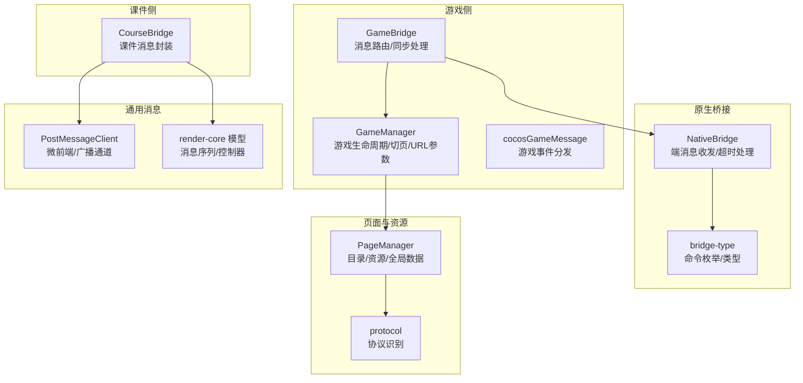
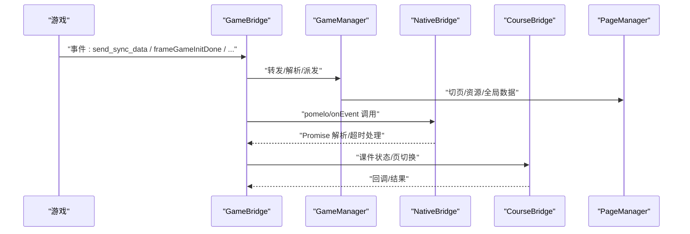
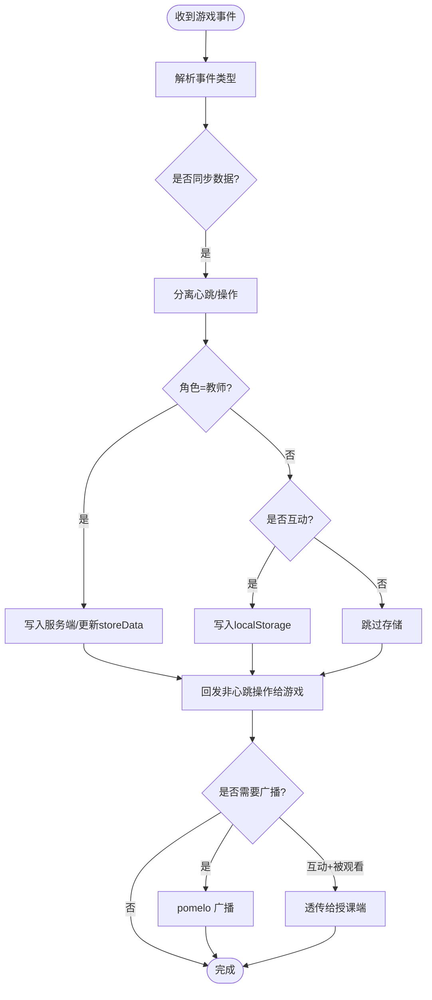
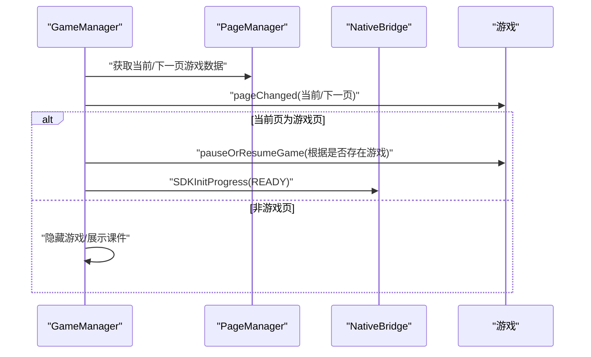
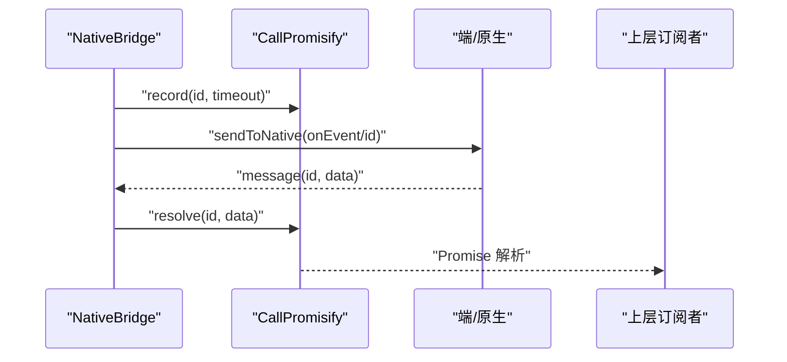
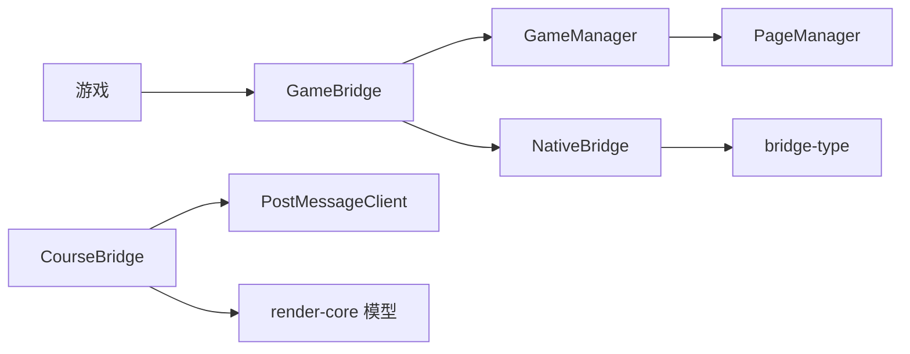

# 通信机制

<cite>
**本文引用的文件**
- [bridge/mcc-player/src/components/game-manage/gameBridge.ts](file://bridge/mcc-player/src/components/game-manage/gameBridge.ts)
- [bridge/mcc-player/src/components/game-manage/gameManager.ts](file://bridge/mcc-player/src/components/game-manage/gameManager.ts)
- [bridge/mcc-player/src/components/native-bridge/nativeBridgeManage.ts](file://bridge/mcc-player/src/components/native-bridge/nativeBridgeManage.ts)
- [bridge/mcc-player/src/components/native-bridge/bridge-type.ts](file://bridge/mcc-player/src/components/native-bridge/bridge-type.ts)
- [bridge/mcc-player/src/components/course-bridge/courseManager.ts](file://bridge/mcc-player/src/components/course-bridge/courseManager.ts)
- [bridge/mcc-player/src/components/course-bridge/type.ts](file://bridge/mcc-player/src/components/course-bridge/type.ts)
- [bridge/mcc-player/src/components/page/pageManager.ts](file://bridge/mcc-player/src/components/page/pageManager.ts)
- [bridge/mcc-player/src/utils/protocol.ts](file://bridge/mcc-player/src/utils/protocol.ts)
- [bridge/mcc-player/src/libs/call-promisify/index.ts](file://bridge/mcc-player/src/libs/call-promisify/index.ts)
- [bridge/mcc-player/src/components/game-manage/game-msg.ts](file://bridge/mcc-player/src/components/game-manage/game-msg.ts)
- [common/render-core/components/PostMessageClient.ts](file://common/render-core/components/PostMessageClient.ts)
- [common/render-core/shared/mode.ts](file://common/render-core/shared/mode.ts)
- [common/render-core/models/context.ts](file://common/render-core/models/context.ts)
- [common/render-core/widgets/index.tsx](file://common/render-core/widgets/index.tsx)
- [preview/src/main.tsx](file://preview/src/main.tsx)
- [bridge/mcc-player/src/interface/index.ts](file://bridge/mcc-player/src/interface/index.ts)
</cite>

## 目录
1. [引言](#引言)
2. [项目结构](#项目结构)
3. [核心组件](#核心组件)
4. [架构总览](#架构总览)
5. [详细组件分析](#详细组件分析)
6. [依赖关系分析](#依赖关系分析)
7. [性能考量](#性能考量)
8. [故障排除指南](#故障排除指南)
9. [结论](#结论)
10. [附录](#附录)

## 引言
本文件面向“游戏桥接系统”的通信机制，系统性梳理跨应用通信的设计与实现，覆盖消息传递、事件分发、数据同步、原生桥接协议、双向通信（游戏↔课件↔端）、消息队列与异步处理、通信协议规范（消息格式、编码、版本兼容）以及调试与排障建议。目标读者既包括一线工程师，也包括对技术细节感兴趣的非专业读者。

## 项目结构
围绕“桥接”主题，相关代码主要分布在以下模块：
- 游戏侧桥接与消息：mcc-player 中的 gameBridge、gameManager、game-msg
- 原生桥接与端通信：nativeBridgeManage、bridge-type
- 课件桥接：courseManager、course-bridge/type
- 页面与资源管理：pageManager、protocol
- 通用消息序列与传输：PostMessageClient、render-core 的消息模型
- 异步与超时：call-promisify
- 接口与常量：interface/index

图示来源
- [bridge/mcc-player/src/components/game-manage/gameBridge.ts:22-42](file://bridge/mcc-player/src/components/game-manage/gameBridge.ts#L22-L42)
- [bridge/mcc-player/src/components/game-manage/gameManager.ts:65-72](file://bridge/mcc-player/src/components/game-manage/gameManager.ts#L65-L72)
- [bridge/mcc-player/src/components/native-bridge/nativeBridgeManage.ts:26-30](file://bridge/mcc-player/src/components/native-bridge/nativeBridgeManage.ts#L26-L30)
- [bridge/mcc-player/src/components/native-bridge/bridge-type.ts:1-73](file://bridge/mcc-player/src/components/native-bridge/bridge-type.ts#L1-L73)
- [bridge/mcc-player/src/components/course-bridge/courseManager.ts:13-23](file://bridge/mcc-player/src/components/course-bridge/courseManager.ts#L13-L23)
- [bridge/mcc-player/src/components/page/pageManager.ts:17-28](file://bridge/mcc-player/src/components/page/pageManager.ts#L17-L28)
- [bridge/mcc-player/src/utils/protocol.ts:14-27](file://bridge/mcc-player/src/utils/protocol.ts#L14-L27)
- [common/render-core/components/PostMessageClient.ts:4-27](file://common/render-core/components/PostMessageClient.ts#L4-L27)
- [common/render-core/models/context.ts:184-225](file://common/render-core/models/context.ts#L184-L225)

章节来源
- [bridge/mcc-player/src/components/game-manage/gameBridge.ts:22-42](file://bridge/mcc-player/src/components/game-manage/gameBridge.ts#L22-L42)
- [bridge/mcc-player/src/components/native-bridge/nativeBridgeManage.ts:26-30](file://bridge/mcc-player/src/components/native-bridge/nativeBridgeManage.ts#L26-L30)
- [bridge/mcc-player/src/components/course-bridge/courseManager.ts:13-23](file://bridge/mcc-player/src/components/course-bridge/courseManager.ts#L13-L23)
- [bridge/mcc-player/src/components/page/pageManager.ts:17-28](file://bridge/mcc-player/src/components/page/pageManager.ts#L17-L28)
- [common/render-core/components/PostMessageClient.ts:4-27](file://common/render-core/components/PostMessageClient.ts#L4-L27)

## 核心组件
- GameBridge：统一处理游戏侧事件，负责消息路由、同步数据拆解与广播、与原生桥接的对接、与课件的联动。
- GameManager：在 GameBridge 基础上，管理游戏生命周期、切页、URL 参数拼装、暂停/恢复控制、观看模式数据透传。
- NativeBridge：封装原生端通信，统一 onEvent/onPomelo 消息分发，提供 call-native/pomelo 两类通道，并内置超时与 Promise 化。
- CourseBridge：封装 microApp.setData/addDataListener，负责课件页切换、状态恢复、尺寸变更等。
- PageManager：课件目录与资源拉取、全局数据注入、CDN/本地路径解析、埋点上报。
- PostMessageClient：在“预览/本地模拟”与“微前端主应用”两种运行时下，分别使用 BroadcastChannel 或 microApp.forceDispatch 实现消息中转。
- call-promisify：统一的 Promise 化调用与超时管理，避免回调地狱与悬挂调用。
- cocosGameMessage：游戏侧事件注册/移除/派发，作为游戏与 MCC 之间的一层轻量事件总线。

章节来源
- [bridge/mcc-player/src/components/game-manage/gameBridge.ts:22-42](file://bridge/mcc-player/src/components/game-manage/gameBridge.ts#L22-L42)
- [bridge/mcc-player/src/components/game-manage/gameManager.ts:65-72](file://bridge/mcc-player/src/components/game-manage/gameManager.ts#L65-L72)
- [bridge/mcc-player/src/components/native-bridge/nativeBridgeManage.ts:26-30](file://bridge/mcc-player/src/components/native-bridge/nativeBridgeManage.ts#L26-L30)
- [bridge/mcc-player/src/components/course-bridge/courseManager.ts:13-23](file://bridge/mcc-player/src/components/course-bridge/courseManager.ts#L13-L23)
- [bridge/mcc-player/src/components/page/pageManager.ts:17-28](file://bridge/mcc-player/src/components/page/pageManager.ts#L17-L28)
- [common/render-core/components/PostMessageClient.ts:4-27](file://common/render-core/components/PostMessageClient.ts#L4-L27)
- [bridge/mcc-player/src/libs/call-promisify/index.ts:8-20](file://bridge/mcc-player/src/libs/call-promisify/index.ts#L8-L20)
- [bridge/mcc-player/src/components/game-manage/game-msg.ts:6-50](file://bridge/mcc-player/src/components/game-manage/game-msg.ts#L6-L50)

## 架构总览
系统采用“多层桥接 + 微前端消息通道”的设计：
- 游戏与 MCC：通过 cocosGameMessage 事件总线进行消息派发，GameBridge 统一处理。
- MCC 与原生端：通过 NativeBridge 的 onEvent/onPomelo 通道，结合 call-native 超时机制，实现可靠调用。
- MCC 与课件：通过 CourseBridge 使用 microApp.setData/addDataListener，实现跨应用数据与状态同步。
- 课件内部消息：通过 PostMessageClient 在“预览/本地模拟”与“微前端主应用”两种模式下，分别使用 BroadcastChannel 或 forceDispatch。
- 数据同步：心跳与操作数据分离，区分“教师端/互动学生/普通学生”，分别落地服务端或本地存储。

图示来源
- [bridge/mcc-player/src/components/game-manage/gameBridge.ts:59-110](file://bridge/mcc-player/src/components/game-manage/gameBridge.ts#L59-L110)
- [bridge/mcc-player/src/components/game-manage/gameManager.ts:200-260](file://bridge/mcc-player/src/components/game-manage/gameManager.ts#L200-L260)
- [bridge/mcc-player/src/components/native-bridge/nativeBridgeManage.ts:156-175](file://bridge/mcc-player/src/components/native-bridge/nativeBridgeManage.ts#L156-L175)
- [bridge/mcc-player/src/components/course-bridge/courseManager.ts:40-47](file://bridge/mcc-player/src/components/course-bridge/courseManager.ts#L40-L47)

## 详细组件分析

### 游戏桥接与消息路由（GameBridge）
- 事件入口：监听 cocosGameMessage 的游戏事件，按事件类型分发至相应处理分支。
- 同步数据处理：将心跳与操作数据分离，教师端落地服务端并触发存储，学生端本地缓存；同时将非心跳操作回发给游戏自身。
- 与原生桥接：通过 pomelo 广播同步数据；在观看模式下，将数据透传给授课端。
- 与课件联动：在游戏启动、切页、状态变更时，向课件发送页切换与状态恢复指令。

图示来源
- [bridge/mcc-player/src/components/game-manage/gameBridge.ts:116-163](file://bridge/mcc-player/src/components/game-manage/gameBridge.ts#L116-L163)
- [bridge/mcc-player/src/components/game-manage/gameBridge.ts:169-189](file://bridge/mcc-player/src/components/game-manage/gameBridge.ts#L169-L189)

章节来源
- [bridge/mcc-player/src/components/game-manage/gameBridge.ts:59-163](file://bridge/mcc-player/src/components/game-manage/gameBridge.ts#L59-L163)
- [bridge/mcc-player/src/components/game-manage/gameBridge.ts:169-212](file://bridge/mcc-player/src/components/game-manage/gameBridge.ts#L169-L212)

### 游戏生命周期与切页（GameManager）
- 初始化：根据目录构建游戏页映射，设置 URL 参数（本地/CDN 路径、初始化参数）。
- 切页：向游戏下发 pageChanged 事件，控制引擎暂停/恢复；在游戏页缺失时隐藏游戏、展示课件。
- 预加载：预取下一页游戏资源，提升体验。
- 观看模式：收集当前页游戏参数与同步数据，供授课端查看。

图示来源
- [bridge/mcc-player/src/components/game-manage/gameManager.ts:199-260](file://bridge/mcc-player/src/components/game-manage/gameManager.ts#L199-L260)
- [bridge/mcc-player/src/components/game-manage/gameManager.ts:265-277](file://bridge/mcc-player/src/components/game-manage/gameManager.ts#L265-L277)
- [bridge/mcc-player/src/components/game-manage/gameManager.ts:349-365](file://bridge/mcc-player/src/components/game-manage/gameManager.ts#L349-L365)

章节来源
- [bridge/mcc-player/src/components/game-manage/gameManager.ts:99-176](file://bridge/mcc-player/src/components/game-manage/gameManager.ts#L99-L176)
- [bridge/mcc-player/src/components/game-manage/gameManager.ts:199-260](file://bridge/mcc-player/src/components/game-manage/gameManager.ts#L199-L260)
- [bridge/mcc-player/src/components/game-manage/gameManager.ts:349-365](file://bridge/mcc-player/src/components/game-manage/gameManager.ts#L349-L365)

### 原生桥接与端通信（NativeBridge）
- 通道抽象：onEvent（常规调用）、onPomelo（pomelo 消息）、call-native（带超时的 Promise 化调用）。
- 消息分发：handleMessage 统一分发到 AllNotifyMessage/GameNotifyMessage 事件，供上层订阅。
- 跨平台适配：通过 window.webkit、window.htHammer、window.parent.postMessage 适配 iOS、Android、Web 环境。
- 超时与回调：CallPromisify 统一记录 id、定时器、resolve/reject，避免泄漏与堆积。

图示来源
- [bridge/mcc-player/src/components/native-bridge/nativeBridgeManage.ts:156-175](file://bridge/mcc-player/src/components/native-bridge/nativeBridgeManage.ts#L156-L175)
- [bridge/mcc-player/src/libs/call-promisify/index.ts:11-20](file://bridge/mcc-player/src/libs/call-promisify/index.ts#L11-L20)

章节来源
- [bridge/mcc-player/src/components/native-bridge/nativeBridgeManage.ts:51-90](file://bridge/mcc-player/src/components/native-bridge/nativeBridgeManage.ts#L51-L90)
- [bridge/mcc-player/src/components/native-bridge/nativeBridgeManage.ts:182-205](file://bridge/mcc-player/src/components/native-bridge/nativeBridgeManage.ts#L182-L205)
- [bridge/mcc-player/src/libs/call-promisify/index.ts:8-20](file://bridge/mcc-player/src/libs/call-promisify/index.ts#L8-L20)

### 课件桥接（CourseBridge）
- 使用 microApp.setData/addDataListener，封装 Promise 化调用与消息去重。
- 提供 setPageId、recoverCWState、SetPageUseAble、ResizeCW、TransferMessageReceive、SetUid 等命令。
- 与 PostMessageClient 协同，实现跨应用消息中转与接收。

章节来源
- [bridge/mcc-player/src/components/course-bridge/courseManager.ts:40-47](file://bridge/mcc-player/src/components/course-bridge/courseManager.ts#L40-L47)
- [bridge/mcc-player/src/components/course-bridge/courseManager.ts:54-80](file://bridge/mcc-player/src/components/course-bridge/courseManager.ts#L54-L80)
- [bridge/mcc-player/src/components/course-bridge/type.ts:1-21](file://bridge/mcc-player/src/components/course-bridge/type.ts#L1-L21)

### 页面与资源管理（PageManager）
- 目录与资源：支持本地/远程双栈，自动回退与 CDN 切换；注入全局数据给课件。
- 全局数据：通过 microApp.forceSetGlobalData 注入页面 JSON，供课件消费。
- 埋点：封装阿里日志发送，统一字段与批次策略。

章节来源
- [bridge/mcc-player/src/components/page/pageManager.ts:194-307](file://bridge/mcc-player/src/components/page/pageManager.ts#L194-L307)
- [bridge/mcc-player/src/components/page/pageManager.ts:391-396](file://bridge/mcc-player/src/components/page/pageManager.ts#L391-L396)
- [bridge/mcc-player/src/components/page/pageManager.ts:490-496](file://bridge/mcc-player/src/components/page/pageManager.ts#L490-L496)

### 通用消息序列与传输（PostMessageClient）
- 两种运行时：
  - 预览/本地模拟：使用 BroadcastChannel 实现类似“多窗口同步”的广播。
  - 微前端主应用：使用 window.microApp.forceDispatch 实现跨应用消息。
- 发送/接收：支持 retry、marked 标记、监听器注册与清理。

章节来源
- [common/render-core/components/PostMessageClient.ts:10-47](file://common/render-core/components/PostMessageClient.ts#L10-L47)
- [common/render-core/components/PostMessageClient.ts:49-75](file://common/render-core/components/PostMessageClient.ts#L49-L75)

### 游戏事件总线（cocosGameMessage）
- 提供 on/off/dispatch 三件套，支持 target 校验与重复注册防护。
- 作为游戏与 MCC 的事件中枢，避免直接耦合。

章节来源
- [bridge/mcc-player/src/components/game-manage/game-msg.ts:6-50](file://bridge/mcc-player/src/components/game-manage/game-msg.ts#L6-L50)

## 依赖关系分析
- 组件耦合：
  - GameBridge 依赖 GameManager、NativeBridge、PageManage、CourseBridge 的部分能力。
  - NativeBridge 依赖 bridge-type 的命令枚举与类型。
  - CourseBridge 依赖 microApp 的 setData/addDataListener。
  - PageManager 依赖 protocol 与 axios，负责资源路径与全局数据注入。
- 事件流：
  - 游戏事件 → GameBridge → GameManager → PageManager
  - 原生/端事件 → NativeBridge → GameBridge → CourseBridge
  - 课件事件 → CourseBridge → PostMessageClient → 渲染核消息序列

图示来源
- [bridge/mcc-player/src/components/game-manage/gameBridge.ts:22-42](file://bridge/mcc-player/src/components/game-manage/gameBridge.ts#L22-L42)
- [bridge/mcc-player/src/components/native-bridge/nativeBridgeManage.ts:26-30](file://bridge/mcc-player/src/components/native-bridge/nativeBridgeManage.ts#L26-L30)
- [bridge/mcc-player/src/components/course-bridge/courseManager.ts:13-23](file://bridge/mcc-player/src/components/course-bridge/courseManager.ts#L13-L23)
- [common/render-core/components/PostMessageClient.ts:4-27](file://common/render-core/components/PostMessageClient.ts#L4-L27)

## 性能考量
- 异步与超时：
  - call-native 默认超时控制，避免阻塞；超时回调可触发降级或重试。
- 消息批处理：
  - PostMessageClient 在“发送端”对非 state 类消息进行批量发送，降低通信开销。
- 资源加载：
  - PageManager 支持本地优先、CDN 回退与多 host 切换，提升稳定性与速度。
- 本地缓存：
  - 互动场景下的心跳数据本地持久化，减少网络往返。

章节来源
- [bridge/mcc-player/src/libs/call-promisify/index.ts:11-20](file://bridge/mcc-player/src/libs/call-promisify/index.ts#L11-L20)
- [common/render-core/components/PostMessageClient.ts:71-75](file://common/render-core/components/PostMessageClient.ts#L71-L75)
- [bridge/mcc-player/src/components/page/pageManager.ts:426-465](file://bridge/mcc-player/src/components/page/pageManager.ts#L426-L465)
- [bridge/mcc-player/src/components/game-manage/gameBridge.ts:341-362](file://bridge/mcc-player/src/components/game-manage/gameBridge.ts#L341-L362)

## 故障排除指南
- 常见问题定位
  - 原生调用无响应：检查 NativeBridge 的 sendToNative 路径与 window.webkit/jsHandler 是否可用；确认 CallPromisify 是否触发超时。
  - 课件页切换失败：确认 CourseBridge 的 setPageId 返回值与 PageManager 的 pageLoadSuccess 状态。
  - 游戏同步数据未到达：检查 GameBridge 的 onGameSyncData/recvSyncData 分支，确认角色与互动状态。
  - 预览/本地模拟消息不通：确认 PostMessageClient 的 channel 类型（BroadcastChannel vs forceDispatch）与监听器注册。
- 日志与埋点
  - PageManager 的 aliLogSend 提供统一埋点入口；GameBridge/GameManager/NativeBridge 内部均带有日志输出，便于链路追踪。
- 调试建议
  - 使用 preview/src/main.tsx 的状态队列聚合逻辑，观察 state 类消息的最终落盘与全局数据注入。
  - 在 render-core 的 registerMsg/register 控制器中，验证消息序列与控制器的绑定关系。

章节来源
- [bridge/mcc-player/src/components/native-bridge/nativeBridgeManage.ts:196-205](file://bridge/mcc-player/src/components/native-bridge/nativeBridgeManage.ts#L196-L205)
- [bridge/mcc-player/src/components/course-bridge/courseManager.ts:54-72](file://bridge/mcc-player/src/components/course-bridge/courseManager.ts#L54-L72)
- [bridge/mcc-player/src/components/game-manage/gameBridge.ts:116-163](file://bridge/mcc-player/src/components/game-manage/gameBridge.ts#L116-L163)
- [common/render-core/components/PostMessageClient.ts:12-24](file://common/render-core/components/PostMessageClient.ts#L12-L24)
- [preview/src/main.tsx:185-220](file://preview/src/main.tsx#L185-L220)
- [bridge/mcc-player/src/components/page/pageManager.ts:490-496](file://bridge/mcc-player/src/components/page/pageManager.ts#L490-L496)

## 结论
该桥接系统通过清晰的职责分层与多通道通信，实现了游戏、课件与端之间的稳定协作。其关键优势在于：
- 明确的消息边界与事件路由（GameBridge/CourseBridge/NativeBridge）
- 可靠的异步调用与超时控制（call-native + CallPromisify）
- 面向场景的数据同步策略（心跳/操作分离、本地/服务端分流）
- 通用消息序列与微前端通道（PostMessageClient + render-core）

## 附录

### 通信协议规范（消息格式、编码与版本兼容）
- 消息格式
  - onEvent：统一的调用通道，携带 command、param、可选 id（用于 Promise 化）。
  - onPomelo：pomelo 消息通道，携带 type/data。
  - microApp 通道：setData/addDataListener，携带 type、param、timestamp、msgId（可选）。
- 编码方式
  - JSON 字符串化/反序列化；部分通道直接透传对象。
- 版本兼容
  - 通过枚举 CommandType/NotifyType/GameNotifyType 管理命令集，新增命令需在枚举中声明并向前兼容处理。
  - PageManager 的资源路径替换与 CDN 回退策略保证版本差异下的可用性。

章节来源
- [bridge/mcc-player/src/components/native-bridge/bridge-type.ts:1-73](file://bridge/mcc-player/src/components/native-bridge/bridge-type.ts#L1-L73)
- [bridge/mcc-player/src/components/native-bridge/nativeBridgeManage.ts:65-90](file://bridge/mcc-player/src/components/native-bridge/nativeBridgeManage.ts#L65-L90)
- [bridge/mcc-player/src/components/course-bridge/type.ts:23-27](file://bridge/mcc-player/src/components/course-bridge/type.ts#L23-L27)
- [bridge/mcc-player/src/components/page/pageManager.ts:161-188](file://bridge/mcc-player/src/components/page/pageManager.ts#L161-L188)

### 消息队列与异步处理
- call-promisify：基于 Map 的 id->回调队列，支持 resolve/reject 与超时清理。
- PostMessageClient：在“发送端”聚合待发送消息，使用 sendWithRetry 批量发送；在“接收端”通过 addDataListener 接收并分发。
- render-core 模型：registerMsg/register 控制器将消息序列化为队列，按 pageId/msgType/msgName 去重与排序，最终注入全局数据。

章节来源
- [bridge/mcc-player/src/libs/call-promisify/index.ts:8-20](file://bridge/mcc-player/src/libs/call-promisify/index.ts#L8-L20)
- [common/render-core/components/PostMessageClient.ts:49-75](file://common/render-core/components/PostMessageClient.ts#L49-L75)
- [common/render-core/models/context.ts:191-214](file://common/render-core/models/context.ts#L191-L214)
- [preview/src/main.tsx:185-220](file://preview/src/main.tsx#L185-L220)