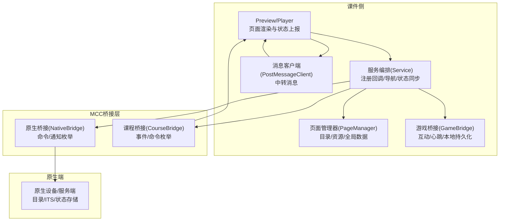
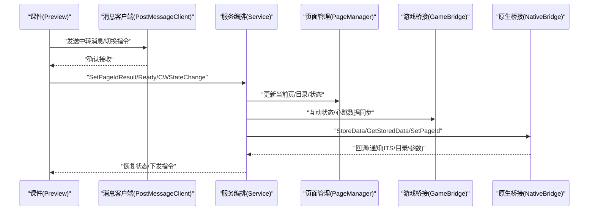
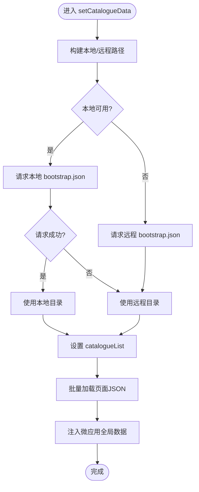
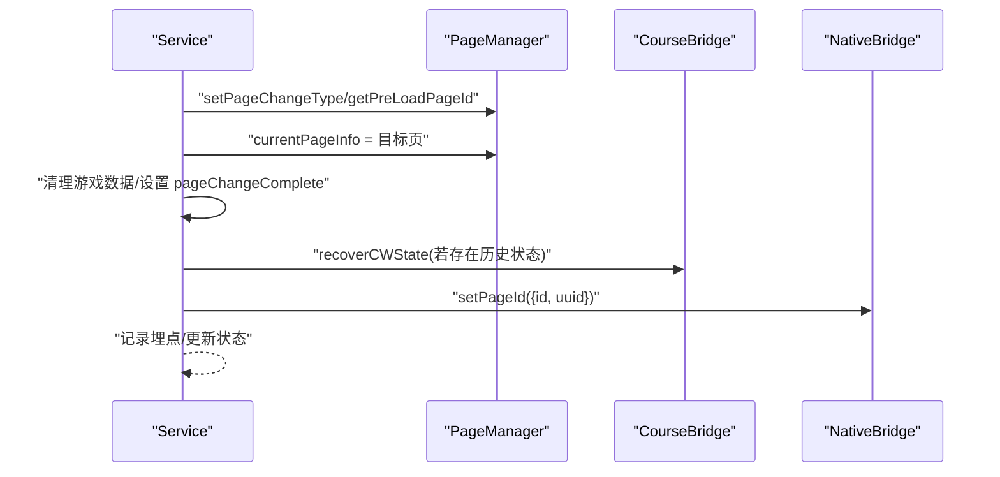
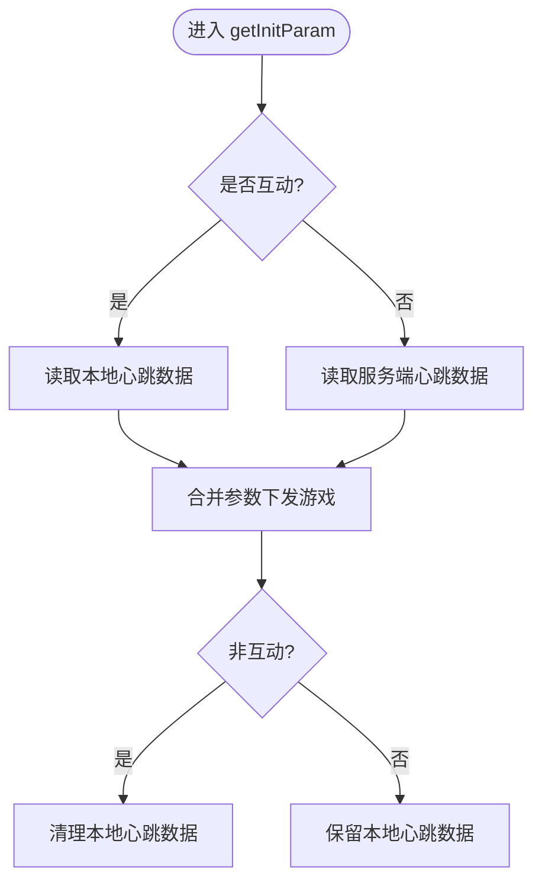
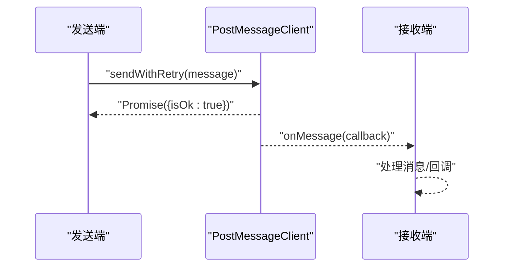
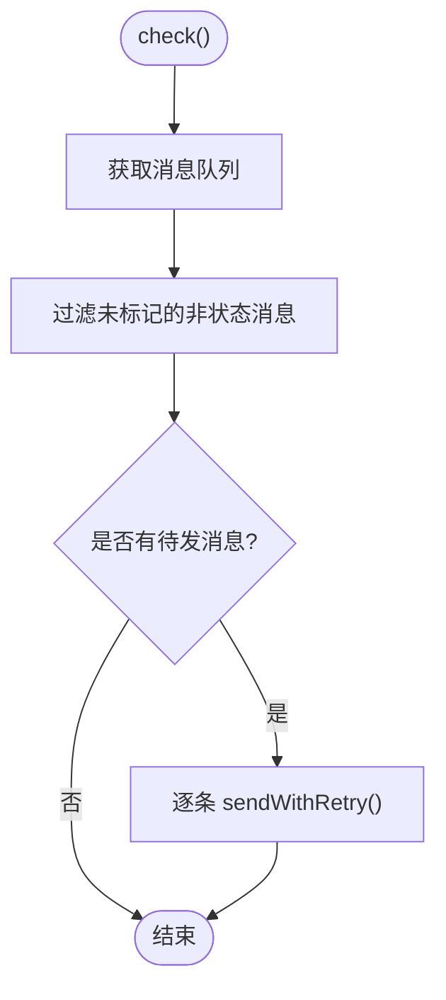
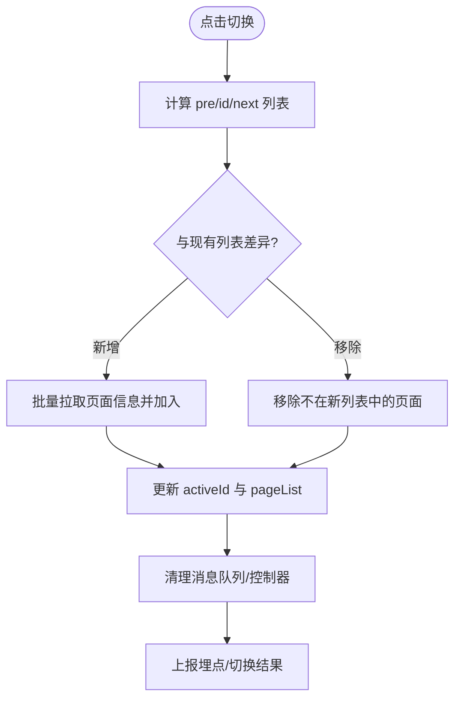
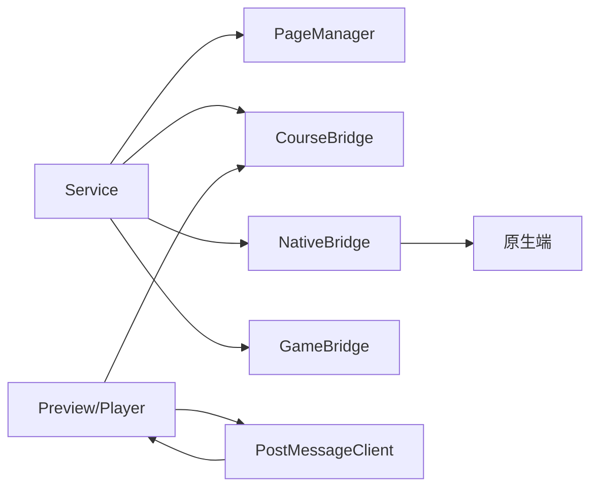

# 页面通信

<cite>
**本文引用的文件**
- [pageManager.ts](file://bridge/mcc-player/src/components/page/pageManager.ts)
- [index.ts](file://bridge/mcc-player/src/components/service/index.ts)
- [page.ts](file://bridge/mcc-player/src/components/page/index.ts)
- [const.ts](file://bridge/mcc-player/src/components/page/const.ts)
- [bridge-type.ts](file://bridge/mcc-player/src/components/native-bridge/bridge-type.ts)
- [type.ts](file://bridge/mcc-player/src/components/page/type.ts)
- [index.ts](file://bridge/mcc-player/src/components/game-manage/gameBridge.ts)
- [index.ts](file://common/render-core/components/PostMessageClient.ts)
- [EventSequence.tsx](file://common/render-core/components/EventSequence.tsx)
- [page.ts](file://preview/src/hook/page.ts)
- [main.tsx](file://preview/src/main.tsx)
- [lru.ts](file://packages/shared/src/lru.ts)
- [observer.ts](file://packages/shared/src/observer.ts)
- [logger/index.ts](file://bridge/mcc-player/src/libs/logger/index.ts)
- [xesLogger/index.ts](file://bridge/mcc-player/src/libs/xesLogger/index.ts)
</cite>

## 目录
1. [引言](#引言)
2. [项目结构](#项目结构)
3. [核心组件](#核心组件)
4. [架构总览](#架构总览)
5. [组件详解](#组件详解)
6. [依赖关系分析](#依赖关系分析)
7. [性能考量](#性能考量)
8. [故障排查指南](#故障排查指南)
9. [结论](#结论)
10. [附录](#附录)

## 引言
本技术文档围绕“页面通信机制”展开，聚焦页面切换、状态管理与导航控制的实现细节，涵盖页面ID管理、状态同步、缓存与内存策略、页面间通信协议、安全性与可靠性保障、典型应用场景以及监控与性能优化策略。目标是帮助开发者快速理解并高效扩展页面通信体系。

## 项目结构
页面通信涉及三大主体：
- 课件侧（Preview/Player）：负责页面渲染、状态采集、消息转发与结果上报。
- MCC（桥接层）：统一调度原生桥接、课程桥接、游戏桥接与页面管理，协调跨端/跨课件通信。
- 原生端（Native）：提供初始化参数、目录信息、状态存储与读取、ITS消息通道等基础设施。

图示来源
- [pageManager.ts:17-498](file://bridge/mcc-player/src/components/page/pageManager.ts#L17-L498)
- [index.ts:41-149](file://bridge/mcc-player/src/components/service/index.ts#L41-L149)
- [index.ts:303-388](file://bridge/mcc-player/src/components/game-manage/gameBridge.ts#L303-L388)
- [index.ts:4-80](file://common/render-core/components/PostMessageClient.ts#L4-L80)
- [bridge-type.ts:1-73](file://bridge/mcc-player/src/components/native-bridge/bridge-type.ts#L1-L73)

章节来源
- [pageManager.ts:17-498](file://bridge/mcc-player/src/components/page/pageManager.ts#L17-L498)
- [index.ts:41-149](file://bridge/mcc-player/src/components/service/index.ts#L41-L149)
- [index.ts:303-388](file://bridge/mcc-player/src/components/game-manage/gameBridge.ts#L303-L388)
- [index.ts:4-80](file://common/render-core/components/PostMessageClient.ts#L4-L80)
- [bridge-type.ts:1-73](file://bridge/mcc-player/src/components/native-bridge/bridge-type.ts#L1-L73)

## 核心组件
- 页面管理器（PageManager）：负责目录解析、资源路径计算、页面JSON加载、全局数据注入、页面类型识别与日志埋点。
- 服务编排（Service）：注册原生/课件/游戏回调，处理页面切换、状态恢复、预渲染、消息队列清理与切页类型判定。
- 游戏桥接（GameBridge）：维护互动状态、本地心跳数据持久化、与课件/原生的同步数据交换。
- 消息客户端（PostMessageClient）：封装跨窗口/微应用消息发送与接收，支持重试与监听。
- 事件序列（EventSequence）：按序检查并发送待发消息，确保消息顺序与完整性。
- 预览/播放器（Preview/Player）：页面切换触发器、首屏资源加载完成检测、结果上报与页面列表维护。

章节来源
- [pageManager.ts:17-498](file://bridge/mcc-player/src/components/page/pageManager.ts#L17-L498)
- [index.ts:41-149](file://bridge/mcc-player/src/components/service/index.ts#L41-L149)
- [index.ts:303-388](file://bridge/mcc-player/src/components/game-manage/gameBridge.ts#L303-L388)
- [index.ts:4-80](file://common/render-core/components/PostMessageClient.ts#L4-L80)
- [EventSequence.tsx:71-91](file://common/render-core/components/EventSequence.tsx#L71-L91)
- [page.ts:19-90](file://preview/src/hook/page.ts#L19-L90)
- [main.tsx:72-111](file://preview/src/main.tsx#L72-L111)

## 架构总览
页面通信采用“事件驱动 + 命令模式”的分层设计：
- 事件层：课件侧通过课程桥接事件（如 SetPageIdResult、TransferMessageSend）与MCC交互。
- 命令层：MCC通过原生桥接命令（如 SetPageId、StoreData、GetStoredData）与原生端交互。
- 状态层：Service集中管理页面状态映射、切页完成标志、预渲染ID与消息队列清理。
- 传输层：PostMessageClient封装消息发送/接收，支持重试与监听，保障消息可达性。

图示来源
- [index.ts:85-149](file://bridge/mcc-player/src/components/service/index.ts#L85-L149)
- [index.ts:17-498](file://bridge/mcc-player/src/components/page/pageManager.ts#L17-L498)
- [index.ts:303-388](file://bridge/mcc-player/src/components/game-manage/gameBridge.ts#L303-L388)
- [index.ts:49-80](file://common/render-core/components/PostMessageClient.ts#L49-L80)
- [bridge-type.ts:1-73](file://bridge/mcc-player/src/components/native-bridge/bridge-type.ts#L1-L73)

## 组件详解

### 页面管理器（PageManager）
职责与特性：
- 目录与资源路径：根据本地/远程配置计算 bootstrap 与 page 路径，支持多CDN回退。
- 页面JSON加载：优先从微应用全局数据命中，否则异步请求并注入全局数据。
- 全局数据注入：将资源路径、CDN域名等注入微应用全局数据，供课件使用。
- 页面类型与状态：提供当前页ID、页面类型判断、页面切换完成标记、日志埋点接口。
- 错误回退：本地不可用时自动回退至远程资源，失败时记录日志并返回空对象。

图示来源
- [pageManager.ts:194-307](file://bridge/mcc-player/src/components/page/pageManager.ts#L194-L307)
- [pageManager.ts:403-465](file://bridge/mcc-player/src/components/page/pageManager.ts#L403-L465)
- [pageManager.ts:391-396](file://bridge/mcc-player/src/components/page/pageManager.ts#L391-L396)

章节来源
- [pageManager.ts:17-498](file://bridge/mcc-player/src/components/page/pageManager.ts#L17-L498)
- [type.ts:1-52](file://bridge/mcc-player/src/components/page/type.ts#L1-L52)
- [const.ts:1-26](file://bridge/mcc-player/src/components/page/const.ts#L1-L26)

### 服务编排（Service）
职责与特性：
- 回调注册：统一注册原生/课件/游戏事件，按命令分派处理。
- 页面切换：根据目标页与当前页索引确定翻页方向，计算预渲染页ID，清理游戏数据，更新当前页信息。
- 状态恢复：若该页存在历史状态且非视频页，向课件恢复状态。
- 通知原生：切页成功后上报原生端当前页ID与UUID，记录埋点。
- 消息队列：在页面切换前后清理与过滤消息队列，保证页面上下文一致性。

图示来源
- [index.ts:621-726](file://bridge/mcc-player/src/components/service/index.ts#L621-L726)
- [index.ts:178-214](file://bridge/mcc-player/src/components/service/index.ts#L178-L214)
- [index.ts:85-149](file://bridge/mcc-player/src/components/service/index.ts#L85-L149)

章节来源
- [index.ts:41-149](file://bridge/mcc-player/src/components/service/index.ts#L41-L149)
- [index.ts:621-726](file://bridge/mcc-player/src/components/service/index.ts#L621-L726)
- [index.ts:178-214](file://bridge/mcc-player/src/components/service/index.ts#L178-L214)

### 游戏桥接（GameBridge）
职责与特性：
- 互动状态：维护当前互动信息，区分互动与非互动两种心跳数据来源。
- 本地持久化：基于 localStorage 按互动ID+用户ID保存/读取心跳数据，支持清理。
- 切页前清理：在主动翻页前清除互动状态，避免脏数据。
- 数据合成：根据当前页ID与互动状态选择本地或服务端心跳数据，下发给游戏。

图示来源
- [index.ts:329-388](file://bridge/mcc-player/src/components/game-manage/gameBridge.ts#L329-L388)
- [index.ts:303-327](file://bridge/mcc-player/src/components/game-manage/gameBridge.ts#L303-L327)

章节来源
- [index.ts:303-388](file://bridge/mcc-player/src/components/game-manage/gameBridge.ts#L303-L388)

### 消息客户端（PostMessageClient）
职责与特性：
- 发送端：封装消息发送，支持重试与标记（marked），确保消息可达。
- 接收端：注册微应用数据监听，过滤指定命令，分发给订阅者。
- 预览模式：使用 BroadcastChannel 模拟广播，便于本地调试。

图示来源
- [index.ts:49-80](file://common/render-core/components/PostMessageClient.ts#L49-L80)

章节来源
- [index.ts:4-80](file://common/render-core/components/PostMessageClient.ts#L4-L80)

### 事件序列（EventSequence）
职责与特性：
- 检查消息队列：仅发送未标记的非状态消息，避免重复与状态干扰。
- 发送流程：逐条发送并等待确认，确保顺序与完整性。

图示来源
- [EventSequence.tsx:71-91](file://common/render-core/components/EventSequence.tsx#L71-L91)
- [index.ts:49-80](file://common/render-core/components/PostMessageClient.ts#L49-L80)

章节来源
- [EventSequence.tsx:71-91](file://common/render-core/components/EventSequence.tsx#L71-L91)

### 预览/播放器（Preview/Player）
职责与特性：
- 页面切换：根据前/当前/后页ID维护页面列表，动态增删，保证上下文一致。
- 首屏检测：监听图片/媒体加载完成，延迟上报切换结果，提升稳定性。
- 日志埋点：在切页开始时上报埋点，便于统计与分析。

图示来源
- [page.ts:19-90](file://preview/src/hook/page.ts#L19-L90)
- [main.tsx:72-111](file://preview/src/main.tsx#L72-L111)

章节来源
- [page.ts:19-90](file://preview/src/hook/page.ts#L19-L90)
- [main.tsx:72-111](file://preview/src/main.tsx#L72-L111)

## 依赖关系分析
- PageManager 依赖微应用全局数据、HTTP 客户端与工具函数，负责资源与目录管理。
- Service 依赖 PageManager、CourseBridge、NativeBridge、GameManager，承担编排与状态同步。
- GameBridge 依赖 PageManager 与本地存储，负责互动与心跳数据。
- PostMessageClient 依赖微应用数据监听与消息命令枚举，提供消息传输能力。
- EventSequence 依赖消息队列与消息客户端，保障消息有序发送。

图示来源
- [index.ts:41-149](file://bridge/mcc-player/src/components/service/index.ts#L41-L149)
- [pageManager.ts:17-498](file://bridge/mcc-player/src/components/page/pageManager.ts#L17-L498)
- [index.ts:303-388](file://bridge/mcc-player/src/components/game-manage/gameBridge.ts#L303-L388)
- [index.ts:4-80](file://common/render-core/components/PostMessageClient.ts#L4-L80)
- [bridge-type.ts:1-73](file://bridge/mcc-player/src/components/native-bridge/bridge-type.ts#L1-L73)

章节来源
- [index.ts:41-149](file://bridge/mcc-player/src/components/service/index.ts#L41-L149)
- [pageManager.ts:17-498](file://bridge/mcc-player/src/components/page/pageManager.ts#L17-L498)
- [index.ts:303-388](file://bridge/mcc-player/src/components/game-manage/gameBridge.ts#L303-L388)
- [index.ts:4-80](file://common/render-core/components/PostMessageClient.ts#L4-L80)
- [bridge-type.ts:1-73](file://bridge/mcc-player/src/components/native-bridge/bridge-type.ts#L1-L73)

## 性能考量
- 资源加载策略
  - 多CDN回退：当本地资源不可用时自动回退远程资源，失败则轮询备用CDN，提升可用性。
  - 首屏延迟上报：监听图片/媒体加载完成后再上报切换结果，减少GPU绘制抖动带来的误判。
- 缓存与内存
  - 微应用全局数据：页面JSON注入全局数据，避免重复请求；切换时清理消息队列与控制器，降低内存占用。
  - LRU 缓存：提供LRU结构用于热点数据缓存，可结合页面状态映射使用。
- 观察者与节流
  - 使用 ResizeObserver、PerformanceObserver、MutationObserver 监测布局变化与性能事件，及时触发重绘/重排优化。
- 日志与批量化
  - 日志模块支持批量上报频率配置与角色设置，避免高频日志对性能的影响。

章节来源
- [pageManager.ts:349-371](file://bridge/mcc-player/src/components/page/pageManager.ts#L349-L371)
- [pageManager.ts:426-465](file://bridge/mcc-player/src/components/page/pageManager.ts#L426-L465)
- [main.tsx:72-111](file://preview/src/main.tsx#L72-L111)
- [lru.ts:147-179](file://packages/shared/src/lru.ts#L147-L179)
- [observer.ts:1-38](file://packages/shared/src/observer.ts#L1-L38)
- [logger/index.ts:106-184](file://bridge/mcc-player/src/libs/logger/index.ts#L106-L184)
- [xesLogger/index.ts:106-184](file://bridge/mcc-player/src/libs/xesLogger/index.ts#L106-L184)

## 故障排查指南
- 页面切换失败
  - 检查 Service 的 setPageIdResult 回调是否触发 pageChangeComplete 标记，确认原生端 setPageId 是否收到。
  - 核对 PageManager 的目录与资源路径是否正确，是否存在本地/远程均不可用的情况。
- 状态未恢复
  - 确认 pageStateMap 中是否存在目标页的历史状态，且页面类型非视频页。
  - 检查 CourseBridge 的 recoverCWState 是否被调用。
- 消息丢失或乱序
  - 使用 EventSequence 的检查逻辑，确保未标记的非状态消息被发送。
  - 在 PostMessageClient 中启用重试并标记消息，避免重复发送。
- 互动心跳异常
  - 核对 GameBridge 的互动状态与本地存储键值，确认是否在非互动状态下清理了本地心跳数据。
- 性能问题
  - 关注首屏加载完成时间，适当延长延迟上报时间。
  - 使用观察者模块监测布局与性能事件，定位卡顿原因。

章节来源
- [index.ts:178-214](file://bridge/mcc-player/src/components/service/index.ts#L178-L214)
- [index.ts:621-726](file://bridge/mcc-player/src/components/service/index.ts#L621-L726)
- [pageManager.ts:194-307](file://bridge/mcc-player/src/components/page/pageManager.ts#L194-L307)
- [index.ts:49-80](file://common/render-core/components/PostMessageClient.ts#L49-L80)
- [EventSequence.tsx:71-91](file://common/render-core/components/EventSequence.tsx#L71-L91)
- [index.ts:303-388](file://bridge/mcc-player/src/components/game-manage/gameBridge.ts#L303-L388)

## 结论
本页面通信体系通过清晰的分层与事件驱动机制，实现了页面切换、状态同步与消息可靠传输。PageManager 提供稳定的资源与目录管理，Service 负责编排与状态恢复，GameBridge 保障互动与心跳数据一致性，PostMessageClient 与 EventSequence 确保消息可达与有序。配合 LRU、观察者与日志模块，系统在可用性、性能与可观测性方面具备良好基础，适合进一步扩展到更复杂的课堂交互场景。

## 附录

### 页面通信协议与命令枚举
- 原生桥接命令/通知：定义了获取参数、存储/读取状态、设置页ID、发送ITS消息、心跳、课件准备等命令与通知。
- 课件桥接事件/命令：定义了设置页ID结果、中转消息收发、课件状态变更、页面完成、恢复状态等事件与命令。
- 游戏桥接事件/命令：定义了请求/接收心跳、授权/取消授权、静态资源URL、透传客户端消息等事件与命令。

章节来源
- [bridge-type.ts:1-73](file://bridge/mcc-player/src/components/native-bridge/bridge-type.ts#L1-L73)
- [type.ts:1-52](file://bridge/mcc-player/src/components/page/type.ts#L1-L52)
- [index.ts:1-67](file://bridge/mcc-player/src/components/game-manage/type.ts#L1-L67)