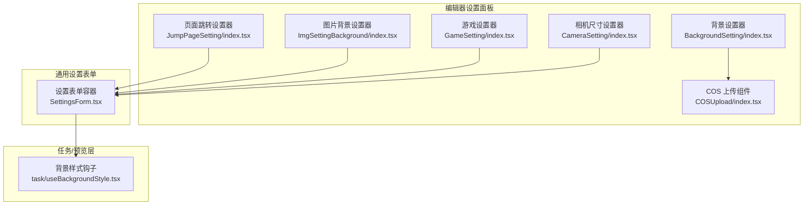
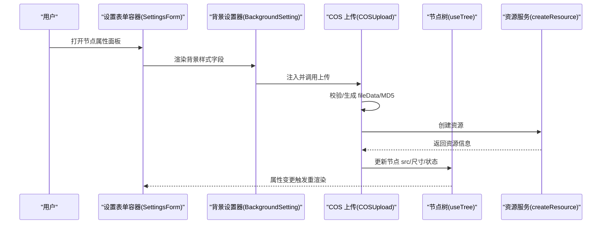
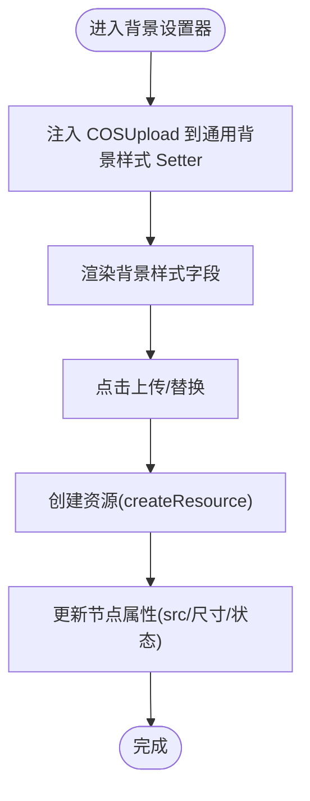
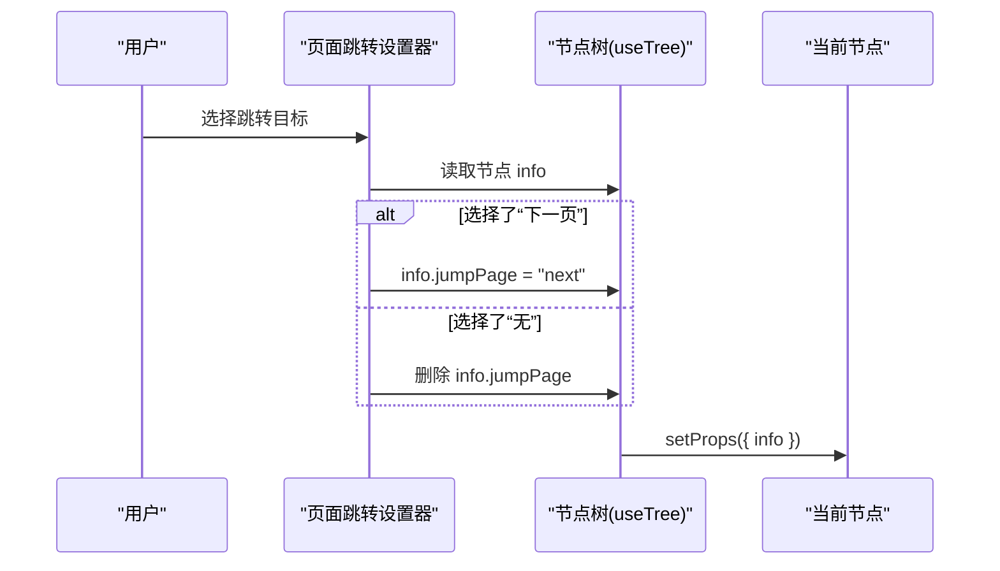
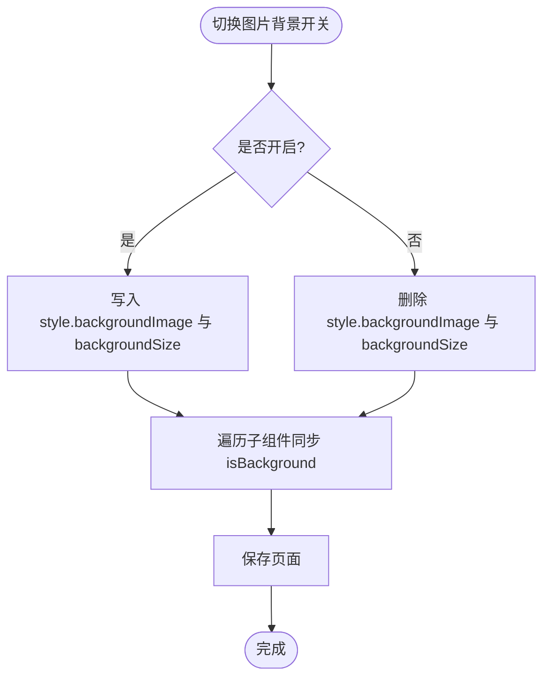
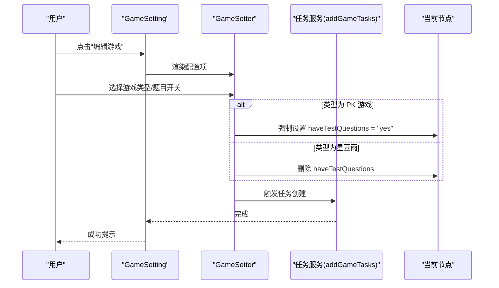
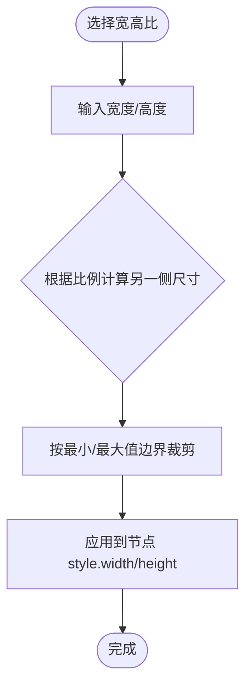
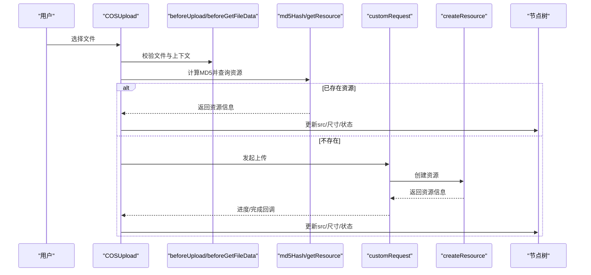
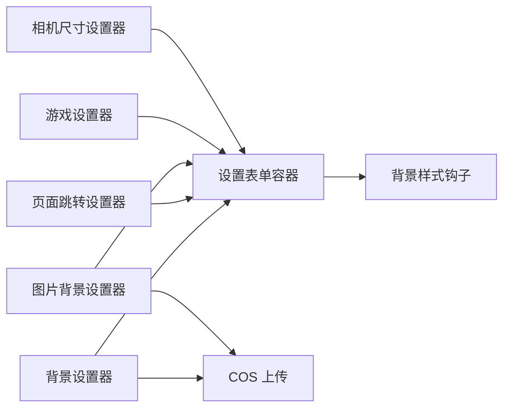

# 专用 Setter 组件

<cite>
**本文引用的文件**
- [BackgroundSetting/index.tsx](file://editor/src/settingComponents/BackgroundSetting/index.tsx)
- [JumpPageSetting/index.tsx](file://editor/src/settingComponents/JumpPageSetting/index.tsx)
- [ImgSettingBackground/index.tsx](file://editor/src/settingComponents/ImgSettingBackground/index.tsx)
- [GameSetting/index.tsx](file://editor/src/settingComponents/GameSetting/index.tsx)
- [GameSetting/GameSetter.tsx](file://editor/src/settingComponents/GameSetting/GameSetter.tsx)
- [CameraSetting/index.tsx](file://editor/src/settingComponents/CameraSetting/index.tsx)
- [COSUpload/index.tsx](file://editor/src/settingComponents/COSUpload/index.tsx)
- [SettingsForm.tsx](file://packages/react-settings-form/src/SettingsForm.tsx)
- [task/useBackgroundStyle.tsx](file://task/src/hooks/useBackgroundStyle.tsx)
</cite>

## 目录
1. [引言](#引言)
2. [项目结构](#项目结构)
3. [核心组件](#核心组件)
4. [架构总览](#架构总览)
5. [详细组件分析](#详细组件分析)
6. [依赖分析](#依赖分析)
7. [性能考量](#性能考量)
8. [故障排查指南](#故障排查指南)
9. [结论](#结论)
10. [附录](#附录)

## 引言
本文件聚焦 Slides Engine 编辑器中的“专用 Setter 组件”，围绕背景设置器、页面跳转设置器、图片背景设置器等进行系统化说明。内容涵盖业务逻辑与实现细节（如背景图片处理流程、页面跳转目标解析、图片背景适配算法）、与通用 Setter 的差异与优势、配置指南与使用示例、扩展与自定义开发流程。目标是帮助产品、前端与运营同学快速理解并正确使用这些 Setter。

## 项目结构
以下图示展示与专用 Setter 相关的模块在工程中的位置与职责分工：

图表来源
- [BackgroundSetting/index.tsx:1-16](file://editor/src/settingComponents/BackgroundSetting/index.tsx#L1-L16)
- [JumpPageSetting/index.tsx:1-47](file://editor/src/settingComponents/JumpPageSetting/index.tsx#L1-L47)
- [ImgSettingBackground/index.tsx:1-56](file://editor/src/settingComponents/ImgSettingBackground/index.tsx#L1-L56)
- [GameSetting/index.tsx:1-63](file://editor/src/settingComponents/GameSetting/index.tsx#L1-L63)
- [CameraSetting/index.tsx:1-122](file://editor/src/settingComponents/CameraSetting/index.tsx#L1-L122)
- [COSUpload/index.tsx:1-269](file://editor/src/settingComponents/COSUpload/index.tsx#L1-L269)
- [SettingsForm.tsx:1-147](file://packages/react-settings-form/src/SettingsForm.tsx#L1-L147)
- [task/useBackgroundStyle.tsx:30-43](file://task/src/hooks/useBackgroundStyle.tsx#L30-L43)

章节来源
- [BackgroundSetting/index.tsx:1-16](file://editor/src/settingComponents/BackgroundSetting/index.tsx#L1-L16)
- [JumpPageSetting/index.tsx:1-47](file://editor/src/settingComponents/JumpPageSetting/index.tsx#L1-L47)
- [ImgSettingBackground/index.tsx:1-56](file://editor/src/settingComponents/ImgSettingBackground/index.tsx#L1-L56)
- [GameSetting/index.tsx:1-63](file://editor/src/settingComponents/GameSetting/index.tsx#L1-L63)
- [CameraSetting/index.tsx:1-122](file://editor/src/settingComponents/CameraSetting/index.tsx#L1-L122)
- [COSUpload/index.tsx:1-269](file://editor/src/settingComponents/COSUpload/index.tsx#L1-L269)
- [SettingsForm.tsx:1-147](file://packages/react-settings-form/src/SettingsForm.tsx#L1-L147)
- [task/useBackgroundStyle.tsx:30-43](file://task/src/hooks/useBackgroundStyle.tsx#L30-L43)

## 核心组件
- 背景设置器：封装通用背景样式 Setter，并注入 COS 上传能力，用于统一管理背景色与背景图。
- 页面跳转设置器：基于树节点信息，提供“无/下一页”等跳转选项，写入节点 info.jumpPage 并同步到树。
- 图片背景设置器：将选中图片组件置为当前页背景，自动同步 style.backgroundImage/backgroundSize，并联动同页其他图片组件的 isBackground 状态。
- 游戏设置器：聚合游戏配置与任务创建流程，支持多类型游戏与题目开关联动。
- 相机尺寸设置器：基于宽高比联动计算，约束最小/最大宽高范围，保证视觉比例一致。
- COS 上传组件：统一的资源上传入口，负责校验、MD5 去重、进度上报、资源创建与节点属性更新。

章节来源
- [BackgroundSetting/index.tsx:1-16](file://editor/src/settingComponents/BackgroundSetting/index.tsx#L1-L16)
- [JumpPageSetting/index.tsx:1-47](file://editor/src/settingComponents/JumpPageSetting/index.tsx#L1-L47)
- [ImgSettingBackground/index.tsx:1-56](file://editor/src/settingComponents/ImgSettingBackground/index.tsx#L1-L56)
- [GameSetting/index.tsx:1-63](file://editor/src/settingComponents/GameSetting/index.tsx#L1-L63)
- [GameSetting/GameSetter.tsx:1-116](file://editor/src/settingComponents/GameSetting/GameSetter.tsx#L1-L116)
- [CameraSetting/index.tsx:1-122](file://editor/src/settingComponents/CameraSetting/index.tsx#L1-L122)
- [COSUpload/index.tsx:1-269](file://editor/src/settingComponents/COSUpload/index.tsx#L1-L269)

## 架构总览
专用 Setter 与通用设置表单协同工作：通用表单容器根据节点 schema 渲染字段；专用 Setter 在其内部组合通用字段组件或第三方 UI 组件，并通过树 API 更新节点属性。COS 上传作为可插拔能力注入到背景设置器中，贯穿上传、去重、资源创建与节点属性回填。

图表来源
- [SettingsForm.tsx:29-147](file://packages/react-settings-form/src/SettingsForm.tsx#L29-L147)
- [BackgroundSetting/index.tsx:11-15](file://editor/src/settingComponents/BackgroundSetting/index.tsx#L11-L15)
- [COSUpload/index.tsx:97-128](file://editor/src/settingComponents/COSUpload/index.tsx#L97-L128)
- [COSUpload/index.tsx:144-224](file://editor/src/settingComponents/COSUpload/index.tsx#L144-L224)

## 详细组件分析

### 背景设置器（BackgroundSetting）
- 作用：将通用背景样式 Setter 与 COS 上传结合，统一处理背景色与背景图。
- 关键行为：
  - 接收 COSUpload 作为参数，注入到通用背景样式 Setter 中。
  - 通过树 API 读取/写入节点属性，实现背景图与上传状态的联动。
- 与通用 Setter 的差异：
  - 提供“一键上传”能力，减少重复接入成本。
  - 封装上传状态、进度与资源创建流程，提升一致性与可用性。

图表来源
- [BackgroundSetting/index.tsx:11-15](file://editor/src/settingComponents/BackgroundSetting/index.tsx#L11-L15)
- [COSUpload/index.tsx:97-128](file://editor/src/settingComponents/COSUpload/index.tsx#L97-L128)
- [COSUpload/index.tsx:144-224](file://editor/src/settingComponents/COSUpload/index.tsx#L144-L224)

章节来源
- [BackgroundSetting/index.tsx:1-16](file://editor/src/settingComponents/BackgroundSetting/index.tsx#L1-L16)
- [COSUpload/index.tsx:1-269](file://editor/src/settingComponents/COSUpload/index.tsx#L1-L269)

### 页面跳转设置器（JumpPageSetting）
- 作用：为节点配置页面跳转目标，支持“无/下一页”等选项。
- 关键行为：
  - 使用树 API 读取节点信息，设置 info.jumpPage。
  - 通过树 API 写回节点属性，确保跳转目标持久化。
- 业务规则：
  - 空值表示不跳转；next 表示跳转至下一页。
- 与通用 Setter 的差异：
  - 领域特定的选项集合，直接映射到页面导航语义。

图表来源
- [JumpPageSetting/index.tsx:16-34](file://editor/src/settingComponents/JumpPageSetting/index.tsx#L16-L34)

章节来源
- [JumpPageSetting/index.tsx:1-47](file://editor/src/settingComponents/JumpPageSetting/index.tsx#L1-L47)

### 图片背景设置器（ImgSettingBackground）
- 作用：将选中图片组件设为当前页背景，并同步相关样式与同页其他图片组件的状态。
- 关键行为：
  - 开启时：将当前节点 src 写入 style.backgroundImage，并设置 backgroundSize（若已有背景图则保留原值）。
  - 关闭时：删除 style.backgroundImage 与 backgroundSize。
  - 联动：遍历同页子组件，将与当前图片 src 相同的图片组件的 info.isBackground 同步为 true/false。
  - 保存：调用保存接口，确保状态持久化。
- 业务规则：
  - 仅对当前选中图片生效；同页其他图片组件的 isBackground 由 src 是否与当前一致决定。
- 与通用 Setter 的差异：
  - 针对“图片转背景”的特定业务场景，提供一键式状态同步与保存。

图表来源
- [ImgSettingBackground/index.tsx:17-50](file://editor/src/settingComponents/ImgSettingBackground/index.tsx#L17-L50)

章节来源
- [ImgSettingBackground/index.tsx:1-56](file://editor/src/settingComponents/ImgSettingBackground/index.tsx#L1-L56)

### 游戏设置器（GameSetting + GameSetter）
- 作用：集中管理游戏类型的配置与任务创建流程，支持多种游戏类型与题目开关联动。
- 关键行为：
  - GameSetting：负责打开编辑弹窗、组织 Tab 结构、触发任务创建。
  - GameSetter：根据游戏类型动态显示/隐藏“是否为题目”选项，并在类型变化时自动保存任务。
- 业务规则：
  - 不同游戏类型对“是否为题目”有不同约束（例如 PK 游戏必须为题目）。
  - 星豆雨游戏无需题目选项，直接创建任务。
- 与通用 Setter 的差异：
  - 领域特定的复杂交互与状态机，封装了任务创建与 UI 切换逻辑。

图表来源
- [GameSetting/index.tsx:15-62](file://editor/src/settingComponents/GameSetting/index.tsx#L15-L62)
- [GameSetting/GameSetter.tsx:16-70](file://editor/src/settingComponents/GameSetting/GameSetter.tsx#L16-L70)

章节来源
- [GameSetting/index.tsx:1-63](file://editor/src/settingComponents/GameSetting/index.tsx#L1-L63)
- [GameSetting/GameSetter.tsx:1-116](file://editor/src/settingComponents/GameSetting/GameSetter.tsx#L1-L116)

### 相机尺寸设置器（CameraSetting）
- 作用：基于宽高比联动计算，约束最小/最大宽高范围，保证视觉比例一致。
- 关键行为：
  - 支持固定宽高比（如 4:3、1:1），根据输入宽度/高度自动计算另一侧尺寸。
  - 通过 clamp 限制在最小/最大范围内，避免超出约束。
- 与通用 Setter 的差异：
  - 针对“比例约束 + 边界保护”的典型业务需求，提供即插即用的比例联动能力。

图表来源
- [CameraSetting/index.tsx:59-85](file://editor/src/settingComponents/CameraSetting/index.tsx#L59-L85)

章节来源
- [CameraSetting/index.tsx:1-122](file://editor/src/settingComponents/CameraSetting/index.tsx#L1-L122)

### COS 上传组件（COSUpload）
- 作用：统一的资源上传入口，负责校验、MD5 去重、进度上报、资源创建与节点属性更新。
- 关键流程：
  - beforeUpload：前置校验（含后缀检查等）。
  - beforeGetFileData：生成 fileData，包含资源类型、尺寸等。
  - md5Hash：查询已存在资源，命中则直接复用。
  - createResource：创建新资源并回填到节点。
  - onProgress/onFinish/onError：上传过程状态管理与错误兜底。
- 与通用 Setter 的差异：
  - 将上传链路标准化，屏蔽 CDN、路径配置、进度与状态管理细节，降低上层接入成本。

图表来源
- [COSUpload/index.tsx:144-224](file://editor/src/settingComponents/COSUpload/index.tsx#L144-L224)
- [COSUpload/index.tsx:97-128](file://editor/src/settingComponents/COSUpload/index.tsx#L97-L128)
- [COSUpload/index.tsx:179-200](file://editor/src/settingComponents/COSUpload/index.tsx#L179-L200)

章节来源
- [COSUpload/index.tsx:1-269](file://editor/src/settingComponents/COSUpload/index.tsx#L1-L269)

## 依赖分析
- 背景设置器依赖通用背景样式 Setter 与 COSUpload，形成“样式 + 上传”的一体化能力。
- 页面跳转设置器依赖树 API 读写节点信息，耦合度低，便于扩展更多跳转目标。
- 图片背景设置器依赖树 API 与保存接口，同时维护跨组件状态一致性。
- 游戏设置器依赖任务服务与弹窗组件，GameSetter 负责 UI 与业务规则。
- 相机尺寸设置器依赖节点样式与尺寸约束工具函数，提供比例联动。
- COSUpload 作为独立上传模块，被多个 Setter 复用，降低重复实现。

图表来源
- [SettingsForm.tsx:29-147](file://packages/react-settings-form/src/SettingsForm.tsx#L29-L147)
- [BackgroundSetting/index.tsx:11-15](file://editor/src/settingComponents/BackgroundSetting/index.tsx#L11-L15)
- [ImgSettingBackground/index.tsx:17-50](file://editor/src/settingComponents/ImgSettingBackground/index.tsx#L17-L50)
- [task/useBackgroundStyle.tsx:30-43](file://task/src/hooks/useBackgroundStyle.tsx#L30-L43)

章节来源
- [SettingsForm.tsx:1-147](file://packages/react-settings-form/src/SettingsForm.tsx#L1-L147)
- [task/useBackgroundStyle.tsx:30-43](file://task/src/hooks/useBackgroundStyle.tsx#L30-L43)

## 性能考量
- 上传阶段：
  - 通过 MD5 去重避免重复上传，显著降低带宽与时间消耗。
  - 进度与状态异步更新，避免阻塞 UI。
- 表单渲染：
  - 设置表单容器采用空闲调度与快照机制，减少频繁重渲染。
- 联动计算：
  - 相机尺寸设置器使用 clamp 与比例计算，避免无效计算与异常尺寸。

[本节为通用建议，无需具体文件分析]

## 故障排查指南
- 上传失败
  - 现象：上传状态停留在“上传中”或报错。
  - 排查：检查 beforeUpload 校验、CDN 配置、createResource 接口返回。
  - 参考路径：[COSUpload/index.tsx:225-234](file://editor/src/settingComponents/COSUpload/index.tsx#L225-L234)，[COSUpload/index.tsx:129-136](file://editor/src/settingComponents/COSUpload/index.tsx#L129-L136)
- 背景未生效
  - 现象：设置背景后页面无变化。
  - 排查：确认节点 style.backgroundImage 是否更新；预览层是否读取到资源 URL。
  - 参考路径：[ImgSettingBackground/index.tsx:26-34](file://editor/src/settingComponents/ImgSettingBackground/index.tsx#L26-L34)，[task/useBackgroundStyle.tsx:30-43](file://task/src/hooks/useBackgroundStyle.tsx#L30-L43)
- 跳转目标不生效
  - 现象：选择“下一页”后无跳转。
  - 排查：确认节点 info.jumpPage 是否写入；播放端是否支持 next 跳转。
  - 参考路径：[JumpPageSetting/index.tsx:23-33](file://editor/src/settingComponents/JumpPageSetting/index.tsx#L23-L33)
- 游戏类型与题目联动异常
  - 现象：PK 游戏允许选择“否”或星豆雨出现题目选项。
  - 排查：核对 GameSetter 的类型分支与约束逻辑。
  - 参考路径：[GameSetting/GameSetter.tsx:42-70](file://editor/src/settingComponents/GameSetting/GameSetter.tsx#L42-L70)

章节来源
- [COSUpload/index.tsx:129-136](file://editor/src/settingComponents/COSUpload/index.tsx#L129-L136)
- [COSUpload/index.tsx:225-234](file://editor/src/settingComponents/COSUpload/index.tsx#L225-L234)
- [ImgSettingBackground/index.tsx:26-34](file://editor/src/settingComponents/ImgSettingBackground/index.tsx#L26-L34)
- [task/useBackgroundStyle.tsx:30-43](file://task/src/hooks/useBackgroundStyle.tsx#L30-L43)
- [JumpPageSetting/index.tsx:23-33](file://editor/src/settingComponents/JumpPageSetting/index.tsx#L23-L33)
- [GameSetting/GameSetter.tsx:42-70](file://editor/src/settingComponents/GameSetting/GameSetter.tsx#L42-L70)

## 结论
专用 Setter 组件以“领域特定 + 低耦合”为核心设计原则，通过与通用设置表单与上传模块的协作，实现了背景、跳转、图片背景、游戏与相机尺寸等场景的一致体验与高效落地。其优势在于：明确的业务语义、完善的错误与状态管理、可复用的上传链路以及对复杂交互的封装。建议在新业务场景中优先复用现有 Setter，并在必要时以扩展点（如注入新的上传策略或新增业务选项）的方式进行定制。

[本节为总结性内容，无需具体文件分析]

## 附录

### 配置指南与使用示例
- 背景设置器
  - 参数：无特殊参数，直接注入 COSUpload 即可。
  - 适用场景：任意需要设置背景色/背景图的节点。
  - 注意事项：上传完成后需保存页面，确保资源与节点属性持久化。
  - 参考路径：[BackgroundSetting/index.tsx:11-15](file://editor/src/settingComponents/BackgroundSetting/index.tsx#L11-L15)，[COSUpload/index.tsx:97-128](file://editor/src/settingComponents/COSUpload/index.tsx#L97-L128)
- 页面跳转设置器
  - 参数：value 为跳转目标字符串（''/next），onChange 回调接收新值。
  - 适用场景：需要为节点配置点击跳转的区域。
  - 注意事项：仅支持“无/下一页”，如需扩展请在 info 上追加字段并在播放端解析。
  - 参考路径：[JumpPageSetting/index.tsx:12-15](file://editor/src/settingComponents/JumpPageSetting/index.tsx#L12-L15)，[JumpPageSetting/index.tsx:20-34](file://editor/src/settingComponents/JumpPageSetting/index.tsx#L20-L34)
- 图片背景设置器
  - 参数：value 为布尔值，onChange 回调接收新状态。
  - 适用场景：将某张图片设为当前页背景。
  - 注意事项：开启时会覆盖同页其他图片的 isBackground；关闭时会清理背景样式。
  - 参考路径：[ImgSettingBackground/index.tsx:13-16](file://editor/src/settingComponents/ImgSettingBackground/index.tsx#L13-L16)，[ImgSettingBackground/index.tsx:23-50](file://editor/src/settingComponents/ImgSettingBackground/index.tsx#L23-L50)
- 游戏设置器
  - 参数：无特殊参数，通过节点 props 传入游戏信息。
  - 适用场景：为游戏组件配置类型与题目开关，并创建对应任务。
  - 注意事项：PK 游戏强制为题目；星豆雨游戏不显示题目选项。
  - 参考路径：[GameSetting/index.tsx:15-62](file://editor/src/settingComponents/GameSetting/index.tsx#L15-L62)，[GameSetting/GameSetter.tsx:16-70](file://editor/src/settingComponents/GameSetting/GameSetter.tsx#L16-L70)
- 相机尺寸设置器
  - 参数：COSUpload、节点树等（由容器注入）。
  - 适用场景：需要固定比例并限制尺寸范围的相机类组件。
  - 注意事项：最小/最大宽高需与业务约定一致，避免超出屏幕范围。
  - 参考路径：[CameraSetting/index.tsx:32-85](file://editor/src/settingComponents/CameraSetting/index.tsx#L32-L85)

### 扩展与自定义开发流程
- 新增专用 Setter 步骤
  - 明确业务场景与字段：确定需要哪些输入与输出。
  - 设计 UI 与交互：参考现有组件（如 JumpPageSetting、GameSetter）的模式。
  - 组合通用组件：优先使用通用字段组件与设置表单容器。
  - 注入上传/存储：如涉及资源上传，复用 COSUpload 并遵循其状态管理。
  - 写回树属性：通过树 API 更新节点 props，并触发保存。
  - 测试与回归：覆盖正常/异常路径与边界条件。
- 自定义上传策略
  - 在 COSUpload 基础上扩展 beforeUpload、beforeGetFileData 与 createResource 的实现。
  - 保持与现有状态机一致（UploadStatus、进度上报、错误处理）。
- 兼容性考虑
  - 与播放端协议保持一致（如 jumpPage 的 next 解析）。
  - 资源 URL 与 CDN 配置需与预览/任务层一致。

[本节为通用指导，无需具体文件分析]