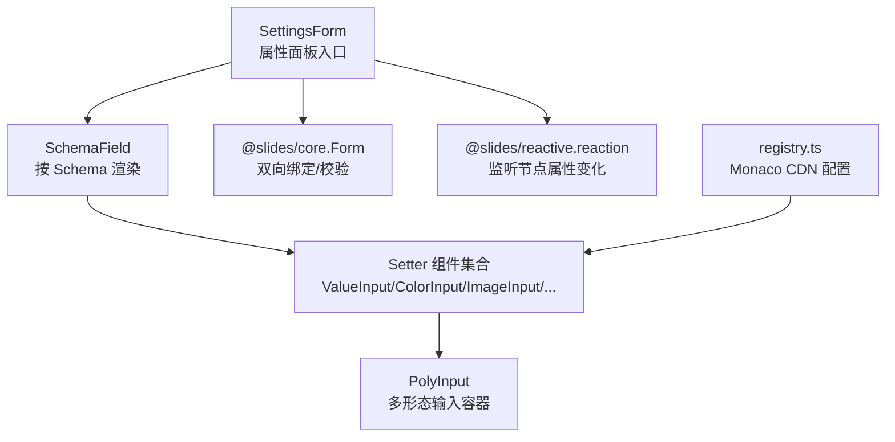
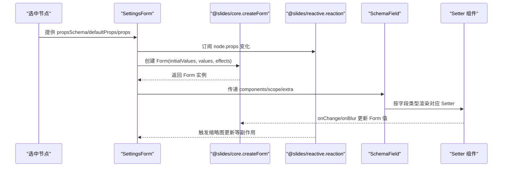
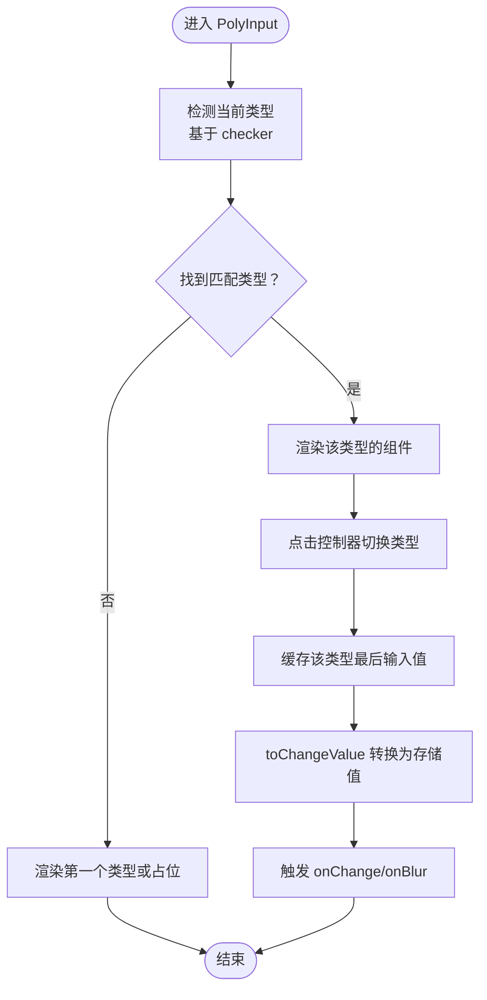
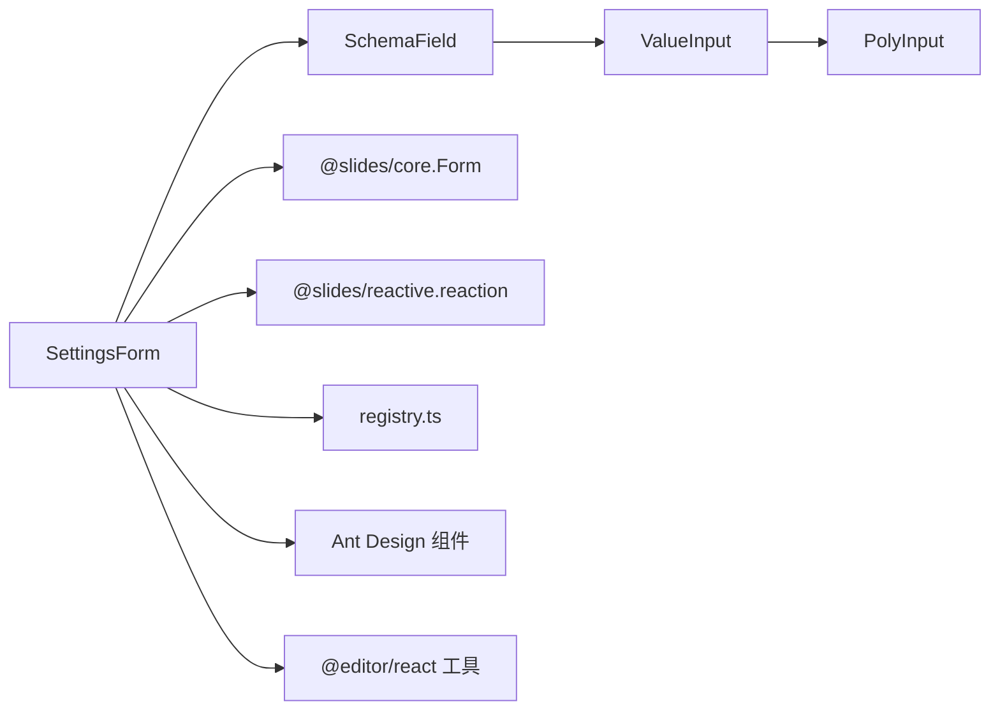

# 基础 Setter 组件

<cite>
**本文引用的文件**
- [SettingsForm.tsx](file://packages/react-settings-form/src/SettingsForm.tsx)
- [index.ts](file://packages/react-settings-form/src/index.ts)
- [registry.ts](file://packages/react-settings-form/src/registry.ts)
- [types.ts](file://packages/react-settings-form/src/types.ts)
- [SchemaField.tsx](file://packages/react-settings-form/src/SchemaField.tsx)
- [PolyInput/index.tsx](file://packages/react-settings-form/src/components/PolyInput/index.tsx)
- [ValueInput/index.tsx](file://packages/react-settings-form/src/components/ValueInput/index.tsx)
- [ColorInput/index.tsx](file://packages/react-settings-form/src/components/ColorInput/index.tsx)
- [ImageInput/index.tsx](file://packages/react-settings-form/src/components/ImageInput/index.tsx)
- [OpacitySlider/index.tsx](file://packages/react-settings-form/src/components/OpacitySlider/index.tsx)
- [RotateSlider/index.tsx](file://packages/react-settings-form/src/components/RotateSlider/index.tsx)
- [FlexStyleSetter/index.tsx](file://packages/react-settings-form/src/components/FlexStyleSetter/index.tsx)
- [InputItems/index.tsx](file://packages/react-settings-form/src/components/InputItems/index.tsx)
</cite>

## 目录
1. [简介](#简介)
2. [项目结构](#项目结构)
3. [核心组件](#核心组件)
4. [架构总览](#架构总览)
5. [详细组件分析](#详细组件分析)
6. [依赖关系分析](#依赖关系分析)
7. [性能考量](#性能考量)
8. [故障排查指南](#故障排查指南)
9. [结论](#结论)
10. [附录](#附录)

## 简介
本文件面向 Slides Engine 的“基础 Setter 组件”体系，围绕 SettingsForm 的核心架构与工作机制展开，重点覆盖以下主题：
- Setter 组件的注册与渲染机制（基于 SchemaField 与组件映射）
- 属性值的双向绑定与变更传播（基于 @slides/core 的 Form 与 @slides/reactive 的 reaction）
- 表单验证与错误提示（结合 Form 的校验与反馈布局）
- 常见基础 Setter 的功能与用法：文本输入、数字输入、下拉选择、开关、单选按钮组、颜色选择、图片上传、透明度滑块、旋转角度滑块、弹性布局 Setter
- 生命周期管理、数据类型转换、默认值处理
- 在属性面板中使用基础 Setter 的配置参数、事件处理与错误提示
- 扩展机制与自定义开发指南

## 项目结构
react-settings-form 包含 SettingsForm、SchemaField、各类 Setter 组件以及注册与类型定义。其关键职责划分如下：
- SettingsForm：属性面板入口，负责创建 Form 实例、注入上下文、渲染 SchemaField
- SchemaField：根据节点的 propsSchema 渲染对应 Setter 组件
- Setter 组件：如 ValueInput、ColorInput、ImageInput、OpacitySlider、RotateSlider、FlexStyleSetter 等
- PolyInput：多形态输入的基础容器，支持在不同数据类型之间切换
- registry：全局配置（如 Monaco 编辑器 CDN）

图表来源
- [SettingsForm.tsx:29-147](file://packages/react-settings-form/src/SettingsForm.tsx#L29-L147)
- [SchemaField.tsx](file://packages/react-settings-form/src/SchemaField.tsx)
- [PolyInput/index.tsx:57-148](file://packages/react-settings-form/src/components/PolyInput/index.tsx#L57-L148)
- [registry.ts:1-17](file://packages/react-settings-form/src/registry.ts#L1-L17)

章节来源
- [SettingsForm.tsx:1-147](file://packages/react-settings-form/src/SettingsForm.tsx#L1-L147)
- [index.ts:1-6](file://packages/react-settings-form/src/index.ts#L1-L6)
- [registry.ts:1-17](file://packages/react-settings-form/src/registry.ts#L1-L17)
- [types.ts:1-19](file://packages/react-settings-form/src/types.ts#L1-L19)

## 核心组件
- SettingsForm：创建并持有 @slides/core.Form 实例，注入上下文，渲染 SchemaField；通过 @slides/reactive.reaction 监听节点属性变化，触发缩略图更新等副作用
- SchemaField：根据节点的 propsSchema 动态渲染对应的 Setter 组件，支持传入自定义组件映射、作用域变量与额外参数
- Setter 组件：提供具体 UI 与行为，如 ValueInput（多形态）、ColorInput（颜色选择+取色器+历史）、ImageInput（带上传）、OpacitySlider/RotateSlider（数值范围+双控）、FlexStyleSetter（弹性布局单选按钮组）
- PolyInput：多形态输入容器，自动识别当前类型（文本/数字/布尔/表达式），并在类型间切换时进行值转换
- registry：统一管理 Monaco 编辑器 CDN 路径，便于扩展语言与主题

章节来源
- [SettingsForm.tsx:29-147](file://packages/react-settings-form/src/SettingsForm.tsx#L29-L147)
- [SchemaField.tsx](file://packages/react-settings-form/src/SchemaField.tsx)
- [PolyInput/index.tsx:57-148](file://packages/react-settings-form/src/components/PolyInput/index.tsx#L57-L148)
- [registry.ts:1-17](file://packages/react-settings-form/src/registry.ts#L1-L17)

## 架构总览
SettingsForm 的工作流包含：节点选择与 Schema 获取、Form 初始化（初始值与当前值）、Effects 注入（本地化与快照）、渲染 SchemaField、响应式更新与调度。

图表来源
- [SettingsForm.tsx:49-75](file://packages/react-settings-form/src/SettingsForm.tsx#L49-L75)
- [SchemaField.tsx](file://packages/react-settings-form/src/SchemaField.tsx)

章节来源
- [SettingsForm.tsx:29-147](file://packages/react-settings-form/src/SettingsForm.tsx#L29-L147)
- [types.ts:9-18](file://packages/react-settings-form/src/types.ts#L9-L18)

## 详细组件分析

### SettingsForm：属性面板入口与双向绑定
- 节点与工作空间：从工作台获取当前工作区，基于选中节点与 propsSchema 决定是否为空状态
- Form 创建：使用 @slides/core.createForm，传入 initialValues（默认值）与 values（当前值），并注入 effects（本地化、快照、外部 effects）
- 响应式更新：通过 @slides/reactive.reaction 监听 node.props 的字符串化变化，根节点变更时调用 updateThumbnail
- 渲染：在 SettingsFormContext 下渲染 Ant Design Form，并将 schema 交给 SchemaField 处理
- 调度：使用 requestIdle/cancelIdle 进行调度，避免频繁重渲染

章节来源
- [SettingsForm.tsx:29-147](file://packages/react-settings-form/src/SettingsForm.tsx#L29-L147)
- [types.ts:9-18](file://packages/react-settings-form/src/types.ts#L9-L18)

### SchemaField：Setter 渲染与组件映射
- 接收 schema、components 映射、scope 作用域、extra 额外参数
- 根据 schema 中的字段类型与配置，动态渲染对应 Setter 组件
- 支持自定义组件替换默认 Setter，便于扩展复杂业务场景

章节来源
- [SchemaField.tsx](file://packages/react-settings-form/src/SchemaField.tsx)

### PolyInput：多形态输入容器
- 类型识别：根据 checker 判断当前值属于哪种类型（文本/数字/布尔/表达式）
- 类型切换：点击控制器在类型间循环切换，并缓存各类型最后一次输入值
- 值转换：toInputValue 将存储值转换为 UI 输入值；toChangeValue 将 UI 变更值转换为存储值
- 事件桥接：统一处理 onChange/onBlur/step 等事件，确保类型转换后回调给上层

图表来源
- [PolyInput/index.tsx:57-148](file://packages/react-settings-form/src/components/PolyInput/index.tsx#L57-L148)

章节来源
- [PolyInput/index.tsx:57-148](file://packages/react-settings-form/src/components/PolyInput/index.tsx#L57-L148)

### ValueInput：多形态值输入（文本/数字/布尔/表达式）
- 类型定义：TEXT（普通文本）、EXPRESSION（表达式，弹出 Monaco 编辑器）、BOOLEAN（布尔下拉）、NUMBER（数字）
- 表达式模式：弹出浮层编辑器，内容被包裹为 {{...}}
- 布尔模式：使用 Select 下拉选项
- 数字模式：使用 InputNumber，内置数字提取与转换
- 文本模式：普通 Input

章节来源
- [ValueInput/index.tsx:38-113](file://packages/react-settings-form/src/components/ValueInput/index.tsx#L38-L113)

### ColorInput：颜色选择器（含取色器与历史）
- 颜色格式：支持 RGBA 字符串生成与十六进制扩展写法解析
- 预设与主题：基于 Ant Design 主题 token 生成预设色板
- 历史记录：localStorage 存储最近使用颜色，上限控制
- 取色器：浏览器原生 EyeDropper API 获取屏幕取色
- 交互：右侧弹出面板，左侧预设+历史，右侧主色盘

章节来源
- [ColorInput/index.tsx:138-240](file://packages/react-settings-form/src/components/ColorInput/index.tsx#L138-L240)

### ImageInput：图片地址输入与上传
- 输入框前缀：集成 Ant Design Upload，支持自定义 uploadAction
- 回调处理：从响应中提取 url/downloadURL/imageURL/thumbUrl 等字段
- 背景图包装：BackgroundImageInput 自动为值添加/移除 url(...) 包裹

章节来源
- [ImageInput/index.tsx:13-74](file://packages/react-settings-form/src/components/ImageInput/index.tsx#L13-L74)

### OpacitySlider：透明度滑块（0%-100%）
- 双控件：左侧 Slider，右侧 InputNumber
- 值转换：内部以百分比显示与交互，回调转换为小数字符串（例如 "0.8"）

章节来源
- [OpacitySlider/index.tsx:10-44](file://packages/react-settings-form/src/components/OpacitySlider/index.tsx#L10-L44)

### RotateSlider：旋转角度滑块（0-360 度）
- 双控件：左侧 Slider，右侧 InputNumber
- 值转换：内部以数值显示与交互，回调附加 "deg" 单位（例如 "90deg"）

章节来源
- [RotateSlider/index.tsx:10-47](file://packages/react-settings-form/src/components/RotateSlider/index.tsx#L10-L47)

### FlexStyleSetter：弹性布局 Setter（单选按钮组）
- 字段：flexDirection/flexWrap/alignContent/justifyContent/alignItems
- 渲染：每个字段使用 Radio.Group 按钮样式，配合 InputItems.Item 布局
- 标题联动：reactions 动态更新装饰器标题，显示当前值

章节来源
- [FlexStyleSetter/index.tsx:13-166](file://packages/react-settings-form/src/components/FlexStyleSetter/index.tsx#L13-L166)

### InputItems：输入项容器与子项
- 容器：提供 width/vertical 等上下文，子项继承宽度与垂直布局
- 子项：可选 icon/title，中间为控制器区域，支持图标与标题渲染

章节来源
- [InputItems/index.tsx:31-72](file://packages/react-settings-form/src/components/InputItems/index.tsx#L31-L72)

## 依赖关系分析
- SettingsForm 依赖 @slides/core/Form、@slides/reactive.reaction、Ant Design 组件与 @editor/react 工具
- SchemaField 依赖 propsSchema 与组件映射，将字段渲染为具体 Setter
- PolyInput 作为通用容器被 ValueInput 等复用
- registry 提供 Monaco CDN 配置，影响 MonacoInput 的加载路径

图表来源
- [SettingsForm.tsx:1-23](file://packages/react-settings-form/src/SettingsForm.tsx#L1-L23)
- [SchemaField.tsx](file://packages/react-settings-form/src/SchemaField.tsx)
- [PolyInput/index.tsx:57-148](file://packages/react-settings-form/src/components/PolyInput/index.tsx#L57-L148)
- [registry.ts:1-17](file://packages/react-settings-form/src/registry.ts#L1-L17)

章节来源
- [SettingsForm.tsx:1-23](file://packages/react-settings-form/src/SettingsForm.tsx#L1-L23)
- [index.ts:1-6](file://packages/react-settings-form/src/index.ts#L1-L6)
- [registry.ts:1-17](file://packages/react-settings-form/src/registry.ts#L1-L17)

## 性能考量
- 调度策略：使用 requestIdle 对 SettingsForm 的更新进行节流，减少频繁重渲染
- 响应式监听：reaction 仅在 node.props 字符串化变化时触发，避免深层对象变更导致的不必要更新
- 组件懒加载：Monaco 编辑器通过 CDN 按需加载，registry 提供统一配置入口
- 表单渲染：Form 仅在节点与 schema 变化时重建，降低开销

章节来源
- [SettingsForm.tsx:139-146](file://packages/react-settings-form/src/SettingsForm.tsx#L139-L146)
- [registry.ts:7-16](file://packages/react-settings-form/src/registry.ts#L7-L16)

## 故障排查指南
- 无节点或非单一选中：SettingsForm 会显示空状态，检查选中逻辑与工作区
- 表单不更新：确认 node.props 是否变化，reaction 依赖 JSON.stringify(node.props) 判等
- Setter 不生效：检查 propsSchema 中字段名与 basePath 是否正确，以及 components 映射是否覆盖
- 表达式编辑器未加载：检查 registry 中 CDN 路径是否可用，Monaco 编辑器是否成功加载
- 颜色历史异常：检查 localStorage 权限与键值格式，确保 get/setHistory 正常
- 图片上传失败：核对 uploadAction 与响应字段（url/downloadURL/imageURL/thumbUrl）是否一致

章节来源
- [SettingsForm.tsx:42-46](file://packages/react-settings-form/src/SettingsForm.tsx#L42-L46)
- [SettingsForm.tsx:54-62](file://packages/react-settings-form/src/SettingsForm.tsx#L54-L62)
- [ImageInput/index.tsx:28-47](file://packages/react-settings-form/src/components/ImageInput/index.tsx#L28-L47)
- [registry.ts:9-14](file://packages/react-settings-form/src/registry.ts#L9-L14)

## 结论
Slides Engine 的基础 Setter 组件通过 SettingsForm 与 SchemaField 实现了“声明式 Schema + 可插拔 Setter”的组合模式。借助 @slides/core 的 Form 与 @slides/reactive 的响应式能力，实现了属性值的双向绑定与高效更新；通过 PolyInput 的多形态输入与丰富的内置 Setter（颜色、图片、滑块、弹性布局等），满足了编辑器属性面板的多样化需求。同时，registry 与 CDN 配置为扩展语言与主题提供了便利。

## 附录

### Setter 使用范式与最佳实践
- 在节点的 propsSchema 中定义字段，指定 basePath 与 dataSource（如 Radio 组）
- 在 SettingsForm 的 components 中提供自定义 Setter，或直接使用内置 Setter
- 使用 effects 注入本地化与快照逻辑，确保国际化与撤销/重做
- 对于复杂输入（表达式、富文本），优先使用 ValueInput 或自定义 PolyInput 包装
- 对于数值类输入，结合 OpacitySlider/RotateSlider 提供直观的双控体验
- 对于颜色与图片，使用 ColorInput 与 ImageInput，充分利用预设、历史与上传能力

### 扩展机制与自定义开发指南
- 新增 Setter：在 components 目录下新增组件，遵循受控组件规范（value + onChange）
- 注册到 SchemaField：在 SettingsForm 的 components 中映射字段类型到新 Setter
- 多形态输入：参考 PolyInput 的 checker/toInputValue/toChangeValue 模式，实现类型识别与转换
- CDN 与 Monaco：通过 registry 设置 CDN 路径，确保编辑器资源可访问
- 上下文与作用域：利用 SettingsFormContext 与 scope 传递全局配置与工具函数

章节来源
- [index.ts:1-6](file://packages/react-settings-form/src/index.ts#L1-L6)
- [registry.ts:7-16](file://packages/react-settings-form/src/registry.ts#L7-L16)
- [PolyInput/index.tsx:57-148](file://packages/react-settings-form/src/components/PolyInput/index.tsx#L57-L148)