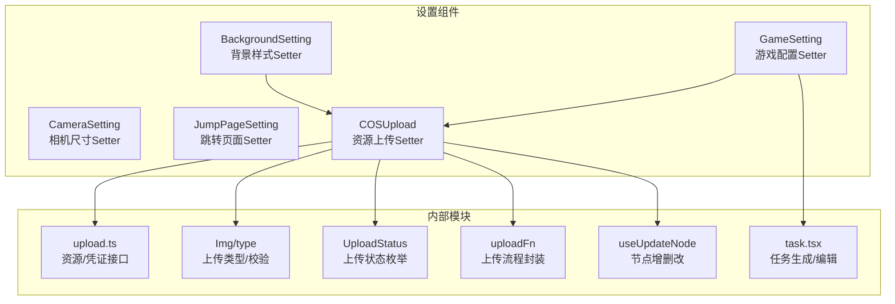
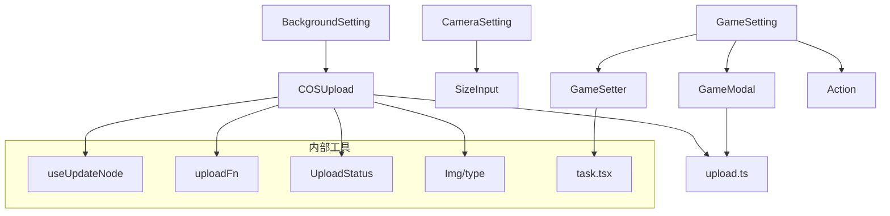
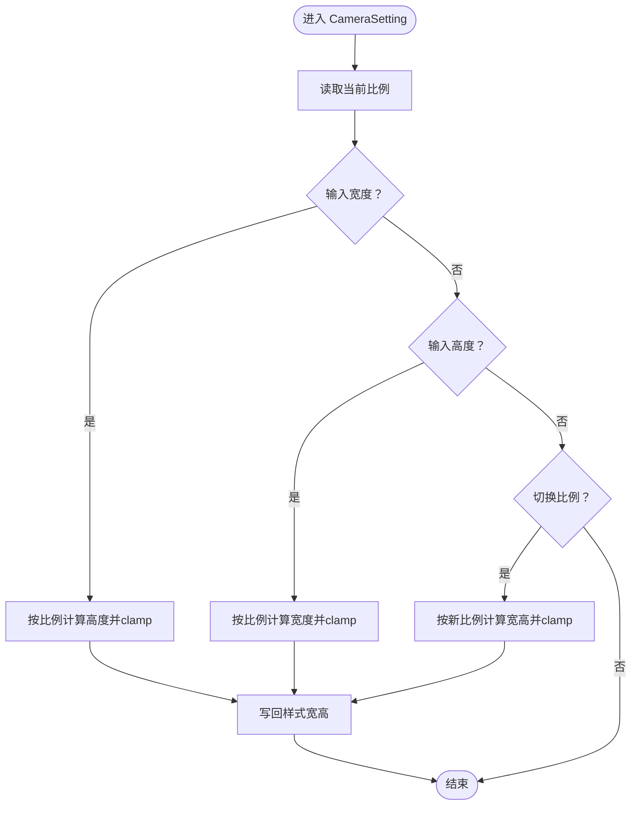
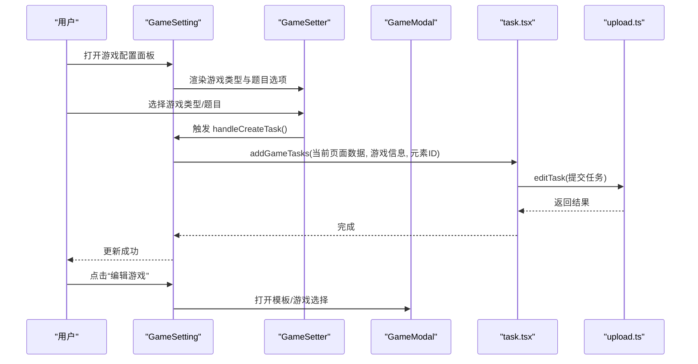
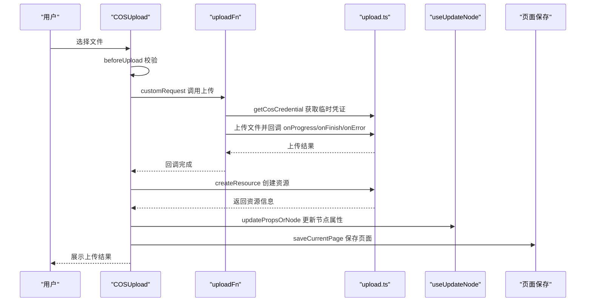
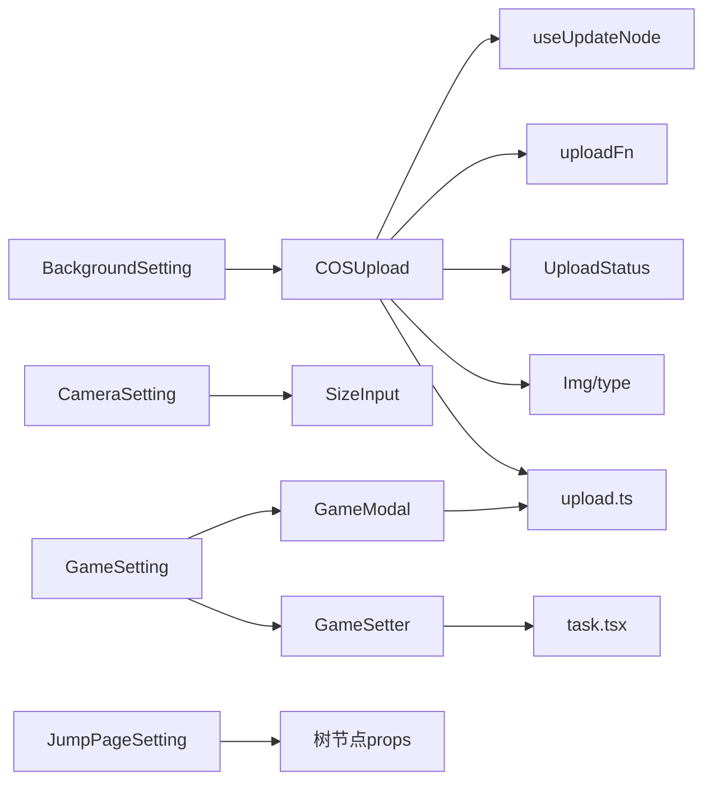

# 复合 Setter 组件

<cite>
**本文引用的文件**
- [COSUpload/index.tsx](file://editor/src/settingComponents/COSUpload/index.tsx)
- [COSUpload/useUpdateNode.tsx](file://editor/src/settingComponents/COSUpload/useUpdateNode.tsx)
- [COSUpload/uploadFn.ts](file://editor/src/settingComponents/COSUpload/uploadFn.ts)
- [COSUpload/type.ts](file://editor/src/settingComponents/COSUpload/type.ts)
- [Img/type.ts](file://editor/src/components/Img/type.ts)
- [BackgroundSetting/index.tsx](file://editor/src/settingComponents/BackgroundSetting/index.tsx)
- [CameraSetting/index.tsx](file://editor/src/settingComponents/CameraSetting/index.tsx)
- [GameSetting/index.tsx](file://editor/src/settingComponents/GameSetting/index.tsx)
- [GameSetting/GameSetter.tsx](file://editor/src/settingComponents/GameSetting/GameSetter.tsx)
- [GameSetting/Action.tsx](file://editor/src/settingComponents/GameSetting/Action.tsx)
- [JumpPageSetting/index.tsx](file://editor/src/settingComponents/JumpPageSetting/index.tsx)
- [task.tsx](file://editor/src/utils/task.tsx)
- [upload.ts](file://editor/src/api/upload.ts)
</cite>

## 目录
1. [简介](#简介)
2. [项目结构](#项目结构)
3. [核心组件](#核心组件)
4. [架构总览](#架构总览)
5. [组件详解](#组件详解)
6. [依赖关系分析](#依赖关系分析)
7. [性能考量](#性能考量)
8. [故障排查指南](#故障排查指南)
9. [结论](#结论)
10. [附录](#附录)

## 简介
本文件系统性梳理 Slides Engine 编辑器中的“复合 Setter 组件”，重点覆盖以下高级 Setter：
- 复杂属性编辑器：颜色选择器、尺寸调整器、动画设置器、资源上传器等
- 复合 Setter 架构：子组件组合、状态管理、数据流转
- 典型复合 Setter：COSUpload 文件上传、GameSetting 游戏配置、CameraSetting 相机参数设置
- 交互逻辑：多步骤配置、条件显示、动态验证
- 使用案例与最佳实践：错误处理、用户体验优化、性能考虑

## 项目结构
复合 Setter 组件主要位于编辑器前端工程的设置面板目录中，围绕“节点属性编辑”与“资源上传/任务生成”两条主线展开。

图表来源
- [BackgroundSetting/index.tsx:11-15](file://editor/src/settingComponents/BackgroundSetting/index.tsx#L11-L15)
- [CameraSetting/index.tsx:39-121](file://editor/src/settingComponents/CameraSetting/index.tsx#L39-L121)
- [GameSetting/index.tsx:15-62](file://editor/src/settingComponents/GameSetting/index.tsx#L15-L62)
- [JumpPageSetting/index.tsx:16-46](file://editor/src/settingComponents/JumpPageSetting/index.tsx#L16-L46)
- [COSUpload/index.tsx:39-268](file://editor/src/settingComponents/COSUpload/index.tsx#L39-L268)
- [COSUpload/useUpdateNode.tsx:10-130](file://editor/src/settingComponents/COSUpload/useUpdateNode.tsx#L10-L130)
- [COSUpload/uploadFn.ts:32-87](file://editor/src/settingComponents/COSUpload/uploadFn.ts#L32-L87)
- [COSUpload/type.ts:1-8](file://editor/src/settingComponents/COSUpload/type.ts#L1-L8)
- [Img/type.ts:41-66](file://editor/src/components/Img/type.ts#L41-L66)
- [task.tsx:106-165](file://editor/src/utils/task.tsx#L106-L165)
- [upload.ts:37-91](file://editor/src/api/upload.ts#L37-L91)

章节来源
- [BackgroundSetting/index.tsx:11-15](file://editor/src/settingComponents/BackgroundSetting/index.tsx#L11-L15)
- [CameraSetting/index.tsx:39-121](file://editor/src/settingComponents/CameraSetting/index.tsx#L39-L121)
- [GameSetting/index.tsx:15-62](file://editor/src/settingComponents/GameSetting/index.tsx#L15-L62)
- [JumpPageSetting/index.tsx:16-46](file://editor/src/settingComponents/JumpPageSetting/index.tsx#L16-L46)
- [COSUpload/index.tsx:39-268](file://editor/src/settingComponents/COSUpload/index.tsx#L39-L268)

## 核心组件
- 背景样式 Setter：基于通用背景样式组件，注入自定义 COSUpload，支持图片/视频/音频资源上传与背景切换。
- 相机尺寸 Setter：提供比例/宽高联动输入，结合最小最大约束，实现尺寸约束与比例锁定。
- 游戏配置 Setter：通过标签页组织“游戏配置”与“编辑游戏”，动态生成并提交课程任务。
- 跳转页面 Setter：在树节点 info 中写入跳转目标，支持“无/下一页”两种选项。
- 资源上传 Setter（COSUpload）：统一处理图片/视频/音频上传、预览、进度、状态、节点更新与资源入库。

章节来源
- [BackgroundSetting/index.tsx:11-15](file://editor/src/settingComponents/BackgroundSetting/index.tsx#L11-L15)
- [CameraSetting/index.tsx:39-121](file://editor/src/settingComponents/CameraSetting/index.tsx#L39-L121)
- [GameSetting/index.tsx:15-62](file://editor/src/settingComponents/GameSetting/index.tsx#L15-L62)
- [JumpPageSetting/index.tsx:16-46](file://editor/src/settingComponents/JumpPageSetting/index.tsx#L16-L46)
- [COSUpload/index.tsx:39-268](file://editor/src/settingComponents/COSUpload/index.tsx#L39-L268)

## 架构总览
复合 Setter 的整体架构由“视图层 Setter + 内部工具模块 + 外部服务接口”三层构成：
- 视图层 Setter：负责表单渲染、事件绑定、条件显示、联动计算
- 内部工具模块：封装节点更新、上传流程、状态枚举、类型与校验
- 外部服务接口：资源创建、Cos 凭证获取、任务编辑等

图表来源
- [BackgroundSetting/index.tsx:11-15](file://editor/src/settingComponents/BackgroundSetting/index.tsx#L11-L15)
- [CameraSetting/index.tsx:39-121](file://editor/src/settingComponents/CameraSetting/index.tsx#L39-L121)
- [GameSetting/index.tsx:15-62](file://editor/src/settingComponents/GameSetting/index.tsx#L15-L62)
- [GameSetting/GameSetter.tsx:16-115](file://editor/src/settingComponents/GameSetting/GameSetter.tsx#L16-L115)
- [GameSetting/Action.tsx:8-21](file://editor/src/settingComponents/GameSetting/Action.tsx#L8-L21)
- [COSUpload/index.tsx:39-268](file://editor/src/settingComponents/COSUpload/index.tsx#L39-L268)
- [COSUpload/useUpdateNode.tsx:10-130](file://editor/src/settingComponents/COSUpload/useUpdateNode.tsx#L10-L130)
- [COSUpload/uploadFn.ts:32-87](file://editor/src/settingComponents/COSUpload/uploadFn.ts#L32-L87)
- [COSUpload/type.ts:1-8](file://editor/src/settingComponents/COSUpload/type.ts#L1-L8)
- [Img/type.ts:41-66](file://editor/src/components/Img/type.ts#L41-L66)
- [task.tsx:106-165](file://editor/src/utils/task.tsx#L106-L165)
- [upload.ts:37-91](file://editor/src/api/upload.ts#L37-L91)

## 组件详解

### 背景样式 Setter（BackgroundSetting）
- 功能概述
  - 封装通用背景样式组件，注入自定义 COSUpload，支持从资源库选择或直接上传图片作为背景。
  - 自动同步节点样式属性，保持与渲染层一致。
- 关键点
  - 通过 props 注入 COSUpload，实现“上传即应用”的体验。
  - 在根节点场景下，自动将图片组件标记为“背景图”，并联动更新其他组件的 isBackground 标记。
- 适用场景
  - 快速设置页面背景、批量切换背景图。

章节来源
- [BackgroundSetting/index.tsx:11-15](file://editor/src/settingComponents/BackgroundSetting/index.tsx#L11-L15)
- [COSUpload/useUpdateNode.tsx:84-124](file://editor/src/settingComponents/COSUpload/useUpdateNode.tsx#L84-L124)

### 相机尺寸 Setter（CameraSetting）
- 功能概述
  - 提供比例选择与宽高输入，三者联动：改变比例自动调整宽高；输入宽高按比例约束；输入高宽按比例约束。
  - 支持最小/最大宽高限制，避免超出范围。
- 关键点
  - 比例解析与数值提取：从字符串样式中解析比例与数值。
  - clamp 限制：确保宽高在最小/最大范围内。
  - 失焦触发：通过 SizeInput 的 onBlur 控制联动时机，避免频繁重算。
- 适用场景
  - 精准控制相机/画布尺寸，保证内容适配。

图表来源
- [CameraSetting/index.tsx:59-85](file://editor/src/settingComponents/CameraSetting/index.tsx#L59-L85)

章节来源
- [CameraSetting/index.tsx:39-121](file://editor/src/settingComponents/CameraSetting/index.tsx#L39-L121)

### 游戏配置 Setter（GameSetting）
- 功能概述
  - 以标签页形式组织“游戏配置”和“编辑游戏”两个区域。
  - “游戏配置”使用 GameSetter 提供的单选与条件显示，动态生成并提交课程任务。
  - “编辑游戏”打开 GameModal 进行模板/游戏选择。
- 关键点
  - 条件显示：星豆雨隐藏“是否为题目”选项；其他类型显示。
  - 动态验证：PK 游戏强制为题目，若用户选择“否”则提示并回滚。
  - 任务生成：根据游戏类型生成不同任务集合，调用 editTask 接口持久化。
- 适用场景
  - 快速配置课堂互动游戏，一键生成配套任务流。

图表来源
- [GameSetting/index.tsx:15-62](file://editor/src/settingComponents/GameSetting/index.tsx#L15-L62)
- [GameSetting/GameSetter.tsx:16-115](file://editor/src/settingComponents/GameSetting/GameSetter.tsx#L16-L115)
- [task.tsx:106-165](file://editor/src/utils/task.tsx#L106-L165)
- [upload.ts:107-122](file://editor/src/api/upload.ts#L107-L122)

章节来源
- [GameSetting/index.tsx:15-62](file://editor/src/settingComponents/GameSetting/index.tsx#L15-L62)
- [GameSetting/GameSetter.tsx:16-115](file://editor/src/settingComponents/GameSetting/GameSetter.tsx#L16-L115)
- [task.tsx:106-165](file://editor/src/utils/task.tsx#L106-L165)

### 跳转页面 Setter（JumpPageSetting）
- 功能概述
  - 在当前节点的 info 中写入 jumpPage 字段，支持“无/下一页”两种选项。
  - 选择“无”时删除该字段，避免误传。
- 关键点
  - 直接操作树节点 props，即时生效。
  - 适合用于页面导航/流程控制。

章节来源
- [JumpPageSetting/index.tsx:16-46](file://editor/src/settingComponents/JumpPageSetting/index.tsx#L16-L46)

### 资源上传 Setter（COSUpload）
- 功能概述
  - 统一处理图片/视频/音频上传，支持预览、进度、状态、节点更新与资源入库。
  - 支持“替换现有节点”和“新增节点”两种模式，自动维护全局上传列表与资源列表。
- 关键点
  - 上传前校验：后缀检查、类型匹配、大小与分辨率限制。
  - 重复检测：通过 MD5 查询已有资源，命中则直接复用。
  - 节点更新：useUpdateNode 负责新增/更新节点属性，自动选择新节点并联动背景图。
  - 状态管理：UploadStatus 枚举统一管理上传状态，支持 loading/loaded。
  - 任务联动：视频上传完成后可触发任务生成（注释中保留相关逻辑）。
- 适用场景
  - 快速替换/新增图片/视频/音频资源，自动写回节点属性并保存页面。

图表来源
- [COSUpload/index.tsx:144-234](file://editor/src/settingComponents/COSUpload/index.tsx#L144-L234)
- [COSUpload/uploadFn.ts:32-87](file://editor/src/settingComponents/COSUpload/uploadFn.ts#L32-L87)
- [upload.ts:37-91](file://editor/src/api/upload.ts#L37-L91)
- [COSUpload/useUpdateNode.tsx:84-124](file://editor/src/settingComponents/COSUpload/useUpdateNode.tsx#L84-L124)

章节来源
- [COSUpload/index.tsx:39-268](file://editor/src/settingComponents/COSUpload/index.tsx#L39-L268)
- [COSUpload/uploadFn.ts:32-87](file://editor/src/settingComponents/COSUpload/uploadFn.ts#L32-L87)
- [COSUpload/type.ts:1-8](file://editor/src/settingComponents/COSUpload/type.ts#L1-L8)
- [Img/type.ts:41-66](file://editor/src/components/Img/type.ts#L41-L66)
- [COSUpload/useUpdateNode.tsx:10-130](file://editor/src/settingComponents/COSUpload/useUpdateNode.tsx#L10-L130)
- [upload.ts:37-91](file://editor/src/api/upload.ts#L37-L91)

## 依赖关系分析
- 组件耦合
  - BackgroundSetting 强依赖 COSUpload；CameraSetting 依赖 SizeInput；GameSetting 依赖 GameSetter 与 GameModal；JumpPageSetting 依赖树节点 props。
- 数据流
  - COSUpload 通过 useUpdateNode 写回节点属性；GameSetting 通过 task.tsx 生成并提交任务；JumpPageSetting 直接写入 info。
- 外部依赖
  - 上传流程依赖 upload.ts 的资源/凭证接口；任务编辑依赖 editTask；尺寸计算依赖 Img/type 的上传类型与校验。

图表来源
- [BackgroundSetting/index.tsx:11-15](file://editor/src/settingComponents/BackgroundSetting/index.tsx#L11-L15)
- [CameraSetting/index.tsx:39-121](file://editor/src/settingComponents/CameraSetting/index.tsx#L39-L121)
- [GameSetting/index.tsx:15-62](file://editor/src/settingComponents/GameSetting/index.tsx#L15-L62)
- [JumpPageSetting/index.tsx:16-46](file://editor/src/settingComponents/JumpPageSetting/index.tsx#L16-L46)
- [COSUpload/index.tsx:39-268](file://editor/src/settingComponents/COSUpload/index.tsx#L39-L268)
- [COSUpload/useUpdateNode.tsx:10-130](file://editor/src/settingComponents/COSUpload/useUpdateNode.tsx#L10-L130)
- [COSUpload/uploadFn.ts:32-87](file://editor/src/settingComponents/COSUpload/uploadFn.ts#L32-L87)
- [COSUpload/type.ts:1-8](file://editor/src/settingComponents/COSUpload/type.ts#L1-L8)
- [Img/type.ts:41-66](file://editor/src/components/Img/type.ts#L41-L66)
- [task.tsx:106-165](file://editor/src/utils/task.tsx#L106-L165)
- [upload.ts:37-91](file://editor/src/api/upload.ts#L37-L91)

章节来源
- [COSUpload/index.tsx:39-268](file://editor/src/settingComponents/COSUpload/index.tsx#L39-L268)
- [task.tsx:106-165](file://editor/src/utils/task.tsx#L106-L165)

## 性能考量
- 上传性能
  - 使用 MD5 去重与资源复用，减少重复上传与网络开销。
  - 视频上传采用进度回调与分段上传策略，避免阻塞 UI。
- 计算性能
  - 尺寸联动采用失焦触发，降低频繁重算带来的抖动。
  - 仅在必要时更新节点属性，避免不必要的渲染。
- 网络稳定性
  - 任务编辑接口使用重试机制，提升失败恢复概率。
- 资源管理
  - 本地预览 URL 在使用后及时释放，防止内存泄漏。

## 故障排查指南
- 上传失败
  - 症状：上传报错、状态停留在 uploading。
  - 排查：检查文件后缀与类型是否符合要求；确认 Cos 凭证是否有效；查看网络请求与返回码。
  - 处理：根据错误消息提示修正文件类型或大小；重试上传。
- 重复上传
  - 症状：相同文件多次上传。
  - 排查：确认 MD5 去重逻辑是否命中；检查资源查询接口返回。
  - 处理：确保 MD5 计算与资源查询流程正确执行。
- 节点未更新
  - 症状：上传完成但节点属性未变化。
  - 排查：确认 useUpdateNode 的 updatePropsOrNode 是否被调用；检查工作空间与节点 ID 是否匹配。
  - 处理：核对 isReplace 分支与节点选择逻辑。
- 任务未生成
  - 症状：游戏配置变更后任务未更新。
  - 排查：确认 addGameTasks 是否被调用；检查 editTask 请求是否成功。
  - 处理：查看接口返回与错误提示，必要时手动触发保存页面。

章节来源
- [COSUpload/index.tsx:129-136](file://editor/src/settingComponents/COSUpload/index.tsx#L129-L136)
- [COSUpload/uploadFn.ts:42-87](file://editor/src/settingComponents/COSUpload/uploadFn.ts#L42-L87)
- [COSUpload/useUpdateNode.tsx:14-19](file://editor/src/settingComponents/COSUpload/useUpdateNode.tsx#L14-L19)
- [task.tsx:106-165](file://editor/src/utils/task.tsx#L106-L165)

## 结论
复合 Setter 组件通过“视图层 + 工具模块 + 外部接口”的分层设计，实现了复杂属性编辑的高内聚与低耦合。COSUpload、GameSetting、CameraSetting、BackgroundSetting、JumpPageSetting 各司其职，配合统一的状态与数据流，显著提升了编辑效率与一致性。建议在后续迭代中进一步完善错误可视化、上传进度条与任务生成的实时反馈，持续优化用户体验与性能表现。

## 附录
- 最佳实践
  - 上传前严格校验文件类型与大小，避免无效请求。
  - 使用 MD5 去重与资源复用，减少网络与存储压力。
  - 尺寸联动采用失焦触发，避免频繁计算。
  - 任务生成与页面保存分离，确保数据一致性。
- 常见问题
  - 文件后缀缺失：统一提示并阻止上传。
  - 资源查询失败：降级处理并允许重新上传。
  - 节点更新失败：检查工作空间与节点 ID，必要时刷新选择。