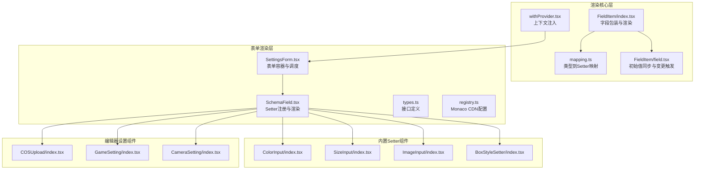
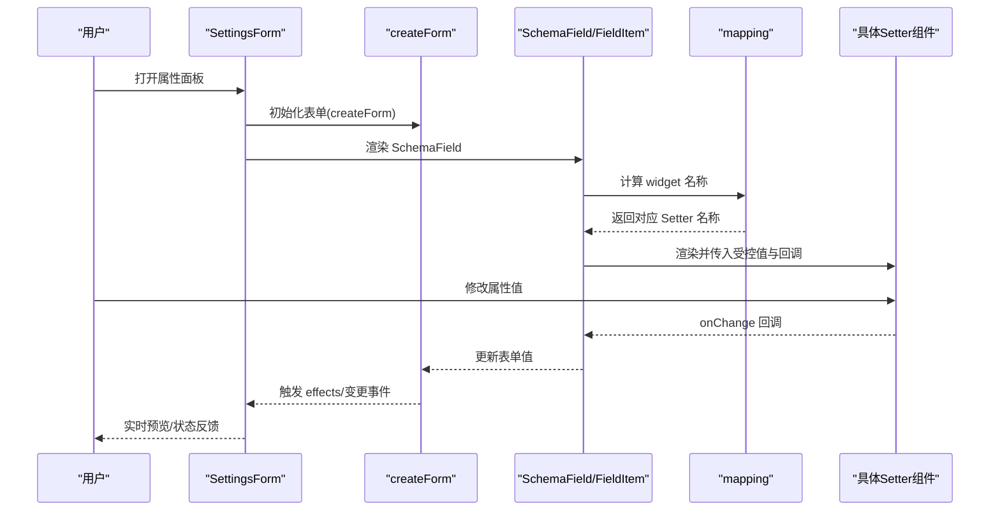
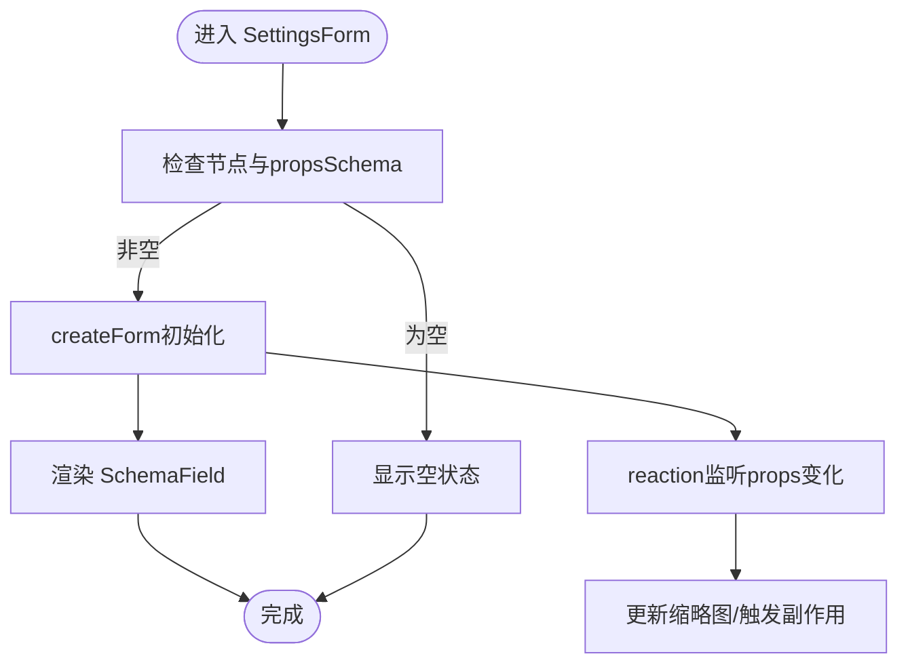
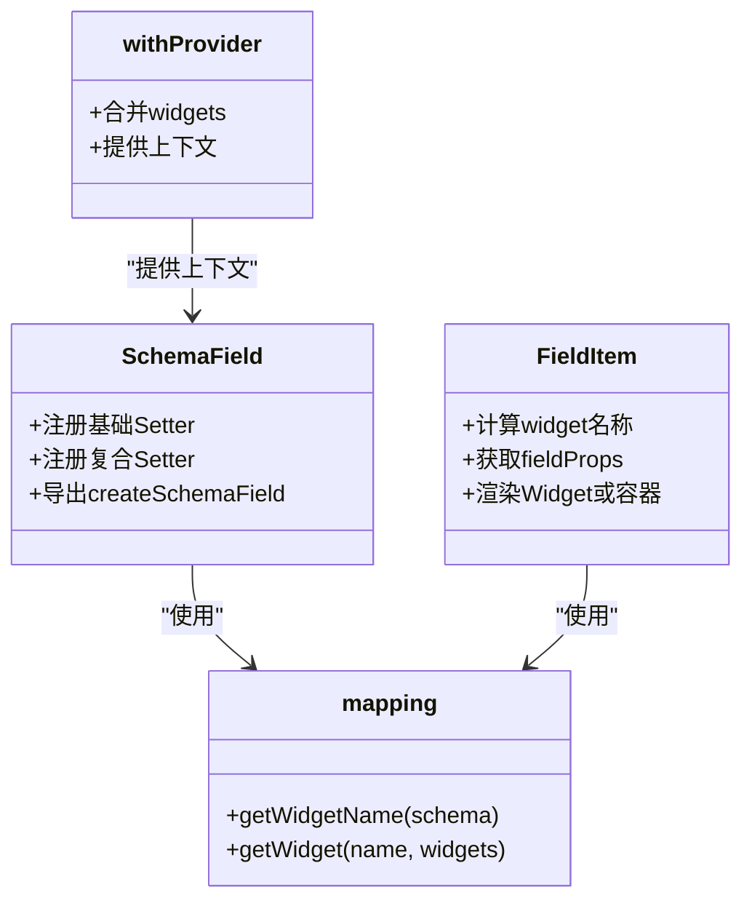
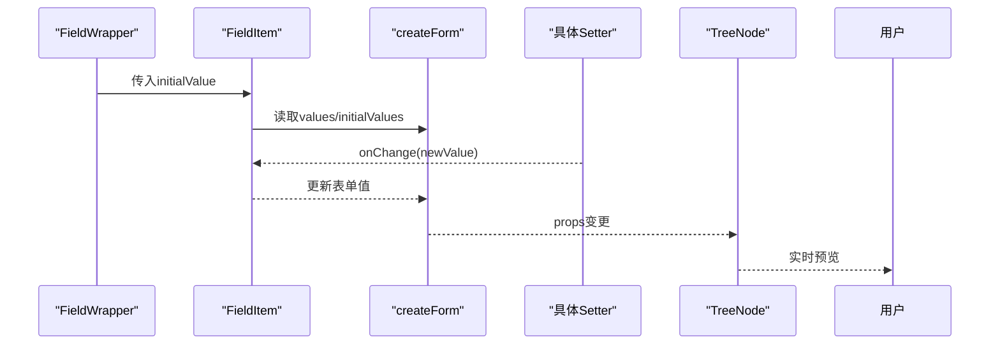
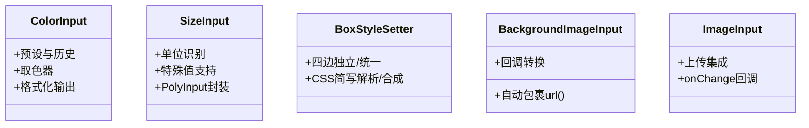
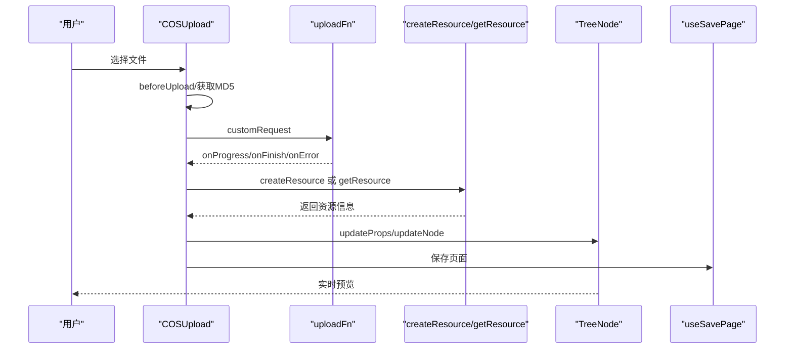
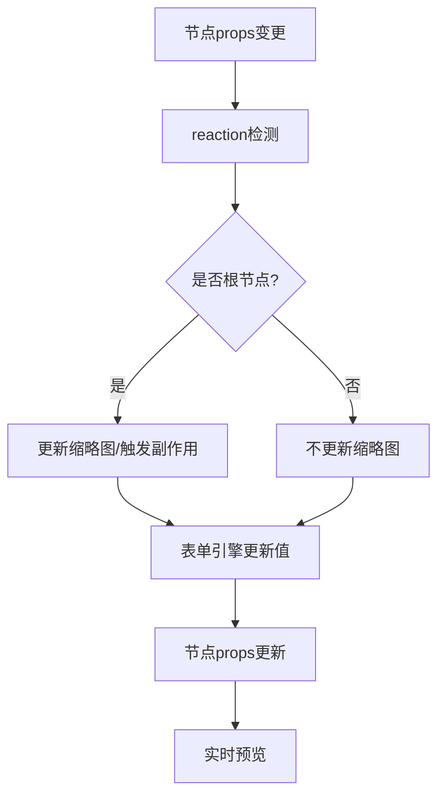
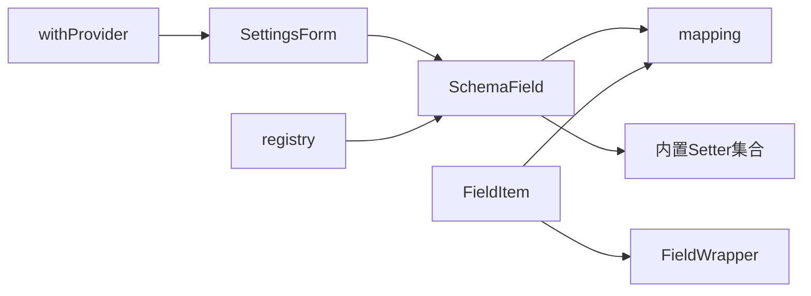

# 属性面板

<cite>
**本文引用的文件**
- [SettingsForm.tsx](file://packages/react-settings-form/src/SettingsForm.tsx)
- [SchemaField.tsx](file://packages/react-settings-form/src/SchemaField.tsx)
- [types.ts](file://packages/react-settings-form/src/types.ts)
- [registry.ts](file://packages/react-settings-form/src/registry.ts)
- [mapping.ts](file://common/render-core/models/mapping.ts)
- [FieldItem/index.tsx](file://common/render-core/FieldItem/index.tsx)
- [FieldItem/field.tsx](file://common/render-core/FieldItem/field.tsx)
- [withProvider.tsx](file://common/render-core/models/withProvider.tsx)
- [ColorInput/index.tsx](file://packages/react-settings-form/src/components/ColorInput/index.tsx)
- [SizeInput/index.tsx](file://packages/react-settings-form/src/components/SizeInput/index.tsx)
- [ImageInput/index.tsx](file://packages/react-settings-form/src/components/ImageInput/index.tsx)
- [BoxStyleSetter/index.tsx](file://packages/react-settings-form/src/components/BoxStyleSetter/index.tsx)
- [COSUpload/index.tsx](file://editor/src/settingComponents/COSUpload/index.tsx)
- [GameSetting/index.tsx](file://editor/src/settingComponents/GameSetting/index.tsx)
- [CameraSetting/index.tsx](file://editor/src/settingComponents/CameraSetting/index.tsx)
</cite>

## 目录
1. [简介](#简介)
2. [项目结构](#项目结构)
3. [核心组件](#核心组件)
4. [架构总览](#架构总览)
5. [详细组件分析](#详细组件分析)
6. [依赖分析](#依赖分析)
7. [性能考量](#性能考量)
8. [故障排查指南](#故障排查指南)
9. [结论](#结论)
10. [附录](#附录)

## 简介
本文件面向 Slides Engine 的“属性面板”子系统，系统性阐述其架构设计、运行机制与扩展方式。重点覆盖以下方面：
- SettingsForm 的工作原理与生命周期管理
- Setter 组件注册与映射机制
- 属性值的双向绑定与变更传播
- 基础 Setter（输入框、选择器、开关）、复合 Setter（颜色、尺寸、边框等）与特殊 Setter（资源上传、链接配置）
- 动态生成：按组件类型自动匹配 Setter、按属性配置动态渲染
- 属性变更处理流程：变更检测、状态更新、实时预览
- 自定义 Setter 开发指南：实现规范、数据转换规则、错误处理

## 项目结构
属性面板由“表单渲染层 + Setter 注册层 + 渲染核心层 + 编辑器设置组件层”构成，分层职责清晰、耦合度低，便于扩展与维护。

图表来源
- [SettingsForm.tsx:1-147](file://packages/react-settings-form/src/SettingsForm.tsx#L1-L147)
- [SchemaField.tsx:1-107](file://packages/react-settings-form/src/SchemaField.tsx#L1-L107)
- [mapping.ts:1-92](file://common/render-core/models/mapping.ts#L1-L92)
- [FieldItem/index.tsx:1-61](file://common/render-core/FieldItem/index.tsx#L1-L61)
- [FieldItem/field.tsx:1-19](file://common/render-core/FieldItem/field.tsx#L1-L19)
- [withProvider.tsx:1-31](file://common/render-core/models/withProvider.tsx#L1-L31)
- [ColorInput/index.tsx:1-240](file://packages/react-settings-form/src/components/ColorInput/index.tsx#L1-L240)
- [SizeInput/index.tsx:1-55](file://packages/react-settings-form/src/components/SizeInput/index.tsx#L1-L55)
- [ImageInput/index.tsx:1-74](file://packages/react-settings-form/src/components/ImageInput/index.tsx#L1-L74)
- [BoxStyleSetter/index.tsx:1-115](file://packages/react-settings-form/src/components/BoxStyleSetter/index.tsx#L1-L115)
- [COSUpload/index.tsx:1-269](file://editor/src/settingComponents/COSUpload/index.tsx#L1-L269)
- [GameSetting/index.tsx:1-63](file://editor/src/settingComponents/GameSetting/index.tsx#L1-L63)
- [CameraSetting/index.tsx:1-77](file://editor/src/settingComponents/CameraSetting/index.tsx#L1-L77)

章节来源
- [SettingsForm.tsx:1-147](file://packages/react-settings-form/src/SettingsForm.tsx#L1-L147)
- [SchemaField.tsx:1-107](file://packages/react-settings-form/src/SchemaField.tsx#L1-L107)
- [mapping.ts:1-92](file://common/render-core/models/mapping.ts#L1-L92)
- [FieldItem/index.tsx:1-61](file://common/render-core/FieldItem/index.tsx#L1-L61)
- [FieldItem/field.tsx:1-19](file://common/render-core/FieldItem/field.tsx#L1-L19)
- [withProvider.tsx:1-31](file://common/render-core/models/withProvider.tsx#L1-L31)

## 核心组件
- SettingsForm：属性面板主容器，负责创建表单实例、订阅节点属性变化、渲染 SchemaField，并提供上下文与调度策略。
- SchemaField：基于 @slides/react 的 Schema 渲染器，集中注册各类 Setter 组件，支持基础与复合 Setter 的统一渲染。
- mapping：类型到 Setter 名称的映射规则，支持 format、枚举、只读等条件匹配。
- FieldItem/FieldWrapper：字段级包装器，负责初始值同步、受控渲染与变更回调。
- withProvider：上下文 Provider，合并 widgets/methods/globalProps/globalConfig，向下传递。

章节来源
- [SettingsForm.tsx:1-147](file://packages/react-settings-form/src/SettingsForm.tsx#L1-L147)
- [SchemaField.tsx:1-107](file://packages/react-settings-form/src/SchemaField.tsx#L1-L107)
- [mapping.ts:1-92](file://common/render-core/models/mapping.ts#L1-L92)
- [FieldItem/index.tsx:1-61](file://common/render-core/FieldItem/index.tsx#L1-L61)
- [FieldItem/field.tsx:1-19](file://common/render-core/FieldItem/field.tsx#L1-L19)
- [withProvider.tsx:1-31](file://common/render-core/models/withProvider.tsx#L1-L31)

## 架构总览
属性面板采用“Schema 驱动 + Setter 注册 + 类型映射”的三层架构：
- Schema 驱动：通过 propsSchema 定义属性项与校验规则，驱动渲染。
- Setter 注册：在 SchemaField 中集中注册基础与复合 Setter，形成可复用的 UI 组件库。
- 类型映射：根据 schema 的 type/format/readOnly 等元信息，自动匹配合适的 Setter。

图表来源
- [SettingsForm.tsx:29-147](file://packages/react-settings-form/src/SettingsForm.tsx#L29-L147)
- [SchemaField.tsx:58-107](file://packages/react-settings-form/src/SchemaField.tsx#L58-L107)
- [mapping.ts:42-92](file://common/render-core/models/mapping.ts#L42-L92)
- [FieldItem/index.tsx:7-61](file://common/render-core/FieldItem/index.tsx#L7-L61)

## 详细组件分析

### SettingsForm 工作原理
- 表单创建与调度：使用 createForm 基于节点 defaultProps 与当前 props 初始化表单；通过 reaction 监听节点 props 的字符串化变化，触发缩略图更新等副作用。
- 渲染入口：当节点存在且 propsSchema 存在且仅选中一个节点时，渲染 SchemaField；否则显示空状态。
- 上下文提供：通过 SettingsFormContext 向子组件提供 scope、extra、uploadAction 等扩展能力。
- 性能调度：使用 requestIdle/cancelIdle 进行渲染节流，避免频繁重渲染。

图表来源
- [SettingsForm.tsx:29-147](file://packages/react-settings-form/src/SettingsForm.tsx#L29-L147)

章节来源
- [SettingsForm.tsx:1-147](file://packages/react-settings-form/src/SettingsForm.tsx#L1-L147)
- [types.ts:1-19](file://packages/react-settings-form/src/types.ts#L1-L19)

### Setter 注册机制与动态生成
- 注册中心：SchemaField 使用 createSchemaField 并在 components 中集中注册所有可用 Setter，包括基础组件（Input、Select、Switch 等）与复合组件（ColorInput、SizeInput、BoxStyleSetter 等）。
- 动态匹配：FieldItem 根据 schema 计算 widget 名称，若未找到则回退到错误组件；随后从 widgets 中解析具体组件并传入 fieldProps。
- 上下文注入：withProvider 将 widgets/methods/globalProps/globalConfig 合并后注入，支持外部扩展 Setter 与方法。

图表来源
- [SchemaField.tsx:58-107](file://packages/react-settings-form/src/SchemaField.tsx#L58-L107)
- [FieldItem/index.tsx:7-61](file://common/render-core/FieldItem/index.tsx#L7-L61)
- [mapping.ts:42-92](file://common/render-core/models/mapping.ts#L42-L92)
- [withProvider.tsx:4-31](file://common/render-core/models/withProvider.tsx#L4-L31)

章节来源
- [SchemaField.tsx:1-107](file://packages/react-settings-form/src/SchemaField.tsx#L1-L107)
- [FieldItem/index.tsx:1-61](file://common/render-core/FieldItem/index.tsx#L1-L61)
- [mapping.ts:1-92](file://common/render-core/models/mapping.ts#L1-L92)
- [withProvider.tsx:1-31](file://common/render-core/models/withProvider.tsx#L1-L31)

### 属性值的双向绑定
- 初始值同步：FieldWrapper 在首次挂载时，依据 JSON 序列化的 initialValue 调用 onChange，确保受控组件与表单值一致。
- 受控渲染：FieldItem 通过 getFieldProps 计算 path/rootPath 等，结合 ConfigContext 提供的 methods/globalProps 等，向具体 Setter 传递受控值与回调。
- 变更传播：Setter 内部 onChange 回调经由 SchemaField/FieldItem 传递至表单引擎，最终更新节点 props 并触发预览。

图表来源
- [FieldItem/field.tsx:4-19](file://common/render-core/FieldItem/field.tsx#L4-L19)
- [FieldItem/index.tsx:23-61](file://common/render-core/FieldItem/index.tsx#L23-L61)
- [SettingsForm.tsx:65-75](file://packages/react-settings-form/src/SettingsForm.tsx#L65-L75)

章节来源
- [FieldItem/field.tsx:1-19](file://common/render-core/FieldItem/field.tsx#L1-L19)
- [FieldItem/index.tsx:1-61](file://common/render-core/FieldItem/index.tsx#L1-L61)
- [SettingsForm.tsx:1-147](file://packages/react-settings-form/src/SettingsForm.tsx#L1-L147)

### 基础 Setter（输入框、选择器、开关）
- 输入类：Input、NumberPicker、ValueInput、MonacoInput 等，用于文本、数值、代码等基础输入。
- 选择类：Select、Radio、ArrayItems、ArrayTable 等，用于枚举、多选、数组编辑。
- 开关类：Switch、Slider 等，用于布尔与范围控制。
- 使用方式：在 propsSchema 中声明 type/format/ui:widget 等元信息，由 mapping 自动匹配对应 Setter。

章节来源
- [SchemaField.tsx:58-107](file://packages/react-settings-form/src/SchemaField.tsx#L58-L107)
- [mapping.ts:42-92](file://common/render-core/models/mapping.ts#L42-L92)

### 复合 Setter（颜色、尺寸、边框、阴影、字体、布局等）
- 颜色：ColorInput 支持预设、历史记录、取色器、格式化输出（含 RGBA），适配多种颜色输入场景。
- 尺寸：SizeInput 支持 px/%/倍数等单位与特殊值（如 cover/contain），并提供 PolyInput 基础能力。
- 边框与内边距：BoxStyleSetter 支持四边独立/统一设置，解析与合成 CSS 简写值。
- 背景与位置：BackgroundImageInput、PositionInput、CornerInput 等，支持背景 URL 包裹与定位。
- 其他：OpacitySlider、RotateSlider、Filter、FlexStyleSetter、DisplayStyleSetter、TransformStyleSetter 等。

图表来源
- [ColorInput/index.tsx:138-240](file://packages/react-settings-form/src/components/ColorInput/index.tsx#L138-L240)
- [SizeInput/index.tsx:1-55](file://packages/react-settings-form/src/components/SizeInput/index.tsx#L1-L55)
- [BoxStyleSetter/index.tsx:29-115](file://packages/react-settings-form/src/components/BoxStyleSetter/index.tsx#L29-L115)
- [ImageInput/index.tsx:13-74](file://packages/react-settings-form/src/components/ImageInput/index.tsx#L13-L74)

章节来源
- [ColorInput/index.tsx:1-240](file://packages/react-settings-form/src/components/ColorInput/index.tsx#L1-L240)
- [SizeInput/index.tsx:1-55](file://packages/react-settings-form/src/components/SizeInput/index.tsx#L1-L55)
- [BoxStyleSetter/index.tsx:1-115](file://packages/react-settings-form/src/components/BoxStyleSetter/index.tsx#L1-L115)
- [ImageInput/index.tsx:1-74](file://packages/react-settings-form/src/components/ImageInput/index.tsx#L1-L74)

### 特殊 Setter（资源上传、链接配置）
- 资源上传：COSUpload 集成上传流程（进度、完成、错误回调），创建资源、更新节点属性、持久化页面数据。
- 链接配置：Editor 层的 CameraSetting、GameSetting 等，结合业务逻辑进行联动配置与预览。

图表来源
- [COSUpload/index.tsx:97-136](file://editor/src/settingComponents/COSUpload/index.tsx#L97-L136)
- [COSUpload/index.tsx:144-234](file://editor/src/settingComponents/COSUpload/index.tsx#L144-L234)

章节来源
- [COSUpload/index.tsx:1-269](file://editor/src/settingComponents/COSUpload/index.tsx#L1-L269)
- [GameSetting/index.tsx:1-63](file://editor/src/settingComponents/GameSetting/index.tsx#L1-L63)
- [CameraSetting/index.tsx:39-77](file://editor/src/settingComponents/CameraSetting/index.tsx#L39-L77)

### 属性变更处理流程
- 变更检测：SettingsForm 使用 reaction 监听节点 props 的字符串化值，根节点变更时触发缩略图更新。
- 状态更新：Setter onChange -> FieldItem -> 表单引擎 -> 节点 props -> 预览更新。
- 实时预览：通过工作台与设计器的联动，实现属性变更即时反馈。

图表来源
- [SettingsForm.tsx:54-62](file://packages/react-settings-form/src/SettingsForm.tsx#L54-L62)

章节来源
- [SettingsForm.tsx:1-147](file://packages/react-settings-form/src/SettingsForm.tsx#L1-L147)

### 自定义 Setter 开发指南
- 实现规范
  - 接口约定：接收 value 与 onChange 回调，保持受控组件形态。
  - 数据转换：在 onChange 中将输入标准化为 schema 所需的数据格式；必要时在组件内部进行格式化（如 ColorInput 的 RGBA 输出）。
  - 错误处理：对非法输入给出明确提示或降级处理，避免污染全局状态。
- 注册方式
  - 在 SchemaField 的 components 中注册新 Setter 名称，使其可通过 ui:widget 或类型映射被发现。
  - 若需全局复用，可在 withProvider 的 widgets 中注入，或通过 SettingsForm 的 components 属性传入。
- 最佳实践
  - 单一职责：每个 Setter 聚焦一类输入行为，避免过度耦合。
  - 可组合性：优先复用现有基础 Setter（如 InputNumber、InputItems），减少重复造轮子。
  - 可测试性：为复杂转换逻辑提供单元测试，保证数据一致性。

章节来源
- [SchemaField.tsx:58-107](file://packages/react-settings-form/src/SchemaField.tsx#L58-L107)
- [withProvider.tsx:4-31](file://common/render-core/models/withProvider.tsx#L4-L31)
- [ColorInput/index.tsx:138-240](file://packages/react-settings-form/src/components/ColorInput/index.tsx#L138-L240)
- [SizeInput/index.tsx:1-55](file://packages/react-settings-form/src/components/SizeInput/index.tsx#L1-L55)

## 依赖分析
- 组件耦合
  - SettingsForm 依赖 SchemaField 与表单引擎；SchemaField 依赖 mapping 与 widgets 注册表。
  - FieldItem 依赖 mapping 与 ConfigContext；FieldWrapper 依赖 useUpdateEffect 实现初始值同步。
- 外部依赖
  - Ant Design 组件库提供基础输入组件（Input、Select、Switch、Slider 等）。
  - Monaco Editor CDN 通过 registry.ts 配置，支持代码输入场景。
- 循环依赖
  - 未见直接循环依赖；各层职责清晰，通过上下文与工厂模式解耦。

图表来源
- [SettingsForm.tsx:1-147](file://packages/react-settings-form/src/SettingsForm.tsx#L1-L147)
- [SchemaField.tsx:1-107](file://packages/react-settings-form/src/SchemaField.tsx#L1-L107)
- [mapping.ts:1-92](file://common/render-core/models/mapping.ts#L1-L92)
- [FieldItem/index.tsx:1-61](file://common/render-core/FieldItem/index.tsx#L1-L61)
- [FieldItem/field.tsx:1-19](file://common/render-core/FieldItem/field.tsx#L1-L19)
- [withProvider.tsx:1-31](file://common/render-core/models/withProvider.tsx#L1-L31)
- [registry.ts:1-17](file://packages/react-settings-form/src/registry.ts#L1-L17)

章节来源
- [SettingsForm.tsx:1-147](file://packages/react-settings-form/src/SettingsForm.tsx#L1-L147)
- [SchemaField.tsx:1-107](file://packages/react-settings-form/src/SchemaField.tsx#L1-L107)
- [mapping.ts:1-92](file://common/render-core/models/mapping.ts#L1-L92)
- [FieldItem/index.tsx:1-61](file://common/render-core/FieldItem/index.tsx#L1-L61)
- [FieldItem/field.tsx:1-19](file://common/render-core/FieldItem/field.tsx#L1-L19)
- [withProvider.tsx:1-31](file://common/render-core/models/withProvider.tsx#L1-L31)
- [registry.ts:1-17](file://packages/react-settings-form/src/registry.ts#L1-L17)

## 性能考量
- 渲染节流：SettingsForm 使用 requestIdle/cancelIdle 对渲染进行节流，降低高频率变更带来的卡顿。
- 变更监听：reaction 仅监听节点 props 的字符串化值，避免深层对象比较成本。
- 受控渲染：FieldWrapper 在初始挂载时同步一次初始值，减少不必要的中间态更新。
- 建议
  - 对高频输入（如拖拽式 Slider）建议配合节流/防抖策略。
  - 复杂 Setter（如 MonacoInput）应按需加载与懒初始化，减少首屏负担。

章节来源
- [SettingsForm.tsx:138-146](file://packages/react-settings-form/src/SettingsForm.tsx#L138-L146)
- [FieldItem/field.tsx:8-10](file://common/render-core/FieldItem/field.tsx#L8-L10)

## 故障排查指南
- 无属性面板显示
  - 检查节点是否存在 propsSchema 且仅选中一个节点。
  - 确认 SchemaField 是否正确注册了所需 Setter。
- Setter 不生效或值不同步
  - 确认 FieldWrapper 是否在初次挂载时触发了 onChange(initialValue)。
  - 检查 mapping 是否正确匹配到目标 Setter。
- 上传异常
  - 检查 COSUpload 的 accept、beforeUpload、customRequest 配置。
  - 关注 onProgress/onFinish/onError 的状态更新与错误提示。
- 颜色输入异常
  - 确认 ColorInput 的格式化逻辑（RGBA 输出）与存储格式一致。
  - 检查浏览器取色器支持与权限。

章节来源
- [SettingsForm.tsx:42-94](file://packages/react-settings-form/src/SettingsForm.tsx#L42-L94)
- [FieldItem/field.tsx:8-10](file://common/render-core/FieldItem/field.tsx#L8-L10)
- [mapping.ts:42-92](file://common/render-core/models/mapping.ts#L42-L92)
- [COSUpload/index.tsx:138-234](file://editor/src/settingComponents/COSUpload/index.tsx#L138-L234)
- [ColorInput/index.tsx:156-161](file://packages/react-settings-form/src/components/ColorInput/index.tsx#L156-L161)

## 结论
Slides Engine 属性面板以 Schema 驱动为核心，结合完善的 Setter 注册体系与类型映射机制，实现了高度可扩展的属性编辑体验。通过 SettingsForm 的统一调度、FieldItem 的受控渲染与 mapping 的智能匹配，既能满足基础属性编辑需求，也能承载复杂业务 Setter（如资源上传、游戏配置等）。建议在扩展新 Setter 时遵循受控、单一职责与可组合的原则，并充分利用上下文注入与注册机制，确保系统的一致性与可维护性。

## 附录
- Monaco CDN 配置：通过 setNpmCDNRegistry/getNpmCDNRegistry 管理编辑器脚本路径，便于在不同环境切换。
- 接口参考：ISettingFormProps 定义了 className/style/components/effects/scope/extra/updateThumbnail 等关键参数。

章节来源
- [registry.ts:1-17](file://packages/react-settings-form/src/registry.ts#L1-L17)
- [types.ts:1-19](file://packages/react-settings-form/src/types.ts#L1-L19)