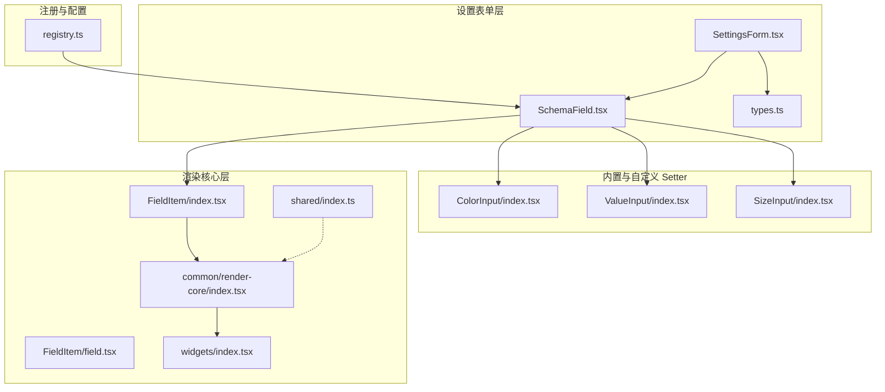
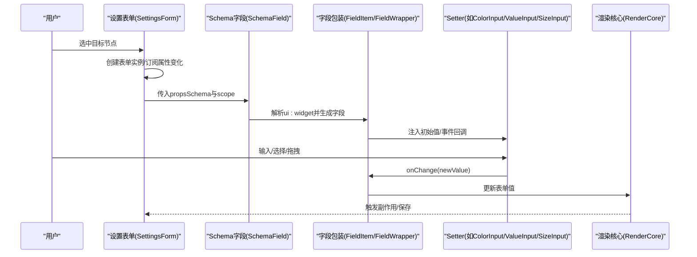
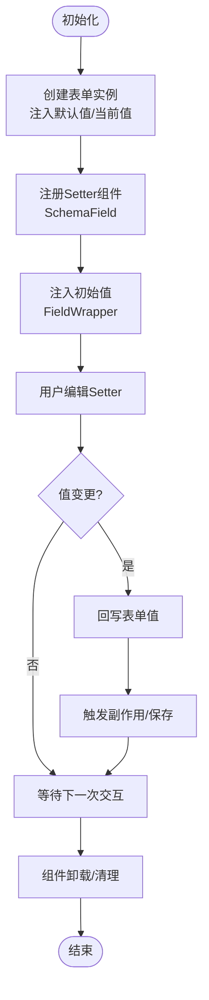
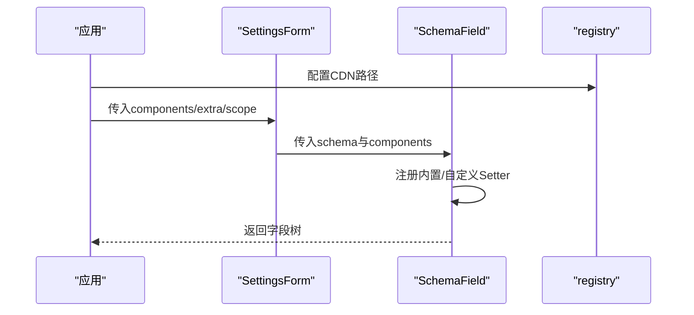
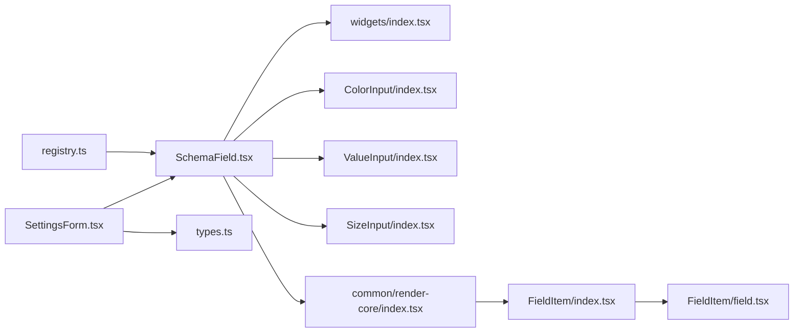

# 自定义 Setter 开发

<cite>
**本文引用的文件**
- [packages/react-settings-form/src/SettingsForm.tsx](file://packages/react-settings-form/src/SettingsForm.tsx)
- [packages/react-settings-form/src/SchemaField.tsx](file://packages/react-settings-form/src/SchemaField.tsx)
- [packages/react-settings-form/src/components/ColorInput/index.tsx](file://packages/react-settings-form/src/components/ColorInput/index.tsx)
- [packages/react-settings-form/src/components/ValueInput/index.tsx](file://packages/react-settings-form/src/components/ValueInput/index.tsx)
- [packages/react-settings-form/src/components/SizeInput/index.tsx](file://packages/react-settings-form/src/components/SizeInput/index.tsx)
- [common/render-core/FieldItem/index.tsx](file://common/render-core/FieldItem/index.tsx)
- [common/render-core/FieldItem/field.tsx](file://common/render-core/FieldItem/field.tsx)
- [common/render-core/index.tsx](file://common/render-core/index.tsx)
- [common/render-core/shared/index.ts](file://common/render-core/shared/index.ts)
- [common/render-core/widgets/index.tsx](file://common/render-core/widgets/index.tsx)
- [packages/react-settings-form/src/types.ts](file://packages/react-settings-form/src/types.ts)
- [packages/react-settings-form/src/registry.ts](file://packages/react-settings-form/src/registry.ts)
</cite>

## 目录
1. [简介](#简介)
2. [项目结构](#项目结构)
3. [核心组件](#核心组件)
4. [架构总览](#架构总览)
5. [详细组件分析](#详细组件分析)
6. [依赖关系分析](#依赖关系分析)
7. [性能考量](#性能考量)
8. [故障排查指南](#故障排查指南)
9. [结论](#结论)
10. [附录](#附录)

## 简介
本指南面向在 Slides Engine 中开发“自定义 Setter”的工程师，系统讲解 Setter 的接口约定、数据类型与转换规则、事件与生命周期、注册与动态加载机制，并提供从需求分析到测试的完整开发流程与可复用模板路径。文档以仓库中现有的设置表单与渲染核心为基础，结合实际组件实现，帮助你快速、稳定地扩展 Setter 生态。

## 项目结构
围绕 Setter 的开发，主要涉及以下模块：
- 设置表单层：负责节点属性的收集、校验、联动与持久化
- 渲染核心层：负责根据 schema 将字段映射为具体 UI 组件（Setter）
- 内置与自定义 Setter：提供通用输入控件与复合样式 Setter
- 注册与 CDN 配置：支持全局注册与按需加载

图表来源
- [packages/react-settings-form/src/SettingsForm.tsx:1-147](file://packages/react-settings-form/src/SettingsForm.tsx#L1-L147)
- [packages/react-settings-form/src/SchemaField.tsx:1-107](file://packages/react-settings-form/src/SchemaField.tsx#L1-L107)
- [packages/react-settings-form/src/components/ColorInput/index.tsx:1-240](file://packages/react-settings-form/src/components/ColorInput/index.tsx#L1-L240)
- [packages/react-settings-form/src/components/ValueInput/index.tsx:1-113](file://packages/react-settings-form/src/components/ValueInput/index.tsx#L1-L113)
- [packages/react-settings-form/src/components/SizeInput/index.tsx:1-55](file://packages/react-settings-form/src/components/SizeInput/index.tsx#L1-L55)
- [common/render-core/FieldItem/index.tsx:1-61](file://common/render-core/FieldItem/index.tsx#L1-L61)
- [common/render-core/FieldItem/field.tsx:1-19](file://common/render-core/FieldItem/field.tsx#L1-L19)
- [common/render-core/index.tsx:1-59](file://common/render-core/index.tsx#L1-L59)
- [common/render-core/shared/index.ts:1-11](file://common/render-core/shared/index.ts#L1-L11)
- [common/render-core/widgets/index.tsx:1-130](file://common/render-core/widgets/index.tsx#L1-L130)
- [packages/react-settings-form/src/types.ts:1-19](file://packages/react-settings-form/src/types.ts#L1-L19)
- [packages/react-settings-form/src/registry.ts:1-17](file://packages/react-settings-form/src/registry.ts#L1-L17)

章节来源
- [packages/react-settings-form/src/SettingsForm.tsx:1-147](file://packages/react-settings-form/src/SettingsForm.tsx#L1-L147)
- [packages/react-settings-form/src/SchemaField.tsx:1-107](file://packages/react-settings-form/src/SchemaField.tsx#L1-L107)
- [common/render-core/index.tsx:1-59](file://common/render-core/index.tsx#L1-L59)

## 核心组件
- 设置表单容器：负责创建表单实例、绑定节点属性、触发缩略图更新、调度渲染
- Schema 字段工厂：将 schema 映射为具体组件（Setter），并注册内置与自定义 Setter
- 渲染核心：根据 schema 的 ui:widget 与 properties 递归渲染
- 字段包装器：负责初始值注入与变更回调
- 内置与自定义 Setter：如颜色选择、多态值输入、尺寸输入等

章节来源
- [packages/react-settings-form/src/SettingsForm.tsx:29-146](file://packages/react-settings-form/src/SettingsForm.tsx#L29-L146)
- [packages/react-settings-form/src/SchemaField.tsx:58-106](file://packages/react-settings-form/src/SchemaField.tsx#L58-L106)
- [common/render-core/FieldItem/index.tsx:7-61](file://common/render-core/FieldItem/index.tsx#L7-L61)
- [common/render-core/FieldItem/field.tsx:4-19](file://common/render-core/FieldItem/field.tsx#L4-L19)

## 架构总览
Setter 的运行链路如下：
- 节点选中后，设置表单容器创建表单实例并订阅节点属性变化
- SchemaField 基于 schema 的 ui:widget 选择对应 Setter
- FieldItem/FieldWrapper 负责将初始值注入 Setter 并处理变更回调
- Setter 完成输入、格式转换与校验后，回写到表单值，最终持久化到节点属性

图表来源
- [packages/react-settings-form/src/SettingsForm.tsx:49-75](file://packages/react-settings-form/src/SettingsForm.tsx#L49-L75)
- [packages/react-settings-form/src/SchemaField.tsx:58-106](file://packages/react-settings-form/src/SchemaField.tsx#L58-L106)
- [common/render-core/FieldItem/index.tsx:22-60](file://common/render-core/FieldItem/index.tsx#L22-L60)
- [common/render-core/FieldItem/field.tsx:8-10](file://common/render-core/FieldItem/field.tsx#L8-L10)

## 详细组件分析

### 设置表单容器（SettingsForm）
- 职责
  - 获取当前工作区与选中节点，提取默认值与当前值
  - 创建表单实例，挂载语言与快照等副作用
  - 提供组件作用域与额外参数给 SchemaField
  - 调度渲染，空态提示
- 生命周期要点
  - 初始化：createForm + effects
  - 值变更：reaction 订阅节点 props 变化，必要时触发缩略图更新
  - 销毁：组件卸载时清理副作用
- 关键路径
  - [设置表单主入口:29-146](file://packages/react-settings-form/src/SettingsForm.tsx#L29-L146)
  - [表单实例创建与副作用:49-75](file://packages/react-settings-form/src/SettingsForm.tsx#L49-L75)
  - [渲染与空态处理:83-127](file://packages/react-settings-form/src/SettingsForm.tsx#L83-L127)

章节来源
- [packages/react-settings-form/src/SettingsForm.tsx:29-146](file://packages/react-settings-form/src/SettingsForm.tsx#L29-L146)

### Schema 字段工厂（SchemaField）
- 职责
  - 基于 createSchemaField 创建字段工厂
  - 注册内置组件与自定义 Setter
  - 将 schema.properties 递归渲染为字段树
- 关键路径
  - [字段工厂与组件注册:58-106](file://packages/react-settings-form/src/SchemaField.tsx#L58-L106)

章节来源
- [packages/react-settings-form/src/SchemaField.tsx:58-106](file://packages/react-settings-form/src/SchemaField.tsx#L58-L106)

### 渲染核心与字段包装（RenderCore/FieldItem/FieldWrapper）
- 职责
  - RenderCore：根据 schema 的 properties 递归渲染
  - FieldItem：解析 ui:widget，获取字段属性，决定是否容器渲染
  - FieldWrapper：注入初始值，触发 onChange
- 关键路径
  - [渲染入口与排序:52-59](file://common/render-core/index.tsx#L52-L59)
  - [字段解析与容器判断:7-61](file://common/render-core/FieldItem/index.tsx#L7-L61)
  - [初始值注入与变更回调:4-19](file://common/render-core/FieldItem/field.tsx#L4-L19)

章节来源
- [common/render-core/index.tsx:52-59](file://common/render-core/index.tsx#L52-L59)
- [common/render-core/FieldItem/index.tsx:7-61](file://common/render-core/FieldItem/index.tsx#L7-L61)
- [common/render-core/FieldItem/field.tsx:4-19](file://common/render-core/FieldItem/field.tsx#L4-L19)

### 内置与自定义 Setter 示例

#### 颜色输入（ColorInput）
- 功能特性
  - 支持预设色板、历史记录、吸色器、格式化输出
  - 输入值变更时持久化历史并触发 onChange
- 数据转换
  - 输入值到显示值：支持十六进制与 RGB/A 格式
  - 输出值：统一为 rgba(...) 字符串
- 关键路径
  - [颜色输入组件:138-240](file://packages/react-settings-form/src/components/ColorInput/index.tsx#L138-L240)

章节来源
- [packages/react-settings-form/src/components/ColorInput/index.tsx:138-240](file://packages/react-settings-form/src/components/ColorInput/index.tsx#L138-L240)

#### 多态值输入（ValueInput）
- 功能特性
  - 自动识别字符串、数字、布尔、表达式、富文本等类型
  - 表达式采用弹出编辑器（MonacoInput）进行编写
- 数据转换
  - 输入检查器：正则与类型判断
  - 输入值转换：将表达式包裹/剥离 {{}}
  - 变更值转换：确保表达式格式正确
- 关键路径
  - [多态输入实现:38-113](file://packages/react-settings-form/src/components/ValueInput/index.tsx#L38-L113)

章节来源
- [packages/react-settings-form/src/components/ValueInput/index.tsx:38-113](file://packages/react-settings-form/src/components/ValueInput/index.tsx#L38-L113)

#### 尺寸输入（SizeInput）
- 功能特性
  - 支持 px、倍数等单位类型
  - 特殊背景尺寸选项（cover/contain）
- 数据转换
  - 输入值清洗：仅保留数字与单位
  - 变更值拼接：自动补全单位或特殊关键字
- 关键路径
  - [尺寸输入实现:18-55](file://packages/react-settings-form/src/components/SizeInput/index.tsx#L18-L55)

章节来源
- [packages/react-settings-form/src/components/SizeInput/index.tsx:18-55](file://packages/react-settings-form/src/components/SizeInput/index.tsx#L18-L55)

### Setter 接口与数据类型约束
- 接口约定
  - Setter 作为受控组件，接收 value 与 onChange 回调
  - 可通过 props.components 注入自定义 Setter 到 SchemaField
- 数据类型与转换
  - 文本/数字/布尔/表达式/富文本：由 ValueInput 自动识别与转换
  - 颜色：统一为 rgba(...) 字符串
  - 尺寸：带单位或特殊关键字
- 默认值与空态
  - FieldWrapper 在挂载时注入初始值
  - RenderCore 使用空 schema 占位

章节来源
- [packages/react-settings-form/src/types.ts:9-18](file://packages/react-settings-form/src/types.ts#L9-L18)
- [packages/react-settings-form/src/components/ValueInput/index.tsx:38-113](file://packages/react-settings-form/src/components/ValueInput/index.tsx#L38-L113)
- [packages/react-settings-form/src/components/ColorInput/index.tsx:138-240](file://packages/react-settings-form/src/components/ColorInput/index.tsx#L138-L240)
- [packages/react-settings-form/src/components/SizeInput/index.tsx:18-55](file://packages/react-settings-form/src/components/SizeInput/index.tsx#L18-L55)
- [common/render-core/FieldItem/field.tsx:8-10](file://common/render-core/FieldItem/field.tsx#L8-L10)
- [common/render-core/shared/index.ts:5-11](file://common/render-core/shared/index.ts#L5-L11)

### Setter 生命周期管理
- 初始化
  - SettingsForm 创建表单实例，注入默认值与当前值
  - SchemaField 注册组件，FieldItem 注入初始值
- 值变更
  - Setter onChange -> FieldWrapper -> RenderCore -> SettingsForm
  - 变更后可触发副作用（如缩略图更新）
- 验证
  - 可在 effects 中接入校验逻辑（例如表单级校验）
- 销毁
  - 组件卸载时清理副作用与订阅

图表来源
- [packages/react-settings-form/src/SettingsForm.tsx:49-75](file://packages/react-settings-form/src/SettingsForm.tsx#L49-L75)
- [packages/react-settings-form/src/SchemaField.tsx:58-106](file://packages/react-settings-form/src/SchemaField.tsx#L58-L106)
- [common/render-core/FieldItem/field.tsx:8-10](file://common/render-core/FieldItem/field.tsx#L8-L10)

章节来源
- [packages/react-settings-form/src/SettingsForm.tsx:49-75](file://packages/react-settings-form/src/SettingsForm.tsx#L49-L75)
- [common/render-core/FieldItem/field.tsx:8-10](file://common/render-core/FieldItem/field.tsx#L8-L10)

### Setter 的注册机制与动态加载
- 全局注册
  - 在 SchemaField 中集中注册所有可用 Setter
  - 通过 createSchemaField 的 components 参数完成注册
- 局部注册
  - 通过 SchemaField 的 components 参数传入局部组件集合
- 条件注册
  - 可根据 schema 的 ui:widget 动态选择不同 Setter
- CDN 与资源加载
  - registry 提供 CDN 配置，用于配置 Monaco 编辑器等资源路径

图表来源
- [packages/react-settings-form/src/registry.ts:7-16](file://packages/react-settings-form/src/registry.ts#L7-L16)
- [packages/react-settings-form/src/SchemaField.tsx:58-106](file://packages/react-settings-form/src/SchemaField.tsx#L58-L106)
- [packages/react-settings-form/src/SettingsForm.tsx:102-117](file://packages/react-settings-form/src/SettingsForm.tsx#L102-L117)

章节来源
- [packages/react-settings-form/src/registry.ts:7-16](file://packages/react-settings-form/src/registry.ts#L7-L16)
- [packages/react-settings-form/src/SchemaField.tsx:58-106](file://packages/react-settings-form/src/SchemaField.tsx#L58-L106)
- [packages/react-settings-form/src/SettingsForm.tsx:102-117](file://packages/react-settings-form/src/SettingsForm.tsx#L102-L117)

## 依赖关系分析
- 设置表单层依赖渲染核心层进行字段渲染
- SchemaField 依赖内置与自定义 Setter
- FieldItem/FieldWrapper 依赖渲染核心的上下文与工具
- 注册层为 SchemaField 提供组件注册与 CDN 配置

图表来源
- [packages/react-settings-form/src/SettingsForm.tsx:1-147](file://packages/react-settings-form/src/SettingsForm.tsx#L1-L147)
- [packages/react-settings-form/src/SchemaField.tsx:1-107](file://packages/react-settings-form/src/SchemaField.tsx#L1-L107)
- [common/render-core/index.tsx:1-59](file://common/render-core/index.tsx#L1-L59)
- [common/render-core/FieldItem/index.tsx:1-61](file://common/render-core/FieldItem/index.tsx#L1-L61)
- [common/render-core/FieldItem/field.tsx:1-19](file://common/render-core/FieldItem/field.tsx#L1-L19)
- [common/render-core/widgets/index.tsx:1-130](file://common/render-core/widgets/index.tsx#L1-L130)
- [packages/react-settings-form/src/registry.ts:1-17](file://packages/react-settings-form/src/registry.ts#L1-L17)
- [packages/react-settings-form/src/types.ts:1-19](file://packages/react-settings-form/src/types.ts#L1-L19)

章节来源
- [packages/react-settings-form/src/SettingsForm.tsx:1-147](file://packages/react-settings-form/src/SettingsForm.tsx#L1-L147)
- [packages/react-settings-form/src/SchemaField.tsx:1-107](file://packages/react-settings-form/src/SchemaField.tsx#L1-L107)
- [common/render-core/index.tsx:1-59](file://common/render-core/index.tsx#L1-L59)
- [common/render-core/FieldItem/index.tsx:1-61](file://common/render-core/FieldItem/index.tsx#L1-L61)
- [common/render-core/FieldItem/field.tsx:1-19](file://common/render-core/FieldItem/field.tsx#L1-L19)
- [common/render-core/widgets/index.tsx:1-130](file://common/render-core/widgets/index.tsx#L1-L130)
- [packages/react-settings-form/src/registry.ts:1-17](file://packages/react-settings-form/src/registry.ts#L1-L17)
- [packages/react-settings-form/src/types.ts:1-19](file://packages/react-settings-form/src/types.ts#L1-L19)

## 性能考量
- 渲染调度：设置表单使用空闲调度，避免频繁重渲染
- 变更节流：通过 reaction 订阅节点属性变化，减少无效更新
- 字段懒加载：SchemaField 仅在需要时渲染对应 Setter
- 资源按需：registry 配置 CDN，按需加载 Monaco 等资源

章节来源
- [packages/react-settings-form/src/SettingsForm.tsx:139-145](file://packages/react-settings-form/src/SettingsForm.tsx#L139-L145)
- [packages/react-settings-form/src/registry.ts:7-16](file://packages/react-settings-form/src/registry.ts#L7-L16)

## 故障排查指南
- Setter 不显示
  - 检查 schema 的 ui:widget 是否正确
  - 确认 SchemaField 已注册该 Setter
- 初始值未生效
  - 确认 FieldWrapper 注入了初始值
  - 检查 RenderCore 的 emptySchema 与默认值
- 值变更未回写
  - 确认 Setter 的 onChange 回调已触发
  - 检查 FieldItem/FieldWrapper 的事件透传
- 编辑器资源加载失败
  - 检查 registry 的 CDN 配置

章节来源
- [common/render-core/FieldItem/field.tsx:8-10](file://common/render-core/FieldItem/field.tsx#L8-L10)
- [common/render-core/shared/index.ts:5-11](file://common/render-core/shared/index.ts#L5-L11)
- [packages/react-settings-form/src/registry.ts:7-16](file://packages/react-settings-form/src/registry.ts#L7-L16)

## 结论
通过以上分析可知，Slides Engine 的 Setter 开发生态以“设置表单容器 + Schema 字段工厂 + 渲染核心”为核心，配合完善的注册与动态加载机制，能够高效支撑多样化的属性编辑场景。开发者可基于现有 Setter 模板与转换规则，快速实现新的 Setter 并融入整体体系。

## 附录

### 开发流程（从需求到测试）
- 需求分析
  - 明确属性类型与交互形态（文本/数值/枚举/表达式/颜色/尺寸等）
  - 设计数据转换规则（输入清洗、格式化、默认值、错误处理）
- 组件设计
  - 编写受控组件，提供 value 与 onChange
  - 参考现有 Setter 的实现路径
    - [颜色输入组件:138-240](file://packages/react-settings-form/src/components/ColorInput/index.tsx#L138-L240)
    - [多态值输入组件:38-113](file://packages/react-settings-form/src/components/ValueInput/index.tsx#L38-L113)
    - [尺寸输入组件:18-55](file://packages/react-settings-form/src/components/SizeInput/index.tsx#L18-L55)
- 注册与集成
  - 在 SchemaField 中注册新 Setter
  - 通过 props.components 传入局部组件
- 生命周期与事件
  - 在 SettingsForm 的 effects 中接入校验与副作用
  - 通过 FieldWrapper 确保初始值与变更回调
- 测试与验证
  - 单元测试：覆盖输入/转换/边界值
  - 集成测试：在设置表单中验证渲染与回写
  - 性能测试：观察空闲调度与变更频率

### 最佳实践清单
- 接口一致性：统一使用 value/onChange
- 类型安全：明确输入/输出类型与转换函数
- 默认值与占位：提供合理默认值与提示文案
- 错误处理：对非法输入给出反馈或回退
- 可访问性：为交互元素提供标签与键盘支持
- 性能优化：避免不必要的重渲染与资源加载