# Setter 扩展

<cite>
**本文引用的文件**
- [packages/react-settings-form/src/SettingsForm.tsx](file://packages/react-settings-form/src/SettingsForm.tsx)
- [packages/react-settings-form/src/SchemaField.tsx](file://packages/react-settings-form/src/SchemaField.tsx)
- [packages/react-settings-form/src/components/ColorInput/index.tsx](file://packages/react-settings-form/src/components/ColorInput/index.tsx)
- [packages/react-settings-form/src/components/SizeInput/index.tsx](file://packages/react-settings-form/src/components/SizeInput/index.tsx)
- [packages/react-settings-form/src/components/BorderStyleSetter/index.tsx](file://packages/react-settings-form/src/components/BorderStyleSetter/index.tsx)
- [packages/react-settings-form/src/components/BoxStyleSetter/index.tsx](file://packages/react-settings-form/src/components/BoxStyleSetter/index.tsx)
- [packages/react-settings-form/src/components/InputItems/index.tsx](file://packages/react-settings-form/src/components/InputItems/index.tsx)
- [packages/react-settings-form/src/components/RatioSetter/index.tsx](file://packages/react-settings-form/src/components/RatioSetter/index.tsx)
- [packages/react-settings-form/src/types.ts](file://packages/react-settings-form/src/types.ts)
- [packages/react-settings-form/src/registry.ts](file://packages/react-settings-form/src/registry.ts)
- [common/render-core/FieldItem/index.tsx](file://common/render-core/FieldItem/index.tsx)
- [common/render-core/FieldItem/field.tsx](file://common/render-core/FieldItem/field.tsx)
- [common/render-core/index.tsx](file://common/render-core/index.tsx)
- [common/render-core/models/withProvider.tsx](file://common/render-core/models/withProvider.tsx)
- [packages/core/src/models/TreeNode.ts](file://packages/core/src/models/TreeNode.ts)
- [task/src/pages/Main/GlobalContext.tsx](file://task/src/pages/Main/GlobalContext.tsx)
</cite>

## 目录
1. [简介](#简介)
2. [项目结构](#项目结构)
3. [核心组件](#核心组件)
4. [架构总览](#架构总览)
5. [详细组件分析](#详细组件分析)
6. [依赖关系分析](#依赖关系分析)
7. [性能考量](#性能考量)
8. [故障排查指南](#故障排查指南)
9. [结论](#结论)
10. [附录：开发示例与最佳实践](#附录开发示例与最佳实践)

## 简介
本文件面向“Slides Engine Setter 扩展”的开发者，系统性阐述 Setter 组件的概念、属性面板构成、数据绑定机制、验证规则实现，以及如何开发自定义 Setter（基础 Setter、复合 Setter、异步 Setter）。文档同时给出常见 Setter 的实现思路（文本输入、选择器、颜色选择等），并总结 Setter 扩展的设计模式：组件复用、状态管理、事件处理、错误处理的最佳实践。

## 项目结构
本项目围绕“设置表单渲染”和“Setter 组件生态”展开：
- 设置表单渲染层：通过 SchemaField 将 JSON Schema 映射到具体 UI 组件（Setter）。
- Setter 组件层：提供丰富的内置 Setter（如颜色、尺寸、边框、盒模型等）。
- 渲染核心层：负责根据 schema 动态渲染字段、容器组件，并注入上下文与全局配置。
- 节点模型层：提供节点树结构与属性变更能力，支撑 Setter 对节点样式的直接修改。

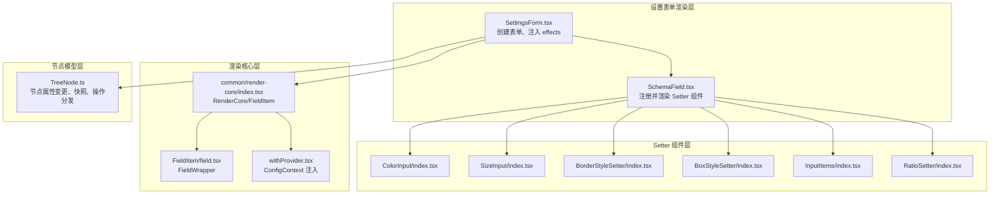

图表来源
- [packages/react-settings-form/src/SettingsForm.tsx:29-147](file://packages/react-settings-form/src/SettingsForm.tsx#L29-L147)
- [packages/react-settings-form/src/SchemaField.tsx:58-107](file://packages/react-settings-form/src/SchemaField.tsx#L58-L107)
- [packages/react-settings-form/src/components/ColorInput/index.tsx:138-240](file://packages/react-settings-form/src/components/ColorInput/index.tsx#L138-L240)
- [packages/react-settings-form/src/components/SizeInput/index.tsx:1-55](file://packages/react-settings-form/src/components/SizeInput/index.tsx#L1-L55)
- [packages/react-settings-form/src/components/BorderStyleSetter/index.tsx:78-146](file://packages/react-settings-form/src/components/BorderStyleSetter/index.tsx#L78-L146)
- [packages/react-settings-form/src/components/BoxStyleSetter/index.tsx:29-115](file://packages/react-settings-form/src/components/BoxStyleSetter/index.tsx#L29-L115)
- [packages/react-settings-form/src/components/InputItems/index.tsx:31-72](file://packages/react-settings-form/src/components/InputItems/index.tsx#L31-L72)
- [packages/react-settings-form/src/components/RatioSetter/index.tsx:16-46](file://packages/react-settings-form/src/components/RatioSetter/index.tsx#L16-L46)
- [common/render-core/index.tsx:28-59](file://common/render-core/index.tsx#L28-L59)
- [common/render-core/FieldItem/field.tsx:4-19](file://common/render-core/FieldItem/field.tsx#L4-L19)
- [common/render-core/models/withProvider.tsx:4-31](file://common/render-core/models/withProvider.tsx#L4-L31)
- [packages/core/src/models/TreeNode.ts:344-390](file://packages/core/src/models/TreeNode.ts#L344-L390)

章节来源
- [packages/react-settings-form/src/SettingsForm.tsx:29-147](file://packages/react-settings-form/src/SettingsForm.tsx#L29-L147)
- [packages/react-settings-form/src/SchemaField.tsx:58-107](file://packages/react-settings-form/src/SchemaField.tsx#L58-L107)
- [common/render-core/index.tsx:28-59](file://common/render-core/index.tsx#L28-L59)

## 核心组件
- SettingsForm：基于表单引擎创建表单实例，注入 effects（本地化、快照、外部副作用），并渲染 SchemaField。
- SchemaField：将 JSON Schema 中的 ui:widget 映射到具体 Setter 组件，统一注册内置 Setter。
- FieldItem/FieldWrapper：将 schema 转换为可交互的字段或容器组件，处理初始值与 onChange 回调。
- TreeNode：提供节点属性变更、快照与操作分发，是 Setter 修改样式/属性的底层载体。

章节来源
- [packages/react-settings-form/src/SettingsForm.tsx:29-147](file://packages/react-settings-form/src/SettingsForm.tsx#L29-L147)
- [packages/react-settings-form/src/SchemaField.tsx:58-107](file://packages/react-settings-form/src/SchemaField.tsx#L58-L107)
- [common/render-core/FieldItem/index.tsx:7-61](file://common/render-core/FieldItem/index.tsx#L7-L61)
- [common/render-core/FieldItem/field.tsx:4-19](file://common/render-core/FieldItem/field.tsx#L4-L19)
- [packages/core/src/models/TreeNode.ts:344-390](file://packages/core/src/models/TreeNode.ts#L344-L390)

## 架构总览
Setter 扩展遵循“Schema 驱动 + 组件注册 + 表单引擎 + 节点模型”的架构：
- Schema 驱动：通过 propsSchema 定义字段类型、默认值、校验规则、UI 组件映射。
- 组件注册：在 SchemaField 中集中注册所有可用 Setter，支持按需扩展。
- 表单引擎：SettingsForm 基于表单引擎创建表单实例，自动建立双向数据绑定。
- 节点模型：Setter 通过节点 API 修改 props/style，触发快照与重渲染。

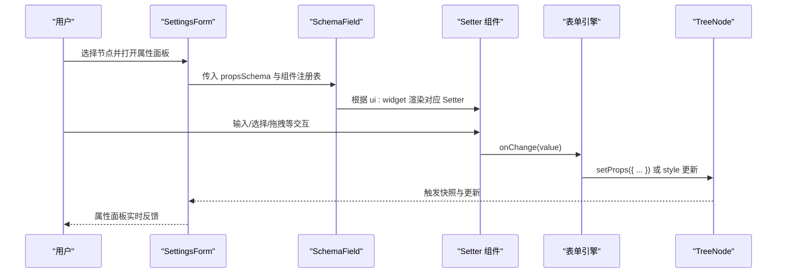

图表来源
- [packages/react-settings-form/src/SettingsForm.tsx:49-75](file://packages/react-settings-form/src/SettingsForm.tsx#L49-L75)
- [packages/react-settings-form/src/SchemaField.tsx:58-107](file://packages/react-settings-form/src/SchemaField.tsx#L58-L107)
- [packages/react-settings-form/src/components/ColorInput/index.tsx:156-161](file://packages/react-settings-form/src/components/ColorInput/index.tsx#L156-L161)
- [packages/core/src/models/TreeNode.ts:344-390](file://packages/core/src/models/TreeNode.ts#L344-L390)

## 详细组件分析

### SettingsForm：表单创建与副作用注入
- 创建表单实例：以节点的默认值与当前值作为初始值，建立响应式数据流。
- 注入 effects：本地化、快照、外部副作用（如缩略图更新）。
- 渲染入口：通过 SchemaField 渲染 propsSchema 定义的属性面板。

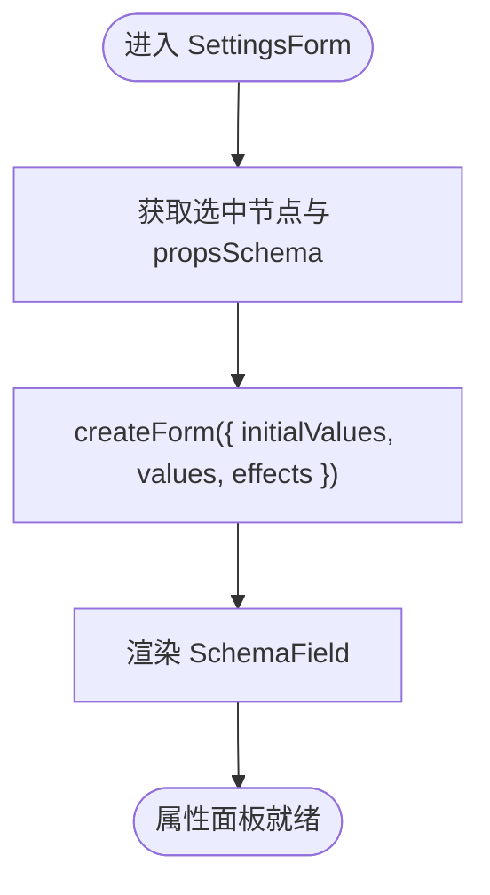

图表来源
- [packages/react-settings-form/src/SettingsForm.tsx:49-75](file://packages/react-settings-form/src/SettingsForm.tsx#L49-L75)
- [packages/react-settings-form/src/SettingsForm.tsx:83-127](file://packages/react-settings-form/src/SettingsForm.tsx#L83-L127)

章节来源
- [packages/react-settings-form/src/SettingsForm.tsx:29-147](file://packages/react-settings-form/src/SettingsForm.tsx#L29-L147)
- [packages/react-settings-form/src/types.ts:9-19](file://packages/react-settings-form/src/types.ts#L9-L19)

### SchemaField：Setter 注册与渲染
- 组件注册：集中注册所有内置 Setter（输入、选择、颜色、尺寸、布局、样式等）。
- 字段渲染：根据 schema 的 ui:widget 与 props 映射到具体组件。
- 复合容器：支持折叠项、网格布局、标签页等容器组件。

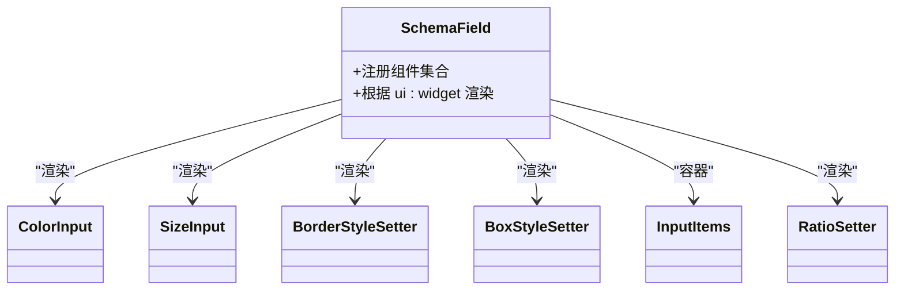

图表来源
- [packages/react-settings-form/src/SchemaField.tsx:58-107](file://packages/react-settings-form/src/SchemaField.tsx#L58-L107)
- [packages/react-settings-form/src/components/ColorInput/index.tsx:138-240](file://packages/react-settings-form/src/components/ColorInput/index.tsx#L138-L240)
- [packages/react-settings-form/src/components/SizeInput/index.tsx:1-55](file://packages/react-settings-form/src/components/SizeInput/index.tsx#L1-L55)
- [packages/react-settings-form/src/components/BorderStyleSetter/index.tsx:78-146](file://packages/react-settings-form/src/components/BorderStyleSetter/index.tsx#L78-L146)
- [packages/react-settings-form/src/components/BoxStyleSetter/index.tsx:29-115](file://packages/react-settings-form/src/components/BoxStyleSetter/index.tsx#L29-L115)
- [packages/react-settings-form/src/components/InputItems/index.tsx:31-72](file://packages/react-settings-form/src/components/InputItems/index.tsx#L31-L72)
- [packages/react-settings-form/src/components/RatioSetter/index.tsx:16-46](file://packages/react-settings-form/src/components/RatioSetter/index.tsx#L16-L46)

章节来源
- [packages/react-settings-form/src/SchemaField.tsx:58-107](file://packages/react-settings-form/src/SchemaField.tsx#L58-L107)

### FieldItem/FieldWrapper：字段包装与初始值处理
- 字段包装：将组件包裹为 FieldWrapper，注入样式与初始值回调。
- 初始值：从 schema.default 或 defaultValue 提取，首次渲染触发 onChange。
- 容器渲染：当 schema.type 为 void 或存在 children 时，渲染容器组件。

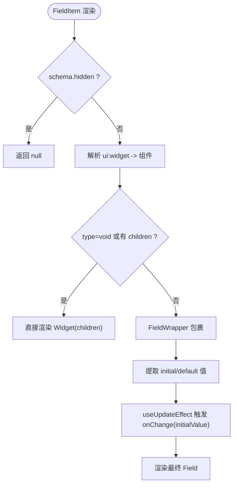

图表来源
- [common/render-core/FieldItem/index.tsx:7-61](file://common/render-core/FieldItem/index.tsx#L7-L61)
- [common/render-core/FieldItem/field.tsx:4-19](file://common/render-core/FieldItem/field.tsx#L4-L19)

章节来源
- [common/render-core/FieldItem/index.tsx:7-61](file://common/render-core/FieldItem/index.tsx#L7-L61)
- [common/render-core/FieldItem/field.tsx:4-19](file://common/render-core/FieldItem/field.tsx#L4-L19)

### ColorInput：颜色选择 Setter
- 功能要点：支持预设色板、最近使用记录、吸色器、格式化输出（如 rgba）。
- 数据流：onChangeComplete 合成最终颜色值并回写到表单。
- 本地存储：颜色历史持久化，提升易用性。

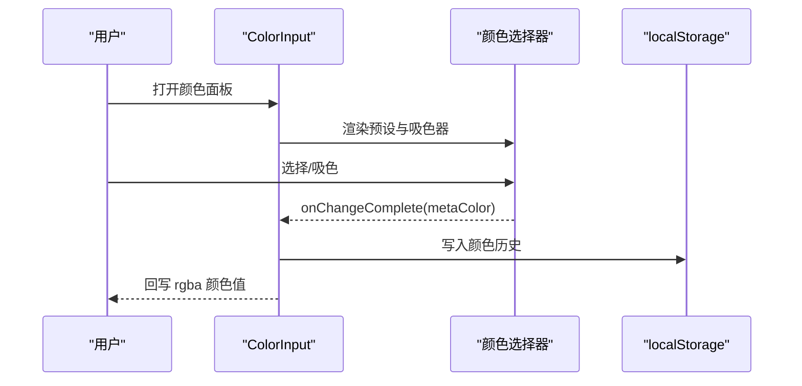

图表来源
- [packages/react-settings-form/src/components/ColorInput/index.tsx:156-161](file://packages/react-settings-form/src/components/ColorInput/index.tsx#L156-L161)
- [packages/react-settings-form/src/components/ColorInput/index.tsx:163-207](file://packages/react-settings-form/src/components/ColorInput/index.tsx#L163-L207)
- [packages/react-settings-form/src/components/ColorInput/index.tsx:74-97](file://packages/react-settings-form/src/components/ColorInput/index.tsx#L74-L97)

章节来源
- [packages/react-settings-form/src/components/ColorInput/index.tsx:138-240](file://packages/react-settings-form/src/components/ColorInput/index.tsx#L138-L240)

### SizeInput：尺寸输入 Setter
- 多单位支持：px/%/em/rem 等，以及特殊值（如 cover/contain）。
- 输入转换：toInputValue/toChangeValue 实现输入与变更值的双向转换。
- 复合输入：配合 PolyInput 实现多类型输入组合。

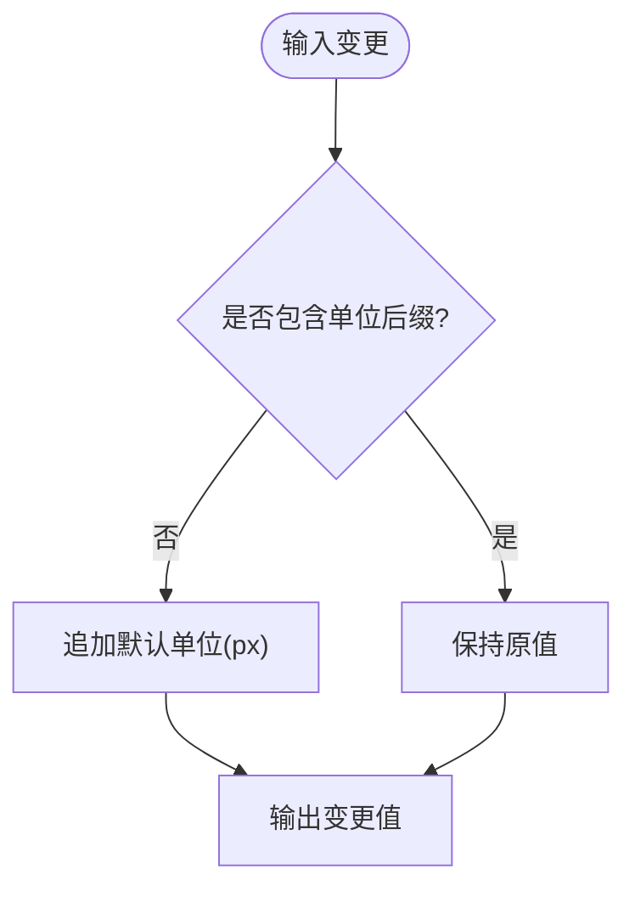

图表来源
- [packages/react-settings-form/src/components/SizeInput/index.tsx:18-33](file://packages/react-settings-form/src/components/SizeInput/index.tsx#L18-L33)
- [packages/react-settings-form/src/components/SizeInput/index.tsx:46-55](file://packages/react-settings-form/src/components/SizeInput/index.tsx#L46-L55)

章节来源
- [packages/react-settings-form/src/components/SizeInput/index.tsx:1-55](file://packages/react-settings-form/src/components/SizeInput/index.tsx#L1-L55)

### BorderStyleSetter：复合边框 Setter
- 复合逻辑：支持 top/right/bottom/left/center 五位置边框，联动显示/隐藏。
- 数据源：通过 dataSource 注入选项，结合 reactions 控制可见性。
- 子组件：内部使用 Select、SizeInput、ColorInput 组合。

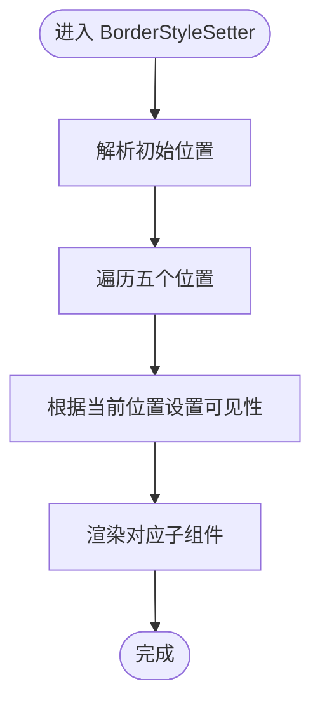

图表来源
- [packages/react-settings-form/src/components/BorderStyleSetter/index.tsx:56-72](file://packages/react-settings-form/src/components/BorderStyleSetter/index.tsx#L56-L72)
- [packages/react-settings-form/src/components/BorderStyleSetter/index.tsx:89-99](file://packages/react-settings-form/src/components/BorderStyleSetter/index.tsx#L89-L99)
- [packages/react-settings-form/src/components/BorderStyleSetter/index.tsx:114-139](file://packages/react-settings-form/src/components/BorderStyleSetter/index.tsx#L114-L139)

章节来源
- [packages/react-settings-form/src/components/BorderStyleSetter/index.tsx:78-146](file://packages/react-settings-form/src/components/BorderStyleSetter/index.tsx#L78-L146)

### BoxStyleSetter：盒模型 Setter
- 解析语法：支持四角简写（如 1 2 3 4）与统一值（all）。
- 事件合成：根据位置计算新的四角值并回写。
- 图标标签：顶部/右侧/底部/左侧图标提示。

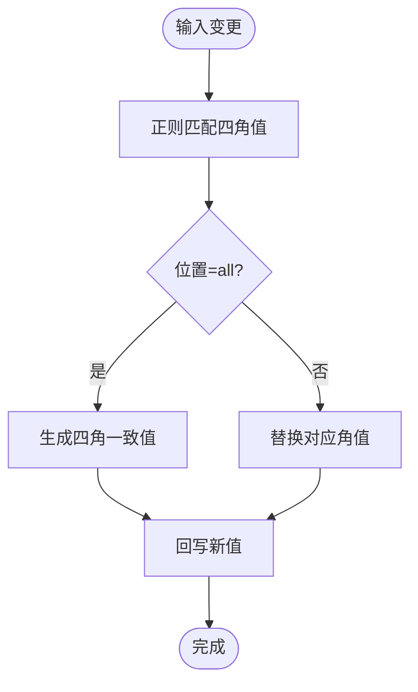

图表来源
- [packages/react-settings-form/src/components/BoxStyleSetter/index.tsx:36-64](file://packages/react-settings-form/src/components/BoxStyleSetter/index.tsx#L36-L64)

章节来源
- [packages/react-settings-form/src/components/BoxStyleSetter/index.tsx:29-115](file://packages/react-settings-form/src/components/BoxStyleSetter/index.tsx#L29-L115)

### InputItems：输入容器
- 容器设计：提供横向/纵向排列、图标标题、控制器区域。
- 上下文：通过 Context 传递 width/vertical 等通用属性。

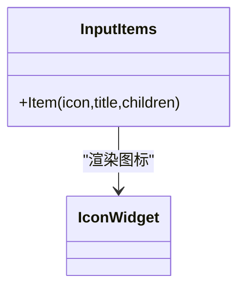

图表来源
- [packages/react-settings-form/src/components/InputItems/index.tsx:31-72](file://packages/react-settings-form/src/components/InputItems/index.tsx#L31-L72)

章节来源
- [packages/react-settings-form/src/components/InputItems/index.tsx:31-72](file://packages/react-settings-form/src/components/InputItems/index.tsx#L31-L72)

### RatioSetter：比例锁定 Setter
- 状态管理：受控开关，切换比例锁定状态。
- 节点联动：可结合节点 API 按原始宽高比同步调整高度。

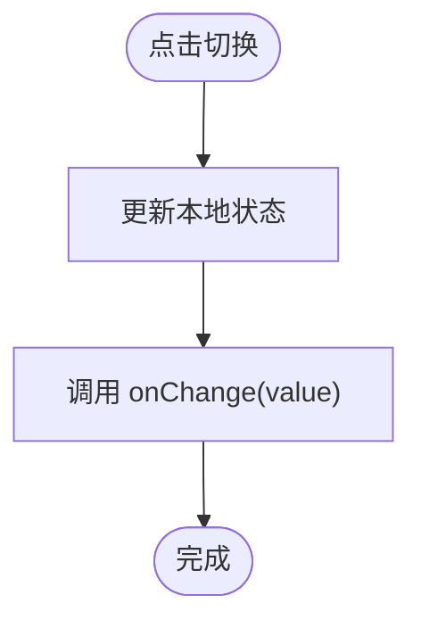

图表来源
- [packages/react-settings-form/src/components/RatioSetter/index.tsx:35-39](file://packages/react-settings-form/src/components/RatioSetter/index.tsx#L35-L39)

章节来源
- [packages/react-settings-form/src/components/RatioSetter/index.tsx:16-46](file://packages/react-settings-form/src/components/RatioSetter/index.tsx#L16-L46)

## 依赖关系分析
- SettingsForm 依赖表单引擎与节点模型，负责创建表单并注入 effects。
- SchemaField 依赖组件注册表，将 schema 映射到具体 Setter。
- FieldItem/FieldWrapper 依赖渲染核心层，负责字段包装与初始值处理。
- Setter 组件之间通过 InputItems、SizeInput、ColorInput 等共享能力复用。

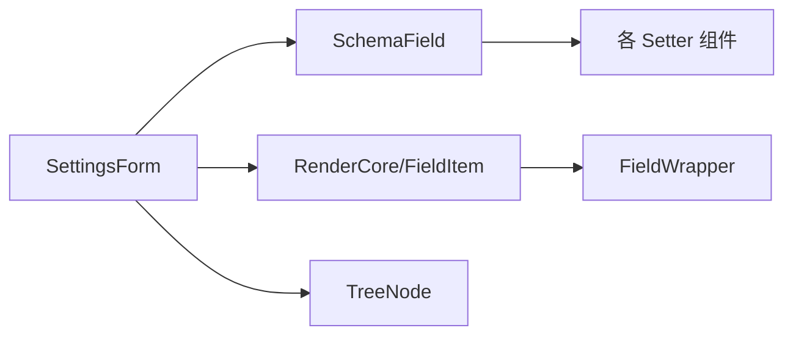

图表来源
- [packages/react-settings-form/src/SettingsForm.tsx:49-75](file://packages/react-settings-form/src/SettingsForm.tsx#L49-L75)
- [packages/react-settings-form/src/SchemaField.tsx:58-107](file://packages/react-settings-form/src/SchemaField.tsx#L58-L107)
- [common/render-core/index.tsx:28-59](file://common/render-core/index.tsx#L28-L59)
- [common/render-core/FieldItem/index.tsx:7-61](file://common/render-core/FieldItem/index.tsx#L7-L61)
- [packages/core/src/models/TreeNode.ts:344-390](file://packages/core/src/models/TreeNode.ts#L344-L390)

章节来源
- [packages/react-settings-form/src/SettingsForm.tsx:29-147](file://packages/react-settings-form/src/SettingsForm.tsx#L29-L147)
- [packages/react-settings-form/src/SchemaField.tsx:58-107](file://packages/react-settings-form/src/SchemaField.tsx#L58-L107)
- [common/render-core/index.tsx:28-59](file://common/render-core/index.tsx#L28-L59)

## 性能考量
- 渲染调度：SettingsForm 使用空闲调度器对更新进行节流，避免频繁重渲染。
- 响应式更新：通过表单引擎与节点模型的响应式机制，仅在必要时触发更新。
- 组件懒加载：Monaco 编辑器等重型组件可通过注册表按需加载 CDN 资源。

章节来源
- [packages/react-settings-form/src/SettingsForm.tsx:139-145](file://packages/react-settings-form/src/SettingsForm.tsx#L139-L145)
- [packages/react-settings-form/src/registry.ts:7-14](file://packages/react-settings-form/src/registry.ts#L7-L14)

## 故障排查指南
- Setter 不显示或报错
  - 检查 propsSchema 是否正确声明 ui:widget。
  - 确认 SchemaField 已注册该组件。
- 值未生效
  - 确认 onChange 回调已正确回写到表单引擎。
  - 检查节点属性是否被其他逻辑覆盖（如 reactions）。
- 性能问题
  - 使用空闲调度器减少频繁更新。
  - 避免在 Setter 内部做重型计算，必要时拆分为独立模块。

章节来源
- [packages/react-settings-form/src/SchemaField.tsx:58-107](file://packages/react-settings-form/src/SchemaField.tsx#L58-L107)
- [packages/react-settings-form/src/SettingsForm.tsx:139-145](file://packages/react-settings-form/src/SettingsForm.tsx#L139-L145)

## 结论
Setter 扩展以 Schema 驱动为核心，通过 SettingsForm 与 SchemaField 构建统一的属性面板，借助表单引擎与节点模型实现高效的数据绑定与状态管理。内置 Setter（颜色、尺寸、边框、盒模型等）提供了良好的复用范式；开发者可据此快速扩展自定义 Setter，满足复杂业务场景下的属性编辑需求。

## 附录：开发示例与最佳实践

### Setter 实现规范与接口定义
- 接口约定
  - 接收 value 与 onChange 回调，确保与表单引擎兼容。
  - 支持 placeholder、disabled、size 等通用属性透传。
- 数据流转
  - 输入变更时调用 onChange(value)，由表单引擎统一写入节点属性。
  - 对于复合 Setter，建议将内部状态收敛到受控组件，避免外部状态漂移。

章节来源
- [packages/react-settings-form/src/components/ColorInput/index.tsx:10-13](file://packages/react-settings-form/src/components/ColorInput/index.tsx#L10-L13)
- [packages/react-settings-form/src/components/SizeInput/index.tsx:10-16](file://packages/react-settings-form/src/components/SizeInput/index.tsx#L10-L16)
- [packages/react-settings-form/src/components/BorderStyleSetter/index.tsx:73-76](file://packages/react-settings-form/src/components/BorderStyleSetter/index.tsx#L73-L76)

### 常见 Setter 开发示例
- 文本输入 Setter
  - 基于 Input 或 TextArea，支持 maxLength、placeholder、onChange。
  - 适合简单字符串属性编辑。
- 选择器 Setter
  - 基于 Select/Radio/Checkbox，配合 dataSource 提供选项。
  - 适合枚举值或布尔值编辑。
- 颜色选择 Setter
  - 基于 ColorPicker，支持吸色器、预设色板、历史记录。
  - 输出统一格式（如 rgba），便于样式应用。

章节来源
- [packages/react-settings-form/src/components/ColorInput/index.tsx:138-240](file://packages/react-settings-form/src/components/ColorInput/index.tsx#L138-L240)
- [packages/react-settings-form/src/components/BorderStyleSetter/index.tsx:36-49](file://packages/react-settings-form/src/components/BorderStyleSetter/index.tsx#L36-L49)

### 复合 Setter 设计模式
- 分层渲染：将复杂 Setter 拆分为多个子组件（如边框的样式、宽度、颜色）。
- 条件显示：通过 reactions 控制子组件可见性，避免冗余输入。
- 事件合成：将多个子组件的输入合并为单一属性值，保证一致性。

章节来源
- [packages/react-settings-form/src/components/BorderStyleSetter/index.tsx:89-99](file://packages/react-settings-form/src/components/BorderStyleSetter/index.tsx#L89-L99)
- [packages/react-settings-form/src/components/BoxStyleSetter/index.tsx:36-64](file://packages/react-settings-form/src/components/BoxStyleSetter/index.tsx#L36-L64)

### 异步 Setter 的实现方式
- 数据拉取：在 effects 中发起请求，将结果注入到表单字段。
- 下拉选择：使用远程数据源（dataSource）动态加载选项。
- 错误处理：捕获异常并提示用户，避免阻塞主流程。

章节来源
- [packages/react-settings-form/src/SettingsForm.tsx:68-72](file://packages/react-settings-form/src/SettingsForm.tsx#L68-L72)

### 最佳实践
- 组件复用：通过 InputItems、PolyInput 等通用容器与工具函数降低重复代码。
- 状态管理：优先使用表单引擎与节点模型的状态，避免在组件内维护复杂本地状态。
- 事件处理：统一在 onChange 中处理数据转换与写入，确保一致性。
- 错误处理：对非法输入进行校验与降级，保障属性面板稳定运行。

章节来源
- [packages/react-settings-form/src/components/InputItems/index.tsx:31-72](file://packages/react-settings-form/src/components/InputItems/index.tsx#L31-L72)
- [packages/react-settings-form/src/components/SizeInput/index.tsx:18-33](file://packages/react-settings-form/src/components/SizeInput/index.tsx#L18-L33)