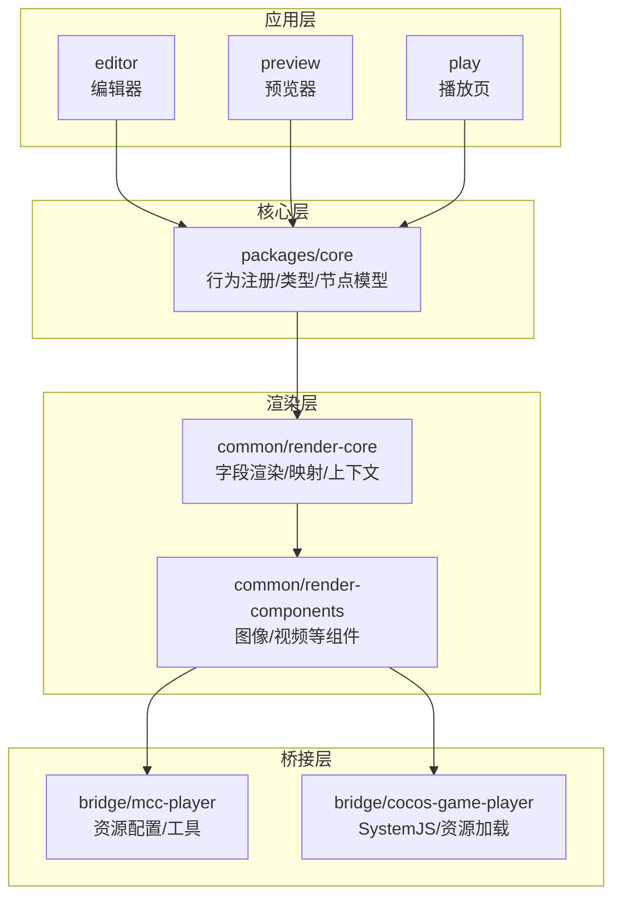
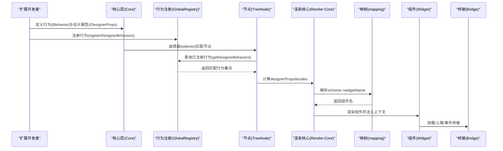
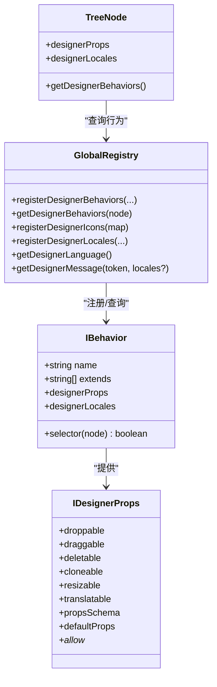
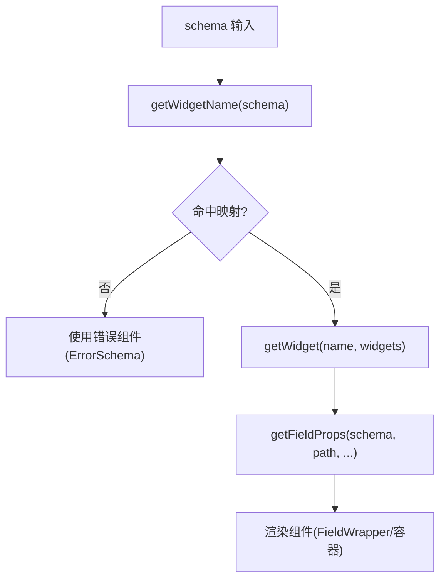
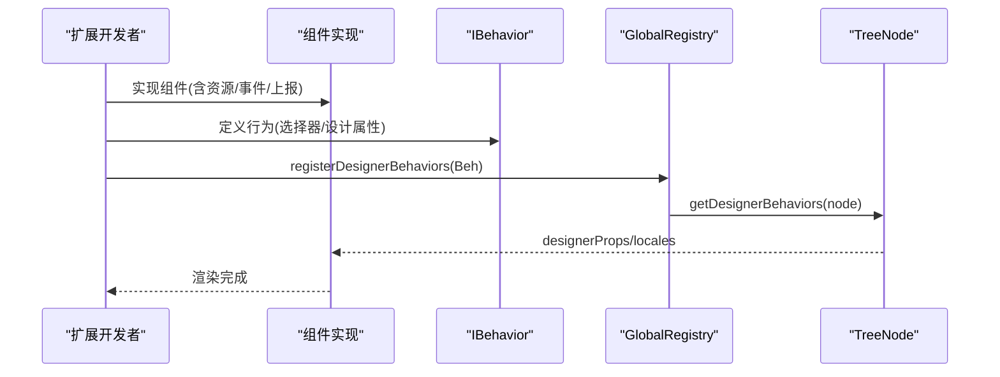
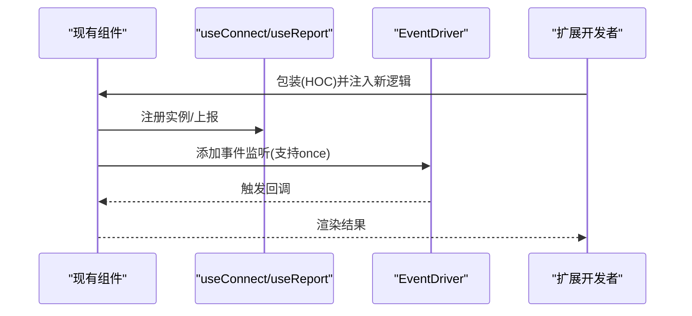
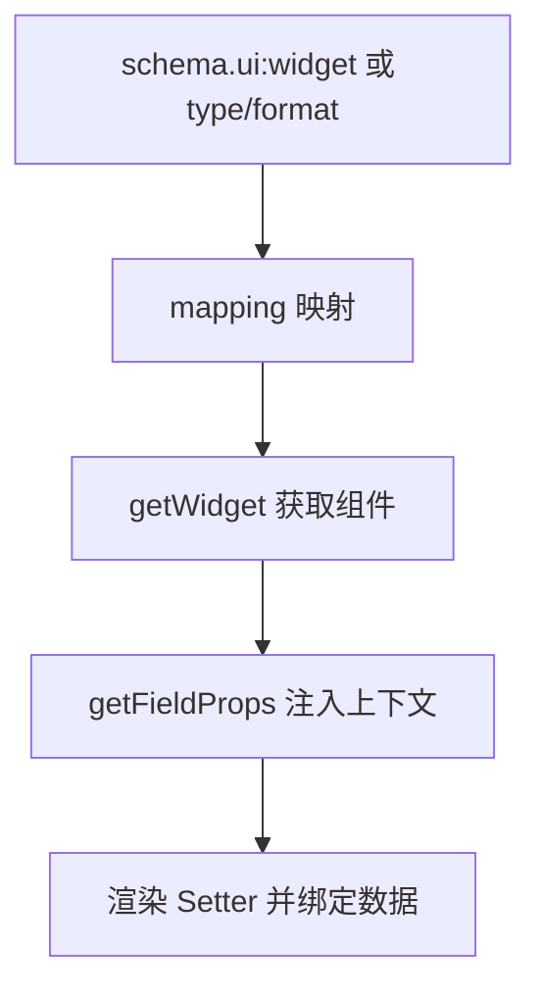
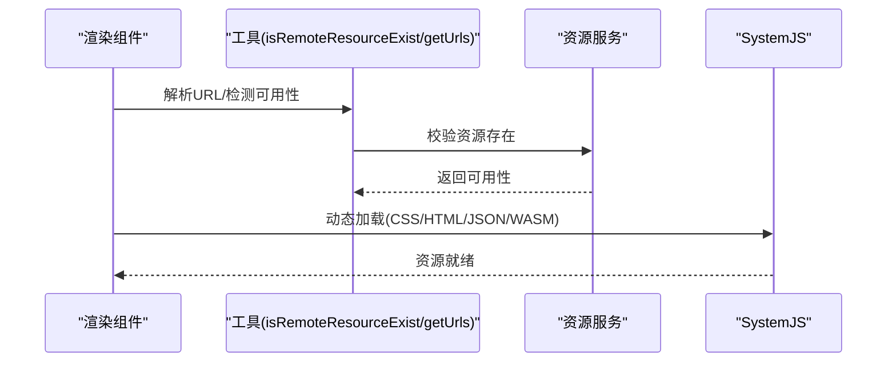
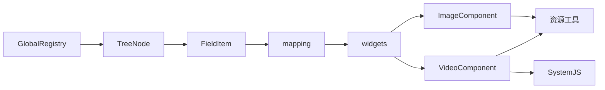

# 扩展开发

<cite>
**本文引用的文件**   
- [packages/core/src/registry.ts](file://packages/core/src/registry.ts)
- [packages/core/src/types.ts](file://packages/core/src/types.ts)
- [packages/core/src/models/TreeNode.ts](file://packages/core/src/models/TreeNode.ts)
- [common/render-core/FieldItem/index.tsx](file://common/render-core/FieldItem/index.tsx)
- [common/render-core/models/mapping.ts](file://common/render-core/models/mapping.ts)
- [common/render-core/widgets/index.tsx](file://common/render-core/widgets/index.tsx)
- [common/render-components/src/image/index.tsx](file://common/render-components/src/image/index.tsx)
- [common/render-components/src/video/index.tsx](file://common/render-components/src/video/index.tsx)
- [packages/shared/src/event.ts](file://packages/shared/src/event.ts)
- [bridge/mcc-player/src/config.json](file://bridge/mcc-player/src/config.json)
- [bridge/mcc-player/src/utils/index.ts](file://bridge/mcc-player/src/utils/index.ts)
- [bridge/cocos-game-player/src/system.bundle.js](file://bridge/cocos-game-player/src/system.bundle.js)
</cite>

## 目录
1. [简介](#简介)
2. [项目结构](#项目结构)
3. [核心组件](#核心组件)
4. [架构总览](#架构总览)
5. [详细组件分析](#详细组件分析)
6. [依赖分析](#依赖分析)
7. [性能考量](#性能考量)
8. [故障排查指南](#故障排查指南)
9. [结论](#结论)
10. [附录](#附录)

## 简介
本文件面向“Slides Engine”扩展开发者，系统讲解扩展开发的架构与实践，涵盖以下主题：
- 行为注册机制与行为扩展点
- 组件扩展点与渲染管线
- 插件系统与资源注册
- 如何开发新的组件类型（类定义、行为注册、属性配置）
- 如何扩展现有组件（继承、方法重写、事件处理）
- 如何开发自定义 Setter 组件（实现规范、数据绑定、校验）
- 如何集成第三方资源（外部 API、资源格式适配、数据转换）
- 最佳实践（代码组织、测试策略、性能优化、兼容性）

## 项目结构
Slides Engine 采用多包工作区与分层架构：
- 核心层（packages/core）：提供行为注册、节点模型、类型定义等基础能力
- 渲染层（common/render-core、common/render-components）：负责表单渲染、组件渲染与资源桥接
- 桥接层（bridge/*）：对接第三方运行时与资源系统
- 编辑器与预览（editor、preview、play）：提供可视化编辑与播放环境

图表来源
- [packages/core/src/registry.ts:75-186](file://packages/core/src/registry.ts#L75-L186)
- [packages/core/src/types.ts:144-150](file://packages/core/src/types.ts#L144-L150)
- [common/render-core/FieldItem/index.tsx:1-61](file://common/render-core/FieldItem/index.tsx#L1-L61)
- [common/render-core/models/mapping.ts:1-92](file://common/render-core/models/mapping.ts#L1-L92)
- [common/render-components/src/image/index.tsx:1-186](file://common/render-components/src/image/index.tsx#L1-L186)
- [common/render-components/src/video/index.tsx:1-472](file://common/render-components/src/video/index.tsx#L1-L472)
- [bridge/mcc-player/src/config.json:137-178](file://bridge/mcc-player/src/config.json#L137-L178)
- [bridge/cocos-game-player/src/system.bundle.js:979-989](file://bridge/cocos-game-player/src/system.bundle.js#L979-L989)

章节来源
- [packages/core/src/registry.ts:1-191](file://packages/core/src/registry.ts#L1-L191)
- [packages/core/src/types.ts:1-189](file://packages/core/src/types.ts#L1-L189)
- [common/render-core/FieldItem/index.tsx:1-61](file://common/render-core/FieldItem/index.tsx#L1-L61)
- [common/render-core/models/mapping.ts:1-92](file://common/render-core/models/mapping.ts#L1-L92)
- [common/render-components/src/image/index.tsx:1-186](file://common/render-components/src/image/index.tsx#L1-L186)
- [common/render-components/src/video/index.tsx:1-472](file://common/render-components/src/video/index.tsx#L1-L472)
- [bridge/mcc-player/src/config.json:137-178](file://bridge/mcc-player/src/config.json#L137-L178)
- [bridge/cocos-game-player/src/system.bundle.js:979-989](file://bridge/cocos-game-player/src/system.bundle.js#L979-L989)

## 核心组件
- 行为注册中心（GlobalRegistry）：集中管理设计器行为、图标、本地化与语言；支持按节点选择器匹配行为并合并设计属性
- 节点模型（TreeNode）：承载组件树结构、属性、行为解析与国际化
- 渲染映射（mapping/getWidgetName/getWidget）：基于 schema 的 type/format/readOnly 决定渲染组件
- 字段渲染（FieldItem）：根据映射结果渲染具体组件，注入上下文与事件存储
- 组件实现（Image/Video）：内置组件示例，展示资源加载、埋点上报、事件桥接与跨页控制
- 事件驱动（EventDriver）：封装事件监听与一次性监听去重，避免重复绑定
- 资源桥接（MCC Player 配置/工具）：提供资源清单、远程资源检测与下载策略

章节来源
- [packages/core/src/registry.ts:75-186](file://packages/core/src/registry.ts#L75-L186)
- [packages/core/src/models/TreeNode.ts:105-192](file://packages/core/src/models/TreeNode.ts#L105-L192)
- [common/render-core/models/mapping.ts:42-91](file://common/render-core/models/mapping.ts#L42-L91)
- [common/render-core/FieldItem/index.tsx:7-61](file://common/render-core/FieldItem/index.tsx#L7-L61)
- [common/render-components/src/image/index.tsx:17-186](file://common/render-components/src/image/index.tsx#L17-L186)
- [common/render-components/src/video/index.tsx:16-472](file://common/render-components/src/video/index.tsx#L16-L472)
- [packages/shared/src/event.ts:141-230](file://packages/shared/src/event.ts#L141-L230)
- [bridge/mcc-player/src/config.json:137-178](file://bridge/mcc-player/src/config.json#L137-L178)

## 架构总览
扩展开发围绕“行为注册 + 渲染映射 + 组件实现 + 资源桥接”的闭环展开。

图表来源
- [packages/core/src/registry.ts:109-113](file://packages/core/src/registry.ts#L109-L113)
- [packages/core/src/models/TreeNode.ts:171-192](file://packages/core/src/models/TreeNode.ts#L171-L192)
- [common/render-core/models/mapping.ts:42-72](file://common/render-core/models/mapping.ts#L42-L72)
- [common/render-core/FieldItem/index.tsx:7-61](file://common/render-core/FieldItem/index.tsx#L7-L61)
- [common/render-components/src/image/index.tsx:40-151](file://common/render-components/src/image/index.tsx#L40-L151)
- [common/render-components/src/video/index.tsx:341-375](file://common/render-components/src/video/index.tsx#L341-L375)

## 详细组件分析

### 行为注册机制与扩展点
- 行为定义：包含名称、选择器、扩展依赖、设计属性与本地化
- 注册流程：支持批量注册与依赖排序，确保父行为先于子行为
- 查询流程：按节点选择器过滤行为，合并设计属性与本地化
- 使用场景：为不同节点类型提供拖拽、删除、克隆、尺寸调整、属性 schema 等能力

图表来源
- [packages/core/src/types.ts:144-150](file://packages/core/src/types.ts#L144-L150)
- [packages/core/src/types.ts:74-99](file://packages/core/src/types.ts#L74-L99)
- [packages/core/src/registry.ts:75-186](file://packages/core/src/registry.ts#L75-L186)
- [packages/core/src/models/TreeNode.ts:171-192](file://packages/core/src/models/TreeNode.ts#L171-L192)

章节来源
- [packages/core/src/registry.ts:34-186](file://packages/core/src/registry.ts#L34-L186)
- [packages/core/src/types.ts:144-150](file://packages/core/src/types.ts#L144-L150)
- [packages/core/src/models/TreeNode.ts:171-192](file://packages/core/src/models/TreeNode.ts#L171-L192)

### 组件扩展点与渲染管线
- 字段渲染入口：FieldItem 根据 schema 解析 widget 名称，找不到则回退到错误组件
- 组件映射：mapping 支持 type/format/readOnly 组合键，优先级明确
- 组件包装：内置组件通过 withErrorBoundary 提供容错渲染
- 上下文注入：useConnect/useReport/useEventStore 等钩子贯穿组件生命周期

图表来源
- [common/render-core/FieldItem/index.tsx:7-61](file://common/render-core/FieldItem/index.tsx#L7-L61)
- [common/render-core/models/mapping.ts:42-91](file://common/render-core/models/mapping.ts#L42-L91)
- [common/render-core/widgets/index.tsx:115-129](file://common/render-core/widgets/index.tsx#L115-L129)

章节来源
- [common/render-core/FieldItem/index.tsx:1-61](file://common/render-core/FieldItem/index.tsx#L1-L61)
- [common/render-core/models/mapping.ts:1-92](file://common/render-core/models/mapping.ts#L1-L92)
- [common/render-core/widgets/index.tsx:111-129](file://common/render-core/widgets/index.tsx#L111-L129)

### 开发新的组件类型
- 组件类定义：参考 Image/Video 组件，使用 useConnect/useReport/useEventStore 等钩子
- 行为注册：通过 IBehavior 定义选择器与设计属性，注册到 GlobalRegistry
- 属性配置：在 IDesignerProps 中声明 propsSchema/defaultProps/allow* 等
- 渲染映射：如需自定义 Setter，可在 mapping 中添加 type/format 键或直接在 schema 指定 ui:widget

图表来源
- [common/render-components/src/image/index.tsx:17-186](file://common/render-components/src/image/index.tsx#L17-L186)
- [common/render-components/src/video/index.tsx:16-472](file://common/render-components/src/video/index.tsx#L16-L472)
- [packages/core/src/types.ts:144-150](file://packages/core/src/types.ts#L144-L150)
- [packages/core/src/registry.ts:177-185](file://packages/core/src/registry.ts#L177-L185)
- [packages/core/src/models/TreeNode.ts:171-192](file://packages/core/src/models/TreeNode.ts#L171-L192)

章节来源
- [common/render-components/src/image/index.tsx:1-186](file://common/render-components/src/image/index.tsx#L1-L186)
- [common/render-components/src/video/index.tsx:1-472](file://common/render-components/src/video/index.tsx#L1-L472)
- [packages/core/src/types.ts:74-99](file://packages/core/src/types.ts#L74-L99)
- [packages/core/src/registry.ts:177-185](file://packages/core/src/registry.ts#L177-L185)
- [packages/core/src/models/TreeNode.ts:171-192](file://packages/core/src/models/TreeNode.ts#L171-L192)

### 扩展现有组件功能
- 继承与方法重写：在现有组件基础上封装高阶组件，保留原能力并新增事件/上报/桥接
- 事件处理：使用 EventDriver 的 addEventListener/removeEventListener，支持一次性监听与作用域去重
- 生命周期：在 useEffect 中注册/卸载资源与事件，确保组件卸载时清理

图表来源
- [packages/shared/src/event.ts:141-230](file://packages/shared/src/event.ts#L141-L230)
- [common/render-components/src/image/index.tsx:34-67](file://common/render-components/src/image/index.tsx#L34-L67)
- [common/render-components/src/video/index.tsx:341-375](file://common/render-components/src/video/index.tsx#L341-L375)

章节来源
- [packages/shared/src/event.ts:141-230](file://packages/shared/src/event.ts#L141-L230)
- [common/render-components/src/image/index.tsx:34-151](file://common/render-components/src/image/index.tsx#L34-L151)
- [common/render-components/src/video/index.tsx:341-375](file://common/render-components/src/video/index.tsx#L341-L375)

### 自定义 Setter 组件开发
- 实现规范：遵循 mapping 的 type/format/readOnly 映射规则；必要时在 schema 中显式指定 ui:widget
- 数据绑定：通过 FieldItem 的 getFieldProps 注入 path/globalProps/globalConfig
- 校验规则：在 propsSchema 中定义 JSON Schema；结合默认值与只读态控制渲染
- 容错渲染：使用内置 withErrorBoundary 包裹，捕获并提示错误

图表来源
- [common/render-core/models/mapping.ts:42-91](file://common/render-core/models/mapping.ts#L42-L91)
- [common/render-core/FieldItem/index.tsx:23-38](file://common/render-core/FieldItem/index.tsx#L23-L38)
- [common/render-core/widgets/index.tsx:115-129](file://common/render-core/widgets/index.tsx#L115-L129)

章节来源
- [common/render-core/models/mapping.ts:1-92](file://common/render-core/models/mapping.ts#L1-L92)
- [common/render-core/FieldItem/index.tsx:1-61](file://common/render-core/FieldItem/index.tsx#L1-L61)
- [common/render-core/widgets/index.tsx:111-129](file://common/render-core/widgets/index.tsx#L111-L129)

### 集成第三方资源
- 外部 API 接入：通过 MCC Player 的配置文件与工具函数，拉取资源清单并校验远程资源是否存在
- 资源格式适配：根据组件类型（图片/视频）选择对应加载策略与占位图
- 数据转换：统一通过 getUrls/isRemoteResourceExist 等工具函数进行 URL 解析与可用性检测
- 运行时加载：Cocos 运行时通过 SystemJS 对特定类型（CSS/HTML/JSON/WASM）进行识别与加载

图表来源
- [common/render-components/src/video/index.tsx:414-436](file://common/render-components/src/video/index.tsx#L414-L436)
- [bridge/mcc-player/src/config.json:137-178](file://bridge/mcc-player/src/config.json#L137-L178)
- [bridge/mcc-player/src/utils/index.ts:1-4](file://bridge/mcc-player/src/utils/index.ts#L1-L4)
- [bridge/cocos-game-player/src/system.bundle.js:979-989](file://bridge/cocos-game-player/src/system.bundle.js#L979-L989)

章节来源
- [common/render-components/src/video/index.tsx:414-455](file://common/render-components/src/video/index.tsx#L414-L455)
- [bridge/mcc-player/src/config.json:137-178](file://bridge/mcc-player/src/config.json#L137-L178)
- [bridge/mcc-player/src/utils/index.ts:1-4](file://bridge/mcc-player/src/utils/index.ts#L1-L4)
- [bridge/cocos-game-player/src/system.bundle.js:979-989](file://bridge/cocos-game-player/src/system.bundle.js#L979-L989)

## 依赖分析
- 核心依赖：GlobalRegistry 依赖 TreeNode 的选择器匹配；TreeNode 依赖 GlobalRegistry 合并设计属性
- 渲染依赖：FieldItem 依赖 mapping 与 widgets；widgets 依赖 withErrorBoundary
- 组件依赖：Image/Video 依赖 useConnect/useReport/useEventStore；事件依赖 EventDriver
- 资源依赖：组件依赖工具函数进行 URL 解析与远程资源检测；SystemJS 识别特定类型资源

图表来源
- [packages/core/src/registry.ts:109-113](file://packages/core/src/registry.ts#L109-L113)
- [packages/core/src/models/TreeNode.ts:171-192](file://packages/core/src/models/TreeNode.ts#L171-L192)
- [common/render-core/FieldItem/index.tsx:7-61](file://common/render-core/FieldItem/index.tsx#L7-L61)
- [common/render-core/models/mapping.ts:42-91](file://common/render-core/models/mapping.ts#L42-L91)
- [common/render-core/widgets/index.tsx:115-129](file://common/render-core/widgets/index.tsx#L115-L129)
- [common/render-components/src/image/index.tsx:69-151](file://common/render-components/src/image/index.tsx#L69-L151)
- [common/render-components/src/video/index.tsx:414-455](file://common/render-components/src/video/index.tsx#L414-L455)
- [bridge/cocos-game-player/src/system.bundle.js:979-989](file://bridge/cocos-game-player/src/system.bundle.js#L979-L989)

章节来源
- [packages/core/src/registry.ts:75-186](file://packages/core/src/registry.ts#L75-L186)
- [packages/core/src/models/TreeNode.ts:171-192](file://packages/core/src/models/TreeNode.ts#L171-L192)
- [common/render-core/FieldItem/index.tsx:1-61](file://common/render-core/FieldItem/index.tsx#L1-L61)
- [common/render-core/models/mapping.ts:1-92](file://common/render-core/models/mapping.ts#L1-L92)
- [common/render-core/widgets/index.tsx:111-129](file://common/render-core/widgets/index.tsx#L111-L129)
- [common/render-components/src/image/index.tsx:1-186](file://common/render-components/src/image/index.tsx#L1-L186)
- [common/render-components/src/video/index.tsx:1-472](file://common/render-components/src/video/index.tsx#L1-L472)
- [bridge/cocos-game-player/src/system.bundle.js:979-989](file://bridge/cocos-game-player/src/system.bundle.js#L979-L989)

## 性能考量
- 渲染性能
  - 使用 memo 与浅观察（observable.shallow）减少重渲染
  - 事件监听去重：EventDriver 支持一次性监听与同类型去重，避免重复绑定
  - 资源加载节流：视频组件对时间更新事件进行节流同步
- 资源加载
  - 远程资源存在性检测与重试策略，降低加载失败率
  - 占位图与封面图切换，提升首屏体验
- 运行时加载
  - SystemJS 对 CSS/HTML/JSON/WASM 的识别与加载，减少不必要的网络请求

章节来源
- [packages/shared/src/event.ts:141-230](file://packages/shared/src/event.ts#L141-L230)
- [common/render-components/src/video/index.tsx:152-167](file://common/render-components/src/video/index.tsx#L152-L167)
- [bridge/cocos-game-player/src/system.bundle.js:979-989](file://bridge/cocos-game-player/src/system.bundle.js#L979-L989)

## 故障排查指南
- 组件未渲染或显示错误组件
  - 检查 schema 的 ui:widget/type/format/readOnly 是否正确
  - 确认 mapping 中是否存在对应键
- 资源加载失败
  - 使用 isRemoteResourceExist 校验 URL 可用性
  - 查看资源上报状态与埋点日志
- 事件未触发或重复绑定
  - 使用 EventDriver 的 once 模式与作用域去重
  - 确保在组件卸载时移除事件监听
- 行为未生效
  - 确认 IBehavior 的 selector 能匹配目标节点
  - 检查 GlobalRegistry 的注册顺序与依赖链

章节来源
- [common/render-core/models/mapping.ts:42-72](file://common/render-core/models/mapping.ts#L42-L72)
- [common/render-components/src/video/index.tsx:387-409](file://common/render-components/src/video/index.tsx#L387-L409)
- [packages/shared/src/event.ts:141-230](file://packages/shared/src/event.ts#L141-L230)
- [packages/core/src/registry.ts:177-185](file://packages/core/src/registry.ts#L177-L185)

## 结论
Slides Engine 的扩展开发以行为注册为核心，配合渲染映射与组件实现，形成可扩展、可维护的体系。通过统一的资源桥接与事件驱动机制，开发者可以快速实现新组件、Setter 与第三方资源集成，并在性能与稳定性上获得保障。

## 附录
- 最佳实践清单
  - 代码组织：按功能域拆分包，保持核心与渲染层解耦
  - 测试策略：为行为选择器与渲染映射编写单元测试；为组件事件与资源加载编写集成测试
  - 性能优化：合理使用 memo 与观察者；对高频事件进行节流/去抖；按需加载资源
  - 兼容性：遵循 SystemJS 与浏览器特性；对旧版浏览器提供降级方案