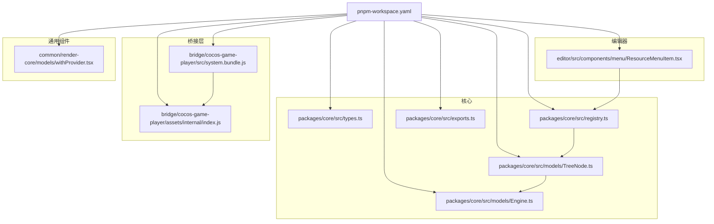
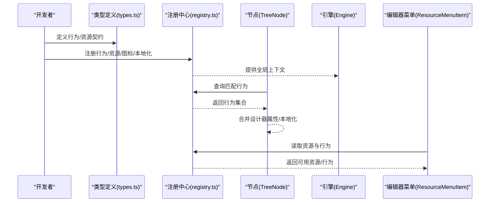
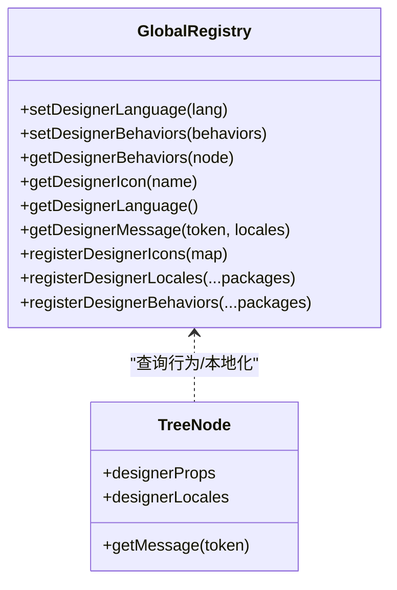
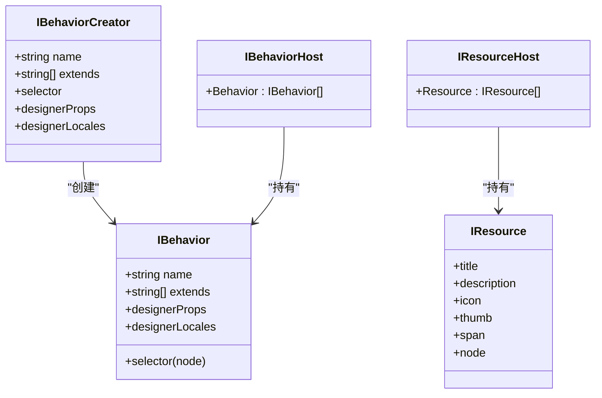
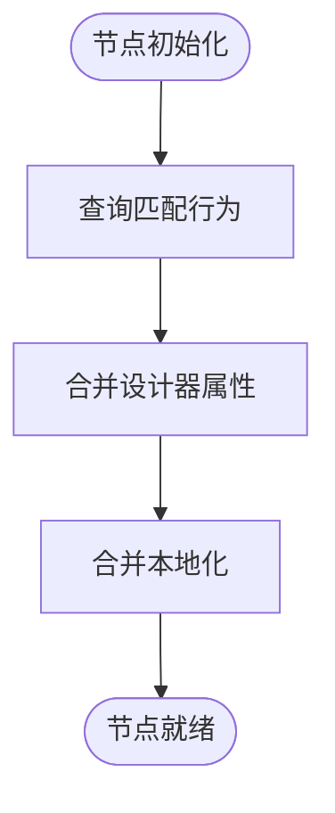
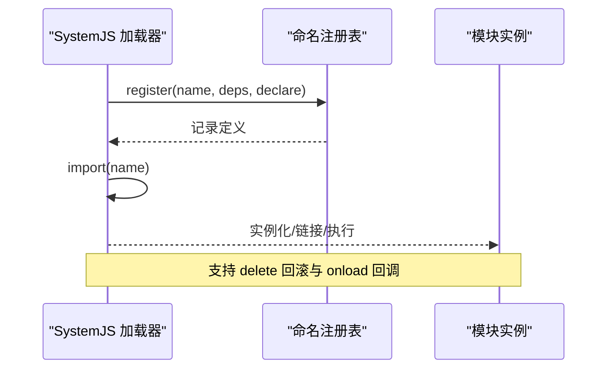
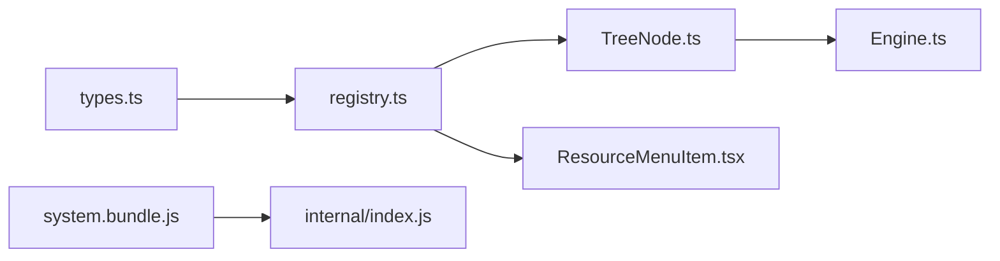

# 插件系统

<cite>
**本文引用的文件**
- [packages/core/src/registry.ts](file://packages/core/src/registry.ts)
- [packages/core/src/types.ts](file://packages/core/src/types.ts)
- [packages/core/src/models/TreeNode.ts](file://packages/core/src/models/TreeNode.ts)
- [packages/core/src/models/Engine.ts](file://packages/core/src/models/Engine.ts)
- [packages/core/src/exports.ts](file://packages/core/src/exports.ts)
- [bridge/cocos-game-player/src/system.bundle.js](file://bridge/cocos-game-player/src/system.bundle.js)
- [bridge/cocos-game-player/assets/internal/index.js](file://bridge/cocos-game-player/assets/internal/index.js)
- [common/render-core/models/withProvider.tsx](file://common/render-core/models/withProvider.tsx)
- [pnpm-workspace.yaml](file://pnpm-workspace.yaml)
- [editor/src/components/menu/ResourceMenuItem.tsx](file://editor/src/components/menu/ResourceMenuItem.tsx)
</cite>

## 目录
1. [引言](#引言)
2. [项目结构](#项目结构)
3. [核心组件](#核心组件)
4. [架构总览](#架构总览)
5. [详细组件分析](#详细组件分析)
6. [依赖分析](#依赖分析)
7. [性能考虑](#性能考虑)
8. [故障排查指南](#故障排查指南)
9. [结论](#结论)
10. [附录](#附录)

## 引言
本文件面向 Slides Engine 的插件系统，系统性阐述其设计原理、加载机制、生命周期管理与依赖注入思路，并给出插件开发（行为插件、资源插件、工具插件）的实践方法与最佳实践（隔离、版本管理、热更新、调试与性能优化）。内容基于仓库中的核心类型、注册中心、节点模型与引擎模型进行归纳总结，辅以实际文件路径标注，帮助读者快速理解并落地插件化扩展。

## 项目结构
Slides Engine 采用多包工作区组织，核心插件能力集中在 packages/core 中；编辑器侧通过行为与资源扩展参与插件生态；桥接层提供模块加载与热更新支持；通用渲染组件与上下文提供器为插件提供运行时环境。

**图表来源**
- [pnpm-workspace.yaml:1-7](file://pnpm-workspace.yaml#L1-L7)
- [packages/core/src/registry.ts:1-191](file://packages/core/src/registry.ts#L1-L191)
- [packages/core/src/types.ts:1-189](file://packages/core/src/types.ts#L1-L189)
- [packages/core/src/models/TreeNode.ts:1-910](file://packages/core/src/models/TreeNode.ts#L1-L910)
- [packages/core/src/models/Engine.ts:1-111](file://packages/core/src/models/Engine.ts#L1-L111)
- [packages/core/src/exports.ts:1-5](file://packages/core/src/exports.ts#L1-L5)
- [editor/src/components/menu/ResourceMenuItem.tsx:1-31](file://editor/src/components/menu/ResourceMenuItem.tsx#L1-L31)
- [bridge/cocos-game-player/src/system.bundle.js:244-1084](file://bridge/cocos-game-player/src/system.bundle.js#L244-L1084)
- [bridge/cocos-game-player/assets/internal/index.js:1-24](file://bridge/cocos-game-player/assets/internal/index.js#L1-L24)
- [common/render-core/models/withProvider.tsx:1-31](file://common/render-core/models/withProvider.tsx#L1-L31)

**章节来源**
- [pnpm-workspace.yaml:1-7](file://pnpm-workspace.yaml#L1-L7)

## 核心组件
- 注册中心与全局注册器：负责行为、图标、本地化、语言等的集中注册与查询，是插件生态的“元数据中枢”。
- 行为与资源类型：定义行为插件与资源插件的契约，包括选择器、属性、国际化、资源项等。
- 节点模型：在节点上动态聚合行为与本地化，形成“行为即插件”的运行时表现。
- 引擎模型：承载工作空间、视口、光标、键盘等，为插件提供运行时上下文。
- 模块系统与热更新：桥接层提供 SystemJS 扩展与命名注册表，支持模块加载与删除回滚，便于热更新。

**章节来源**
- [packages/core/src/registry.ts:75-190](file://packages/core/src/registry.ts#L75-L190)
- [packages/core/src/types.ts:144-188](file://packages/core/src/types.ts#L144-L188)
- [packages/core/src/models/TreeNode.ts:171-192](file://packages/core/src/models/TreeNode.ts#L171-L192)
- [packages/core/src/models/Engine.ts:13-42](file://packages/core/src/models/Engine.ts#L13-L42)
- [bridge/cocos-game-player/src/system.bundle.js:244-1084](file://bridge/cocos-game-player/src/system.bundle.js#L244-L1084)

## 架构总览
插件系统围绕“行为即插件”的理念构建：插件以行为或资源的形式注册到全局注册器，节点在运行时根据选择器匹配行为，动态组合出节点的设计器属性与本地化文案。桥接层提供模块加载与热更新能力，编辑器菜单与资源面板消费注册器中的资源与行为，形成完整的插件生态闭环。

**图表来源**
- [packages/core/src/types.ts:144-188](file://packages/core/src/types.ts#L144-L188)
- [packages/core/src/registry.ts:75-190](file://packages/core/src/registry.ts#L75-L190)
- [packages/core/src/models/TreeNode.ts:171-192](file://packages/core/src/models/TreeNode.ts#L171-L192)
- [packages/core/src/models/Engine.ts:13-42](file://packages/core/src/models/Engine.ts#L13-L42)
- [editor/src/components/menu/ResourceMenuItem.tsx:1-31](file://editor/src/components/menu/ResourceMenuItem.tsx#L1-L31)

## 详细组件分析

### 组件一：注册中心与全局注册器
- 职责
  - 管理设计器语言、行为、图标、本地化等全局状态。
  - 提供行为排序与去重逻辑，确保继承链正确。
  - 提供按节点选择器匹配行为的能力。
- 关键点
  - 行为注册会进行依赖解析与顺序重排，避免循环依赖。
  - 本地化合并策略支持多来源覆盖与回退。
  - 图标与语言存储为可观察状态，便于响应式更新。

**图表来源**
- [packages/core/src/registry.ts:75-190](file://packages/core/src/registry.ts#L75-L190)
- [packages/core/src/models/TreeNode.ts:171-192](file://packages/core/src/models/TreeNode.ts#L171-L192)

**章节来源**
- [packages/core/src/registry.ts:1-191](file://packages/core/src/registry.ts#L1-L191)

### 组件二：行为与资源类型系统
- 行为类型
  - 名称、选择器、继承关系、设计器属性、本地化等。
  - 支持函数式或静态的设计器属性映射。
- 资源类型
  - 资源项与资源宿主，支持标题、描述、图标、缩略图、跨度、节点等。
  - 元素级资源可通过宿主批量注册。

**图表来源**
- [packages/core/src/types.ts:144-188](file://packages/core/src/types.ts#L144-L188)

**章节来源**
- [packages/core/src/types.ts:144-188](file://packages/core/src/types.ts#L144-L188)

### 组件三：节点模型与行为聚合
- 节点在运行时根据全局注册器的行为选择器匹配行为，合并得到设计器属性与本地化。
- 节点还提供拖拽、克隆、删除、布局允许性等能力，这些能力受设计器属性影响。
- 节点提供查找、遍历、序列化等基础能力，支撑插件对节点的操作。

**图表来源**
- [packages/core/src/models/TreeNode.ts:171-192](file://packages/core/src/models/TreeNode.ts#L171-L192)

**章节来源**
- [packages/core/src/models/TreeNode.ts:105-910](file://packages/core/src/models/TreeNode.ts#L105-L910)

### 组件四：引擎模型与上下文
- 引擎负责初始化工作台、屏幕、光标、键盘等子系统，提供当前树、选中节点、移动节点等能力。
- 引擎提供挂载与卸载事件，便于插件在生命周期中接入。

**章节来源**
- [packages/core/src/models/Engine.ts:13-111](file://packages/core/src/models/Engine.ts#L13-L111)

### 组件五：模块系统与热更新（桥接层）
- SystemJS 扩展支持命名 register 与注册表，便于按名称导入模块。
- 提供模块删除与回滚能力，支持热更新场景下的模块替换与恢复。
- 内部虚拟模块与前置导入机制保证模块加载顺序与依赖解析。

**图表来源**
- [bridge/cocos-game-player/src/system.bundle.js:244-1084](file://bridge/cocos-game-player/src/system.bundle.js#L244-L1084)
- [bridge/cocos-game-player/assets/internal/index.js:1-24](file://bridge/cocos-game-player/assets/internal/index.js#L1-L24)

**章节来源**
- [bridge/cocos-game-player/src/system.bundle.js:244-1084](file://bridge/cocos-game-player/src/system.bundle.js#L244-L1084)
- [bridge/cocos-game-player/assets/internal/index.js:1-24](file://bridge/cocos-game-player/assets/internal/index.js#L1-L24)

### 组件六：渲染上下文与插件容器
- 渲染上下文提供 Provider 封装，允许插件注入 widgets、methods、globalProps、globalConfig 等运行时配置。
- 通过 Provider 将插件能力注入到渲染树中，实现插件与 UI 的解耦。

**章节来源**
- [common/render-core/models/withProvider.tsx:1-31](file://common/render-core/models/withProvider.tsx#L1-L31)

## 依赖分析
- 类型与注册中心：类型定义为注册中心提供契约，注册中心为节点模型提供行为与本地化数据。
- 节点与引擎：节点依赖注册中心，引擎依赖工作台与屏幕等子系统。
- 编辑器菜单：菜单组件消费注册器中的资源与行为，驱动 UI 展示。
- 桥接层：SystemJS 扩展为模块加载与热更新提供基础设施。

**图表来源**
- [packages/core/src/types.ts:1-189](file://packages/core/src/types.ts#L1-L189)
- [packages/core/src/registry.ts:1-191](file://packages/core/src/registry.ts#L1-L191)
- [packages/core/src/models/TreeNode.ts:1-910](file://packages/core/src/models/TreeNode.ts#L1-L910)
- [packages/core/src/models/Engine.ts:1-111](file://packages/core/src/models/Engine.ts#L1-L111)
- [editor/src/components/menu/ResourceMenuItem.tsx:1-31](file://editor/src/components/menu/ResourceMenuItem.tsx#L1-L31)
- [bridge/cocos-game-player/src/system.bundle.js:244-1084](file://bridge/cocos-game-player/src/system.bundle.js#L244-L1084)
- [bridge/cocos-game-player/assets/internal/index.js:1-24](file://bridge/cocos-game-player/assets/internal/index.js#L1-L24)

**章节来源**
- [packages/core/src/exports.ts:1-5](file://packages/core/src/exports.ts#L1-L5)

## 性能考虑
- 行为合并与本地化合并应避免重复计算，建议在节点层级缓存合并结果。
- 注册器中的行为排序与依赖解析仅在注册阶段执行，运行时应尽量减少重复匹配。
- 模块热更新时优先使用删除回滚能力，避免全量重建带来的抖动。
- 渲染上下文 Provider 应避免频繁变更，必要时拆分细粒度上下文。

## 故障排查指南
- 行为未生效
  - 检查行为选择器是否匹配目标节点。
  - 确认行为已通过注册器注册且未被排序逻辑剔除。
- 本地化缺失
  - 确认语言设置与本地化键名一致，检查回退路径是否可达。
- 资源不显示
  - 检查资源宿主是否正确注册，菜单组件是否从注册器读取资源。
- 模块加载失败
  - 使用 SystemJS 的 onload 回调定位错误来源，确认命名注册与依赖解析。
  - 在热更新场景下，先 delete 再重新 register，确保回滚路径可用。

**章节来源**
- [packages/core/src/registry.ts:166-185](file://packages/core/src/registry.ts#L166-L185)
- [packages/core/src/models/TreeNode.ts:171-192](file://packages/core/src/models/TreeNode.ts#L171-L192)
- [editor/src/components/menu/ResourceMenuItem.tsx:1-31](file://editor/src/components/menu/ResourceMenuItem.tsx#L1-L31)
- [bridge/cocos-game-player/src/system.bundle.js:244-1084](file://bridge/cocos-game-player/src/system.bundle.js#L244-L1084)

## 结论
Slides Engine 的插件系统以“行为即插件”为核心思想，通过注册中心统一管理行为、资源、图标与本地化，并在节点运行时动态聚合，形成灵活可扩展的编辑体验。桥接层提供模块加载与热更新能力，编辑器侧通过菜单与资源面板消费插件成果。遵循本文的最佳实践，可在保证隔离与性能的前提下高效扩展插件生态。

## 附录

### 开发步骤与最佳实践
- 行为插件
  - 定义行为类型与选择器，声明设计器属性与本地化。
  - 通过注册器注册行为，确保继承链正确。
  - 在节点上验证行为是否按预期生效。
- 资源插件
  - 定义资源项或资源宿主，提供标题、图标、缩略图等。
  - 在注册器中注册资源，编辑器菜单读取并展示。
- 工具插件
  - 基于引擎上下文与渲染 Provider 注入工具能力。
  - 注意生命周期与事件绑定，避免内存泄漏。
- 版本管理
  - 使用 semver 管理插件版本，注册器中记录版本信息以便回溯。
- 热更新
  - 使用 SystemJS 删除回滚能力，先删除旧模块再注册新模块。
- 调试
  - 利用 onload 回调与日志输出定位模块加载问题。
  - 在节点层面打印设计器属性与本地化，验证合并结果。
- 性能
  - 减少重复匹配与合并，合理缓存计算结果。
  - 控制模块数量与体积，按需懒加载。