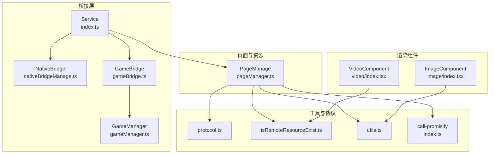
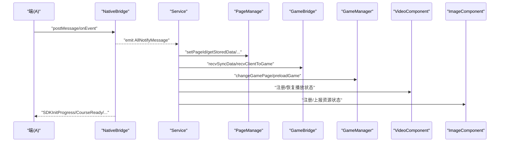
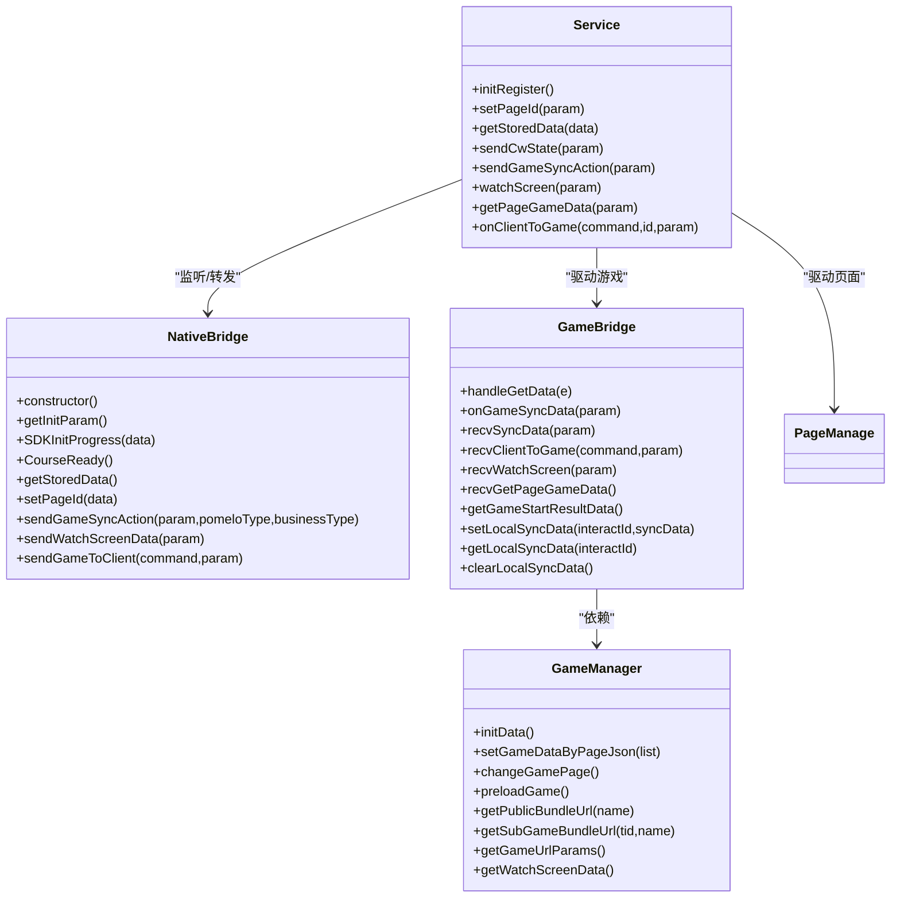
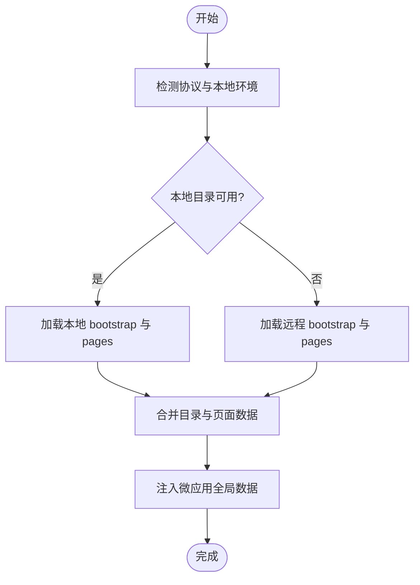
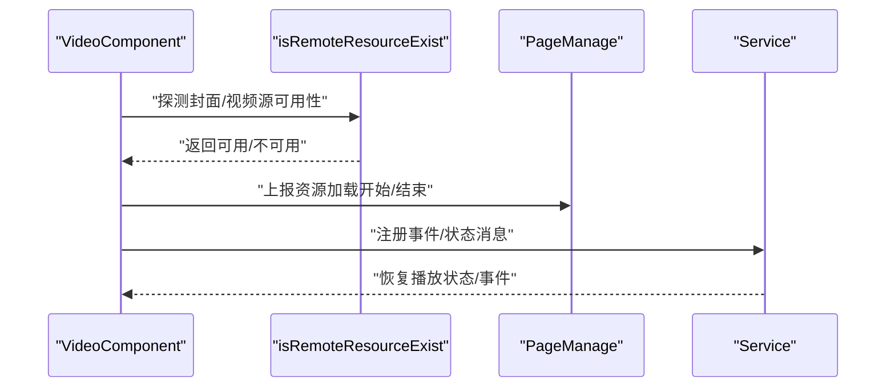
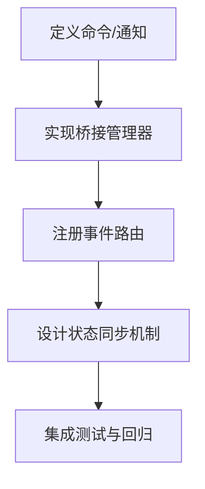
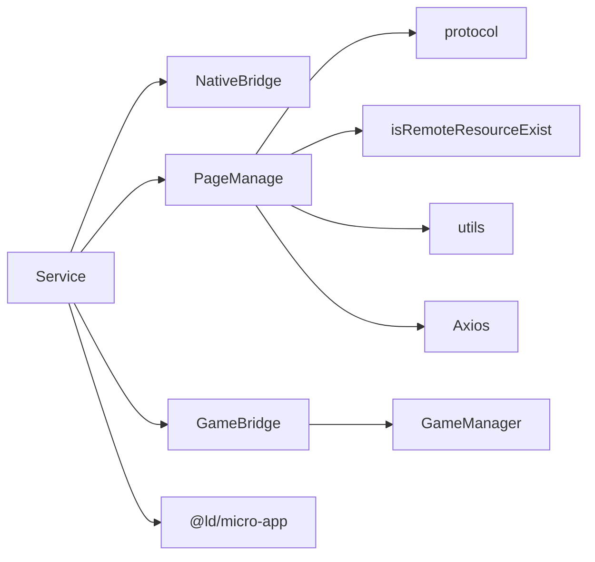

# 第三方集成

<cite>
**本文引用的文件**
- [bridge/mcc-player/src/components/native-bridge/index.ts](file://bridge/mcc-player/src/components/native-bridge/index.ts)
- [bridge/mcc-player/src/components/native-bridge/nativeBridgeManage.ts](file://bridge/mcc-player/src/components/native-bridge/nativeBridgeManage.ts)
- [bridge/mcc-player/src/components/native-bridge/bridge-type.ts](file://bridge/mcc-player/src/components/native-bridge/bridge-type.ts)
- [bridge/mcc-player/src/components/game-manage/gameBridge.ts](file://bridge/mcc-player/src/components/game-manage/gameBridge.ts)
- [bridge/mcc-player/src/components/game-manage/gameManager.ts](file://bridge/mcc-player/src/components/game-manage/gameManager.ts)
- [bridge/mcc-player/src/components/page/pageManager.ts](file://bridge/mcc-player/src/components/page/pageManager.ts)
- [bridge/mcc-player/src/utils/protocol.ts](file://bridge/mcc-player/src/utils/protocol.ts)
- [bridge/mcc-player/src/utils/isRemoteResourceExist.ts](file://bridge/mcc-player/src/utils/isRemoteResourceExist.ts)
- [bridge/mcc-player/src/utils/utils.ts](file://bridge/mcc-player/src/utils/utils.ts)
- [bridge/mcc-player/src/libs/call-promisify/index.ts](file://bridge/mcc-player/src/libs/call-promisify/index.ts)
- [bridge/mcc-player/src/components/service/index.ts](file://bridge/mcc-player/src/components/service/index.ts)
- [bridge/mcc-player/src/interface/index.ts](file://bridge/mcc-player/src/interface/index.ts)
- [common/render-components/src/video/index.tsx](file://common/render-components/src/video/index.tsx)
- [common/render-components/src/image/index.tsx](file://common/render-components/src/image/index.tsx)
</cite>

## 目录
1. [引言](#引言)
2. [项目结构](#项目结构)
3. [核心组件](#核心组件)
4. [架构总览](#架构总览)
5. [详细组件分析](#详细组件分析)
6. [依赖关系分析](#依赖关系分析)
7. [性能考量](#性能考量)
8. [故障排查指南](#故障排查指南)
9. [结论](#结论)
10. [附录](#附录)

## 引言
本文件面向 Slides Engine 的第三方集成开发，聚焦于以下目标：
- 如何接入第三方 API 与外部资源服务
- 资源格式与路径适配策略
- 数据转换与跨域、权限、安全处理
- 桥接系统的扩展：新增桥接类型、通信协议与状态同步
- 外部组件库的封装、样式与事件处理
- 常见第三方资源集成示例：视频播放器、图表库、地图服务
- 安全最佳实践：CORS、权限控制、数据加密、错误处理

## 项目结构
Slides Engine 的第三方集成主要分布在以下模块：
- 桥接层（mcc-player）：负责与 Native/Web 的消息桥接、Pomelo 通信、游戏与课件状态同步
- 页面与资源管理（pageManager）：负责课件目录、页面 JSON 加载、CDN/本地资源回退、Axios 拦截器
- 渲染组件（render-components）：通用视频、图片组件，支持资源探测、事件上报与状态同步
- 工具与协议（protocol、isRemoteResourceExist、utils）：协议识别、远程资源可用性检测、URL 占位符替换等

**图表来源**
- [bridge/mcc-player/src/components/service/index.ts:41-149](file://bridge/mcc-player/src/components/service/index.ts#L41-L149)
- [bridge/mcc-player/src/components/native-bridge/nativeBridgeManage.ts:26-395](file://bridge/mcc-player/src/components/native-bridge/nativeBridgeManage.ts#L26-L395)
- [bridge/mcc-player/src/components/page/pageManager.ts:17-498](file://bridge/mcc-player/src/components/page/pageManager.ts#L17-L498)
- [bridge/mcc-player/src/components/game-manage/gameBridge.ts:22-388](file://bridge/mcc-player/src/components/game-manage/gameBridge.ts#L22-L388)
- [bridge/mcc-player/src/components/game-manage/gameManager.ts:65-368](file://bridge/mcc-player/src/components/game-manage/gameManager.ts#L65-L368)
- [bridge/mcc-player/src/utils/protocol.ts:1-66](file://bridge/mcc-player/src/utils/protocol.ts#L1-66)
- [bridge/mcc-player/src/utils/isRemoteResourceExist.ts:1-40](file://bridge/mcc-player/src/utils/isRemoteResourceExist.ts#L1-40)
- [bridge/mcc-player/src/utils/utils.ts:1-143](file://bridge/mcc-player/src/utils/utils.ts#L1-143)
- [bridge/mcc-player/src/libs/call-promisify/index.ts:1-80](file://bridge/mcc-player/src/libs/call-promisify/index.ts#L1-80)
- [common/render-components/src/video/index.tsx:1-472](file://common/render-components/src/video/index.tsx#L1-472)
- [common/render-components/src/image/index.tsx:1-186](file://common/render-components/src/image/index.tsx#L1-186)

**章节来源**
- [bridge/mcc-player/src/components/service/index.ts:41-149](file://bridge/mcc-player/src/components/service/index.ts#L41-L149)
- [bridge/mcc-player/src/components/page/pageManager.ts:17-498](file://bridge/mcc-player/src/components/page/pageManager.ts#L17-L498)

## 核心组件
- 桥接与通信
  - NativeBridge：统一消息通道，支持 Web/APP 两种来源，封装 call-promisify 超时与 Promise 化调用，提供 Pomelo 消息转发与端能力调用
  - GameBridge：游戏侧消息编排，处理游戏与 MCC 的事件分发、心跳同步、互动授权、教师端旁观等
  - GameManager：游戏生命周期与资源加载参数管理，负责主包/框架/公共模块/子包地址解析与预加载
  - Service：全局事件路由中枢，聚合来自 Native/Course/Game 的消息并驱动页面与游戏状态
- 页面与资源
  - PageManage：课件目录与页面 JSON 的加载、CDN/本地回退、Axios 拦截器、微应用全局数据注入、埋点上报
- 渲染组件
  - VideoComponent：视频播放器组件，支持多源、封面图、事件上报、状态同步、断线重连恢复
  - ImageComponent：图片组件，支持多源、加载/错误上报、点击联动翻页
- 工具与协议
  - protocol：协议识别与本地化判定
  - isRemoteResourceExist：远程资源可用性探测与重试
  - utils：URL 占位符替换、对象深拷贝、对象清洗、参数解析等
  - call-promisify：消息 ID 管理与超时处理

**章节来源**
- [bridge/mcc-player/src/components/native-bridge/nativeBridgeManage.ts:26-395](file://bridge/mcc-player/src/components/native-bridge/nativeBridgeManage.ts#L26-L395)
- [bridge/mcc-player/src/components/game-manage/gameBridge.ts:22-388](file://bridge/mcc-player/src/components/game-manage/gameBridge.ts#L22-L388)
- [bridge/mcc-player/src/components/game-manage/gameManager.ts:65-368](file://bridge/mcc-player/src/components/game-manage/gameManager.ts#L65-L368)
- [bridge/mcc-player/src/components/service/index.ts:41-149](file://bridge/mcc-player/src/components/service/index.ts#L41-L149)
- [bridge/mcc-player/src/components/page/pageManager.ts:17-498](file://bridge/mcc-player/src/components/page/pageManager.ts#L17-L498)
- [common/render-components/src/video/index.tsx:1-472](file://common/render-components/src/video/index.tsx#L1-472)
- [common/render-components/src/image/index.tsx:1-186](file://common/render-components/src/image/index.tsx#L1-186)
- [bridge/mcc-player/src/utils/protocol.ts:1-66](file://bridge/mcc-player/src/utils/protocol.ts#L1-66)
- [bridge/mcc-player/src/utils/isRemoteResourceExist.ts:1-40](file://bridge/mcc-player/src/utils/isRemoteResourceExist.ts#L1-40)
- [bridge/mcc-player/src/utils/utils.ts:1-143](file://bridge/mcc-player/src/utils/utils.ts#L1-143)
- [bridge/mcc-player/src/libs/call-promisify/index.ts:1-80](file://bridge/mcc-player/src/libs/call-promisify/index.ts#L1-80)

## 架构总览
第三方集成采用“桥接 + 微应用 + 组件库”的分层架构：
- 桥接层负责与 Native/Web 的消息桥接、Pomelo 通信、端能力调用与超时控制
- 页面层负责课件目录与页面 JSON 的加载、资源路径解析与回退策略
- 渲染层提供通用组件，统一资源探测、事件上报与状态同步
- 工具层提供协议识别、远程资源探测、占位符替换等基础能力

**图表来源**
- [bridge/mcc-player/src/components/native-bridge/nativeBridgeManage.ts:51-126](file://bridge/mcc-player/src/components/native-bridge/nativeBridgeManage.ts#L51-L126)
- [bridge/mcc-player/src/components/service/index.ts:85-149](file://bridge/mcc-player/src/components/service/index.ts#L85-L149)
- [bridge/mcc-player/src/components/page/pageManager.ts:377-498](file://bridge/mcc-player/src/components/page/pageManager.ts#L377-L498)
- [bridge/mcc-player/src/components/game-manage/gameBridge.ts:59-110](file://bridge/mcc-player/src/components/game-manage/gameBridge.ts#L59-L110)
- [bridge/mcc-player/src/components/game-manage/gameManager.ts:199-260](file://bridge/mcc-player/src/components/game-manage/gameManager.ts#L199-L260)
- [common/render-components/src/video/index.tsx:340-375](file://common/render-components/src/video/index.tsx#L340-L375)
- [common/render-components/src/image/index.tsx:69-111](file://common/render-components/src/image/index.tsx#L69-L111)

## 详细组件分析

### 桥接系统与通信协议
- 消息来源与目标
  - Web/APP：通过 window.postMessage 或 window.webkit.messageHandlers/nativeHandler 传递消息
  - Pomelo：通过自定义消息类型在端与服务端之间转发
- 命令与通知
  - 端到 MCC：InitParam、课程目录、存储数据、页面切换、课件状态变更、观看学生屏幕等
  - MCC 到端：SDK 初始化进度、课件准备完成、页面信息、云控配置、心跳、动画状态等
  - 端到游戏：互动授权、暂停/恢复、FPS 设置等
- 超时与 Promise 化
  - call-promisify 统一管理消息 ID、超时与回调，避免竞态与内存泄漏

**图表来源**
- [bridge/mcc-player/src/components/native-bridge/nativeBridgeManage.ts:26-395](file://bridge/mcc-player/src/components/native-bridge/nativeBridgeManage.ts#L26-L395)
- [bridge/mcc-player/src/components/game-manage/gameBridge.ts:22-388](file://bridge/mcc-player/src/components/game-manage/gameBridge.ts#L22-L388)
- [bridge/mcc-player/src/components/game-manage/gameManager.ts:65-368](file://bridge/mcc-player/src/components/game-manage/gameManager.ts#L65-L368)
- [bridge/mcc-player/src/components/service/index.ts:41-149](file://bridge/mcc-player/src/components/service/index.ts#L41-L149)

**章节来源**
- [bridge/mcc-player/src/components/native-bridge/nativeBridgeManage.ts:26-395](file://bridge/mcc-player/src/components/native-bridge/nativeBridgeManage.ts#L26-L395)
- [bridge/mcc-player/src/components/native-bridge/bridge-type.ts:1-73](file://bridge/mcc-player/src/components/native-bridge/bridge-type.ts#L1-L73)
- [bridge/mcc-player/src/libs/call-promisify/index.ts:1-80](file://bridge/mcc-player/src/libs/call-promisify/index.ts#L1-80)

### 页面与资源加载流程
- 目录与页面 JSON
  - 优先读取本地目录与页面 JSON，若不可用则回退至 CDN 列表逐个尝试
  - 使用 Axios 拦截器统一处理 file/HTTP 状态码差异，支持超时与重试
- 资源路径与占位符
  - 通过 replacePlaceholders 将 slideId、version 等动态参数注入路径模板
- 微应用全局数据
  - 将资源路径与页面 JSON 注入微应用全局数据，供子应用按需读取

**图表来源**
- [bridge/mcc-player/src/components/page/pageManager.ts:194-307](file://bridge/mcc-player/src/components/page/pageManager.ts#L194-L307)
- [bridge/mcc-player/src/utils/utils.ts:86-88](file://bridge/mcc-player/src/utils/utils.ts#L86-L88)
- [bridge/mcc-player/src/utils/protocol.ts:28-63](file://bridge/mcc-player/src/utils/protocol.ts#L28-L63)

**章节来源**
- [bridge/mcc-player/src/components/page/pageManager.ts:17-498](file://bridge/mcc-player/src/components/page/pageManager.ts#L17-L498)
- [bridge/mcc-player/src/utils/utils.ts:1-143](file://bridge/mcc-player/src/utils/utils.ts#L1-143)
- [bridge/mcc-player/src/utils/protocol.ts:1-66](file://bridge/mcc-player/src/utils/protocol.ts#L1-66)

### 渲染组件与第三方资源集成
- 视频组件
  - 多源选择与封面图回退，支持自动播放（先导课模式）、可见性控制、事件上报与状态同步
  - 断线重连时恢复播放状态（播放/暂停、音量、静音、时间轴）
- 图片组件
  - 多源回退、加载/错误上报、点击联动翻页

**图表来源**
- [common/render-components/src/video/index.tsx:340-375](file://common/render-components/src/video/index.tsx#L340-L375)
- [common/render-components/src/video/index.tsx:387-455](file://common/render-components/src/video/index.tsx#L387-L455)
- [bridge/mcc-player/src/utils/isRemoteResourceExist.ts:16-39](file://bridge/mcc-player/src/utils/isRemoteResourceExist.ts#L16-L39)
- [bridge/mcc-player/src/components/page/pageManager.ts:490-496](file://bridge/mcc-player/src/components/page/pageManager.ts#L490-L496)

**章节来源**
- [common/render-components/src/video/index.tsx:1-472](file://common/render-components/src/video/index.tsx#L1-472)
- [common/render-components/src/image/index.tsx:1-186](file://common/render-components/src/image/index.tsx#L1-186)
- [bridge/mcc-player/src/utils/isRemoteResourceExist.ts:1-40](file://bridge/mcc-player/src/utils/isRemoteResourceExist.ts#L1-40)

### 新桥接类型的开发指南
- 定义命令与通知
  - 在 bridge-type 中新增 CommandType/NotifyType/GameNotifyType
  - 明确消息结构、业务含义与超时策略
- 实现桥接管理器
  - 在 nativeBridgeManage 中新增消息发送/接收方法，必要时引入 call-promisify
- 注册事件路由
  - 在 service 中新增事件监听与处理分支，确保消息链路完整
- 状态同步
  - 对需要持久化的状态，参考 GameBridge 的本地/服务端心跳数据同步策略

**图表来源**
- [bridge/mcc-player/src/components/native-bridge/bridge-type.ts:1-73](file://bridge/mcc-player/src/components/native-bridge/bridge-type.ts#L1-L73)
- [bridge/mcc-player/src/components/native-bridge/nativeBridgeManage.ts:144-205](file://bridge/mcc-player/src/components/native-bridge/nativeBridgeManage.ts#L144-L205)
- [bridge/mcc-player/src/components/service/index.ts:85-149](file://bridge/mcc-player/src/components/service/index.ts#L85-L149)
- [bridge/mcc-player/src/components/game-manage/gameBridge.ts:116-189](file://bridge/mcc-player/src/components/game-manage/gameBridge.ts#L116-L189)

**章节来源**
- [bridge/mcc-player/src/components/native-bridge/bridge-type.ts:1-73](file://bridge/mcc-player/src/components/native-bridge/bridge-type.ts#L1-L73)
- [bridge/mcc-player/src/components/native-bridge/nativeBridgeManage.ts:144-205](file://bridge/mcc-player/src/components/native-bridge/nativeBridgeManage.ts#L144-L205)
- [bridge/mcc-player/src/components/service/index.ts:85-149](file://bridge/mcc-player/src/components/service/index.ts#L85-L149)
- [bridge/mcc-player/src/components/game-manage/gameBridge.ts:116-189](file://bridge/mcc-player/src/components/game-manage/gameBridge.ts#L116-L189)

### 外部组件库集成方案
- 组件封装
  - 保持与现有组件一致的 props/事件模型，统一资源探测与上报
- 样式适配
  - 使用相对尺寸与 fluid 布局，结合 PageManage 的视口缩放逻辑
- 事件处理
  - 通过微应用消息机制与 Service 路由，实现事件上报与状态同步

**章节来源**
- [common/render-components/src/video/index.tsx:148-211](file://common/render-components/src/video/index.tsx#L148-L211)
- [common/render-components/src/image/index.tsx:152-160](file://common/render-components/src/image/index.tsx#L152-L160)
- [bridge/mcc-player/src/components/service/index.ts:379-399](file://bridge/mcc-player/src/components/service/index.ts#L379-L399)

### 常见第三方资源集成示例
- 视频播放器
  - 使用 VideoComponent 的多源回退与事件上报机制，接入第三方播放 SDK 时遵循相同的消息与状态同步协议
- 图表库
  - 通过微应用全局数据注入配置，组件内部完成渲染与交互，事件通过 Service 路由上报
- 地图服务
  - 采用 isRemoteResourceExist 进行资源可用性探测，结合 PageManage 的 CDN 回退策略

**章节来源**
- [common/render-components/src/video/index.tsx:387-455](file://common/render-components/src/video/index.tsx#L387-L455)
- [bridge/mcc-player/src/utils/isRemoteResourceExist.ts:16-39](file://bridge/mcc-player/src/utils/isRemoteResourceExist.ts#L16-L39)
- [bridge/mcc-player/src/components/page/pageManager.ts:426-465](file://bridge/mcc-player/src/components/page/pageManager.ts#L426-L465)

## 依赖关系分析
- 组件耦合
  - Service 作为中枢，依赖 NativeBridge、PageManage、GameBridge
  - GameBridge 依赖 GameManager、PageManage、NativeBridge
  - PageManage 依赖 protocol、isRemoteResourceExist、utils、Axios
- 外部依赖
  - 微应用框架（@ld/micro-app）用于全局数据与子应用隔离
  - Axios 用于资源请求与拦截器
  - events（EventEmitter）用于事件发布订阅

**图表来源**
- [bridge/mcc-player/src/components/service/index.ts:41-149](file://bridge/mcc-player/src/components/service/index.ts#L41-L149)
- [bridge/mcc-player/src/components/page/pageManager.ts:17-498](file://bridge/mcc-player/src/components/page/pageManager.ts#L17-L498)
- [bridge/mcc-player/src/utils/protocol.ts:1-66](file://bridge/mcc-player/src/utils/protocol.ts#L1-66)
- [bridge/mcc-player/src/utils/isRemoteResourceExist.ts:1-40](file://bridge/mcc-player/src/utils/isRemoteResourceExist.ts#L1-40)
- [bridge/mcc-player/src/utils/utils.ts:1-143](file://bridge/mcc-player/src/utils/utils.ts#L1-143)

**章节来源**
- [bridge/mcc-player/src/components/service/index.ts:41-149](file://bridge/mcc-player/src/components/service/index.ts#L41-L149)
- [bridge/mcc-player/src/components/page/pageManager.ts:17-498](file://bridge/mcc-player/src/components/page/pageManager.ts#L17-L498)

## 性能考量
- 资源加载
  - 本地优先、CDN 回退，减少首屏等待；对视频/图片资源进行可用性探测与重试
- 状态同步
  - 心跳数据仅在必要时广播，避免频繁网络开销；断线重连时批量恢复
- 事件节流
  - 视频组件对 TIMEUPDATE 等高频事件进行节流，降低主线程压力

[本节为通用指导，无需列出具体文件来源]

## 故障排查指南
- 跨域与协议
  - 使用 protocol 工具识别协议，file/HTTP 在状态码处理上有所差异
- 资源不可用
  - isRemoteResourceExist 提供 head 请求与重试策略，建议结合埋点定位失败原因
- 消息超时
  - call-promisify 统一管理超时与回调，注意清理定时器避免内存泄漏
- 页面切换失败
  - 检查 PageManage 的 pageLoadSuccess 与 pageChangeComplete 状态，确认切页流程完成

**章节来源**
- [bridge/mcc-player/src/utils/protocol.ts:14-66](file://bridge/mcc-player/src/utils/protocol.ts#L14-L66)
- [bridge/mcc-player/src/utils/isRemoteResourceExist.ts:16-39](file://bridge/mcc-player/src/utils/isRemoteResourceExist.ts#L16-L39)
- [bridge/mcc-player/src/libs/call-promisify/index.ts:11-36](file://bridge/mcc-player/src/libs/call-promisify/index.ts#L11-L36)
- [bridge/mcc-player/src/components/page/pageManager.ts:73-75](file://bridge/mcc-player/src/components/page/pageManager.ts#L73-L75)

## 结论
Slides Engine 的第三方集成以桥接系统为核心，配合页面与资源管理、渲染组件与工具层，形成完整的资源接入与状态同步体系。通过统一的命令/通知模型、消息超时控制与资源探测回退策略，能够稳定地对接各类第三方 API 与外部组件库。

[本节为总结性内容，无需列出具体文件来源]

## 附录
- 安全最佳实践
  - CORS：在服务端配置允许的来源与方法，前端仅请求受信任域名
  - 权限控制：通过 InitParam 中的角色与用户信息进行鉴权
  - 数据加密：敏感数据在传输与存储阶段采用加密措施
  - 错误处理：统一捕获与上报，结合埋点定位问题

[本节为通用指导，无需列出具体文件来源]