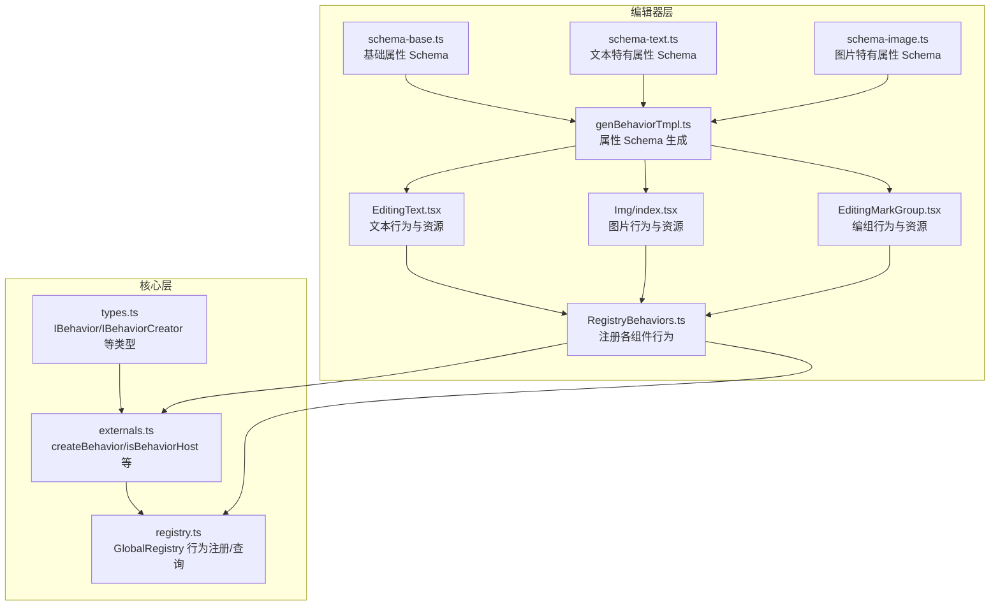
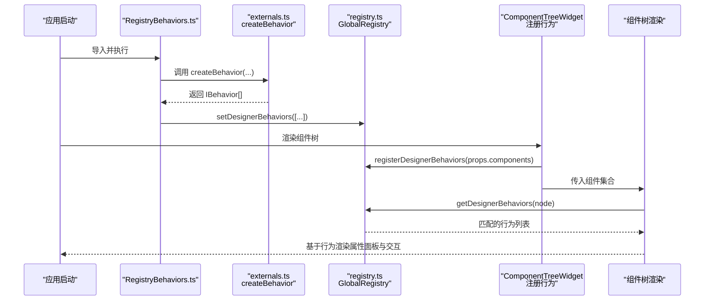
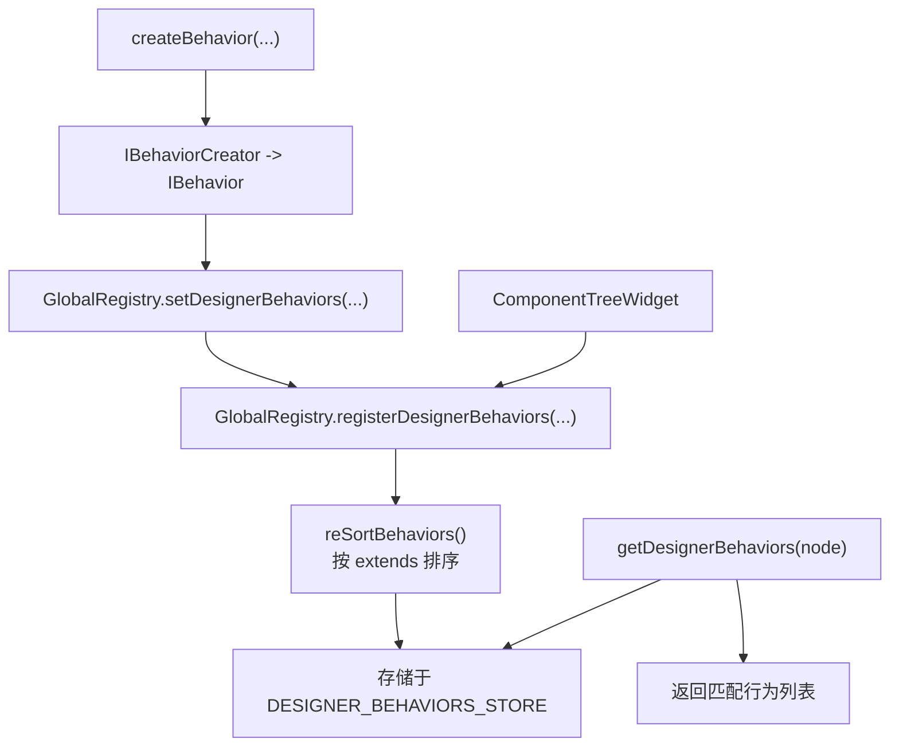

# 组件扩展

<cite>
**本文引用的文件**
- [packages/core/src/externals.ts](file://packages/core/src/externals.ts)
- [packages/core/src/registry.ts](file://packages/core/src/registry.ts)
- [packages/core/src/types.ts](file://packages/core/src/types.ts)
- [packages/react/src/widgets/ComponentTreeWidget/index.tsx](file://packages/react/src/widgets/ComponentTreeWidget/index.tsx)
- [editor/src/RegistryBehaviors.ts](file://editor/src/RegistryBehaviors.ts)
- [editor/src/components/Text/EditingText.tsx](file://editor/src/components/Text/EditingText.tsx)
- [editor/src/components/Img/index.tsx](file://editor/src/components/Img/index.tsx)
- [editor/src/components/Group/EditingMarkGroup.tsx](file://editor/src/components/Group/EditingMarkGroup.tsx)
- [editor/src/components/_config/genBehaviorTmpl.ts](file://editor/src/components/_config/genBehaviorTmpl.ts)
- [editor/src/components/_config/schema-base.ts](file://editor/src/components/_config/schema-base.ts)
- [editor/src/components/_config/schema-text.ts](file://editor/src/components/_config/schema-text.ts)
- [editor/src/components/_config/schema-image.ts](file://editor/src/components/_config/schema-image.ts)
</cite>

## 目录
1. [简介](#简介)
2. [项目结构](#项目结构)
3. [核心组件](#核心组件)
4. [架构总览](#架构总览)
5. [详细组件分析](#详细组件分析)
6. [依赖关系分析](#依赖关系分析)
7. [性能考量](#性能考量)
8. [故障排查指南](#故障排查指南)
9. [结论](#结论)
10. [附录](#附录)

## 简介
本文件面向“Slides Engine 组件扩展”的开发者，系统讲解组件行为注册机制与扩展实践，涵盖以下主题：
- createBehavior 的使用方式与行为配置项定义
- 设计器属性（如拖拽、克隆、删除、尺寸调整、自由移动等）的设置
- 如何开发新组件类型：组件类定义规范、行为注册流程、属性面板 Schema 生成
- 组件扩展的技术实现：继承体系、方法重写、事件处理模式
- 实战示例：自定义组件行为、配置属性面板、实现拖拽与选择
- 最佳实践：命名规范、代码组织、性能优化、兼容性考虑

## 项目结构
围绕组件扩展的关键目录与文件：
- 核心注册与类型定义：packages/core
- 编辑器侧行为注册入口：editor/src/RegistryBehaviors.ts
- 具体组件行为与资源：editor/src/components/*（如 Text、Img、Group）
- 属性 Schema 生成与基础配置：editor/src/components/_config/*

图表来源
- [packages/core/src/externals.ts:89-101](file://packages/core/src/externals.ts#L89-L101)
- [packages/core/src/registry.ts:177-185](file://packages/core/src/registry.ts#L177-L185)
- [packages/core/src/types.ts:144-158](file://packages/core/src/types.ts#L144-L158)
- [editor/src/RegistryBehaviors.ts:24-69](file://editor/src/RegistryBehaviors.ts#L24-L69)
- [editor/src/components/_config/genBehaviorTmpl.ts:16-45](file://editor/src/components/_config/genBehaviorTmpl.ts#L16-L45)
- [editor/src/components/_config/schema-base.ts:7-48](file://editor/src/components/_config/schema-base.ts#L7-L48)
- [editor/src/components/_config/schema-text.ts:7-42](file://editor/src/components/_config/schema-text.ts#L7-L42)
- [editor/src/components/_config/schema-image.ts:7-47](file://editor/src/components/_config/schema-image.ts#L7-L47)
- [editor/src/components/Text/EditingText.tsx:25-58](file://editor/src/components/Text/EditingText.tsx#L25-L58)
- [editor/src/components/Img/index.tsx:23-69](file://editor/src/components/Img/index.tsx#L23-L69)
- [editor/src/components/Group/EditingMarkGroup.tsx:41-75](file://editor/src/components/Group/EditingMarkGroup.tsx#L41-L75)

章节来源
- [packages/core/src/externals.ts:89-101](file://packages/core/src/externals.ts#L89-L101)
- [packages/core/src/registry.ts:177-185](file://packages/core/src/registry.ts#L177-L185)
- [packages/core/src/types.ts:144-158](file://packages/core/src/types.ts#L144-L158)
- [editor/src/RegistryBehaviors.ts:24-69](file://editor/src/RegistryBehaviors.ts#L24-L69)

## 核心组件
- createBehavior：将行为配置项标准化为行为对象，支持字符串选择器自动转函数。
- GlobalRegistry：全局注册中心，负责行为注册、查询、国际化、图标等。
- IBehavior/IBehaviorCreator：行为的数据契约，包含名称、选择器、扩展链、设计器属性、本地化等。

关键要点
- 选择器支持字符串或函数，字符串会被自动转换为按组件名匹配的函数。
- 行为可声明 extends，注册时会根据依赖顺序重新排序，保证依赖先于被依赖加载。
- 设计器属性 designerProps 支持 propsSchema、默认属性、拖拽/克隆/删除、尺寸/自由移动等能力。

章节来源
- [packages/core/src/externals.ts:89-101](file://packages/core/src/externals.ts#L89-L101)
- [packages/core/src/registry.ts:34-62](file://packages/core/src/registry.ts#L34-L62)
- [packages/core/src/types.ts:144-158](file://packages/core/src/types.ts#L144-L158)

## 架构总览
编辑器在启动时集中注册所有组件行为，并在组件树渲染时按节点类型动态匹配行为，从而决定属性面板、交互能力与本地化文案。

图表来源
- [editor/src/RegistryBehaviors.ts:57-69](file://editor/src/RegistryBehaviors.ts#L57-L69)
- [packages/core/src/externals.ts:89-101](file://packages/core/src/externals.ts#L89-L101)
- [packages/core/src/registry.ts:90-113](file://packages/core/src/registry.ts#L90-L113)
- [packages/react/src/widgets/ComponentTreeWidget/index.tsx:99-101](file://packages/react/src/widgets/ComponentTreeWidget/index.tsx#L99-L101)

## 详细组件分析

### 行为注册与选择器
- 字符串选择器会被自动转换为按组件名匹配的函数，便于统一处理。
- 支持函数选择器，可基于节点属性进行更精细的匹配。

章节来源
- [packages/core/src/externals.ts:96-98](file://packages/core/src/externals.ts#L96-L98)
- [editor/src/components/Text/EditingText.tsx:29-30](file://editor/src/components/Text/EditingText.tsx#L29-L30)
- [editor/src/components/Group/EditingMarkGroup.tsx:43](file://editor/src/components/Group/EditingMarkGroup.tsx#L43)

### 设计器属性（propsSchema 与交互能力）
- propsSchema：通过 genPropsSchema 将 info/style 两类属性合并为统一 Schema，驱动属性面板。
- 默认属性：defaultProps 提供初始值，避免空缺。
- 交互能力：droppable、draggable、cloneable、deletable、resizable、translatable 等。
- 动态属性注入：getComponentProps 可按节点动态返回组件所需上下文钩子或参数。

章节来源
- [editor/src/components/_config/genBehaviorTmpl.ts:16-45](file://editor/src/components/_config/genBehaviorTmpl.ts#L16-L45)
- [editor/src/components/Text/EditingText.tsx:32-40](file://editor/src/components/Text/EditingText.tsx#L32-L40)
- [editor/src/components/Img/index.tsx:26-53](file://editor/src/components/Img/index.tsx#L26-L53)
- [editor/src/components/Group/EditingMarkGroup.tsx:44-61](file://editor/src/components/Group/EditingMarkGroup.tsx#L44-L61)
- [packages/core/src/types.ts:74-99](file://packages/core/src/types.ts#L74-L99)

### 国际化与本地化
- designerLocales 提供多语言文案，GlobalRegistry 会按当前语言查找对应文案。
- 支持动态切换语言与回退策略。

章节来源
- [packages/core/src/registry.ts:138-152](file://packages/core/src/registry.ts#L138-L152)
- [editor/src/RegistryBehaviors.ts:41-55](file://editor/src/RegistryBehaviors.ts#L41-L55)
- [editor/src/components/Text/EditingText.tsx:43-57](file://editor/src/components/Text/EditingText.tsx#L43-L57)
- [editor/src/components/Img/index.tsx:54-68](file://editor/src/components/Img/index.tsx#L54-L68)
- [editor/src/components/Group/EditingMarkGroup.tsx:62-74](file://editor/src/components/Group/EditingMarkGroup.tsx#L62-L74)

### 组件行为与资源
- 行为：createBehavior 定义 selector、designerProps、designerLocales。
- 资源：createResource 定义可拖入画布的模板节点树，便于快速批量插入。

章节来源
- [editor/src/components/Text/EditingText.tsx:25-58](file://editor/src/components/Text/EditingText.tsx#L25-L58)
- [editor/src/components/Text/EditingText.tsx:61-75](file://editor/src/components/Text/EditingText.tsx#L61-L75)
- [editor/src/components/Img/index.tsx:23-69](file://editor/src/components/Img/index.tsx#L23-L69)
- [editor/src/components/Img/index.tsx:71-86](file://editor/src/components/Img/index.tsx#L71-L86)
- [editor/src/components/Group/EditingMarkGroup.tsx:41-75](file://editor/src/components/Group/EditingMarkGroup.tsx#L41-L75)
- [editor/src/components/Group/EditingMarkGroup.tsx:24-39](file://editor/src/components/Group/EditingMarkGroup.tsx#L24-L39)

### 属性 Schema 生成与复用
- genPropsSchema 将 info 与 style 两组 Schema 合并为统一结构，形成“属性/样式”折叠面板。
- 基础 Schema（schema-base）与组件特有 Schema（schema-text、schema-image）组合使用。

章节来源
- [editor/src/components/_config/genBehaviorTmpl.ts:16-45](file://editor/src/components/_config/genBehaviorTmpl.ts#L16-L45)
- [editor/src/components/_config/schema-base.ts:7-48](file://editor/src/components/_config/schema-base.ts#L7-L48)
- [editor/src/components/_config/schema-text.ts:7-42](file://editor/src/components/_config/schema-text.ts#L7-L42)
- [editor/src/components/_config/schema-image.ts:7-47](file://editor/src/components/_config/schema-image.ts#L7-L47)

### 组件扩展技术实现
- 继承体系：通过行为的 extends 字段声明依赖关系，注册时按依赖顺序排序，确保父行为先于子行为生效。
- 方法重写：在 selector、designerProps、designerLocales 中覆盖或扩展默认行为。
- 事件处理模式：通过 getComponentProps 注入 useConnect/useReport 等钩子，实现组件与运行时的联动。

章节来源
- [packages/core/src/registry.ts:34-62](file://packages/core/src/registry.ts#L34-L62)
- [packages/core/src/types.ts:144-158](file://packages/core/src/types.ts#L144-L158)
- [editor/src/components/Group/EditingMarkGroup.tsx:51-60](file://editor/src/components/Group/EditingMarkGroup.tsx#L51-L60)
- [common/render-core/models/context.ts:99-135](file://common/render-core/models/context.ts#L99-L135)

### 开发新组件类型的步骤
- 定义行为：使用 createBehavior，设置 name、selector、designerProps（含 propsSchema、defaultProps、交互能力）、designerLocales。
- 定义资源（可选）：使用 createResource，提供模板节点树。
- 注册行为：在 RegistryBehaviors.ts 中导入并调用 GlobalRegistry.setDesignerBehaviors 或 registerDesignerBehaviors。
- 在组件树渲染时生效：ComponentTreeWidget 会将 props.components 注册到 GlobalRegistry，随后 getDesignerBehaviors 用于筛选当前节点可用行为。

章节来源
- [editor/src/RegistryBehaviors.ts:24-69](file://editor/src/RegistryBehaviors.ts#L24-L69)
- [packages/react/src/widgets/ComponentTreeWidget/index.tsx:99-101](file://packages/react/src/widgets/ComponentTreeWidget/index.tsx#L99-L101)
- [packages/core/src/registry.ts:109-113](file://packages/core/src/registry.ts#L109-L113)

### 具体示例（路径指引）
- 自定义组件行为：参考 [editor/src/components/Text/EditingText.tsx:25-58](file://editor/src/components/Text/EditingText.tsx#L25-L58)
- 配置属性面板 Schema：参考 [editor/src/components/_config/genBehaviorTmpl.ts:16-45](file://editor/src/components/_config/genBehaviorTmpl.ts#L16-L45) 与 [editor/src/components/_config/schema-base.ts:7-48](file://editor/src/components/_config/schema-base.ts#L7-L48)
- 实现拖拽与选择：参考 [editor/src/components/Group/EditingMarkGroup.tsx:44-61](file://editor/src/components/Group/EditingMarkGroup.tsx#L44-L61)
- 注册行为入口：参考 [editor/src/RegistryBehaviors.ts:57-69](file://editor/src/RegistryBehaviors.ts#L57-L69)

## 依赖关系分析
行为注册与查询的依赖链路如下：

图表来源
- [packages/core/src/externals.ts:89-101](file://packages/core/src/externals.ts#L89-L101)
- [packages/core/src/registry.ts:90-113](file://packages/core/src/registry.ts#L90-L113)
- [packages/core/src/registry.ts:177-185](file://packages/core/src/registry.ts#L177-L185)
- [packages/core/src/registry.ts:34-62](file://packages/core/src/registry.ts#L34-L62)
- [packages/react/src/widgets/ComponentTreeWidget/index.tsx:99-101](file://packages/react/src/widgets/ComponentTreeWidget/index.tsx#L99-L101)

章节来源
- [packages/core/src/registry.ts:34-62](file://packages/core/src/registry.ts#L34-L62)
- [packages/core/src/registry.ts:90-113](file://packages/core/src/registry.ts#L90-L113)
- [packages/core/src/registry.ts:177-185](file://packages/core/src/registry.ts#L177-L185)

## 性能考量
- 行为排序与去重：注册时按 extends 依赖排序，避免重复注册，减少运行时匹配成本。
- 选择器优化：尽量使用精确的函数选择器，避免全量扫描。
- Schema 合并与缓存：genPropsSchema 合并多次调用结果，减少重复计算。
- 懒加载与按需注册：仅在需要时注册行为，避免一次性注册过多行为导致内存压力。

## 故障排查指南
- 未找到依赖行为：当行为声明了 extends，但目标行为未注册时，会抛出错误。请确认依赖行为已先于当前行为注册。
- 选择器不生效：检查 selector 是否正确匹配节点组件名或属性；字符串选择器会被自动转换为按组件名匹配。
- 属性面板为空：确认 propsSchema 是否正确生成且包含 info/style 两组属性；检查 designerProps 是否传入。
- 国际化文案缺失：确认 designerLocales 中包含当前语言键值；若无则回退到其他语言键值。

章节来源
- [packages/core/src/registry.ts:51-58](file://packages/core/src/registry.ts#L51-L58)
- [packages/core/src/externals.ts:96-98](file://packages/core/src/externals.ts#L96-L98)
- [packages/core/src/registry.ts:138-152](file://packages/core/src/registry.ts#L138-L152)

## 结论
通过 createBehavior 与 GlobalRegistry，Slides Engine 提供了清晰、可扩展的组件行为注册机制。遵循本文的规范与最佳实践，开发者可以高效地扩展新组件类型，统一配置属性面板与交互能力，并在大型项目中保持良好的可维护性与性能表现。

## 附录

### 行为字段速查
- name：行为名称
- extends：依赖的其他行为名称数组
- selector：字符串或函数，用于匹配节点
- designerProps：设计器属性，含 propsSchema、defaultProps、交互能力、动态属性注入等
- designerLocales：多语言文案

章节来源
- [packages/core/src/types.ts:144-158](file://packages/core/src/types.ts#L144-L158)