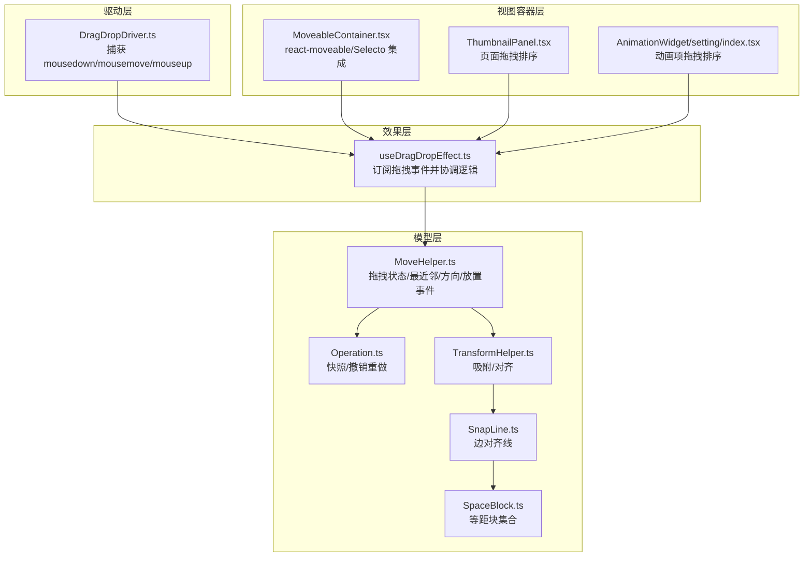
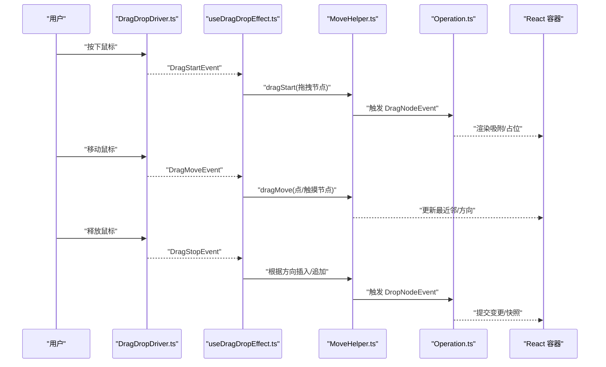
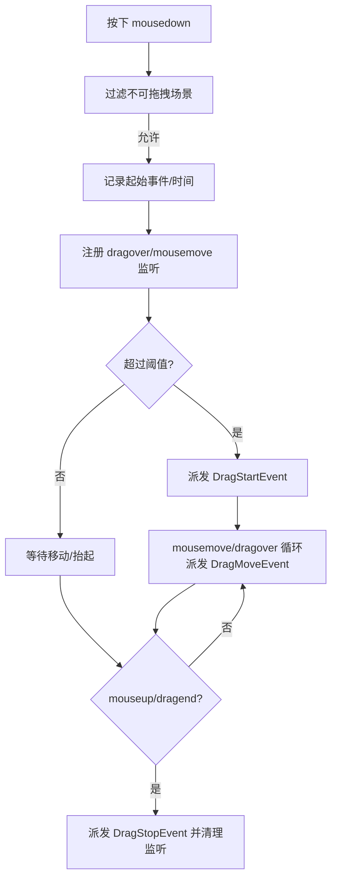
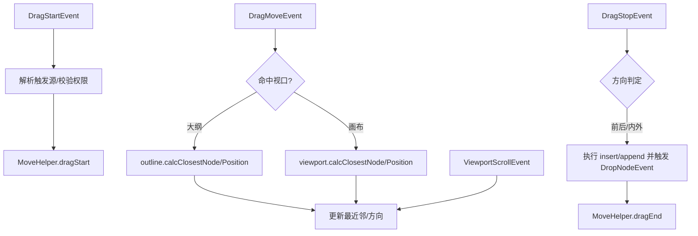
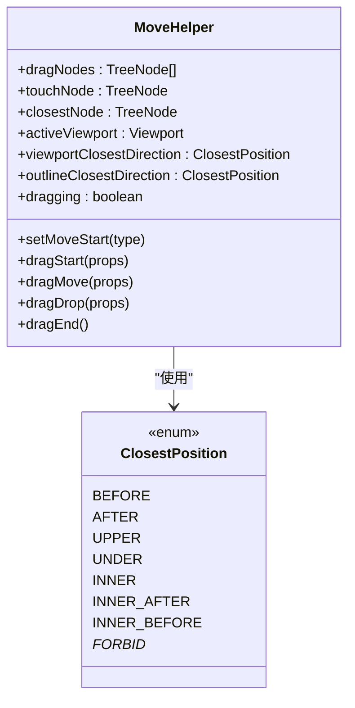
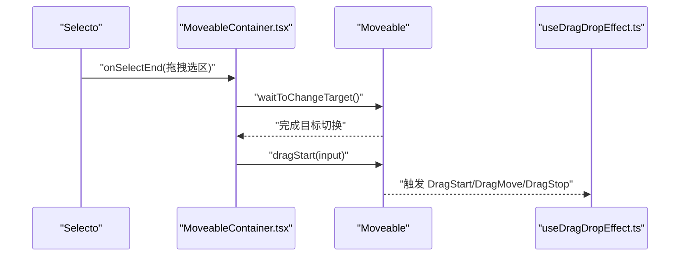
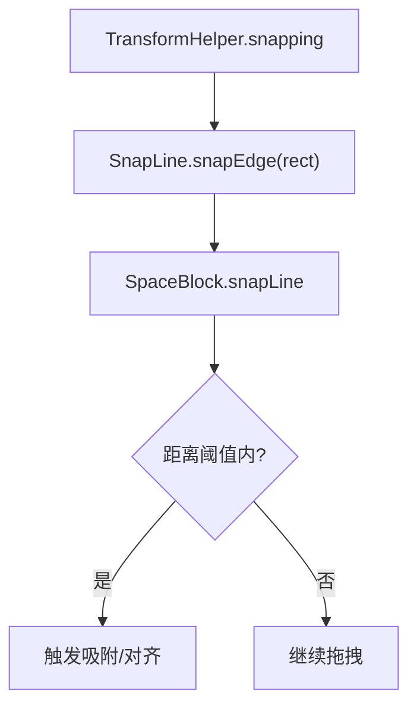
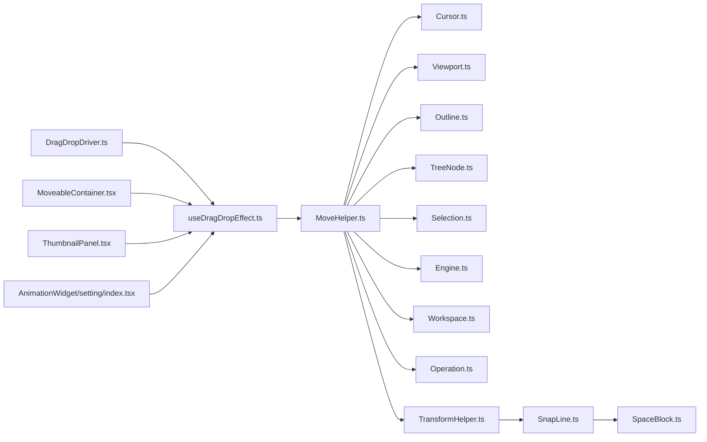

# 拖拽系统

<cite>
**本文引用的文件**
- [packages/core/src/drivers/DragDropDriver.ts](file://packages/core/src/drivers/DragDropDriver.ts)
- [packages/core/src/effects/useDragDropEffect.ts](file://packages/core/src/effects/useDragDropEffect.ts)
- [packages/core/src/models/MoveHelper.ts](file://packages/core/src/models/MoveHelper.ts)
- [packages/core/src/events/cursor/DragStartEvent.ts](file://packages/core/src/events/cursor/DragStartEvent.ts)
- [packages/core/src/events/cursor/DragMoveEvent.ts](file://packages/core/src/events/cursor/DragMoveEvent.ts)
- [packages/core/src/events/cursor/DragStopEvent.ts](file://packages/core/src/events/cursor/DragStopEvent.ts)
- [packages/react/src/containers/MoveableContainer.tsx](file://packages/react/src/containers/MoveableContainer.tsx)
- [packages/react/src/panels/ThumbnailPanel.tsx](file://packages/react/src/panels/ThumbnailPanel.tsx)
- [packages/react/src/widgets/AnimationWidget/setting/index.tsx](file://packages/react/src/widgets/AnimationWidget/setting/index.tsx)
- [packages/core/src/models/Operation.ts](file://packages/core/src/models/Operation.ts)
- [packages/core/src/models/SnapLine.ts](file://packages/core/src/models/SnapLine.ts)
- [packages/core/src/models/TransformHelper.ts](file://packages/core/src/models/TransformHelper.ts)
- [packages/core/src/models/SpaceBlock.ts](file://packages/core/src/models/SpaceBlock.ts)
- [packages/core/src/models/Viewport.ts](file://packages/core/src/models/Viewport.ts)
- [packages/core/src/models/TreeNode.ts](file://packages/core/src/models/TreeNode.ts)
- [packages/core/src/models/Cursor.ts](file://packages/core/src/models/Cursor.ts)
- [packages/core/src/models/Engine.ts](file://packages/core/src/models/Engine.ts)
- [packages/core/src/models/Workspace.ts](file://packages/core/src/models/Workspace.ts)
- [packages/core/src/models/Selection.ts](file://packages/core/src/models/Selection.ts)
- [packages/core/src/models/Viewport.ts](file://packages/core/src/models/Viewport.ts)
- [packages/core/src/models/Outline.ts](file://packages/core/src/models/Outline.ts)
- [packages/core/src/events/DropNodeEvent.ts](file://packages/core/src/events/DropNodeEvent.ts)
- [packages/core/src/events/DragNodeEvent.ts](file://packages/core/src/events/DragNodeEvent.ts)
- [packages/core/src/events/ViewportScrollEvent.ts](file://packages/core/src/events/ViewportScrollEvent.ts)
- [packages/core/src/events/MouseClickEvent.ts](file://packages/core/src/events/MouseClickEvent.ts)
- [packages/core/src/events/SelectNodeEvent.ts](file://packages/core/src/events/SelectNodeEvent.ts)
- [packages/core/src/events/AbstractCursorEvent.ts](file://packages/core/src/events/AbstractCursorEvent.ts)
</cite>

## 目录
1. [简介](#简介)
2. [项目结构](#项目结构)
3. [核心组件](#核心组件)
4. [架构总览](#架构总览)
5. [详细组件分析](#详细组件分析)
6. [依赖关系分析](#依赖关系分析)
7. [性能考量](#性能考量)
8. [故障排查指南](#故障排查指南)
9. [结论](#结论)
10. [附录](#附录)

## 简介
本文件系统性梳理 Slides Engine 的拖拽系统，覆盖从鼠标事件捕获、拖拽状态管理、目标判定、约束与碰撞、视觉反馈到持久化与撤销重做的完整链路。读者可据此理解拖拽的实现原理，并在此基础上扩展自定义行为与特效。

## 项目结构
拖拽系统由“驱动层”“效果层”“模型层”“视图容器层”四部分协同构成：
- 驱动层：统一捕获原生鼠标事件，派发标准化拖拽事件（开始/移动/结束）。
- 效果层：订阅拖拽事件，协调引擎、光标、选择与布局计算，决定放置位置与插入方向。
- 模型层：维护拖拽状态、最近邻节点与方向、触发放置事件，负责与树模型交互。
- 视图容器层：集成外部可拖拽库，提供吸附、网格、占位等可视化反馈。

**图表来源**
- [packages/core/src/drivers/DragDropDriver.ts:12-144](file://packages/core/src/drivers/DragDropDriver.ts#L12-L144)
- [packages/core/src/effects/useDragDropEffect.ts:16-194](file://packages/core/src/effects/useDragDropEffect.ts#L16-L194)
- [packages/core/src/models/MoveHelper.ts:50-387](file://packages/core/src/models/MoveHelper.ts#L50-L387)
- [packages/core/src/models/Operation.ts:68-76](file://packages/core/src/models/Operation.ts#L68-L76)
- [packages/core/src/models/TransformHelper.ts:255-302](file://packages/core/src/models/TransformHelper.ts#L255-L302)
- [packages/core/src/models/SnapLine.ts:76-114](file://packages/core/src/models/SnapLine.ts#L76-L114)
- [packages/core/src/models/SpaceBlock.ts:123-137](file://packages/core/src/models/SpaceBlock.ts#L123-L137)
- [packages/react/src/containers/MoveableContainer.tsx:280-433](file://packages/react/src/containers/MoveableContainer.tsx#L280-L433)
- [packages/react/src/panels/ThumbnailPanel.tsx:600-656](file://packages/react/src/panels/ThumbnailPanel.tsx#L600-L656)
- [packages/react/src/widgets/AnimationWidget/setting/index.tsx:122-194](file://packages/react/src/widgets/AnimationWidget/setting/index.tsx#L122-L194)

**章节来源**
- [packages/core/src/drivers/DragDropDriver.ts:12-144](file://packages/core/src/drivers/DragDropDriver.ts#L12-L144)
- [packages/core/src/effects/useDragDropEffect.ts:16-194](file://packages/core/src/effects/useDragDropEffect.ts#L16-L194)
- [packages/react/src/containers/MoveableContainer.tsx:280-433](file://packages/react/src/containers/MoveableContainer.tsx#L280-L433)

## 核心组件
- 驱动层：DragDropDriver 负责在全局范围内监听鼠标按下/移动/抬起，过滤不可拖拽区域与输入框，计算最小移动距离与时间阈值后派发 DragStart/DragMove/DragStop 事件。
- 效果层：useDragDropEffect 订阅拖拽事件，解析触发源（节点/大纲/处理器），校验拖拽权限与范围，调用 MoveHelper 更新拖拽状态与最近邻，最终在停止时根据方向执行插入或追加。
- 模型层：MoveHelper 维护拖拽节点列表、触摸节点、最近邻节点与方向，计算最近邻矩形与偏移矩形，触发 DragNodeEvent/DropNodeEvent；Operation 提供快照与撤销重做；TransformHelper/SnapLine/SpaceBlock 实现吸附与对齐。
- 视图容器层：MoveableContainer 集成 react-moveable/Selecto，提供吸附网格、组拖拽、旋转缩放回调，以及拖拽选区；ThumbnailPanel 与动画面板提供列表级拖拽排序。

**章节来源**
- [packages/core/src/drivers/DragDropDriver.ts:17-120](file://packages/core/src/drivers/DragDropDriver.ts#L17-L120)
- [packages/core/src/effects/useDragDropEffect.ts:17-193](file://packages/core/src/effects/useDragDropEffect.ts#L17-L193)
- [packages/core/src/models/MoveHelper.ts:273-360](file://packages/core/src/models/MoveHelper.ts#L273-L360)
- [packages/core/src/models/Operation.ts:68-76](file://packages/core/src/models/Operation.ts#L68-L76)
- [packages/react/src/containers/MoveableContainer.tsx:434-521](file://packages/react/src/containers/MoveableContainer.tsx#L434-L521)

## 架构总览
拖拽流程遵循“事件驱动 + 状态机”的模式：驱动层产生事件，效果层解析上下文并更新模型，模型层通过事件与树模型交互，视图容器层渲染吸附与占位反馈。

**图表来源**
- [packages/core/src/drivers/DragDropDriver.ts:38-108](file://packages/core/src/drivers/DragDropDriver.ts#L38-L108)
- [packages/core/src/effects/useDragDropEffect.ts:17-193](file://packages/core/src/effects/useDragDropEffect.ts#L17-L193)
- [packages/core/src/models/MoveHelper.ts:273-360](file://packages/core/src/models/MoveHelper.ts#L273-L360)
- [packages/core/src/models/Operation.ts:68-76](file://packages/core/src/models/Operation.ts#L68-L76)
- [packages/react/src/containers/MoveableContainer.tsx:434-521](file://packages/react/src/containers/MoveableContainer.tsx#L434-L521)

## 详细组件分析

### 驱动层：DragDropDriver
- 过滤条件：非左键、按住 Ctrl/Meta、内容可编辑元素、特定禁用类、Monaco 编辑器等场景直接返回。
- 启动策略：记录起始事件与时间，注册 dragover/mousemove 监听，在满足最小位移与时间阈值后派发 DragStartEvent。
- 运行期：重复派发 DragMoveEvent，避免重复派发相同坐标。
- 结束策略：若处于拖拽中则派发 DragStopEvent，清理监听与全局状态。

**图表来源**
- [packages/core/src/drivers/DragDropDriver.ts:17-120](file://packages/core/src/drivers/DragDropDriver.ts#L17-L120)

**章节来源**
- [packages/core/src/drivers/DragDropDriver.ts:17-120](file://packages/core/src/drivers/DragDropDriver.ts#L17-L120)

### 效果层：useDragDropEffect
- DragStart：解析触发源（节点/大纲/处理器），校验拖拽权限与根节点限制，收集有效选中节点，调用 MoveHelper.dragStart 并设置光标样式。
- DragMove：根据光标位置确定活动视口（画布/大纲），调用 MoveHelper.dragMove 计算最近邻与方向。
- ViewportScroll：滚动时同步最近邻计算，确保拖拽过程中的视觉一致性。
- DragStop：根据方向执行插入/追加，更新选择并调用 MoveHelper.dragEnd；最后恢复光标样式。

**图表来源**
- [packages/core/src/effects/useDragDropEffect.ts:17-193](file://packages/core/src/effects/useDragDropEffect.ts#L17-L193)
- [packages/core/src/models/MoveHelper.ts:289-336](file://packages/core/src/models/MoveHelper.ts#L289-L336)

**章节来源**
- [packages/core/src/effects/useDragDropEffect.ts:17-193](file://packages/core/src/effects/useDragDropEffect.ts#L17-L193)

### 模型层：MoveHelper
- 状态字段：拖拽节点列表、触摸节点、最近邻节点、活动视口、最近邻矩形与偏移矩形、最近邻方向、拖拽开关、起始类型等。
- 关键方法：
  - dragStart：去重与过滤可拖拽节点，触发 DragNodeEvent，标记拖拽中。
  - dragMove：根据光标位置切换活动视口，计算最近邻与方向，缓存矩形信息。
  - dragDrop：触发 DropNodeEvent。
  - dragEnd：清理状态并清除视口缓存。
- 方向计算：ClosestPosition 枚举涵盖前后/上下/内外及禁止态，结合布局（水平/垂直）与敏感区域判定。

**图表来源**
- [packages/core/src/models/MoveHelper.ts:50-387](file://packages/core/src/models/MoveHelper.ts#L50-L387)

**章节来源**
- [packages/core/src/models/MoveHelper.ts:112-213](file://packages/core/src/models/MoveHelper.ts#L112-L213)
- [packages/core/src/models/MoveHelper.ts:273-360](file://packages/core/src/models/MoveHelper.ts#L273-L360)

### 视图容器层：MoveableContainer
- 集成 react-moveable/Selecto，提供吸附网格、组拖拽、旋转/缩放回调，以及拖拽选区。
- 关键配置：
  - snappable/snapDirections/snapThreshold：启用吸附与方向。
  - onDrag/onResize/onRotate：实时写入节点样式与 transform。
  - onDragGroup/onDragGroupEnd：组拖拽时批量更新子节点。
  - selectableTargets/dragContainer/selectByClick：控制选择与拖拽范围。
- 与效果层联动：通过 waitToChangeTarget/dragStart 触发拖拽，配合 Selection 更新选中状态。

**图表来源**
- [packages/react/src/containers/MoveableContainer.tsx:454-521](file://packages/react/src/containers/MoveableContainer.tsx#L454-L521)
- [packages/react/src/containers/MoveableContainer.tsx:280-433](file://packages/react/src/containers/MoveableContainer.tsx#L280-L433)

**章节来源**
- [packages/react/src/containers/MoveableContainer.tsx:280-521](file://packages/react/src/containers/MoveableContainer.tsx#L280-L521)

### 约束与碰撞：吸附、网格、边界
- 吸附与对齐：TransformHelper 在拖拽过程中基于 SnapLine 与 SpaceBlock 计算对齐线，当距离接近阈值时触发吸附。
- 网格与对齐线：SnapLine 提供边对齐（上下左右）与中线/中心对齐；SpaceBlock 收集等距块以支持“对齐到等距对象”。
- 边界与敏感区域：MoveHelper 使用视口的 moveSensitive 与布局（水平/垂直）判断“进入/离开”区域，从而决定插入方向与禁止态。

**图表来源**
- [packages/core/src/models/TransformHelper.ts:255-302](file://packages/core/src/models/TransformHelper.ts#L255-L302)
- [packages/core/src/models/SnapLine.ts:76-114](file://packages/core/src/models/SnapLine.ts#L76-L114)
- [packages/core/src/models/SpaceBlock.ts:123-137](file://packages/core/src/models/SpaceBlock.ts#L123-L137)

**章节来源**
- [packages/core/src/models/TransformHelper.ts:255-302](file://packages/core/src/models/TransformHelper.ts#L255-L302)
- [packages/core/src/models/SnapLine.ts:76-114](file://packages/core/src/models/SnapLine.ts#L76-L114)
- [packages/core/src/models/SpaceBlock.ts:123-137](file://packages/core/src/models/SpaceBlock.ts#L123-L137)

### 视觉反馈：预览、阴影、占位
- 预览与占位：MoveableContainer 在拖拽过程中通过吸附网格与元素对齐线提供即时反馈；MoveHelper 计算最近邻矩形与偏移矩形用于占位渲染。
- 光标与样式：效果层在拖拽开始时设置光标样式，在结束时恢复；MoveHelper 在拖拽开始时设置拖拽类型。

**章节来源**
- [packages/react/src/containers/MoveableContainer.tsx:280-433](file://packages/react/src/containers/MoveableContainer.tsx#L280-L433)
- [packages/core/src/effects/useDragDropEffect.ts:64-65](file://packages/core/src/effects/useDragDropEffect.ts#L64-L65)
- [packages/core/src/models/MoveHelper.ts:273-287](file://packages/core/src/models/MoveHelper.ts#L273-L287)

### 存储机制：位置记录、历史维护、撤销重做
- 位置记录：MoveableContainer 将 transform/宽高/旋转等属性写入节点样式；MoveHelper 缓存最近邻矩形与偏移矩形，用于占位与吸附。
- 历史维护：Operation.snapshot 在空闲时机生成快照，支持撤销/重做；拖拽停止后通常触发 DropNodeEvent，随后可触发快照保存。
- 撤销重做：通过 Operation.snapshot 与事件流实现，保证拖拽过程中的状态可回滚。

**章节来源**
- [packages/core/src/models/Operation.ts:68-76](file://packages/core/src/models/Operation.ts#L68-L76)
- [packages/core/src/models/MoveHelper.ts:273-287](file://packages/core/src/models/MoveHelper.ts#L273-L287)
- [packages/core/src/events/DropNodeEvent.ts](file://packages/core/src/events/DropNodeEvent.ts)

### 扩展指南：自定义拖拽行为与特效
- 自定义拖拽起点：在效果层中扩展 DragStart 的解析逻辑，识别新的触发源（如自定义处理器），并调用 MoveHelper.setMoveStart 与 dragStart。
- 自定义放置规则：在 DragStop 中根据方向与节点类型实现差异化插入策略（如仅允许同类型插入、分组内插入优先等）。
- 自定义吸附行为：在 TransformHelper 中扩展 SnapLine 的 snapEdge 逻辑，增加新的对齐目标（如网格线、参考线）。
- 自定义视觉反馈：在 MoveableContainer 中调整 snappable/snapDirections/snapThreshold，或在 MoveHelper 中扩展最近邻矩形绘制。
- 自定义存储：在 DropNodeEvent 后扩展 Operation.snapshot 的触发时机与粒度，或引入增量快照以提升性能。

**章节来源**
- [packages/core/src/effects/useDragDropEffect.ts:17-193](file://packages/core/src/effects/useDragDropEffect.ts#L17-L193)
- [packages/core/src/models/TransformHelper.ts:255-302](file://packages/core/src/models/TransformHelper.ts#L255-L302)
- [packages/core/src/models/MoveHelper.ts:273-360](file://packages/core/src/models/MoveHelper.ts#L273-L360)
- [packages/core/src/models/Operation.ts:68-76](file://packages/core/src/models/Operation.ts#L68-L76)

## 依赖关系分析
- 事件依赖：DragDropDriver 产出 DragStart/DragMove/DragStop，useDragDropEffect 订阅并驱动 MoveHelper。
- 模型依赖：MoveHelper 依赖 Cursor/Viewport/Outline/TreeNode/Selection/Engine/Workspace/Operation。
- 视图依赖：MoveableContainer 依赖 react-moveable/Selecto，并与引擎事件耦合。
- 吸附依赖：TransformHelper 依赖 SnapLine/SpaceBlock；SnapLine 依赖 SpaceBlock 的等距块集合。

**图表来源**
- [packages/core/src/drivers/DragDropDriver.ts:12-144](file://packages/core/src/drivers/DragDropDriver.ts#L12-L144)
- [packages/core/src/effects/useDragDropEffect.ts:16-194](file://packages/core/src/effects/useDragDropEffect.ts#L16-L194)
- [packages/core/src/models/MoveHelper.ts:50-387](file://packages/core/src/models/MoveHelper.ts#L50-L387)
- [packages/core/src/models/TransformHelper.ts:255-302](file://packages/core/src/models/TransformHelper.ts#L255-L302)
- [packages/core/src/models/SnapLine.ts:76-114](file://packages/core/src/models/SnapLine.ts#L76-L114)
- [packages/core/src/models/SpaceBlock.ts:123-137](file://packages/core/src/models/SpaceBlock.ts#L123-L137)
- [packages/react/src/containers/MoveableContainer.tsx:434-521](file://packages/react/src/containers/MoveableContainer.tsx#L434-L521)
- [packages/react/src/panels/ThumbnailPanel.tsx:600-656](file://packages/react/src/panels/ThumbnailPanel.tsx#L600-L656)
- [packages/react/src/widgets/AnimationWidget/setting/index.tsx:122-194](file://packages/react/src/widgets/AnimationWidget/setting/index.tsx#L122-L194)

**章节来源**
- [packages/core/src/models/MoveHelper.ts:50-387](file://packages/core/src/models/MoveHelper.ts#L50-L387)
- [packages/core/src/models/TransformHelper.ts:255-302](file://packages/core/src/models/TransformHelper.ts#L255-L302)

## 性能考量
- 事件节流：DragDropDriver 在移动阶段避免重复派发相同坐标，减少无效计算。
- 空闲快照：Operation.snapshot 使用空闲回调生成快照，降低主线程阻塞。
- DOM 查询缓存：MoveHelper 在拖拽期间缓存视口元素，减少频繁查询。
- 组拖拽批处理：MoveableContainer 对组拖拽使用批量更新，减少多次渲染。

**章节来源**
- [packages/core/src/drivers/DragDropDriver.ts:64-81](file://packages/core/src/drivers/DragDropDriver.ts#L64-L81)
- [packages/core/src/models/Operation.ts:68-76](file://packages/core/src/models/Operation.ts#L68-L76)
- [packages/core/src/models/MoveHelper.ts:283-284](file://packages/core/src/models/MoveHelper.ts#L283-L284)
- [packages/react/src/containers/MoveableContainer.tsx:350-433](file://packages/react/src/containers/MoveableContainer.tsx#L350-L433)

## 故障排查指南
- 拖拽无效：
  - 检查是否命中禁用类或内容可编辑元素（驱动层过滤）。
  - 确认效果层是否正确解析触发源并返回。
- 插入方向异常：
  - 检查 MoveHelper.calcClosestPosition 的布局与敏感区域参数。
  - 确认节点是否允许兄弟/追加操作。
- 吸附不生效：
  - 检查 TransformHelper.snapping 与 SnapLine.snapEdge 的阈值与距离计算。
- 视图不同步：
  - 确认 ViewportScrollEvent 是否正确触发并更新最近邻。
- 快照缺失：
  - 检查 DropNodeEvent 后是否触发 Operation.snapshot。

**章节来源**
- [packages/core/src/drivers/DragDropDriver.ts:17-36](file://packages/core/src/drivers/DragDropDriver.ts#L17-L36)
- [packages/core/src/effects/useDragDropEffect.ts:92-126](file://packages/core/src/effects/useDragDropEffect.ts#L92-L126)
- [packages/core/src/models/MoveHelper.ts:112-213](file://packages/core/src/models/MoveHelper.ts#L112-L213)
- [packages/core/src/models/TransformHelper.ts:255-302](file://packages/core/src/models/TransformHelper.ts#L255-L302)
- [packages/core/src/models/Operation.ts:68-76](file://packages/core/src/models/Operation.ts#L68-L76)

## 结论
Slides Engine 的拖拽系统以事件驱动为核心，通过驱动层、效果层、模型层与视图容器层的清晰分工，实现了从事件捕获到放置落位的完整闭环。其吸附、网格与边界约束机制完善，视觉反馈与持久化策略稳健，具备良好的扩展性与可维护性。

## 附录
- 相关事件类型：DragStartEvent、DragMoveEvent、DragStopEvent、DragNodeEvent、DropNodeEvent、ViewportScrollEvent、MouseClickEvent、SelectNodeEvent。
- 相关模型：Cursor、Viewport、Outline、TreeNode、Selection、Workspace、Operation、TransformHelper、SnapLine、SpaceBlock。

**章节来源**
- [packages/core/src/events/cursor/DragStartEvent.ts:4-9](file://packages/core/src/events/cursor/DragStartEvent.ts#L4-L9)
- [packages/core/src/events/cursor/DragMoveEvent.ts:4-6](file://packages/core/src/events/cursor/DragMoveEvent.ts#L4-L6)
- [packages/core/src/events/cursor/DragStopEvent.ts:4-6](file://packages/core/src/events/cursor/DragStopEvent.ts#L4-L6)
- [packages/core/src/events/DragNodeEvent.ts](file://packages/core/src/events/DragNodeEvent.ts)
- [packages/core/src/events/DropNodeEvent.ts](file://packages/core/src/events/DropNodeEvent.ts)
- [packages/core/src/events/ViewportScrollEvent.ts](file://packages/core/src/events/ViewportScrollEvent.ts)
- [packages/core/src/events/MouseClickEvent.ts](file://packages/core/src/events/MouseClickEvent.ts)
- [packages/core/src/events/SelectNodeEvent.ts](file://packages/core/src/events/SelectNodeEvent.ts)
- [packages/core/src/models/Cursor.ts](file://packages/core/src/models/Cursor.ts)
- [packages/core/src/models/Viewport.ts](file://packages/core/src/models/Viewport.ts)
- [packages/core/src/models/Outline.ts](file://packages/core/src/models/Outline.ts)
- [packages/core/src/models/TreeNode.ts](file://packages/core/src/models/TreeNode.ts)
- [packages/core/src/models/Selection.ts](file://packages/core/src/models/Selection.ts)
- [packages/core/src/models/Workspace.ts](file://packages/core/src/models/Workspace.ts)
- [packages/core/src/models/Operation.ts:68-76](file://packages/core/src/models/Operation.ts#L68-L76)
- [packages/core/src/models/TransformHelper.ts:255-302](file://packages/core/src/models/TransformHelper.ts#L255-L302)
- [packages/core/src/models/SnapLine.ts:76-114](file://packages/core/src/models/SnapLine.ts#L76-L114)
- [packages/core/src/models/SpaceBlock.ts:123-137](file://packages/core/src/models/SpaceBlock.ts#L123-L137)