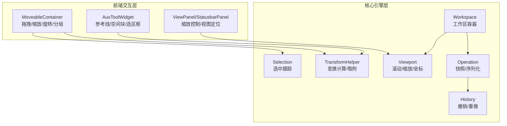
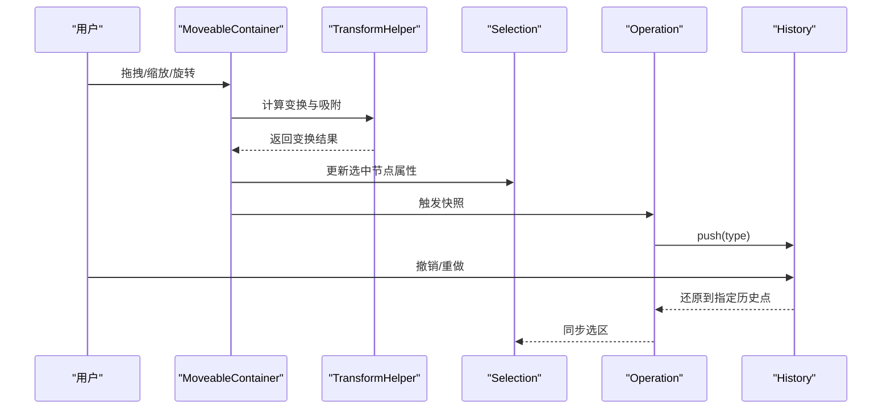
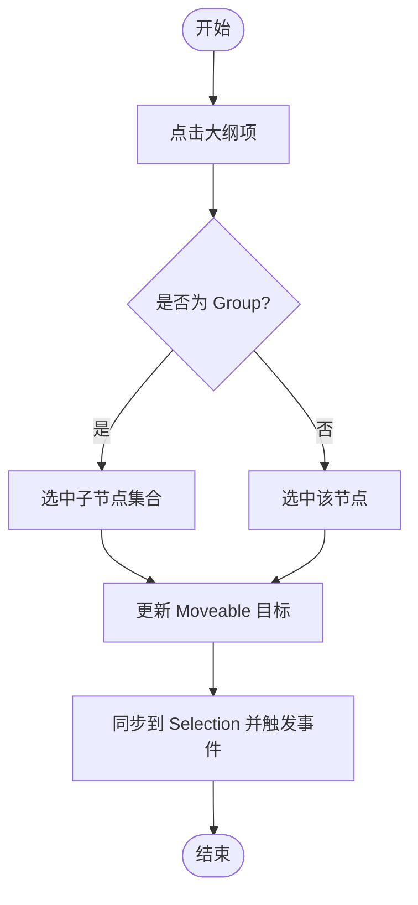
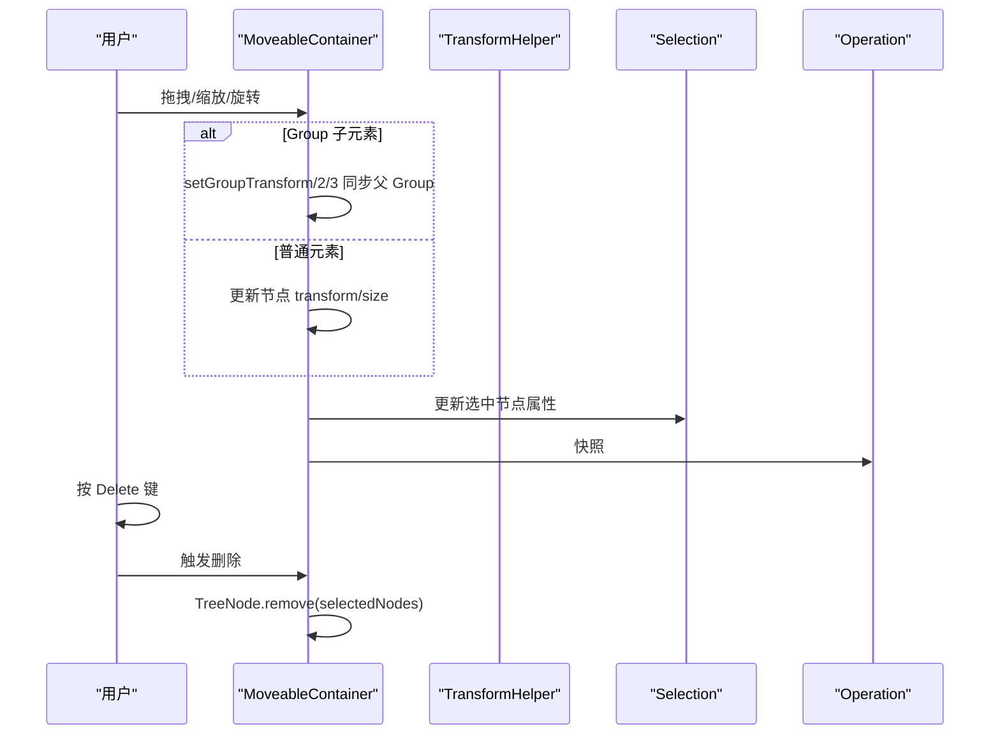
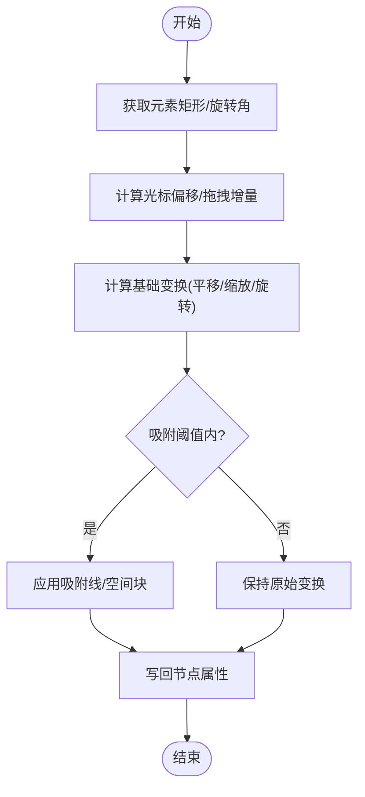
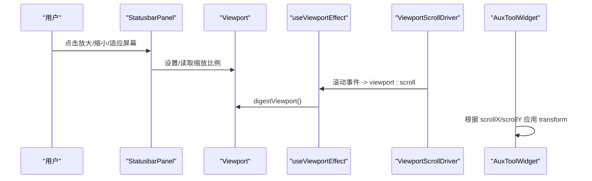
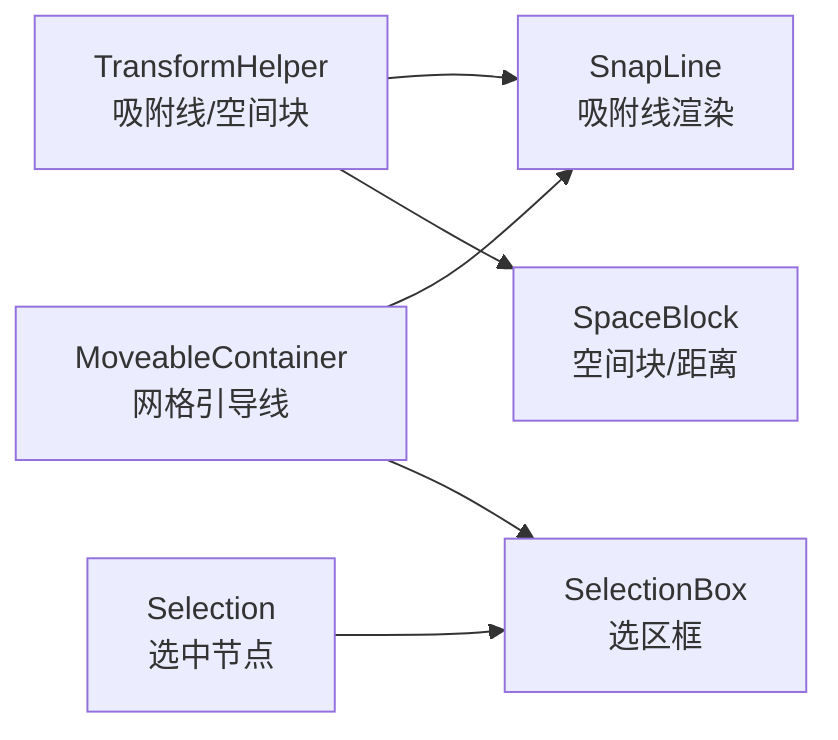
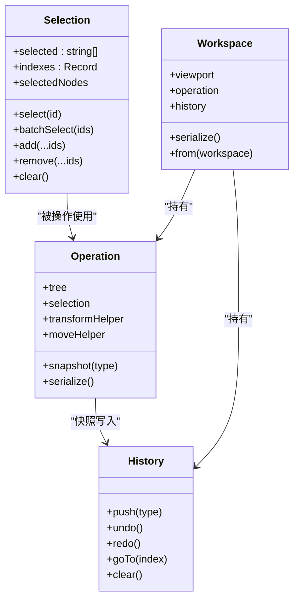
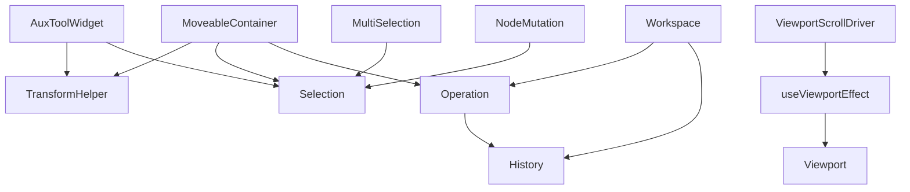

# 画布操作

<cite>
**本文引用的文件**
- [MoveableContainer.tsx](file://packages/react/src/containers/MoveableContainer.tsx)
- [useMoveabeControl.ts](file://editor/src/hooks/useMoveabeControl.ts)
- [useMarkNodeGroup.ts](file://editor/src/hooks/useMarkNodeGroup.ts)
- [TransformHelper.ts](file://packages/core/src/models/TransformHelper.ts)
- [useResizeEffect.ts](file://packages/core/src/effects/useResizeEffect.ts)
- [AuxToolWidget/index.tsx](file://packages/react/src/widgets/AuxToolWidget/index.tsx)
- [Selection.tsx](file://packages/react/src/widgets/AuxToolWidget/Selection.tsx)
- [SnapLine.tsx](file://packages/react/src/widgets/AuxToolWidget/SnapLine.tsx)
- [SpaceBlock.tsx](file://packages/react/src/widgets/AuxToolWidget/SpaceBlock.tsx)
- [History.ts](file://packages/core/src/models/History.ts)
- [Operation.ts](file://packages/core/src/models/Operation.ts)
- [Selection.ts（核心）](file://packages/core/src/models/Selection.ts)
- [Workspace.ts](file://packages/core/src/models/Workspace.ts)
- [Viewport.ts](file://packages/core/src/models/Viewport.ts)
- [useViewportEffect.ts](file://packages/core/src/effects/useViewportEffect.ts)
- [ViewportScrollDriver.ts](file://packages/core/src/drivers/ViewportScrollDriver.ts)
- [ViewPanel.tsx](file://packages/react/src/panels/ViewPanel.tsx)
- [StatusbarPanel.tsx](file://packages/react/src/panels/StatusbarPanel.tsx)
- [MultiSelection.ts](file://packages/core/src/shortcuts/MultiSelection.ts)
- [NodeMutation.ts](file://packages/core/src/shortcuts/NodeMutation.ts)
- [Delete.tsx](file://packages/react/src/widgets/AuxToolWidget/Delete.tsx)
</cite>

## 目录
1. [简介](#简介)
2. [项目结构](#项目结构)
3. [核心组件](#核心组件)
4. [架构总览](#架构总览)
5. [详细组件分析](#详细组件分析)
6. [依赖关系分析](#依赖关系分析)
7. [性能考量](#性能考量)
8. [故障排查指南](#故障排查指南)
9. [结论](#结论)
10. [附录](#附录)

## 简介
本文件面向 Slides Engine 的“画布操作”主题，系统性梳理并解释以下内容：
- 元素选择、移动、缩放、旋转、删除等基础操作
- 变换系统（CSS Transform 应用、矩阵计算、坐标系转换）
- 画布导航（缩放控制、平移滚动、视图定位）
- 辅助功能（网格、参考线、对齐、选区）
- 状态管理（选中元素跟踪、操作历史、撤销重做）
- 扩展指南（自定义操作、新增变换类型、性能优化）

## 项目结构
围绕画布操作的关键模块分布于 React 前端与 Core 核心模型之间，形成“前端交互层 + 核心引擎层”的协作关系：
- 前端交互层：通过 Moveable/Selecto 提供拖拽、框选、分组/解组等交互；通过 AuxToolWidget 提供参考线、空间块、选区框等可视化辅助。
- 核心引擎层：通过 TransformHelper 实现变换计算与吸附；通过 Selection/Operation/History 管理选中状态与历史；通过 Workspace/Viewport 管理视图与滚动。

图表来源
- [MoveableContainer.tsx:1-522](file://packages/react/src/containers/MoveableContainer.tsx#L1-L522)
- [AuxToolWidget/index.tsx:1-41](file://packages/react/src/widgets/AuxToolWidget/index.tsx#L1-L41)
- [TransformHelper.ts:1-649](file://packages/core/src/models/TransformHelper.ts#L1-L649)
- [Selection.ts（核心）:1-193](file://packages/core/src/models/Selection.ts#L1-L193)
- [Operation.ts:1-99](file://packages/core/src/models/Operation.ts#L1-L99)
- [History.ts:1-126](file://packages/core/src/models/History.ts#L1-L126)
- [Workspace.ts:1-146](file://packages/core/src/models/Workspace.ts#L1-L146)
- [Viewport.ts:107-164](file://packages/core/src/models/Viewport.ts#L107-L164)

章节来源
- [MoveableContainer.tsx:1-522](file://packages/react/src/containers/MoveableContainer.tsx#L1-L522)
- [AuxToolWidget/index.tsx:1-41](file://packages/react/src/widgets/AuxToolWidget/index.tsx#L1-L41)
- [TransformHelper.ts:1-649](file://packages/core/src/models/TransformHelper.ts#L1-L649)
- [Selection.ts（核心）:1-193](file://packages/core/src/models/Selection.ts#L1-L193)
- [Operation.ts:1-99](file://packages/core/src/models/Operation.ts#L1-L99)
- [History.ts:1-126](file://packages/core/src/models/History.ts#L1-L126)
- [Workspace.ts:1-146](file://packages/core/src/models/Workspace.ts#L1-L146)
- [Viewport.ts:107-164](file://packages/core/src/models/Viewport.ts#L107-L164)

## 核心组件
- 画布容器与交互
  - MoveableContainer：基于 react-moveable/react-selecto，负责元素的拖拽、缩放、旋转、分组/解组、多选、按需更新目标元素等。
  - useMoveabeControl/useMarkNodeGroup：在编辑态下为特定节点提供拖拽/旋转/缩放的事件桥接与分组场景下的位姿同步。
- 变换与吸附
  - TransformHelper：统一的变换计算与吸附逻辑，支持 translate/resize/rotate/scale/round，并提供吸附线、空间块度量。
- 选区与状态
  - Selection：集中式选中集合管理，支持单选/多选/批量选中/清除/交叉选择等。
  - Operation：封装树、选区、变换助手、移动助手、动画引擎，并提供快照能力。
  - History：基于序列化的操作历史，支持 undo/redo/goTo/clear。
- 视图与导航
  - Viewport：封装滚动、缩放、坐标转换、视口尺寸等。
  - ViewPanel/StatusbarPanel：提供缩放按钮、适应屏幕、当前百分比显示等 UI 控制。
  - useViewportEffect/ViewportScrollDriver：订阅视口滚动/尺寸变化事件，驱动视图刷新。
- 辅助工具
  - AuxToolWidget/Selection/SnapLine/SpaceBlock：渲染选区框、吸附参考线、空间块与距离指示。

章节来源
- [MoveableContainer.tsx:1-522](file://packages/react/src/containers/MoveableContainer.tsx#L1-L522)
- [useMoveabeControl.ts:172-253](file://editor/src/hooks/useMoveabeControl.ts#L172-L253)
- [useMarkNodeGroup.ts:157-178](file://editor/src/hooks/useMarkNodeGroup.ts#L157-L178)
- [TransformHelper.ts:1-649](file://packages/core/src/models/TransformHelper.ts#L1-L649)
- [Selection.ts（核心）:1-193](file://packages/core/src/models/Selection.ts#L1-L193)
- [Operation.ts:1-99](file://packages/core/src/models/Operation.ts#L1-L99)
- [History.ts:1-126](file://packages/core/src/models/History.ts#L1-L126)
- [Viewport.ts:107-164](file://packages/core/src/models/Viewport.ts#L107-L164)
- [useViewportEffect.ts:1-29](file://packages/core/src/effects/useViewportEffect.ts#L1-L29)
- [ViewportScrollDriver.ts:1-34](file://packages/core/src/drivers/ViewportScrollDriver.ts#L1-L34)
- [ViewPanel.tsx:1-45](file://packages/react/src/panels/ViewPanel.tsx#L1-L45)
- [StatusbarPanel.tsx:88-125](file://packages/react/src/panels/StatusbarPanel.tsx#L88-L125)
- [AuxToolWidget/index.tsx:1-41](file://packages/react/src/widgets/AuxToolWidget/index.tsx#L1-L41)
- [Selection.tsx:1-90](file://packages/react/src/widgets/AuxToolWidget/Selection.tsx#L1-L90)
- [SnapLine.tsx:1-41](file://packages/react/src/widgets/AuxToolWidget/SnapLine.tsx#L1-L41)
- [SpaceBlock.tsx:1-113](file://packages/react/src/widgets/AuxToolWidget/SpaceBlock.tsx#L1-L113)

## 架构总览
画布操作由“前端交互层 + 核心引擎层 + 视图层”三部分协同完成：
- 前端交互层通过 Moveable/Selecto 将用户输入转化为节点属性变更与选区变化。
- 核心引擎层通过 TransformHelper 计算变换与吸附，通过 Selection/Operation/History 维护状态与历史。
- 视图层通过 Viewport/ScrollDriver/Effects 管理滚动与缩放，配合 AuxToolWidget 渲染吸附与度量。

图表来源
- [MoveableContainer.tsx:280-433](file://packages/react/src/containers/MoveableContainer.tsx#L280-L433)
- [TransformHelper.ts:545-621](file://packages/core/src/models/TransformHelper.ts#L545-L621)
- [Selection.ts（核心）:12-46](file://packages/core/src/models/Selection.ts#L12-L46)
- [Operation.ts:69-80](file://packages/core/src/models/Operation.ts#L69-L80)
- [History.ts:52-106](file://packages/core/src/models/History.ts#L52-L106)

## 详细组件分析

### 1) 元素选择与多选
- 单选/多选：通过 Selecto 的框选与 Shift/Ctrl 组合键实现；Selection 提供 batchSelect/batchSafeSelect/clear/add/remove 等方法。
- 与大纲联动：当点击大纲树项时，MoveableContainer 会根据节点类型（普通节点或 Group）决定选中目标集合。
- 与画布根节点的关系：若选中根节点则代表全选画布，此时属性面板标题切换为画布设置。

图表来源
- [MoveableContainer.tsx:84-116](file://packages/react/src/containers/MoveableContainer.tsx#L84-L116)
- [MoveableContainer.tsx:140-211](file://packages/react/src/containers/MoveableContainer.tsx#L140-L211)
- [Selection.ts（核心）:78-90](file://packages/core/src/models/Selection.ts#L78-L90)

章节来源
- [MoveableContainer.tsx:84-116](file://packages/react/src/containers/MoveableContainer.tsx#L84-L116)
- [MoveableContainer.tsx:140-211](file://packages/react/src/containers/MoveableContainer.tsx#L140-L211)
- [Selection.ts（核心）:12-46](file://packages/core/src/models/Selection.ts#L12-L46)
- [MultiSelection.ts:1-34](file://packages/core/src/shortcuts/MultiSelection.ts#L1-L34)

### 2) 移动/缩放/旋转/删除
- 移动/缩放/旋转：MoveableContainer 在 onDrag/onResize/onRotate 中读取样式变换并写回节点属性；同时对 Group 场景进行额外处理（如 setGroupTransform/setGroupTransform2/setGroupTransform3）。
- 删除：支持快捷键 Backspace/Delete 与辅助工具 Delete 按钮，调用 TreeNode.remove 执行删除。
- 分组/解组：onDragGroup/onResizeGroup/onRotateGroup 事件中对父 Group 的位姿进行同步更新。

图表来源
- [MoveableContainer.tsx:242-279](file://packages/react/src/containers/MoveableContainer.tsx#L242-L279)
- [MoveableContainer.tsx:280-433](file://packages/react/src/containers/MoveableContainer.tsx#L280-L433)
- [useMoveabeControl.ts:172-253](file://editor/src/hooks/useMoveabeControl.ts#L172-L253)
- [useMarkNodeGroup.ts:157-178](file://editor/src/hooks/useMarkNodeGroup.ts#L157-L178)
- [NodeMutation.ts:7-15](file://packages/core/src/shortcuts/NodeMutation.ts#L7-L15)
- [Delete.tsx:12-27](file://packages/react/src/widgets/AuxToolWidget/Delete.tsx#L12-L27)

章节来源
- [MoveableContainer.tsx:242-279](file://packages/react/src/containers/MoveableContainer.tsx#L242-L279)
- [MoveableContainer.tsx:280-433](file://packages/react/src/containers/MoveableContainer.tsx#L280-L433)
- [useMoveabeControl.ts:172-253](file://editor/src/hooks/useMoveabeControl.ts#L172-L253)
- [useMarkNodeGroup.ts:157-178](file://editor/src/hooks/useMarkNodeGroup.ts#L157-L178)
- [NodeMutation.ts:7-15](file://packages/core/src/shortcuts/NodeMutation.ts#L7-L15)
- [Delete.tsx:12-27](file://packages/react/src/widgets/AuxToolWidget/Delete.tsx#L12-L27)

### 3) 变换系统与坐标转换
- CSS Transform 应用：MoveableContainer 在事件回调中将四舍五入后的数值写入节点 style.transform/width/height，确保像素对齐。
- 矩阵与坐标：TransformHelper 使用光标偏移、拖拽起始偏移、节点矩形等计算，结合吸附线与空间块进行吸附与度量。
- 视口缩放：在缩放时，MoveableContainer 强制更新目标以适配 viewportPercentage，保证拖拽与吸附在不同缩放下一致。

图表来源
- [TransformHelper.ts:103-189](file://packages/core/src/models/TransformHelper.ts#L103-L189)
- [TransformHelper.ts:485-517](file://packages/core/src/models/TransformHelper.ts#L485-L517)
- [MoveableContainer.tsx:283-317](file://packages/react/src/containers/MoveableContainer.tsx#L283-L317)
- [MoveableContainer.tsx:122-138](file://packages/react/src/containers/MoveableContainer.tsx#L122-L138)

章节来源
- [TransformHelper.ts:103-189](file://packages/core/src/models/TransformHelper.ts#L103-L189)
- [TransformHelper.ts:485-517](file://packages/core/src/models/TransformHelper.ts#L485-L517)
- [MoveableContainer.tsx:283-317](file://packages/react/src/containers/MoveableContainer.tsx#L283-L317)
- [MoveableContainer.tsx:122-138](file://packages/react/src/containers/MoveableContainer.tsx#L122-L138)

### 4) 画布导航（缩放/平移/视图定位）
- 缩放控制：StatusbarPanel 提供放大/缩小/适应屏幕按钮；ViewPanel/StatusbarPanel 读取全局 viewportPercentage 并更新 UI。
- 平移滚动：ViewportScrollDriver 订阅滚动事件，派发 viewport:scroll 事件；useViewportEffect 监听并刷新视图与大纲。
- 视图定位：AuxToolWidget 在滚动时通过 perspective+translate3d 对齐辅助层与画布内容。

图表来源
- [StatusbarPanel.tsx:88-125](file://packages/react/src/panels/StatusbarPanel.tsx#L88-L125)
- [ViewPanel.tsx:24-45](file://packages/react/src/panels/ViewPanel.tsx#L24-L45)
- [useViewportEffect.ts:1-29](file://packages/core/src/effects/useViewportEffect.ts#L1-L29)
- [ViewportScrollDriver.ts:1-34](file://packages/core/src/drivers/ViewportScrollDriver.ts#L1-L34)
- [AuxToolWidget/index.tsx:17-23](file://packages/react/src/widgets/AuxToolWidget/index.tsx#L17-L23)
- [Viewport.ts:107-164](file://packages/core/src/models/Viewport.ts#L107-L164)

章节来源
- [StatusbarPanel.tsx:88-125](file://packages/react/src/panels/StatusbarPanel.tsx#L88-L125)
- [ViewPanel.tsx:24-45](file://packages/react/src/panels/ViewPanel.tsx#L24-L45)
- [useViewportEffect.ts:1-29](file://packages/core/src/effects/useViewportEffect.ts#L1-L29)
- [ViewportScrollDriver.ts:1-34](file://packages/core/src/drivers/ViewportScrollDriver.ts#L1-L34)
- [AuxToolWidget/index.tsx:17-23](file://packages/react/src/widgets/AuxToolWidget/index.tsx#L17-L23)
- [Viewport.ts:107-164](file://packages/core/src/models/Viewport.ts#L107-L164)

### 5) 辅助功能（网格/参考线/对齐/选区）
- 参考线：SnapLine 渲染吸附线，颜色与层级固定，仅在拖拽状态显示。
- 空间块与度量：SpaceBlock 渲染吸附区域与距离指示，支持水平/垂直两类刻度。
- 选区框：SelectionBox 基于节点偏移矩形绘制绝对定位的选区边框，支持辅助手柄与帮助器。
- 网格：MoveableContainer 在初始化时提供水平/垂直网格引导线（百分比），便于对齐。

图表来源
- [TransformHelper.ts:227-299](file://packages/core/src/models/TransformHelper.ts#L227-L299)
- [SnapLine.tsx:6-38](file://packages/react/src/widgets/AuxToolWidget/SnapLine.tsx#L6-L38)
- [SpaceBlock.tsx:7-110](file://packages/react/src/widgets/AuxToolWidget/SpaceBlock.tsx#L7-L110)
- [Selection.tsx:22-63](file://packages/react/src/widgets/AuxToolWidget/Selection.tsx#L22-L63)
- [MoveableContainer.tsx:447-448](file://packages/react/src/containers/MoveableContainer.tsx#L447-L448)

章节来源
- [TransformHelper.ts:227-299](file://packages/core/src/models/TransformHelper.ts#L227-L299)
- [SnapLine.tsx:6-38](file://packages/react/src/widgets/AuxToolWidget/SnapLine.tsx#L6-L38)
- [SpaceBlock.tsx:7-110](file://packages/react/src/widgets/AuxToolWidget/SpaceBlock.tsx#L7-L110)
- [Selection.tsx:22-63](file://packages/react/src/widgets/AuxToolWidget/Selection.tsx#L22-L63)
- [MoveableContainer.tsx:447-448](file://packages/react/src/containers/MoveableContainer.tsx#L447-L448)

### 6) 状态管理（选中/历史/撤销重做）
- 选中跟踪：Selection 维护 selected 数组与 indexes 映射，提供 select/batchSelect/add/remove/clear 等动作，并在每次变更时触发 SelectNodeEvent/UnSelectNodeEvent。
- 快照与历史：Operation.snapshot 在空闲时间将当前序列化状态推入 History；History 支持 push/undo/redo/goTo/clear，并限制最大容量。
- 工作区：Workspace 封装 Viewport/Operation/History，并在 onPush/onRedo/onUndo/onGoto 时派发对应事件。

图表来源
- [Selection.ts（核心）:12-193](file://packages/core/src/models/Selection.ts#L12-L193)
- [Operation.ts:16-99](file://packages/core/src/models/Operation.ts#L16-L99)
- [History.ts:21-126](file://packages/core/src/models/History.ts#L21-L126)
- [Workspace.ts:37-146](file://packages/core/src/models/Workspace.ts#L37-L146)

章节来源
- [Selection.ts（核心）:12-193](file://packages/core/src/models/Selection.ts#L12-L193)
- [Operation.ts:69-80](file://packages/core/src/models/Operation.ts#L69-L80)
- [History.ts:52-106](file://packages/core/src/models/History.ts#L52-L106)
- [Workspace.ts:82-98](file://packages/core/src/models/Workspace.ts#L82-L98)

## 依赖关系分析
- 前端交互依赖核心模型：MoveableContainer 依赖 TransformHelper/Selection/Operation；AuxToolWidget 依赖 TransformHelper/Selection。
- 视图层事件：ViewportScrollDriver 与 useViewportEffect 形成滚动事件链路；Viewport 提供坐标与缩放信息。
- 快捷键：MultiSelection/NodeMutation 提供多选与节点增删改的快捷操作。

图表来源
- [MoveableContainer.tsx:1-522](file://packages/react/src/containers/MoveableContainer.tsx#L1-L522)
- [AuxToolWidget/index.tsx:1-41](file://packages/react/src/widgets/AuxToolWidget/index.tsx#L1-L41)
- [TransformHelper.ts:1-649](file://packages/core/src/models/TransformHelper.ts#L1-L649)
- [Selection.ts（核心）:1-193](file://packages/core/src/models/Selection.ts#L1-L193)
- [Operation.ts:1-99](file://packages/core/src/models/Operation.ts#L1-L99)
- [History.ts:1-126](file://packages/core/src/models/History.ts#L1-L126)
- [Workspace.ts:1-146](file://packages/core/src/models/Workspace.ts#L1-L146)
- [ViewportScrollDriver.ts:1-34](file://packages/core/src/drivers/ViewportScrollDriver.ts#L1-L34)
- [useViewportEffect.ts:1-29](file://packages/core/src/effects/useViewportEffect.ts#L1-L29)
- [Viewport.ts:107-164](file://packages/core/src/models/Viewport.ts#L107-L164)
- [MultiSelection.ts:1-34](file://packages/core/src/shortcuts/MultiSelection.ts#L1-L34)
- [NodeMutation.ts:1-49](file://packages/core/src/shortcuts/NodeMutation.ts#L1-L49)

章节来源
- [MoveableContainer.tsx:1-522](file://packages/react/src/containers/MoveableContainer.tsx#L1-L522)
- [AuxToolWidget/index.tsx:1-41](file://packages/react/src/widgets/AuxToolWidget/index.tsx#L1-L41)
- [TransformHelper.ts:1-649](file://packages/core/src/models/TransformHelper.ts#L1-L649)
- [Selection.ts（核心）:1-193](file://packages/core/src/models/Selection.ts#L1-L193)
- [Operation.ts:1-99](file://packages/core/src/models/Operation.ts#L1-L99)
- [History.ts:1-126](file://packages/core/src/models/History.ts#L1-L126)
- [Workspace.ts:1-146](file://packages/core/src/models/Workspace.ts#L1-L146)
- [ViewportScrollDriver.ts:1-34](file://packages/core/src/drivers/ViewportScrollDriver.ts#L1-L34)
- [useViewportEffect.ts:1-29](file://packages/core/src/effects/useViewportEffect.ts#L1-L29)
- [Viewport.ts:107-164](file://packages/core/src/models/Viewport.ts#L107-L164)
- [MultiSelection.ts:1-34](file://packages/core/src/shortcuts/MultiSelection.ts#L1-L34)
- [NodeMutation.ts:1-49](file://packages/core/src/shortcuts/NodeMutation.ts#L1-L49)

## 性能考量
- 事件节流与空闲调度：Operation.snapshot 使用 requestIdle 推迟历史快照，避免频繁写入；TransformHelper 在吸附过程中仅在需要时重新计算吸附线。
- DOM 更新最小化：MoveableContainer 在事件回调中对 transform/width/height 进行四舍五入并批量写入，减少不必要的重排。
- 视图同步：AuxToolWidget 在滚动时使用 perspective+translate3d 同步辅助层，避免重复布局计算。
- 选择集优化：Selection 使用 indexes 映射快速判断包含关系，批量操作时减少遍历成本。

## 故障排查指南
- 画布缩放后拖拽错位
  - 检查 viewportPercentage 是否正确传递至 MoveableContainer；确认 onDrag/onResize/onRotate 回调中对 transform 的四舍五入与写回。
  - 参考路径：[MoveableContainer.tsx:122-138](file://packages/react/src/containers/MoveableContainer.tsx#L122-L138)，[MoveableContainer.tsx:283-317](file://packages/react/src/containers/MoveableContainer.tsx#L283-L317)
- 分组元素拖拽/旋转异常
  - 确认 onDragGroup/onRotateGroup/onResizeGroup 是否正确同步父 Group 的 transform/尺寸；注意初始值与增量的累积。
  - 参考路径：[MoveableContainer.tsx:350-429](file://packages/react/src/containers/MoveableContainer.tsx#L350-L429)
- 参考线/空间块不显示
  - 确认 cursor.status 为 Dragging；检查 TransformHelper.closestSnapLines/thresholdSpaceBlocks/measurerSpaceBlocks 是否有数据。
  - 参考路径：[SnapLine.tsx:23-38](file://packages/react/src/widgets/AuxToolWidget/SnapLine.tsx#L23-L38)，[SpaceBlock.tsx:12-110](file://packages/react/src/widgets/AuxToolWidget/SpaceBlock.tsx#L12-L110)
- 撤销/重做无效
  - 检查 History.locking 是否被外部锁定；确认 Workspace.history.onPush/onRedo/onUndo/onGoto 是否正常派发事件。
  - 参考路径：[History.ts:52-106](file://packages/core/src/models/History.ts#L52-L106)，[Workspace.ts:82-98](file://packages/core/src/models/Workspace.ts#L82-L98)
- 删除快捷键无效
  - 检查 MultiSelection/NodeMutation 的快捷键组合是否命中；确认当前焦点不在富文本编辑器中。
  - 参考路径：[NodeMutation.ts:7-15](file://packages/core/src/shortcuts/NodeMutation.ts#L7-L15)，[MultiSelection.ts:21-34](file://packages/core/src/shortcuts/MultiSelection.ts#L21-L34)

章节来源
- [MoveableContainer.tsx:122-138](file://packages/react/src/containers/MoveableContainer.tsx#L122-L138)
- [MoveableContainer.tsx:283-317](file://packages/react/src/containers/MoveableContainer.tsx#L283-L317)
- [MoveableContainer.tsx:350-429](file://packages/react/src/containers/MoveableContainer.tsx#L350-L429)
- [SnapLine.tsx:23-38](file://packages/react/src/widgets/AuxToolWidget/SnapLine.tsx#L23-L38)
- [SpaceBlock.tsx:12-110](file://packages/react/src/widgets/AuxToolWidget/SpaceBlock.tsx#L12-L110)
- [History.ts:52-106](file://packages/core/src/models/History.ts#L52-L106)
- [Workspace.ts:82-98](file://packages/core/src/models/Workspace.ts#L82-L98)
- [NodeMutation.ts:7-15](file://packages/core/src/shortcuts/NodeMutation.ts#L7-L15)
- [MultiSelection.ts:21-34](file://packages/core/src/shortcuts/MultiSelection.ts#L21-L34)

## 结论
Slides Engine 的画布操作以 Moveable/Selecto 为核心交互入口，结合 TransformHelper 的变换与吸附、Selection 的选中管理、History 的历史快照，以及 Viewport 的滚动与缩放，形成了完整的可编辑画布体系。通过 AuxToolWidget 提供的参考线与空间块，进一步提升了设计精度与效率。整体架构清晰、职责分离明确，具备良好的扩展性与可维护性。

## 附录
- 扩展指南
  - 自定义操作：在 Operation 中注册新事件并在 Workspace.history 的 onPush/onRedo/onUndo/onGoto 中派发，确保历史一致性。
  - 新增变换类型：在 TransformHelper 中扩展 dragStart/dragMove/dragEnd 与相应计算函数，并在前端 MoveableContainer 中映射到对应事件。
  - 性能优化：利用 requestIdle 与四舍五入策略减少重绘；在吸附计算中缓存阈值线与空间块；在滚动同步中使用 transform3d 避免布局抖动。