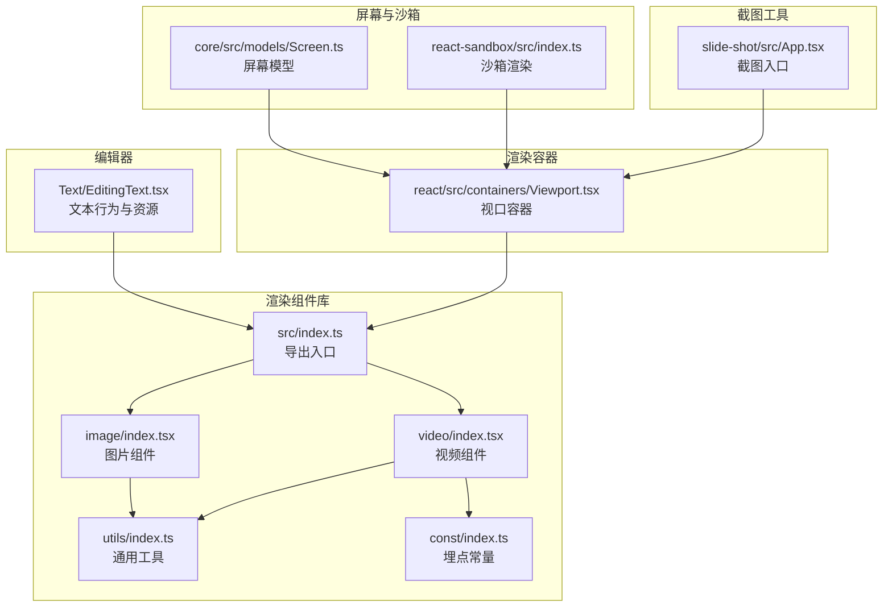
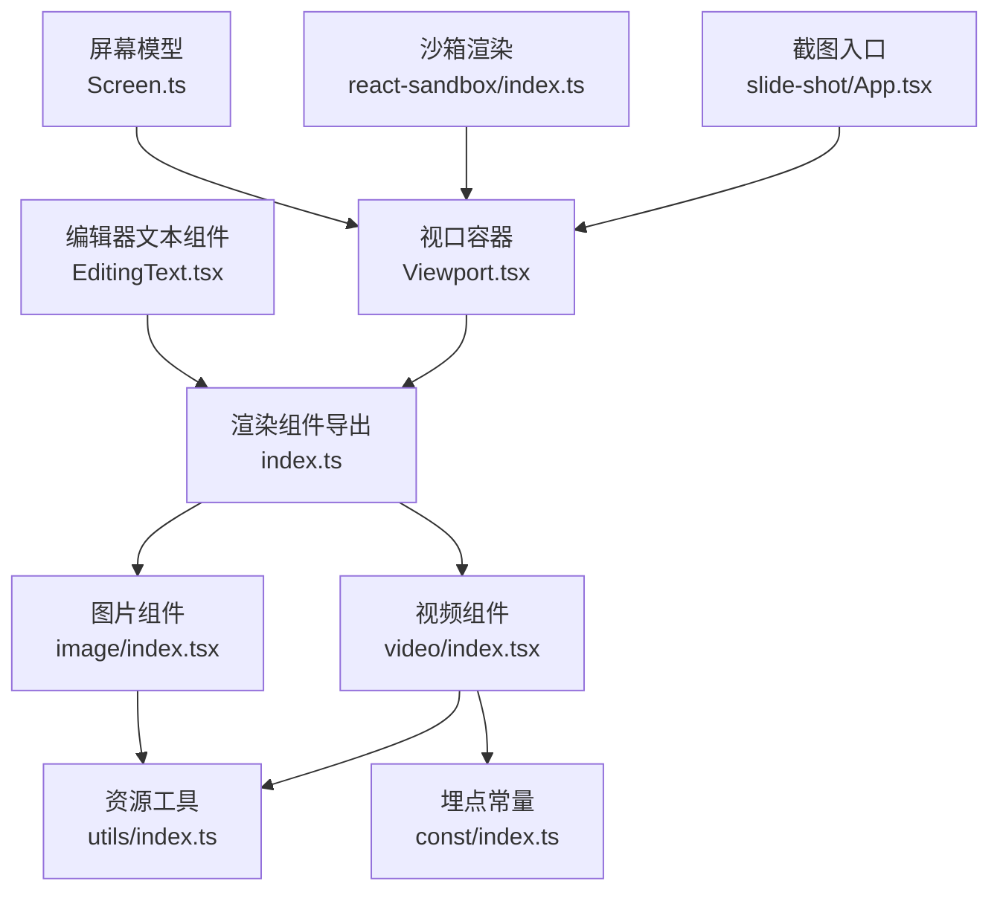
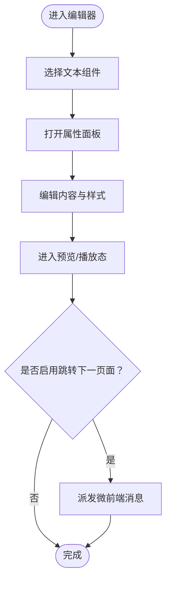
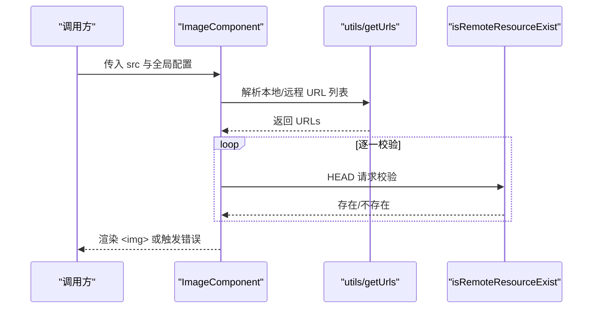
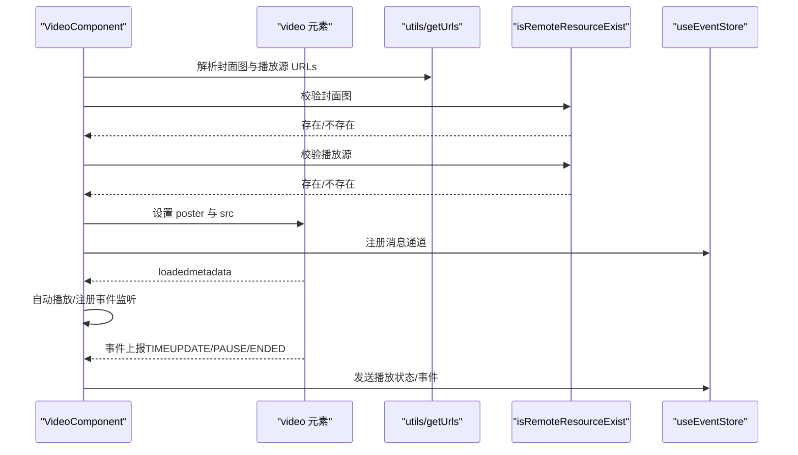
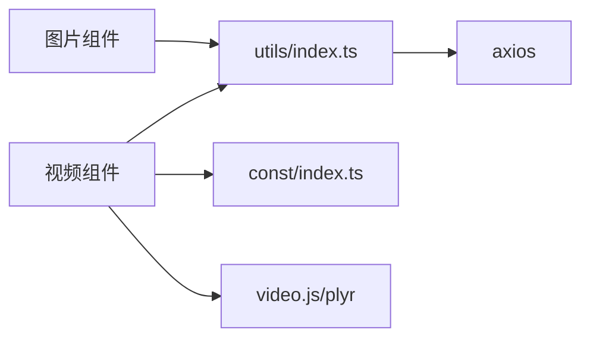

# 基础组件

<cite>
**本文引用的文件**
- [common/render-components/src/index.ts](file://common/render-components/src/index.ts)
- [common/render-components/src/image/index.tsx](file://common/render-components/src/image/index.tsx)
- [common/render-components/src/image/Image.tsx](file://common/render-components/src/image/Image.tsx)
- [common/render-components/src/image/type.ts](file://common/render-components/src/image/type.ts)
- [common/render-components/src/video/index.tsx](file://common/render-components/src/video/index.tsx)
- [common/render-components/src/video/type.ts](file://common/render-components/src/video/type.ts)
- [common/render-components/src/video/const.ts](file://common/render-components/src/video/const.ts)
- [common/render-components/src/utils/index.ts](file://common/render-components/src/utils/index.ts)
- [common/render-components/src/const/index.ts](file://common/render-components/src/const/index.ts)
- [editor/src/components/Text/EditingText.tsx](file://editor/src/components/Text/EditingText.tsx)
- [packages/react/src/containers/Viewport.tsx](file://packages/react/src/containers/Viewport.tsx)
- [packages/core/src/models/Screen.ts](file://packages/core/src/models/Screen.ts)
- [packages/react-sandbox/src/index.ts](file://packages/react-sandbox/src/index.ts)
- [common/slide-shot/src/App.tsx](file://common/slide-shot/src/App.tsx)
</cite>

## 目录
1. [引言](#引言)
2. [项目结构](#项目结构)
3. [核心组件](#核心组件)
4. [架构总览](#架构总览)
5. [详细组件分析](#详细组件分析)
6. [依赖分析](#依赖分析)
7. [性能考量](#性能考量)
8. [故障排查指南](#故障排查指南)
9. [结论](#结论)
10. [附录](#附录)

## 引言
本章节面向 Slides Engine 的基础组件体系，重点覆盖文本、图片、视频等核心元素的实现原理与使用方法。文档将从属性定义、事件处理、样式定制、渲染机制（JSX 渲染与 Canvas 渲染差异）、最佳实践（性能优化、兼容性、错误处理）等方面展开，并结合仓库中的实际实现文件给出定位路径与参考来源。

## 项目结构
Slides Engine 的基础组件主要分布在以下位置：
- 渲染组件库：common/render-components
- 编辑器组件：editor/src/components
- 渲染容器与视口：packages/react/src/containers
- 屏幕模型与沙箱：packages/core、packages/react-sandbox
- 截图工具：common/slide-shot

下面以“渲染组件库”为中心，梳理其子模块与职责边界。

**图表来源**
- [common/render-components/src/index.ts:1-3](file://common/render-components/src/index.ts#L1-L3)
- [common/render-components/src/image/index.tsx:1-186](file://common/render-components/src/image/index.tsx#L1-L186)
- [common/render-components/src/video/index.tsx:1-472](file://common/render-components/src/video/index.tsx#L1-L472)
- [common/render-components/src/utils/index.ts:1-236](file://common/render-components/src/utils/index.ts#L1-L236)
- [common/render-components/src/const/index.ts:1-29](file://common/render-components/src/const/index.ts#L1-L29)
- [editor/src/components/Text/EditingText.tsx:1-99](file://editor/src/components/Text/EditingText.tsx#L1-L99)
- [packages/react/src/containers/Viewport.tsx:187-215](file://packages/react/src/containers/Viewport.tsx#L187-L215)
- [packages/core/src/models/Screen.ts:1-83](file://packages/core/src/models/Screen.ts#L1-L83)
- [packages/react-sandbox/src/index.ts:1-132](file://packages/react-sandbox/src/index.ts#L1-L132)
- [common/slide-shot/src/App.tsx:1-25](file://common/slide-shot/src/App.tsx#L1-L25)

**章节来源**
- [common/render-components/src/index.ts:1-3](file://common/render-components/src/index.ts#L1-L3)
- [common/render-components/src/image/index.tsx:1-186](file://common/render-components/src/image/index.tsx#L1-L186)
- [common/render-components/src/video/index.tsx:1-472](file://common/render-components/src/video/index.tsx#L1-L472)
- [common/render-components/src/utils/index.ts:1-236](file://common/render-components/src/utils/index.ts#L1-L236)
- [common/render-components/src/const/index.ts:1-29](file://common/render-components/src/const/index.ts#L1-L29)
- [editor/src/components/Text/EditingText.tsx:1-99](file://editor/src/components/Text/EditingText.tsx#L1-L99)
- [packages/react/src/containers/Viewport.tsx:187-215](file://packages/react/src/containers/Viewport.tsx#L187-L215)
- [packages/core/src/models/Screen.ts:1-83](file://packages/core/src/models/Screen.ts#L1-L83)
- [packages/react-sandbox/src/index.ts:1-132](file://packages/react-sandbox/src/index.ts#L1-L132)
- [common/slide-shot/src/App.tsx:1-25](file://common/slide-shot/src/App.tsx#L1-L25)

## 核心组件
本节概述基础组件的职责与共性：
- 统一属性接口：各组件均通过 IComponentProps 定义通用属性（如 id、mode、pageId、style、globalConfig、globalProps、treeNodeProps、info 等），确保跨组件一致性。
- 资源加载策略：通过 utils/getUrls 与 utils/isRemoteResourceExist 实现本地优先、远程兜底、超时与重试控制。
- 事件与埋点：通过 const/index.ts 定义日志名称、动作与资源类型；组件在关键节点上报加载开始/结束、错误、信令收发与视频事件。
- 视频播放器：基于 video.js/HTMLVideoElement，支持 sender/edit/preview 模式下的控件与自动播放策略，以及断线重连的状态恢复。
- 文本组件：编辑态下提供内容可编辑属性与默认样式，配合编辑器 Schema 定义信息与样式面板。

**章节来源**
- [common/render-components/src/image/type.ts:3-32](file://common/render-components/src/image/type.ts#L3-L32)
- [common/render-components/src/video/type.ts:2-29](file://common/render-components/src/video/type.ts#L2-L29)
- [common/render-components/src/utils/index.ts:164-208](file://common/render-components/src/utils/index.ts#L164-L208)
- [common/render-components/src/utils/index.ts:129-157](file://common/render-components/src/utils/index.ts#L129-L157)
- [common/render-components/src/const/index.ts:1-29](file://common/render-components/src/const/index.ts#L1-L29)
- [common/render-components/src/video/index.tsx:16-33](file://common/render-components/src/video/index.tsx#L16-L33)
- [editor/src/components/Text/EditingText.tsx:77-99](file://editor/src/components/Text/EditingText.tsx#L77-L99)

## 架构总览
下图展示基础组件在渲染流程中的交互关系：编辑器通过行为与资源定义文本组件；渲染层通过 Viewport 容器承载组件；图片与视频组件分别封装资源加载与播放器逻辑；沙箱与屏幕模型支撑运行环境与尺寸适配；截图工具基于渲染根节点生成快照。

**图表来源**
- [editor/src/components/Text/EditingText.tsx:1-99](file://editor/src/components/Text/EditingText.tsx#L1-L99)
- [common/render-components/src/index.ts:1-3](file://common/render-components/src/index.ts#L1-L3)
- [common/render-components/src/image/index.tsx:1-186](file://common/render-components/src/image/index.tsx#L1-L186)
- [common/render-components/src/video/index.tsx:1-472](file://common/render-components/src/video/index.tsx#L1-L472)
- [common/render-components/src/utils/index.ts:1-236](file://common/render-components/src/utils/index.ts#L1-L236)
- [common/render-components/src/const/index.ts:1-29](file://common/render-components/src/const/index.ts#L1-L29)
- [packages/react/src/containers/Viewport.tsx:187-215](file://packages/react/src/containers/Viewport.tsx#L187-L215)
- [packages/core/src/models/Screen.ts:1-83](file://packages/core/src/models/Screen.ts#L1-L83)
- [packages/react-sandbox/src/index.ts:1-132](file://packages/react-sandbox/src/index.ts#L1-L132)
- [common/slide-shot/src/App.tsx:1-25](file://common/slide-shot/src/App.tsx#L1-L25)

## 详细组件分析

### 文本组件
- 属性与行为
  - 通过 createBehavior 定义组件选择器、属性 Schema 与默认值，支持信息与样式面板联动。
  - 通过 createResource 提供拖拽资源，初始化默认 props。
  - 编辑态下，节点具备 data-content-editable 等属性，便于编辑器接管内容编辑。
- 样式与交互
  - 默认样式包含绝对定位、背景色、边框与内边距，便于在画布中直观呈现。
  - 支持点击跳转下一页面（微前端环境）。
- 使用场景
  - 在编辑器中添加文本资源，配置文案与样式，进入预览或播放态后按需启用交互。

**图表来源**
- [editor/src/components/Text/EditingText.tsx:25-58](file://editor/src/components/Text/EditingText.tsx#L25-L58)
- [editor/src/components/Text/EditingText.tsx:61-75](file://editor/src/components/Text/EditingText.tsx#L61-L75)
- [editor/src/components/Text/EditingText.tsx:77-99](file://editor/src/components/Text/EditingText.tsx#L77-L99)

**章节来源**
- [editor/src/components/Text/EditingText.tsx:1-99](file://editor/src/components/Text/EditingText.tsx#L1-L99)

### 图片组件
- 属性定义
  - IComponentProps：统一承载 id、mode、pageId、style、globalConfig、globalProps、treeNodeProps、info、sendLog 等。
  - ILdImageProps：面向更细粒度的图片能力（如资源状态变更回调、加载事件等）。
- 渲染与资源加载
  - 通过 utils/getUrls 生成本地与远程 URL 列表，优先尝试本地，失败则回退远程。
  - 使用 utils/isRemoteResourceExist 进行 HEAD 校验，支持超时与重试。
  - ImageComponent 内部维护索引与错误处理，逐个尝试直到命中或失败。
- 事件与埋点
  - 加载开始/结束、错误、移除等生命周期事件均上报埋点。
  - 支持点击跳转下一页面（微前端环境）。
- 样式定制
  - 外层容器支持绝对定位与样式合并；内部 img 宽高继承父容器并可圆角继承。

**图表来源**
- [common/render-components/src/image/index.tsx:69-76](file://common/render-components/src/image/index.tsx#L69-L76)
- [common/render-components/src/image/index.tsx:133-151](file://common/render-components/src/image/index.tsx#L133-L151)
- [common/render-components/src/image/index.tsx:113-130](file://common/render-components/src/image/index.tsx#L113-L130)
- [common/render-components/src/image/Image.tsx:15-26](file://common/render-components/src/image/Image.tsx#L15-L26)
- [common/render-components/src/utils/index.ts:164-208](file://common/render-components/src/utils/index.ts#L164-L208)
- [common/render-components/src/utils/index.ts:129-157](file://common/render-components/src/utils/index.ts#L129-L157)

**章节来源**
- [common/render-components/src/image/index.tsx:1-186](file://common/render-components/src/image/index.tsx#L1-L186)
- [common/render-components/src/image/Image.tsx:1-48](file://common/render-components/src/image/Image.tsx#L1-L48)
- [common/render-components/src/image/type.ts:3-32](file://common/render-components/src/image/type.ts#L3-L32)
- [common/render-components/src/utils/index.ts:1-236](file://common/render-components/src/utils/index.ts#L1-L236)

### 视频组件
- 属性定义
  - IComponentProps：统一承载 id、mode、pageId、style、globalConfig、globalProps、treeNodeProps、info、sendLog、activePageId 等。
- 渲染与播放器
  - 基于 HTMLVideoElement 与 video.js，按 sender/edit/preview 模式动态控制控件显示。
  - 自动播放策略：同屏自动播放、先导课模式可见性控制、编辑态禁播。
  - 封面图与播放源采用多链路兜底，HEAD 校验失败自动切换链路。
- 事件与信令
  - 监听 TIMEUPDATE、PAUSE、ENDED 等事件，周期性上报播放状态。
  - 断线重连时恢复播放状态（播放/暂停、音量、静音、时间轴），并处理最后一帧兼容。
- 埋点与日志
  - 资源加载开始/结束、错误、信令收发、视频事件均记录埋点。

**图表来源**
- [common/render-components/src/video/index.tsx:16-33](file://common/render-components/src/video/index.tsx#L16-L33)
- [common/render-components/src/video/index.tsx:438-455](file://common/render-components/src/video/index.tsx#L438-L455)
- [common/render-components/src/video/index.tsx:357-375](file://common/render-components/src/video/index.tsx#L357-L375)
- [common/render-components/src/video/index.tsx:191-211](file://common/render-components/src/video/index.tsx#L191-L211)
- [common/render-components/src/video/index.tsx:214-338](file://common/render-components/src/video/index.tsx#L214-L338)
- [common/render-components/src/video/const.ts:1-200](file://common/render-components/src/video/const.ts#L1-L200)
- [common/render-components/src/utils/index.ts:164-208](file://common/render-components/src/utils/index.ts#L164-L208)
- [common/render-components/src/utils/index.ts:129-157](file://common/render-components/src/utils/index.ts#L129-L157)

**章节来源**
- [common/render-components/src/video/index.tsx:1-472](file://common/render-components/src/video/index.tsx#L1-L472)
- [common/render-components/src/video/type.ts:2-29](file://common/render-components/src/video/type.ts#L2-L29)
- [common/render-components/src/video/const.ts:1-200](file://common/render-components/src/video/const.ts#L1-L200)
- [common/render-components/src/utils/index.ts:1-236](file://common/render-components/src/utils/index.ts#L1-L236)

### 音频组件（现状与建议）
- 现状
  - 编辑器中存在 Audio 组件入口文件，但当前仓库未提供音频组件的具体实现文件。
- 建议
  - 可参考视频组件的播放器封装思路，结合音频特性（如无封面图、更简洁控件）设计音频组件。
  - 保持与图片组件一致的资源加载策略与埋点规范。

**章节来源**
- [editor/src/components/Audio/index.tsx:93-113](file://editor/src/components/Audio/index.tsx#L93-L113)

## 依赖分析
- 组件间耦合
  - 图片/视频组件均依赖 utils 工具集（URL 解析、HEAD 校验、时长解析）。
  - 视频组件额外依赖埋点常量与事件常量，用于统一日志与事件命名。
- 外部依赖
  - 视频播放：video.js、plyr（package.json 中声明）。
  - 网络请求：axios（HEAD 校验）。
- 运行环境
  - 微前端环境：支持跨应用消息派发（下一页面跳转）。
  - 沙箱与视口：隔离样式与脚本，保障渲染稳定性。

**图表来源**
- [common/render-components/src/image/index.tsx:1-186](file://common/render-components/src/image/index.tsx#L1-L186)
- [common/render-components/src/video/index.tsx:1-472](file://common/render-components/src/video/index.tsx#L1-L472)
- [common/render-components/src/utils/index.ts:1-236](file://common/render-components/src/utils/index.ts#L1-L236)
- [common/render-components/src/const/index.ts:1-29](file://common/render-components/src/const/index.ts#L1-L29)
- [common/render-components/package.json:13-21](file://common/render-components/package.json#L13-L21)

**章节来源**
- [common/render-components/src/image/index.tsx:1-186](file://common/render-components/src/image/index.tsx#L1-L186)
- [common/render-components/src/video/index.tsx:1-472](file://common/render-components/src/video/index.tsx#L1-L472)
- [common/render-components/src/utils/index.ts:1-236](file://common/render-components/src/utils/index.ts#L1-L236)
- [common/render-components/src/const/index.ts:1-29](file://common/render-components/src/const/index.ts#L1-L29)
- [common/render-components/package.json:13-21](file://common/render-components/package.json#L13-L21)

## 性能考量
- 资源加载
  - 本地优先、远程兜底，减少跨域与网络抖动影响；合理设置超时与重试间隔，避免阻塞主线程。
  - 视频封面图与播放源采用 HEAD 校验，失败自动切换链路，提升可用性。
- 播放器优化
  - TIMEUPDATE 上报节流，降低频繁通信带来的开销。
  - 断线重连时仅恢复必要状态，避免重复操作。
- 渲染容器
  - 视口容器控制透明度与溢出策略，避免不必要的重排。
  - 屏幕模型支持缩放与响应式布局，适配不同设备。

**章节来源**
- [common/render-components/src/utils/index.ts:129-157](file://common/render-components/src/utils/index.ts#L129-L157)
- [common/render-components/src/video/index.tsx:152-167](file://common/render-components/src/video/index.tsx#L152-L167)
- [common/render-components/src/video/index.tsx:214-338](file://common/render-components/src/video/index.tsx#L214-L338)
- [packages/react/src/containers/Viewport.tsx:187-215](file://packages/react/src/containers/Viewport.tsx#L187-L215)
- [packages/core/src/models/Screen.ts:17-83](file://packages/core/src/models/Screen.ts#L17-L83)

## 故障排查指南
- 图片加载失败
  - 现象：图片不显示或持续加载。
  - 排查：确认 src 对应的文件是否存在于 fileList；检查本地路径与远程 CDN 配置；查看埋点日志中 LoadResource 的错误状态。
- 视频播放异常
  - 现象：无法播放、卡顿、无法恢复状态。
  - 排查：检查自动播放策略与页面可见性；确认断线重连时的信令是否到达；核对 TIMEUPDATE 与 PAUSE 事件上报频率。
- 事件与信令
  - 现象：播放状态不同步。
  - 排查：确认 useEventStore 注册与注销流程；检查 recoverPlayerState 的触发条件与时间轴修正逻辑。

**章节来源**
- [common/render-components/src/image/index.tsx:113-130](file://common/render-components/src/image/index.tsx#L113-L130)
- [common/render-components/src/video/index.tsx:172-184](file://common/render-components/src/video/index.tsx#L172-L184)
- [common/render-components/src/video/index.tsx:340-354](file://common/render-components/src/video/index.tsx#L340-L354)

## 结论
Slides Engine 的基础组件围绕“统一属性接口 + 资源加载策略 + 事件与埋点 + 播放器封装”的设计思路构建，既满足编辑器的可视化需求，又兼顾预览/播放态的稳定与性能。图片与视频组件已形成较为完善的实现闭环，文本组件在编辑体验上提供了良好的可扩展性。后续可在音频组件与更多媒体类型上复用现有模式，进一步完善生态。

## 附录
- 渲染机制对比
  - JSX 渲染：通过 React 组件树直接挂载，适合编辑态与预览态的交互与事件绑定。
  - Canvas 渲染：适用于大规模元素与高性能绘制场景（如截图、离屏渲染），需在渲染层进行适配与桥接。
- 最佳实践清单
  - 统一使用 IComponentProps 作为属性契约，确保跨组件一致性。
  - 资源加载采用本地优先与多链路兜底，结合超时与重试策略。
  - 关键事件与状态变化均需埋点，便于问题追踪与性能分析。
  - 播放器事件节流与断线重连状态恢复，提升用户体验。
  - 在微前端环境下，注意消息派发与页面可见性对自动播放的影响。