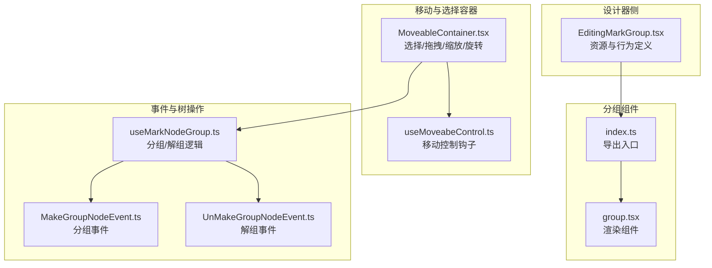
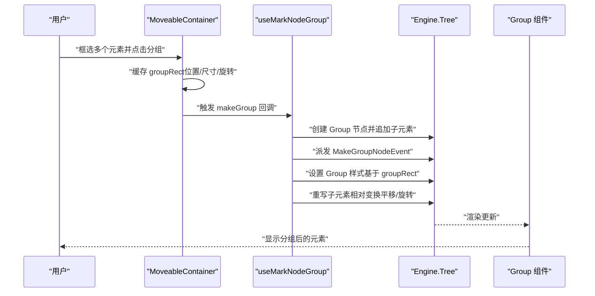
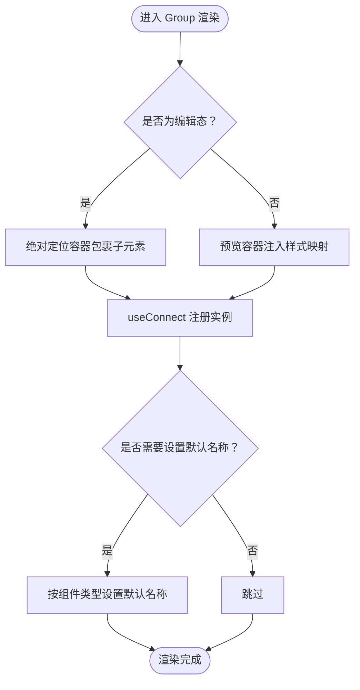
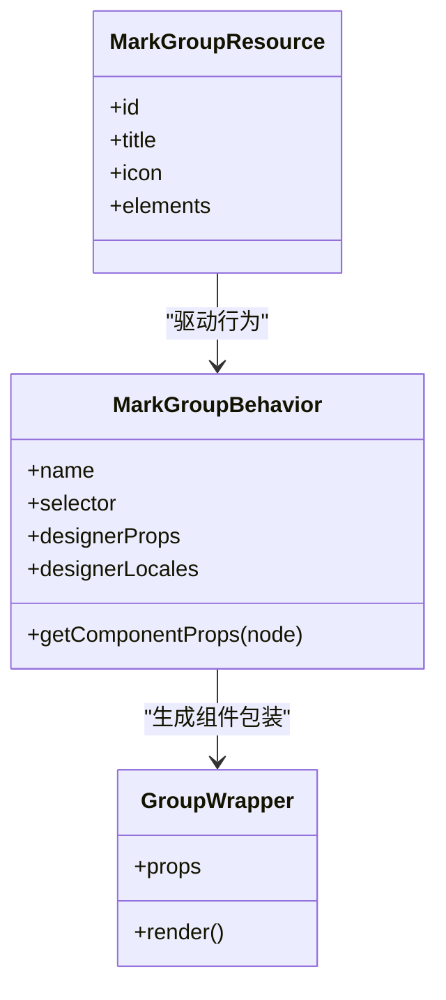
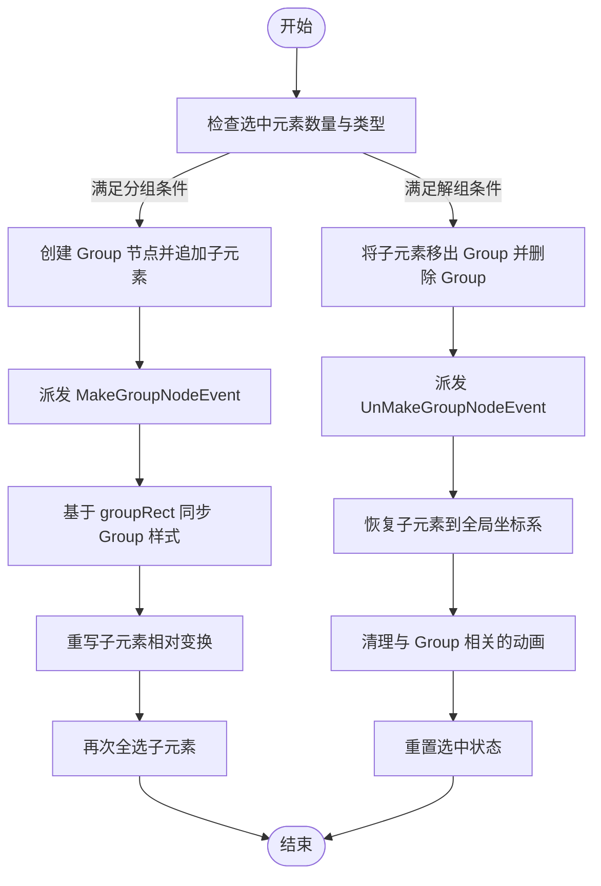
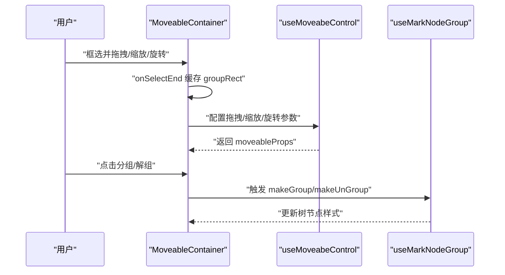
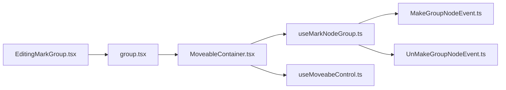

# 分组组件

<cite>
**本文引用的文件**
- [group.tsx](file://common/slide-editor/src/components/Group/group.tsx)
- [index.ts](file://common/slide-editor/src/components/Group/index.ts)
- [EditingMarkGroup.tsx](file://editor/src/components/Group/EditingMarkGroup.tsx)
- [useMarkNodeGroup.ts](file://editor/src/hooks/useMarkNodeGroup.ts)
- [MoveableContainer.tsx](file://packages/react/src/containers/MoveableContainer.tsx)
- [useMoveabeControl.ts](file://editor/src/hooks/useMoveabeControl.ts)
- [MakeGroupNodeEvent.ts](file://packages/core/src/events/mutation/MakeGroupNodeEvent.ts)
- [UnMakeGroupNodeEvent.ts](file://packages/core/src/events/mutation/UnMakeGroupNodeEvent.ts)
</cite>

## 目录
1. [简介](#简介)
2. [项目结构](#项目结构)
3. [核心组件](#核心组件)
4. [架构总览](#架构总览)
5. [详细组件分析](#详细组件分析)
6. [依赖关系分析](#依赖关系分析)
7. [性能考量](#性能考量)
8. [故障排查指南](#故障排查指南)
9. [结论](#结论)
10. [附录](#附录)

## 简介
本文件系统性梳理 Slides Engine 的“分组组件”，围绕设计理念、实现架构、行为定义、标记组编辑、移动控制、批量操作与层级控制展开，并说明与移动组件的协作机制（拖拽、缩放、旋转等变换）。同时给出使用场景、操作方法、最佳实践以及复杂课件设计中的应用案例与性能优化建议。

## 项目结构
分组组件由三层协同构成：
- 设计器侧资源与行为定义：负责将“分组”作为可放置的资源并定义其属性与交互。
- 分组渲染组件：负责在编辑态与预览态分别挂载容器与子元素，维护实例注册与默认命名。
- 移动与选择容器：负责多元素选择、分组/解组触发、拖拽/缩放/旋转等变换同步至树节点。

**图表来源**
- [EditingMarkGroup.tsx:1-82](file://editor/src/components/Group/EditingMarkGroup.tsx#L1-L82)
- [index.ts:1-8](file://common/slide-editor/src/components/Group/index.ts#L1-L8)
- [group.tsx:1-51](file://common/slide-editor/src/components/Group/group.tsx#L1-L51)
- [MoveableContainer.tsx:1-200](file://packages/react/src/containers/MoveableContainer.tsx#L1-L200)
- [useMoveabeControl.ts:55-253](file://editor/src/hooks/useMoveabeControl.ts#L55-L253)
- [useMarkNodeGroup.ts:1-179](file://editor/src/hooks/useMarkNodeGroup.ts#L1-L179)
- [MakeGroupNodeEvent.ts:1-10](file://packages/core/src/events/mutation/MakeGroupNodeEvent.ts#L1-L10)
- [UnMakeGroupNodeEvent.ts:1-10](file://packages/core/src/events/mutation/UnMakeGroupNodeEvent.ts#L1-L10)

**章节来源**
- [EditingMarkGroup.tsx:1-82](file://editor/src/components/Group/EditingMarkGroup.tsx#L1-L82)
- [group.tsx:1-51](file://common/slide-editor/src/components/Group/group.tsx#L1-L51)
- [index.ts:1-8](file://common/slide-editor/src/components/Group/index.ts#L1-L8)
- [MoveableContainer.tsx:1-200](file://packages/react/src/containers/MoveableContainer.tsx#L1-L200)
- [useMoveabeControl.ts:55-253](file://editor/src/hooks/useMoveabeControl.ts#L55-L253)
- [useMarkNodeGroup.ts:1-179](file://editor/src/hooks/useMarkNodeGroup.ts#L1-L179)
- [MakeGroupNodeEvent.ts:1-10](file://packages/core/src/events/mutation/MakeGroupNodeEvent.ts#L1-L10)
- [UnMakeGroupNodeEvent.ts:1-10](file://packages/core/src/events/mutation/UnMakeGroupNodeEvent.ts#L1-L10)

## 核心组件
- 分组渲染组件（Group）
  - 在编辑态以绝对定位容器包裹子元素；在预览态通过 preview-id 与样式映射注入初始样式。
  - 通过 useConnect 注册实例，支持卸载清理；在编辑态根据组件类型设置默认名称。
- 分组行为与资源（EditingMarkGroup）
  - 定义“分组”资源与行为，声明可放置、属性模式与默认样式。
  - 暴露 Group 渲染包装，传入设计器节点属性与连接上下文。
- 分组/解组逻辑（useMarkNodeGroup）
  - 判定是否显示分组/解组按钮，执行分组/解组树节点变更与样式同步。
  - 基于移动容器提供的 groupRect 同步分组整体变换与子元素相对变换。
- 移动容器（MoveableContainer）
  - 提供选择器、拖拽、缩放、旋转等能力；在选择结束时缓存 groupRect，供分组/解组使用。
  - 对组内元素进行特殊处理，避免非组元素被组内拖拽影响。
- 移动控制钩子（useMoveabeControl）
  - 统一配置拖拽/缩放/旋转等参数，支持组内批量变换事件回调。
- 事件模型（MakeGroupNodeEvent / UnMakeGroupNodeEvent）
  - 分组/解组事件类型，驱动引擎订阅与后续处理。

**章节来源**
- [group.tsx:1-51](file://common/slide-editor/src/components/Group/group.tsx#L1-L51)
- [EditingMarkGroup.tsx:1-82](file://editor/src/components/Group/EditingMarkGroup.tsx#L1-L82)
- [useMarkNodeGroup.ts:1-179](file://editor/src/hooks/useMarkNodeGroup.ts#L1-L179)
- [MoveableContainer.tsx:258-483](file://packages/react/src/containers/MoveableContainer.tsx#L258-L483)
- [useMoveabeControl.ts:55-253](file://editor/src/hooks/useMoveabeControl.ts#L55-L253)
- [MakeGroupNodeEvent.ts:1-10](file://packages/core/src/events/mutation/MakeGroupNodeEvent.ts#L1-L10)
- [UnMakeGroupNodeEvent.ts:1-10](file://packages/core/src/events/mutation/UnMakeGroupNodeEvent.ts#L1-L10)

## 架构总览
分组组件围绕“树节点 + DOM 实例 + 移动容器”的三元协作展开：
- 树节点：承载分组与子元素的层级关系、样式与事件。
- DOM 实例：通过 useConnect 注册/卸载，确保渲染层与树节点一致。
- 移动容器：提供选择与变换能力，将变换结果写回树节点样式。

**图表来源**
- [MoveableContainer.tsx:470-522](file://packages/react/src/containers/MoveableContainer.tsx#L470-L522)
- [useMarkNodeGroup.ts:24-79](file://editor/src/hooks/useMarkNodeGroup.ts#L24-L79)
- [MakeGroupNodeEvent.ts:1-10](file://packages/core/src/events/mutation/MakeGroupNodeEvent.ts#L1-L10)
- [group.tsx:21-51](file://common/slide-editor/src/components/Group/group.tsx#L21-L51)

## 详细组件分析

### 分组渲染组件（Group）
- 职责
  - 在编辑态以绝对定位容器包裹子元素，便于拖拽与变换。
  - 在预览态通过 preview-id 与样式映射注入初始样式，保证预览一致性。
  - 通过 useConnect 注册实例，支持卸载清理；在编辑态根据组件类型设置默认名称。
- 关键点
  - 编辑态与预览态样式差异：编辑态强调容器包裹，预览态强调样式合并。
  - 实例注册与卸载：确保渲染层与树节点生命周期一致。
  - 默认命名：在编辑态为新实例设置默认名称，提升可用性。

**图表来源**
- [group.tsx:21-51](file://common/slide-editor/src/components/Group/group.tsx#L21-L51)

**章节来源**
- [group.tsx:1-51](file://common/slide-editor/src/components/Group/group.tsx#L1-L51)
- [index.ts:1-8](file://common/slide-editor/src/components/Group/index.ts#L1-L8)

### 分组行为与资源（EditingMarkGroup）
- 职责
  - 定义“分组”资源与行为，声明可放置、属性模式与默认样式。
  - 暴露 Group 渲染包装，传入设计器节点属性与连接上下文。
- 关键点
  - 行为定义：droppable、propsSchema、默认样式与本地化文案。
  - 组件包装：将 Group 组件注入设计器上下文，传递 useConnect/useReport 等。

**图表来源**
- [EditingMarkGroup.tsx:24-82](file://editor/src/components/Group/EditingMarkGroup.tsx#L24-L82)

**章节来源**
- [EditingMarkGroup.tsx:1-82](file://editor/src/components/Group/EditingMarkGroup.tsx#L1-L82)

### 分组/解组逻辑（useMarkNodeGroup）
- 分组流程
  - 判定条件：选中多个元素且均非 Group、深度为 1。
  - 创建 Group 节点并追加子元素，派发 MakeGroupNodeEvent。
  - 基于 groupRect 设置 Group 样式（宽高/位置/旋转），并重写子元素相对变换。
  - 再次全选子元素，便于继续操作。
- 解组流程
  - 判定条件：所有选中元素父节点相同且非根节点。
  - 将子元素移出 Group 并删除 Group，派发 UnMakeGroupNodeEvent。
  - 恢复子元素到解组前的全局坐标系，更新选中状态。
- 关键点
  - transform 解析与合成：从子元素与父 Group 的 transform 中提取平移与旋转，再进行相对/绝对转换。
  - 动画清理：解组时过滤掉与 Group 相关的动画目标或触发源。

**图表来源**
- [useMarkNodeGroup.ts:8-82](file://editor/src/hooks/useMarkNodeGroup.ts#L8-L82)
- [useMarkNodeGroup.ts:84-179](file://editor/src/hooks/useMarkNodeGroup.ts#L84-L179)

**章节来源**
- [useMarkNodeGroup.ts:1-179](file://editor/src/hooks/useMarkNodeGroup.ts#L1-L179)

### 移动容器与移动控制（MoveableContainer / useMoveabeControl）
- 选择与分组
  - 选择结束时缓存 groupRect，供分组/解组使用。
  - 自动聚合组内子元素，避免误选非组元素。
- 变换同步
  - onDragGroup/onResizeGroup/onRotateGroup 回调中批量更新目标元素样式。
  - 对组内元素进行特殊处理，避免非组元素被组内拖拽影响。
- 关键点
  - 与 useMarkNodeGroup 协作：通过 groupRect 同步分组整体变换。
  - 与 useMoveabeControl 协作：统一配置拖拽/缩放/旋转参数。

**图表来源**
- [MoveableContainer.tsx:258-483](file://packages/react/src/containers/MoveableContainer.tsx#L258-L483)
- [MoveableContainer.tsx:470-522](file://packages/react/src/containers/MoveableContainer.tsx#L470-L522)
- [useMoveabeControl.ts:55-253](file://editor/src/hooks/useMoveabeControl.ts#L55-L253)

**章节来源**
- [MoveableContainer.tsx:1-200](file://packages/react/src/containers/MoveableContainer.tsx#L1-L200)
- [MoveableContainer.tsx:258-483](file://packages/react/src/containers/MoveableContainer.tsx#L258-L483)
- [MoveableContainer.tsx:470-522](file://packages/react/src/containers/MoveableContainer.tsx#L470-L522)
- [useMoveabeControl.ts:55-253](file://editor/src/hooks/useMoveabeControl.ts#L55-L253)

### 事件模型（MakeGroupNodeEvent / UnMakeGroupNodeEvent）
- 作用
  - 标准化分组/解组事件类型，便于引擎订阅与后续处理。
- 关键点
  - 类型常量：group:make / group:unmake。
  - 与抽象基类组合，确保事件结构一致。

**章节来源**
- [MakeGroupNodeEvent.ts:1-10](file://packages/core/src/events/mutation/MakeGroupNodeEvent.ts#L1-L10)
- [UnMakeGroupNodeEvent.ts:1-10](file://packages/core/src/events/mutation/UnMakeGroupNodeEvent.ts#L1-L10)

## 依赖关系分析
- 组件耦合
  - Group 渲染组件依赖 useConnect 与默认命名工具，耦合度低，职责清晰。
  - EditingMarkGroup 仅负责行为与资源定义，不直接参与渲染细节。
  - useMarkNodeGroup 与 MoveableContainer 强耦合（依赖 groupRect），但通过事件与树操作解耦。
- 外部依赖
  - 移动库（react-moveable/selecto）提供选择与变换能力。
  - 引擎树（Engine.Tree）提供节点增删改查与事件派发。
- 循环依赖
  - 未发现循环依赖；事件类型与钩子之间为单向依赖。

**图表来源**
- [EditingMarkGroup.tsx:1-82](file://editor/src/components/Group/EditingMarkGroup.tsx#L1-L82)
- [group.tsx:1-51](file://common/slide-editor/src/components/Group/group.tsx#L1-L51)
- [MoveableContainer.tsx:1-200](file://packages/react/src/containers/MoveableContainer.tsx#L1-L200)
- [useMarkNodeGroup.ts:1-179](file://editor/src/hooks/useMarkNodeGroup.ts#L1-L179)
- [useMoveabeControl.ts:55-253](file://editor/src/hooks/useMoveabeControl.ts#L55-L253)
- [MakeGroupNodeEvent.ts:1-10](file://packages/core/src/events/mutation/MakeGroupNodeEvent.ts#L1-L10)
- [UnMakeGroupNodeEvent.ts:1-10](file://packages/core/src/events/mutation/UnMakeGroupNodeEvent.ts#L1-L10)

**章节来源**
- [EditingMarkGroup.tsx:1-82](file://editor/src/components/Group/EditingMarkGroup.tsx#L1-L82)
- [group.tsx:1-51](file://common/slide-editor/src/components/Group/group.tsx#L1-L51)
- [MoveableContainer.tsx:1-200](file://packages/react/src/containers/MoveableContainer.tsx#L1-L200)
- [useMarkNodeGroup.ts:1-179](file://editor/src/hooks/useMarkNodeGroup.ts#L1-L179)
- [useMoveabeControl.ts:55-253](file://editor/src/hooks/useMoveabeControl.ts#L55-L253)
- [MakeGroupNodeEvent.ts:1-10](file://packages/core/src/events/mutation/MakeGroupNodeEvent.ts#L1-L10)
- [UnMakeGroupNodeEvent.ts:1-10](file://packages/core/src/events/mutation/UnMakeGroupNodeEvent.ts#L1-L10)

## 性能考量
- 选择与更新
  - 选择结束后才缓存 groupRect，减少不必要的计算。
  - 批量更新目标元素样式，避免逐个 DOM 操作。
- 渲染与实例
  - useConnect 注册/卸载实例，避免重复注册导致的内存泄漏。
  - 编辑态与预览态样式分离，降低样式合并成本。
- 事件派发
  - 分组/解组通过事件派发，避免直接耦合，利于后续扩展与优化。
- 建议
  - 大规模分组时优先使用批量样式更新回调（如 onDragGroup/onResizeGroup/onRotateGroup）。
  - 控制分组层级深度，避免过深嵌套导致的样式计算开销。
  - 在预览态尽量减少动态样式变更，保持静态样式映射。

[本节为通用性能建议，无需特定文件引用]

## 故障排查指南
- 症状：分组后子元素位置异常
  - 排查：确认 groupRect 是否正确缓存；检查 transform 解析与合成逻辑。
  - 参考：分组与解组中的 transform 重写逻辑。
- 症状：解组后动画失效
  - 排查：确认是否清理了与 Group 相关的动画目标或触发源。
  - 参考：解组逻辑中的动画列表过滤。
- 症状：组内元素被误选
  - 排查：确认选择结束时是否聚合了组内子元素。
  - 参考：选择结束回调中的聚合逻辑。
- 症状：拖拽/缩放/旋转无效
  - 排查：确认 moveableProps 配置与 onDragGroup/onResizeGroup/onRotateGroup 回调是否生效。
  - 参考：移动控制钩子与移动容器配置。

**章节来源**
- [useMarkNodeGroup.ts:61-79](file://editor/src/hooks/useMarkNodeGroup.ts#L61-L79)
- [useMarkNodeGroup.ts:131-179](file://editor/src/hooks/useMarkNodeGroup.ts#L131-L179)
- [MoveableContainer.tsx:470-522](file://packages/react/src/containers/MoveableContainer.tsx#L470-L522)
- [useMoveabeControl.ts:228-248](file://editor/src/hooks/useMoveabeControl.ts#L228-L248)

## 结论
分组组件通过“资源/行为定义 + 渲染组件 + 移动容器 + 事件模型”的协同，实现了对多个元素的统一管理、批量操作与层级控制。它与移动组件紧密协作，确保拖拽、缩放、旋转等变换在树节点层面得到一致反映。在复杂课件设计中，合理使用分组可显著提升布局效率与一致性；配合事件与批量更新策略，可在性能与体验间取得良好平衡。

[本节为总结性内容，无需特定文件引用]

## 附录

### 使用场景与操作方法
- 场景
  - 批量元素对齐与整体变换（拖拽/缩放/旋转）。
  - 复杂图形/图标组合的统一管理。
  - 动画与交互的层级化组织。
- 操作步骤
  - 选中多个元素 → 点击“分组” → 系统自动创建 Group 节点并追加子元素 → 同步 groupRect 样式 → 子元素相对变换重写 → 再次全选子元素。
  - 选中 Group 下任意元素 → 点击“解组” → 子元素移出 Group 并恢复全局坐标 → 清理相关动画 → 重置选中状态。

**章节来源**
- [useMarkNodeGroup.ts:24-79](file://editor/src/hooks/useMarkNodeGroup.ts#L24-L79)
- [useMarkNodeGroup.ts:121-179](file://editor/src/hooks/useMarkNodeGroup.ts#L121-L179)

### 最佳实践
- 保持分组层级简洁，避免深层嵌套。
- 在分组前先进行对齐与基准调整，减少相对变换误差。
- 使用批量变换回调统一处理样式更新，避免逐项修改。
- 解组时注意清理动画与交互目标，防止残留引用。

[本节为通用实践建议，无需特定文件引用]