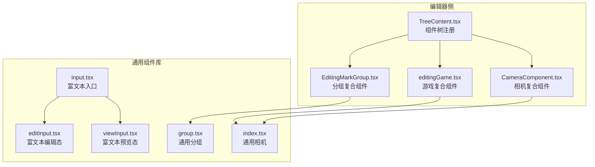
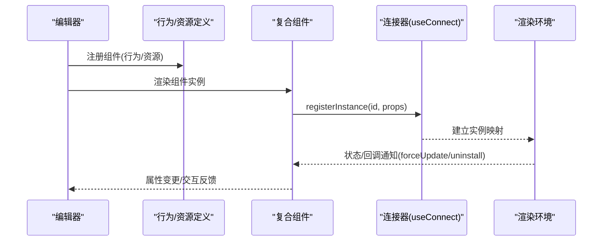
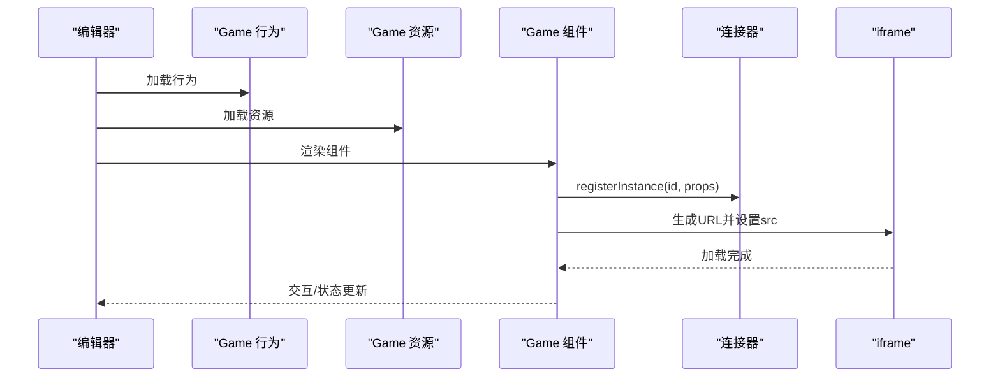
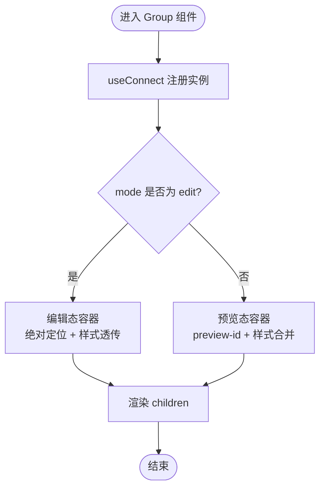
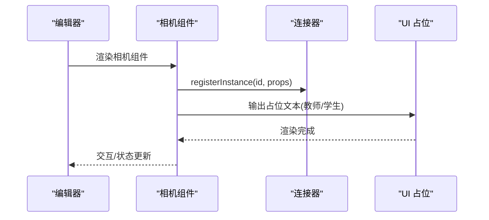
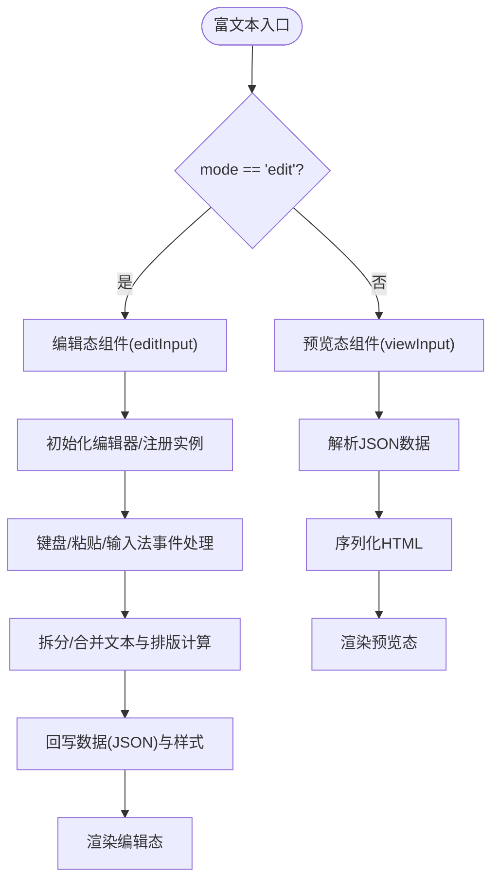
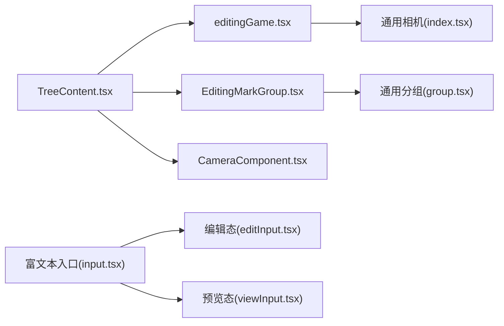

# 复合组件

<cite>
**本文引用的文件**
- [编辑器树内容组件注册](file://editor/src/components/TreeContent.tsx)
- [游戏复合组件](file://editor/src/components/Game/editingGame.tsx)
- [分组复合组件](file://editor/src/components/Group/EditingMarkGroup.tsx)
- [相机复合组件](file://editor/src/components/menu/Camera/CameraComponent.tsx)
- [富文本组件入口](file://common/slide-editor/src/components/Input/input.tsx)
- [富文本编辑态组件](file://common/slide-editor/src/components/Input/editInput.tsx)
- [富文本预览态组件](file://common/slide-editor/src/components/Input/viewInput.tsx)
- [通用分组组件](file://common/slide-editor/src/components/Group/group.tsx)
- [通用相机组件](file://common/slide-editor/src/components/Camera/index.tsx)
</cite>

## 目录
1. [简介](#简介)
2. [项目结构](#项目结构)
3. [核心组件](#核心组件)
4. [架构总览](#架构总览)
5. [详细组件分析](#详细组件分析)
6. [依赖分析](#依赖分析)
7. [性能考虑](#性能考虑)
8. [故障排查指南](#故障排查指南)
9. [结论](#结论)
10. [附录](#附录)

## 简介
本文件围绕 Slides Engine 的复合组件体系，系统梳理“游戏组件”“相机组件”“富文本组件”“分组组件”等复合组件的设计理念、实现细节与交互机制。复合组件通过组合多个基础组件与能力模块，实现复杂业务功能；同时借助统一的连接器与资源/行为模型，完成组件注册、属性配置、运行期通信与状态同步。

## 项目结构
复合组件主要分布在两个层面：
- 编辑器侧：负责组件注册、行为定义、资源面板与设置面板集成
- 通用组件库：提供可在编辑态与预览态复用的基础组件封装

图表来源
- [编辑器树内容组件注册:46-48](file://editor/src/components/TreeContent.tsx#L46-L48)
- [游戏复合组件:63-120](file://editor/src/components/Game/editingGame.tsx#L63-L120)
- [分组复合组件:77-85](file://editor/src/components/Group/EditingMarkGroup.tsx#L77-L85)
- [相机复合组件:1-33](file://editor/src/components/menu/Camera/CameraComponent.tsx#L1-L33)
- [富文本组件入口:12-18](file://common/slide-editor/src/components/Input/input.tsx#L12-L18)
- [富文本编辑态组件:18-542](file://common/slide-editor/src/components/Input/editInput.tsx#L18-L542)
- [富文本预览态组件:10-82](file://common/slide-editor/src/components/Input/viewInput.tsx#L10-L82)
- [通用分组组件:21-51](file://common/slide-editor/src/components/Group/group.tsx#L21-L51)
- [通用相机组件:3-51](file://common/slide-editor/src/components/Camera/index.tsx#L3-L51)

章节来源
- [编辑器树内容组件注册:24-48](file://editor/src/components/TreeContent.tsx#L24-L48)
- [富文本组件入口:12-18](file://common/slide-editor/src/components/Input/input.tsx#L12-L18)

## 核心组件
- 游戏组件：以 iframe 嵌入外部游戏资源，通过连接器注册实例，支持环境参数注入与选择态事件控制。
- 分组组件：将多个子节点逻辑上聚合，提供统一的容器包装与命名策略。
- 相机组件：用于展示教师/学生视频流占位，通过连接器注册实例并支持默认名称设置。
- 富文本组件：根据模式切换编辑态/预览态，编辑态基于 Slate 实现富文本编辑与排版，预览态序列化输出 HTML。

章节来源
- [游戏复合组件:63-120](file://editor/src/components/Game/editingGame.tsx#L63-L120)
- [分组复合组件:77-85](file://editor/src/components/Group/EditingMarkGroup.tsx#L77-L85)
- [相机复合组件:1-33](file://editor/src/components/menu/Camera/CameraComponent.tsx#L1-L33)
- [富文本组件入口:12-18](file://common/slide-editor/src/components/Input/input.tsx#L12-L18)

## 架构总览
复合组件遵循“编辑器侧行为/资源 + 通用组件库”的双层架构：
- 行为与资源：通过 createBehavior/createResource 定义组件在设计器中的外观、属性与交互规则，并在组件树中注册。
- 连接器：通过 useConnect 在运行期建立组件实例与宿主渲染环境的桥接，实现实例注册、卸载与强制刷新。
- 模式切换：通过 props.mode 控制编辑态/预览态，分别调用不同的子组件实现。

图表来源
- [游戏复合组件:75-85](file://editor/src/components/Game/editingGame.tsx#L75-L85)
- [分组复合组件:77-82](file://editor/src/components/Group/EditingMarkGroup.tsx#L77-L82)
- [相机复合组件:12-25](file://common/slide-editor/src/components/Camera/index.tsx#L12-L25)

## 详细组件分析

### 游戏复合组件
设计理念
- 将外部游戏以 iframe 形式嵌入，通过参数拼装与缓存控制提升加载稳定性。
- 使用连接器注册实例，便于运行期与宿主通信，支持强制刷新与卸载。

实现要点
- 行为定义：通过 createBehavior 定义组件名、选择器、设计器属性与本地化文案。
- 资源定义：通过 createResource 定义资源面板项与默认属性。
- 组件渲染：在 useConnect 生命周期内注册实例，依据 props 与环境变量生成 iframe 地址，控制指针事件。

图表来源
- [游戏复合组件:13-39](file://editor/src/components/Game/editingGame.tsx#L13-L39)
- [游戏复合组件:41-61](file://editor/src/components/Game/editingGame.tsx#L41-L61)
- [游戏复合组件:75-119](file://editor/src/components/Game/editingGame.tsx#L75-L119)

章节来源
- [游戏复合组件:13-39](file://editor/src/components/Game/editingGame.tsx#L13-L39)
- [游戏复合组件:41-61](file://editor/src/components/Game/editingGame.tsx#L41-L61)
- [游戏复合组件:75-119](file://editor/src/components/Game/editingGame.tsx#L75-L119)

### 分组复合组件
设计理念
- 将多个子组件逻辑聚合为一个整体，提供统一的容器包装与命名策略，便于批量操作与样式继承。

实现要点
- 行为定义：启用拖拽放置(droppable)，生成基础属性 Schema，提供默认样式与本地化文案。
- 组件渲染：通过通用分组组件包裹 children，区分编辑态与预览态的样式与容器结构。

图表来源
- [分组复合组件:77-82](file://editor/src/components/Group/EditingMarkGroup.tsx#L77-L82)
- [通用分组组件:21-51](file://common/slide-editor/src/components/Group/group.tsx#L21-L51)

章节来源
- [分组复合组件:41-75](file://editor/src/components/Group/EditingMarkGroup.tsx#L41-L75)
- [分组复合组件:77-85](file://editor/src/components/Group/EditingMarkGroup.tsx#L77-L85)
- [通用分组组件:21-51](file://common/slide-editor/src/components/Group/group.tsx#L21-L51)

### 相机复合组件
设计理念
- 提供教师/学生视频流占位展示，通过连接器注册实例，支持默认名称设置与样式透传。

实现要点
- 组件渲染：在 useConnect 生命周期内注册实例，设置默认名称，合并样式并输出文本占位。

图表来源
- [相机复合组件:1-33](file://editor/src/components/menu/Camera/CameraComponent.tsx#L1-L33)
- [通用相机组件:3-51](file://common/slide-editor/src/components/Camera/index.tsx#L3-L51)

章节来源
- [相机复合组件:1-33](file://editor/src/components/menu/Camera/CameraComponent.tsx#L1-L33)
- [通用相机组件:3-51](file://common/slide-editor/src/components/Camera/index.tsx#L3-L51)

### 富文本复合组件
设计理念
- 根据 mode 切换编辑态与预览态，编辑态基于 Slate 实现富文本编辑、样式应用与排版计算；预览态将结构化数据序列化为 HTML。

实现要点
- 入口组件：根据 mode 决定渲染编辑态或预览态组件。
- 编辑态组件：维护 Slate 编辑器实例、光标与选区、字体加载、拆分/合并文本、样式同步与回写。
- 预览态组件：将结构化数据序列化为 HTML 片段，结合样式映射与初始样式输出。

图表来源
- [富文本组件入口:12-18](file://common/slide-editor/src/components/Input/input.tsx#L12-L18)
- [富文本编辑态组件:63-100](file://common/slide-editor/src/components/Input/editInput.tsx#L63-L100)
- [富文本编辑态组件:162-177](file://common/slide-editor/src/components/Input/editInput.tsx#L162-L177)
- [富文本编辑态组件:244-270](file://common/slide-editor/src/components/Input/editInput.tsx#L244-L270)
- [富文本预览态组件:19-26](file://common/slide-editor/src/components/Input/viewInput.tsx#L19-L26)
- [富文本预览态组件:41-58](file://common/slide-editor/src/components/Input/viewInput.tsx#L41-L58)

章节来源
- [富文本组件入口:12-18](file://common/slide-editor/src/components/Input/input.tsx#L12-L18)
- [富文本编辑态组件:63-100](file://common/slide-editor/src/components/Input/editInput.tsx#L63-L100)
- [富文本编辑态组件:162-177](file://common/slide-editor/src/components/Input/editInput.tsx#L162-L177)
- [富文本编辑态组件:244-270](file://common/slide-editor/src/components/Input/editInput.tsx#L244-L270)
- [富文本预览态组件:19-26](file://common/slide-editor/src/components/Input/viewInput.tsx#L19-L26)
- [富文本预览态组件:41-58](file://common/slide-editor/src/components/Input/viewInput.tsx#L41-L58)

## 依赖分析
复合组件之间的依赖关系如下：
- 编辑器侧 TreeContent 将各复合组件注册到组件树，形成统一的可拖拽/可配置集合。
- 游戏组件依赖通用相机组件作为其内部容器或占位。
- 分组组件依赖通用分组组件作为容器。
- 富文本组件由入口组件根据模式分发至编辑态/预览态子组件。

图表来源
- [编辑器树内容组件注册:24-48](file://editor/src/components/TreeContent.tsx#L24-L48)
- [游戏复合组件:63-120](file://editor/src/components/Game/editingGame.tsx#L63-L120)
- [分组复合组件:77-85](file://editor/src/components/Group/EditingMarkGroup.tsx#L77-L85)
- [相机复合组件:1-33](file://editor/src/components/menu/Camera/CameraComponent.tsx#L1-L33)
- [富文本组件入口:12-18](file://common/slide-editor/src/components/Input/input.tsx#L12-L18)
- [富文本编辑态组件:18-542](file://common/slide-editor/src/components/Input/editInput.tsx#L18-L542)
- [富文本预览态组件:10-82](file://common/slide-editor/src/components/Input/viewInput.tsx#L10-L82)
- [通用分组组件:21-51](file://common/slide-editor/src/components/Group/group.tsx#L21-L51)
- [通用相机组件:3-51](file://common/slide-editor/src/components/Camera/index.tsx#L3-L51)

章节来源
- [编辑器树内容组件注册:24-48](file://editor/src/components/TreeContent.tsx#L24-L48)

## 性能考虑
- 富文本编辑态
  - 字体懒加载与可用性检测，避免阻塞渲染。
  - 键盘/输入法事件节流与状态合并，减少不必要的重排与回写。
  - 选区高亮与 DOM Range 操作延迟执行，降低主线程压力。
- 游戏组件
  - URL 参数缓存与时间戳注入，平衡缓存命中与实时性。
  - 仅在选择态开放指针事件，降低非激活元素的交互开销。
- 分组与相机组件
  - 通过连接器统一管理实例生命周期，避免重复注册与内存泄漏。
  - 样式透传与条件渲染，减少不必要的 DOM 更新。

## 故障排查指南
- 富文本编辑态无法聚焦/样式不同步
  - 检查是否正确调用注册实例与设置默认名称。
  - 确认字体加载完成后再进行排版计算。
  - 关注输入法与粘贴事件的特殊分支逻辑。
- 游戏组件 iframe 无法加载
  - 校验 URL 参数拼装逻辑，确保必要参数齐全。
  - 检查选择态下的指针事件开关。
- 分组组件样式错乱
  - 确认编辑态/预览态容器样式合并顺序。
  - 检查 children 渲染与绝对定位布局。
- 相机组件显示异常
  - 校验连接器注册流程与默认名称设置。
  - 确认样式透传与容器结构一致。

章节来源
- [富文本编辑态组件:54-61](file://common/slide-editor/src/components/Input/editInput.tsx#L54-L61)
- [富文本编辑态组件:179-205](file://common/slide-editor/src/components/Input/editInput.tsx#L179-L205)
- [富文本编辑态组件:206-218](file://common/slide-editor/src/components/Input/editInput.tsx#L206-L218)
- [游戏复合组件:87-99](file://editor/src/components/Game/editingGame.tsx#L87-L99)
- [游戏复合组件:111-116](file://editor/src/components/Game/editingGame.tsx#L111-L116)
- [通用分组组件:36-46](file://common/slide-editor/src/components/Group/group.tsx#L36-L46)
- [通用相机组件:12-25](file://common/slide-editor/src/components/Camera/index.tsx#L12-L25)

## 结论
Slides Engine 的复合组件通过“行为/资源 + 连接器 + 模式分发”的架构，实现了编辑态与预览态的一致体验与高效开发。游戏、分组、相机、富文本等复合组件均以统一的方式接入系统，具备良好的可扩展性与可维护性。建议在扩展新复合组件时，遵循现有模式：定义行为/资源、实现连接器注册、区分编辑/预览态、处理事件与状态同步。

## 附录
- 开发指南
  - 接口设计：统一通过 useConnect 注册实例，暴露 remove/forceUpdate 等能力。
  - 嵌套关系：通过通用容器组件包裹 children，保持绝对定位与样式透传。
  - 可扩展性：新增复合组件时，优先复用通用组件库，减少重复实现。
- 案例分析
  - 游戏组件：通过参数注入与缓存控制提升加载稳定性。
  - 富文本组件：通过事件节流与字体懒加载优化交互与渲染性能。
  - 分组组件：通过命名策略与容器包装提升批量操作效率。
  - 相机组件：通过连接器与默认名称设置保障实例一致性。