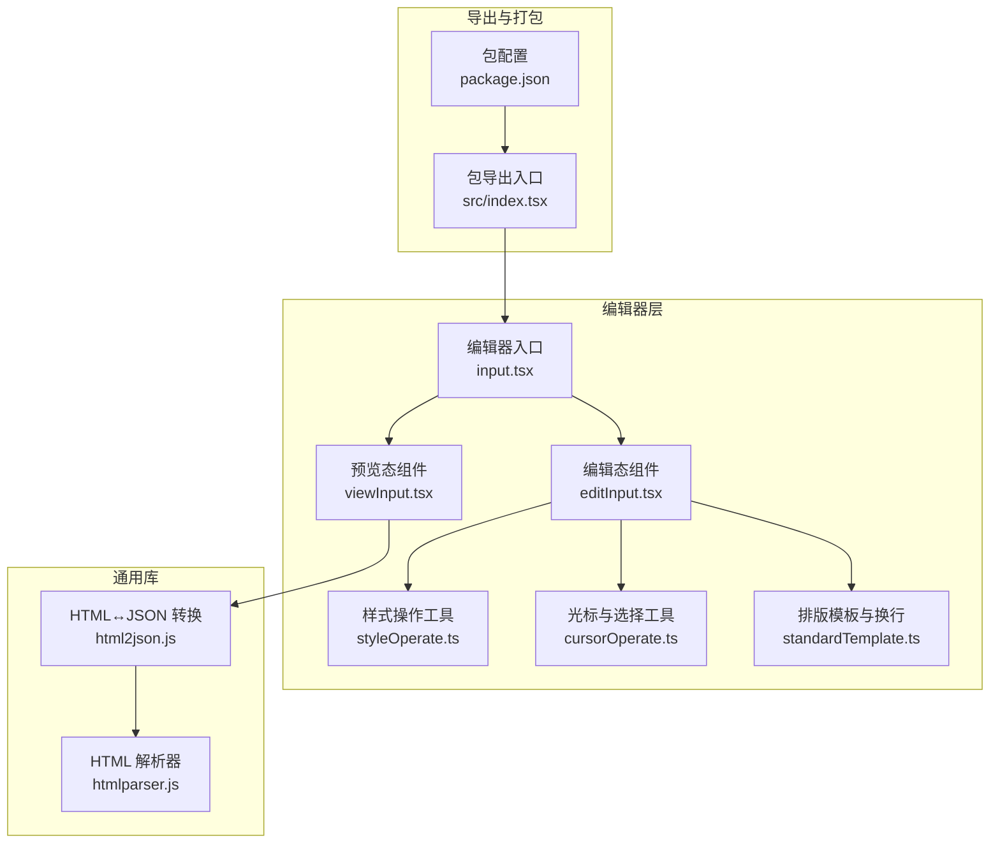
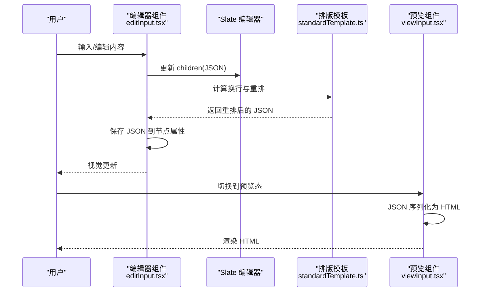
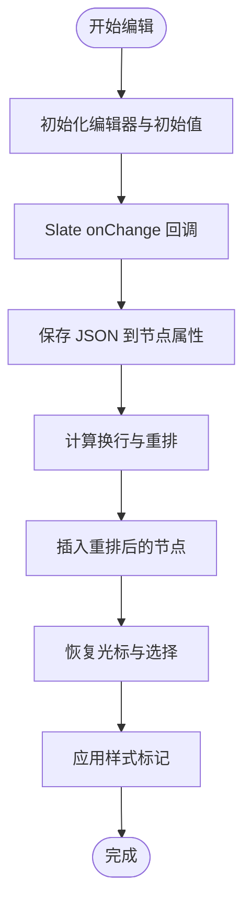
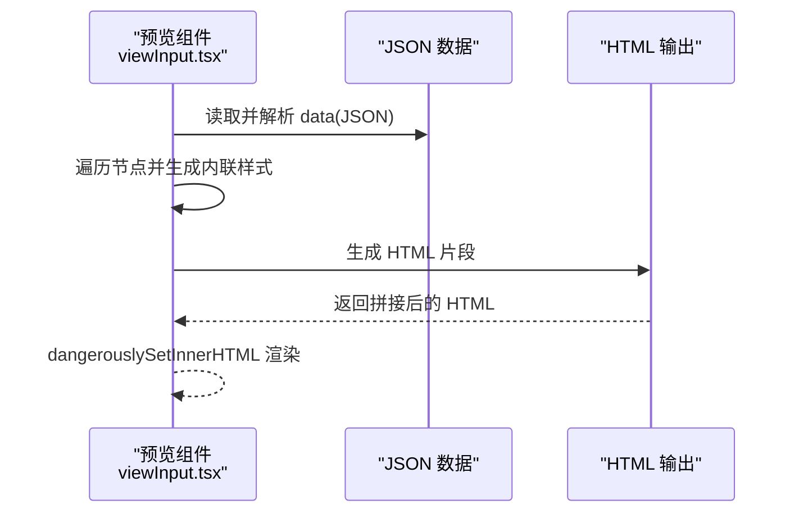
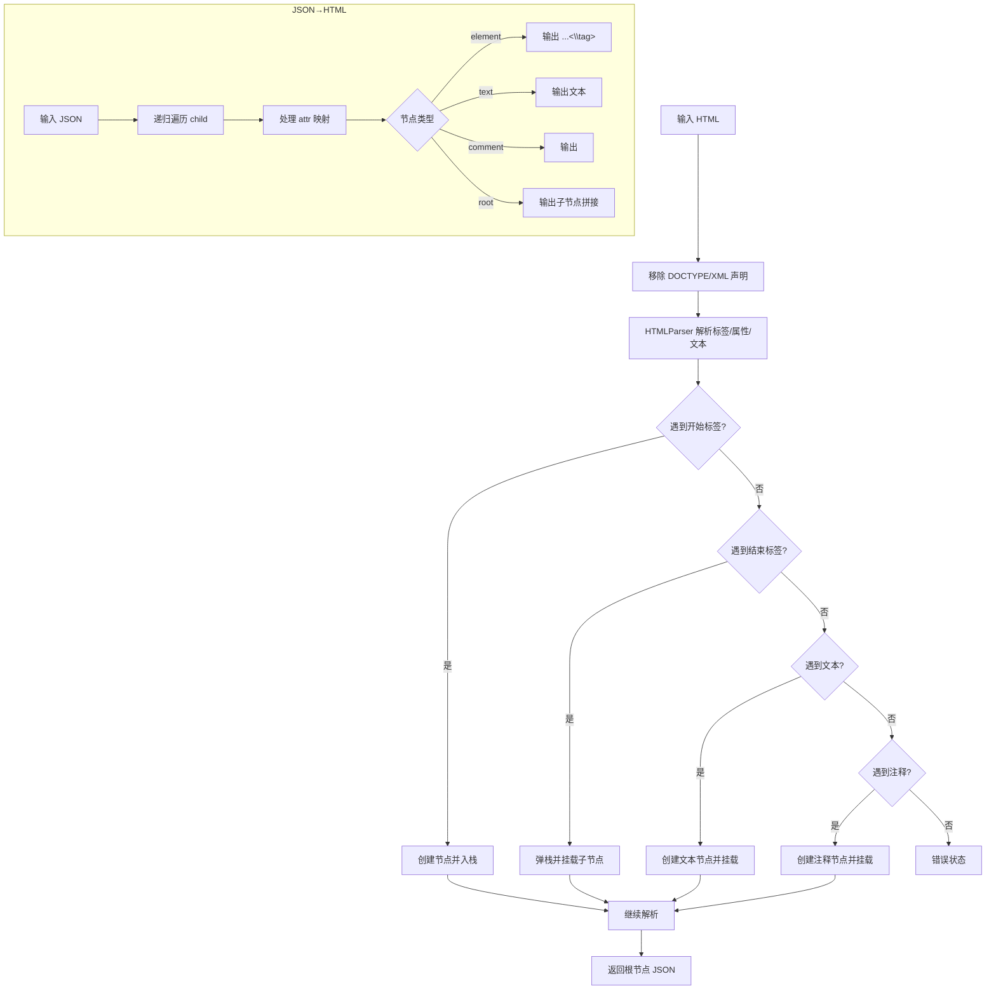
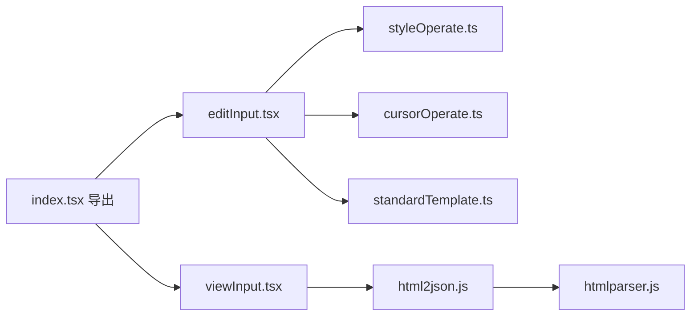

# 富文本组件

<cite>
**本文引用的文件**
- [editor/src/components/RichText/index.tsx](file://editor/src/components/RichText/index.tsx)
- [common/slide-editor/src/index.tsx](file://common/slide-editor/src/index.tsx)
- [common/slide-editor/package.json](file://common/slide-editor/package.json)
- [common/slide-editor/src/components/Input/input.tsx](file://common/slide-editor/src/components/Input/input.tsx)
- [common/slide-editor/src/components/Input/editInput.tsx](file://common/slide-editor/src/components/Input/editInput.tsx)
- [common/slide-editor/src/components/Input/viewInput.tsx](file://common/slide-editor/src/components/Input/viewInput.tsx)
- [common/slide-editor/src/components/Input/_style.css](file://common/slide-editor/src/components/Input/_style.css)
- [common/slide-editor/src/components/Input/utils/standardTemplate.ts](file://common/slide-editor/src/components/Input/utils/standardTemplate.ts)
- [common/slide-editor/src/components/Input/utils/styleOperate.ts](file://common/slide-editor/src/components/Input/utils/styleOperate.ts)
- [common/slide-editor/src/components/Input/utils/cursorOperate.ts](file://common/slide-editor/src/components/Input/utils/cursorOperate.ts)
- [common/slide-editor/lib/html2json.js](file://common/slide-editor/lib/html2json.js)
- [common/slide-editor/lib/htmlparser.js](file://common/slide-editor/lib/htmlparser.js)
</cite>

## 目录
1. [简介](#简介)
2. [项目结构](#项目结构)
3. [核心组件](#核心组件)
4. [架构总览](#架构总览)
5. [详细组件分析](#详细组件分析)
6. [依赖关系分析](#依赖关系分析)
7. [性能考量](#性能考量)
8. [故障排查指南](#故障排查指南)
9. [结论](#结论)
10. [附录](#附录)

## 简介
本文件面向 Slides Engine 的富文本组件，系统性阐述其架构设计与实现要点，覆盖以下方面：
- HTML 解析器与 JSON 转换机制
- 编辑器集成（基于 Slate.js）与实时样式应用
- 内容编辑与复杂文本格式处理（多段落、样式标记、自动换行）
- 数据转换流程：从 HTML 到 JSON 的解析与反向转换
- 组件配置项、样式定制与内容验证建议
- 不同编辑场景下的使用方式与性能优化策略

## 项目结构
富文本组件由“编辑器层”和“渲染层”两部分组成，编辑器层负责交互与数据结构维护，渲染层负责预览与序列化输出。

图表来源
- [common/slide-editor/src/components/Input/input.tsx:12-16](file://common/slide-editor/src/components/Input/input.tsx#L12-L16)
- [common/slide-editor/src/components/Input/editInput.tsx:1-542](file://common/slide-editor/src/components/Input/editInput.tsx#L1-L542)
- [common/slide-editor/src/components/Input/viewInput.tsx:1-82](file://common/slide-editor/src/components/Input/viewInput.tsx#L1-L82)
- [common/slide-editor/src/components/Input/utils/styleOperate.ts:1-131](file://common/slide-editor/src/components/Input/utils/styleOperate.ts#L1-L131)
- [common/slide-editor/src/components/Input/utils/cursorOperate.ts:1-170](file://common/slide-editor/src/components/Input/utils/cursorOperate.ts#L1-L170)
- [common/slide-editor/src/components/Input/utils/standardTemplate.ts:1-464](file://common/slide-editor/src/components/Input/utils/standardTemplate.ts#L1-L464)
- [common/slide-editor/lib/htmlparser.js:1-283](file://common/slide-editor/lib/htmlparser.js#L1-L283)
- [common/slide-editor/lib/html2json.js:1-182](file://common/slide-editor/lib/html2json.js#L1-L182)
- [common/slide-editor/src/index.tsx:26-29](file://common/slide-editor/src/index.tsx#L26-L29)
- [common/slide-editor/package.json:1-96](file://common/slide-editor/package.json#L1-L96)

章节来源
- [common/slide-editor/src/components/Input/input.tsx:12-16](file://common/slide-editor/src/components/Input/input.tsx#L12-L16)
- [common/slide-editor/src/index.tsx:26-29](file://common/slide-editor/src/index.tsx#L26-L29)
- [common/slide-editor/package.json:1-96](file://common/slide-editor/package.json#L1-L96)

## 核心组件
- 富文本行为与资源注册：在编辑器侧通过行为与资源注册暴露富文本组件，绑定属性模式与默认值。
- 富文本组件入口：统一导出富文本组件，区分编辑态与预览态。
- 编辑态组件：基于 Slate.js 实现可编辑富文本，支持样式标记、光标管理、自动换行与序列化。
- 预览态组件：将 JSON 数据序列化为 HTML 并渲染，支持样式映射与初始样式注入。
- 工具模块：样式操作、光标与选择、排版模板与换行计算、HTML 解析与转换。

章节来源
- [editor/src/components/RichText/index.tsx:41-124](file://editor/src/components/RichText/index.tsx#L41-L124)
- [common/slide-editor/src/index.tsx:26-29](file://common/slide-editor/src/index.tsx#L26-L29)
- [common/slide-editor/src/components/Input/input.tsx:12-16](file://common/slide-editor/src/components/Input/input.tsx#L12-L16)
- [common/slide-editor/src/components/Input/editInput.tsx:1-542](file://common/slide-editor/src/components/Input/editInput.tsx#L1-L542)
- [common/slide-editor/src/components/Input/viewInput.tsx:1-82](file://common/slide-editor/src/components/Input/viewInput.tsx#L1-L82)

## 架构总览
富文本组件采用“编辑态 JSON + 预览态 HTML”的双态模型：
- 编辑态：以 Slate.js 的 JSON 结构存储内容，实时应用样式标记，支持自动换行与光标定位。
- 预览态：将 JSON 结构序列化为 HTML，结合样式映射输出最终 DOM。

图表来源
- [common/slide-editor/src/components/Input/editInput.tsx:429-451](file://common/slide-editor/src/components/Input/editInput.tsx#L429-L451)
- [common/slide-editor/src/components/Input/utils/standardTemplate.ts:75-87](file://common/slide-editor/src/components/Input/utils/standardTemplate.ts#L75-L87)
- [common/slide-editor/src/components/Input/viewInput.tsx:41-58](file://common/slide-editor/src/components/Input/viewInput.tsx#L41-L58)

## 详细组件分析

### 编辑器集成与行为注册
- 行为注册：通过行为工厂创建富文本行为，定义属性模式、默认值与设计器本地化文案。
- 资源注册：将富文本作为可拖拽资源加入资源面板，设置默认标题与组件映射。
- 组件封装：编辑态传入 mode="edit"，预览态不传或传其他模式。

章节来源
- [editor/src/components/RichText/index.tsx:41-124](file://editor/src/components/RichText/index.tsx#L41-L124)

### 富文本组件入口与导出
- 统一导出富文本组件，供编辑器与预览环境使用。
- 包配置声明依赖（如 Slate、Slate-React），并提供构建脚本。

章节来源
- [common/slide-editor/src/index.tsx:26-29](file://common/slide-editor/src/index.tsx#L26-L29)
- [common/slide-editor/package.json:1-96](file://common/slide-editor/package.json#L1-L96)

### 编辑态组件（Slate 集成）
- 编辑器实例：使用 withReact/createEditor 初始化 Slate 编辑器。
- 数据结构：以 JSON 形式存储段落与文本节点，支持样式标记（颜色、字号、字重、行高、字体族、装饰线等）。
- 样式应用：通过样式操作工具将外部样式同步到当前选区的 marks。
- 自动换行：利用排版模板计算字符宽度与行宽，按宽度拆分行并重建 JSON。
- 光标与选择：通过光标工具获取全局索引、路径与偏移，保持选择状态与高亮。
- 事件处理：组合键输入、粘贴、删除、回车等事件触发重排与光标恢复。
- 序列化：将 children JSON 序列化为字符串保存到节点属性。

图表来源
- [common/slide-editor/src/components/Input/editInput.tsx:429-451](file://common/slide-editor/src/components/Input/editInput.tsx#L429-L451)
- [common/slide-editor/src/components/Input/utils/standardTemplate.ts:75-87](file://common/slide-editor/src/components/Input/utils/standardTemplate.ts#L75-L87)
- [common/slide-editor/src/components/Input/utils/styleOperate.ts:9-26](file://common/slide-editor/src/components/Input/utils/styleOperate.ts#L9-L26)

章节来源
- [common/slide-editor/src/components/Input/editInput.tsx:1-542](file://common/slide-editor/src/components/Input/editInput.tsx#L1-L542)
- [common/slide-editor/src/components/Input/utils/styleOperate.ts:1-131](file://common/slide-editor/src/components/Input/utils/styleOperate.ts#L1-L131)
- [common/slide-editor/src/components/Input/utils/standardTemplate.ts:1-464](file://common/slide-editor/src/components/Input/utils/standardTemplate.ts#L1-L464)
- [common/slide-editor/src/components/Input/utils/cursorOperate.ts:1-170](file://common/slide-editor/src/components/Input/utils/cursorOperate.ts#L1-L170)

### 预览态组件（JSON→HTML 序列化）
- 数据来源：从节点属性读取 JSON 字符串，解析为结构化数据。
- 序列化规则：将段落类型映射为 p 标签，文本样式映射为内联 style；支持多级嵌套。
- 样式注入：支持初始样式与按节点 ID 的样式映射叠加。

图表来源
- [common/slide-editor/src/components/Input/viewInput.tsx:41-58](file://common/slide-editor/src/components/Input/viewInput.tsx#L41-L58)

章节来源
- [common/slide-editor/src/components/Input/viewInput.tsx:1-82](file://common/slide-editor/src/components/Input/viewInput.tsx#L1-L82)

### HTML 解析器与 JSON 转换机制
- HTML 解析器：基于正则与栈结构解析标签、属性、注释与文本节点，支持自闭合标签与特殊标签（script/style）。
- HTML→JSON：遍历 HTML，构建树形 JSON，处理 style 属性与多值属性，保留注释与文本节点。
- JSON→HTML：递归遍历 JSON，还原标签、属性与文本，处理空元素与注释。

图表来源
- [common/slide-editor/lib/htmlparser.js:25-159](file://common/slide-editor/lib/htmlparser.js#L25-L159)
- [common/slide-editor/lib/html2json.js:17-125](file://common/slide-editor/lib/html2json.js#L17-L125)
- [common/slide-editor/lib/html2json.js:126-182](file://common/slide-editor/lib/html2json.js#L126-L182)

章节来源
- [common/slide-editor/lib/htmlparser.js:1-283](file://common/slide-editor/lib/htmlparser.js#L1-L283)
- [common/slide-editor/lib/html2json.js:1-182](file://common/slide-editor/lib/html2json.js#L1-L182)

### 工具模块与算法要点
- 样式操作：将外部样式差异同步为 marks，避免重复设置。
- 光标与选择：计算全局索引、路径与偏移，支持折叠与非折叠选择，维持高亮与 DOM Range。
- 排版模板：按字符粒度计算宽度与行高，处理英文单词边界，实现智能换行与多段落重建。

章节来源
- [common/slide-editor/src/components/Input/utils/styleOperate.ts:1-131](file://common/slide-editor/src/components/Input/utils/styleOperate.ts#L1-L131)
- [common/slide-editor/src/components/Input/utils/cursorOperate.ts:1-170](file://common/slide-editor/src/components/Input/utils/cursorOperate.ts#L1-L170)
- [common/slide-editor/src/components/Input/utils/standardTemplate.ts:1-464](file://common/slide-editor/src/components/Input/utils/standardTemplate.ts#L1-L464)

## 依赖关系分析
- 编辑器层依赖 Slate 生态（Editor、Transforms、withReact、ReactEditor、Editable）。
- 工具模块相互协作：光标工具依赖 Slate Selection；排版模板依赖 DOM 测量与缓存；样式工具依赖 marks。
- 预览层依赖 HTML→JSON 转换库，用于解析外部 HTML 并生成 JSON（若需要）。

图表来源
- [common/slide-editor/src/components/Input/editInput.tsx:1-542](file://common/slide-editor/src/components/Input/editInput.tsx#L1-L542)
- [common/slide-editor/src/components/Input/viewInput.tsx:1-82](file://common/slide-editor/src/components/Input/viewInput.tsx#L1-L82)
- [common/slide-editor/src/components/Input/utils/styleOperate.ts:1-131](file://common/slide-editor/src/components/Input/utils/styleOperate.ts#L1-L131)
- [common/slide-editor/src/components/Input/utils/cursorOperate.ts:1-170](file://common/slide-editor/src/components/Input/utils/cursorOperate.ts#L1-L170)
- [common/slide-editor/src/components/Input/utils/standardTemplate.ts:1-464](file://common/slide-editor/src/components/Input/utils/standardTemplate.ts#L1-L464)
- [common/slide-editor/lib/html2json.js:1-182](file://common/slide-editor/lib/html2json.js#L1-L182)
- [common/slide-editor/lib/htmlparser.js:1-283](file://common/slide-editor/lib/htmlparser.js#L1-L283)
- [common/slide-editor/src/index.tsx:26-29](file://common/slide-editor/src/index.tsx#L26-L29)

章节来源
- [common/slide-editor/src/index.tsx:26-29](file://common/slide-editor/src/index.tsx#L26-L29)
- [common/slide-editor/package.json:1-96](file://common/slide-editor/package.json#L1-L96)

## 性能考量
- 字体加载与测量：预加载字体，避免首屏闪烁与布局抖动；测量阶段使用缩放与缓存降低开销。
- 换行计算：按字符粒度计算宽度，避免频繁 DOM 查询；对长文本采用批量插入与选择恢复策略。
- 事件节流：按键抬起后延时合并，减少重排次数；组合输入与粘贴、删除场景单独处理。
- 样式同步：仅同步差异样式，避免重复设置 marks。
- 预览渲染：JSON→HTML 序列化在预览态一次性完成，避免逐次渲染。

## 故障排查指南
- 编辑态样式未生效
  - 检查是否在选区变化时正确调用样式同步逻辑。
  - 确认 marks 与节点属性写入顺序。
- 自动换行异常
  - 核对排版模板的字符宽度计算与行宽参数；检查英文单词边界处理。
  - 确保插入节点后删除多余空段落。
- 光标错位
  - 使用光标工具计算全局索引与路径，确保在重排后恢复选择。
  - 注意折叠与非折叠选择的不同处理分支。
- 预览态 HTML 不正确
  - 检查 JSON 结构是否符合预期；确认样式映射表与标签映射。
  - 若需从 HTML 还原 JSON，使用 HTML→JSON 转换器并注意注释与属性格式。

章节来源
- [common/slide-editor/src/components/Input/editInput.tsx:225-270](file://common/slide-editor/src/components/Input/editInput.tsx#L225-L270)
- [common/slide-editor/src/components/Input/utils/standardTemplate.ts:109-177](file://common/slide-editor/src/components/Input/utils/standardTemplate.ts#L109-L177)
- [common/slide-editor/src/components/Input/utils/cursorOperate.ts:116-169](file://common/slide-editor/src/components/Input/utils/cursorOperate.ts#L116-L169)
- [common/slide-editor/src/components/Input/viewInput.tsx:41-58](file://common/slide-editor/src/components/Input/viewInput.tsx#L41-L58)
- [common/slide-editor/lib/html2json.js:126-182](file://common/slide-editor/lib/html2json.js#L126-L182)

## 结论
富文本组件通过“编辑态 JSON + 预览态 HTML”的双态模型，结合 Slate.js 的结构化编辑能力与自研排版模板，实现了复杂文本格式与样式的高效处理。HTML→JSON 与 JSON→HTML 的双向转换为内容迁移与预览渲染提供了稳定基础。通过工具模块的解耦与性能优化策略，组件在多场景下具备良好的可用性与扩展性。

## 附录
- 配置选项建议
  - 编辑态：支持宽度、高度、变换、对齐等容器样式；支持字体族、字号、字重、行高、颜色、装饰线等文本样式。
  - 预览态：支持初始样式注入与按节点 ID 的样式映射叠加。
- 样式定制
  - 通过样式映射表将 JSON 样式键映射为 CSS 属性；预览态支持额外样式注入。
- 内容验证
  - 编辑态：对 marks 变更进行差异检测，避免冗余设置。
  - 预览态：对 JSON 结构进行基本校验，确保标签与样式键合法。