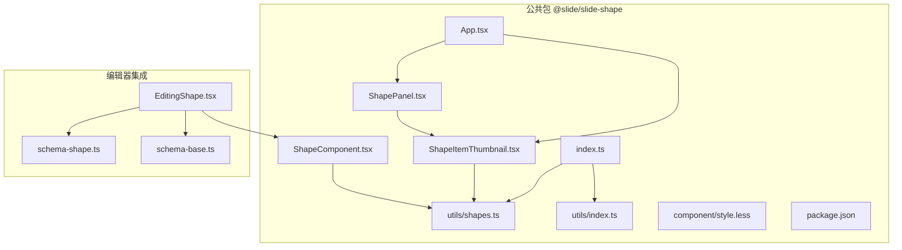
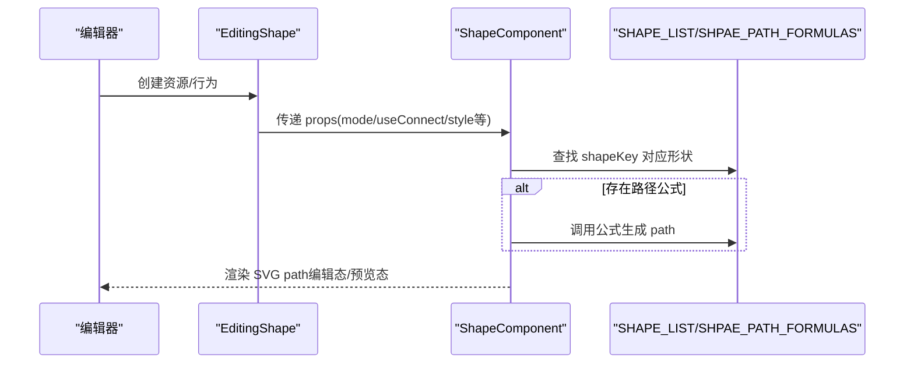
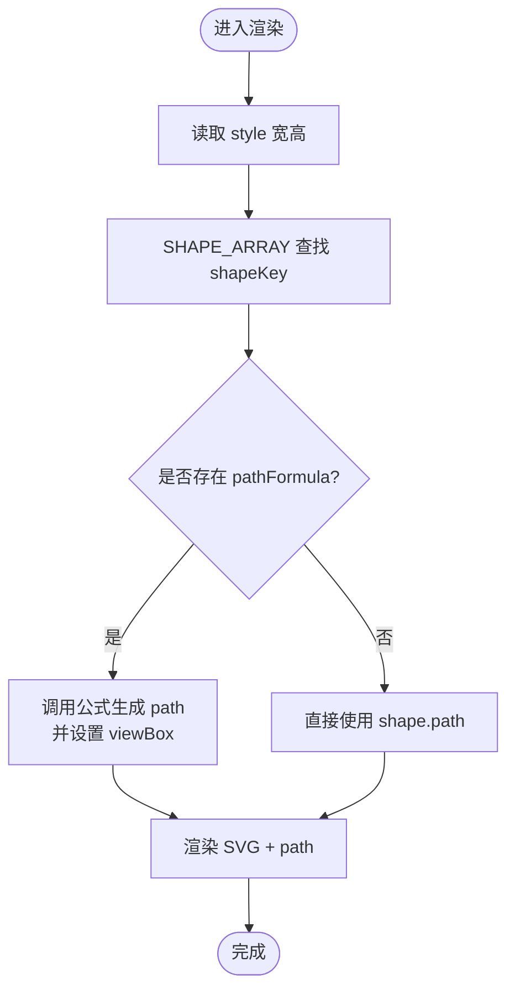
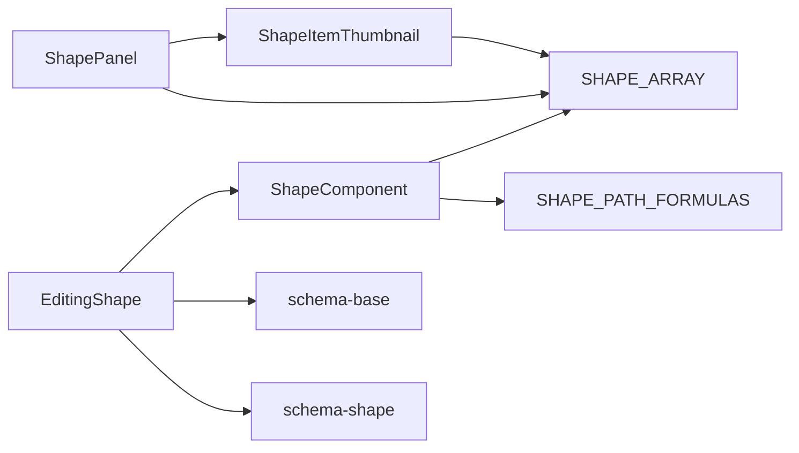

# 形状组件

<cite>
**本文引用的文件**
- [common/slide-shape/src/component/ShapeComponent.tsx](file://common/slide-shape/src/component/ShapeComponent.tsx)
- [common/slide-shape/src/component/ShapePanel.tsx](file://common/slide-shape/src/component/ShapePanel.tsx)
- [common/slide-shape/src/component/ShapeItemThumbnail.tsx](file://common/slide-shape/src/component/ShapeItemThumbnail.tsx)
- [common/slide-shape/src/utils/shapes.ts](file://common/slide-shape/src/utils/shapes.ts)
- [common/slide-shape/src/utils/index.ts](file://common/slide-shape/src/utils/index.ts)
- [common/slide-shape/src/App.tsx](file://common/slide-shape/src/App.tsx)
- [common/slide-shape/src/index.ts](file://common/slide-shape/src/index.ts)
- [common/slide-shape/src/component/style.less](file://common/slide-shape/src/component/style.less)
- [common/slide-shape/package.json](file://common/slide-shape/package.json)
- [editor/src/components/Shape/EditingShape.tsx](file://editor/src/components/Shape/EditingShape.tsx)
- [editor/src/components/_config/schema-shape.ts](file://editor/src/components/_config/schema-shape.ts)
- [editor/src/components/_config/schema-base.ts](file://editor/src/components/_config/schema-base.ts)
</cite>

## 目录
1. [简介](#简介)
2. [项目结构](#项目结构)
3. [核心组件](#核心组件)
4. [架构总览](#架构总览)
5. [详细组件分析](#详细组件分析)
6. [依赖关系分析](#依赖关系分析)
7. [性能考量](#性能考量)
8. [故障排查指南](#故障排查指南)
9. [结论](#结论)
10. [附录](#附录)

## 简介
本文件面向 Slides Engine 的“形状组件”，系统性梳理其设计架构、形状定义、面板管理、缩略图展示、绘制算法、样式定制与交互处理机制，并提供配置参数、使用方法与扩展指南。同时给出在课件设计中的典型应用场景与创意用法，帮助开发者快速理解并高效集成。

## 项目结构
形状组件位于公共包 @slide/slide-shape 内，采用“组件 + 工具函数 + 面板”的分层组织方式：
- 组件层：编辑态渲染器 ShapeComponent、形状面板 ShapePanel、缩略图 ShapeItemThumbnail
- 工具层：形状池 SHAPE_LIST、路径公式 SHAPE_PATH_FORMULAS、导出入口 utils/index.ts
- 编辑器集成：编辑器侧行为与资源定义 EditingShape，以及样式与信息配置 schema

图表来源
- [common/slide-shape/src/component/ShapeComponent.tsx:1-114](file://common/slide-shape/src/component/ShapeComponent.tsx#L1-L114)
- [common/slide-shape/src/component/ShapePanel.tsx:1-33](file://common/slide-shape/src/component/ShapePanel.tsx#L1-L33)
- [common/slide-shape/src/component/ShapeItemThumbnail.tsx:1-47](file://common/slide-shape/src/component/ShapeItemThumbnail.tsx#L1-L47)
- [common/slide-shape/src/utils/shapes.ts:1-1151](file://common/slide-shape/src/utils/shapes.ts#L1-L1151)
- [common/slide-shape/src/App.tsx:1-41](file://common/slide-shape/src/App.tsx#L1-L41)
- [common/slide-shape/src/index.ts:1-2](file://common/slide-shape/src/index.ts#L1-L2)
- [common/slide-shape/src/utils/index.ts:1-1](file://common/slide-shape/src/utils/index.ts#L1-L1)
- [common/slide-shape/src/component/style.less:1-5](file://common/slide-shape/src/component/style.less#L1-L5)
- [common/slide-shape/package.json:1-30](file://common/slide-shape/package.json#L1-L30)
- [editor/src/components/Shape/EditingShape.tsx:1-104](file://editor/src/components/Shape/EditingShape.tsx#L1-L104)
- [editor/src/components/_config/schema-shape.ts:1-34](file://editor/src/components/_config/schema-shape.ts#L1-L34)
- [editor/src/components/_config/schema-base.ts:1-65](file://editor/src/components/_config/schema-base.ts#L1-L65)

章节来源
- [common/slide-shape/src/index.ts:1-2](file://common/slide-shape/src/index.ts#L1-L2)
- [common/slide-shape/src/utils/index.ts:1-1](file://common/slide-shape/src/utils/index.ts#L1-L1)
- [common/slide-shape/package.json:1-30](file://common/slide-shape/package.json#L1-L30)

## 核心组件
- ShapeComponent：编辑态/预览态统一渲染器，根据传入的 shapeKey 选择形状，按 viewBox 与尺寸计算路径，支持样式透传与交互属性注入。
- ShapePanel：形状面板容器，按分类展示形状组，内部使用 ShapeItemThumbnail 渲染缩略图。
- ShapeItemThumbnail：缩略图项，用于拖拽或点击选择形状，内部以 SVG 渲染路径，支持 hover 样式切换。
- 工具函数与形状池：SHAPE_LIST 定义所有可用形状及其元数据；SHAPE_PATH_FORMULAS 提供可编辑形状的路径生成公式；SHAPE_ARRAY 展平为一维数组便于检索。

章节来源
- [common/slide-shape/src/component/ShapeComponent.tsx:1-114](file://common/slide-shape/src/component/ShapeComponent.tsx#L1-L114)
- [common/slide-shape/src/component/ShapePanel.tsx:1-33](file://common/slide-shape/src/component/ShapePanel.tsx#L1-L33)
- [common/slide-shape/src/component/ShapeItemThumbnail.tsx:1-47](file://common/slide-shape/src/component/ShapeItemThumbnail.tsx#L1-L47)
- [common/slide-shape/src/utils/shapes.ts:1-1151](file://common/slide-shape/src/utils/shapes.ts#L1-L1151)

## 架构总览
编辑器通过 EditingShape 将 ShapeComponent 注册为可放置的组件，并提供默认样式与配置 Schema。ShapeComponent 在运行时根据传入的 shapeKey 从 SHAPE_LIST 中查找对应形状，若存在路径公式则动态计算路径，最终以 SVG path 渲染。

图表来源
- [editor/src/components/Shape/EditingShape.tsx:1-104](file://editor/src/components/Shape/EditingShape.tsx#L1-L104)
- [common/slide-shape/src/component/ShapeComponent.tsx:1-114](file://common/slide-shape/src/component/ShapeComponent.tsx#L1-L114)
- [common/slide-shape/src/utils/shapes.ts:1-1151](file://common/slide-shape/src/utils/shapes.ts#L1-L1151)

## 详细组件分析

### ShapeComponent 组件
- 功能职责
  - 接收 useConnect/useReport/id/pageId/shapeKey/style/mode/treeNodeProps 等参数
  - 在编辑态与预览态分别渲染，预览态合并 initStyleProps 与 styleMapProps
  - 根据 shapeKey 从 SHAPE_ARRAY 中匹配形状，若存在 pathFormula 则调用公式生成 path
  - 使用 viewBox 与实际宽高进行比例换算，保证缩放一致性
- 关键流程
  - 初始化实例注册与默认命名设置
  - 计算 viewBox 与 path，设置非缩放描边属性
  - 渲染 SVG g 容器与 path 元素，应用 fill/stroke/strokeWidth 等样式
- 交互与样式
  - 支持 borderStyle/borderColor/fill/borderWidth 等样式透传
  - 预览态禁用指针事件，避免遮挡底层交互

图表来源
- [common/slide-shape/src/component/ShapeComponent.tsx:1-114](file://common/slide-shape/src/component/ShapeComponent.tsx#L1-L114)
- [common/slide-shape/src/utils/shapes.ts:1-1151](file://common/slide-shape/src/utils/shapes.ts#L1-L1151)

章节来源
- [common/slide-shape/src/component/ShapeComponent.tsx:1-114](file://common/slide-shape/src/component/ShapeComponent.tsx#L1-L114)

### ShapePanel 面板
- 功能职责
  - 基于 SHAPE_LIST 分类展示形状组
  - 每个分组下使用 ShapeItemThumbnail 渲染缩略图
  - 通过 node 与 shapeKey 将选择事件传递给编辑器
- 结构特点
  - 外层容器固定宽度，内部使用 flex-wrap 实现多列自适应
  - 分组标题与子项间距通过样式控制

章节来源
- [common/slide-shape/src/component/ShapePanel.tsx:1-33](file://common/slide-shape/src/component/ShapePanel.tsx#L1-L33)
- [common/slide-shape/src/utils/shapes.ts:323-818](file://common/slide-shape/src/utils/shapes.ts#L323-L818)

### ShapeItemThumbnail 缩略图
- 功能职责
  - 渲染小尺寸 SVG，展示 shape 的 path
  - 通过 data-* 属性携带节点与形状标识，便于拖拽/点击选择
  - hover 时改变描边颜色，提升交互反馈
- 设计要点
  - 固定 18x18 画布，基于 shape.viewBox 进行 scale 平移变换
  - 支持 outlined 标志切换填充/描边显示

章节来源
- [common/slide-shape/src/component/ShapeItemThumbnail.tsx:1-47](file://common/slide-shape/src/component/ShapeItemThumbnail.tsx#L1-L47)
- [common/slide-shape/src/component/style.less:1-5](file://common/slide-shape/src/component/style.less#L1-L5)

### 形状定义与路径公式
- 形状池 SHAPE_LIST
  - 按类型分组（矩形、常用形状、箭头、其他形状、线性等）
  - 每个形状包含 viewBox/path/key 及可选的 pathFormula/pptxShapeType/title/outlined/special
- 路径公式 SHAPE_PATH_FORMULAS
  - 定义可编辑形状的参数化公式，支持 defaultValue/range/relative/getBaseSize/formula
  - 常见公式：圆角矩形、裁剪矩形系列、L 形、环形、加号、三角形、平行四边形、梯形、子弹形、指示器等
- 展平数组 SHAPE_ARRAY
  - 将多级分组展平为一维数组，便于按 key 快速检索

章节来源
- [common/slide-shape/src/utils/shapes.ts:1-1151](file://common/slide-shape/src/utils/shapes.ts#L1-L1151)

### 编辑器集成与配置
- EditingShape
  - 定义行为与资源，设置默认样式（宽高、transform、边框、填充）
  - 通过 genPropsSchema 合并基础与形状配置，提供右侧面板
- 配置 Schema
  - schema-base：宽高、透明度、位置、边框、圆角等通用样式
  - schema-shape：填充色、边框样式等形状特有配置

章节来源
- [editor/src/components/Shape/EditingShape.tsx:1-104](file://editor/src/components/Shape/EditingShape.tsx#L1-L104)
- [editor/src/components/_config/schema-base.ts:1-65](file://editor/src/components/_config/schema-base.ts#L1-L65)
- [editor/src/components/_config/schema-shape.ts:1-34](file://editor/src/components/_config/schema-shape.ts#L1-L34)

## 依赖关系分析
- 组件间依赖
  - ShapeComponent 依赖 utils/shapes 中的 SHAPE_ARRAY 与 SHAPE_PATH_FORMULAS
  - ShapePanel 依赖 utils/shapes 的 SHAPE_LIST 与 ShapeItemThumbnail
  - ShapeItemThumbnail 依赖 utils/shapes 的 ShapePoolItem 类型与 viewBox/path
- 编辑器依赖
  - EditingShape 依赖 @slide/slide-shape 的 ShapeComponent 与配置 Schema
- 导出与入口
  - utils/index.ts 与 index.ts 统一导出工具与组件，便于外部按需引入

图表来源
- [common/slide-shape/src/component/ShapeComponent.tsx:1-114](file://common/slide-shape/src/component/ShapeComponent.tsx#L1-L114)
- [common/slide-shape/src/component/ShapePanel.tsx:1-33](file://common/slide-shape/src/component/ShapePanel.tsx#L1-L33)
- [common/slide-shape/src/component/ShapeItemThumbnail.tsx:1-47](file://common/slide-shape/src/component/ShapeItemThumbnail.tsx#L1-L47)
- [common/slide-shape/src/utils/shapes.ts:1-1151](file://common/slide-shape/src/utils/shapes.ts#L1-L1151)
- [editor/src/components/Shape/EditingShape.tsx:1-104](file://editor/src/components/Shape/EditingShape.tsx#L1-L104)
- [editor/src/components/_config/schema-base.ts:1-65](file://editor/src/components/_config/schema-base.ts#L1-L65)
- [editor/src/components/_config/schema-shape.ts:1-34](file://editor/src/components/_config/schema-shape.ts#L1-L34)

章节来源
- [common/slide-shape/src/index.ts:1-2](file://common/slide-shape/src/index.ts#L1-L2)
- [common/slide-shape/src/utils/index.ts:1-1](file://common/slide-shape/src/utils/index.ts#L1-L1)

## 性能考量
- 路径计算
  - 可编辑形状通过公式动态生成 path，建议在尺寸变化时才重新计算，避免频繁重绘
- 渲染优化
  - 使用 vectorEffect="non-scaling-stroke" 保持描边一致视觉
  - 预览态关闭指针事件，减少事件冒泡开销
- 缩略图
  - 固定 18x18 画布，使用 scale/translate 控制 viewBox 映射，降低复杂度

## 故障排查指南
- 形状不显示或变形
  - 检查 shapeKey 是否存在于 SHAPE_ARRAY
  - 确认 viewBox 与实际宽高比例是否一致
- 边框样式异常
  - borderStyle 为 none 时 stroke 会被设为 none
  - dashed 需要通过 strokeDasharray 设置
- 缩略图 hover 无效
  - 检查 style.less 中 .shape-item-thumbnail:hover 样式是否生效
- 编辑器右侧面板无配置
  - 确认 EditingShape 的 propsSchema 与默认值是否正确设置
  - 检查 genPropsSchema 合并顺序与字段名

章节来源
- [common/slide-shape/src/component/ShapeComponent.tsx:62-110](file://common/slide-shape/src/component/ShapeComponent.tsx#L62-L110)
- [common/slide-shape/src/component/style.less:1-5](file://common/slide-shape/src/component/style.less#L1-L5)
- [editor/src/components/Shape/EditingShape.tsx:28-77](file://editor/src/components/Shape/EditingShape.tsx#L28-L77)

## 结论
形状组件通过“形状池 + 路径公式”的设计，实现了对多种几何图形的统一管理与动态渲染。编辑器侧通过行为与资源定义，将组件无缝接入课件编辑流程。该架构具备良好的可扩展性与可维护性，适合在课件设计中灵活使用与二次开发。

## 附录

### 配置参数与使用方法
- 组件参数（ShapeComponent）
  - useConnect/useReport：实例连接与上报钩子
  - id/pageId：节点与页面标识
  - shapeKey：目标形状 key
  - style：样式对象（width/height/transform/fill/borderStyle/borderColor/borderWidth 等）
  - mode：渲染模式（edit/preview）
  - treeNodeProps：树节点属性
  - initStyleProps/styleMapProps：预览态样式合并
- 编辑器配置（EditingShape）
  - 默认样式：width/height/transform/borderWidth/fill/borderColor/borderStyle
  - 右侧面板：通过 schema-base 与 schema-shape 合并生成

章节来源
- [common/slide-shape/src/component/ShapeComponent.tsx:3-27](file://common/slide-shape/src/component/ShapeComponent.tsx#L3-L27)
- [editor/src/components/Shape/EditingShape.tsx:28-77](file://editor/src/components/Shape/EditingShape.tsx#L28-L77)
- [editor/src/components/_config/schema-base.ts:7-35](file://editor/src/components/_config/schema-base.ts#L7-L35)
- [editor/src/components/_config/schema-shape.ts:7-17](file://editor/src/components/_config/schema-shape.ts#L7-L17)

### 支持的几何图形与实现原理
- 基础形状
  - 矩形、圆角矩形、裁剪矩形系列、L 形、环形、加号等
  - 通过 path 或路径公式生成，支持相对参数与边界范围
- 常用形状
  - 圆形、三角形、平行四边形、梯形、菱形、星形、月亮、云朵等
  - 部分形状为特殊路径或标注形状（special/outlined）
- 线性与箭头
  - 百分比线、方向箭头线、反应箭头线、三杠线、叉线等
  - 以 outlined 标志实现描边样式

章节来源
- [common/slide-shape/src/utils/shapes.ts:323-1147](file://common/slide-shape/src/utils/shapes.ts#L323-L1147)

### 绘制算法与样式定制
- 绘制算法
  - 非公式形状：直接使用 shape.path
  - 公式形状：根据 width/height 与参数 value 计算半径/点位，生成路径字符串
  - viewBox 与实际尺寸映射：通过 scale 与 translate 保持比例一致
- 样式定制
  - 填充色 fill、边框样式 borderStyle、边框颜色 borderColor、边框宽度 borderWidth
  - 预览态禁用指针事件，避免遮挡底层交互

章节来源
- [common/slide-shape/src/utils/shapes.ts:51-322](file://common/slide-shape/src/utils/shapes.ts#L51-L322)
- [common/slide-shape/src/component/ShapeComponent.tsx:50-110](file://common/slide-shape/src/component/ShapeComponent.tsx#L50-L110)

### 交互处理机制
- 缩略图交互
  - 通过 data-designer-source-id 与 data-shape-key 标识节点与形状
  - hover 改变描边颜色，增强可点击反馈
- 编辑器集成
  - EditingShape 将组件注册为资源，支持拖拽放置与属性配置
  - 通过 setDefaultName 与 useConnect 完成实例注册与命名

章节来源
- [common/slide-shape/src/component/ShapeItemThumbnail.tsx:20-44](file://common/slide-shape/src/component/ShapeItemThumbnail.tsx#L20-L44)
- [editor/src/components/Shape/EditingShape.tsx:28-77](file://editor/src/components/Shape/EditingShape.tsx#L28-L77)

### 扩展指南
- 新增形状
  - 在 SHAPE_LIST 中添加新分组或子项，设置 key/viewBox/path
  - 若为可编辑形状，补充 SHAPE_PATH_FORMULAS 中的公式
- 自定义路径
  - 直接提供 path 字符串或通过公式生成
  - 注意 viewBox 与路径坐标的匹配
- 面板与缩略图
  - 如需自定义缩略图样式，可在 style.less 中扩展
  - 面板布局可通过 Flex/Grid 调整，保持响应式

章节来源
- [common/slide-shape/src/utils/shapes.ts:323-1147](file://common/slide-shape/src/utils/shapes.ts#L323-L1147)
- [common/slide-shape/src/component/style.less:1-5](file://common/slide-shape/src/component/style.less#L1-L5)

### 应用场景与创意用法
- 课件设计
  - 使用箭头与线性形状构建流程图、思维导图与讲解路径
  - 使用多边形与特殊形状装饰页面元素
- 交互教学
  - 使用百分比线、指示器等强调重点区域
  - 使用 outlined 样式突出轮廓，便于讲解
- 创意组合
  - 将多个形状组合为复合图标或徽标
  - 利用可编辑形状参数调整比例，适配不同分辨率