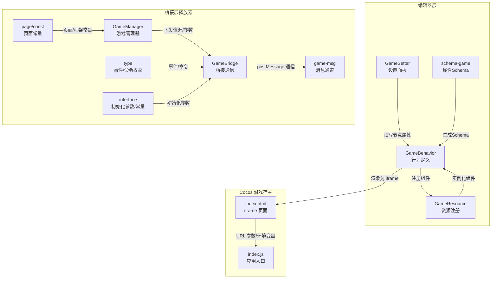
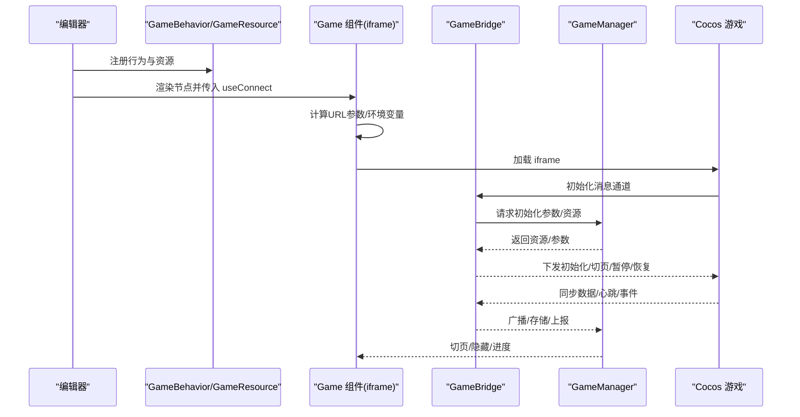
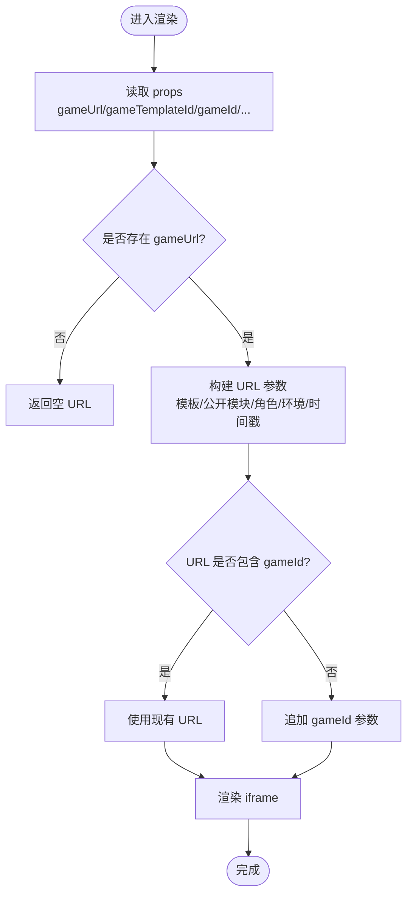
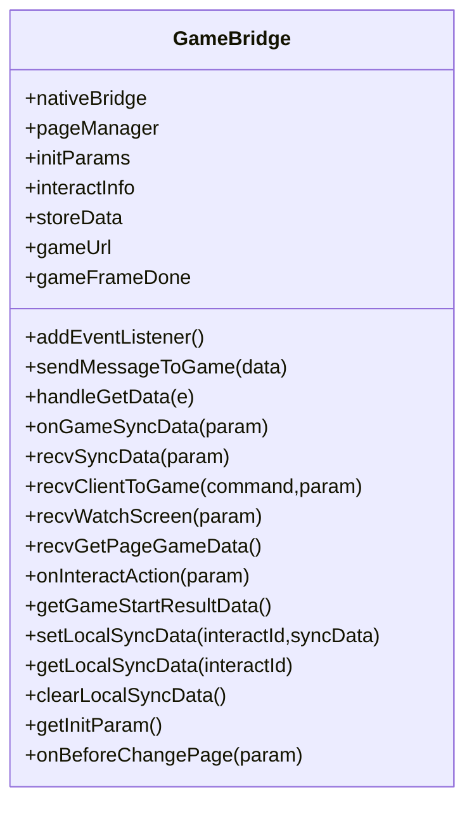
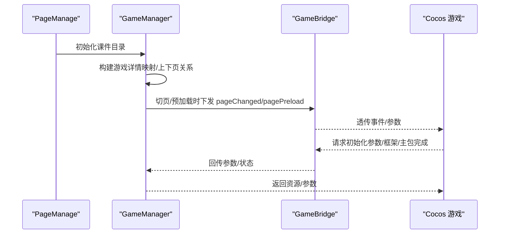
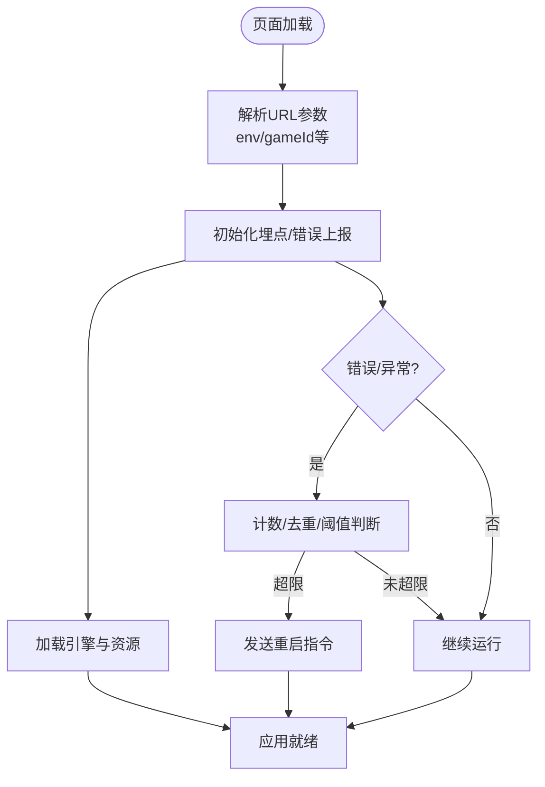
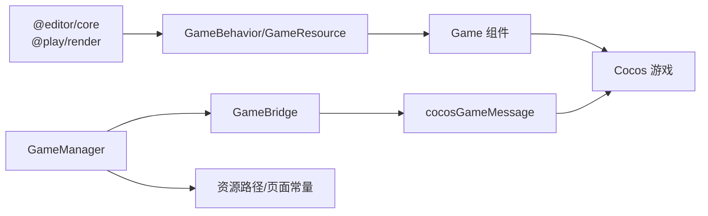

# 游戏组件

<cite>
**本文引用的文件**
- [editingGame.tsx](file://editor/src/components/Game/editingGame.tsx)
- [schema-game.ts](file://editor/src/components/_config/schema-game.ts)
- [GameSetter.tsx](file://editor/src/settingComponents/GameSetting/GameSetter.tsx)
- [gameManager.ts](file://bridge/mcc-player/src/components/game-manage/gameManager.ts)
- [gameBridge.ts](file://bridge/mcc-player/src/components/game-manage/gameBridge.ts)
- [game-msg.ts](file://bridge/mcc-player/src/components/game-manage/game-msg.ts)
- [type.ts](file://bridge/mcc-player/src/components/game-manage/type.ts)
- [index.ts](file://bridge/mcc-player/src/interface/index.ts)
- [const.ts](file://bridge/mcc-player/src/components/page/const.ts)
- [index.html](file://bridge/cocos-game-player/index.html)
- [index.js](file://bridge/cocos-game-player/index.js)
</cite>

## 目录
1. [简介](#简介)
2. [项目结构](#项目结构)
3. [核心组件](#核心组件)
4. [架构总览](#架构总览)
5. [详细组件分析](#详细组件分析)
6. [依赖关系分析](#依赖关系分析)
7. [性能考量](#性能考量)
8. [故障排查指南](#故障排查指南)
9. [结论](#结论)
10. [附录](#附录)

## 简介
本文件面向 Slides Engine 的“游戏组件”，系统性阐述其设计架构与实现细节，覆盖以下主题：
- 游戏组件的行为定义与资源注册
- 游戏组件在编辑器与预览模式下的差异与集成
- 通过 iframe 集成 Cocos 游戏的 URL 参数构建、环境变量处理与实时通信机制
- 游戏组件的状态管理、生命周期控制与错误处理策略
- 配置项、属性与样式定制建议
- 与桥接系统的交互方式与消息协议

## 项目结构
围绕“游戏组件”的关键代码分布在三个层面：
- 编辑器层：行为与资源注册、属性 Schema、设置面板
- 桥接层（播放器）：游戏管理器、桥接通信、页面与资源路径解析
- Cocos 游戏宿主：iframe 内嵌的 Cocos Creator 应用入口与消息通道

图表来源
- [editingGame.tsx:13-39](file://editor/src/components/Game/editingGame.tsx#L13-L39)
- [editingGame.tsx:41-61](file://editor/src/components/Game/editingGame.tsx#L41-L61)
- [schema-game.ts:1-10](file://editor/src/components/_config/schema-game.ts#L1-L10)
- [GameSetter.tsx:16-115](file://editor/src/settingComponents/GameSetting/GameSetter.tsx#L16-L115)
- [gameManager.ts:65-368](file://bridge/mcc-player/src/components/game-manage/gameManager.ts#L65-L368)
- [gameBridge.ts:22-388](file://bridge/mcc-player/src/components/game-manage/gameBridge.ts#L22-L388)
- [game-msg.ts:6-89](file://bridge/mcc-player/src/components/game-manage/game-msg.ts#L6-L89)
- [type.ts:1-67](file://bridge/mcc-player/src/components/game-manage/type.ts#L1-L67)
- [index.ts:17-71](file://bridge/mcc-player/src/interface/index.ts#L17-L71)
- [const.ts:1-26](file://bridge/mcc-player/src/components/page/const.ts#L1-L26)
- [index.html:231-364](file://bridge/cocos-game-player/index.html#L231-L364)
- [index.js:14-29](file://bridge/cocos-game-player/index.js#L14-L29)

章节来源
- [editingGame.tsx:1-120](file://editor/src/components/Game/editingGame.tsx#L1-L120)
- [schema-game.ts:1-10](file://editor/src/components/_config/schema-game.ts#L1-L10)
- [GameSetter.tsx:1-116](file://editor/src/settingComponents/GameSetting/GameSetter.tsx#L1-L116)
- [gameManager.ts:1-368](file://bridge/mcc-player/src/components/game-manage/gameManager.ts#L1-L368)
- [gameBridge.ts:1-388](file://bridge/mcc-player/src/components/game-manage/gameBridge.ts#L1-L388)
- [game-msg.ts:1-90](file://bridge/mcc-player/src/components/game-manage/game-msg.ts#L1-L90)
- [type.ts:1-67](file://bridge/mcc-player/src/components/game-manage/type.ts#L1-L67)
- [index.ts:1-71](file://bridge/mcc-player/src/interface/index.ts#L1-L71)
- [const.ts:1-26](file://bridge/mcc-player/src/components/page/const.ts#L1-L26)
- [index.html:1-368](file://bridge/cocos-game-player/index.html#L1-L368)
- [index.js:1-30](file://bridge/cocos-game-player/index.js#L1-L30)

## 核心组件
- GameBehavior：定义游戏组件在编辑器中的行为、可拖拽性、属性 Schema 与本地化文案。
- GameResource：定义“游戏”资源卡片，用于从工具栏拖入画布并生成初始节点。
- Game 组件（渲染层）：基于 useConnect 注册实例，计算 iframe URL 参数，注入环境变量，渲染 iframe。
- GameSetter：编辑器侧的设置面板，根据游戏类型动态调整“是否为题目”等属性，并触发任务创建。

章节来源
- [editingGame.tsx:13-39](file://editor/src/components/Game/editingGame.tsx#L13-L39)
- [editingGame.tsx:41-61](file://editor/src/components/Game/editingGame.tsx#L41-L61)
- [editingGame.tsx:63-120](file://editor/src/components/Game/editingGame.tsx#L63-L120)
- [schema-game.ts:1-10](file://editor/src/components/_config/schema-game.ts#L1-L10)
- [GameSetter.tsx:16-115](file://editor/src/settingComponents/GameSetting/GameSetter.tsx#L16-L115)

## 架构总览
游戏组件的运行链路分为“编辑器配置—桥接下发—Cocos 游戏执行—实时通信—页面联动”五个阶段。

图表来源
- [editingGame.tsx:63-120](file://editor/src/components/Game/editingGame.tsx#L63-L120)
- [gameBridge.ts:44-110](file://bridge/mcc-player/src/components/game-manage/gameBridge.ts#L44-L110)
- [gameManager.ts:99-176](file://bridge/mcc-player/src/components/game-manage/gameManager.ts#L99-L176)
- [index.html:231-364](file://bridge/cocos-game-player/index.html#L231-L364)

## 详细组件分析

### 编辑器侧：GameBehavior 与 GameResource
- 行为定义：限定组件名为“Game”，提供属性 Schema（删除样式属性），禁止拖拽，注入 useConnect 以与渲染层建立连接。
- 资源注册：提供“游戏”资源卡片，拖入后生成带默认样式的 Game 节点。

章节来源
- [editingGame.tsx:13-39](file://editor/src/components/Game/editingGame.tsx#L13-L39)
- [editingGame.tsx:41-61](file://editor/src/components/Game/editingGame.tsx#L41-L61)
- [schema-game.ts:1-10](file://editor/src/components/_config/schema-game.ts#L1-L10)

### 编辑器侧：GameSetter 设置面板
- 功能：根据游戏类型切换“是否为题目”选项，约束 PK 游戏必须为题目，作品类游戏固定为非题目，星豆雨类游戏不显示该选项。
- 交互：变更后调用外部回调以保存节点状态并触发任务创建。

章节来源
- [GameSetter.tsx:16-115](file://editor/src/settingComponents/GameSetting/GameSetter.tsx#L16-L115)

### 渲染层：Game 组件（iframe 集成）
- 实例注册：使用 useConnect 注册实例，暴露 forceUpdate 与 remove 方法，便于编辑器侧刷新与卸载。
- URL 参数构建：从 props 读取游戏 URL 与模板/游戏标识，拼接模板 ID、模板名称、公开模块、角色、环境变量与时间戳；若 URL 中不含 gameId，则自动补全。
- 环境变量：读取 import.meta.env.MODE，注入 env 参数供 Cocos 侧识别。
- iframe 渲染：设置宽高与指针事件，按选中状态决定可交互性。

图表来源
- [editingGame.tsx:63-120](file://editor/src/components/Game/editingGame.tsx#L63-L120)

章节来源
- [editingGame.tsx:63-120](file://editor/src/components/Game/editingGame.tsx#L63-L120)

### 桥接层：GameBridge 与消息通道
- 消息通道：全局注册 cocosGameMessage，提供 on/off/dispatch/removeAll，作为游戏与 MCC 之间的事件总线。
- 事件处理：统一处理游戏侧请求（如主包/框架初始化完成、获取初始化参数、游戏开始、切页、暂停/恢复、同步数据等），并向游戏侧回发命令或数据。
- 同步数据：区分心跳与操作，过滤心跳后回发自身，通过 Pomelo 广播或透传至端上；支持教师端存储、学生端本地存储与被观看场景的数据转发。
- 互动与授权：维护互动状态与授权状态，必要时透传端上消息并更新游戏额外启动参数（如 FPS、状态）。

图表来源
- [gameBridge.ts:22-388](file://bridge/mcc-player/src/components/game-manage/gameBridge.ts#L22-L388)

章节来源
- [gameBridge.ts:44-110](file://bridge/mcc-player/src/components/game-manage/gameBridge.ts#L44-L110)
- [gameBridge.ts:116-189](file://bridge/mcc-player/src/components/game-manage/gameBridge.ts#L116-L189)
- [gameBridge.ts:194-243](file://bridge/mcc-player/src/components/game-manage/gameBridge.ts#L194-L243)
- [gameBridge.ts:286-320](file://bridge/mcc-player/src/components/game-manage/gameBridge.ts#L286-L320)
- [gameBridge.ts:322-339](file://bridge/mcc-player/src/components/game-manage/gameBridge.ts#L322-L339)
- [gameBridge.ts:341-371](file://bridge/mcc-player/src/components/game-manage/gameBridge.ts#L341-L371)

### 桥接层：GameManager 与资源/页面管理
- 初始化：根据课件目录构建游戏详情映射，记录上下页关系；设置资源路径（本地/CDN）与初始化参数。
- 切页与预加载：在切页时向游戏下发当前页与下一页的游戏数据；预加载下一游戏页。
- 资源解析：根据公共模块与子游戏模板的资源清单，拼装公共包与子包 URL。
- 数据下发：提供 getGameUrlParams/getWatchScreenData，供游戏侧按需拉取。

图表来源
- [gameManager.ts:99-176](file://bridge/mcc-player/src/components/game-manage/gameManager.ts#L99-L176)
- [gameManager.ts:200-260](file://bridge/mcc-player/src/components/game-manage/gameManager.ts#L200-L260)
- [gameManager.ts:265-277](file://bridge/mcc-player/src/components/game-manage/gameManager.ts#L265-L277)
- [gameManager.ts:289-332](file://bridge/mcc-player/src/components/game-manage/gameManager.ts#L289-L332)
- [gameManager.ts:337-365](file://bridge/mcc-player/src/components/game-manage/gameManager.ts#L337-L365)

章节来源
- [gameManager.ts:65-124](file://bridge/mcc-player/src/components/game-manage/gameManager.ts#L65-L124)
- [gameManager.ts:130-176](file://bridge/mcc-player/src/components/game-manage/gameManager.ts#L130-L176)
- [gameManager.ts:200-260](file://bridge/mcc-player/src/components/game-manage/gameManager.ts#L200-L260)
- [gameManager.ts:289-332](file://bridge/mcc-player/src/components/game-manage/gameManager.ts#L289-L332)
- [gameManager.ts:337-365](file://bridge/mcc-player/src/components/game-manage/gameManager.ts#L337-L365)

### Cocos 游戏宿主：iframe 页面与应用入口
- 页面初始化：解析 URL 参数，识别环境变量（online/test），初始化埋点与错误上报策略。
- 错误与 WebGL 失败处理：统计错误频率，超过阈值触发重启指令；捕获 WebGL 失败事件并上报。
- 应用入口：加载 polyfills、SystemJS、import-map，随后加载 index.js 启动 Application。

图表来源
- [index.html:231-364](file://bridge/cocos-game-player/index.html#L231-L364)
- [index.html:286-321](file://bridge/cocos-game-player/index.html#L286-L321)
- [index.js:14-29](file://bridge/cocos-game-player/index.js#L14-L29)

章节来源
- [index.html:231-364](file://bridge/cocos-game-player/index.html#L231-L364)
- [index.html:286-321](file://bridge/cocos-game-player/index.html#L286-L321)
- [index.js:14-29](file://bridge/cocos-game-player/index.js#L14-L29)

## 依赖关系分析
- 编辑器层依赖：@editor/core（行为/资源）、@play/render（useConnect）、@slides/react（表单）、Ant Design（Radio/FormItem）。
- 桥接层依赖：@ld/micro-app（微应用/全局数据）、PageManage（页面管理）、NativeBridge（端上通信）、Logger（日志）。
- 通信协议：通过 GameBridge 的 cocosGameMessage 事件总线与 GameEvent/GameCommand 枚举约定消息契约。
- 资源路径：GameManager 依据本地/远程路径定义与资源清单，拼装公共包与子包 URL。

图表来源
- [editingGame.tsx:1-7](file://editor/src/components/Game/editingGame.tsx#L1-L7)
- [gameBridge.ts:1-14](file://bridge/mcc-player/src/components/game-manage/gameBridge.ts#L1-L14)
- [gameManager.ts:6-13](file://bridge/mcc-player/src/components/game-manage/gameManager.ts#L6-L13)
- [type.ts:1-67](file://bridge/mcc-player/src/components/game-manage/type.ts#L1-L67)
- [const.ts:16-26](file://bridge/mcc-player/src/components/page/const.ts#L16-L26)

章节来源
- [editingGame.tsx:1-7](file://editor/src/components/Game/editingGame.tsx#L1-L7)
- [gameBridge.ts:1-14](file://bridge/mcc-player/src/components/game-manage/gameBridge.ts#L1-L14)
- [gameManager.ts:6-13](file://bridge/mcc-player/src/components/game-manage/gameManager.ts#L6-L13)
- [type.ts:1-67](file://bridge/mcc-player/src/components/game-manage/type.ts#L1-L67)
- [const.ts:16-26](file://bridge/mcc-player/src/components/page/const.ts#L16-L26)

## 性能考量
- URL 参数缓存：渲染层对 URL 使用 useMemo，避免重复拼接；建议在 props 变更时再触发重算。
- 资源加载：GameManager 优先使用本地路径，其次 CDN 列表，减少跨域与网络抖动影响。
- 事件风暴抑制：Cocos 侧对错误上报进行去重与频率限制，防止频繁重启。
- 切页与预加载：预加载下一游戏页，降低切页卡顿；非游戏页暂停引擎，节省资源。

## 故障排查指南
- 无法加载游戏
  - 检查 gameUrl 是否存在，确认模板/游戏参数是否正确拼接。
  - 核对环境变量 env 与 CDN/本地路径配置。
- 通信异常
  - 确认 cocosGameMessage 已注册且监听目标有效。
  - 检查 GameBridge 的事件分发与回调是否正确。
- 同步数据不同步
  - 核对心跳与操作数据分离逻辑，确保仅回发非心跳操作。
  - 检查教师端/学生端存储策略与授权状态。
- WebGL 失败或频繁重启
  - 关注错误计数与阈值，必要时清理缓存或切换资源路径。
  - 检查 Canvas 尺寸与设备兼容性。

章节来源
- [editingGame.tsx:87-99](file://editor/src/components/Game/editingGame.tsx#L87-L99)
- [gameBridge.ts:44-110](file://bridge/mcc-player/src/components/game-manage/gameBridge.ts#L44-L110)
- [gameBridge.ts:116-189](file://bridge/mcc-player/src/components/game-manage/gameBridge.ts#L116-L189)
- [index.html:286-321](file://bridge/cocos-game-player/index.html#L286-L321)

## 结论
游戏组件通过“编辑器行为/资源—渲染层 iframe—桥接通信—资源管理—Cocos 宿主”的完整链路，实现了可配置、可交互、可扩展的游戏集成方案。其关键优势在于：
- 明确的职责划分与松耦合的通信协议
- 健壮的错误处理与资源路径容灾
- 支持多角色、多课堂形态的实时同步与授权

## 附录

### 配置选项与属性设置
- 游戏类型：星豆雨、普通游戏、PK 游戏、作品游戏
- 是否为题目：受游戏类型约束（PK 默认为是，作品为否）
- 属性 Schema：通过 schema-game.ts 定义，编辑器侧以 GameSetter 渲染

章节来源
- [GameSetter.tsx:16-115](file://editor/src/settingComponents/GameSetting/GameSetter.tsx#L16-L115)
- [schema-game.ts:1-10](file://editor/src/components/_config/schema-game.ts#L1-L10)

### URL 参数与环境变量
- 必填参数：templateId、templateName、publicModel、openPanel、env、gameId、role、v（时间戳）
- 可选参数：根据需求追加，渲染层会自动补全缺失的 gameId

章节来源
- [editingGame.tsx:87-99](file://editor/src/components/Game/editingGame.tsx#L87-L99)
- [index.html:242-243](file://bridge/cocos-game-player/index.html#L242-L243)

### 生命周期与状态管理
- 初始化：编辑器渲染 Game 组件 → 计算 URL → 加载 iframe
- 运行期：桥接层下发参数/资源 → 游戏侧完成主包/框架加载 → 切页/暂停/恢复
- 销毁：编辑器卸载实例 → 清理监听与本地存储

章节来源
- [editingGame.tsx:75-85](file://editor/src/components/Game/editingGame.tsx#L75-L85)
- [gameBridge.ts:65-83](file://bridge/mcc-player/src/components/game-manage/gameBridge.ts#L65-L83)
- [gameManager.ts:200-260](file://bridge/mcc-player/src/components/game-manage/gameManager.ts#L200-L260)

### 与桥接系统的交互
- 事件/命令：通过 GameEvent/GameCommand 枚举约定
- 数据流：初始化参数、资源 URL、切页数据、同步数据、授权状态
- 常量：页面类型、框架名称、隐藏游戏等

章节来源
- [type.ts:1-67](file://bridge/mcc-player/src/components/game-manage/type.ts#L1-L67)
- [index.ts:17-71](file://bridge/mcc-player/src/interface/index.ts#L17-L71)
- [const.ts:16-26](file://bridge/mcc-player/src/components/page/const.ts#L16-L26)