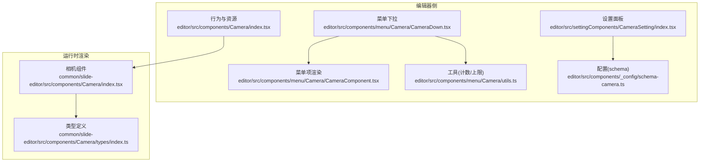
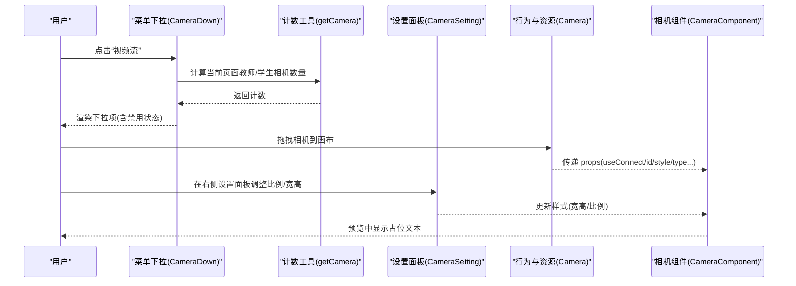
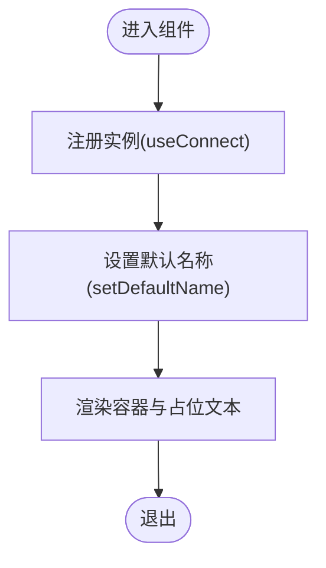
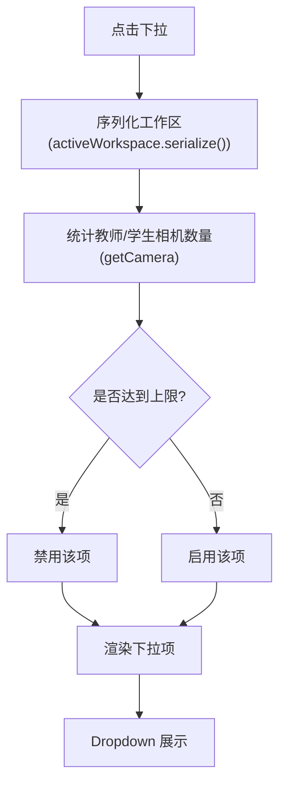
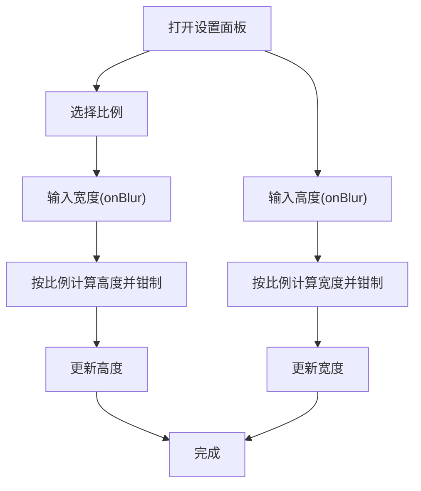
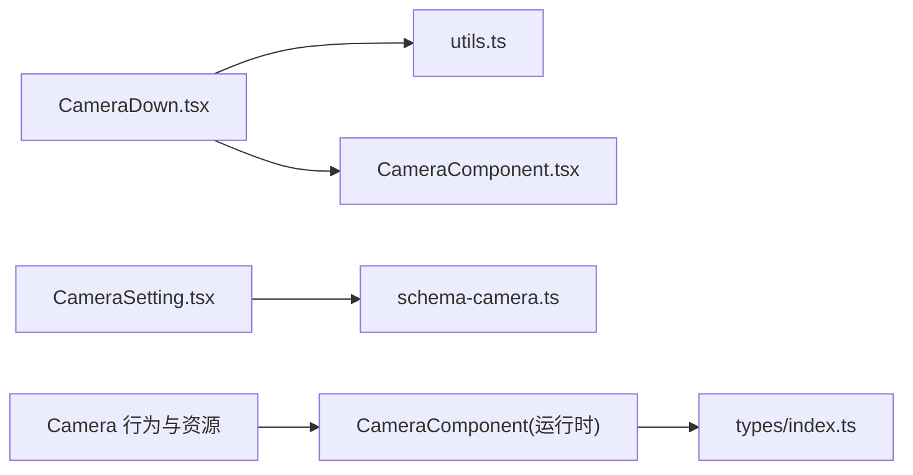

# 相机组件

<cite>
**本文引用的文件**
- [common/slide-editor/src/components/Camera/index.tsx](file://common/slide-editor/src/components/Camera/index.tsx)
- [common/slide-editor/src/components/Camera/types/index.ts](file://common/slide-editor/src/components/Camera/types/index.ts)
- [editor/src/components/Camera/index.tsx](file://editor/src/components/Camera/index.tsx)
- [editor/src/components/menu/Camera/CameraDown.tsx](file://editor/src/components/menu/Camera/CameraDown.tsx)
- [editor/src/components/menu/Camera/CameraComponent.tsx](file://editor/src/components/menu/Camera/CameraComponent.tsx)
- [editor/src/components/menu/Camera/utils.ts](file://editor/src/components/menu/Camera/utils.ts)
- [editor/src/settingComponents/CameraSetting/index.tsx](file://editor/src/settingComponents/CameraSetting/index.tsx)
- [editor/src/components/_config/schema-camera.ts](file://editor/src/components/_config/schema-camera.ts)
</cite>

## 目录
1. [简介](#简介)
2. [项目结构](#项目结构)
3. [核心组件](#核心组件)
4. [架构总览](#架构总览)
5. [详细组件分析](#详细组件分析)
6. [依赖关系分析](#依赖关系分析)
7. [性能考虑](#性能考虑)
8. [故障排查指南](#故障排查指南)
9. [结论](#结论)
10. [附录](#附录)

## 简介
本文件面向 Slides Engine 的“相机组件”，系统性梳理其设计原理、实现细节与使用方式，覆盖以下方面：
- 相机组件的行为定义与菜单集成
- 下拉选择与数量限制逻辑
- 视频流展示与尺寸比例控制
- 与渲染上下文的连接机制
- 错误处理与边界条件
- 配置参数、使用场景与最佳实践
- 浏览器兼容性与性能优化建议

说明：当前代码库中“相机组件”主要承担“占位展示”职责，不直接进行视频捕获或媒体流管理；真实设备权限与媒体流能力由桥接层负责，编辑器侧通过行为与设置面板进行约束与配置。

## 项目结构
围绕相机组件的关键文件分布如下：
- 编辑器侧行为与资源注册：editor/src/components/Camera/index.tsx
- 菜单下拉与数量限制：editor/src/components/menu/Camera/CameraDown.tsx、utils.ts
- 菜单项渲染：editor/src/components/menu/Camera/CameraComponent.tsx
- 设置面板（比例与尺寸联动）：editor/src/settingComponents/CameraSetting/index.tsx
- 样式与默认值配置：editor/src/components/_config/schema-camera.ts
- 运行时渲染组件：common/slide-editor/src/components/Camera/index.tsx
- 类型定义：common/slide-editor/src/components/Camera/types/index.ts

图表来源
- [editor/src/components/Camera/index.tsx:1-73](file://editor/src/components/Camera/index.tsx#L1-L73)
- [editor/src/components/menu/Camera/CameraDown.tsx:1-67](file://editor/src/components/menu/Camera/CameraDown.tsx#L1-L67)
- [editor/src/components/menu/Camera/CameraComponent.tsx:1-33](file://editor/src/components/menu/Camera/CameraComponent.tsx#L1-L33)
- [editor/src/settingComponents/CameraSetting/index.tsx:1-122](file://editor/src/settingComponents/CameraSetting/index.tsx#L1-L122)
- [editor/src/components/_config/schema-camera.ts:1-32](file://editor/src/components/_config/schema-camera.ts#L1-L32)
- [common/slide-editor/src/components/Camera/index.tsx:1-51](file://common/slide-editor/src/components/Camera/index.tsx#L1-L51)
- [common/slide-editor/src/components/Camera/types/index.ts:1-25](file://common/slide-editor/src/components/Camera/types/index.ts#L1-L25)

章节来源
- [editor/src/components/Camera/index.tsx:1-73](file://editor/src/components/Camera/index.tsx#L1-L73)
- [editor/src/components/menu/Camera/CameraDown.tsx:1-67](file://editor/src/components/menu/Camera/CameraDown.tsx#L1-L67)
- [editor/src/components/menu/Camera/utils.ts:1-21](file://editor/src/components/menu/Camera/utils.ts#L1-L21)
- [editor/src/settingComponents/CameraSetting/index.tsx:1-122](file://editor/src/settingComponents/CameraSetting/index.tsx#L1-L122)
- [editor/src/components/_config/schema-camera.ts:1-32](file://editor/src/components/_config/schema-camera.ts#L1-L32)
- [common/slide-editor/src/components/Camera/index.tsx:1-51](file://common/slide-editor/src/components/Camera/index.tsx#L1-L51)
- [common/slide-editor/src/components/Camera/types/index.ts:1-25](file://common/slide-editor/src/components/Camera/types/index.ts#L1-L25)

## 核心组件
- 相机组件（运行时渲染）
  - 职责：在预览/编辑模式下渲染占位文本，支持绝对定位与样式透传；通过 useConnect 注册实例以参与渲染上下文。
  - 关键点：使用 useReducer 强制更新；注册/卸载实例；透传 treeNodeProps 与 preview-id。
  - 参考路径：[common/slide-editor/src/components/Camera/index.tsx:1-51](file://common/slide-editor/src/components/Camera/index.tsx#L1-L51)

- 相机类型与属性
  - 枚举：CameraType.teacher、CameraType.student
  - 接口：IComponentProps 定义了 useConnect、id、style、treeNodeProps、setDefaultName、mode、type、getStyle 等字段。
  - 参考路径：[common/slide-editor/src/components/Camera/types/index.ts:1-25](file://common/slide-editor/src/components/Camera/types/index.ts#L1-L25)

- 编辑器侧行为与资源
  - 行为：定义选择器、设计器属性、本地化文案、默认样式合并等。
  - 资源：将“相机”作为可拖拽资源放入画布。
  - 参考路径：[editor/src/components/Camera/index.tsx:1-73](file://editor/src/components/Camera/index.tsx#L1-L73)

- 菜单下拉与数量限制
  - 下拉项：教师流、学生流两种类型。
  - 限制：教师流最多 1 个，学生流最多 5 个；根据当前页面已存在数量动态禁用。
  - 参考路径：
    - [editor/src/components/menu/Camera/CameraDown.tsx:1-67](file://editor/src/components/menu/Camera/CameraDown.tsx#L1-L67)
    - [editor/src/components/menu/Camera/utils.ts:1-21](file://editor/src/components/menu/Camera/utils.ts#L1-L21)

- 设置面板（比例与尺寸联动）
  - 支持比例选择（如 4:3、1:1），并联动宽高计算与最小最大值钳制。
  - 参考路径：[editor/src/settingComponents/CameraSetting/index.tsx:1-122](file://editor/src/settingComponents/CameraSetting/index.tsx#L1-L122)

- 样式与默认值配置
  - 默认宽高、边框、背景色、最小/最大宽高、初始比例等。
  - 参考路径：[editor/src/components/_config/schema-camera.ts:1-32](file://editor/src/components/_config/schema-camera.ts#L1-L32)

章节来源
- [common/slide-editor/src/components/Camera/index.tsx:1-51](file://common/slide-editor/src/components/Camera/index.tsx#L1-L51)
- [common/slide-editor/src/components/Camera/types/index.ts:1-25](file://common/slide-editor/src/components/Camera/types/index.ts#L1-L25)
- [editor/src/components/Camera/index.tsx:1-73](file://editor/src/components/Camera/index.tsx#L1-L73)
- [editor/src/components/menu/Camera/CameraDown.tsx:1-67](file://editor/src/components/menu/Camera/CameraDown.tsx#L1-L67)
- [editor/src/components/menu/Camera/utils.ts:1-21](file://editor/src/components/menu/Camera/utils.ts#L1-L21)
- [editor/src/settingComponents/CameraSetting/index.tsx:1-122](file://editor/src/settingComponents/CameraSetting/index.tsx#L1-L122)
- [editor/src/components/_config/schema-camera.ts:1-32](file://editor/src/components/_config/schema-camera.ts#L1-L32)

## 架构总览
相机组件在编辑器与运行时的协作关系如下：

图表来源
- [editor/src/components/menu/Camera/CameraDown.tsx:1-67](file://editor/src/components/menu/Camera/CameraDown.tsx#L1-L67)
- [editor/src/components/menu/Camera/utils.ts:1-21](file://editor/src/components/menu/Camera/utils.ts#L1-L21)
- [editor/src/settingComponents/CameraSetting/index.tsx:1-122](file://editor/src/settingComponents/CameraSetting/index.tsx#L1-L122)
- [editor/src/components/Camera/index.tsx:1-73](file://editor/src/components/Camera/index.tsx#L1-L73)
- [common/slide-editor/src/components/Camera/index.tsx:1-51](file://common/slide-editor/src/components/Camera/index.tsx#L1-L51)

## 详细组件分析

### 相机组件（运行时渲染）
- 设计要点
  - 使用 useConnect 注册实例，便于渲染上下文调度与强制刷新。
  - 将类型映射为占位文本（教师/学生），便于在编辑器中识别。
  - 样式透传与绝对定位，确保与其他元素叠加一致。
- 复杂度与性能
  - 渲染为纯文本占位，开销极低；强制更新通过 useReducer 触发，避免不必要的重渲染。
- 错误处理
  - 当节点被移除时，卸载实例；未见异常分支，需在上层保证节点生命周期正确。

图表来源
- [common/slide-editor/src/components/Camera/index.tsx:1-51](file://common/slide-editor/src/components/Camera/index.tsx#L1-L51)

章节来源
- [common/slide-editor/src/components/Camera/index.tsx:1-51](file://common/slide-editor/src/components/Camera/index.tsx#L1-L51)
- [common/slide-editor/src/components/Camera/types/index.ts:1-25](file://common/slide-editor/src/components/Camera/types/index.ts#L1-L25)

### 菜单下拉与数量限制
- 功能说明
  - 提供“教师视频流”和“学生视频流”两个下拉项。
  - 基于当前页面已存在的相机数量动态启用/禁用对应项。
- 限制规则
  - 教师流最多 1 个；学生流最多 5 个。
- 交互体验
  - 通过 Tooltip 提示“当前页面最多放 N 个”。

图表来源
- [editor/src/components/menu/Camera/CameraDown.tsx:1-67](file://editor/src/components/menu/Camera/CameraDown.tsx#L1-L67)
- [editor/src/components/menu/Camera/utils.ts:1-21](file://editor/src/components/menu/Camera/utils.ts#L1-L21)

章节来源
- [editor/src/components/menu/Camera/CameraDown.tsx:1-67](file://editor/src/components/menu/Camera/CameraDown.tsx#L1-L67)
- [editor/src/components/menu/Camera/utils.ts:1-21](file://editor/src/components/menu/Camera/utils.ts#L1-L21)

### 设置面板（比例与尺寸联动）
- 功能说明
  - 比例选择：支持 4:3、1:1。
  - 尺寸联动：根据比例与最小/最大约束自动计算宽高。
- 实现要点
  - 通过正则提取数值，结合 clamp 进行边界钳制。
  - 宽/高任一变更后，另一维按比例同步更新。
- 用户体验
  - 宽高输入建议使用失焦触发，避免频繁计算。

图表来源
- [editor/src/settingComponents/CameraSetting/index.tsx:1-122](file://editor/src/settingComponents/CameraSetting/index.tsx#L1-L122)

章节来源
- [editor/src/settingComponents/CameraSetting/index.tsx:1-122](file://editor/src/settingComponents/CameraSetting/index.tsx#L1-L122)

### 行为与资源（编辑器侧）
- 行为定义
  - 选择器：匹配组件名为“Camera”的节点。
  - 设计器属性：合并基础样式与相机样式，注入默认属性与样式修改回调。
  - 本地化：提供中英文文案。
- 资源注册
  - 将“相机”作为资源拖拽到画布，设置组件名与装饰器/组件映射。

章节来源
- [editor/src/components/Camera/index.tsx:1-73](file://editor/src/components/Camera/index.tsx#L1-L73)

## 依赖关系分析
- 组件耦合
  - 编辑器侧 CameraDown 依赖计数工具与类型枚举，耦合度低，便于扩展。
  - 设置面板与 schema-camera 协作，统一样式配置入口。
  - 运行时 CameraComponent 仅依赖 useConnect 与类型定义，保持轻量。
- 外部依赖
  - Ant Design Dropdown、Select、Tooltip 等 UI 组件。
  - React Hooks（useEffect、useReducer、observer 等）。

图表来源
- [editor/src/components/menu/Camera/CameraDown.tsx:1-67](file://editor/src/components/menu/Camera/CameraDown.tsx#L1-L67)
- [editor/src/components/menu/Camera/utils.ts:1-21](file://editor/src/components/menu/Camera/utils.ts#L1-L21)
- [editor/src/components/menu/Camera/CameraComponent.tsx:1-33](file://editor/src/components/menu/Camera/CameraComponent.tsx#L1-L33)
- [editor/src/settingComponents/CameraSetting/index.tsx:1-122](file://editor/src/settingComponents/CameraSetting/index.tsx#L1-L122)
- [editor/src/components/_config/schema-camera.ts:1-32](file://editor/src/components/_config/schema-camera.ts#L1-L32)
- [editor/src/components/Camera/index.tsx:1-73](file://editor/src/components/Camera/index.tsx#L1-L73)
- [common/slide-editor/src/components/Camera/index.tsx:1-51](file://common/slide-editor/src/components/Camera/index.tsx#L1-L51)
- [common/slide-editor/src/components/Camera/types/index.ts:1-25](file://common/slide-editor/src/components/Camera/types/index.ts#L1-L25)

章节来源
- [editor/src/components/menu/Camera/CameraDown.tsx:1-67](file://editor/src/components/menu/Camera/CameraDown.tsx#L1-L67)
- [editor/src/components/menu/Camera/utils.ts:1-21](file://editor/src/components/menu/Camera/utils.ts#L1-L21)
- [editor/src/settingComponents/CameraSetting/index.tsx:1-122](file://editor/src/settingComponents/CameraSetting/index.tsx#L1-L122)
- [editor/src/components/_config/schema-camera.ts:1-32](file://editor/src/components/_config/schema-camera.ts#L1-L32)
- [editor/src/components/Camera/index.tsx:1-73](file://editor/src/components/Camera/index.tsx#L1-L73)
- [common/slide-editor/src/components/Camera/index.tsx:1-51](file://common/slide-editor/src/components/Camera/index.tsx#L1-L51)
- [common/slide-editor/src/components/Camera/types/index.ts:1-25](file://common/slide-editor/src/components/Camera/types/index.ts#L1-L25)

## 性能考虑
- 渲染成本
  - 相机组件为纯文本占位，渲染开销极低；仅在节点属性变化或强制更新时重渲染。
- 强制更新策略
  - 使用 useReducer 触发强制更新，避免深层比较与无谓重渲染。
- 设置面板联动
  - 建议宽高输入采用 onBlur 触发计算，减少频繁重排与样式抖动。
- 最小/最大约束
  - 通过 clamp 钳制宽高，避免极端值导致布局异常。

## 故障排查指南
- 下拉项不可用
  - 检查当前页面是否已达上限（教师 1 个、学生 5 个）。
  - 确认 activeWorkspace 序列化数据正确，计数逻辑正常。
  - 参考路径：
    - [editor/src/components/menu/Camera/CameraDown.tsx:1-67](file://editor/src/components/menu/Camera/CameraDown.tsx#L1-L67)
    - [editor/src/components/menu/Camera/utils.ts:1-21](file://editor/src/components/menu/Camera/utils.ts#L1-L21)
- 比例/尺寸异常
  - 检查比例选择与最小/最大宽高设置是否冲突。
  - 确认 onBlur 触发时机与 clamp 边界。
  - 参考路径：
    - [editor/src/settingComponents/CameraSetting/index.tsx:1-122](file://editor/src/settingComponents/CameraSetting/index.tsx#L1-L122)
- 占位文本未显示
  - 确认节点已成功注册实例，且类型值有效。
  - 参考路径：
    - [common/slide-editor/src/components/Camera/index.tsx:1-51](file://common/slide-editor/src/components/Camera/index.tsx#L1-L51)
    - [common/slide-editor/src/components/Camera/types/index.ts:1-25](file://common/slide-editor/src/components/Camera/types/index.ts#L1-L25)

章节来源
- [editor/src/components/menu/Camera/CameraDown.tsx:1-67](file://editor/src/components/menu/Camera/CameraDown.tsx#L1-L67)
- [editor/src/components/menu/Camera/utils.ts:1-21](file://editor/src/components/menu/Camera/utils.ts#L1-L21)
- [editor/src/settingComponents/CameraSetting/index.tsx:1-122](file://editor/src/settingComponents/CameraSetting/index.tsx#L1-L122)
- [common/slide-editor/src/components/Camera/index.tsx:1-51](file://common/slide-editor/src/components/Camera/index.tsx#L1-L51)
- [common/slide-editor/src/components/Camera/types/index.ts:1-25](file://common/slide-editor/src/components/Camera/types/index.ts#L1-L25)

## 结论
- 当前相机组件聚焦“占位展示”，通过行为、菜单与设置面板形成完整的编辑体验。
- 数量限制与比例/尺寸联动保障了页面布局的一致性与可用性。
- 运行时渲染组件保持极简，便于扩展为真实视频流播放器（例如接入媒体流 API 或桥接层）。

## 附录
- 配置参数
  - 默认样式：宽高、边框、背景色、最小/最大宽高、初始比例。
  - 参考路径：[editor/src/components/_config/schema-camera.ts:1-32](file://editor/src/components/_config/schema-camera.ts#L1-L32)
- 使用场景
  - 教学演示页：插入教师/学生视频流占位，后续由桥接层替换为真实流。
  - 预览校验：通过比例与尺寸联动快速验证布局合理性。
- 最佳实践
  - 在设置面板中优先使用 onBlur 触发尺寸计算。
  - 严格遵守数量上限，避免页面拥挤。
  - 为不同类型的相机提供清晰的占位文案，提升编辑效率。