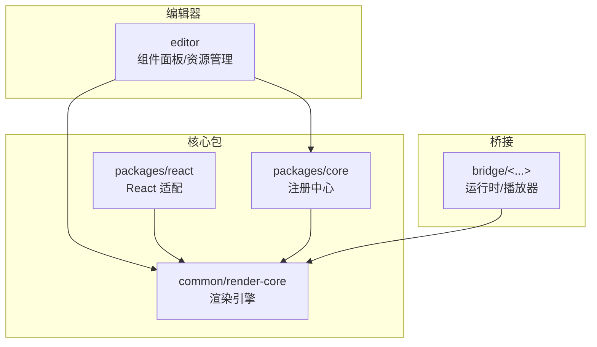
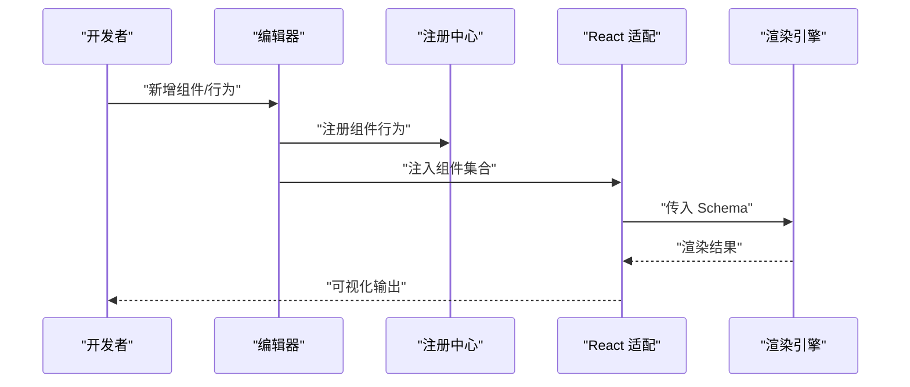
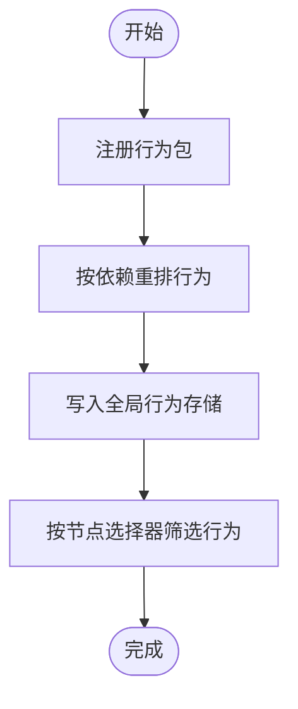
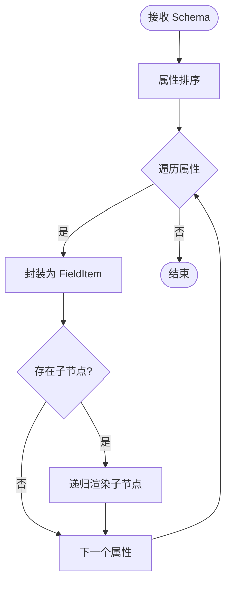
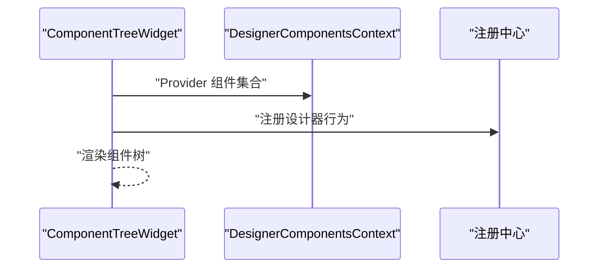
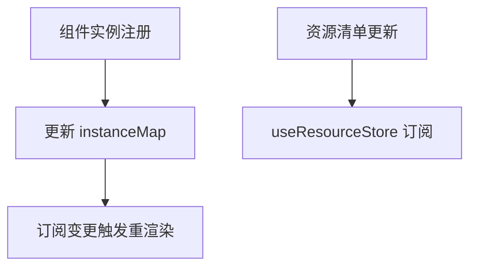
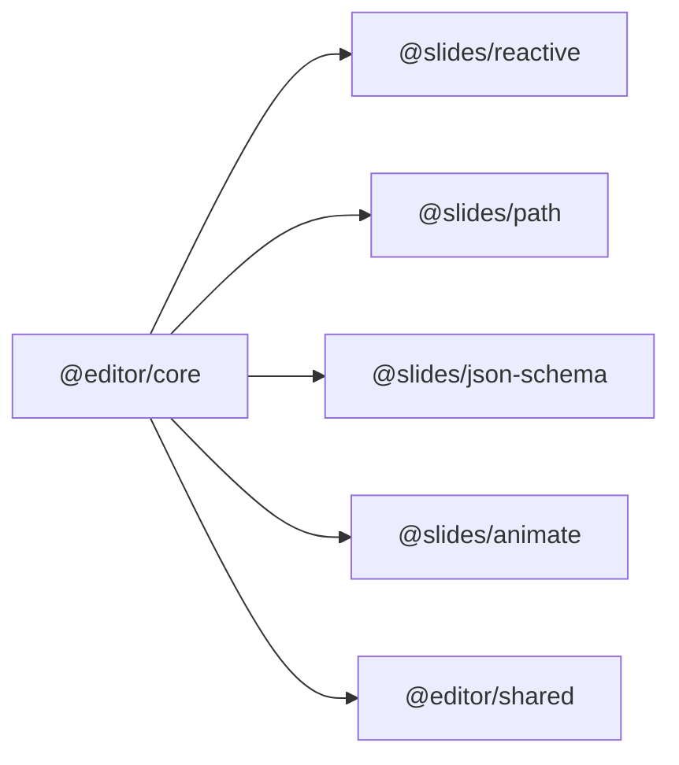

# 组件开发指南

<cite>
**本文引用的文件**   
- [README.md](file://README.md)
- [packages/core/src/registry.ts](file://packages/core/src/registry.ts)
- [packages/core/src/exports.ts](file://packages/core/src/exports.ts)
- [packages/react/src/hooks/useComponents.ts](file://packages/react/src/hooks/useComponents.ts)
- [packages/react/src/widgets/ComponentTreeWidget/index.tsx](file://packages/react/src/widgets/ComponentTreeWidget/index.tsx)
- [common/render-core/index.tsx](file://common/render-core/index.tsx)
- [common/render-core/schema.ts](file://common/render-core/schema.ts)
- [common/render-core/models/context.ts](file://common/render-core/models/context.ts)
- [editor/src/components/ResourceManager/index.tsx](file://editor/src/components/ResourceManager/index.tsx)
- [packages/core/package.json](file://packages/core/package.json)
</cite>

## 目录
1. [简介](#简介)
2. [项目结构](#项目结构)
3. [核心组件](#核心组件)
4. [架构总览](#架构总览)
5. [详细组件分析](#详细组件分析)
6. [依赖分析](#依赖分析)
7. [性能考虑](#性能考虑)
8. [故障排查指南](#故障排查指南)
9. [结论](#结论)
10. [附录](#附录)

## 简介
本指南面向“Slides Engine”组件体系，提供从零到一开发新组件的完整流程与最佳实践，涵盖组件设计、Schema 定义、行为实现、渲染逻辑、与编辑器/渲染引擎的集成、组件间通信、测试策略与常见问题排查。目标是帮助开发者在统一的注册与渲染框架下，快速、稳定地交付高质量组件。

## 项目结构
Slides Engine 采用多包工作区（pnpm workspaces）组织，核心围绕“组件注册中心 + 渲染核心 + 编辑器桥接”展开：
- packages/core：组件注册中心与设计器行为、图标、本地化等基础设施
- packages/react：React 侧组件树挂载与上下文注入
- common/render-core：通用渲染引擎与 Schema 抽象
- editor：编辑器前端，负责组件面板、资源管理、行为注册入口
- bridge：游戏/播放器桥接示例（可复用为组件运行时环境）

图表来源
- [packages/core/src/registry.ts:75-186](file://packages/core/src/registry.ts#L75-L186)
- [packages/react/src/widgets/ComponentTreeWidget/index.tsx:90-115](file://packages/react/src/widgets/ComponentTreeWidget/index.tsx#L90-L115)
- [common/render-core/index.tsx:52-76](file://common/render-core/index.tsx#L52-L76)
- [editor/src/components/ResourceManager/index.tsx:1-13](file://editor/src/components/ResourceManager/index.tsx#L1-L13)

章节来源
- [README.md:1-17](file://README.md#L1-L17)
- [packages/core/package.json:1-24](file://packages/core/package.json#L1-L24)

## 核心组件
- 注册中心（GlobalRegistry）
  - 提供设计器语言、图标、本地化、行为注册与查询能力
  - 支持按节点选择器筛选行为，保证行为排序与继承关系正确
- 渲染核心（RenderCore/RenderRoot）
  - 基于 Schema 的递归渲染，支持属性排序、字段包装与内置小部件注入
- React 适配（ComponentTreeWidget + useComponents）
  - 将组件集合注入 React 上下文，驱动组件树渲染
- 实例与资源存储（useInstanceStore/useResourceStore）
  - 统一管理受控组件实例与资源清单，便于调试与跨组件通信

章节来源
- [packages/core/src/registry.ts:75-186](file://packages/core/src/registry.ts#L75-L186)
- [common/render-core/index.tsx:52-76](file://common/render-core/index.tsx#L52-L76)
- [packages/react/src/widgets/ComponentTreeWidget/index.tsx:90-115](file://packages/react/src/widgets/ComponentTreeWidget/index.tsx#L90-L115)
- [packages/react/src/hooks/useComponents.ts:1-3](file://packages/react/src/hooks/useComponents.ts#L1-L3)
- [common/render-core/models/context.ts:95-140](file://common/render-core/models/context.ts#L95-L140)
- [editor/src/components/ResourceManager/index.tsx:1-13](file://editor/src/components/ResourceManager/index.tsx#L1-L13)

## 架构总览
组件开发遵循“注册中心 + 渲染引擎 + 编辑器桥接”的分层架构：
- 注册中心负责行为与资源的全局管理
- 渲染引擎负责将 Schema 转换为 UI
- 编辑器负责组件面板、行为注册与资源管理
- 桥接层提供运行时环境（如游戏/播放器）

图表来源
- [packages/core/src/registry.ts:177-185](file://packages/core/src/registry.ts#L177-L185)
- [packages/react/src/widgets/ComponentTreeWidget/index.tsx:90-115](file://packages/react/src/widgets/ComponentTreeWidget/index.tsx#L90-L115)
- [common/render-core/index.tsx:52-76](file://common/render-core/index.tsx#L52-L76)

## 详细组件分析

### 组件注册与行为系统
- 行为注册
  - 通过注册中心批量注册行为包，内部会根据依赖关系重排，确保继承链正确
  - 支持按节点选择器过滤行为，便于针对不同节点类型应用差异化逻辑
- 图标与本地化
  - 提供图标与多语言消息查询接口，便于组件面板与提示文案国际化
- 语言与区域设置
  - 支持动态切换设计器语言，并根据浏览器语言初始化

图表来源
- [packages/core/src/registry.ts:34-62](file://packages/core/src/registry.ts#L34-L62)
- [packages/core/src/registry.ts:177-185](file://packages/core/src/registry.ts#L177-L185)

章节来源
- [packages/core/src/registry.ts:75-186](file://packages/core/src/registry.ts#L75-L186)

### 渲染引擎与 Schema
- Schema 抽象
  - 顶层为“ui:widget + props + properties”，支持嵌套子节点
  - 提供节点 Schema 到通用 Schema 的转换函数，便于从节点树生成渲染树
- 渲染流程
  - RenderCore 对 properties 排序后逐项渲染，使用 FieldItem 包装字段
  - RenderRoot 注入内置小部件，提供统一渲染入口
- 页面级控制
  - 支持 activePageId/pageId 等参数，便于页面切换与状态隔离

图表来源
- [common/render-core/index.tsx:52-76](file://common/render-core/index.tsx#L52-L76)
- [common/render-core/schema.ts:124-145](file://common/render-core/schema.ts#L124-L145)

章节来源
- [common/render-core/index.tsx:8-76](file://common/render-core/index.tsx#L8-L76)
- [common/render-core/schema.ts:1-145](file://common/render-core/schema.ts#L1-L145)

### React 适配与组件树
- 组件树挂载
  - ComponentTreeWidget 将组件集合注入上下文，并基于设计器节点渲染树
  - 在挂载时调用注册中心注册设计器行为，确保行为生效
- React Hook
  - useComponents 提供对设计器组件集合的访问，便于在子组件中读取

图表来源
- [packages/react/src/widgets/ComponentTreeWidget/index.tsx:90-115](file://packages/react/src/widgets/ComponentTreeWidget/index.tsx#L90-L115)
- [packages/react/src/hooks/useComponents.ts:1-3](file://packages/react/src/hooks/useComponents.ts#L1-L3)

章节来源
- [packages/react/src/widgets/ComponentTreeWidget/index.tsx:90-115](file://packages/react/src/widgets/ComponentTreeWidget/index.tsx#L90-L115)
- [packages/react/src/hooks/useComponents.ts:1-3](file://packages/react/src/hooks/useComponents.ts#L1-L3)

### 实例与资源存储
- 实例存储
  - useInstanceStore 提供组件实例注册/卸载，支持按 id 查询与订阅变更
- 资源存储
  - useResourceStore 提供资源清单，便于组件间共享资源与调试

图表来源
- [common/render-core/models/context.ts:95-140](file://common/render-core/models/context.ts#L95-L140)

章节来源
- [common/render-core/models/context.ts:95-140](file://common/render-core/models/context.ts#L95-L140)
- [editor/src/components/ResourceManager/index.tsx:1-13](file://editor/src/components/ResourceManager/index.tsx#L1-L13)

### 与编辑器/渲染引擎的集成
- 注册组件
  - 在编辑器侧通过注册中心注册组件行为，确保行为在设计器中可用
- 处理用户交互
  - 使用实例存储与资源存储进行组件状态与资源的同步
- 组件间通信
  - 通过实例存储的 id 映射实现跨组件引用与通信

章节来源
- [packages/core/src/registry.ts:177-185](file://packages/core/src/registry.ts#L177-L185)
- [common/render-core/models/context.ts:95-140](file://common/render-core/models/context.ts#L95-L140)
- [editor/src/components/ResourceManager/index.tsx:1-13](file://editor/src/components/ResourceManager/index.tsx#L1-L13)

## 依赖分析
- 核心依赖
  - @slides/reactive：响应式数据结构，支撑注册中心与存储的响应式更新
  - @slides/path：路径解析，用于本地化消息检索
  - @slides/json-schema：JSON Schema 工具，支撑组件 Schema 的校验与转换
- 业务依赖
  - @slides/animate：动画能力，可作为组件行为或渲染扩展
  - @editor/shared：共享工具库，提供遍历、合并等基础能力

图表来源
- [packages/core/package.json:12-18](file://packages/core/package.json#L12-L18)

章节来源
- [packages/core/package.json:1-24](file://packages/core/package.json#L1-L24)

## 性能考虑
- 渲染性能
  - 使用属性排序减少不必要的重渲染；仅在实例变化时触发重渲染
  - 合理拆分组件，避免单个节点渲染树过大
- 注册性能
  - 行为重排仅在注册阶段执行，避免运行时重复计算
- 资源管理
  - 通过资源存储集中管理资源，避免重复加载与内存泄漏

## 故障排查指南
- 行为未生效
  - 检查是否在组件树挂载时调用注册中心注册行为
  - 确认节点选择器与目标节点匹配
- 实例未注册
  - 检查实例注册/卸载逻辑是否正确，确认 id 是否唯一
- 资源异常
  - 通过资源管理器查看资源清单，定位资源加载与释放问题
- 渲染异常
  - 检查 Schema 结构是否符合抽象定义，确认子节点递归渲染逻辑

章节来源
- [packages/react/src/widgets/ComponentTreeWidget/index.tsx:90-115](file://packages/react/src/widgets/ComponentTreeWidget/index.tsx#L90-L115)
- [common/render-core/models/context.ts:95-140](file://common/render-core/models/context.ts#L95-L140)
- [editor/src/components/ResourceManager/index.tsx:1-13](file://editor/src/components/ResourceManager/index.tsx#L1-L13)

## 结论
通过注册中心、渲染引擎与编辑器的协同，Slides Engine 为组件开发提供了清晰的扩展点与稳定的运行时保障。遵循本文的流程与规范，可在不破坏整体架构的前提下，快速实现高质量组件，并实现行为、渲染与运行时的无缝衔接。

## 附录
- 开发流程建议
  - 设计阶段：明确组件职责与 Schema 字段，定义行为与交互
  - 实现阶段：实现渲染逻辑与行为注册，接入实例/资源存储
  - 集成阶段：在编辑器中注册组件与行为，验证渲染与交互
  - 测试阶段：编写单元/集成/可视化测试，覆盖关键路径与边界条件
- 最佳实践
  - 命名规范：组件名、行为名、Schema 字段保持一致语义
  - 错误处理：对非法 Schema 与缺失依赖进行显式报错
  - 性能优化：避免深层嵌套与重复渲染，合理拆分组件
  - 文档与测试：为每个组件提供最小可运行示例与测试用例