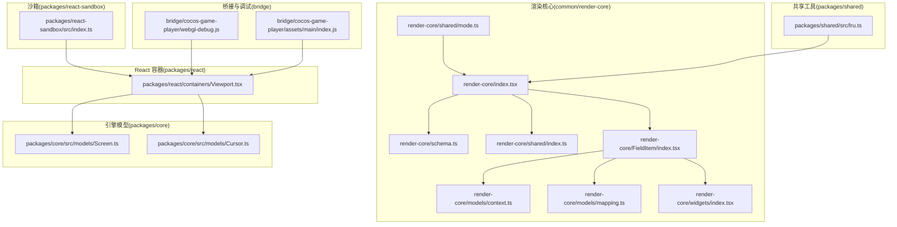
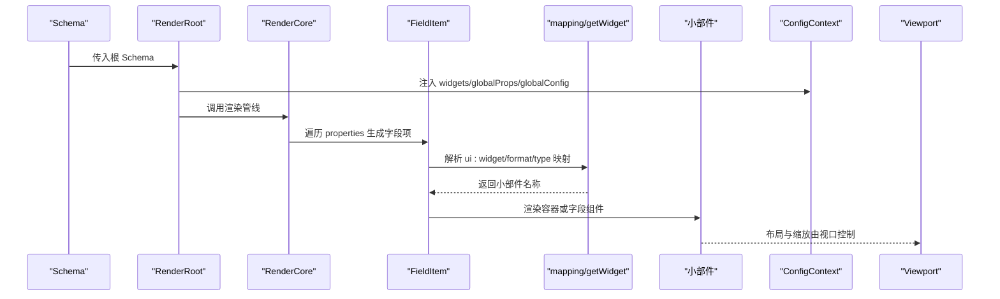
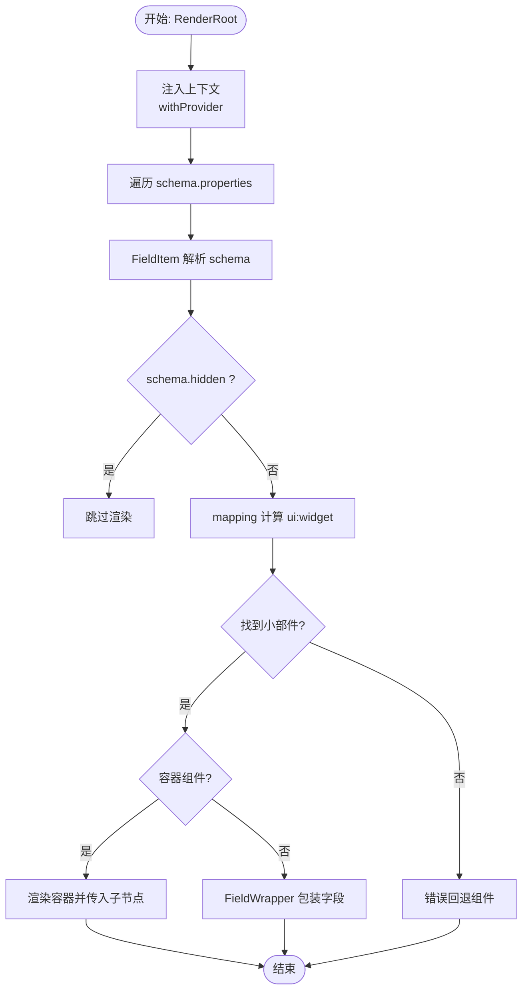
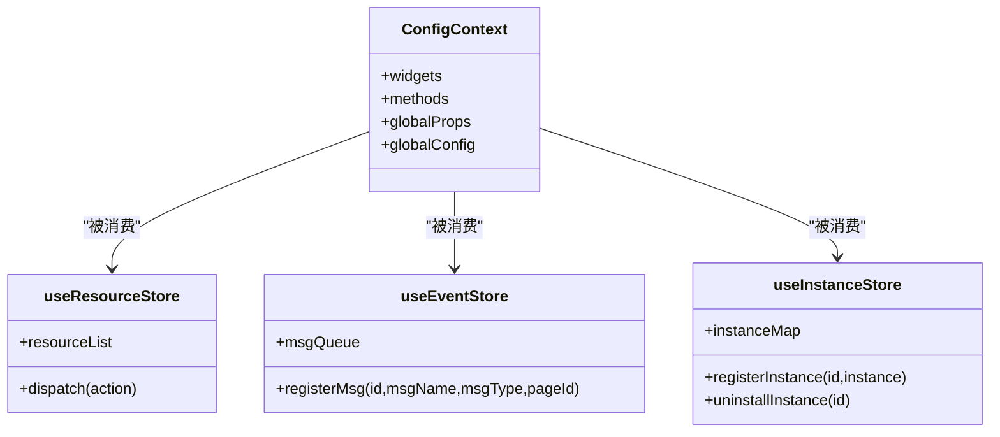
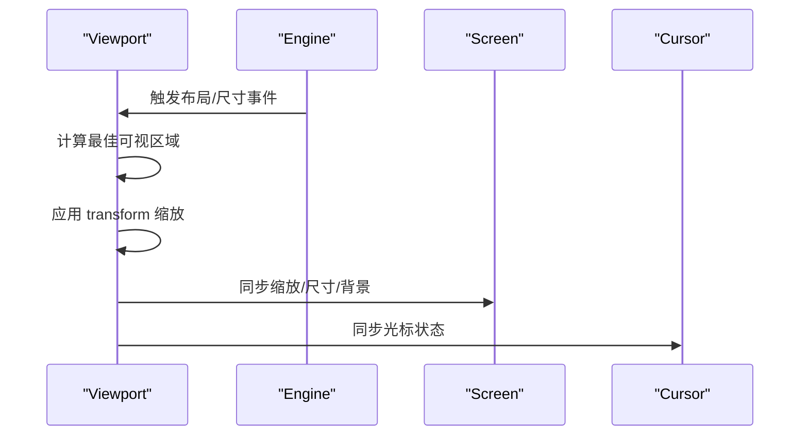
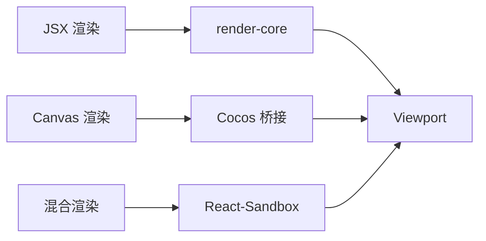
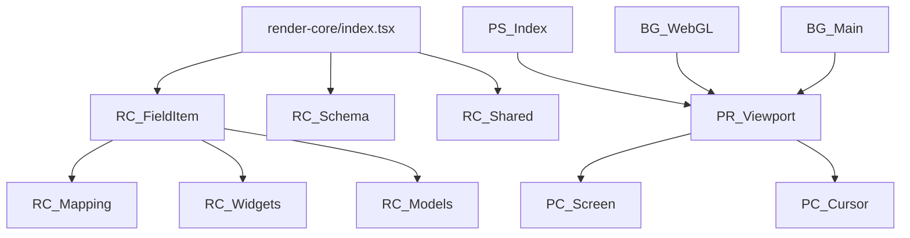
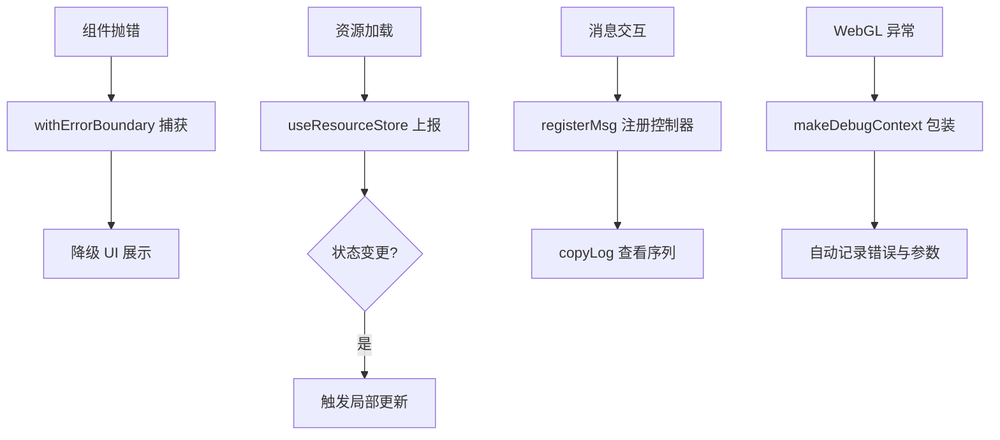

# 组件渲染机制

<cite>
**本文引用的文件**
- [render-core/index.tsx](file://common/render-core/index.tsx)
- [render-core/shared/mode.ts](file://common/render-core/shared/mode.ts)
- [render-core/shared/index.ts](file://common/render-core/shared/index.ts)
- [render-core/schema.ts](file://common/render-core/schema.ts)
- [render-core/models/context.ts](file://common/render-core/models/context.ts)
- [render-core/models/mapping.ts](file://common/render-core/models/mapping.ts)
- [render-core/widgets/index.tsx](file://common/render-core/widgets/index.tsx)
- [render-core/FieldItem/index.tsx](file://common/render-core/FieldItem/index.tsx)
- [render-core/FieldItem/field.tsx](file://common/render-core/FieldItem/field.tsx)
- [packages/react/containers/Viewport.tsx](file://packages/react/containers/Viewport.tsx)
- [packages/core/src/models/Screen.ts](file://packages/core/src/models/Screen.ts)
- [packages/core/src/models/Cursor.ts](file://packages/core/src/models/Cursor.ts)
- [packages/react-sandbox/src/index.ts](file://packages/react-sandbox/src/index.ts)
- [bridge/cocos-game-player/webgl-debug.js](file://bridge/cocos-game-player/webgl-debug.js)
- [bridge/cocos-game-player/assets/main/index.js](file://bridge/cocos-game-player/assets/main/index.js)
- [packages/shared/src/lru.ts](file://packages/shared/src/lru.ts)
</cite>

## 目录
1. [引言](#引言)
2. [项目结构](#项目结构)
3. [核心组件](#核心组件)
4. [架构总览](#架构总览)
5. [详细组件分析](#详细组件分析)
6. [依赖关系分析](#依赖关系分析)
7. [性能考量](#性能考量)
8. [故障排查指南](#故障排查指南)
9. [结论](#结论)
10. [附录](#附录)

## 引言
本技术文档围绕 Slides Engine 的组件渲染机制展开，系统性阐述从 Schema 到最终渲染的完整流程，解释渲染引擎如何构建组件树、管理渲染上下文、执行渲染管线；并对比 JSX 渲染、Canvas 渲染与混合渲染的实现差异与适用场景。同时提供渲染性能优化策略（渲染缓存、批量更新、虚拟化渲染）与调试方法（基于上下文与错误边界），帮助开发者高效定位与解决渲染问题。

## 项目结构
本仓库采用多包工作区组织，渲染相关能力主要分布在以下模块：
- common/render-core：通用渲染核心，负责 Schema 解析、组件映射、上下文与渲染管线入口
- packages/react：React 容器与视口封装，负责视口尺寸、缩放与布局
- packages/core：引擎模型（屏幕、光标等），为渲染提供运行时状态
- packages/react-sandbox：沙箱容器，用于隔离与注入渲染环境
- bridge/cocos-game-player：Cocos 游戏桥接与 WebGL 调试工具
- packages/shared：共享工具（如 LRU 缓存）

图表来源
- [render-core/index.tsx:1-75](file://common/render-core/index.tsx#L1-L75)
- [render-core/schema.ts:1-145](file://common/render-core/schema.ts#L1-L145)
- [render-core/shared/mode.ts:1-4](file://common/render-core/shared/mode.ts#L1-L4)
- [render-core/shared/index.ts:1-11](file://common/render-core/shared/index.ts#L1-L11)
- [render-core/models/context.ts:1-226](file://common/render-core/models/context.ts#L1-L226)
- [render-core/models/mapping.ts:1-92](file://common/render-core/models/mapping.ts#L1-L92)
- [render-core/widgets/index.tsx:1-130](file://common/render-core/widgets/index.tsx#L1-L130)
- [render-core/FieldItem/index.tsx:1-61](file://common/render-core/FieldItem/index.tsx#L1-L61)
- [packages/react/containers/Viewport.tsx:1-216](file://packages/react/containers/Viewport.tsx#L1-L216)
- [packages/core/src/models/Screen.ts:1-83](file://packages/core/src/models/Screen.ts#L1-L83)
- [packages/core/src/models/Cursor.ts:1-67](file://packages/core/src/models/Cursor.ts#L1-L67)
- [packages/react-sandbox/src/index.ts:1-52](file://packages/react-sandbox/src/index.ts#L1-L52)
- [bridge/cocos-game-player/webgl-debug.js:1-384](file://bridge/cocos-game-player/webgl-debug.js#L1-L384)
- [bridge/cocos-game-player/assets/main/index.js:1-259](file://bridge/cocos-game-player/assets/main/index.js#L1-L259)
- [packages/shared/src/lru.ts:147-179](file://packages/shared/src/lru.ts#L147-L179)

章节来源
- [render-core/index.tsx:1-75](file://common/render-core/index.tsx#L1-L75)
- [packages/react/containers/Viewport.tsx:1-216](file://packages/react/containers/Viewport.tsx#L1-L216)

## 核心组件
- 渲染根与管线入口
  - RenderRoot：通过 withProvider 包裹渲染根，注入内置小部件与全局配置，作为渲染管线的统一出口
  - RenderCore：递归遍历 Schema 的 properties，按序生成 FieldItem
  - RenderItem：根据 schema 类型选择渲染对象或字段，并传递 path、rootPath、activePageId、pageId 等上下文
- 字段项与组件映射
  - FieldItem：解析 schema，决定是否隐藏、错误回退、容器组件渲染、字段包装等；通过 mapping 将 schema 映射到具体小部件
  - FieldWrapper：对字段进行初始值设置与变更回调，确保首次渲染一致性
- 上下文与状态
  - ConfigContext：提供 widgets、methods、globalProps、globalConfig
  - useResourceStore/useEventStore/useInstanceStore：资源上报、消息序列、组件实例注册与联动
- 小部件集合
  - 内置小部件：Group、Video、RichText、Shape、Img 等，支持错误边界包裹，提升稳定性
- 视口与屏幕
  - Viewport：负责画布缩放、尺寸计算、居中策略与视口变化监听
  - Screen/Cursor：提供屏幕类型、缩放、尺寸、背景、翻转与光标状态等运行时信息

章节来源
- [render-core/index.tsx:1-75](file://common/render-core/index.tsx#L1-L75)
- [render-core/FieldItem/index.tsx:1-61](file://common/render-core/FieldItem/index.tsx#L1-L61)
- [render-core/FieldItem/field.tsx:1-19](file://common/render-core/FieldItem/field.tsx#L1-L19)
- [render-core/models/context.ts:1-226](file://common/render-core/models/context.ts#L1-L226)
- [render-core/models/mapping.ts:1-92](file://common/render-core/models/mapping.ts#L1-L92)
- [render-core/widgets/index.tsx:1-130](file://common/render-core/widgets/index.tsx#L1-L130)
- [packages/react/containers/Viewport.tsx:1-216](file://packages/react/containers/Viewport.tsx#L1-L216)
- [packages/core/src/models/Screen.ts:1-83](file://packages/core/src/models/Screen.ts#L1-L83)
- [packages/core/src/models/Cursor.ts:1-67](file://packages/core/src/models/Cursor.ts#L1-L67)

## 架构总览
渲染从 Schema 入手，经由渲染根与上下文注入，逐层构建组件树。视口负责画布布局与缩放，引擎模型提供运行时状态，沙箱与桥接提供隔离与调试能力。

图表来源
- [render-core/index.tsx:1-75](file://common/render-core/index.tsx#L1-L75)
- [render-core/FieldItem/index.tsx:1-61](file://common/render-core/FieldItem/index.tsx#L1-L61)
- [render-core/models/mapping.ts:1-92](file://common/render-core/models/mapping.ts#L1-L92)
- [render-core/widgets/index.tsx:1-130](file://common/render-core/widgets/index.tsx#L1-L130)
- [packages/react/containers/Viewport.tsx:1-216](file://packages/react/containers/Viewport.tsx#L1-L216)

## 详细组件分析

### 渲染管线与组件树构建
- Schema 到组件树
  - RenderRoot 通过 withProvider 注入上下文，RenderCore 递归遍历 schema.properties，每个字段交由 FieldItem 处理
  - FieldItem 根据 schema 的 hidden、type、ui:widget 等属性决定渲染行为：容器组件、字段包装、错误回退
  - mapping 依据 schema 的 type/format/readOnly 计算小部件名称，优先使用 schema 指定的 ui:widget
- 上下文与联动
  - ConfigContext 提供 widgets/methods/globalProps/globalConfig，FieldItem 在渲染时动态拼装字段属性
  - useResourceStore/useEventStore/useInstanceStore 提供资源上报、消息序列与实例注册，支撑跨组件通信与联动

图表来源
- [render-core/index.tsx:1-75](file://common/render-core/index.tsx#L1-L75)
- [render-core/FieldItem/index.tsx:1-61](file://common/render-core/FieldItem/index.tsx#L1-L61)
- [render-core/models/mapping.ts:1-92](file://common/render-core/models/mapping.ts#L1-L92)
- [render-core/models/context.ts:1-226](file://common/render-core/models/context.ts#L1-L226)

章节来源
- [render-core/index.tsx:1-75](file://common/render-core/index.tsx#L1-L75)
- [render-core/FieldItem/index.tsx:1-61](file://common/render-core/FieldItem/index.tsx#L1-L61)
- [render-core/models/mapping.ts:1-92](file://common/render-core/models/mapping.ts#L1-L92)
- [render-core/models/context.ts:1-226](file://common/render-core/models/context.ts#L1-L226)

### 渲染上下文与状态管理
- ConfigContext
  - 提供 widgets、methods、globalProps、globalConfig，RenderRoot 默认注入内置小部件与全局配置
- 资源上报与消息序列
  - useResourceStore：资源加载状态上报与去重
  - useEventStore：消息队列、控制器注册、发送端/接收端模式切换
  - useInstanceStore：组件实例注册与卸载，配合 useConnect 仅关注指定组件的变更
- 错误边界
  - 内置小部件通过 withErrorBoundary 包裹，捕获渲染异常并提供降级 UI

图表来源
- [render-core/models/context.ts:1-226](file://common/render-core/models/context.ts#L1-L226)
- [render-core/widgets/index.tsx:1-130](file://common/render-core/widgets/index.tsx#L1-L130)

章节来源
- [render-core/models/context.ts:1-226](file://common/render-core/models/context.ts#L1-L226)
- [render-core/widgets/index.tsx:1-130](file://common/render-core/widgets/index.tsx#L1-L130)

### 视口与屏幕模型
- Viewport
  - 负责画布缩放、最佳可视区域计算、视口变化监听与画布居中策略
  - 通过 requestIdle 控制加载态，设置 transform 缩放内容区域
- Screen/Cursor
  - 屏幕类型、缩放、尺寸、背景、翻转与状态管理
  - 光标状态与拖拽类型枚举，为编辑态交互提供基础

图表来源
- [packages/react/containers/Viewport.tsx:1-216](file://packages/react/containers/Viewport.tsx#L1-L216)
- [packages/core/src/models/Screen.ts:1-83](file://packages/core/src/models/Screen.ts#L1-L83)
- [packages/core/src/models/Cursor.ts:1-67](file://packages/core/src/models/Cursor.ts#L1-L67)

章节来源
- [packages/react/containers/Viewport.tsx:1-216](file://packages/react/containers/Viewport.tsx#L1-L216)
- [packages/core/src/models/Screen.ts:1-83](file://packages/core/src/models/Screen.ts#L1-L83)
- [packages/core/src/models/Cursor.ts:1-67](file://packages/core/src/models/Cursor.ts#L1-L67)

### 渲染模式与实现差异
- JSX 渲染
  - 通过 RenderRoot/RenderCore/FieldItem 构建 React 组件树，使用 ConfigContext 注入小部件与配置
- Canvas 渲染
  - 通过 Cocos 桥接与 WebGL 调试工具，结合视口与屏幕模型进行画布绘制与调试
- 混合渲染
  - 使用沙箱容器隔离渲染环境，注入引擎、布局、工作区等上下文，实现 React 与 Canvas 的协同

图表来源
- [render-core/index.tsx:1-75](file://common/render-core/index.tsx#L1-L75)
- [packages/react-sandbox/src/index.ts:1-52](file://packages/react-sandbox/src/index.ts#L1-L52)
- [bridge/cocos-game-player/webgl-debug.js:1-384](file://bridge/cocos-game-player/webgl-debug.js#L1-L384)
- [packages/react/containers/Viewport.tsx:1-216](file://packages/react/containers/Viewport.tsx#L1-L216)

章节来源
- [render-core/index.tsx:1-75](file://common/render-core/index.tsx#L1-L75)
- [packages/react-sandbox/src/index.ts:1-52](file://packages/react-sandbox/src/index.ts#L1-L52)
- [bridge/cocos-game-player/webgl-debug.js:1-384](file://bridge/cocos-game-player/webgl-debug.js#L1-L384)

## 依赖关系分析
- 渲染核心依赖
  - render-core/index.tsx 依赖 FieldItem、mapping、widgets、context、schema、shared
  - FieldItem 依赖 mapping、context、widgets、getFieldProps/getPath
  - models/context 提供全局状态与消息序列
- 视口与引擎
  - Viewport 依赖 Screen/Cursor 提供运行时状态
- 沙箱与桥接
  - React-Sandbox 注入引擎、布局、工作区上下文至 iframe 环境
  - WebGL 调试工具与 Cocos 主脚本用于 Canvas 调试与控制

图表来源
- [render-core/index.tsx:1-75](file://common/render-core/index.tsx#L1-L75)
- [render-core/FieldItem/index.tsx:1-61](file://common/render-core/FieldItem/index.tsx#L1-L61)
- [render-core/models/mapping.ts:1-92](file://common/render-core/models/mapping.ts#L1-L92)
- [render-core/widgets/index.tsx:1-130](file://common/render-core/widgets/index.tsx#L1-L130)
- [render-core/models/context.ts:1-226](file://common/render-core/models/context.ts#L1-L226)
- [packages/react/containers/Viewport.tsx:1-216](file://packages/react/containers/Viewport.tsx#L1-L216)
- [packages/core/src/models/Screen.ts:1-83](file://packages/core/src/models/Screen.ts#L1-L83)
- [packages/core/src/models/Cursor.ts:1-67](file://packages/core/src/models/Cursor.ts#L1-L67)
- [packages/react-sandbox/src/index.ts:1-52](file://packages/react-sandbox/src/index.ts#L1-L52)
- [bridge/cocos-game-player/webgl-debug.js:1-384](file://bridge/cocos-game-player/webgl-debug.js#L1-L384)
- [bridge/cocos-game-player/assets/main/index.js:1-259](file://bridge/cocos-game-player/assets/main/index.js#L1-L259)

章节来源
- [render-core/index.tsx:1-75](file://common/render-core/index.tsx#L1-L75)
- [render-core/FieldItem/index.tsx:1-61](file://common/render-core/FieldItem/index.tsx#L1-L61)
- [packages/react/containers/Viewport.tsx:1-216](file://packages/react/containers/Viewport.tsx#L1-L216)

## 性能考量
- 渲染缓存
  - 使用 LRU 缓存管理资源与中间结果，减少重复计算与请求
- 批量更新
  - 通过 useReducer 与受控组件实例注册，仅在必要时触发局部更新
- 虚拟化渲染
  - 对长列表或复杂组件采用虚拟滚动与懒加载策略，降低 DOM 与绘制压力
- 视口优化
  - 通过 transform 缩放与最佳可视区域计算，避免频繁重排与重绘

章节来源
- [packages/shared/src/lru.ts:147-179](file://packages/shared/src/lru.ts#L147-L179)
- [common/render-core/models/context.ts:1-226](file://common/render-core/models/context.ts#L1-L226)
- [packages/react/containers/Viewport.tsx:1-216](file://packages/react/containers/Viewport.tsx#L1-L216)

## 故障排查指南
- 渲染异常与回退
  - 使用 withErrorBoundary 包裹小部件，捕获并展示降级 UI，便于快速定位问题组件
- 资源上报与状态追踪
  - 通过 useResourceStore 上报资源加载状态，结合 ReportStatus 与 ResourceStatus 辨识加载阶段
- 消息序列与调试
  - 使用 useEventStore 的 registerMsg 注册消息控制器，copyLog 输出消息序列，辅助还原交互与状态
- WebGL 调试
  - 使用 WebGLDebugUtils 包装 WebGL 上下文，自动记录错误与调用栈，结合 Cocos 调试脚本进行运行时控制

图表来源
- [render-core/widgets/index.tsx:1-130](file://common/render-core/widgets/index.tsx#L1-L130)
- [common/render-core/models/context.ts:1-226](file://common/render-core/models/context.ts#L1-L226)
- [bridge/cocos-game-player/webgl-debug.js:1-384](file://bridge/cocos-game-player/webgl-debug.js#L1-L384)
- [bridge/cocos-game-player/assets/main/index.js:1-259](file://bridge/cocos-game-player/assets/main/index.js#L1-L259)

章节来源
- [render-core/widgets/index.tsx:1-130](file://common/render-core/widgets/index.tsx#L1-L130)
- [common/render-core/models/context.ts:1-226](file://common/render-core/models/context.ts#L1-L226)
- [bridge/cocos-game-player/webgl-debug.js:1-384](file://bridge/cocos-game-player/webgl-debug.js#L1-L384)
- [bridge/cocos-game-player/assets/main/index.js:1-259](file://bridge/cocos-game-player/assets/main/index.js#L1-L259)

## 结论
Slides Engine 的渲染机制以 Schema 为核心，借助渲染根、上下文与映射系统，构建可扩展的组件树；视口与屏幕模型保障布局与缩放体验；沙箱与桥接实现多渲染模式的协同。通过资源上报、消息序列与错误边界，系统具备良好的可观测性与稳定性。结合缓存、批量更新与虚拟化渲染等策略，可在复杂场景下获得更优性能表现。

## 附录
- Schema 示例与转换
  - 提供示例 schema 与 nodeSchema 到 schema 的转换函数，便于从节点树生成渲染 Schema
- 渲染模式常量
  - Mode 枚举区分 Sender/Receiver，用于消息序列的发送端与接收端模式

章节来源
- [render-core/schema.ts:1-145](file://common/render-core/schema.ts#L1-L145)
- [render-core/shared/mode.ts:1-4](file://common/render-core/shared/mode.ts#L1-L4)
- [render-core/shared/index.ts:1-11](file://common/render-core/shared/index.ts#L1-L11)