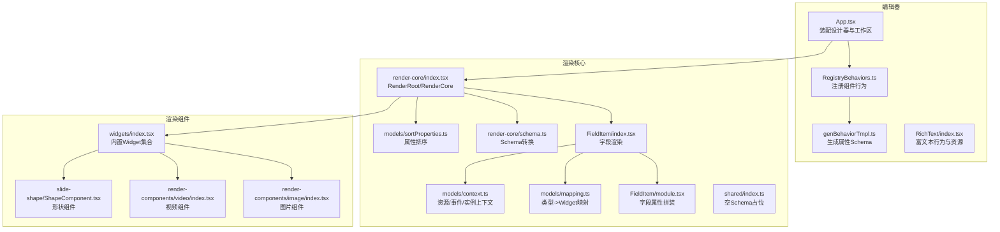
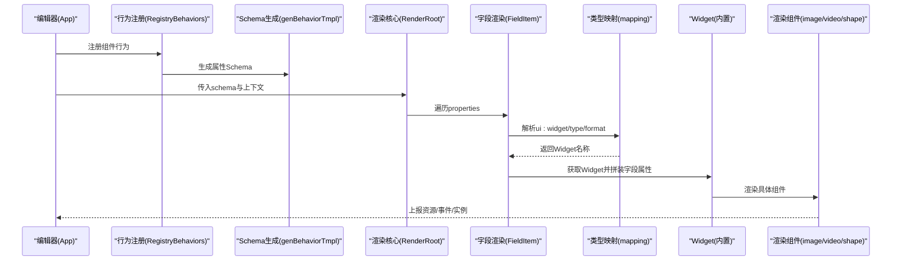
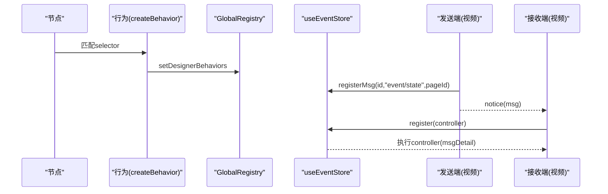
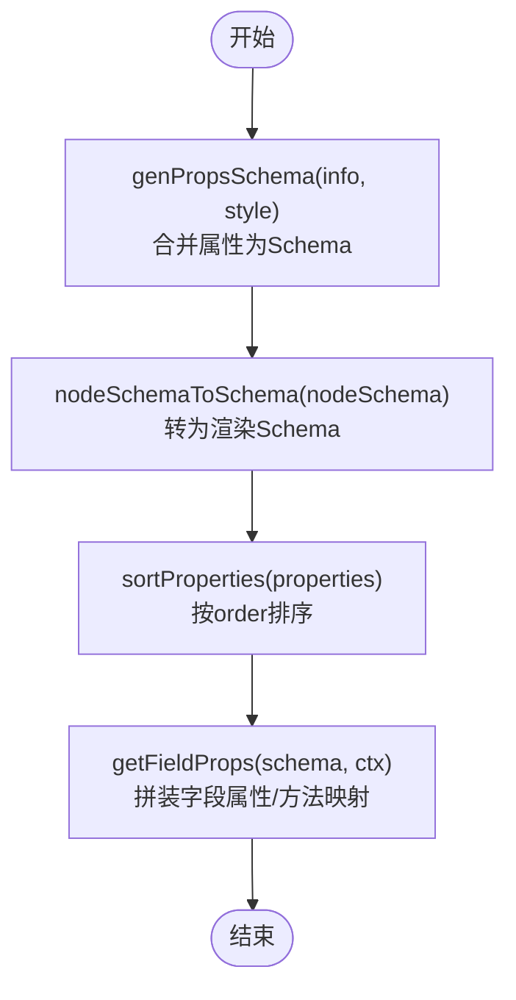
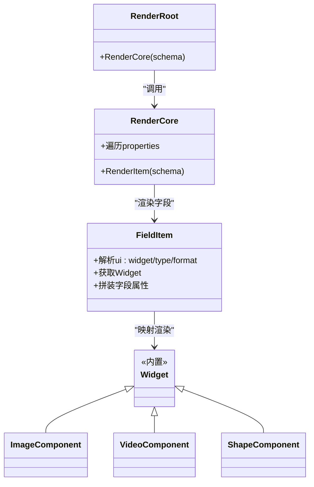
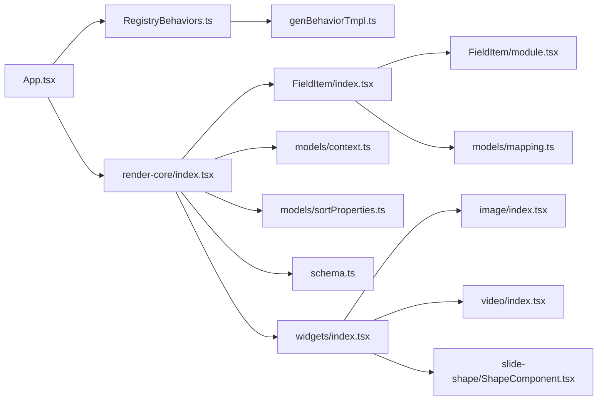

# 组件系统

<cite>
**本文引用的文件**
- [App.tsx](file://editor/src/App.tsx)
- [RegistryBehaviors.ts](file://editor/src/RegistryBehaviors.ts)
- [genBehaviorTmpl.ts](file://editor/src/components/_config/genBehaviorTmpl.ts)
- [widgets/index.tsx](file://common/render-core/widgets/index.tsx)
- [mapping.ts](file://common/render-core/models/mapping.ts)
- [context.ts](file://common/render-core/models/context.ts)
- [index.tsx](file://common/render-core/index.tsx)
- [schema.ts](file://common/render-core/schema.ts)
- [FieldItem/index.tsx](file://common/render-core/FieldItem/index.tsx)
- [FieldItem/module.tsx](file://common/render-core/FieldItem/module.tsx)
- [sortProperties.ts](file://common/render-core/models/sortProperties.ts)
- [image/index.tsx](file://common/render-components/src/image/index.tsx)
- [video/index.tsx](file://common/render-components/src/video/index.tsx)
- [ShapeComponent.tsx](file://common/slide-shape/src/component/ShapeComponent.tsx)
- [RichText/index.tsx](file://editor/src/components/RichText/index.tsx)
- [index.ts](file://common/render-components/src/index.ts)
- [index.ts](file://common/render-core/shared/index.ts)
</cite>

## 目录
1. [简介](#简介)
2. [项目结构](#项目结构)
3. [核心组件](#核心组件)
4. [架构总览](#架构总览)
5. [组件详解](#组件详解)
6. [依赖关系分析](#依赖关系分析)
7. [性能考量](#性能考量)
8. [故障排查指南](#故障排查指南)
9. [结论](#结论)
10. [附录](#附录)

## 简介
本文件系统性梳理 Slides Engine 的组件体系，覆盖组件分类与层次、行为系统（注册、生命周期、事件）、属性 Schema 生成与校验、渲染机制（JSX/Canvas/混合模式），并给出组件开发最佳实践与常见问题排查建议。目标是帮助编辑器与预览端开发者快速理解并扩展组件生态。

## 项目结构
Slides Engine 的组件系统由“编辑器侧行为注册”“渲染核心（Schema/Widget 映射/上下文）”“具体渲染组件（图片/视频/形状/富文本）”三层构成，配合全局行为注册中心与资源/事件/实例上下文，形成从“设计态配置”到“运行态渲染”的完整链路。

图表来源
- [App.tsx:135-226](file://editor/src/App.tsx#L135-L226)
- [RegistryBehaviors.ts:57-69](file://editor/src/RegistryBehaviors.ts#L57-L69)
- [genBehaviorTmpl.ts:16-45](file://editor/src/components/_config/genBehaviorTmpl.ts#L16-L45)
- [index.tsx:52-75](file://common/render-core/index.tsx#L52-L75)
- [schema.ts:134-145](file://common/render-core/schema.ts#L134-L145)
- [FieldItem/index.tsx:7-61](file://common/render-core/FieldItem/index.tsx#L7-L61)
- [FieldItem/module.tsx:52-109](file://common/render-core/FieldItem/module.tsx#L52-L109)
- [mapping.ts:42-91](file://common/render-core/models/mapping.ts#L42-L91)
- [context.ts:137-225](file://common/render-core/models/context.ts#L137-L225)
- [sortProperties.ts:1-29](file://common/render-core/models/sortProperties.ts#L1-L29)
- [widgets/index.tsx:8-19](file://common/render-core/widgets/index.tsx#L8-L19)
- [image/index.tsx:14-186](file://common/render-components/src/image/index.tsx#L14-L186)
- [video/index.tsx:16-472](file://common/render-components/src/video/index.tsx#L16-L472)
- [ShapeComponent.tsx:15-114](file://common/slide-shape/src/component/ShapeComponent.tsx#L15-L114)

章节来源
- [App.tsx:135-226](file://editor/src/App.tsx#L135-L226)
- [RegistryBehaviors.ts:57-69](file://editor/src/RegistryBehaviors.ts#L57-L69)

## 核心组件
- 基础组件（文本、图片、视频、音频、相机、形状）
  - 文本：富文本组件在编辑器侧以行为方式注册，运行态由通用富文本组件渲染。
  - 图片：运行态组件负责资源上报、加载/错误状态、点击跳页等。
  - 视频：运行态组件负责多源选择、封面图、自动播放策略、事件/状态信令同步。
  - 形状：基于 SVG 路径公式绘制，支持编辑态与预览态不同渲染。
- 复合组件（游戏、相机）
  - 游戏与相机在渲染核心中以占位 Widget 存在，实际运行态由桥接层或外部容器承载。
- 特殊组件（形状、富文本）
  - 形状：通过路径公式动态计算 SVG 路径，适配尺寸变化。
  - 富文本：编辑器侧行为定义属性 Schema 与默认值，运行态组件负责交互与渲染。

章节来源
- [widgets/index.tsx:8-19](file://common/render-core/widgets/index.tsx#L8-L19)
- [image/index.tsx:14-186](file://common/render-components/src/image/index.tsx#L14-L186)
- [video/index.tsx:16-472](file://common/render-components/src/video/index.tsx#L16-L472)
- [ShapeComponent.tsx:15-114](file://common/slide-shape/src/component/ShapeComponent.tsx#L15-L114)
- [RichText/index.tsx:41-90](file://editor/src/components/RichText/index.tsx#L41-L90)

## 架构总览
渲染流程自上而下分为三层：
- 设计器装配与行为注册：App 装配设计器，RegistryBehaviors 注册各组件行为，genBehaviorTmpl 生成属性 Schema。
- 渲染核心：RenderRoot/RenderCore 遍历 Schema，FieldItem 根据类型映射到 Widget，FieldItem/module 计算字段属性与方法映射。
- 渲染组件：image/video/shape/rich-text 等组件实现具体渲染与交互，使用 context 提供的资源上报、事件/实例连接能力。

图表来源
- [App.tsx:135-226](file://editor/src/App.tsx#L135-L226)
- [RegistryBehaviors.ts:57-69](file://editor/src/RegistryBehaviors.ts#L57-L69)
- [genBehaviorTmpl.ts:16-45](file://editor/src/components/_config/genBehaviorTmpl.ts#L16-L45)
- [index.tsx:52-75](file://common/render-core/index.tsx#L52-L75)
- [FieldItem/index.tsx:7-61](file://common/render-core/FieldItem/index.tsx#L7-L61)
- [mapping.ts:42-91](file://common/render-core/models/mapping.ts#L42-L91)
- [widgets/index.tsx:8-19](file://common/render-core/widgets/index.tsx#L8-L19)

## 组件详解

### 行为系统：注册、生命周期、事件
- 行为注册
  - 通过 createBehavior 定义组件行为，包含 selector、designerProps（propsSchema、默认值、组件属性工厂）、designerLocales。
  - GlobalRegistry.setDesignerBehaviors 批量注册行为。
- 生命周期
  - 编辑态：组件挂载时通过 useConnect 注册实例，用于跨组件联动与状态同步。
  - 预览态：组件在资源加载/错误时通过 useReport 上报状态，便于统计与可视化。
- 事件处理
  - 使用 useEventStore/registerMsg 实现“发送端/接收端”消息注册，支持事件与状态两类消息，用于视频播放状态/事件的同步。

图表来源
- [RegistryBehaviors.ts:57-69](file://editor/src/RegistryBehaviors.ts#L57-L69)
- [context.ts:158-225](file://common/render-core/models/context.ts#L158-L225)
- [video/index.tsx:340-375](file://common/render-components/src/video/index.tsx#L340-L375)

章节来源
- [RegistryBehaviors.ts:57-69](file://editor/src/RegistryBehaviors.ts#L57-L69)
- [context.ts:158-225](file://common/render-core/models/context.ts#L158-L225)
- [video/index.tsx:340-375](file://common/render-components/src/video/index.tsx#L340-L375)

### 属性定义与验证：Schema 生成与校验
- Schema 生成
  - genPropsSchema 将 info/style 两部分属性合并为一个对象，外层包裹 void 容器，支持折叠面板展示。
  - setDefaultName 为同类型组件自动命名。
- Schema 转换
  - nodeSchemaToSchema 将节点树转换为渲染核心可用的 schema 结构，递归处理子节点。
- 字段属性拼装
  - getFieldProps 负责拼装字段属性、方法映射、全局属性、addon 辅助信息等。
- 属性排序
  - sortProperties 按 order 字段排序，未指定顺序的属性排在末尾。

图表来源
- [genBehaviorTmpl.ts:16-45](file://editor/src/components/_config/genBehaviorTmpl.ts#L16-L45)
- [schema.ts:134-145](file://common/render-core/schema.ts#L134-L145)
- [sortProperties.ts:1-29](file://common/render-core/models/sortProperties.ts#L1-L29)
- [FieldItem/module.tsx:52-109](file://common/render-core/FieldItem/module.tsx#L52-L109)

章节来源
- [genBehaviorTmpl.ts:16-45](file://editor/src/components/_config/genBehaviorTmpl.ts#L16-L45)
- [schema.ts:134-145](file://common/render-core/schema.ts#L134-L145)
- [FieldItem/module.tsx:52-109](file://common/render-core/FieldItem/module.tsx#L52-L109)
- [sortProperties.ts:1-29](file://common/render-core/models/sortProperties.ts#L1-L29)

### 渲染机制：JSX 渲染、Canvas 渲染、混合渲染
- JSX 渲染
  - RenderRoot/RenderCore 遍历 schema.properties，FieldItem 根据 ui:widget 或 type/format 决定 Widget。
  - mapping 将类型映射到内置 Widget 名称，widgets/index.tsx 提供内置组件集合。
- Canvas 渲染
  - 形状组件通过 SVG 路径公式在 Canvas-like 的容器内绘制，编辑态与预览态分别渲染。
- 混合渲染
  - 图片/视频组件在 Canvas 容器内叠加子元素（如富文本），实现“容器+子组件”的混合布局。

图表来源
- [index.tsx:52-75](file://common/render-core/index.tsx#L52-L75)
- [FieldItem/index.tsx:7-61](file://common/render-core/FieldItem/index.tsx#L7-L61)
- [mapping.ts:42-91](file://common/render-core/models/mapping.ts#L42-L91)
- [widgets/index.tsx:8-19](file://common/render-core/widgets/index.tsx#L8-L19)
- [image/index.tsx:14-186](file://common/render-components/src/image/index.tsx#L14-L186)
- [video/index.tsx:16-472](file://common/render-components/src/video/index.tsx#L16-L472)
- [ShapeComponent.tsx:15-114](file://common/slide-shape/src/component/ShapeComponent.tsx#L15-L114)

章节来源
- [index.tsx:52-75](file://common/render-core/index.tsx#L52-L75)
- [FieldItem/index.tsx:7-61](file://common/render-core/FieldItem/index.tsx#L7-L61)
- [mapping.ts:42-91](file://common/render-core/models/mapping.ts#L42-L91)
- [widgets/index.tsx:8-19](file://common/render-core/widgets/index.tsx#L8-L19)
- [ShapeComponent.tsx:15-114](file://common/slide-shape/src/component/ShapeComponent.tsx#L15-L114)

### 组件开发最佳实践
- 创建新组件类型
  - 在 widgets/index.tsx 中注册新 Widget 名称与组件映射。
  - 在 mapping.ts 中为新类型添加 format/type 映射规则。
  - 在 RegistryBehaviors.ts 中注册行为，使用 genPropsSchema 生成属性 Schema。
- 实现组件行为
  - 使用 createBehavior 定义 selector、propsSchema、默认值与组件属性工厂。
  - 如需资源上报/事件同步，使用 useReport/useEventStore/useConnect。
- 处理组件间数据传递
  - 使用 useConnect 获取受控组件实例映射，实现跨组件联动。
  - 使用 useEventStore 的 registerMsg 实现事件/状态消息的发送与接收。

章节来源
- [widgets/index.tsx:8-19](file://common/render-core/widgets/index.tsx#L8-L19)
- [mapping.ts:42-91](file://common/render-core/models/mapping.ts#L42-L91)
- [RegistryBehaviors.ts:57-69](file://editor/src/RegistryBehaviors.ts#L57-L69)
- [context.ts:137-225](file://common/render-core/models/context.ts#L137-L225)

## 依赖关系分析
- 编辑器侧
  - App 装配设计器与工作区，RegistryBehaviors 注册组件行为，genBehaviorTmpl 生成属性 Schema。
- 渲染核心
  - RenderRoot/RenderCore 依赖 FieldItem/FieldItem/module、mapping、context、sortProperties。
  - schema.ts 提供 nodeSchema 到渲染 schema 的转换。
- 渲染组件
  - image/video/shape 分别依赖各自工具与常量，使用 context 能力实现资源上报与事件/实例连接。

图表来源
- [App.tsx:135-226](file://editor/src/App.tsx#L135-L226)
- [RegistryBehaviors.ts:57-69](file://editor/src/RegistryBehaviors.ts#L57-L69)
- [genBehaviorTmpl.ts:16-45](file://editor/src/components/_config/genBehaviorTmpl.ts#L16-L45)
- [index.tsx:52-75](file://common/render-core/index.tsx#L52-L75)
- [FieldItem/index.tsx:7-61](file://common/render-core/FieldItem/index.tsx#L7-L61)
- [FieldItem/module.tsx:52-109](file://common/render-core/FieldItem/module.tsx#L52-L109)
- [mapping.ts:42-91](file://common/render-core/models/mapping.ts#L42-L91)
- [context.ts:137-225](file://common/render-core/models/context.ts#L137-L225)
- [sortProperties.ts:1-29](file://common/render-core/models/sortProperties.ts#L1-L29)
- [schema.ts:134-145](file://common/render-core/schema.ts#L134-L145)
- [widgets/index.tsx:8-19](file://common/render-core/widgets/index.tsx#L8-L19)
- [image/index.tsx:14-186](file://common/render-components/src/image/index.tsx#L14-L186)
- [video/index.tsx:16-472](file://common/render-components/src/video/index.tsx#L16-L472)
- [ShapeComponent.tsx:15-114](file://common/slide-shape/src/component/ShapeComponent.tsx#L15-L114)

章节来源
- [index.ts:1-3](file://common/render-components/src/index.ts#L1-L3)
- [index.ts:5-11](file://common/render-core/shared/index.ts#L5-L11)

## 性能考量
- 渲染核心采用细粒度上下文与受控组件实例映射，减少无效渲染。
- 视频组件对时间更新事件进行节流同步，降低信令频率。
- 图片/视频组件在加载/错误时仅更新资源上报状态，避免全树重渲染。

## 故障排查指南
- 组件未显示
  - 检查 ui:widget 是否正确映射到已注册的 Widget。
  - 确认 schema.properties 是否存在且未 hidden。
- 属性不生效
  - 检查 propsSchema 生成逻辑与字段拼装（getFieldProps）。
  - 确认全局属性/方法映射是否正确注入。
- 资源加载异常
  - 查看 useReport 上报状态与 ResourceStatus 枚举。
  - 确认资源 URL 生成逻辑与远程资源存在性检测。
- 事件/状态不同步
  - 检查 useEventStore 的 registerMsg 注册与 notice 调用时机。
  - 确认消息类型（event/state）与 pageId/id 匹配。

章节来源
- [FieldItem/index.tsx:12-20](file://common/render-core/FieldItem/index.tsx#L12-L20)
- [FieldItem/module.tsx:52-109](file://common/render-core/FieldItem/module.tsx#L52-L109)
- [context.ts:22-33](file://common/render-core/models/context.ts#L22-L33)
- [image/index.tsx:86-151](file://common/render-components/src/image/index.tsx#L86-L151)
- [video/index.tsx:340-375](file://common/render-components/src/video/index.tsx#L340-L375)

## 结论
Slides Engine 的组件系统以“行为驱动 + Schema 驱动 + Widget 渲染”为核心，结合资源/事件/实例上下文，实现了从编辑器到预览端的一致体验。通过标准化的 Schema 生成、类型映射与上下文能力，开发者可以高效扩展新组件类型并实现复杂交互。

## 附录
- 关键接口与上下文
  - useReport：资源上报与状态管理。
  - useEventStore：消息队列与控制器注册。
  - useConnect：受控组件实例映射与联动。
- 常用工具
  - sortProperties：属性排序。
  - nodeSchemaToSchema：节点树到渲染 Schema 的转换。
  - getWidget/getWidgetName：类型到 Widget 的映射。