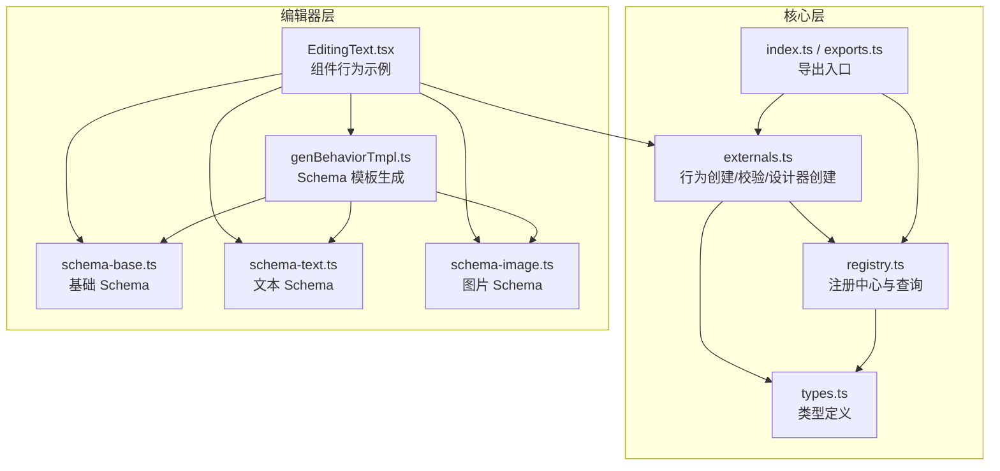
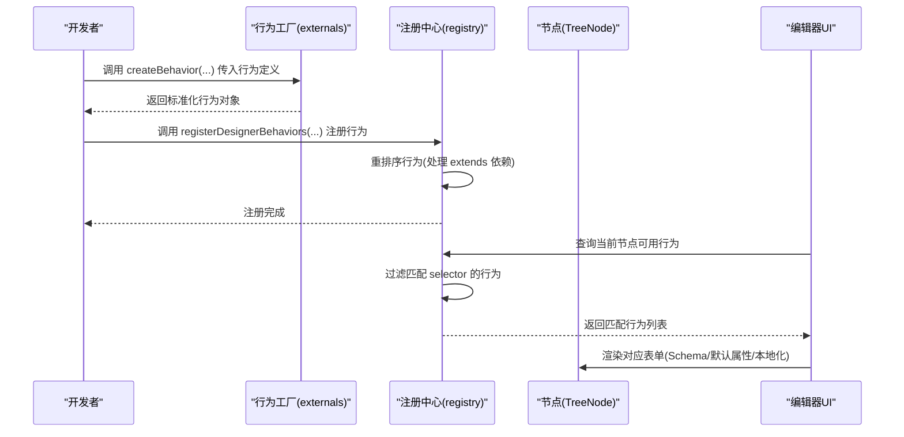
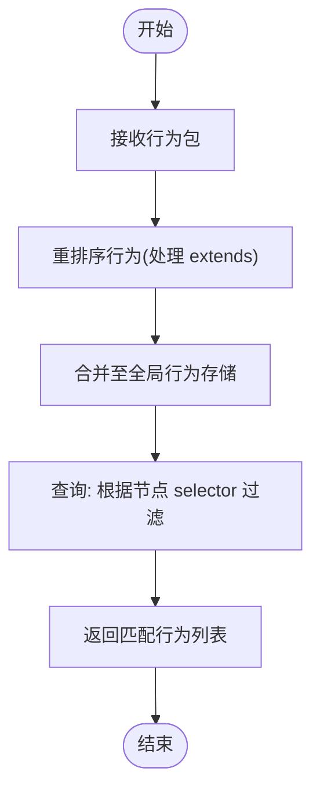
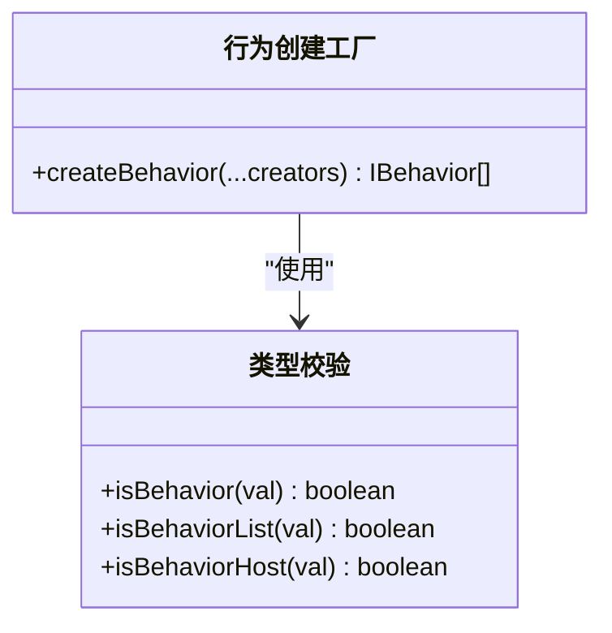
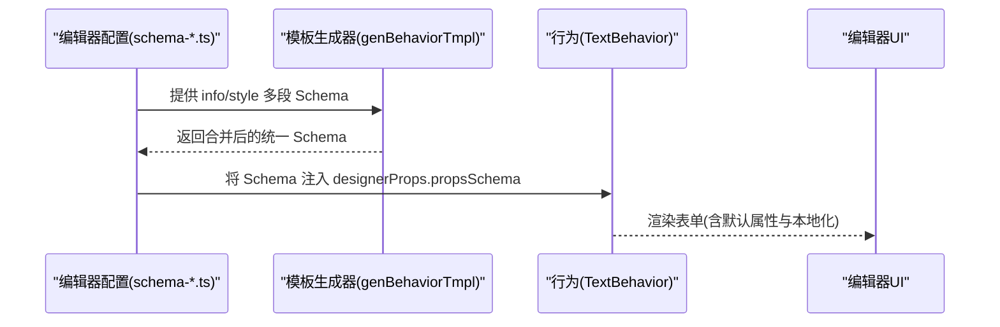
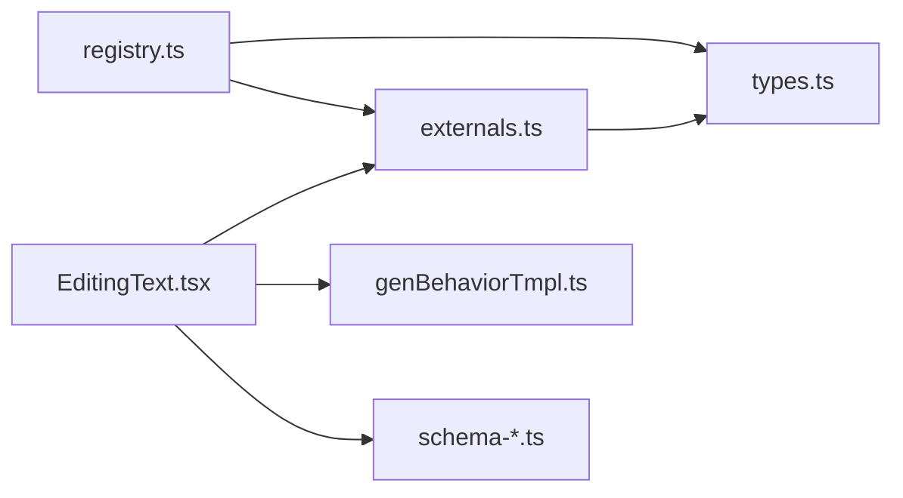

# 组件行为系统

<cite>
**本文引用的文件**
- [packages/core/src/registry.ts](file://packages/core/src/registry.ts)
- [packages/core/src/externals.ts](file://packages/core/src/externals.ts)
- [packages/core/src/types.ts](file://packages/core/src/types.ts)
- [packages/core/src/index.ts](file://packages/core/src/index.ts)
- [packages/core/src/exports.ts](file://packages/core/src/exports.ts)
- [editor/src/components/Text/EditingText.tsx](file://editor/src/components/Text/EditingText.tsx)
- [editor/src/components/_config/genBehaviorTmpl.ts](file://editor/src/components/_config/genBehaviorTmpl.ts)
- [editor/src/components/_config/schema-base.ts](file://editor/src/components/_config/schema-base.ts)
- [editor/src/components/_config/schema-text.ts](file://editor/src/components/_config/schema-text.ts)
- [editor/src/components/_config/schema-image.ts](file://editor/src/components/_config/schema-image.ts)
</cite>

## 目录
1. [简介](#简介)
2. [项目结构](#项目结构)
3. [核心组件](#核心组件)
4. [架构总览](#架构总览)
5. [详细组件分析](#详细组件分析)
6. [依赖分析](#依赖分析)
7. [性能考虑](#性能考虑)
8. [故障排查指南](#故障排查指南)
9. [结论](#结论)
10. [附录](#附录)

## 简介
本文件系统性梳理 Slides Engine 的“组件行为系统”，围绕行为的注册流程、生命周期管理、事件处理机制展开；解释行为模板（Schema）的生成与配置方法；阐明行为与组件的关系及如何为不同组件类型绑定行为；并提供行为开发最佳实践、扩展指南与调试技巧。目标是帮助开发者快速理解并高效扩展行为系统。

## 项目结构
行为系统主要由以下部分组成：
- 核心注册与查询：在核心包中提供全局注册中心，负责行为的注册、排序、查询与本地化等。
- 行为创建与校验：提供行为创建工厂与类型校验工具，确保行为对象符合规范。
- 行为模板生成：在编辑器侧提供行为 Schema 的拼装工具，支持将多段 Schema 合并为统一的表单 Schema。
- 组件行为示例：以具体组件（如文本）为例，展示如何声明行为、绑定 Schema、注入本地化与默认属性。

图表来源
- [packages/core/src/registry.ts:1-191](file://packages/core/src/registry.ts#L1-L191)
- [packages/core/src/externals.ts:1-143](file://packages/core/src/externals.ts#L1-L143)
- [packages/core/src/types.ts:1-189](file://packages/core/src/types.ts#L1-L189)
- [packages/core/src/index.ts:1-16](file://packages/core/src/index.ts#L1-L16)
- [packages/core/src/exports.ts:1-5](file://packages/core/src/exports.ts#L1-L5)
- [editor/src/components/Text/EditingText.tsx:1-58](file://editor/src/components/Text/EditingText.tsx#L1-L58)
- [editor/src/components/_config/genBehaviorTmpl.ts:1-54](file://editor/src/components/_config/genBehaviorTmpl.ts#L1-L54)
- [editor/src/components/_config/schema-base.ts:1-65](file://editor/src/components/_config/schema-base.ts#L1-L65)
- [editor/src/components/_config/schema-text.ts:1-42](file://editor/src/components/_config/schema-text.ts#L1-L42)
- [editor/src/components/_config/schema-image.ts:1-47](file://editor/src/components/_config/schema-image.ts#L1-L47)

章节来源
- [packages/core/src/registry.ts:1-191](file://packages/core/src/registry.ts#L1-L191)
- [packages/core/src/externals.ts:1-143](file://packages/core/src/externals.ts#L1-L143)
- [packages/core/src/types.ts:1-189](file://packages/core/src/types.ts#L1-L189)
- [packages/core/src/index.ts:1-16](file://packages/core/src/index.ts#L1-L16)
- [packages/core/src/exports.ts:1-5](file://packages/core/src/exports.ts#L1-L5)

## 核心组件
- 全局注册中心：提供行为注册、语言设置、图标注册、本地化合并、行为查询等功能。
- 行为创建工厂：将行为创建参数标准化为行为对象，并支持字符串选择器自动转换。
- 类型系统：定义行为、资源、设计器属性、存储结构等核心类型，保证行为系统强类型约束。
- 导出入口：统一导出注册中心、外部工具与模型，便于上层使用。

章节来源
- [packages/core/src/registry.ts:75-185](file://packages/core/src/registry.ts#L75-L185)
- [packages/core/src/externals.ts:89-101](file://packages/core/src/externals.ts#L89-L101)
- [packages/core/src/types.ts:144-164](file://packages/core/src/types.ts#L144-L164)
- [packages/core/src/index.ts:1-16](file://packages/core/src/index.ts#L1-L16)
- [packages/core/src/exports.ts:1-5](file://packages/core/src/exports.ts#L1-L5)

## 架构总览
行为系统采用“注册中心 + 行为工厂 + 类型约束”的分层架构：
- 注册中心负责行为的全局管理与查询；
- 行为工厂负责行为对象的创建与校验；
- 类型系统确保行为字段（名称、选择器、继承、设计器属性、本地化）的完整性；
- 编辑器侧通过模板生成器将多段 Schema 合并为统一表单 Schema，并注入默认属性与本地化。

图表来源
- [packages/core/src/externals.ts:89-101](file://packages/core/src/externals.ts#L89-L101)
- [packages/core/src/registry.ts:177-185](file://packages/core/src/registry.ts#L177-L185)
- [packages/core/src/registry.ts:109-113](file://packages/core/src/registry.ts#L109-L113)

## 详细组件分析

### 行为注册与查询
- 注册流程：通过注册中心的注册方法接收行为包，内部调用重排序函数处理行为继承依赖，最终写入全局行为存储。
- 查询流程：根据当前节点调用 selector 进行过滤，返回匹配的行为集合，供编辑器 UI 使用。
- 语言与本地化：注册中心维护语言与本地化存储，提供按令牌获取消息的能力，支持多语言合并与回退。

图表来源
- [packages/core/src/registry.ts:34-62](file://packages/core/src/registry.ts#L34-L62)
- [packages/core/src/registry.ts:177-185](file://packages/core/src/registry.ts#L177-L185)
- [packages/core/src/registry.ts:109-113](file://packages/core/src/registry.ts#L109-L113)

章节来源
- [packages/core/src/registry.ts:34-62](file://packages/core/src/registry.ts#L34-L62)
- [packages/core/src/registry.ts:109-113](file://packages/core/src/registry.ts#L109-L113)
- [packages/core/src/registry.ts:177-185](file://packages/core/src/registry.ts#L177-L185)

### 行为创建与类型校验
- 行为创建：行为工厂支持传入行为创建器或其数组，自动将字符串选择器转换为函数选择器，输出标准化行为数组。
- 类型校验：提供 isBehavior/isBehaviorList/isBehaviorHost 等工具，确保行为对象满足最小契约（至少包含 name、selector、extends、designerProps、designerLocales 等字段之一）。

图表来源
- [packages/core/src/externals.ts:89-101](file://packages/core/src/externals.ts#L89-L101)
- [packages/core/src/externals.ts:41-46](file://packages/core/src/externals.ts#L41-L46)
- [packages/core/src/externals.ts:32-33](file://packages/core/src/externals.ts#L32-L33)
- [packages/core/src/externals.ts:23-24](file://packages/core/src/externals.ts#L23-L24)

章节来源
- [packages/core/src/externals.ts:89-101](file://packages/core/src/externals.ts#L89-L101)
- [packages/core/src/externals.ts:41-46](file://packages/core/src/externals.ts#L41-L46)
- [packages/core/src/externals.ts:32-33](file://packages/core/src/externals.ts#L32-L33)
- [packages/core/src/externals.ts:23-24](file://packages/core/src/externals.ts#L23-L24)

### 行为模板生成与 Schema 配置
- 模板生成：模板生成器将多段 Schema 合并为统一的表单 Schema，分为“属性”和“样式”两大面板，支持 CollapseItem 布局。
- 默认名称：根据组件类型与已存在节点数量，为新节点生成默认名称。
- 组件行为示例：文本组件通过行为对象声明 selector、propsSchema、defaultProps、designerLocales 等，实现表单渲染与本地化。

图表来源
- [editor/src/components/_config/genBehaviorTmpl.ts:16-45](file://editor/src/components/_config/genBehaviorTmpl.ts#L16-L45)
- [editor/src/components/_config/schema-base.ts:7-48](file://editor/src/components/_config/schema-base.ts#L7-L48)
- [editor/src/components/_config/schema-text.ts:7-42](file://editor/src/components/_config/schema-text.ts#L7-L42)
- [editor/src/components/Text/EditingText.tsx:25-58](file://editor/src/components/Text/EditingText.tsx#L25-L58)

章节来源
- [editor/src/components/_config/genBehaviorTmpl.ts:16-45](file://editor/src/components/_config/genBehaviorTmpl.ts#L16-L45)
- [editor/src/components/_config/schema-base.ts:7-48](file://editor/src/components/_config/schema-base.ts#L7-L48)
- [editor/src/components/_config/schema-text.ts:7-42](file://editor/src/components/_config/schema-text.ts#L7-L42)
- [editor/src/components/Text/EditingText.tsx:25-58](file://editor/src/components/Text/EditingText.tsx#L25-L58)

### 行为与组件的关系
- 选择器绑定：行为通过 selector 将自身与特定组件类型关联；字符串形式的选择器会被自动转换为基于组件名的匹配逻辑。
- 设计器属性：行为可提供 propsSchema、defaultProps、getComponentProps 等，驱动编辑器表单渲染与属性注入。
- 本地化与图标：行为可提供 designerLocales 与图标映射，注册中心统一管理语言与本地化消息。

章节来源
- [packages/core/src/externals.ts:96-98](file://packages/core/src/externals.ts#L96-L98)
- [packages/core/src/types.ts:144-149](file://packages/core/src/types.ts#L144-L149)
- [packages/core/src/registry.ts:158-170](file://packages/core/src/registry.ts#L158-L170)

### 生命周期与事件处理机制
- 生命周期：行为系统未暴露显式生命周期钩子；行为对象通过 selector 在节点选中时参与表单渲染与属性计算。
- 事件处理：类型系统提供事件相关接口，但行为系统本身不直接承担事件处理职责；事件处理通常由引擎或驱动层完成。

章节来源
- [packages/core/src/types.ts:14-31](file://packages/core/src/types.ts#L14-L31)
- [packages/core/src/types.ts:144-149](file://packages/core/src/types.ts#L144-L149)

## 依赖分析
- 行为工厂依赖类型系统与工具库，确保行为对象标准化与可校验。
- 注册中心依赖行为工厂与类型系统，负责行为的全局管理与查询。
- 编辑器侧行为示例依赖模板生成器与各组件 Schema，形成“配置 -> 行为 -> UI”的闭环。

图表来源
- [packages/core/src/externals.ts:1-143](file://packages/core/src/externals.ts#L1-L143)
- [packages/core/src/types.ts:1-189](file://packages/core/src/types.ts#L1-L189)
- [packages/core/src/registry.ts:1-191](file://packages/core/src/registry.ts#L1-L191)
- [editor/src/components/Text/EditingText.tsx:1-58](file://editor/src/components/Text/EditingText.tsx#L1-L58)
- [editor/src/components/_config/genBehaviorTmpl.ts:1-54](file://editor/src/components/_config/genBehaviorTmpl.ts#L1-L54)
- [editor/src/components/_config/schema-base.ts:1-65](file://editor/src/components/_config/schema-base.ts#L1-L65)
- [editor/src/components/_config/schema-text.ts:1-42](file://editor/src/components/_config/schema-text.ts#L1-L42)
- [editor/src/components/_config/schema-image.ts:1-47](file://editor/src/components/_config/schema-image.ts#L1-L47)

章节来源
- [packages/core/src/externals.ts:1-143](file://packages/core/src/externals.ts#L1-L143)
- [packages/core/src/types.ts:1-189](file://packages/core/src/types.ts#L1-L189)
- [packages/core/src/registry.ts:1-191](file://packages/core/src/registry.ts#L1-L191)

## 性能考虑
- 行为重排序：在注册阶段对行为进行依赖排序，避免运行时重复计算，提升查询效率。
- 选择器过滤：查询时仅对已注册行为执行 selector 过滤，建议保持 selector 的轻量与稳定。
- Schema 合并：模板生成器在编辑器侧进行 Schema 合并，减少运行时开销。
- 本地化缓存：注册中心维护语言与本地化存储，建议集中管理本地化资源，避免重复注册。

## 故障排查指南
- 依赖缺失错误：当行为声明了 extends 依赖但未找到对应行为时，注册阶段会抛出错误。请检查依赖名称与注册顺序。
- 选择器无效：若 selector 未正确匹配节点，请确认字符串选择器是否被正确转换为函数，或自定义函数逻辑是否覆盖目标组件类型。
- Schema 结构异常：若表单渲染异常，请核对合并后的 Schema 结构与组件 Schema 字段命名是否一致。
- 本地化未生效：请确认本地化包已注册且语言设置正确，令牌大小写与下划线风格需与注册时一致。

章节来源
- [packages/core/src/registry.ts:51-58](file://packages/core/src/registry.ts#L51-L58)
- [packages/core/src/externals.ts:96-98](file://packages/core/src/externals.ts#L96-L98)
- [packages/core/src/registry.ts:138-152](file://packages/core/src/registry.ts#L138-L152)

## 结论
Slides Engine 的行为系统通过“注册中心 + 行为工厂 + 类型约束 + 模板生成器”的组合，实现了行为的标准化、可扩展与易维护。开发者可通过行为对象声明组件绑定、表单 Schema、默认属性与本地化，从而快速构建丰富的编辑体验。遵循本文的最佳实践与扩展指南，可在保证性能与稳定性的同时，高效扩展行为系统。

## 附录
- 行为开发最佳实践
  - 明确选择器：优先使用字符串选择器并确保与组件名一致；必要时提供自定义函数选择器。
  - 合理拆分 Schema：将通用属性与样式拆分为独立段落，便于复用与扩展。
  - 依赖声明：在 extends 中明确列出依赖行为，注册时将自动重排序。
  - 默认属性与本地化：为常用组件提供合理的默认属性与本地化文案，提升编辑效率。
- 扩展指南
  - 新增组件行为：参考现有组件行为示例，声明 selector、propsSchema、defaultProps、designerLocales。
  - 复用与继承：通过 extends 组合已有行为，避免重复定义。
  - 图标与语言：在注册中心注册图标与本地化包，确保 UI 正常显示。
- 调试技巧
  - 使用注册中心查询当前节点匹配的行为列表，定位行为是否被正确识别。
  - 核对 Schema 合并结果，确保字段命名与组件期望一致。
  - 检查本地化令牌大小写与下划线风格，避免查找失败。