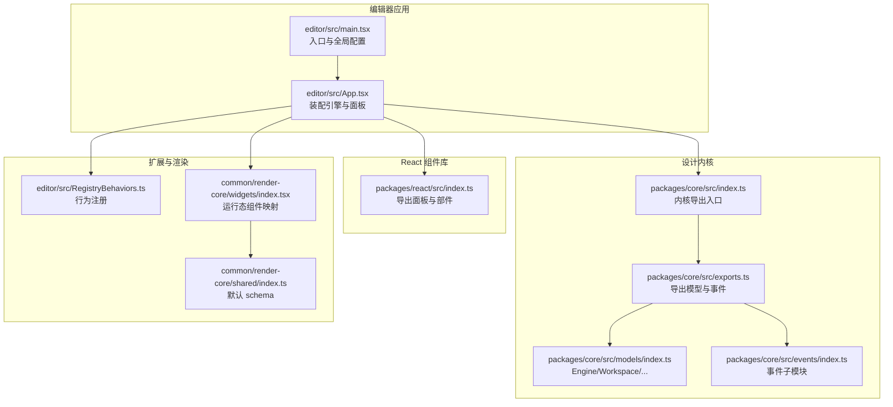
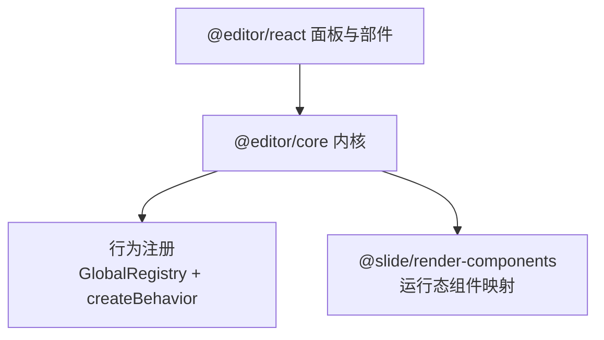
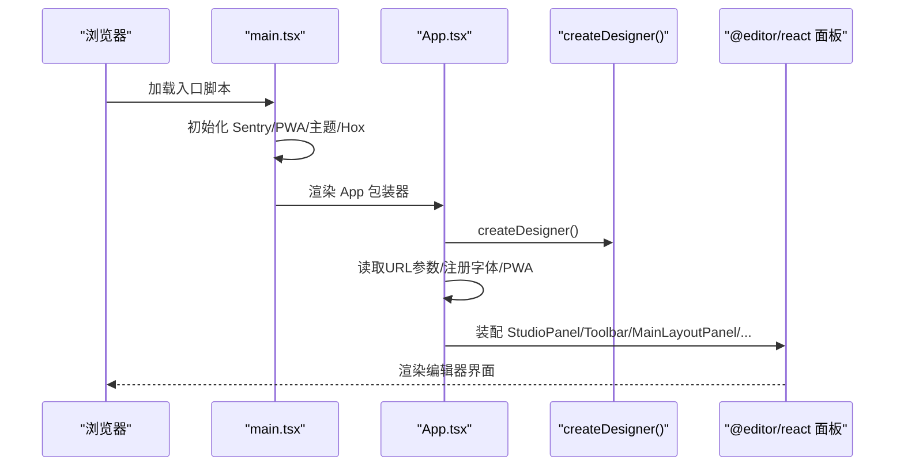
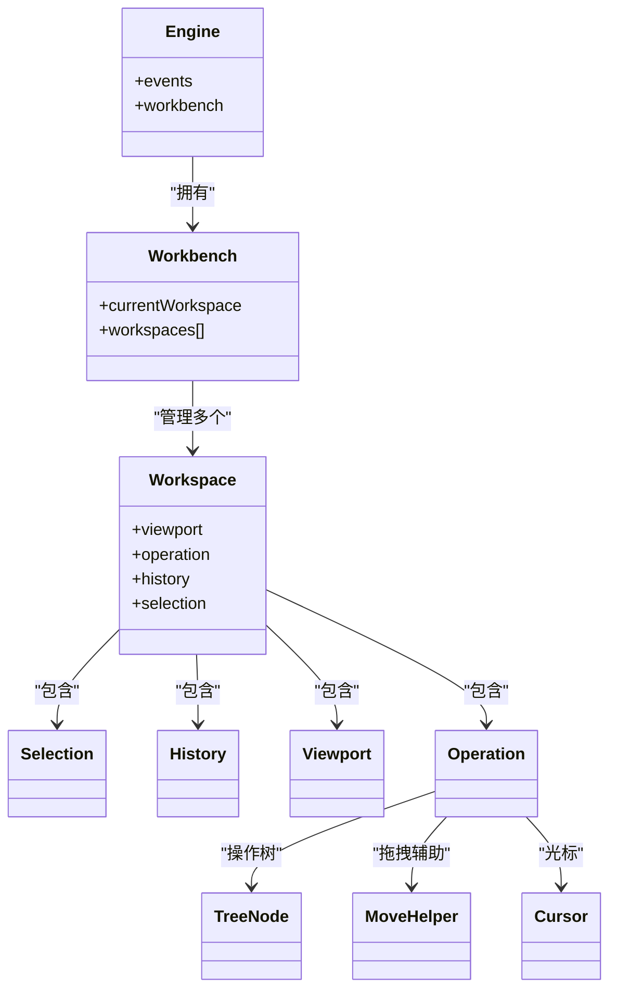
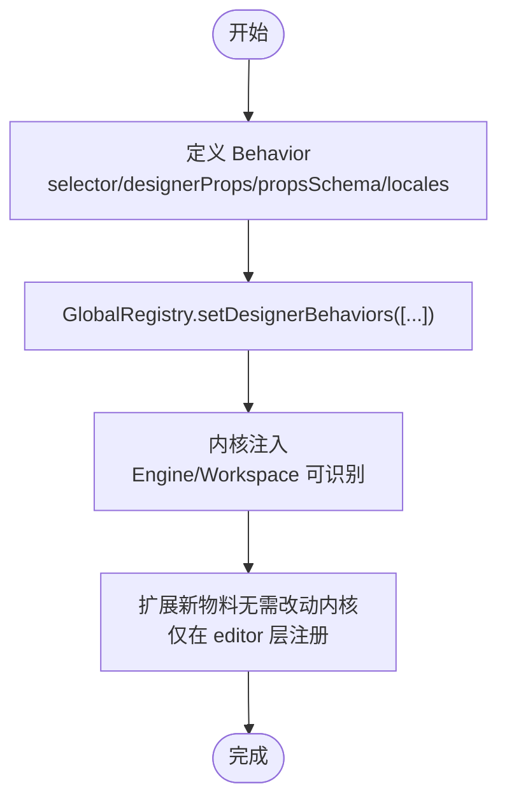
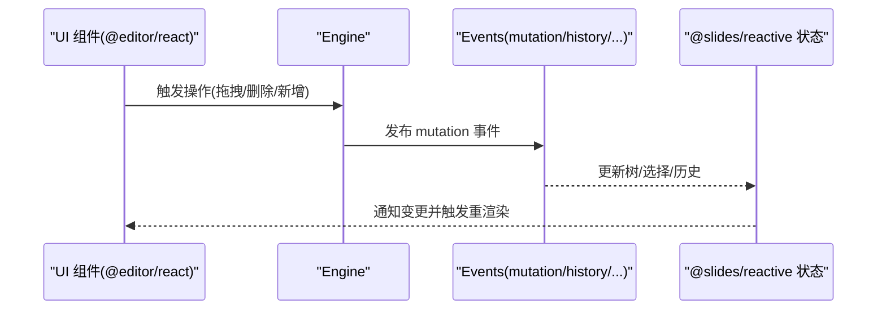
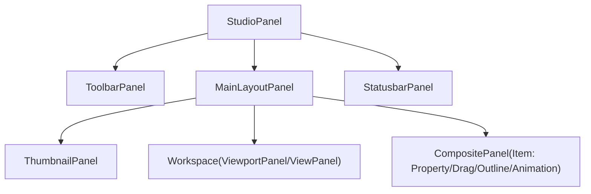
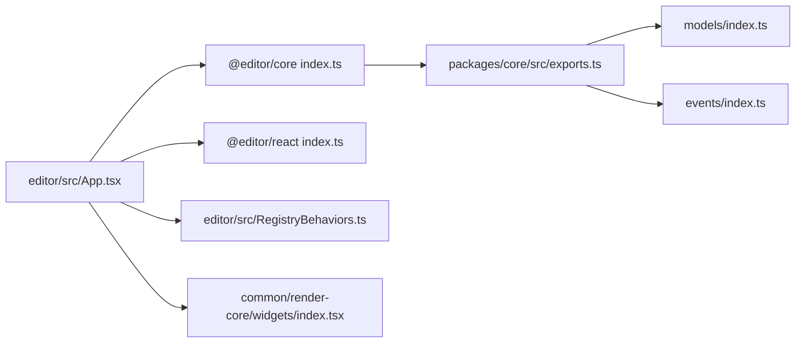

# 编辑器架构

<cite>
**本文引用的文件**
- [editor/src/main.tsx](file://editor/src/main.tsx)
- [editor/src/App.tsx](file://editor/src/App.tsx)
- [editor/src/RegistryBehaviors.ts](file://editor/src/RegistryBehaviors.ts)
- [packages/core/src/index.ts](file://packages/core/src/index.ts)
- [packages/core/src/exports.ts](file://packages/core/src/exports.ts)
- [packages/core/src/models/index.ts](file://packages/core/src/models/index.ts)
- [packages/core/src/events/index.ts](file://packages/core/src/events/index.ts)
- [packages/react/src/index.ts](file://packages/react/src/index.ts)
- [common/render-core/shared/index.ts](file://common/render-core/shared/index.ts)
- [common/render-core/widgets/index.tsx](file://common/render-core/widgets/index.tsx)
- [project-analysis/05_高频面试问题.md](file://project-analysis/05_高频面试问题.md)
</cite>

## 目录
1. [引言](#引言)
2. [项目结构](#项目结构)
3. [核心组件](#核心组件)
4. [架构总览](#架构总览)
5. [详细组件分析](#详细组件分析)
6. [依赖分析](#依赖分析)
7. [性能考虑](#性能考虑)
8. [故障排查指南](#故障排查指南)
9. [结论](#结论)
10. [附录](#附录)

## 引言
本文件面向 Slides Engine 编辑器的架构文档，围绕以下目标展开：解释编辑器的整体架构设计，包括基于 @editor/react 的组件体系、Designable 内核的工作原理、Workspace 和 Workbench 的组织结构；阐述编辑器的初始化过程（createDesigner() 调用、全局上下文设置、面板布局）；说明事件驱动架构与组件间通信机制、状态管理策略；解释扩展性设计（插件系统、行为注册机制）；并提供架构图与组件关系图，帮助开发者快速理解编辑器内部结构。

## 项目结构
Slides Engine 采用多包工作区（monorepo）组织方式，编辑器核心位于 editor 目录，底层内核位于 packages/{core,react,shared,typings}，渲染相关位于 common/{render-core,render-components,render-context,slide-*}，预览与播放器位于 preview 与 bridge/*，任务侧位于 task，分析文档位于 project-analysis。

- 编辑器入口与应用
  - editor/src/main.tsx：应用入口，初始化 Sentry、版本校验、Ant Design 主题与 Hox 全局状态容器，挂载 App。
  - editor/src/App.tsx：编辑器主应用，负责创建引擎、装配面板、注入全局上下文、绑定工具栏与属性面板、集成预览与游戏模态框。
- 设计内核与组件库
  - packages/core：Designable 内核导出入口，提供 Engine、Workspace、Workbench、TreeNode、History、Events 等模型与事件。
  - packages/react：基于 React 的设计时 UI 组件库，提供 StudioPanel、ToolbarPanel、MainLayoutPanel、ViewportPanel、ViewPanel、CompositePanel、WorkspacePanel、StatusbarPanel 等容器与部件。
- 行为注册与扩展
  - editor/src/RegistryBehaviors.ts：集中注册各组件的行为（Behavior），包括 Root、Card、Shape、Image、Text、Video、Audio、RichText、Camera、Game 等，统一注入到 GlobalRegistry。
- 渲染与运行态
  - common/render-core：渲染根、资源与实例上下文、事件序列与消息客户端等。
  - common/render-core/widgets/index.tsx：运行态组件映射（如 Group、Video、RichText、Game、Camera、Shape、Img 等）。
  - common/render-core/shared/index.ts：空的默认 schema 定义，用于兜底。

图表来源
- [editor/src/main.tsx:1-69](file://editor/src/main.tsx#L1-L69)
- [editor/src/App.tsx:1-230](file://editor/src/App.tsx#L1-L230)
- [packages/core/src/index.ts:1-16](file://packages/core/src/index.ts#L1-L16)
- [packages/core/src/exports.ts:1-5](file://packages/core/src/exports.ts#L1-L5)
- [packages/core/src/models/index.ts:1-14](file://packages/core/src/models/index.ts#L1-L14)
- [packages/core/src/events/index.ts:1-7](file://packages/core/src/events/index.ts#L1-L7)
- [packages/react/src/index.ts:1-11](file://packages/react/src/index.ts#L1-L11)
- [common/render-core/shared/index.ts:1-11](file://common/render-core/shared/index.ts#L1-L11)
- [common/render-core/widgets/index.tsx:1-70](file://common/render-core/widgets/index.tsx#L1-L70)

章节来源
- [editor/src/main.tsx:1-69](file://editor/src/main.tsx#L1-L69)
- [editor/src/App.tsx:1-230](file://editor/src/App.tsx#L1-L230)
- [packages/core/src/index.ts:1-16](file://packages/core/src/index.ts#L1-L16)
- [packages/core/src/exports.ts:1-5](file://packages/core/src/exports.ts#L1-L5)
- [packages/react/src/index.ts:1-11](file://packages/react/src/index.ts#L1-L11)

## 核心组件
- 设计内核（@editor/core）
  - 提供 Engine、Workspace、Workbench、TreeNode、Selection、MoveHelper、Keyboard、Shortcut、History、Viewport、Operation、Cursor、Events 等核心模型与事件，支撑“树如何改、如何选、如何拖、如何撤销”等通用能力。
- React 组件库（@editor/react）
  - 提供 StudioPanel、ToolbarPanel、MainLayoutPanel、ViewportPanel、ViewPanel、CompositePanel、WorkspacePanel、StatusbarPanel、OutlineTreeWidget、AnimationWidget、MoveableContainer 等容器与部件，用于装配编辑器 UI。
- 行为注册（GlobalRegistry + createBehavior）
  - 在 editor/src/RegistryBehaviors.ts 中集中注册各组件行为（selector、designerProps、propsSchema、locales），并通过 GlobalRegistry.setDesignerBehaviors 注入，形成“教学课件物料”的扩展边界。
- 全局上下文
  - App.tsx 通过 GlobalDataContext.Provider 与 GlobalResourceContext.Provider 注入全局数据与资源，供画布与面板使用。
- 渲染映射
  - common/render-core/widgets/index.tsx 将组件名映射到运行态组件（如 Group、Video、RichText、Game、Camera、Shape、Img），配合 render-core 的 RenderRoot 实现运行态渲染。

章节来源
- [packages/core/src/models/index.ts:1-14](file://packages/core/src/models/index.ts#L1-L14)
- [packages/core/src/events/index.ts:1-7](file://packages/core/src/events/index.ts#L1-L7)
- [packages/react/src/index.ts:1-11](file://packages/react/src/index.ts#L1-L11)
- [editor/src/RegistryBehaviors.ts:1-69](file://editor/src/RegistryBehaviors.ts#L1-L69)
- [editor/src/App.tsx:133-226](file://editor/src/App.tsx#L133-L226)
- [common/render-core/widgets/index.tsx:1-70](file://common/render-core/widgets/index.tsx#L1-L70)

## 架构总览
编辑器采用“内核 + 组件库 + 扩展注册 + 渲染映射”的分层架构：
- 上层：@editor/react 提供面板与部件，装配编辑器 UI。
- 中层：@editor/core 提供 Designable 内核，承载树操作、选择、拖拽、历史、快捷键等通用能力。
- 下层：扩展注册（GlobalRegistry + createBehavior）将教学课件物料注入内核，形成“业务组件注册、COS、预览 URL、课堂协议”等业务边界。
- 运行态：common/render-core/widgets 提供运行态组件映射，结合 RenderRoot 实现课件渲染。

图表来源
- [packages/react/src/index.ts:1-11](file://packages/react/src/index.ts#L1-L11)
- [packages/core/src/exports.ts:1-5](file://packages/core/src/exports.ts#L1-L5)
- [editor/src/RegistryBehaviors.ts:1-69](file://editor/src/RegistryBehaviors.ts#L1-L69)
- [common/render-core/widgets/index.tsx:1-70](file://common/render-core/widgets/index.tsx#L1-L70)

章节来源
- [packages/react/src/index.ts:1-11](file://packages/react/src/index.ts#L1-L11)
- [packages/core/src/exports.ts:1-5](file://packages/core/src/exports.ts#L1-L5)
- [editor/src/RegistryBehaviors.ts:1-69](file://editor/src/RegistryBehaviors.ts#L1-L69)
- [common/render-core/widgets/index.tsx:1-70](file://common/render-core/widgets/index.tsx#L1-L70)

## 详细组件分析

### 初始化流程与全局上下文
- 入口初始化
  - main.tsx 初始化 Sentry、版本校验与热更新 SW，使用 withProvider 包裹 App，并通过 HoxRoot 提供全局状态容器。
- 应用装配
  - App.tsx 调用 createDesigner() 创建引擎，读取 URL 参数（id、title、productId），构建全局上下文（globalData、globalResource），注册字体、PWA 更新策略，绑定工具栏、属性面板、大纲树、动画面板、预览与游戏模态框。
- 面板布局
  - 使用 StudioPanel、ToolbarPanel、MainLayoutPanel、ViewportPanel、ViewPanel、CompositePanel、WorkspacePanel、StatusbarPanel 等容器进行布局，形成“缩略图侧边栏 + 画布主区 + 属性/大纲/动画右侧栏”的经典三栏结构。

图表来源
- [editor/src/main.tsx:17-68](file://editor/src/main.tsx#L17-L68)
- [editor/src/App.tsx:53-131](file://editor/src/App.tsx#L53-L131)
- [packages/react/src/index.ts:1-11](file://packages/react/src/index.ts#L1-L11)

章节来源
- [editor/src/main.tsx:17-68](file://editor/src/main.tsx#L17-L68)
- [editor/src/App.tsx:53-131](file://editor/src/App.tsx#L53-L131)

### 设计内核与 Workspace/Workbench 组织
- 内核模型
  - Engine：全局事件与快捷键中心。
  - Workbench：工作台，管理多个 Workspace。
  - Workspace：单页课件的独立视口、独立历史与操作上下文。
  - TreeNode/Selection/MoveHelper/History/Viewport/Operation/Cursor：支撑树结构、选择、拖拽、历史、视口与操作的核心模型。
- 事件系统
  - events 子模块导出 cursor、keyboard、mutation、viewport、workbench、history 等事件，驱动内核状态变化与 UI 同步。

图表来源
- [packages/core/src/models/index.ts:1-14](file://packages/core/src/models/index.ts#L1-L14)
- [packages/core/src/events/index.ts:1-7](file://packages/core/src/events/index.ts#L1-L7)

章节来源
- [packages/core/src/models/index.ts:1-14](file://packages/core/src/models/index.ts#L1-L14)
- [packages/core/src/events/index.ts:1-7](file://packages/core/src/events/index.ts#L1-L7)

### 行为注册与扩展机制
- 行为注册
  - RegistryBehaviors.ts 中通过 createBehavior 定义 Root、Card、Shape、Image、Text、Video、Audio、RichText、Camera、Game 等组件的行为，设置 selector、designerProps（如 droppable、propsSchema）、locales。
  - 通过 GlobalRegistry.setDesignerBehaviors 将所有行为一次性注入，形成“教学课件物料”的扩展边界。
- 扩展边界
  - 内核只关心“树怎么改、怎么选、怎么拖、怎么撤销”，业务组件注册、COS、预览 URL、课堂协议等在 editor/task/bridge 等层实现，避免污染内核。

图表来源
- [editor/src/RegistryBehaviors.ts:24-69](file://editor/src/RegistryBehaviors.ts#L24-L69)
- [packages/core/src/index.ts:5-15](file://packages/core/src/index.ts#L5-L15)

章节来源
- [editor/src/RegistryBehaviors.ts:24-69](file://editor/src/RegistryBehaviors.ts#L24-L69)
- [packages/core/src/index.ts:5-15](file://packages/core/src/index.ts#L5-L15)
- [project-analysis/05_高频面试问题.md:9-14](file://project-analysis/05_高频面试问题.md#L9-L14)

### 事件驱动与状态管理
- 事件驱动
  - 内核通过 events 子模块（mutation、keyboard、cursor、viewport、workbench、history）发布与订阅事件，驱动树变更、选择变化、视口滚动、历史记录等。
- 状态管理
  - 画布树状态采用 @slides/reactive（细粒度可观测），减少无效渲染；历史撤销依赖 History 快照而非 Redux 时间旅行。
- 组件通信
  - App.tsx 通过全局上下文（GlobalDataContext、GlobalResourceContext）与 @editor/react 面板共享数据；@editor/react 内部通过上下文与事件总线与内核交互。

图表来源
- [packages/core/src/events/index.ts:1-7](file://packages/core/src/events/index.ts#L1-L7)
- [project-analysis/05_高频面试问题.md:42-47](file://project-analysis/05_高频面试问题.md#L42-L47)

章节来源
- [packages/core/src/events/index.ts:1-7](file://packages/core/src/events/index.ts#L1-L7)
- [project-analysis/05_高频面试问题.md:42-47](file://project-analysis/05_高频面试问题.md#L42-L47)

### 面板布局与交互流
- 布局结构
  - StudioPanel：顶层容器。
  - ToolbarPanel：顶部工具栏（Logo、动作按钮、菜单）。
  - MainLayoutPanel：主布局，包含左侧缩略图、中间画布、右侧属性/大纲/动画面板。
  - ViewPanel：设计画布，支持额外插槽（如 MoveableContainer）。
  - CompositePanel：右侧复合面板，包含属性设置、大纲树、动画面板。
  - StatusbarPanel：底部状态栏。
- 交互要点
  - 缩略图面板与当前 Workspace 绑定，支持创建/删除页面、切换页面。
  - 属性面板通过 SettingsForm 与 propsSchema 驱动，动态生成表单项。
  - 动画面板与大纲树根据 pageType 条件渲染。

图表来源
- [editor/src/App.tsx:137-217](file://editor/src/App.tsx#L137-L217)
- [packages/react/src/index.ts:1-11](file://packages/react/src/index.ts#L1-L11)

章节来源
- [editor/src/App.tsx:137-217](file://editor/src/App.tsx#L137-L217)

## 依赖分析
- 编辑器应用对内核与组件库的依赖
  - App.tsx 依赖 @editor/core 的 createDesigner 与 @editor/react 的面板与部件，通过全局上下文与事件系统连接。
- 内核导出与模型
  - packages/core/src/index.ts 将 Core 模块挂载到全局 Polyfill，保证内核可被其他模块访问；exports.ts 导出模型与事件，供上层使用。
- 扩展注册与渲染映射
  - RegistryBehaviors.ts 与 render-core/widgets/index.tsx 分别承担“行为注册”和“运行态组件映射”，两者共同构成“设计时编辑 + 运行时渲染”的闭环。

图表来源
- [editor/src/App.tsx:24-25](file://editor/src/App.tsx#L24-L25)
- [packages/core/src/index.ts:1-16](file://packages/core/src/index.ts#L1-L16)
- [packages/core/src/exports.ts:1-5](file://packages/core/src/exports.ts#L1-L5)
- [packages/react/src/index.ts:1-11](file://packages/react/src/index.ts#L1-L11)
- [editor/src/RegistryBehaviors.ts:1-69](file://editor/src/RegistryBehaviors.ts#L1-L69)
- [common/render-core/widgets/index.tsx:1-70](file://common/render-core/widgets/index.tsx#L1-L70)

章节来源
- [packages/core/src/index.ts:1-16](file://packages/core/src/index.ts#L1-L16)
- [packages/core/src/exports.ts:1-5](file://packages/core/src/exports.ts#L1-L5)
- [packages/react/src/index.ts:1-11](file://packages/react/src/index.ts#L1-L11)
- [editor/src/RegistryBehaviors.ts:1-69](file://editor/src/RegistryBehaviors.ts#L1-L69)
- [common/render-core/widgets/index.tsx:1-70](file://common/render-core/widgets/index.tsx#L1-L70)

## 性能考虑
- 状态更新策略
  - 画布树状态采用细粒度可观测（@slides/reactive），降低无效渲染成本，适合高频、深层嵌套、局部字段变更的场景。
- 历史与撤销
  - 历史撤销依赖 History 快照，不依赖 Redux 时间旅行，调试“谁改了某个属性”需结合事件或自定义日志。
- PWA 与版本控制
  - main.tsx 中通过版本号校验与 SW 自动更新，确保编辑器资源与缓存一致性，减少加载抖动。

章节来源
- [project-analysis/05_高频面试问题.md:42-47](file://project-analysis/05_高频面试问题.md#L42-L47)
- [editor/src/main.tsx:34-53](file://editor/src/main.tsx#L34-L53)

## 故障排查指南
- 版本不一致导致刷新
  - main.tsx 会检测当前 URL 版本号与后端返回的最新版本，不一致则跳转到对应版本的 index.html，确保资源一致。
- 无权限或加载失败
  - main.tsx 支持显示 403 页面与加载状态提示，定位权限与网络问题。
- 字体未生效
  - App.tsx 在顶部注册字体，若字体未显示，检查 fontBootstrap 与 CDN 路径配置。
- 预览与游戏弹窗
  - App.tsx 提供预览与游戏模态框的打开/关闭逻辑，若无法打开，检查 previewRef 与 gameModalRef 的引用与 open/cancel 方法。

章节来源
- [editor/src/main.tsx:34-53](file://editor/src/main.tsx#L34-L53)
- [editor/src/App.tsx:107-131](file://editor/src/App.tsx#L107-L131)

## 结论
Slides Engine 编辑器以 Designable 内核为核心，通过 @editor/react 组件库实现高内聚的面板与部件，借助 GlobalRegistry + createBehavior 的行为注册机制实现教学课件物料的扩展边界，结合 @slides/reactive 的细粒度状态管理与事件驱动架构，形成“设计时编辑 + 运行时渲染”的完整链路。该架构在保持内核通用性的同时，将业务边界（组件注册、COS、预览、课堂协议）清晰分离，具备良好的可维护性与扩展性。

## 附录
- 关键术语
  - Engine：设计内核的全局中枢，承载事件与工作台。
  - Workbench：工作台，管理多个 Workspace。
  - Workspace：单页课件的独立视口与操作上下文。
  - Behavior：组件行为定义，包含 selector、designerProps、propsSchema、locales。
  - GlobalRegistry：全局注册中心，注入设计器行为。
  - @slides/reactive：细粒度可观测状态库，替代 Redux 用于画布树状态。