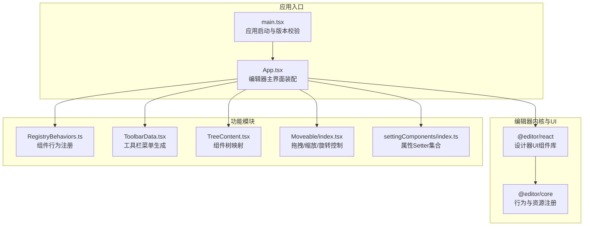
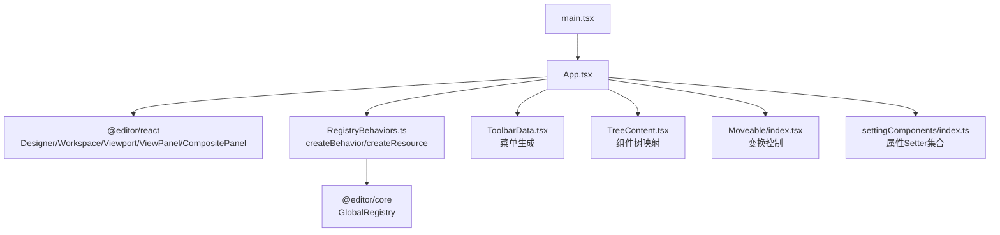
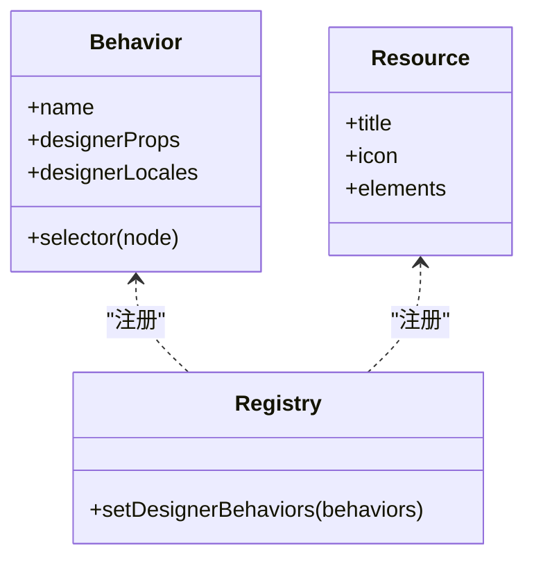
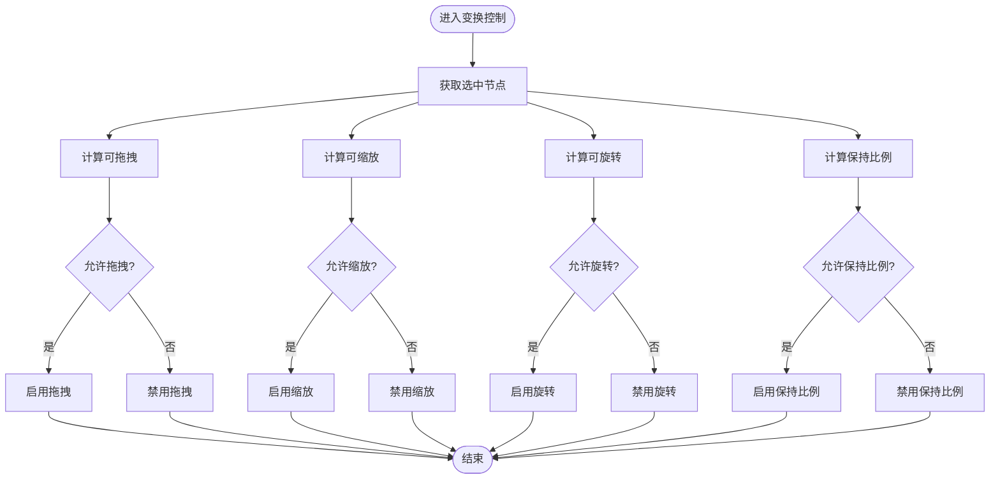
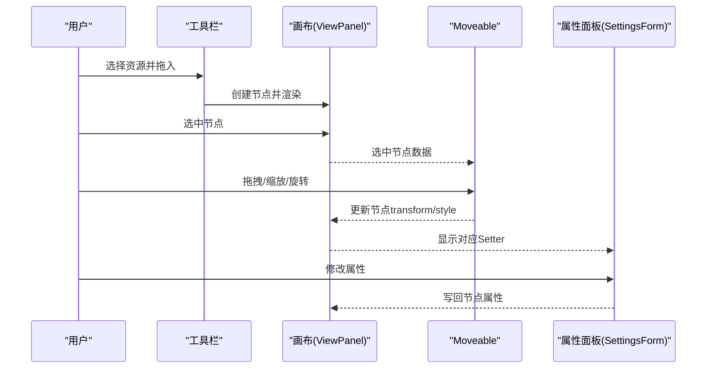
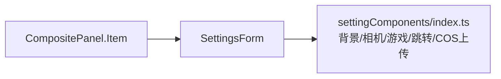
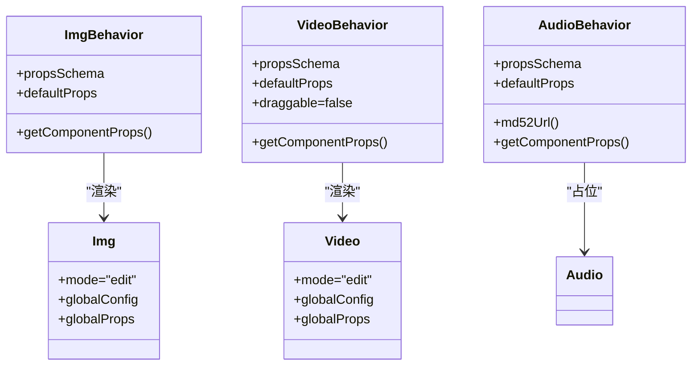
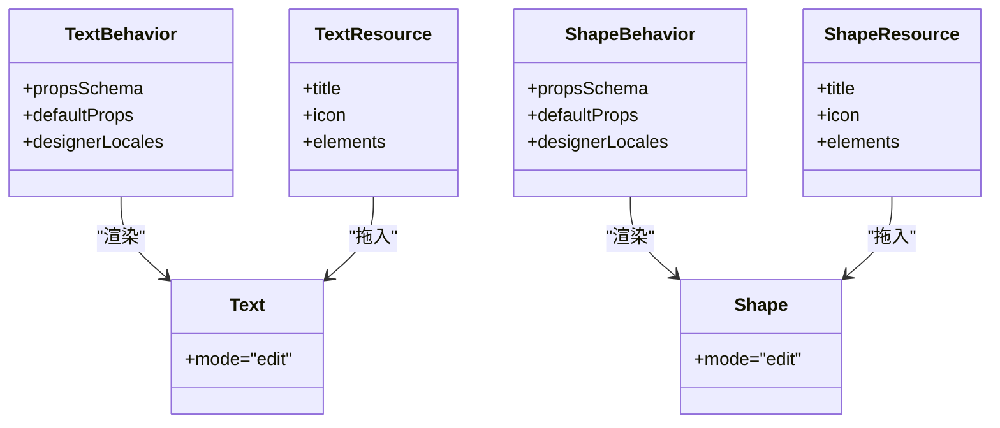
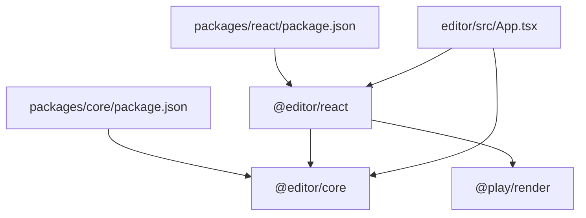

# 编辑器系统

<cite>
**本文引用的文件**
- [editor/src/App.tsx](file://editor/src/App.tsx)
- [editor/src/main.tsx](file://editor/src/main.tsx)
- [editor/src/RegistryBehaviors.ts](file://editor/src/RegistryBehaviors.ts)
- [editor/src/ToolbarData.tsx](file://editor/src/ToolbarData.tsx)
- [editor/src/components/Moveable/index.tsx](file://editor/src/components/Moveable/index.tsx)
- [editor/src/components/TreeContent.tsx](file://editor/src/components/TreeContent.tsx)
- [editor/src/settingComponents/index.ts](file://editor/src/settingComponents/index.ts)
- [packages/core/package.json](file://packages/core/package.json)
- [packages/react/package.json](file://packages/react/package.json)
- [editor/src/components/Text/EditingText.tsx](file://editor/src/components/Text/EditingText.tsx)
- [editor/src/components/Img/index.tsx](file://editor/src/components/Img/index.tsx)
- [editor/src/components/Video/index.tsx](file://editor/src/components/Video/index.tsx)
- [editor/src/components/Audio/index.tsx](file://editor/src/components/Audio/index.tsx)
- [editor/src/components/Shape/EditingShape.tsx](file://editor/src/components/Shape/EditingShape.tsx)
</cite>

## 目录
1. [简介](#简介)
2. [项目结构](#项目结构)
3. [核心组件](#核心组件)
4. [架构总览](#架构总览)
5. [详细组件分析](#详细组件分析)
6. [依赖关系分析](#依赖关系分析)
7. [性能考量](#性能考量)
8. [故障排查指南](#故障排查指南)
9. [结论](#结论)
10. [附录：扩展开发指南](#附录扩展开发指南)

## 简介
本文件面向 Slides Engine 编辑器系统，系统以 React 为基础，结合 @editor/react 与 @editor/core 提供的设计器内核，构建了完整的可视化编辑体验。文档覆盖以下主题：
- 整体架构与分层：编辑器入口、工作台、画布、属性面板、资源管理与行为系统
- 拖拽系统与变换系统：基于 Moveable 的可拖拽、可缩放、可旋转能力
- 选择系统：树形组件与选中节点联动
- 组件注册机制与行为系统：通过 createBehavior/createResource 定义组件与默认属性、Schema、本地化文案
- 画布操作：元素拖拽、缩放、旋转、保持比例、编组限制等
- 属性面板：基于 JSON Schema 的 Setter 组件与 SettingsForm 集成
- 资源管理系统：图片、视频、音频等多媒体资源的加载与上传
- 扩展开发：新增组件类型与行为的步骤与最佳实践

## 项目结构
编辑器前端位于 editor 目录，核心入口在 main.tsx，应用主体在 App.tsx；组件注册与行为定义集中在 RegistryBehaviors.ts；工具栏菜单由 ToolbarData.tsx 动态生成；画布与属性面板通过 @editor/react 提供的组件装配。

**图表来源**
- [editor/src/main.tsx:1-69](file://editor/src/main.tsx#L1-L69)
- [editor/src/App.tsx:1-230](file://editor/src/App.tsx#L1-L230)
- [packages/core/package.json:1-24](file://packages/core/package.json#L1-L24)
- [packages/react/package.json:1-28](file://packages/react/package.json#L1-L28)
- [editor/src/RegistryBehaviors.ts:1-69](file://editor/src/RegistryBehaviors.ts#L1-L69)
- [editor/src/ToolbarData.tsx:1-111](file://editor/src/ToolbarData.tsx#L1-L111)
- [editor/src/components/TreeContent.tsx:1-49](file://editor/src/components/TreeContent.tsx#L1-L49)
- [editor/src/components/Moveable/index.tsx:1-77](file://editor/src/components/Moveable/index.tsx#L1-L77)
- [editor/src/settingComponents/index.ts:1-20](file://editor/src/settingComponents/index.ts#L1-L20)

**章节来源**
- [editor/src/main.tsx:1-69](file://editor/src/main.tsx#L1-L69)
- [editor/src/App.tsx:1-230](file://editor/src/App.tsx#L1-L230)

## 核心组件
- 应用入口与启动
  - main.tsx：初始化 Sentry、版本校验与加载状态，挂载 App 并注入全局 Provider
  - App.tsx：装配 Designer、StudioPanel、ToolbarPanel、MainLayoutPanel、CompositePanel（属性面板）、ViewportPanel、ViewPanel、TreeContent、MoveableContainer 等
- 行为与资源注册
  - RegistryBehaviors.ts：通过 createBehavior 定义各组件的行为（propsSchema、defaultProps、selector、locales），并通过 GlobalRegistry.setDesignerBehaviors 注册
- 工具栏与菜单
  - ToolbarData.tsx：根据页面类型动态生成“元素”“视图”等菜单项，包含形状、富文本、媒体、相机、游戏等资源入口
- 组件树与渲染映射
  - TreeContent.tsx：将画布组件名映射到具体组件实现（编辑态与只读态）
- 变换与选择
  - Moveable/index.tsx：基于 useTree 获取选中节点，按节点类型与属性动态启用/禁用拖拽、缩放、旋转、保持比例等能力
- 属性面板
  - settingComponents/index.ts：聚合各类 Setter 组件（如背景、相机、游戏、跳转页、COS 上传）

**章节来源**
- [editor/src/main.tsx:1-69](file://editor/src/main.tsx#L1-L69)
- [editor/src/App.tsx:1-230](file://editor/src/App.tsx#L1-L230)
- [editor/src/RegistryBehaviors.ts:1-69](file://editor/src/RegistryBehaviors.ts#L1-L69)
- [editor/src/ToolbarData.tsx:1-111](file://editor/src/ToolbarData.tsx#L1-L111)
- [editor/src/components/TreeContent.tsx:1-49](file://editor/src/components/TreeContent.tsx#L1-L49)
- [editor/src/components/Moveable/index.tsx:1-77](file://editor/src/components/Moveable/index.tsx#L1-L77)
- [editor/src/settingComponents/index.ts:1-20](file://editor/src/settingComponents/index.ts#L1-L20)

## 架构总览
编辑器采用“入口应用 + 设计器内核 + UI 组件库 + 行为与资源注册 + 画布与属性面板”的分层架构。@editor/react 提供设计器 UI 组件（Designer、Workspace、Viewport、ViewPanel、CompositePanel 等），@editor/core 提供行为与资源注册机制，业务侧通过 RegistryBehaviors.ts 将组件行为注入内核，App.tsx 将这些能力装配到页面中。

**图表来源**
- [editor/src/main.tsx:1-69](file://editor/src/main.tsx#L1-L69)
- [editor/src/App.tsx:1-230](file://editor/src/App.tsx#L1-L230)
- [editor/src/RegistryBehaviors.ts:1-69](file://editor/src/RegistryBehaviors.ts#L1-L69)
- [editor/src/ToolbarData.tsx:1-111](file://editor/src/ToolbarData.tsx#L1-L111)
- [editor/src/components/TreeContent.tsx:1-49](file://editor/src/components/TreeContent.tsx#L1-L49)
- [editor/src/components/Moveable/index.tsx:1-77](file://editor/src/components/Moveable/index.tsx#L1-L77)
- [editor/src/settingComponents/index.ts:1-20](file://editor/src/settingComponents/index.ts#L1-L20)

## 详细组件分析

### 组件注册机制与行为系统
- 行为定义
  - createBehavior(name, selector, designerProps, designerLocales)：定义组件的选择器、默认属性、Schema、本地化文案
  - designerProps.propsSchema：通过 genPropsSchema 合并基础信息与样式 Schema
  - designerProps.defaultProps：组件默认样式与属性
  - designerProps.getComponentProps：为组件注入运行时钩子（如 useConnect、useReport、useResourceData 等）
- 资源定义
  - createResource(title, icon, elements)：定义工具栏中可拖入画布的资源项
- 全局注册
  - GlobalRegistry.setDesignerBehaviors([...])：集中注册所有组件行为

**图表来源**
- [editor/src/RegistryBehaviors.ts:24-55](file://editor/src/RegistryBehaviors.ts#L24-L55)
- [editor/src/RegistryBehaviors.ts:57-69](file://editor/src/RegistryBehaviors.ts#L57-L69)

**章节来源**
- [editor/src/RegistryBehaviors.ts:1-69](file://editor/src/RegistryBehaviors.ts#L1-L69)

### 拖拽系统与变换控制
- 选择系统
  - 使用 useTree 获取当前选中节点列表，依据节点类型与属性动态计算可拖拽、可缩放、可旋转、保持比例等能力
- 能力开关策略
  - 拖拽：排除仅可选组件（如视频、游戏）与包含编组的节点
  - 缩放：排除视频、音频、游戏；若包含编组则禁用
  - 旋转：排除相机；若包含编组则禁用
  - 保持比例：当节点或其属性标记 keepRatio 时启用
- 与 MoveableContainer 集成
  - 通过 moveableProps 将上述能力传入容器，实现统一的变换控制

**图表来源**
- [editor/src/components/Moveable/index.tsx:16-76](file://editor/src/components/Moveable/index.tsx#L16-L76)

**章节来源**
- [editor/src/components/Moveable/index.tsx:1-77](file://editor/src/components/Moveable/index.tsx#L1-L77)

### 画布操作流程（拖拽/缩放/旋转）
- 用户在工具栏选择资源，拖入画布
- 选中元素后，右侧属性面板显示对应 Setter
- 通过 Moveable 控制条进行拖拽、缩放、旋转
- 变换结果写回节点属性，驱动渲染更新

**图表来源**
- [editor/src/App.tsx:166-181](file://editor/src/App.tsx#L166-L181)
- [editor/src/components/Moveable/index.tsx:16-76](file://editor/src/components/Moveable/index.tsx#L16-L76)
- [editor/src/settingComponents/index.ts:13-20](file://editor/src/settingComponents/index.ts#L13-L20)

**章节来源**
- [editor/src/App.tsx:166-181](file://editor/src/App.tsx#L166-L181)

### 属性面板设计与 Setter 机制
- 设置表单集成
  - CompositePanel.Item 中嵌入 SettingsForm，并传入 extra={settingComponents}，将背景、相机、游戏、跳转页、COS 上传等 Setter 注入
- Setter 组件职责
  - 背景设置：用于根组件背景配置
  - 相机设置：相机组件相关属性
  - 游戏设置：游戏组件相关属性
  - 跳转页设置：页面跳转相关属性
  - COS 上传：资源上传与回填

**图表来源**
- [editor/src/App.tsx:192-211](file://editor/src/App.tsx#L192-L211)
- [editor/src/settingComponents/index.ts:1-20](file://editor/src/settingComponents/index.ts#L1-L20)

**章节来源**
- [editor/src/App.tsx:192-211](file://editor/src/App.tsx#L192-L211)
- [editor/src/settingComponents/index.ts:1-20](file://editor/src/settingComponents/index.ts#L1-L20)

### 资源管理系统（图片/视频/音频）
- 图片组件
  - ImgBehavior：定义图片组件行为，合并基础与图片 Schema，默认尺寸与 transform
  - Img：通过 @slide/render-components/Image 组件渲染，注入 useResourceData、useConnect、useReport 等钩子，支持上传状态与 CDN 路径
- 视频组件
  - VideoBehavior：定义视频组件行为，含自动播放默认值与拖拽禁用
  - Video：通过 @slide/render-components/Video 渲染，支持上传状态与 CDN 路径
- 音频组件
  - AudioBehavior：定义音频组件行为，提供 md5 到 URL 的转换辅助函数
  - Audio：占位组件，音频播放由其他组件实现

**图表来源**
- [editor/src/components/Img/index.tsx:23-69](file://editor/src/components/Img/index.tsx#L23-L69)
- [editor/src/components/Img/index.tsx:88-110](file://editor/src/components/Img/index.tsx#L88-L110)
- [editor/src/components/Video/index.tsx:18-60](file://editor/src/components/Video/index.tsx#L18-L60)
- [editor/src/components/Video/index.tsx:86-103](file://editor/src/components/Video/index.tsx#L86-L103)
- [editor/src/components/Audio/index.tsx:25-73](file://editor/src/components/Audio/index.tsx#L25-L73)

**章节来源**
- [editor/src/components/Img/index.tsx:1-110](file://editor/src/components/Img/index.tsx#L1-L110)
- [editor/src/components/Video/index.tsx:1-103](file://editor/src/components/Video/index.tsx#L1-L103)
- [editor/src/components/Audio/index.tsx:1-114](file://editor/src/components/Audio/index.tsx#L1-L114)

### 文本与形状组件
- 文本组件
  - TextBehavior：合并基础与文本 Schema，提供默认属性与本地化文案
  - TextResource：工具栏资源入口
  - Text：编辑态渲染，支持内容可编辑属性
- 形状组件
  - ShapeBehavior：合并基础与形状 Schema，默认边框、填充、尺寸
  - ShapeResource：工具栏资源入口
  - Shape：通过 @slide/slide-shape 渲染

**图表来源**
- [editor/src/components/Text/EditingText.tsx:25-58](file://editor/src/components/Text/EditingText.tsx#L25-L58)
- [editor/src/components/Text/EditingText.tsx:61-75](file://editor/src/components/Text/EditingText.tsx#L61-L75)
- [editor/src/components/Text/EditingText.tsx:77-99](file://editor/src/components/Text/EditingText.tsx#L77-L99)
- [editor/src/components/Shape/EditingShape.tsx:28-77](file://editor/src/components/Shape/EditingShape.tsx#L28-L77)
- [editor/src/components/Shape/EditingShape.tsx:79-94](file://editor/src/components/Shape/EditingShape.tsx#L79-L94)
- [editor/src/components/Shape/EditingShape.tsx:96-104](file://editor/src/components/Shape/EditingShape.tsx#L96-L104)

**章节来源**
- [editor/src/components/Text/EditingText.tsx:1-99](file://editor/src/components/Text/EditingText.tsx#L1-L99)
- [editor/src/components/Shape/EditingShape.tsx:1-104](file://editor/src/components/Shape/EditingShape.tsx#L1-L104)

## 依赖关系分析
- @editor/react 依赖 @editor/core 与 @play/render，提供设计器 UI 组件与响应式能力
- @editor/core 依赖 reactive、animate、json-schema 等底层能力
- 编辑器侧通过 RegistryBehaviors.ts 注入组件行为，App.tsx 装配 UI 组件

**图表来源**
- [packages/core/package.json:1-24](file://packages/core/package.json#L1-L24)
- [packages/react/package.json:1-28](file://packages/react/package.json#L1-L28)
- [editor/src/App.tsx:1-230](file://editor/src/App.tsx#L1-L230)

**章节来源**
- [packages/core/package.json:1-24](file://packages/core/package.json#L1-L24)
- [packages/react/package.json:1-28](file://packages/react/package.json#L1-L28)

## 性能考量
- 版本热更新与缓存
  - main.tsx 中通过虚拟 SW 注册与定时更新，确保编辑器版本一致性
- 渲染与选择优化
  - 使用 observer 包裹组件，减少不必要重渲染
  - Moveable 控制能力按选中节点动态计算，避免对不支持变换的节点执行无效逻辑
- 资源加载
  - 图片/视频组件通过 useResourceData 与 CDN 路径配置，降低首屏与切换成本

**章节来源**
- [editor/src/main.tsx:34-53](file://editor/src/main.tsx#L34-L53)
- [editor/src/App.tsx:100-106](file://editor/src/App.tsx#L100-L106)
- [editor/src/components/Img/index.tsx:88-110](file://editor/src/components/Img/index.tsx#L88-L110)
- [editor/src/components/Video/index.tsx:86-103](file://editor/src/components/Video/index.tsx#L86-L103)

## 故障排查指南
- 编辑器无法加载或频繁刷新
  - 检查版本校验逻辑与路由拼接，确认当前版本与服务端一致
  - 关注 Sentry 初始化与错误上报
- 画布无响应或变换异常
  - 检查 Moveable 能力开关逻辑（仅选中、包含编组、相机等限制）
  - 确认选中节点是否存在且具备 transform/style 字段
- 属性面板不显示或Setter无效
  - 确认当前选中节点匹配行为 selector
  - 检查 propsSchema 是否正确合并基础与组件特有 Schema
- 资源加载失败
  - 检查 useResourceData 返回的资源列表与 CDN 路径配置
  - 确认 md52Url 或上传状态回调是否正确

**章节来源**
- [editor/src/main.tsx:17-26](file://editor/src/main.tsx#L17-L26)
- [editor/src/components/Moveable/index.tsx:16-76](file://editor/src/components/Moveable/index.tsx#L16-L76)
- [editor/src/RegistryBehaviors.ts:24-55](file://editor/src/RegistryBehaviors.ts#L24-L55)
- [editor/src/components/Img/index.tsx:88-110](file://editor/src/components/Img/index.tsx#L88-L110)
- [editor/src/components/Audio/index.tsx:46-57](file://editor/src/components/Audio/index.tsx#L46-L57)

## 结论
Slides Engine 编辑器以清晰的分层架构与强大的行为/资源注册机制为核心，结合 @editor/react 的 UI 组件与 @editor/core 的内核能力，实现了从工具栏拖拽、画布变换、属性面板配置到资源管理的完整闭环。通过标准化的组件行为定义与动态能力开关，编辑器在易用性与扩展性之间取得良好平衡。

## 附录：扩展开发指南
- 新增组件类型与行为
  - 定义行为：createBehavior(name, selector, designerProps, designerLocales)，在 designerProps 中：
    - propsSchema：通过 genPropsSchema 合并基础 Schema 与组件特有 Schema
    - defaultProps：设置默认样式与属性
    - getComponentProps：注入 useConnect、useReport、useResourceData 等钩子
  - 定义资源：createResource(title, icon, elements)，在 elements 中声明默认 props
  - 注册行为：在 RegistryBehaviors.ts 中导入并加入 GlobalRegistry.setDesignerBehaviors
- 新增 Setter 组件
  - 在 settingComponents 下新增组件，并在 CompositePanel.Item 中通过 extra={settingComponents} 注入
- 新增工具栏菜单
  - 在 ToolbarData.tsx 中按页面类型返回对应的菜单项与资源入口
- 最佳实践
  - 保持 selector 精准匹配组件名与 x-component
  - 为复杂组件提供本地化文案与默认值
  - 对不支持变换的组件（如视频、音频、游戏）在 Moveable 能力计算中明确禁用

**章节来源**
- [editor/src/RegistryBehaviors.ts:12-22](file://editor/src/RegistryBehaviors.ts#L12-L22)
- [editor/src/RegistryBehaviors.ts:57-69](file://editor/src/RegistryBehaviors.ts#L57-L69)
- [editor/src/ToolbarData.tsx:59-110](file://editor/src/ToolbarData.tsx#L59-L110)
- [editor/src/settingComponents/index.ts:7-20](file://editor/src/settingComponents/index.ts#L7-L20)