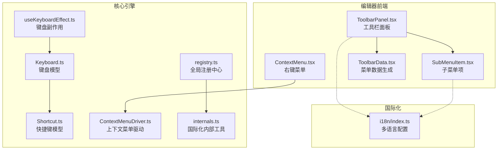
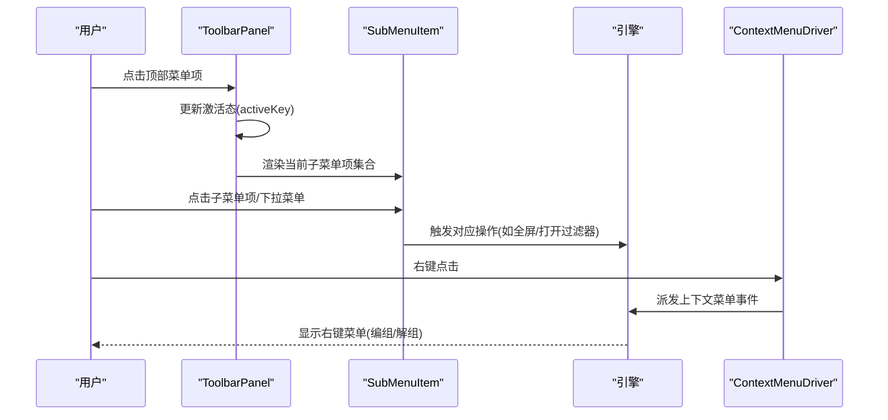
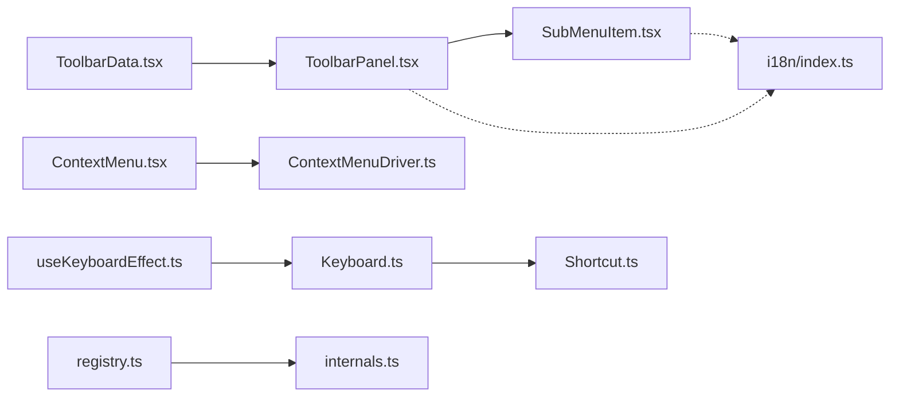

# 菜单工具栏

<cite>
**本文引用的文件**
- [editor/src/components/ContextMenu.tsx](file://editor/src/components/ContextMenu.tsx)
- [packages/react/src/panels/ToolbarPanel.tsx](file://packages/react/src/panels/ToolbarPanel.tsx)
- [editor/src/ToolbarData.tsx](file://editor/src/ToolbarData.tsx)
- [editor/src/components/menu/SubMenuItem.tsx](file://editor/src/components/menu/SubMenuItem.tsx)
- [editor/src/components/menu/DropdownText.tsx](file://editor/src/components/menu/DropdownText.tsx)
- [packages/core/src/drivers/ContextMenuDriver.ts](file://packages/core/src/drivers/ContextMenuDriver.ts)
- [packages/core/src/models/Keyboard.ts](file://packages/core/src/models/Keyboard.ts)
- [packages/core/src/models/Shortcut.ts](file://packages/core/src/models/Shortcut.ts)
- [packages/core/src/effects/useKeyboardEffect.ts](file://packages/core/src/effects/useKeyboardEffect.ts)
- [packages/core/src/registry.ts](file://packages/core/src/registry.ts)
- [packages/core/src/internals.ts](file://packages/core/src/internals.ts)
- [task/src/i18n/index.ts](file://task/src/i18n/index.ts)
</cite>

## 目录
1. [简介](#简介)
2. [项目结构](#项目结构)
3. [核心组件](#核心组件)
4. [架构总览](#架构总览)
5. [详细组件分析](#详细组件分析)
6. [依赖关系分析](#依赖关系分析)
7. [性能考量](#性能考量)
8. [故障排查指南](#故障排查指南)
9. [结论](#结论)
10. [附录](#附录)

## 简介
本文件面向 Slides Engine 的菜单工具栏体系，系统性说明工具栏的整体设计、布局与交互、菜单项组织结构与快捷键支持；详述功能模块（文件操作、编辑操作、视图控制）在当前实现中的覆盖范围与边界；阐述右键菜单的上下文感知、动态生成与权限控制；解释国际化支持与扩展机制（新增菜单项、自定义行为、第三方插件集成）。

## 项目结构
菜单工具栏相关代码主要分布在以下位置：
- 工具栏面板与子菜单渲染：packages/react/src/panels/ToolbarPanel.tsx、editor/src/components/menu/SubMenuItem.tsx
- 菜单数据与页面类型联动：editor/src/ToolbarData.tsx
- 右键菜单与上下文驱动：editor/src/components/ContextMenu.tsx、packages/core/src/drivers/ContextMenuDriver.ts
- 快捷键与键盘处理：packages/core/src/models/Keyboard.ts、packages/core/src/models/Shortcut.ts、packages/core/src/effects/useKeyboardEffect.ts
- 国际化基础与本地化配置：task/src/i18n/index.ts
- 扩展注册中心：packages/core/src/registry.ts、packages/core/src/internals.ts

图表来源
- [packages/react/src/panels/ToolbarPanel.tsx:1-122](file://packages/react/src/panels/ToolbarPanel.tsx#L1-L122)
- [editor/src/components/menu/SubMenuItem.tsx:1-234](file://editor/src/components/menu/SubMenuItem.tsx#L1-L234)
- [editor/src/ToolbarData.tsx:1-111](file://editor/src/ToolbarData.tsx#L1-L111)
- [editor/src/components/ContextMenu.tsx:1-58](file://editor/src/components/ContextMenu.tsx#L1-L58)
- [packages/core/src/drivers/ContextMenuDriver.ts:1-28](file://packages/core/src/drivers/ContextMenuDriver.ts#L1-L28)
- [packages/core/src/models/Keyboard.ts:1-108](file://packages/core/src/models/Keyboard.ts#L1-L108)
- [packages/core/src/models/Shortcut.ts:1-81](file://packages/core/src/models/Shortcut.ts#L1-L81)
- [packages/core/src/effects/useKeyboardEffect.ts:1-20](file://packages/core/src/effects/useKeyboardEffect.ts#L1-L20)
- [packages/core/src/registry.ts:1-191](file://packages/core/src/registry.ts#L1-L191)
- [packages/core/src/internals.ts:1-55](file://packages/core/src/internals.ts#L1-L55)
- [task/src/i18n/index.ts:1-37](file://task/src/i18n/index.ts#L1-L37)

章节来源
- [packages/react/src/panels/ToolbarPanel.tsx:1-122](file://packages/react/src/panels/ToolbarPanel.tsx#L1-L122)
- [editor/src/ToolbarData.tsx:1-111](file://editor/src/ToolbarData.tsx#L1-L111)

## 核心组件
- 工具栏面板 ToolbarPanel：负责顶部菜单项的横向排列与激活态切换，承载子菜单区域，提供标题、Logo、右侧动作区等布局容器。
- 子菜单项 SubMenuItem：根据父级菜单项的 key 渲染不同类型的子菜单，如下拉面板、资源上传入口、全屏切换等。
- 菜单数据生成 GenMenuList：依据工作空间的页面类型（普通页/视频页/游戏页）动态生成菜单列表与子菜单项。
- 右键菜单 ContextMenu：基于 Ant Design Dropdown 实现，按上下文动态拼装“编组/解组”等菜单项，并通过触发器拦截浏览器原生右键菜单。
- 上下文菜单驱动 ContextMenuDriver：统一捕获 contextmenu 事件并派发到引擎事件系统。
- 键盘与快捷键：Keyboard 模型维护按键序列与修饰键状态，Shortcut 定义匹配规则，useKeyboardEffect 将键盘事件接入引擎上下文。
- 国际化：i18n 配置提供多语言资源与回退策略；registry/internals 提供本地化合并与语言探测能力。
- 扩展注册中心：GlobalRegistry 提供行为、图标、本地化注册与查询接口，支持第三方插件扩展。

章节来源
- [packages/react/src/panels/ToolbarPanel.tsx:33-122](file://packages/react/src/panels/ToolbarPanel.tsx#L33-L122)
- [editor/src/components/menu/SubMenuItem.tsx:10-234](file://editor/src/components/menu/SubMenuItem.tsx#L10-L234)
- [editor/src/ToolbarData.tsx:59-111](file://editor/src/ToolbarData.tsx#L59-L111)
- [editor/src/components/ContextMenu.tsx:8-58](file://editor/src/components/ContextMenu.tsx#L8-L58)
- [packages/core/src/drivers/ContextMenuDriver.ts:5-28](file://packages/core/src/drivers/ContextMenuDriver.ts#L5-L28)
- [packages/core/src/models/Keyboard.ts:19-108](file://packages/core/src/models/Keyboard.ts#L19-L108)
- [packages/core/src/models/Shortcut.ts:12-81](file://packages/core/src/models/Shortcut.ts#L12-L81)
- [packages/core/src/effects/useKeyboardEffect.ts:4-20](file://packages/core/src/effects/useKeyboardEffect.ts#L4-L20)
- [task/src/i18n/index.ts:10-37](file://task/src/i18n/index.ts#L10-L37)
- [packages/core/src/registry.ts:75-191](file://packages/core/src/registry.ts#L75-L191)
- [packages/core/src/internals.ts:21-55](file://packages/core/src/internals.ts#L21-L55)

## 架构总览
工具栏采用“数据驱动 + 组件渲染”的模式：GenMenuList 根据页面类型输出菜单树，ToolbarPanel 负责顶层导航，SubMenuItem 负责具体子菜单项渲染与交互；右键菜单通过 ContextMenu 与 ContextMenuDriver 协作，屏蔽浏览器默认右键；键盘输入由 useKeyboardEffect 接入引擎，Keyboard/Shortcut 负责匹配与阻止默认行为；国际化通过 i18n 与 registry/internals 提供语言探测与本地化合并。

图表来源
- [packages/react/src/panels/ToolbarPanel.tsx:42-122](file://packages/react/src/panels/ToolbarPanel.tsx#L42-L122)
- [editor/src/components/menu/SubMenuItem.tsx:69-89](file://editor/src/components/menu/SubMenuItem.tsx#L69-L89)
- [packages/core/src/drivers/ContextMenuDriver.ts:6-27](file://packages/core/src/drivers/ContextMenuDriver.ts#L6-L27)

## 详细组件分析

### 工具栏面板 ToolbarPanel
- 布局与状态
  - 顶部容器包含左侧 Logo/标题、中部菜单面板、右侧动作区。
  - 通过 activeKey 控制当前激活的主菜单项，currentItem/currentSubMenuList 决定子菜单渲染。
  - 支持全屏状态监听，动态更新子菜单项文案（如“全屏展示/退出全屏”）。
- 子菜单渲染
  - 使用 SubMenuItem 渲染当前主菜单项的 children 列表。
  - 传递 openGameFilter 等回调以支持游戏资源过滤弹窗。
- 事件与生命周期
  - 监听 fullscreenchange 事件，确保 UI 与实际全屏状态一致。
  - 组件卸载时清理事件监听器，避免内存泄漏。

章节来源
- [packages/react/src/panels/ToolbarPanel.tsx:33-122](file://packages/react/src/panels/ToolbarPanel.tsx#L33-L122)

### 子菜单项 SubMenuItem
- 功能分发
  - 形状面板：使用下拉菜单展示 ShapePanel。
  - 资源上传：根据资源类型生成图片/视频上传入口。
  - 全屏切换：根据 isFullScreen 状态切换文案与行为。
  - 游戏组件：调用父级传入的 openGameFilter 打开过滤器。
- 交互细节
  - 通过 IconWidget/TextWidget 渲染图标与文本，支持国际化消息读取。
  - 下拉菜单使用 Ant Design Dropdown，trigger 设置为 click。
- 事件处理
  - handleMenuItemClick 统一处理菜单点击，包含全屏切换、预览入口占位、游戏过滤等分支。

章节来源
- [editor/src/components/menu/SubMenuItem.tsx:10-234](file://editor/src/components/menu/SubMenuItem.tsx#L10-L234)

### 菜单数据生成 GenMenuList
- 页面类型驱动
  - 根据 workspace.pageType 返回不同的菜单集合：普通页/视频页/游戏页。
  - 普通页：形状、富文本、媒体资源、视频流。
  - 视频页：仅资源（视频）。
  - 游戏页：游戏组件。
- 结构化输出
  - 每个主菜单项包含 key/title/children/SubMenuItem 等字段，供 ToolbarPanel 渲染。
  - 视图菜单包含全屏切换项。

章节来源
- [editor/src/ToolbarData.tsx:59-111](file://editor/src/ToolbarData.tsx#L59-L111)

### 右键菜单 ContextMenu 与 ContextMenuDriver
- 上下文感知
  - 通过 useDesigner 获取引擎实例，结合 useNodeGrouped/useNodeUnGrouped 计算是否显示“编组/解组”菜单项。
  - 使用 Ant Design Dropdown 的 contextMenu 触发器，禁用无可用项时的触发。
- 事件驱动
  - ContextMenuDriver 捕获 contextmenu 事件，派发到引擎事件系统，避免浏览器默认右键菜单。
- 权限控制
  - 通过 isShowGroup/isShowUnGroup 的布尔判断决定菜单项是否可见，形成运行时权限控制。

章节来源
- [editor/src/components/ContextMenu.tsx:8-58](file://editor/src/components/ContextMenu.tsx#L8-L58)
- [packages/core/src/drivers/ContextMenuDriver.ts:5-28](file://packages/core/src/drivers/ContextMenuDriver.ts#L5-L28)

### 快捷键与键盘处理
- Keyboard
  - 维护按键序列、修饰键状态，支持匹配多键组合与顺序匹配。
  - 提供 preventCodes 以决定是否阻止默认行为。
- Shortcut
  - 定义 codes/matcher/handler，支持函数式匹配与处理器执行。
- useKeyboardEffect
  - 将引擎订阅的 KeyDown/KeyUp 事件交由 Keyboard 处理，计算上下文并执行匹配结果。

章节来源
- [packages/core/src/models/Keyboard.ts:19-108](file://packages/core/src/models/Keyboard.ts#L19-L108)
- [packages/core/src/models/Shortcut.ts:12-81](file://packages/core/src/models/Shortcut.ts#L12-L81)
- [packages/core/src/effects/useKeyboardEffect.ts:4-20](file://packages/core/src/effects/useKeyboardEffect.ts#L4-L20)

### 国际化支持
- 多语言资源
  - i18n/index.ts 提供英文/中文资源映射与回退语言配置。
- 本地化查询
  - registry.ts 提供 getDesignerMessage/tokenized 查询路径，internals.ts 提供 mergeLocales 与语言探测。
- 文本渲染
  - SubMenuItem 中通过 TextWidget 读取消息，实现菜单文本的本地化展示。

章节来源
- [task/src/i18n/index.ts:10-37](file://task/src/i18n/index.ts#L10-L37)
- [packages/core/src/registry.ts:138-152](file://packages/core/src/registry.ts#L138-L152)
- [packages/core/src/internals.ts:21-55](file://packages/core/src/internals.ts#L21-L55)
- [editor/src/components/menu/SubMenuItem.tsx:158-161](file://editor/src/components/menu/SubMenuItem.tsx#L158-L161)

### 扩展机制
- 行为与本地化注册
  - registerDesignerBehaviors/registerDesignerLocales：向全局注册中心注入行为与本地化包，支持第三方插件扩展。
- 图标与语言
  - registerDesignerIcons/getDesignerIcon：注册与查询图标。
  - setDesignerLanguage/getDesignerLanguage：切换与查询语言。
- 本地化合并
  - mergeLocales 递归合并本地化消息，lowerSnake 规范化键名，getBrowserLanguage 探测浏览器语言。

章节来源
- [packages/core/src/registry.ts:75-191](file://packages/core/src/registry.ts#L75-L191)
- [packages/core/src/internals.ts:21-55](file://packages/core/src/internals.ts#L21-L55)

## 依赖关系分析
- 组件耦合
  - ToolbarPanel 依赖 GenMenuList 与 SubMenuItem；SubMenuItem 依赖资源组件与上传组件。
  - ContextMenu 依赖引擎上下文与钩子以决定菜单项可见性。
- 外部依赖
  - Ant Design Dropdown/Tooltip/Modal 用于 UI 交互与提示。
  - i18n 用于多语言资源加载与切换。
- 引擎集成
  - 键盘与右键菜单通过事件驱动接入引擎，实现与编辑器核心的解耦。

图表来源
- [editor/src/ToolbarData.tsx:59-111](file://editor/src/ToolbarData.tsx#L59-L111)
- [packages/react/src/panels/ToolbarPanel.tsx:42-122](file://packages/react/src/panels/ToolbarPanel.tsx#L42-L122)
- [editor/src/components/menu/SubMenuItem.tsx:10-234](file://editor/src/components/menu/SubMenuItem.tsx#L10-L234)
- [editor/src/components/ContextMenu.tsx:8-58](file://editor/src/components/ContextMenu.tsx#L8-L58)
- [packages/core/src/drivers/ContextMenuDriver.ts:5-28](file://packages/core/src/drivers/ContextMenuDriver.ts#L5-L28)
- [packages/core/src/effects/useKeyboardEffect.ts:4-20](file://packages/core/src/effects/useKeyboardEffect.ts#L4-L20)
- [packages/core/src/models/Keyboard.ts:19-108](file://packages/core/src/models/Keyboard.ts#L19-L108)
- [packages/core/src/models/Shortcut.ts:12-81](file://packages/core/src/models/Shortcut.ts#L12-L81)
- [packages/core/src/registry.ts:75-191](file://packages/core/src/registry.ts#L75-L191)
- [packages/core/src/internals.ts:21-55](file://packages/core/src/internals.ts#L21-L55)
- [task/src/i18n/index.ts:10-37](file://task/src/i18n/index.ts#L10-L37)

## 性能考量
- 渲染优化
  - ToolbarPanel 使用 observer 包裹，减少无关重渲染；子菜单项按需渲染，避免一次性渲染大量节点。
- 事件监听
  - 全屏事件监听在组件挂载时注册，卸载时清理，防止内存泄漏。
- 本地化
  - 本地化资源集中管理，避免重复加载；通过 tokenized 查询降低查找成本。
- 交互体验
  - 右键菜单禁用无可用项时的触发，减少无效渲染与抖动。

## 故障排查指南
- 右键菜单不显示
  - 检查 ContextMenu 的 items 是否为空，确认 isShowGroup/isShowUnGroup 的计算逻辑。
  - 确认 ContextMenuDriver 是否正确附加到目标元素上。
- 子菜单项点击无响应
  - 检查 SubMenuItem 的 handleMenuItemClick 分支是否覆盖该 key。
  - 确认 openGameFilter 回调是否正确传入且可调用。
- 全屏切换异常
  - 检查 isFullScreen 状态是否与实际全屏状态一致，确认 DOM 元素是否具备全屏权限。
- 快捷键无效
  - 检查 useKeyboardEffect 是否已订阅 KeyDown/KeyUp 事件。
  - 确认 Shortcut.codes/matcher/handler 配置是否正确，preventCodes 是否阻断了默认行为。
- 国际化文本未生效
  - 检查 i18n 资源是否正确加载，token 是否存在于本地化包中。
  - 确认 registry.getDesignerMessage 的语言环境与 token 规范化是否一致。

章节来源
- [editor/src/components/ContextMenu.tsx:25-48](file://editor/src/components/ContextMenu.tsx#L25-L48)
- [packages/core/src/drivers/ContextMenuDriver.ts:21-27](file://packages/core/src/drivers/ContextMenuDriver.ts#L21-L27)
- [editor/src/components/menu/SubMenuItem.tsx:69-89](file://editor/src/components/menu/SubMenuItem.tsx#L69-L89)
- [packages/core/src/effects/useKeyboardEffect.ts:4-20](file://packages/core/src/effects/useKeyboardEffect.ts#L4-L20)
- [packages/core/src/models/Shortcut.ts:34-47](file://packages/core/src/models/Shortcut.ts#L34-L47)
- [packages/core/src/registry.ts:138-152](file://packages/core/src/registry.ts#L138-L152)

## 结论
Slides Engine 的菜单工具栏采用清晰的数据驱动与组件化架构：工具栏面板负责布局与状态，子菜单项负责具体交互，GenMenuList 依据页面类型动态生成菜单树；右键菜单通过驱动层屏蔽浏览器默认行为并按上下文生成菜单项；键盘与快捷键通过引擎事件系统实现统一接入；国际化与扩展注册中心为多语言与第三方插件提供了完善的基础能力。当前实现聚焦于“元素”“视图”两大主菜单，编辑操作与文件操作等功能可通过扩展机制逐步补充。

## 附录

### 功能模块与当前覆盖范围
- 元素类
  - 形状、富文本、媒体资源（图片/视频）、视频流、游戏组件
- 视图类
  - 全屏展示/退出全屏
- 编辑类
  - 当前未直接暴露撤销/重做/复制/粘贴等通用编辑命令（可通过扩展机制接入）
- 文件类
  - 导入/导出未在工具栏直接暴露（可通过扩展机制接入）

章节来源
- [editor/src/ToolbarData.tsx:13-111](file://editor/src/ToolbarData.tsx#L13-L111)
- [editor/src/components/menu/SubMenuItem.tsx:69-89](file://editor/src/components/menu/SubMenuItem.tsx#L69-L89)

### 快捷键支持现状
- 已有示例：CursorSwitchSelection 展示了 Shift+S 切换光标类型的行为绑定方式。
- 建议：将常用编辑操作（撤销、重做、复制、粘贴、保存、导入/导出）以 Shortcut 形式注册，结合 useKeyboardEffect 接入引擎上下文。

章节来源
- [packages/core/src/shortcuts/CursorSwitch.ts:3-11](file://packages/core/src/shortcuts/CursorSwitch.ts#L3-L11)
- [packages/core/src/effects/useKeyboardEffect.ts:4-20](file://packages/core/src/effects/useKeyboardEffect.ts#L4-L20)

### 右键菜单的上下文与权限控制
- 上下文：根据节点是否可编组/解组动态生成菜单项。
- 权限：通过 isShowGroup/isShowUnGroup 的布尔值控制菜单项可见性，形成运行时权限控制。

章节来源
- [editor/src/components/ContextMenu.tsx:12-48](file://editor/src/components/ContextMenu.tsx#L12-L48)

### 国际化与本地化配置
- 多语言：i18n/index.ts 提供英文/中文资源与回退语言。
- 本地化查询：registry.getDesignerMessage 与 internals.mergeLocales、lowerSnake 协同工作。
- 文本渲染：TextWidget 读取本地化消息，实现菜单文本本地化。

章节来源
- [task/src/i18n/index.ts:10-37](file://task/src/i18n/index.ts#L10-L37)
- [packages/core/src/registry.ts:138-152](file://packages/core/src/registry.ts#L138-L152)
- [packages/core/src/internals.ts:21-55](file://packages/core/src/internals.ts#L21-L55)
- [editor/src/components/menu/SubMenuItem.tsx:158-161](file://editor/src/components/menu/SubMenuItem.tsx#L158-L161)

### 扩展机制与第三方插件集成
- 行为扩展：registerDesignerBehaviors 注入行为包，reSortBehaviors 保证依赖顺序。
- 本地化扩展：registerDesignerLocales 合并本地化消息，支持多语言增量扩展。
- 图标扩展：registerDesignerIcons 注入图标映射，配合 IconWidget 渲染。
- 语言扩展：setDesignerLanguage 切换语言，getDesignerLanguage 查询当前语言。

章节来源
- [packages/core/src/registry.ts:75-191](file://packages/core/src/registry.ts#L75-L191)
- [packages/core/src/internals.ts:21-55](file://packages/core/src/internals.ts#L21-L55)