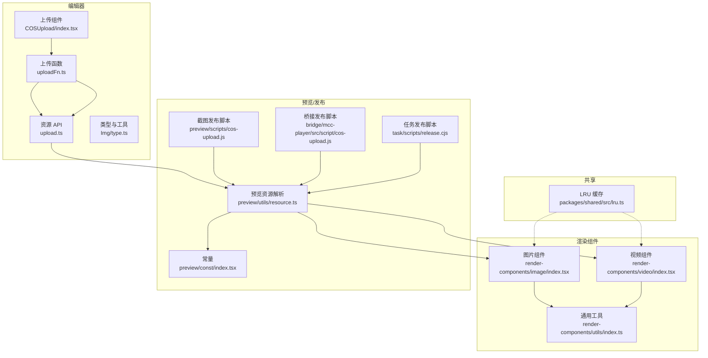
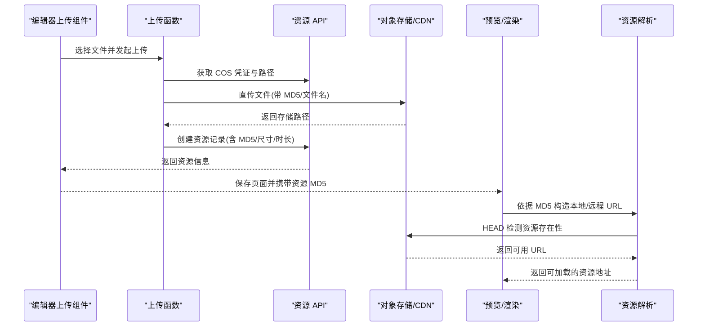
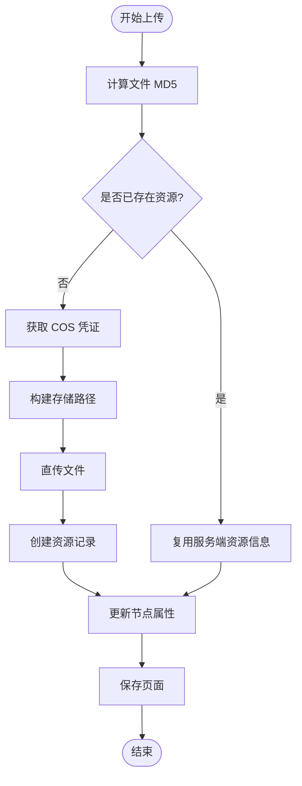
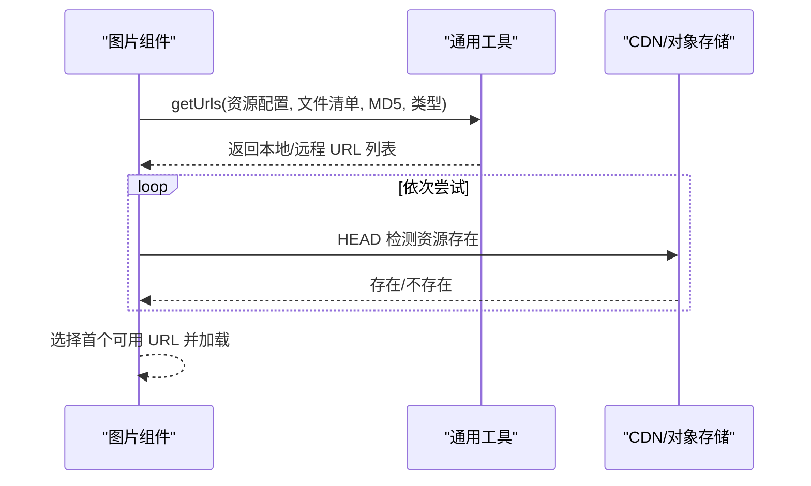
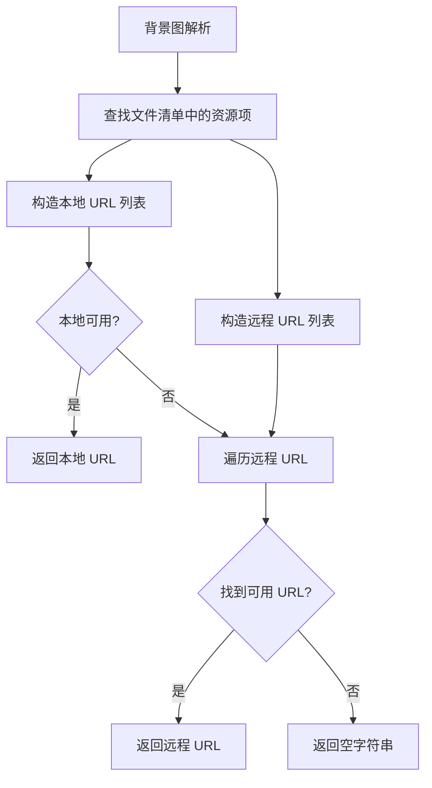
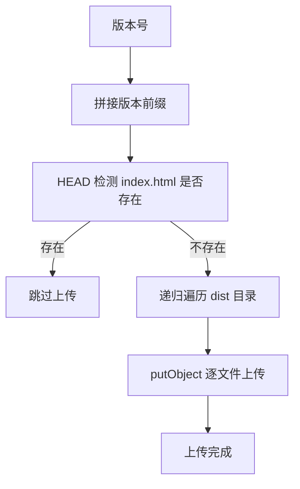
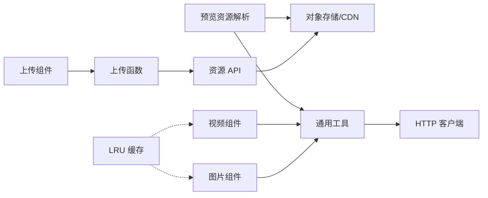

# 资源管理

<cite>
**本文档引用的文件**
- [编辑器上传与资源 API](file://editor/src/api/upload.ts)
- [COS 上传组件](file://editor/src/settingComponents/COSUpload/index.tsx)
- [COS 上传函数](file://editor/src/settingComponents/COSUpload/uploadFn.ts)
- [图片/音视频类型与工具](file://editor/src/components/Img/type.ts)
- [渲染组件-图片](file://common/render-components/src/image/index.tsx)
- [渲染组件-视频](file://common/render-components/src/video/index.tsx)
- [资源工具-通用](file://common/render-components/src/utils/index.ts)
- [预览端资源解析](file://preview/src/utils/resource.ts)
- [预览端常量](file://preview/src/const/index.tsx)
- [截图脚本-COS 上传](file://preview/scripts/cos-upload.js)
- [桥接-播放器工具](file://bridge/mcc-player/src/utils/index.ts)
- [桥接-播放器脚本-COS 上传](file://bridge/mcc-player/src/script/cos-upload.js)
- [任务发布脚本-COS 上传](file://task/scripts/release.cjs)
- [任务版本更新脚本](file://task/scripts/updateVersion.cjs)
- [共享包-LRU 缓存](file://packages/shared/src/lru.ts)
</cite>

## 目录
1. [简介](#简介)
2. [项目结构](#项目结构)
3. [核心组件](#核心组件)
4. [架构总览](#架构总览)
5. [详细组件分析](#详细组件分析)
6. [依赖分析](#依赖分析)
7. [性能考虑](#性能考虑)
8. [故障排查指南](#故障排查指南)
9. [结论](#结论)
10. [附录](#附录)

## 简介
本文件面向 Slides Engine 的资源管理子系统，系统性梳理资源从“上传-存储-引用-渲染-CDN 加速-版本与清理”的全链路设计与实现要点。重点覆盖：
- 资源类型：图片、视频、音频的上传、元数据采集与派生资源（如视频封面）处理
- 存储与 CDN：基于对象存储的直传与分发、多 CDN 主机回退策略
- 引用与渲染：资源 ID（MD5）驱动的引用、按需加载与失败回退
- 版本与发布：版本化目录与幂等上传、避免重复发布
- 安全与合规：防盗链探测、协议判定、本地/远程双栈加载
- 性能与最佳实践：缓存策略、加载顺序、埋点与可观测性

## 项目结构
围绕资源管理的关键模块分布如下：
- 编辑器侧：上传入口、鉴权与直传、资源创建与关系绑定
- 渲染侧：图片/视频组件按 MD5 解析 URL、远程资源存在性探测、加载状态上报
- 预览/发布：版本化静态资源上传、CDN 加速与回退
- 工具与共享：资源 URL 构造、远程资源存在性检测、LRU 缓存

图表来源
- [COS 上传组件:1-269](file://editor/src/settingComponents/COSUpload/index.tsx#L1-L269)
- [COS 上传函数:1-96](file://editor/src/settingComponents/COSUpload/uploadFn.ts#L1-L96)
- [编辑器上传与资源 API:1-130](file://editor/src/api/upload.ts#L1-L130)
- [图片/音视频类型与工具:1-134](file://editor/src/components/Img/type.ts#L1-L134)
- [渲染组件-图片:1-186](file://common/render-components/src/image/index.tsx#L1-L186)
- [渲染组件-视频:1-472](file://common/render-components/src/video/index.tsx#L1-L472)
- [资源工具-通用:1-236](file://common/render-components/src/utils/index.ts#L1-L236)
- [预览端资源解析:1-184](file://preview/src/utils/resource.ts#L1-L184)
- [预览端常量:1-25](file://preview/src/const/index.tsx#L1-L25)
- [截图脚本-COS 上传:19-108](file://preview/scripts/cos-upload.js#L19-L108)
- [桥接-播放器脚本-COS 上传:37-83](file://bridge/mcc-player/src/script/cos-upload.js#L37-L83)
- [任务发布脚本-COS 上传:1-28](file://task/scripts/release.cjs#L1-L28)
- [共享包-LRU 缓存:49-322](file://packages/shared/src/lru.ts#L49-L322)

章节来源
- [COS 上传组件:1-269](file://editor/src/settingComponents/COSUpload/index.tsx#L1-L269)
- [COS 上传函数:1-96](file://editor/src/settingComponents/COSUpload/uploadFn.ts#L1-L96)
- [编辑器上传与资源 API:1-130](file://editor/src/api/upload.ts#L1-L130)
- [图片/音视频类型与工具:1-134](file://editor/src/components/Img/type.ts#L1-L134)
- [渲染组件-图片:1-186](file://common/render-components/src/image/index.tsx#L1-L186)
- [渲染组件-视频:1-472](file://common/render-components/src/video/index.tsx#L1-L472)
- [资源工具-通用:1-236](file://common/render-components/src/utils/index.ts#L1-L236)
- [预览端资源解析:1-184](file://preview/src/utils/resource.ts#L1-L184)
- [预览端常量:1-25](file://preview/src/const/index.tsx#L1-L25)
- [截图脚本-COS 上传:19-108](file://preview/scripts/cos-upload.js#L19-L108)
- [桥接-播放器脚本-COS 上传:37-83](file://bridge/mcc-player/src/script/cos-upload.js#L37-L83)
- [任务发布脚本-COS 上传:1-28](file://task/scripts/release.cjs#L1-L28)
- [共享包-LRU 缓存:49-322](file://packages/shared/src/lru.ts#L49-L322)

## 核心组件
- 上传与鉴权
  - 上传组件负责选择文件、计算 MD5、调用上传函数并创建资源记录；支持进度回调与错误处理。
  - 上传函数获取 COS 临时凭证与目标路径，封装直传流程，返回资源完整信息。
  - 资源 API 提供资源创建、CDN 配置与凭证获取、关系绑定等接口。

- 渲染与引用
  - 图片/视频组件通过全局配置与文件清单，按资源类型与 MD5 解析可用 URL 列表。
  - 通用工具提供本地/远程 URL 构造、远程资源存在性探测（HEAD）、视频时长查询等。
  - 预览端资源解析在渲染前对背景图等进行 URL 规范化与存在性探测。

- 发布与版本
  - 预览与桥接端发布脚本采用“版本化目录 + 幂等校验”策略，避免重复上传。
  - 任务发布脚本提供 COS SDK 直传与版本号更新流程。

章节来源
- [COS 上传组件:69-136](file://editor/src/settingComponents/COSUpload/index.tsx#L69-L136)
- [COS 上传函数:32-87](file://editor/src/settingComponents/COSUpload/uploadFn.ts#L32-L87)
- [编辑器上传与资源 API:66-91](file://editor/src/api/upload.ts#L66-L91)
- [渲染组件-图片:69-151](file://common/render-components/src/image/index.tsx#L69-L151)
- [渲染组件-视频:16-118](file://common/render-components/src/video/index.tsx#L16-L118)
- [资源工具-通用:69-208](file://common/render-components/src/utils/index.ts#L69-L208)
- [预览端资源解析:67-115](file://preview/src/utils/resource.ts#L67-L115)
- [截图脚本-COS 上传:38-84](file://preview/scripts/cos-upload.js#L38-L84)
- [桥接-播放器脚本-COS 上传:37-83](file://bridge/mcc-player/src/script/cos-upload.js#L37-L83)
- [任务发布脚本-COS 上传:14-28](file://task/scripts/release.cjs#L14-L28)

## 架构总览
资源管理的端到端流程包含“编辑器上传-服务端登记-渲染引用-CDN 分发-版本发布”。

图表来源
- [COS 上传组件:144-224](file://editor/src/settingComponents/COSUpload/index.tsx#L144-L224)
- [COS 上传函数:42-87](file://editor/src/settingComponents/COSUpload/uploadFn.ts#L42-L87)
- [编辑器上传与资源 API:66-91](file://editor/src/api/upload.ts#L66-L91)
- [预览端资源解析:67-115](file://preview/src/utils/resource.ts#L67-L115)
- [资源工具-通用:129-157](file://common/render-components/src/utils/index.ts#L129-L157)

## 详细组件分析

### 上传与存储
- 上传组件职责
  - 计算文件 MD5，去重检查，避免重复上传
  - 支持图片尺寸采集、视频进度上报、错误状态反馈
  - 创建资源记录并更新节点属性，保存页面

- 上传函数职责
  - 获取 COS 临时凭证与目标路径
  - 执行直传，携带 MD5 与签名信息
  - 回调中合并服务端返回的资源信息

- 资源 API
  - 创建资源、获取 COS 配置与凭证、保存资源与页面的关系

图表来源
- [COS 上传组件:144-224](file://editor/src/settingComponents/COSUpload/index.tsx#L144-L224)
- [COS 上传函数:42-87](file://editor/src/settingComponents/COSUpload/uploadFn.ts#L42-L87)
- [编辑器上传与资源 API:66-91](file://editor/src/api/upload.ts#L66-L91)

章节来源
- [COS 上传组件:69-136](file://editor/src/settingComponents/COSUpload/index.tsx#L69-L136)
- [COS 上传函数:32-87](file://editor/src/settingComponents/COSUpload/uploadFn.ts#L32-L87)
- [编辑器上传与资源 API:66-91](file://editor/src/api/upload.ts#L66-L91)

### 资源引用与渲染
- 图片组件
  - 依据全局配置与文件清单，构造图片 URL 列表
  - 加载状态上报与错误处理，支持点击跳页

- 视频组件
  - 依据全局配置与文件清单，构造视频源与封面 URL 列表
  - 自动播放策略、信令同步、播放状态恢复、封面切换

- 通用工具
  - 本地/远程 URL 构造
  - 远程资源存在性探测（HEAD）
  - 视频时长查询

图表来源
- [渲染组件-图片:69-151](file://common/render-components/src/image/index.tsx#L69-L151)
- [资源工具-通用:164-208](file://common/render-components/src/utils/index.ts#L164-L208)
- [资源工具-通用:129-157](file://common/render-components/src/utils/index.ts#L129-L157)

章节来源
- [渲染组件-图片:69-151](file://common/render-components/src/image/index.tsx#L69-L151)
- [渲染组件-视频:16-118](file://common/render-components/src/video/index.tsx#L16-L118)
- [资源工具-通用:164-208](file://common/render-components/src/utils/index.ts#L164-L208)
- [资源工具-通用:129-157](file://common/render-components/src/utils/index.ts#L129-L157)

### 预览端资源解析
- 背景图处理
  - 从全局配置与页面文件清单中定位资源项
  - 优先本地根路径，其次远程 CDN 主机
  - 逐一探测可用 URL，返回第一个可达地址

- 埋点与日志
  - 资源加载开始/结束、成功/失败状态上报
  - 视频事件与信令收发埋点

图表来源
- [预览端资源解析:67-115](file://preview/src/utils/resource.ts#L67-L115)
- [预览端常量:1-25](file://preview/src/const/index.tsx#L1-L25)

章节来源
- [预览端资源解析:67-115](file://preview/src/utils/resource.ts#L67-L115)
- [预览端常量:1-25](file://preview/src/const/index.tsx#L1-L25)

### CDN 集成与版本发布
- 版本化目录与幂等上传
  - 发布前 HEAD 检测目标 HTML 是否存在，若不存在则递归上传
  - 支持预览端与桥接端脚本，统一采用版本号作为目录前缀

- 对象存储直传
  - 使用 COS SDK putObject 上传单个或整目录文件
  - 支持目录递归遍历与并发上传

图表来源
- [截图脚本-COS 上传:38-84](file://preview/scripts/cos-upload.js#L38-L84)
- [桥接-播放器脚本-COS 上传:37-83](file://bridge/mcc-player/src/script/cos-upload.js#L37-L83)
- [任务发布脚本-COS 上传:14-28](file://task/scripts/release.cjs#L14-L28)

章节来源
- [截图脚本-COS 上传:38-84](file://preview/scripts/cos-upload.js#L38-L84)
- [桥接-播放器脚本-COS 上传:37-83](file://bridge/mcc-player/src/script/cos-upload.js#L37-L83)
- [任务发布脚本-COS 上传:14-28](file://task/scripts/release.cjs#L14-L28)

### 资源类型处理
- 图片
  - 上传前读取宽高，用于布局与占位
  - 渲染时按 URL 列表依次探测，支持本地与 CDN 回退

- 视频
  - 上传前读取时长，用于播放器初始化与时长显示
  - 渲染时同时准备视频源与封面图，自动切换不可用链路

- 音频
  - 上传前读取时长，用于播放器初始化
  - 渲染时按视频组件策略处理（音频可复用视频组件）

章节来源
- [图片/音视频类型与工具:54-133](file://editor/src/components/Img/type.ts#L54-L133)
- [渲染组件-视频:104-106](file://common/render-components/src/video/index.tsx#L104-L106)
- [渲染组件-图片:69-76](file://common/render-components/src/image/index.tsx#L69-L76)

### 安全控制与合规
- 防盗链与协议判定
  - 通用工具提供协议判定与本地主机识别
  - 远程资源存在性检测采用 HEAD 请求，支持超时与重试

- 本地/远程双栈加载
  - 优先本地资源，不存在则回退至远程 CDN
  - 多 CDN 主机轮询，提升可用性

章节来源
- [资源工具-通用:1-66](file://common/render-components/src/utils/index.ts#L1-L66)
- [资源工具-通用:129-157](file://common/render-components/src/utils/index.ts#L129-L157)
- [预览端资源解析:67-115](file://preview/src/utils/resource.ts#L67-L115)

### 版本管理与清理
- 版本化发布
  - 以版本号为目录前缀，避免覆盖历史版本
  - HEAD 幂等校验，避免重复上传

- 清理与回收
  - 仓库未发现专门的资源清理脚本
  - 建议结合业务生命周期与对象存储生命周期策略进行定期清理

章节来源
- [截图脚本-COS 上传:38-44](file://preview/scripts/cos-upload.js#L38-L44)
- [桥接-播放器脚本-COS 上传:37-42](file://bridge/mcc-player/src/script/cos-upload.js#L37-L42)
- [任务版本更新脚本:16-28](file://task/scripts/updateVersion.cjs#L16-L28)

## 依赖分析
- 组件耦合
  - 上传组件依赖上传函数与资源 API
  - 渲染组件依赖通用工具与资源解析
  - 预览端资源解析依赖通用工具与文件清单

- 外部依赖
  - 对象存储 SDK（COS）
  - HTTP 客户端（axios）用于远程资源探测
  - LRU 缓存用于资源实例与状态缓存

图表来源
- [COS 上传组件:1-31](file://editor/src/settingComponents/COSUpload/index.tsx#L1-L31)
- [COS 上传函数:1-8](file://editor/src/settingComponents/COSUpload/uploadFn.ts#L1-L8)
- [编辑器上传与资源 API:1-17](file://editor/src/api/upload.ts#L1-L17)
- [渲染组件-图片:1-6](file://common/render-components/src/image/index.tsx#L1-L6)
- [渲染组件-视频:1-8](file://common/render-components/src/video/index.tsx#L1-L8)
- [资源工具-通用:1-1](file://common/render-components/src/utils/index.ts#L1-L1)
- [共享包-LRU 缓存:49-103](file://packages/shared/src/lru.ts#L49-L103)

章节来源
- [COS 上传组件:1-31](file://editor/src/settingComponents/COSUpload/index.tsx#L1-L31)
- [COS 上传函数:1-8](file://editor/src/settingComponents/COSUpload/uploadFn.ts#L1-L8)
- [编辑器上传与资源 API:1-17](file://editor/src/api/upload.ts#L1-L17)
- [渲染组件-图片:1-6](file://common/render-components/src/image/index.tsx#L1-L6)
- [渲染组件-视频:1-8](file://common/render-components/src/video/index.tsx#L1-L8)
- [资源工具-通用:1-1](file://common/render-components/src/utils/index.ts#L1-L1)
- [共享包-LRU 缓存:49-103](file://packages/shared/src/lru.ts#L49-L103)

## 性能考虑
- 加载顺序与回退
  - 本地优先、远程回退，减少跨域与网络抖动影响
  - 多 CDN 主机轮询，提升命中率与可用性

- 超时与重试
  - 远程资源探测支持超时与重试，降低偶发失败的影响

- 缓存策略
  - LRU 缓存用于资源实例与状态，减少重复初始化成本
  - 建议浏览器层面对静态资源设置合理的缓存头

- 体积与格式
  - 图片上传前读取尺寸，便于前端布局与占位
  - 视频/音频上传前读取时长，便于播放器初始化与进度条渲染

[本节为通用性能建议，无需特定文件引用]

## 故障排查指南
- 上传失败
  - 检查 COS 凭证是否有效、Bucket/Region 配置是否正确
  - 查看上传进度与错误回调，确认文件类型与大小限制

- 资源无法加载
  - 使用远程资源存在性探测接口验证 URL 可达性
  - 检查本地根路径与远程 CDN 主机配置是否匹配

- 预览端背景图不生效
  - 确认文件清单中是否存在对应资源项
  - 检查资源解析逻辑返回的 URL 列表与可用性

- 版本发布重复
  - 确认发布前的 HEAD 幂等校验是否执行
  - 检查版本号与目录前缀是否一致

章节来源
- [COS 上传组件:129-136](file://editor/src/settingComponents/COSUpload/index.tsx#L129-L136)
- [资源工具-通用:129-157](file://common/render-components/src/utils/index.ts#L129-L157)
- [预览端资源解析:67-115](file://preview/src/utils/resource.ts#L67-L115)
- [截图脚本-COS 上传:38-44](file://preview/scripts/cos-upload.js#L38-L44)

## 结论
Slides Engine 的资源管理以“MD5 驱动 + CDN 分发 + 幂等发布”为核心，实现了上传、存储、引用与发布的闭环。通过本地/远程双栈加载与多 CDN 回退，显著提升了资源可用性与用户体验。建议在后续迭代中完善资源清理策略与更细粒度的缓存控制，以进一步优化性能与成本。

[本节为总结性内容，无需特定文件引用]

## 附录
- 最佳实践
  - 资源命名：以 MD5 为主键，辅以类型与派生维度标识
  - 存储策略：按类型与分辨率分目录，启用对象存储生命周期
  - 性能优化：合理设置缓存头、启用 Gzip/Brotli 压缩、CDN 回源优化
  - 安全控制：启用防盗链、HTTPS、最小权限的 COS 凭证

[本节为通用建议，无需特定文件引用]