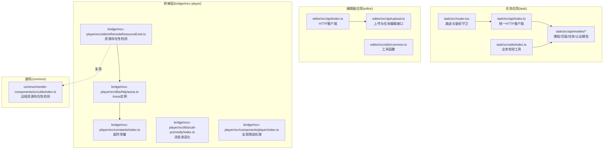
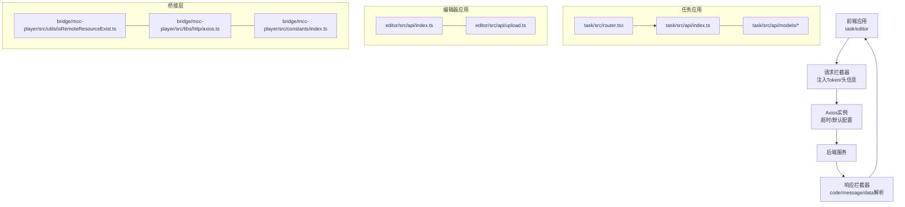
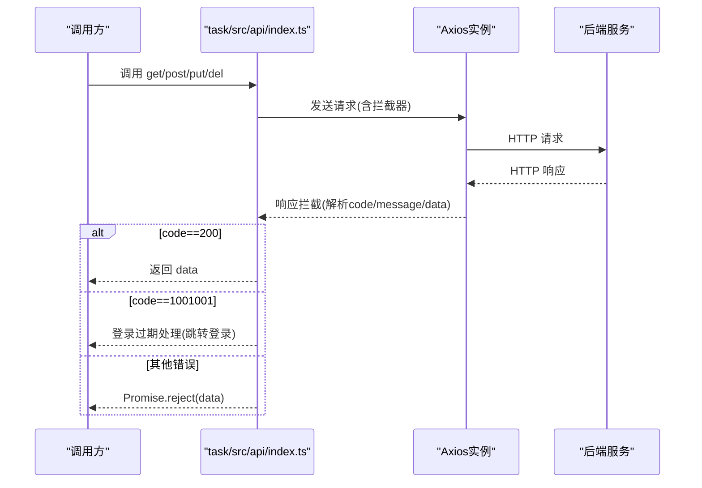
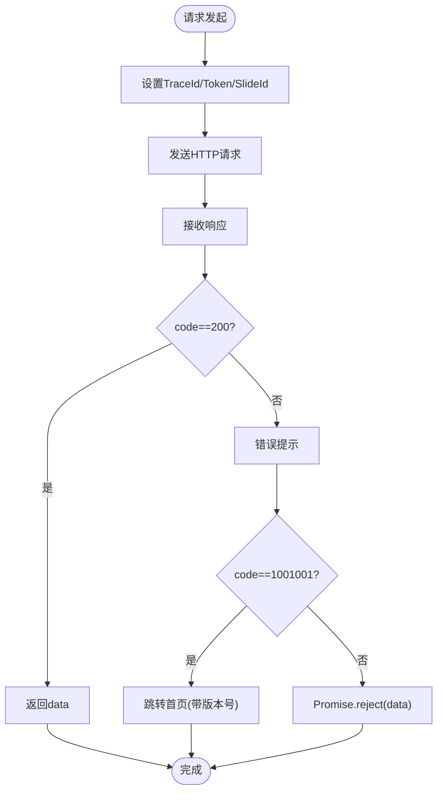
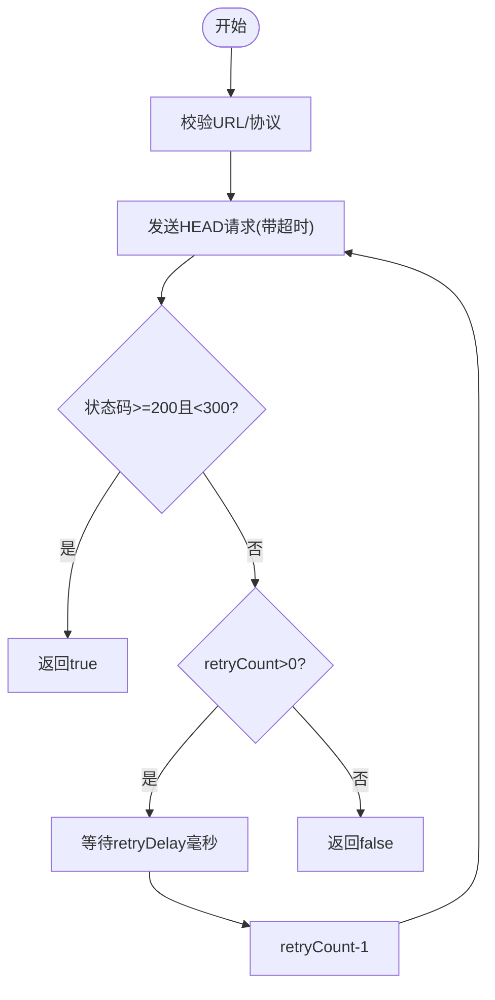
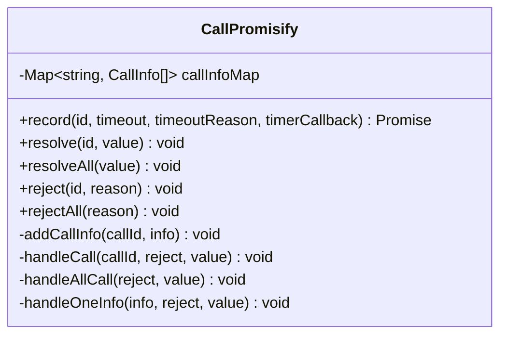
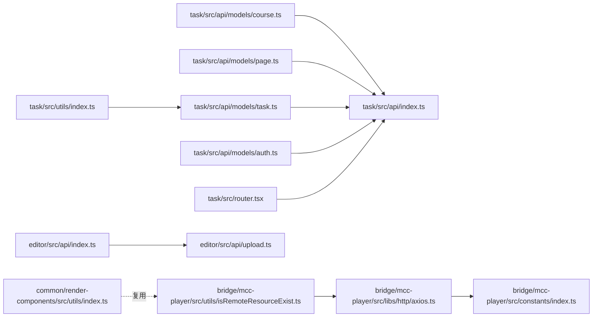
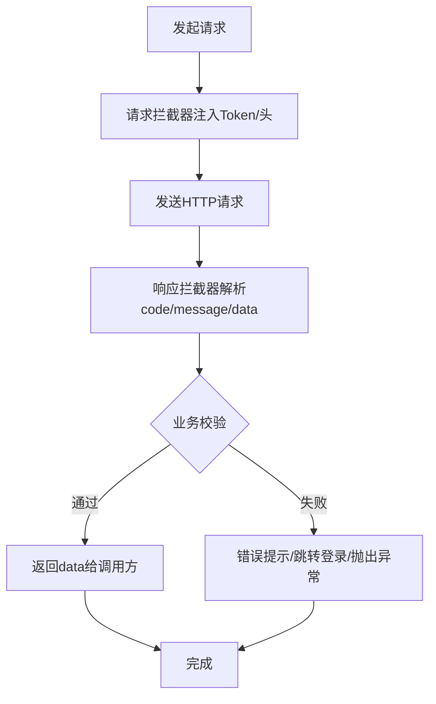

# API 接口集成

<cite>
**本文引用的文件**
- [task/src/api/index.ts](file://task/src/api/index.ts)
- [task/src/api/models/course.ts](file://task/src/api/models/course.ts)
- [task/src/api/models/page.ts](file://task/src/api/models/page.ts)
- [task/src/api/models/task.ts](file://task/src/api/models/task.ts)
- [task/src/api/models/auth.ts](file://task/src/api/models/auth.ts)
- [task/src/store/models/types/tasks.ts](file://task/src/store/models/types/tasks.ts)
- [task/src/utils/index.ts](file://task/src/utils/index.ts)
- [editor/src/api/index.ts](file://editor/src/api/index.ts)
- [editor/src/api/upload.ts](file://editor/src/api/upload.ts)
- [common/render-components/src/utils/index.ts](file://common/render-components/src/utils/index.ts)
- [bridge/mcc-player/src/libs/http/axios.ts](file://bridge/mcc-player/src/libs/http/axios.ts)
- [bridge/mcc-player/src/constants/index.ts](file://bridge/mcc-player/src/constants/index.ts)
- [bridge/mcc-player/src/libs/call-promisify/index.ts](file://bridge/mcc-player/src/libs/call-promisify/index.ts)
- [bridge/mcc-player/src/utils/isRemoteResourceExist.ts](file://bridge/mcc-player/src/utils/isRemoteResourceExist.ts)
- [bridge/mcc-demo/src/utils/isRemoteResourceExist.ts](file://bridge/mcc-demo/src/utils/isRemoteResourceExist.ts)
- [bridge/mcc-player/src/components/player/index.ts](file://bridge/mcc-player/src/components/player/index.ts)
- [task/src/router.tsx](file://task/src/router.tsx)
- [editor/src/utils/common.ts](file://editor/src/utils/common.ts)
</cite>

## 目录
1. [简介](#简介)
2. [项目结构](#项目结构)
3. [核心组件](#核心组件)
4. [架构总览](#架构总览)
5. [详细组件分析](#详细组件分析)
6. [依赖分析](#依赖分析)
7. [性能考量](#性能考量)
8. [故障排查指南](#故障排查指南)
9. [结论](#结论)
10. [附录](#附录)

## 简介
本文件面向“API 接口集成”的开发目标，系统梳理并说明本仓库中与 API 客户端设计相关的关键模块：请求封装、错误处理、重试机制、缓存策略、数据模型与类型校验、请求生命周期管理（拦截器、状态码处理、异常捕获）、以及最佳实践与测试方法。文档覆盖课程、页面、任务、用户等接口的定义与使用，并给出可操作的流程图与时序图帮助理解。

## 项目结构
围绕 API 集成的相关代码主要分布在以下位置：
- 任务侧（task）：统一的 HTTP 客户端、业务模型（课程/页面/任务/认证）、路由守卫与鉴权逻辑
- 编辑器侧（editor）：HTTP 客户端、上传与资源相关接口
- 桥接层（bridge/mcc-player）：跨平台/跨环境的 HTTP 客户端、超时常量、消息调用承诺化、资源存在性检测
- 通用组件（common/render-components）：远程资源存在性检测工具（复用）

图表来源
- [task/src/api/index.ts:1-90](file://task/src/api/index.ts#L1-L90)
- [task/src/api/models/course.ts:1-119](file://task/src/api/models/course.ts#L1-L119)
- [task/src/api/models/page.ts:1-54](file://task/src/api/models/page.ts#L1-L54)
- [task/src/api/models/task.ts:1-48](file://task/src/api/models/task.ts#L1-L48)
- [task/src/api/models/auth.ts:1-39](file://task/src/api/models/auth.ts#L1-L39)
- [task/src/router.tsx:1-72](file://task/src/router.tsx#L1-L72)
- [task/src/utils/index.ts:1-22](file://task/src/utils/index.ts#L1-L22)
- [editor/src/api/index.ts:1-111](file://editor/src/api/index.ts#L1-L111)
- [editor/src/api/upload.ts:93-130](file://editor/src/api/upload.ts#L93-L130)
- [bridge/mcc-player/src/libs/http/axios.ts:1-6](file://bridge/mcc-player/src/libs/http/axios.ts#L1-L6)
- [bridge/mcc-player/src/constants/index.ts:1-5](file://bridge/mcc-player/src/constants/index.ts#L1-L5)
- [bridge/mcc-player/src/libs/call-promisify/index.ts:1-79](file://bridge/mcc-player/src/libs/call-promisify/index.ts#L1-L79)
- [bridge/mcc-player/src/utils/isRemoteResourceExist.ts:1-39](file://bridge/mcc-player/src/utils/isRemoteResourceExist.ts#L1-L39)
- [common/render-components/src/utils/index.ts:115-157](file://common/render-components/src/utils/index.ts#L115-L157)

章节来源
- [task/src/api/index.ts:1-90](file://task/src/api/index.ts#L1-L90)
- [task/src/api/models/course.ts:1-119](file://task/src/api/models/course.ts#L1-L119)
- [task/src/api/models/page.ts:1-54](file://task/src/api/models/page.ts#L1-L54)
- [task/src/api/models/task.ts:1-48](file://task/src/api/models/task.ts#L1-L48)
- [task/src/api/models/auth.ts:1-39](file://task/src/api/models/auth.ts#L1-L39)
- [task/src/router.tsx:1-72](file://task/src/router.tsx#L1-L72)
- [task/src/utils/index.ts:1-22](file://task/src/utils/index.ts#L1-L22)
- [editor/src/api/index.ts:1-111](file://editor/src/api/index.ts#L1-L111)
- [editor/src/api/upload.ts:93-130](file://editor/src/api/upload.ts#L93-L130)
- [bridge/mcc-player/src/libs/http/axios.ts:1-6](file://bridge/mcc-player/src/libs/http/axios.ts#L1-L6)
- [bridge/mcc-player/src/constants/index.ts:1-5](file://bridge/mcc-player/src/constants/index.ts#L1-L5)
- [bridge/mcc-player/src/libs/call-promisify/index.ts:1-79](file://bridge/mcc-player/src/libs/call-promisify/index.ts#L1-L79)
- [bridge/mcc-player/src/utils/isRemoteResourceExist.ts:1-39](file://bridge/mcc-player/src/utils/isRemoteResourceExist.ts#L1-L39)
- [common/render-components/src/utils/index.ts:115-157](file://common/render-components/src/utils/index.ts#L115-L157)

## 核心组件
- 统一 HTTP 客户端
  - 任务应用：基于 axios 的请求实例，内置请求/响应拦截器，统一封装 GET/POST/PUT/DELETE 方法，支持 Token 注入与登录态失效处理
  - 编辑器应用：独立 axios 实例，设置 trace_id、Token、SlideId 等头信息，统一响应处理
  - 桥接层：独立 axios 实例，统一超时时间常量
- 数据模型与类型
  - 课程/页面/任务/认证等接口参数与返回值均以 TypeScript 接口定义，便于类型推断与静态校验
  - 任务类型定义中包含基础字段、奖励扩展字段、表单配置等
- 错误处理与生命周期
  - 请求拦截：注入 Token、过滤特殊路径、设置通用头
  - 响应拦截：解析 code/message/data，处理登录过期、错误提示、异常透传
  - 全局错误捕获：桥接层对 window error/unhandledrejection 进行日志记录
- 重试机制
  - 远程资源存在性检测提供重试次数与延迟参数，支持本地与远程协议差异
- 路由与鉴权
  - 任务应用路由守卫结合鉴权接口与 Token 管理，实现受保护页面访问

章节来源
- [task/src/api/index.ts:1-90](file://task/src/api/index.ts#L1-L90)
- [editor/src/api/index.ts:1-111](file://editor/src/api/index.ts#L1-L111)
- [bridge/mcc-player/src/libs/http/axios.ts:1-6](file://bridge/mcc-player/src/libs/http/axios.ts#L1-L6)
- [bridge/mcc-player/src/constants/index.ts:1-5](file://bridge/mcc-player/src/constants/index.ts#L1-L5)
- [task/src/store/models/types/tasks.ts:1-235](file://task/src/store/models/types/tasks.ts#L1-L235)
- [bridge/mcc-player/src/components/player/index.ts:239-283](file://bridge/mcc-player/src/components/player/index.ts#L239-L283)

## 架构总览
下图展示 API 客户端在不同应用中的角色与交互：

图表来源
- [task/src/api/index.ts:1-90](file://task/src/api/index.ts#L1-L90)
- [task/src/api/models/course.ts:1-119](file://task/src/api/models/course.ts#L1-L119)
- [task/src/api/models/page.ts:1-54](file://task/src/api/models/page.ts#L1-L54)
- [task/src/api/models/task.ts:1-48](file://task/src/api/models/task.ts#L1-L48)
- [task/src/api/models/auth.ts:1-39](file://task/src/api/models/auth.ts#L1-L39)
- [task/src/router.tsx:1-72](file://task/src/router.tsx#L1-L72)
- [editor/src/api/index.ts:1-111](file://editor/src/api/index.ts#L1-L111)
- [editor/src/api/upload.ts:93-130](file://editor/src/api/upload.ts#L93-L130)
- [bridge/mcc-player/src/libs/http/axios.ts:1-6](file://bridge/mcc-player/src/libs/http/axios.ts#L1-L6)
- [bridge/mcc-player/src/constants/index.ts:1-5](file://bridge/mcc-player/src/constants/index.ts#L1-L5)
- [bridge/mcc-player/src/utils/isRemoteResourceExist.ts:1-39](file://bridge/mcc-player/src/utils/isRemoteResourceExist.ts#L1-L39)

## 详细组件分析

### 统一 HTTP 客户端（任务应用）
- 设计要点
  - 请求拦截：对非登录接口注入 Token；对登录接口清理 systemToken 头
  - 响应拦截：按 code 分支处理，200 成功透传 data，1001001 触发登录态失效处理，其他错误统一弹窗提示并拒绝 Promise
  - 方法封装：get/post/put/del 统一签名，支持泛型返回类型
- 生命周期
  - 请求阶段：注入 Token、设置头、合并配置
  - 响应阶段：状态码 200 校验、业务 code 校验、错误提示、异常透传
- 异常捕获
  - 对网络错误与业务错误分别处理，保证上层调用稳定

图表来源
- [task/src/api/index.ts:11-67](file://task/src/api/index.ts#L11-L67)

章节来源
- [task/src/api/index.ts:1-90](file://task/src/api/index.ts#L1-L90)

### 统一 HTTP 客户端（编辑器应用）
- 设计要点
  - 初始化时设置超时、Content-Type、Online_trace_id、Token、SlideId
  - 响应拦截：非 200 统一错误提示，1001001 跳转到带版本号的首页
- 适用场景
  - 编辑器侧需要更强的上下文头（trace_id、SlideId）与更长超时

图表来源
- [editor/src/api/index.ts:39-84](file://editor/src/api/index.ts#L39-L84)

章节来源
- [editor/src/api/index.ts:1-111](file://editor/src/api/index.ts#L1-L111)

### 桥接层 HTTP 客户端与超时常量
- Axios 实例：统一超时时间来自常量文件
- 优点：集中管理超时，避免硬编码

章节来源
- [bridge/mcc-player/src/libs/http/axios.ts:1-6](file://bridge/mcc-player/src/libs/http/axios.ts#L1-L6)
- [bridge/mcc-player/src/constants/index.ts:1-5](file://bridge/mcc-player/src/constants/index.ts#L1-L5)

### 远程资源存在性检测（重试机制）
- 功能：通过 HEAD 请求判断资源是否存在，支持重试次数与延迟、超时控制
- 协议差异：本地 file 协议与远程 http/https 协议的状态码范围不同
- 复用：桥接层与通用组件均提供类似实现，便于跨项目使用

图表来源
- [bridge/mcc-player/src/utils/isRemoteResourceExist.ts:16-39](file://bridge/mcc-player/src/utils/isRemoteResourceExist.ts#L16-L39)
- [common/render-components/src/utils/index.ts:129-157](file://common/render-components/src/utils/index.ts#L129-L157)

章节来源
- [bridge/mcc-player/src/utils/isRemoteResourceExist.ts:1-39](file://bridge/mcc-player/src/utils/isRemoteResourceExist.ts#L1-39)
- [bridge/mcc-demo/src/utils/isRemoteResourceExist.ts:1-39](file://bridge/mcc-demo/src/utils/isRemoteResourceExist.ts#L1-L39)
- [common/render-components/src/utils/index.ts:115-157](file://common/render-components/src/utils/index.ts#L115-L157)

### 消息承诺化（CallPromisify）
- 作用：为跨线程/跨进程的消息通信提供超时控制与批量解决/拒绝能力
- 关键点：按 callId 维护多个回调，统一超时触发与清理

图表来源
- [bridge/mcc-player/src/libs/call-promisify/index.ts:1-79](file://bridge/mcc-player/src/libs/call-promisify/index.ts#L1-L79)

章节来源
- [bridge/mcc-player/src/libs/call-promisify/index.ts:1-79](file://bridge/mcc-player/src/libs/call-promisify/index.ts#L1-L79)

### 全局错误处理（Player）
- 捕获 window error 与 unhandledrejection，统一记录日志，便于定位运行时异常

章节来源
- [bridge/mcc-player/src/components/player/index.ts:239-283](file://bridge/mcc-player/src/components/player/index.ts#L239-L283)

### 课程 API
- 接口概览
  - 获取学校列表、年份列表
  - 产品属性筛选、产品列表分页查询
  - 课件绑定信息、课次详情、新增课程信息
- 关键参数与返回
  - 筛选参数：searchType/year/productType/seasonId/gradeId/subjectId/categoryId/schoolCode/auditStatus/status/sign
  - 列表参数：cityId/pageNo/pageSize/...（部分可选）
  - 返回结构：records/current/size/total 或绑定信息数组、课次详情对象
- 类型定义
  - FilterParams、ProductListResponse、CourseListItem、CourseListResponse、SlideDetailResponse、CourseDetailResponse、AddCourseParams

章节来源
- [task/src/api/models/course.ts:1-119](file://task/src/api/models/course.ts#L1-L119)

### 页面 API
- 接口概览
  - 创建课件、获取课件列表、发布/取消发布、绑定课件
- 关键参数与返回
  - 创建：无参或按需传入
  - 查询：slideId 作为路径参数
  - 发布/取消：slideId 作为路径参数
  - 绑定：mainId/serialNumber/slideId/slideTitle

章节来源
- [task/src/api/models/page.ts:1-54](file://task/src/api/models/page.ts#L1-L54)

### 任务 API
- 接口概览
  - 保存任务、新增任务、获取任务列表、获取全部任务、按元素删除任务
- 关键参数与返回
  - 保存：slideId/pageId/courseTaskList
  - 新增：slideId/pageId/courseTaskList（不含 sortIndex）
  - 查询：pageId 或 slideId+taskType
  - 删除：pageId+elementId
- 类型定义
  - TaskParams（含 BaseTaskKey 与奖励扩展）、SaveParams、AddTaskParams
  - 业务校验：checkTaskData 校验游戏页任务生成情况

章节来源
- [task/src/api/models/task.ts:1-48](file://task/src/api/models/task.ts#L1-L48)
- [task/src/store/models/types/tasks.ts:1-235](file://task/src/store/models/types/tasks.ts#L1-L235)
- [task/src/utils/index.ts:1-22](file://task/src/utils/index.ts#L1-L22)

### 用户/认证 API
- 接口概览
  - 登录、检查登录、获取系统版本、设置系统版本
- 关键参数与返回
  - 登录/检查：systemToken
  - 版本：systemName（作为路径参数），Token 头部传递

章节来源
- [task/src/api/models/auth.ts:1-39](file://task/src/api/models/auth.ts#L1-L39)

### 编辑器上传与任务编辑
- 接口概览
  - 任务编辑（带重试封装）、任务删除、资源关系删除
- 关键参数与返回
  - editTask：slideId/pageId/elementId/courseTaskList
  - removeTask：pageId/elementId
  - removeResourceRelation：按需传参

章节来源
- [editor/src/api/upload.ts:93-130](file://editor/src/api/upload.ts#L93-L130)

### 路由与鉴权
- 设计要点
  - 使用 React Router 的私有路由包装，结合鉴权接口与 Token 管理
  - 登录态失效时跳转登录页
- 适用场景
  - 保护任务主页面、预览页面等受控资源

章节来源
- [task/src/router.tsx:1-72](file://task/src/router.tsx#L1-L72)

## 依赖分析
- 组件耦合
  - 业务模型（models）依赖统一 HTTP 客户端
  - 路由守卫依赖鉴权接口与 Token 工具
  - 桥接层工具（资源存在性检测、消息承诺化）被多模块复用
- 外部依赖
  - axios、antd（消息提示）、uuid（trace_id 生成）
- 潜在风险
  - 多处 HTTP 客户端可能造成配置不一致，建议收敛至单一实例或严格规范

图表来源
- [task/src/api/models/course.ts:1-119](file://task/src/api/models/course.ts#L1-L119)
- [task/src/api/models/page.ts:1-54](file://task/src/api/models/page.ts#L1-L54)
- [task/src/api/models/task.ts:1-48](file://task/src/api/models/task.ts#L1-L48)
- [task/src/api/models/auth.ts:1-39](file://task/src/api/models/auth.ts#L1-L39)
- [task/src/router.tsx:1-72](file://task/src/router.tsx#L1-L72)
- [task/src/utils/index.ts:1-22](file://task/src/utils/index.ts#L1-L22)
- [editor/src/api/index.ts:1-111](file://editor/src/api/index.ts#L1-L111)
- [editor/src/api/upload.ts:93-130](file://editor/src/api/upload.ts#L93-L130)
- [bridge/mcc-player/src/libs/http/axios.ts:1-6](file://bridge/mcc-player/src/libs/http/axios.ts#L1-L6)
- [bridge/mcc-player/src/constants/index.ts:1-5](file://bridge/mcc-player/src/constants/index.ts#L1-L5)
- [bridge/mcc-player/src/utils/isRemoteResourceExist.ts:1-39](file://bridge/mcc-player/src/utils/isRemoteResourceExist.ts#L1-L39)
- [common/render-components/src/utils/index.ts:115-157](file://common/render-components/src/utils/index.ts#L115-L157)

## 性能考量
- 超时与并发
  - 合理设置超时时间，避免阻塞 UI；对长耗时操作采用分批或后台任务
- 缓存策略
  - 对只读列表/字典类数据（如学校/年份/产品属性）启用内存缓存与失效策略
- 重试与退避
  - 对瞬时网络波动使用指数退避重试，避免雪崩效应
- 请求合并
  - 将多次小请求合并为批量请求，减少往返次数
- 传输优化
  - 压缩与分片上传，结合进度反馈

## 故障排查指南
- 登录态失效
  - 现象：响应 code=1001001，弹窗提示并跳转登录
  - 处理：清除本地 Token，跳转登录页
- 网络错误
  - 现象：请求失败弹窗，错误信息透传
  - 处理：检查网络、代理、证书；必要时增加重试
- 资源不存在
  - 现象：HEAD 请求失败或状态码不在 2xx
  - 处理：使用 isRemoteResourceExist 带重试检测，确认资源路径与权限
- 全局异常
  - 现象：控制台报错或 Promise 拒绝未捕获
  - 处理：启用桥接层全局错误监听，记录堆栈并定位来源

章节来源
- [task/src/api/index.ts:36-67](file://task/src/api/index.ts#L36-L67)
- [editor/src/api/index.ts:58-84](file://editor/src/api/index.ts#L58-L84)
- [bridge/mcc-player/src/components/player/index.ts:239-283](file://bridge/mcc-player/src/components/player/index.ts#L239-L283)
- [bridge/mcc-player/src/utils/isRemoteResourceExist.ts:16-39](file://bridge/mcc-player/src/utils/isRemoteResourceExist.ts#L16-L39)

## 结论
本仓库在 API 集成方面形成了较为完善的客户端体系：统一的 HTTP 客户端、严格的请求/响应拦截、清晰的业务模型与类型定义、可复用的资源检测与消息承诺化工具，以及路由级鉴权保障。建议进一步收敛多实例配置、引入统一缓存与重试策略，并完善接口契约与自动化测试，以提升稳定性与可维护性。

## 附录

### API 请求生命周期（概念示意）

### 最佳实践清单
- 统一入口：仅通过 models 层暴露接口，避免直接使用 axios
- 类型驱动：接口参数与返回值均使用 TS 接口，配合编译期校验
- 错误分级：区分网络错误与业务错误，分别处理
- 超时与重试：为关键接口设置合理超时与指数退避重试
- 缓存策略：对只读数据启用 LRU/ETag 缓存
- 日志与监控：统一错误上报与埋点，便于追踪
- 测试：为关键接口编写单元测试与集成测试，覆盖正常/异常分支