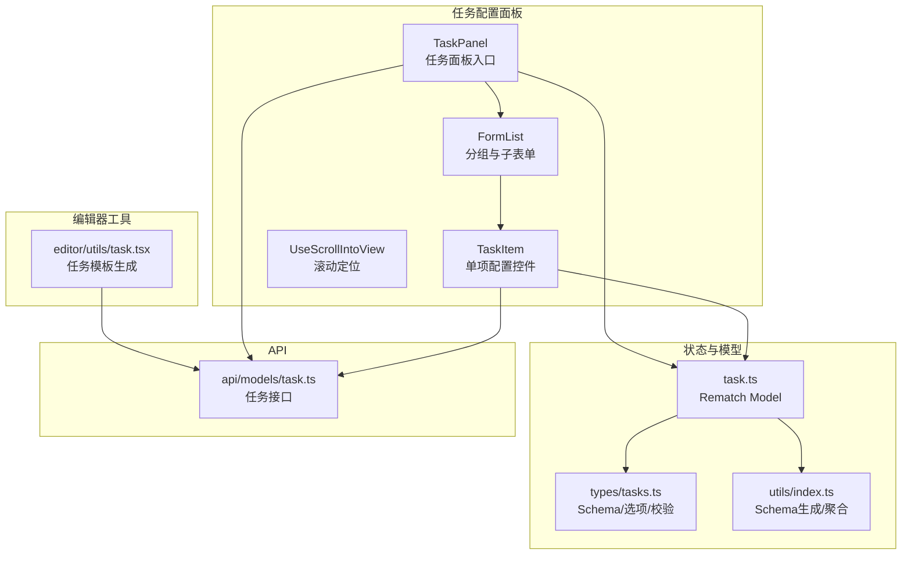
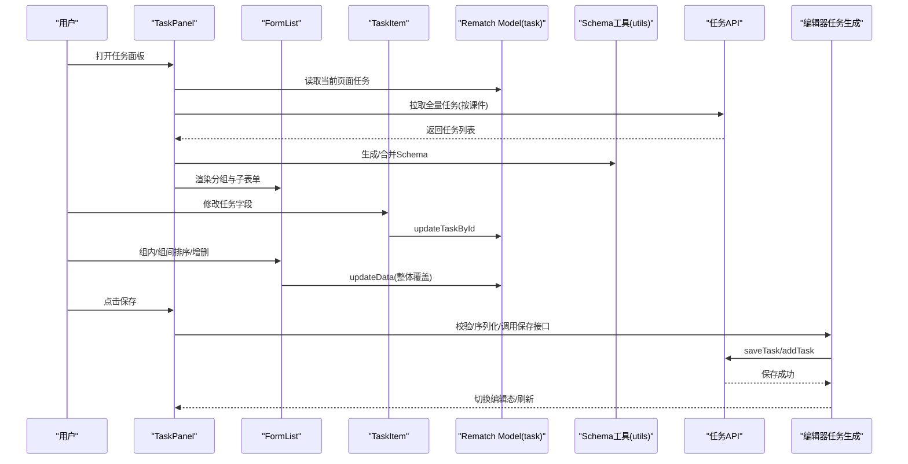
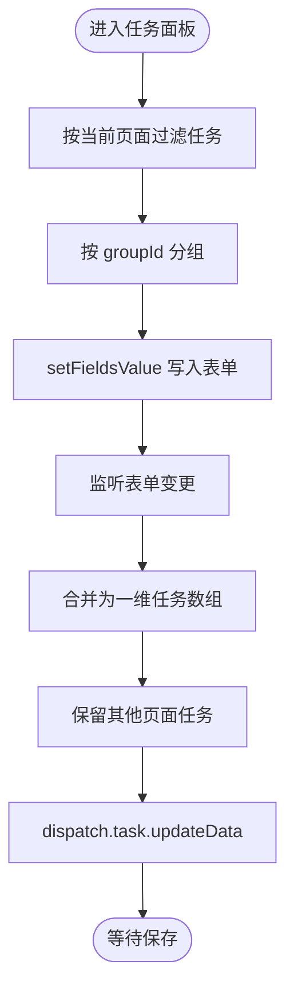
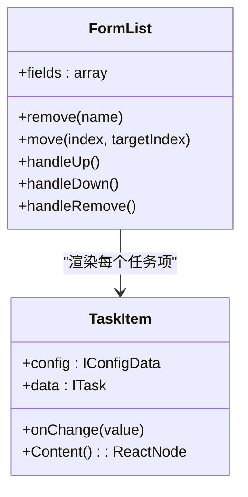
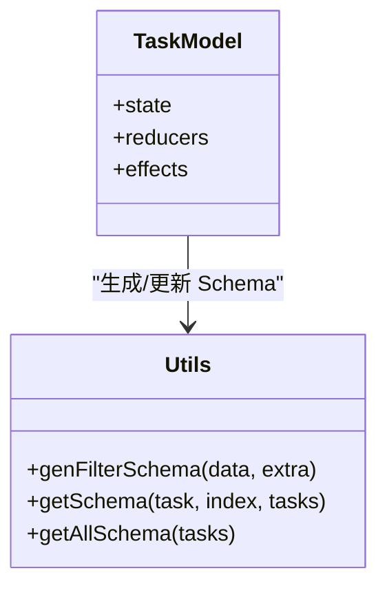
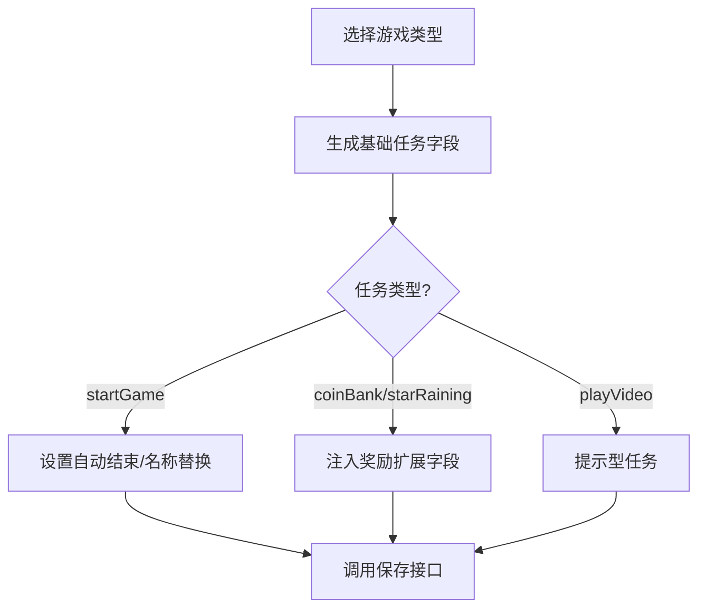
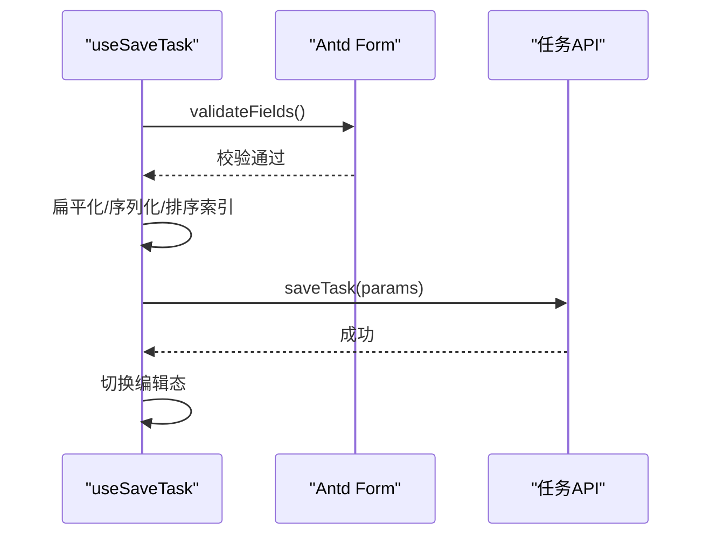
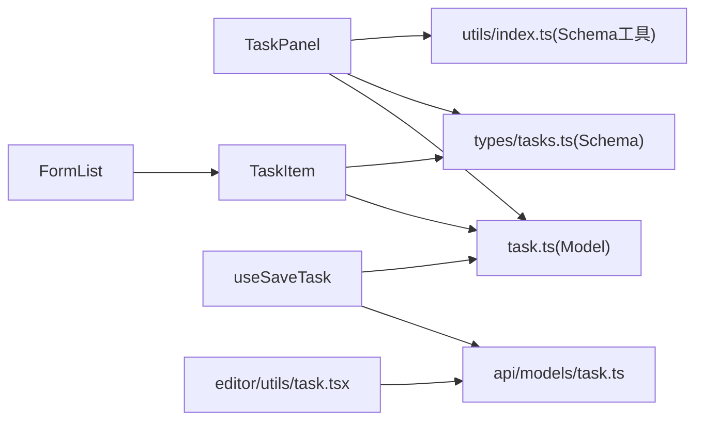

# 任务编排

<cite>
**本文引用的文件**
- [task/src/pages/Main/configPanel/TaskPanel/index.tsx](file://task/src/pages/Main/configPanel/TaskPanel/index.tsx)
- [task/src/pages/Main/configPanel/TaskPanel/component/FormList.tsx](file://task/src/pages/Main/configPanel/TaskPanel/component/FormList.tsx)
- [task/src/pages/Main/configPanel/TaskPanel/component/TaskItem.tsx](file://task/src/pages/Main/configPanel/TaskPanel/component/TaskItem.tsx)
- [task/src/pages/Main/configPanel/TaskPanel/component/UseScrollIntoView.tsx](file://task/src/pages/Main/configPanel/TaskPanel/component/UseScrollIntoView.tsx)
- [task/src/store/models/task.ts](file://task/src/store/models/task.ts)
- [task/src/store/models/types/tasks.ts](file://task/src/store/models/types/tasks.ts)
- [task/src/store/utils/index.ts](file://task/src/store/utils/index.ts)
- [task/src/api/models/task.ts](file://task/src/api/models/task.ts)
- [task/src/hooks/useSaveTask.tsx](file://task/src/hooks/useSaveTask.tsx)
- [editor/src/utils/task.tsx](file://editor/src/utils/task.tsx)
</cite>

## 目录
1. [简介](#简介)
2. [项目结构](#项目结构)
3. [核心组件](#核心组件)
4. [架构总览](#架构总览)
5. [详细组件分析](#详细组件分析)
6. [依赖关系分析](#依赖关系分析)
7. [性能考量](#性能考量)
8. [故障排查指南](#故障排查指南)
9. [结论](#结论)
10. [附录](#附录)

## 简介
本技术文档围绕“任务编排系统”展开，聚焦于任务配置面板的设计与实现，涵盖任务列表展示、任务项编辑、拖拽排序、任务数据模型、业务逻辑（任务链顺序、并行/条件分支）、状态管理与持久化、API 接口定义以及实际应用与最佳实践。文档以仓库中的任务模块为核心，结合编辑器侧的任务生成工具，形成从“可视化配置到服务端持久化”的完整闭环。

## 项目结构
任务编排系统主要分布在以下模块：
- 任务配置面板：基于 Ant Design 表单与 Redux Rematch 的可视化配置界面，支持分组任务的增删改与排序。
- 任务状态与模型：通过 Rematch Model 管理任务列表、表单 Schema、奖励参数范围等。
- 任务工具与生成：编辑器侧提供多种任务模板生成方法，用于一键注入典型任务链。
- API 层：封装任务的新增、保存、查询、删除等接口。

图表来源
- [task/src/pages/Main/configPanel/TaskPanel/index.tsx:1-61](file://task/src/pages/Main/configPanel/TaskPanel/index.tsx#L1-L61)
- [task/src/pages/Main/configPanel/TaskPanel/component/FormList.tsx:1-112](file://task/src/pages/Main/configPanel/TaskPanel/component/FormList.tsx#L1-L112)
- [task/src/pages/Main/configPanel/TaskPanel/component/TaskItem.tsx:1-133](file://task/src/pages/Main/configPanel/TaskPanel/component/TaskItem.tsx#L1-L133)
- [task/src/store/models/task.ts:1-130](file://task/src/store/models/task.ts#L1-L130)
- [task/src/store/models/types/tasks.ts:1-235](file://task/src/store/models/types/tasks.ts#L1-L235)
- [task/src/store/utils/index.ts:1-140](file://task/src/store/utils/index.ts#L1-L140)
- [task/src/api/models/task.ts:1-48](file://task/src/api/models/task.ts#L1-L48)
- [editor/src/utils/task.tsx:1-410](file://editor/src/utils/task.tsx#L1-L410)

章节来源
- [task/src/pages/Main/configPanel/TaskPanel/index.tsx:1-61](file://task/src/pages/Main/configPanel/TaskPanel/index.tsx#L1-L61)
- [task/src/store/models/task.ts:1-130](file://task/src/store/models/task.ts#L1-L130)
- [task/src/store/models/types/tasks.ts:1-235](file://task/src/store/models/types/tasks.ts#L1-L235)
- [task/src/store/utils/index.ts:1-140](file://task/src/store/utils/index.ts#L1-L140)
- [task/src/api/models/task.ts:1-48](file://task/src/api/models/task.ts#L1-L48)
- [task/src/pages/Main/configPanel/TaskPanel/component/FormList.tsx:1-112](file://task/src/pages/Main/configPanel/TaskPanel/component/FormList.tsx#L1-L112)
- [task/src/pages/Main/configPanel/TaskPanel/component/TaskItem.tsx:1-133](file://task/src/pages/Main/configPanel/TaskPanel/component/TaskItem.tsx#L1-L133)
- [task/src/pages/Main/configPanel/TaskPanel/component/UseScrollIntoView.tsx:1-13](file://task/src/pages/Main/configPanel/TaskPanel/component/UseScrollIntoView.tsx#L1-L13)
- [editor/src/utils/task.tsx:1-410](file://editor/src/utils/task.tsx#L1-L410)

## 核心组件
- 任务面板入口：负责按页面维度筛选任务、初始化表单、拉取全量任务并写入状态、监听表单变更回写任务。
- 表单列表：按分组渲染任务集合，提供组间上下移动、组内任务增删、滚动定位当前任务。
- 任务项控件：根据 Schema 动态渲染输入框、单选、滑条等控件；支持只读模式与可编辑模式切换。
- Rematch Model：集中管理任务列表、Schema、奖励区间、当前任务定位、按钮可编辑标记等。
- Schema 工具：按任务类型动态生成表单 Schema，并注入奖励/额外字段与可编辑开关。
- 编辑器任务生成：提供多种游戏/视频任务模板，自动生成标准任务链并写入服务端。
- 保存钩子：统一校验任务数据、序列化为服务端格式、调用保存接口并切换编辑态。

章节来源
- [task/src/pages/Main/configPanel/TaskPanel/index.tsx:1-61](file://task/src/pages/Main/configPanel/TaskPanel/index.tsx#L1-L61)
- [task/src/pages/Main/configPanel/TaskPanel/component/FormList.tsx:1-112](file://task/src/pages/Main/configPanel/TaskPanel/component/FormList.tsx#L1-L112)
- [task/src/pages/Main/configPanel/TaskPanel/component/TaskItem.tsx:1-133](file://task/src/pages/Main/configPanel/TaskPanel/component/TaskItem.tsx#L1-L133)
- [task/src/store/models/task.ts:1-130](file://task/src/store/models/task.ts#L1-L130)
- [task/src/store/models/types/tasks.ts:1-235](file://task/src/store/models/types/tasks.ts#L1-L235)
- [task/src/store/utils/index.ts:1-140](file://task/src/store/utils/index.ts#L1-L140)
- [task/src/hooks/useSaveTask.tsx:1-90](file://task/src/hooks/useSaveTask.tsx#L1-L90)
- [editor/src/utils/task.tsx:1-410](file://editor/src/utils/task.tsx#L1-L410)

## 架构总览
任务编排系统采用“配置面板 + 状态模型 + Schema 工具 + API 接口”的分层设计。配置面板通过 Ant Design 表单收集用户输入，Rematch Model 负责状态聚合与副作用（effects），Schema 工具根据任务类型动态生成表单项，编辑器工具负责模板生成，最终通过 API 将任务持久化到服务端。

图表来源
- [task/src/pages/Main/configPanel/TaskPanel/index.tsx:1-61](file://task/src/pages/Main/configPanel/TaskPanel/index.tsx#L1-L61)
- [task/src/pages/Main/configPanel/TaskPanel/component/FormList.tsx:1-112](file://task/src/pages/Main/configPanel/TaskPanel/component/FormList.tsx#L1-L112)
- [task/src/pages/Main/configPanel/TaskPanel/component/TaskItem.tsx:1-133](file://task/src/pages/Main/configPanel/TaskPanel/component/TaskItem.tsx#L1-L133)
- [task/src/store/models/task.ts:1-130](file://task/src/store/models/task.ts#L1-L130)
- [task/src/store/utils/index.ts:1-140](file://task/src/store/utils/index.ts#L1-L140)
- [task/src/api/models/task.ts:1-48](file://task/src/api/models/task.ts#L1-L48)
- [editor/src/utils/task.tsx:1-410](file://editor/src/utils/task.tsx#L1-L410)

## 详细组件分析

### 任务配置面板（TaskPanel）
- 职责：按当前页面过滤任务、初始化表单、设置分组值、监听表单变更回写任务、拉取全量任务。
- 关键点：
  - 使用 useMemo 按 pageId 过滤当前页面任务。
  - 使用 form.setFieldsValue 将任务按 groupId 分组写入表单。
  - onValuesChange 回写任务：将表单 tasks 合并为一维数组，与其他页面任务合并后写入全局状态。
  - 首次进入页面时拉取课件级任务并生成 Schema。

图表来源
- [task/src/pages/Main/configPanel/TaskPanel/index.tsx:17-45](file://task/src/pages/Main/configPanel/TaskPanel/index.tsx#L17-L45)

章节来源
- [task/src/pages/Main/configPanel/TaskPanel/index.tsx:1-61](file://task/src/pages/Main/configPanel/TaskPanel/index.tsx#L1-L61)

### 表单列表（FormList）与任务项（TaskItem）
- 表单列表：
  - 支持组间上下移动、组内增删。
  - 通过 move/remove 控制顺序与数量。
  - 根据当前页面的 btnEditable 控制是否允许编辑。
- 任务项：
  - 根据 Schema 的 type 动态渲染控件（输入、文本域、数字、单选、滑条、台词展示）。
  - 只读模式下根据 options 显示当前值或格式化展示。
  - onChange 触发 updateTaskById 并触发表单校验。

图表来源
- [task/src/pages/Main/configPanel/TaskPanel/component/FormList.tsx:1-112](file://task/src/pages/Main/configPanel/TaskPanel/component/FormList.tsx#L1-L112)
- [task/src/pages/Main/configPanel/TaskPanel/component/TaskItem.tsx:1-133](file://task/src/pages/Main/configPanel/TaskPanel/component/TaskItem.tsx#L1-L133)

章节来源
- [task/src/pages/Main/configPanel/TaskPanel/component/FormList.tsx:1-112](file://task/src/pages/Main/configPanel/TaskPanel/component/FormList.tsx#L1-L112)
- [task/src/pages/Main/configPanel/TaskPanel/component/TaskItem.tsx:1-133](file://task/src/pages/Main/configPanel/TaskPanel/component/TaskItem.tsx#L1-L133)

### 状态模型与 Schema 工具
- Rematch Model：
  - state：维护 tasks、schema、奖励区间、当前任务定位、按钮可编辑标记。
  - reducers：updateData、updateBtnEditable、updateTaskById。
  - effects：
    - updateSchemaById：按 id+taskType 更新 Schema。
    - addSchema：按任务列表生成新 Schema 并合并。
    - addTasks：合并任务与 Schema。
    - updateTask：按 pageId 合并更新任务并重新生成 Schema。
    - getAllTaskList：拉取课件任务，拆解 taskExt 并生成 Schema。
- Schema 工具：
  - genFilterSchema：按任务已有字段与固定配置生成表单项。
  - getSchema：按 groupName 生成不同任务类型的 Schema，并设置部分字段可编辑。
  - getAllSchema：按 groupId 分组生成二维 Schema 数组。

图表来源
- [task/src/store/models/task.ts:1-130](file://task/src/store/models/task.ts#L1-L130)
- [task/src/store/utils/index.ts:1-140](file://task/src/store/utils/index.ts#L1-L140)
- [task/src/store/models/types/tasks.ts:1-235](file://task/src/store/models/types/tasks.ts#L1-L235)

章节来源
- [task/src/store/models/task.ts:1-130](file://task/src/store/models/task.ts#L1-L130)
- [task/src/store/utils/index.ts:1-140](file://task/src/store/utils/index.ts#L1-L140)
- [task/src/store/models/types/tasks.ts:1-235](file://task/src/store/models/types/tasks.ts#L1-L235)

### 编辑器任务生成（模板）
- 提供多种任务模板：
  - pkGame、normalGame、starRainingGame、workGame、playVideo。
- 模板生成逻辑：
  - 依据游戏类型生成基础字段（如倒计时、结束方式、跳过/重做、后续联动等）。
  - 针对特定任务类型（如 startGame）设置自动结束与名称替换。
  - 为红包/星雨类任务注入奖励扩展字段。
- 与服务端交互：
  - 通过 editTask/saveTask 接口写入任务列表。

图表来源
- [editor/src/utils/task.tsx:166-335](file://editor/src/utils/task.tsx#L166-L335)

章节来源
- [editor/src/utils/task.tsx:1-410](file://editor/src/utils/task.tsx#L1-L410)

### 保存流程与 API
- 保存钩子：
  - 校验表单，将嵌套结构扁平化为任务数组。
  - 按任务类型处理 taskExt（红包/星雨）与排序索引。
  - 调用保存接口，切换编辑态。
- API 定义：
  - saveTask：保存任务列表。
  - addTask：新增任务（不含 sortIndex）。
  - getTaskList：按页面获取任务。
  - getAllTaskList：按课件获取全部任务。
  - deleteTask：按元素删除任务。

图表来源
- [task/src/hooks/useSaveTask.tsx:1-90](file://task/src/hooks/useSaveTask.tsx#L1-L90)
- [task/src/api/models/task.ts:1-48](file://task/src/api/models/task.ts#L1-L48)

章节来源
- [task/src/hooks/useSaveTask.tsx:1-90](file://task/src/hooks/useSaveTask.tsx#L1-L90)
- [task/src/api/models/task.ts:1-48](file://task/src/api/models/task.ts#L1-L48)

## 依赖关系分析
- 配置面板依赖 Rematch Model 提供的状态与副作用，依赖 Schema 工具生成表单项。
- TaskItem 依赖 Schema 中的控件类型与选项，依赖 Model 的 updateTaskById 实现局部更新。
- 保存钩子依赖 API 层的 saveTask/addTask，同时依赖编辑器工具的校验函数。
- 编辑器工具与 API 层共同决定任务模板的生成与持久化。

图表来源
- [task/src/pages/Main/configPanel/TaskPanel/index.tsx:1-61](file://task/src/pages/Main/configPanel/TaskPanel/index.tsx#L1-L61)
- [task/src/pages/Main/configPanel/TaskPanel/component/TaskItem.tsx:1-133](file://task/src/pages/Main/configPanel/TaskPanel/component/TaskItem.tsx#L1-L133)
- [task/src/store/models/task.ts:1-130](file://task/src/store/models/task.ts#L1-L130)
- [task/src/store/models/types/tasks.ts:1-235](file://task/src/store/models/types/tasks.ts#L1-L235)
- [task/src/store/utils/index.ts:1-140](file://task/src/store/utils/index.ts#L1-L140)
- [task/src/hooks/useSaveTask.tsx:1-90](file://task/src/hooks/useSaveTask.tsx#L1-L90)
- [task/src/api/models/task.ts:1-48](file://task/src/api/models/task.ts#L1-L48)
- [editor/src/utils/task.tsx:1-410](file://editor/src/utils/task.tsx#L1-L410)

章节来源
- [task/src/pages/Main/configPanel/TaskPanel/index.tsx:1-61](file://task/src/pages/Main/configPanel/TaskPanel/index.tsx#L1-L61)
- [task/src/pages/Main/configPanel/TaskPanel/component/TaskItem.tsx:1-133](file://task/src/pages/Main/configPanel/TaskPanel/component/TaskItem.tsx#L1-L133)
- [task/src/store/models/task.ts:1-130](file://task/src/store/models/task.ts#L1-L130)
- [task/src/store/models/types/tasks.ts:1-235](file://task/src/store/models/types/tasks.ts#L1-L235)
- [task/src/store/utils/index.ts:1-140](file://task/src/store/utils/index.ts#L1-L140)
- [task/src/hooks/useSaveTask.tsx:1-90](file://task/src/hooks/useSaveTask.tsx#L1-L90)
- [task/src/api/models/task.ts:1-48](file://task/src/api/models/task.ts#L1-L48)
- [editor/src/utils/task.tsx:1-410](file://editor/src/utils/task.tsx#L1-L410)

## 性能考量
- 表单渲染优化：
  - 使用 memo 包裹 TaskItem 与 FormList，减少不必要的重渲染。
  - 仅在当前页面任务变化时重新计算分组与 Schema。
- 状态更新：
  - updateData 采用浅合并策略，避免深层拷贝带来的性能损耗。
  - updateTaskById 仅对匹配 id 的任务进行对象合并，降低更新成本。
- 校验与保存：
  - 校验阶段先进行表单级校验，再进行业务校验，减少无效网络请求。
  - 保存时批量序列化任务，避免多次 API 调用。

## 故障排查指南
- 表单无法编辑：
  - 检查 btnEditable 标记是否正确切换（保存成功后会反转）。
  - 确认当前页面 pageId 是否与任务中的 pageId 一致。
- 任务排序无效：
  - 确认当前页面处于可编辑态（btnEditable 为 true）。
  - 检查 move/remove 回调是否被禁用。
- 保存失败：
  - 查看错误字段提示，逐项修正。
  - 确认任务扩展字段（红包/星雨）是否按要求填充。
  - 若网络异常，可重试请求（编辑器工具提供重试函数）。
- Schema 不生效：
  - 确认任务类型与 groupName 是否匹配，确保 getSchema 生成了正确的表单项。
  - 检查 genFilterSchema 是否遗漏必要字段。

章节来源
- [task/src/pages/Main/configPanel/TaskPanel/component/FormList.tsx:22-41](file://task/src/pages/Main/configPanel/TaskPanel/component/FormList.tsx#L22-L41)
- [task/src/hooks/useSaveTask.tsx:68-82](file://task/src/hooks/useSaveTask.tsx#L68-L82)
- [task/src/store/models/task.ts:36-54](file://task/src/store/models/task.ts#L36-L54)
- [task/src/store/utils/index.ts:25-126](file://task/src/store/utils/index.ts#L25-L126)
- [editor/src/utils/task.tsx:398-410](file://editor/src/utils/task.tsx#L398-L410)

## 结论
该任务编排系统通过“配置面板 + 动态 Schema + 状态模型 + API 接口”的清晰分层，实现了任务的可视化配置、灵活编辑与稳定持久化。编辑器侧的任务模板生成进一步提升了效率与一致性。建议在复杂业务场景中继续完善条件分支与并行任务的可视化表达，并加强错误恢复与审计日志能力。

## 附录

### 任务数据模型与字段说明
- 基础字段（必填/通用）：
  - groupId、groupName、taskType、taskName、id、description、words、taskDurationSecond、countdownDisplay、endMethod、retryStatus、skipStatus、followUpLinkageType。
- 奖励扩展字段（红包/星雨等）：
  - rewardSkin、rewardPercent、coinAmount（星雨游戏）。
- 任务类型与分组：
  - pkGame、normalGame、starRainingGame、workGame、playVideo、coinBank 等。
- 选项枚举：
  - endMethod（自动/手动）、skipStatus（可/不可）、retryStatus（可/不可）、countdownDisplay（是/否）、followUpLinkageType（无/自动开启/翻页）、rewardSkin（宝箱/扭蛋）。

章节来源
- [task/src/store/models/types/tasks.ts:16-117](file://task/src/store/models/types/tasks.ts#L16-L117)
- [task/src/store/models/types/tasks.ts:136-235](file://task/src/store/models/types/tasks.ts#L136-L235)
- [editor/src/utils/task.tsx:166-335](file://editor/src/utils/task.tsx#L166-L335)

### 任务编排业务逻辑要点
- 任务链顺序：
  - 通过 sortIndex 控制任务顺序；保存时按顺序生成索引。
- 并行与条件分支：
  - 当前实现以顺序链路为主；若需并行/条件分支，可在 Schema 中引入条件字段并在运行时解析。
- 条件联动：
  - followUpLinkageType 支持“无/自动开启/翻页”，用于任务完成后自动开启下一任务或翻页。

章节来源
- [task/src/hooks/useSaveTask.tsx:54-57](file://task/src/hooks/useSaveTask.tsx#L54-L57)
- [task/src/store/models/types/tasks.ts:104-117](file://task/src/store/models/types/tasks.ts#L104-L117)

### 任务状态管理机制
- 状态字段：
  - tasks（任务列表）、schema（表单 Schema）、minRewardPercent/maxRewardPercent（奖励区间）、currentTaskId（当前任务定位）、btnEditable（页面级可编辑标记）。
- 状态转换：
  - 创建：addTasks/addSchema。
  - 编辑中：updateTaskById/updateData。
  - 已完成/失败：由保存接口与运行时结果驱动（当前代码未显式记录失败状态，建议扩展）。
- 持久化：
  - saveTask/addTask/getAllTaskList/deleteTask。

章节来源
- [task/src/store/models/task.ts:11-30](file://task/src/store/models/task.ts#L11-L30)
- [task/src/store/models/task.ts:56-128](file://task/src/store/models/task.ts#L56-L128)
- [task/src/api/models/task.ts:13-48](file://task/src/api/models/task.ts#L13-L48)

### API 接口文档
- 保存任务
  - 方法：POST
  - 路径：/classroom-slides/slides/pages/course-tasks/save
  - 参数：slideId、pageId、courseTaskList（含 sortIndex、taskExt）
- 新增任务
  - 方法：POST
  - 路径：/classroom-slides/slides/pages/course-tasks/add
  - 参数：slideId、pageId、courseTaskList（不含 sortIndex）
- 查询页面任务
  - 方法：GET
  - 路径：/classroom-slides/slides/pages/{pageId}/course-tasks
  - 参数：pageId
- 查询课件全部任务
  - 方法：GET
  - 路径：/classroom-slides/slides/pages/course-tasks
  - 参数：slideId、taskType?
- 删除任务
  - 方法：DELETE
  - 路径：/classroom-slides/slides/pages/{pageId}/course-tasks/{elementId}/delete
  - 参数：pageId、elementId

章节来源
- [task/src/api/models/task.ts:21-48](file://task/src/api/models/task.ts#L21-L48)

### 实际应用场景与最佳实践
- 场景示例：
  - PK 游戏：多步骤任务链（准备、进行、颁奖），合理设置倒计时与后续联动。
  - 星雨红包：多个红包任务共享奖励区间，使用规则校验总占比不超过上限。
  - 作品展示：两步任务链（提交/点评），点评环节手动结束并关闭任务。
- 最佳实践：
  - 使用编辑器模板快速生成标准任务链，再在面板中微调细节。
  - 严格控制奖励比例，避免超过最大阈值。
  - 保存前务必进行表单与业务双重校验，确保排序与扩展字段完整。
  - 对复杂任务（并行/条件）建议在 Schema 中增加条件字段并在运行时解析。

章节来源
- [editor/src/utils/task.tsx:166-335](file://editor/src/utils/task.tsx#L166-L335)
- [task/src/store/models/types/tasks.ts:119-134](file://task/src/store/models/types/tasks.ts#L119-L134)
- [task/src/hooks/useSaveTask.tsx:64-67](file://task/src/hooks/useSaveTask.tsx#L64-L67)