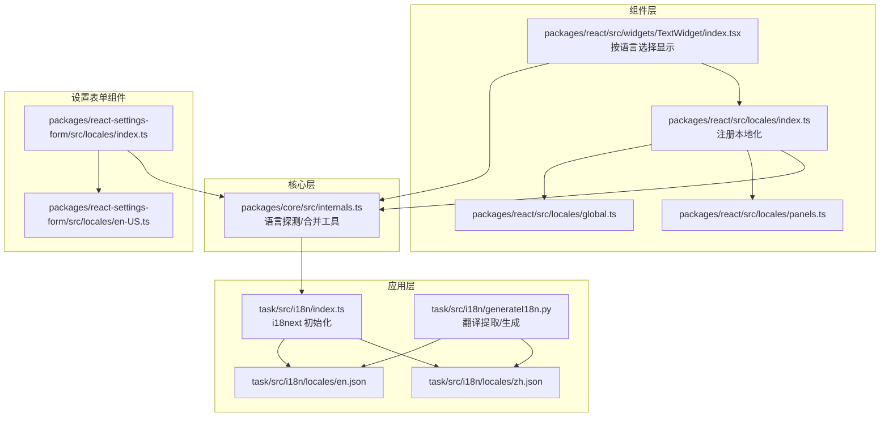
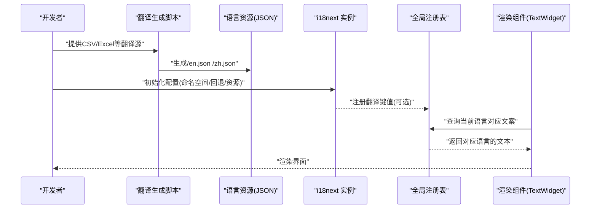
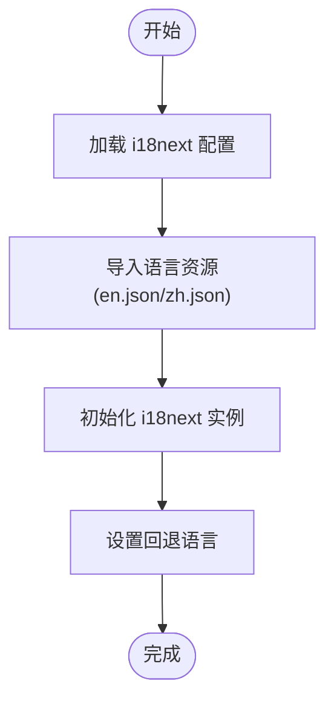
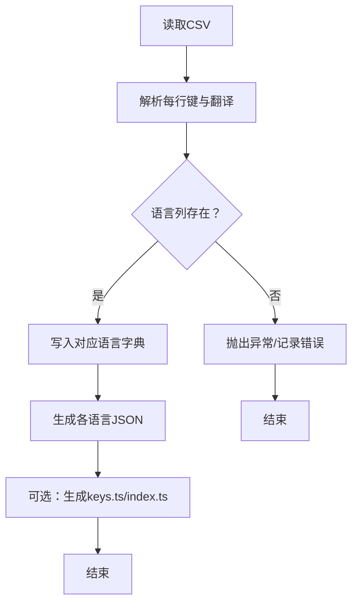
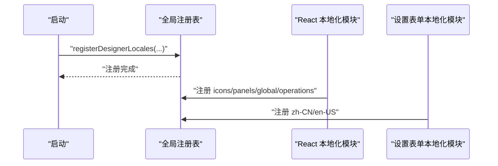
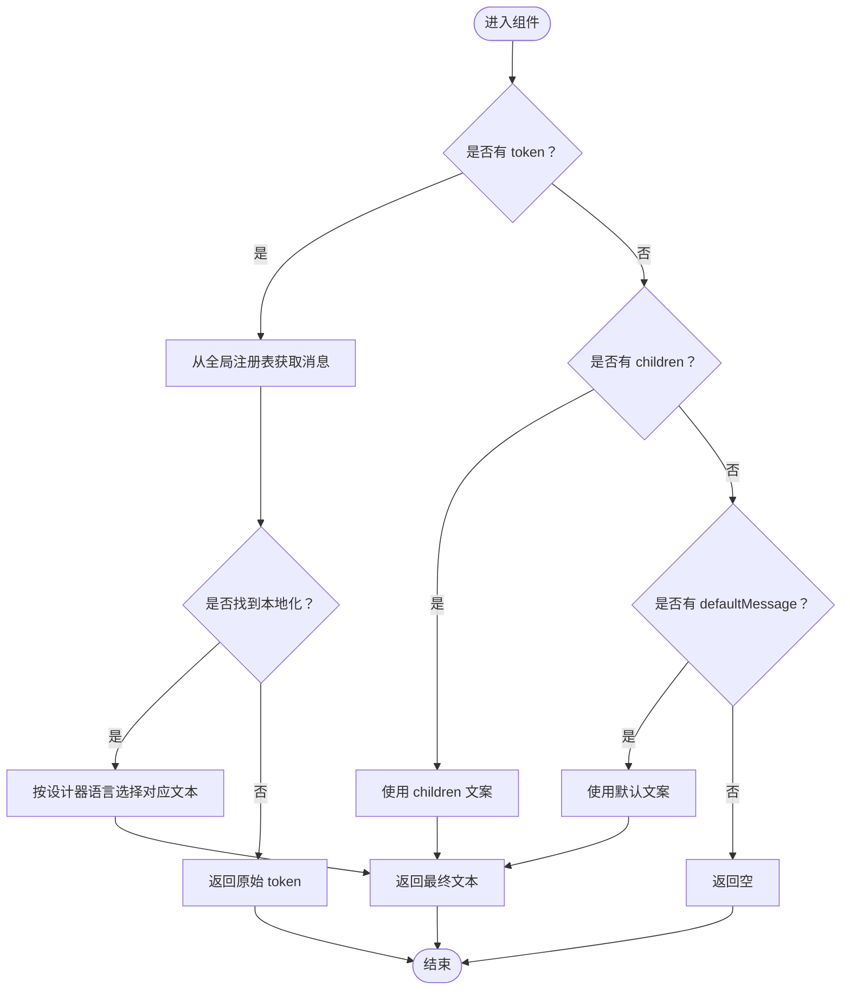
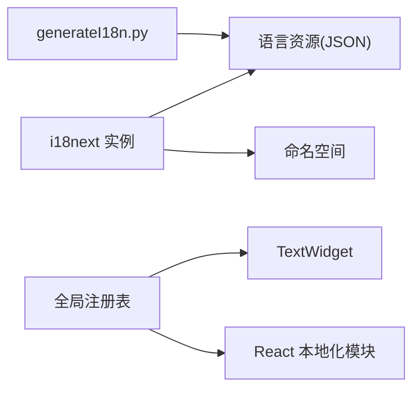

# 国际化支持

<cite>
**本文引用的文件**
- [internals.ts](file://packages/core/src/internals.ts)
- [index.ts](file://task/src/i18n/index.ts)
- [en.json](file://task/src/i18n/locales/en.json)
- [zh.json](file://task/src/i18n/locales/zh.json)
- [generateI18n.py](file://task/src/i18n/generateI18n.py)
- [index.ts（React 本地化注册）](file://packages/react/src/locales/index.ts)
- [global.ts（React 本地化）](file://packages/react/src/locales/global.ts)
- [panels.ts（React 本地化）](file://packages/react/src/locales/panels.ts)
- [index.ts（设置表单本地化注册）](file://packages/react-settings-form/src/locales/index.ts)
- [en-US.ts（设置表单本地化）](file://packages/react-settings-form/src/locales/en-US.ts)
- [TextWidget/index.tsx](file://packages/react/src/widgets/TextWidget/index.tsx)
</cite>

## 目录
1. [引言](#引言)
2. [项目结构](#项目结构)
3. [核心组件](#核心组件)
4. [架构总览](#架构总览)
5. [详细组件分析](#详细组件分析)
6. [依赖分析](#依赖分析)
7. [性能考虑](#性能考虑)
8. [故障排查指南](#故障排查指南)
9. [结论](#结论)
10. [附录](#附录)

## 引言
本文件面向国际化系统的实现与维护，覆盖以下主题：
- 多语言支持整体架构：语言包管理、动态加载、语言切换与回退策略
- i18n 文件组织：命名规范、层级关系、合并策略
- 工具链：翻译提取、格式化、自动化生成流程
- 语言切换实现：状态管理、组件重渲染、路由参数传递
- 开发最佳实践：文本提取规范、占位符使用、复数形式处理
- 测试方法与常见问题解决

## 项目结构
该仓库在多个子模块中实现了国际化能力：
- 核心层：提供通用的本地化合并与语言探测工具
- 应用层（task）：基于 i18next 的前端国际化配置与资源加载
- 组件层（packages/react）：以键值对形式的本地化数据注册到全局注册表
- 设置表单组件（packages/react-settings-form）：独立的本地化模块
- 文本渲染组件（TextWidget）：根据设计器当前语言动态选择显示文案

图表来源
- [internals.ts:1-56](file://packages/core/src/internals.ts#L1-L56)
- [index.ts:1-38](file://task/src/i18n/index.ts#L1-L38)
- [en.json:1-5](file://task/src/i18n/locales/en.json#L1-L5)
- [zh.json:1-5](file://task/src/i18n/locales/zh.json#L1-L5)
- [generateI18n.py:1-135](file://task/src/i18n/generateI18n.py#L1-L135)
- [index.ts（React 本地化注册）:1-8](file://packages/react/src/locales/index.ts#L1-L8)
- [global.ts（React 本地化）:1-17](file://packages/react/src/locales/global.ts#L1-L17)
- [panels.ts（React 本地化）:1-29](file://packages/react/src/locales/panels.ts#L1-L29)
- [index.ts（设置表单本地化注册）:1-6](file://packages/react-settings-form/src/locales/index.ts#L1-L6)
- [en-US.ts（设置表单本地化）:1-13](file://packages/react-settings-form/src/locales/en-US.ts#L1-L13)

章节来源
- [index.ts:1-38](file://task/src/i18n/index.ts#L1-L38)
- [index.ts（React 本地化注册）:1-8](file://packages/react/src/locales/index.ts#L1-L8)
- [index.ts（设置表单本地化注册）:1-6](file://packages/react-settings-form/src/locales/index.ts#L1-L6)

## 核心组件
- 语言探测与合并工具
  - 提供浏览器语言探测与本地化键名小写下划线转换
  - 提供递归合并本地化对象的能力，便于多来源合并
- i18next 配置与资源加载
  - 定义默认命名空间、回退语言、资源映射
  - 暴露翻译函数与默认实例
- React 本地化注册
  - 将各模块本地化数据注册到全局注册表，供渲染组件使用
- 文本渲染组件
  - 根据设计器当前语言从本地化字典或传入的多语言对象中选择对应文案

章节来源
- [internals.ts:1-56](file://packages/core/src/internals.ts#L1-L56)
- [index.ts:1-38](file://task/src/i18n/index.ts#L1-L38)
- [index.ts（React 本地化注册）:1-8](file://packages/react/src/locales/index.ts#L1-L8)
- [TextWidget/index.tsx:1-43](file://packages/react/src/widgets/TextWidget/index.tsx#L1-L43)

## 架构总览
整体架构由“资源层（JSON/TS）+ 配置层（i18next）+ 注册层（全局注册表）+ 渲染层（组件）”构成。资源层负责存储多语言键值；配置层负责初始化、回退与命名空间；注册层负责聚合与分发；渲染层负责最终展示。

图表来源
- [generateI18n.py:1-135](file://task/src/i18n/generateI18n.py#L1-L135)
- [index.ts:1-38](file://task/src/i18n/index.ts#L1-L38)
- [index.ts（React 本地化注册）:1-8](file://packages/react/src/locales/index.ts#L1-L8)
- [TextWidget/index.tsx:1-43](file://packages/react/src/widgets/TextWidget/index.tsx#L1-L43)

## 详细组件分析

### 资源与配置层（i18next）
- 资源组织
  - 语言文件采用 JSON 存储，键为点号分隔的层级路径，值为对应语言的文本
  - 示例键：config.content.panel.name、config.task.panel.name
- 初始化与回退
  - 使用命名空间与回退语言，确保缺失翻译时有兜底
  - 禁用转义插值，避免 React 自动转义带来的重复转义
- 动态加载
  - 可通过动态导入语言资源实现按需加载（建议在大型项目中采用）

图表来源
- [index.ts:1-38](file://task/src/i18n/index.ts#L1-L38)
- [en.json:1-5](file://task/src/i18n/locales/en.json#L1-L5)
- [zh.json:1-5](file://task/src/i18n/locales/zh.json#L1-L5)

章节来源
- [index.ts:1-38](file://task/src/i18n/index.ts#L1-L38)
- [en.json:1-5](file://task/src/i18n/locales/en.json#L1-L5)
- [zh.json:1-5](file://task/src/i18n/locales/zh.json#L1-L5)

### 工具链与自动化（Python 脚本）
- 输入输出
  - 输入：CSV 表格（包含键、作用域、多语言列）
  - 输出：各语言 JSON 文件与可选的 TypeScript 键枚举与索引导出
- 关键步骤
  - 解析 CSV，构建语言字典
  - 导出 JSON 文件
  - 可选：导出 keys.ts 与 index.ts（用于其他平台如 RN）

图表来源
- [generateI18n.py:1-135](file://task/src/i18n/generateI18n.py#L1-L135)

章节来源
- [generateI18n.py:1-135](file://task/src/i18n/generateI18n.py#L1-L135)

### 注册与分发层（全局注册表）
- React 本地化注册
  - 在入口处将 icons、panels、global、operations 等本地化数据注册到全局注册表
- 设置表单本地化
  - 单独模块注册 zh-CN 与 en-US 两套本地化数据
- 设计器语言选择
  - 渲染组件通过全局注册表提供的语言标识选择对应文案

图表来源
- [index.ts（React 本地化注册）:1-8](file://packages/react/src/locales/index.ts#L1-L8)
- [global.ts（React 本地化）:1-17](file://packages/react/src/locales/global.ts#L1-L17)
- [panels.ts（React 本地化）:1-29](file://packages/react/src/locales/panels.ts#L1-L29)
- [index.ts（设置表单本地化注册）:1-6](file://packages/react-settings-form/src/locales/index.ts#L1-L6)
- [en-US.ts（设置表单本地化）:1-13](file://packages/react-settings-form/src/locales/en-US.ts#L1-L13)

章节来源
- [index.ts（React 本地化注册）:1-8](file://packages/react/src/locales/index.ts#L1-L8)
- [index.ts（设置表单本地化注册）:1-6](file://packages/react-settings-form/src/locales/index.ts#L1-L6)

### 渲染层（TextWidget）
- 逻辑要点
  - 支持三种输入：token（键）、children（直接文本）、defaultMessage（默认文案）
  - 若传入对象，按设计器当前语言选择对应语言文本
  - 若未找到本地化文本，回退到传入的原始值或默认值
- 与全局注册表协作
  - 通过全局注册表获取当前语言与消息字典

图表来源
- [TextWidget/index.tsx:1-43](file://packages/react/src/widgets/TextWidget/index.tsx#L1-L43)

章节来源
- [TextWidget/index.tsx:1-43](file://packages/react/src/widgets/TextWidget/index.tsx#L1-L43)

### 语言切换实现原理
- 状态管理
  - i18next 实例维护当前语言与命名空间
  - 切换语言时调用实例的 changeLanguage 接口
- 组件重渲染
  - 使用 React-i18next 的上下文与 Hook，语言切换会触发订阅组件的重新渲染
- 路由参数传递
  - 可通过 URL 查询参数或路由参数携带语言标识，初始化时读取并设置语言
- 回退策略
  - 当目标语言缺失键时，自动回退到回退语言（如 zh），再回退到默认命名空间

章节来源
- [index.ts:1-38](file://task/src/i18n/index.ts#L1-L38)

## 依赖分析
- 组件耦合
  - 渲染组件依赖全局注册表与设计器语言标识
  - React 本地化模块依赖全局注册表进行注册
  - i18next 配置与资源文件相互独立，便于按需加载
- 外部依赖
  - i18next 与 react-i18next：核心国际化框架
  - Python 脚本：翻译提取与生成工具

图表来源
- [index.ts:1-38](file://task/src/i18n/index.ts#L1-L38)
- [generateI18n.py:1-135](file://task/src/i18n/generateI18n.py#L1-L135)
- [index.ts（React 本地化注册）:1-8](file://packages/react/src/locales/index.ts#L1-L8)
- [TextWidget/index.tsx:1-43](file://packages/react/src/widgets/TextWidget/index.tsx#L1-L43)

章节来源
- [index.ts:1-38](file://task/src/i18n/index.ts#L1-L38)
- [generateI18n.py:1-135](file://task/src/i18n/generateI18n.py#L1-L135)
- [index.ts（React 本地化注册）:1-8](file://packages/react/src/locales/index.ts#L1-L8)
- [TextWidget/index.tsx:1-43](file://packages/react/src/widgets/TextWidget/index.tsx#L1-L43)

## 性能考虑
- 按需加载语言资源，减少首屏体积
- 合理拆分命名空间，避免单一文件过大
- 缓存当前语言与已加载资源，避免重复请求
- 在大型项目中启用懒加载与分块打包

## 故障排查指南
- 语言资源未生效
  - 检查资源文件路径与键名是否正确
  - 确认 i18next 初始化时 resources 映射是否包含对应语言
- 文本未翻译
  - 确认命名空间与键是否存在
  - 检查回退语言是否正确配置
- 设计器语言不匹配
  - 确认全局注册表的语言标识与渲染组件一致
- Python 脚本报错
  - 检查 CSV 格式与语言列索引
  - 确保键唯一且非空

章节来源
- [index.ts:1-38](file://task/src/i18n/index.ts#L1-L38)
- [generateI18n.py:1-135](file://task/src/i18n/generateI18n.py#L1-L135)
- [TextWidget/index.tsx:1-43](file://packages/react/src/widgets/TextWidget/index.tsx#L1-L43)

## 结论
该国际化方案通过清晰的资源层、配置层、注册层与渲染层分工，实现了可扩展、可维护的多语言支持。配合自动化工具链，能够高效产出与集成多语言资源。建议在实际项目中结合按需加载与命名空间拆分进一步优化性能，并完善测试与回退策略。

## 附录

### i18n 文件组织规范
- 命名规范
  - 语言文件命名：zh.json、en.json
  - 键命名：点号分隔的层级路径，避免空格与特殊字符
- 层级关系
  - 以功能模块或页面为一级，组件或控件为二级，具体文案为三级
- 合并策略
  - 通过工具递归合并不同来源的本地化对象，保持键名一致性

章节来源
- [internals.ts:1-56](file://packages/core/src/internals.ts#L1-L56)
- [en.json:1-5](file://task/src/i18n/locales/en.json#L1-L5)
- [zh.json:1-5](file://task/src/i18n/locales/zh.json#L1-L5)

### 国际化开发最佳实践
- 文本提取
  - 统一在组件中使用翻译函数或键名，避免硬编码文本
- 占位符使用
  - 使用命名占位符并在调用时传参，避免拼接字符串
- 复数形式处理
  - 使用 i18next 的复数规则或自定义函数处理
- 命名空间与回退
  - 合理划分命名空间，确保回退语言与默认命名空间配置正确

章节来源
- [index.ts:1-38](file://task/src/i18n/index.ts#L1-L38)