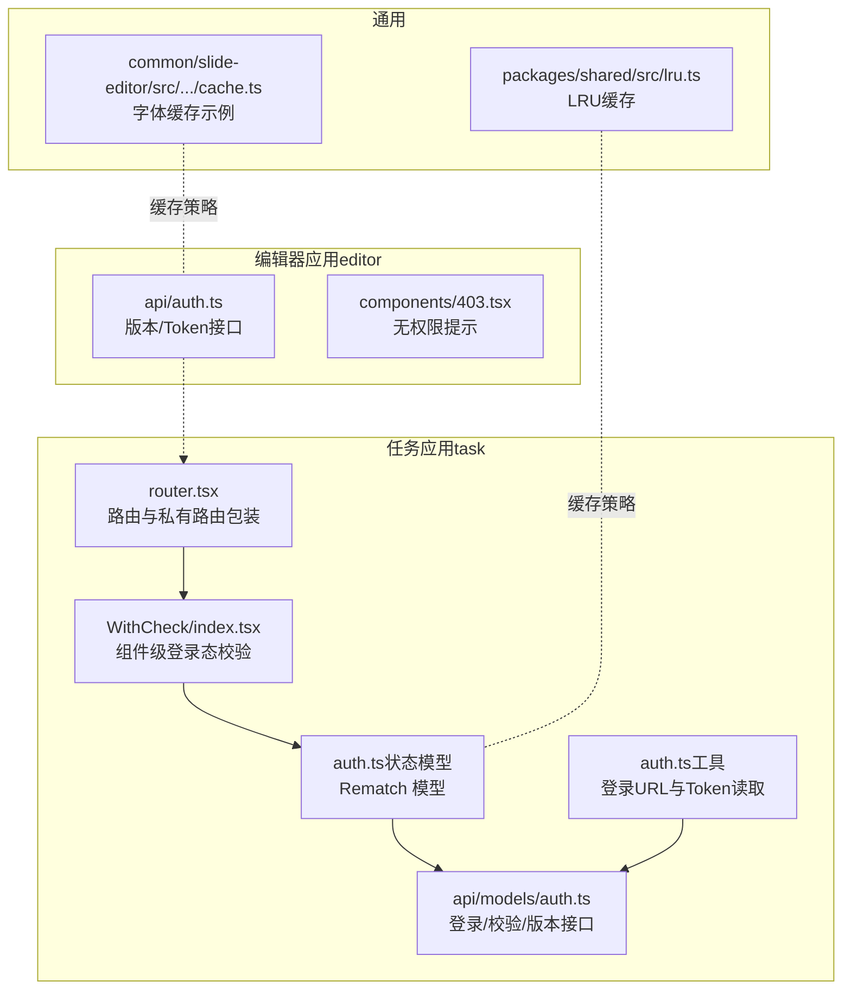
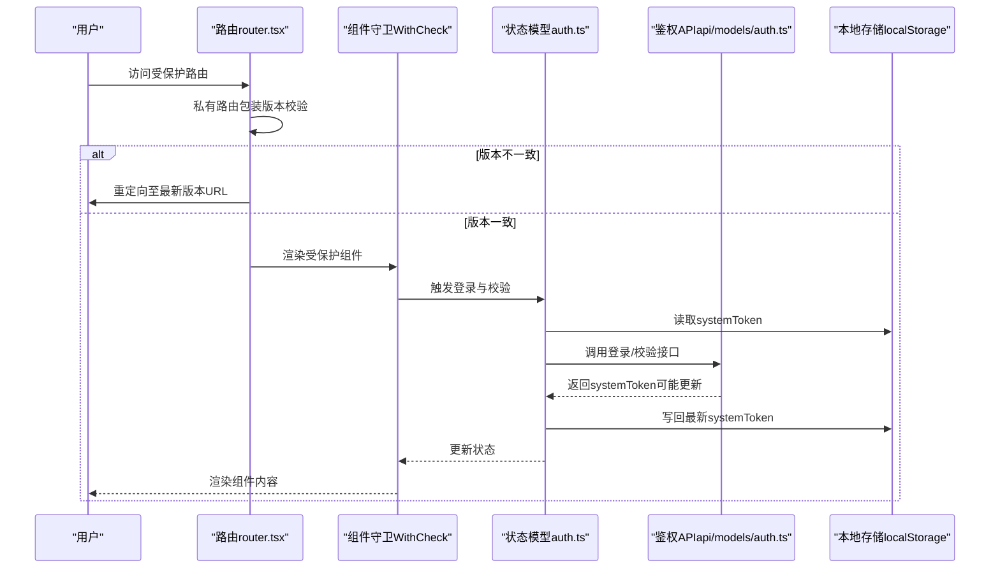
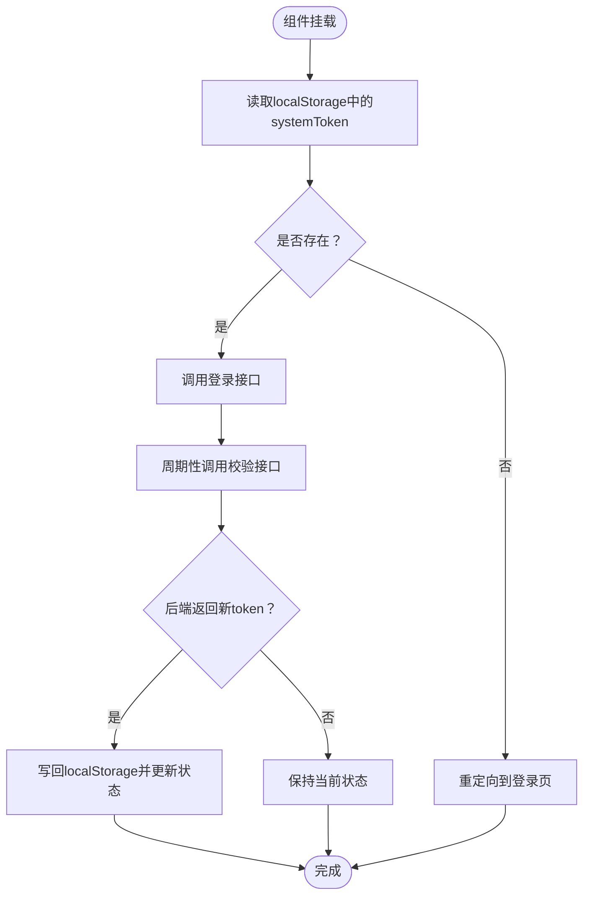
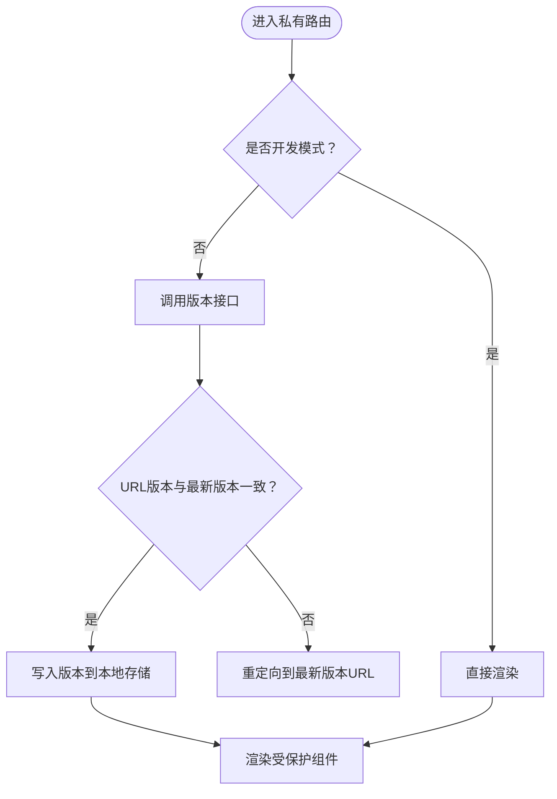
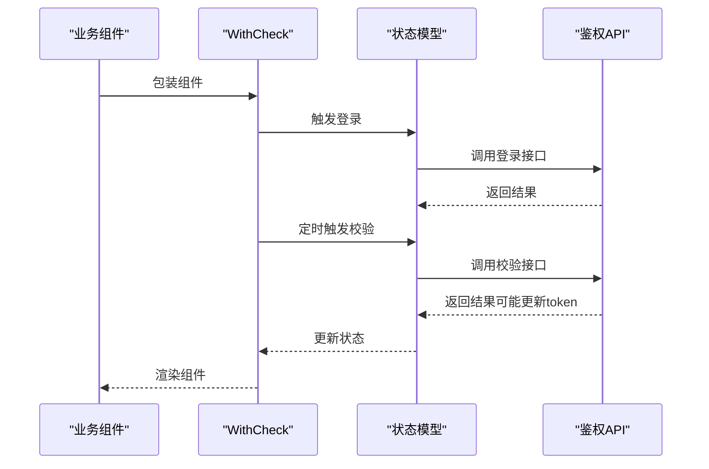
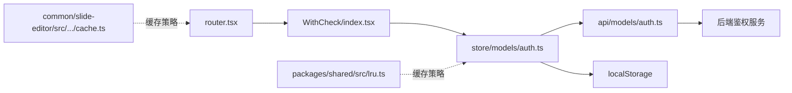

# 权限控制

<cite>
**本文引用的文件**
- [authManager.ts](file://bridge/mcc-player/src/components/auth/authManager.ts)
- [index.ts（Auth 工具）](file://bridge/mcc-player/src/components/auth/index.ts)
- [auth.ts（任务应用状态模型）](file://task/src/store/models/auth.ts)
- [WithCheck/index.tsx](file://task/src/components/WithCheck/index.tsx)
- [auth.ts（工具：登录与Token）](file://task/src/utils/auth.ts)
- [auth.ts（API：登录与校验）](file://task/src/api/models/auth.ts)
- [router.tsx](file://task/src/router.tsx)
- [auth.ts（编辑器API：版本与Token）](file://editor/src/api/auth.ts)
- [403.tsx（无权限提示）](file://editor/src/components/403.tsx)
- [lru.ts（LRU 缓存实现）](file://packages/shared/src/lru.ts)
- [cache.ts（字体缓存示例）](file://common/slide-editor/src/components/Input/utils/cache.ts)
</cite>

## 目录
1. [引言](#引言)
2. [项目结构](#项目结构)
3. [核心组件](#核心组件)
4. [架构总览](#架构总览)
5. [详细组件分析](#详细组件分析)
6. [依赖关系分析](#依赖关系分析)
7. [性能考量](#性能考量)
8. [故障排查指南](#故障排查指南)
9. [结论](#结论)
10. [附录：API 接口文档](#附录api-接口文档)

## 引言
本文件围绕权限控制系统进行深入实现文档编写，覆盖用户认证机制（登录流程、Token 管理、会话保持）、权限验证（路由级与组件级校验、异步权限加载）、角色与权限体系的可扩展性建议、权限缓存策略（本地存储、内存缓存、预加载），并提供安全注意事项与常见问题排查方法。文档同时给出基于仓库现有实现的架构图与流程图，帮助读者快速理解与落地。

## 项目结构
权限控制在两个子应用中体现：
- 任务应用（task）：通过路由守卫与高阶组件实现登录态与Token校验；使用 Rematch 状态模型管理 Token；通过 API 模块对接后端鉴权服务。
- 编辑器应用（editor）：提供版本校验与无权限提示页，配合全局错误边界与 Sentry 进行异常监控。

图表来源
- [router.tsx:1-73](file://task/src/router.tsx#L1-L73)
- [WithCheck/index.tsx:1-34](file://task/src/components/WithCheck/index.tsx#L1-L34)
- [auth.ts（任务应用状态模型）:1-55](file://task/src/store/models/auth.ts#L1-L55)
- [auth.ts（工具：登录与Token）:1-31](file://task/src/utils/auth.ts#L1-L31)
- [auth.ts（API：登录与校验）:1-39](file://task/src/api/models/auth.ts#L1-L39)
- [auth.ts（编辑器API：版本与Token）:1-32](file://editor/src/api/auth.ts#L1-L32)
- [403.tsx（无权限提示）:1-20](file://editor/src/components/403.tsx#L1-L20)
- [lru.ts（LRU 缓存实现）:1-323](file://packages/shared/src/lru.ts#L1-L323)
- [cache.ts（字体缓存示例）:1-72](file://common/slide-editor/src/components/Input/utils/cache.ts#L1-L72)

章节来源
- [router.tsx:1-73](file://task/src/router.tsx#L1-L73)
- [auth.ts（任务应用状态模型）:1-55](file://task/src/store/models/auth.ts#L1-L55)
- [auth.ts（工具：登录与Token）:1-31](file://task/src/utils/auth.ts#L1-L31)
- [auth.ts（API：登录与校验）:1-39](file://task/src/api/models/auth.ts#L1-L39)
- [auth.ts（编辑器API：版本与Token）:1-32](file://editor/src/api/auth.ts#L1-L32)
- [403.tsx（无权限提示）:1-20](file://editor/src/components/403.tsx#L1-L20)
- [lru.ts（LRU 缓存实现）:1-323](file://packages/shared/src/lru.ts#L1-L323)
- [cache.ts（字体缓存示例）:1-72](file://common/slide-editor/src/components/Input/utils/cache.ts#L1-L72)

## 核心组件
- 路由级权限：通过私有路由包装与版本校验，确保进入受保护页面前完成系统版本一致性与登录态校验。
- 组件级权限：通过 WithCheck 高阶组件在组件挂载时执行登录与周期性 Token 校验，维持会话有效性。
- Token 管理：使用 localStorage 存储 systemToken，状态模型负责持久化与更新，API 层提供登录与校验接口。
- 无权限提示：编辑器侧提供统一的 403 提示组件，用于展示“被占用/无权限”场景。

章节来源
- [router.tsx:18-41](file://task/src/router.tsx#L18-L41)
- [WithCheck/index.tsx:6-34](file://task/src/components/WithCheck/index.tsx#L6-L34)
- [auth.ts（任务应用状态模型）:12-54](file://task/src/store/models/auth.ts#L12-L54)
- [auth.ts（工具：登录与Token）:1-31](file://task/src/utils/auth.ts#L1-L31)
- [403.tsx（无权限提示）:1-20](file://editor/src/components/403.tsx#L1-L20)

## 架构总览
整体采用“路由守卫 + 组件守卫 + 状态模型 + API 调用”的分层设计，结合本地存储与周期性校验，保障登录态与会话持续有效。

图表来源
- [router.tsx:18-41](file://task/src/router.tsx#L18-L41)
- [WithCheck/index.tsx:12-29](file://task/src/components/WithCheck/index.tsx#L12-L29)
- [auth.ts（任务应用状态模型）:34-52](file://task/src/store/models/auth.ts#L34-L52)
- [auth.ts（API：登录与校验）:13-20](file://task/src/api/models/auth.ts#L13-L20)
- [auth.ts（工具：登录与Token）:1-31](file://task/src/utils/auth.ts#L1-L31)

## 详细组件分析

### 登录与会话保持流程
- 登录入口：当未检测到 systemToken 或 URL 中携带临时 token 时，跳转到统一登录页，回调地址携带当前路径。
- 会话保持：组件挂载后立即执行登录与校验；随后每 30 分钟周期性调用校验接口以续期 Token。
- Token 更新：若后端返回新的 systemToken，写回 localStorage 并更新状态模型。

图表来源
- [WithCheck/index.tsx:12-29](file://task/src/components/WithCheck/index.tsx#L12-L29)
- [auth.ts（任务应用状态模型）:34-52](file://task/src/store/models/auth.ts#L34-L52)
- [auth.ts（工具：登录与Token）:1-31](file://task/src/utils/auth.ts#L1-L31)

章节来源
- [WithCheck/index.tsx:1-34](file://task/src/components/WithCheck/index.tsx#L1-L34)
- [auth.ts（任务应用状态模型）:1-55](file://task/src/store/models/auth.ts#L1-L55)
- [auth.ts（工具：登录与Token）:1-31](file://task/src/utils/auth.ts#L1-L31)

### 路由级权限与版本校验
- 私有路由：在进入受保护页面前，先拉取系统版本并与当前 URL 版本比对，不一致则重定向到最新版本。
- 开发环境豁免：开发模式下直接放行，便于本地联调。
- URL 参数处理：若 URL 含临时 token，写入 localStorage 并移除参数，避免重复登录。

图表来源
- [router.tsx:18-41](file://task/src/router.tsx#L18-L41)

章节来源
- [router.tsx:1-73](file://task/src/router.tsx#L1-L73)

### 组件级权限控制与异步加载
- WithCheck 高阶组件：在组件生命周期内执行登录与周期性校验，保证组件渲染时具备有效 Token。
- 异步组件：通过 WithAsync 实现按需加载，结合 WithCheck 确保加载前已具备访问权限。

图表来源
- [WithCheck/index.tsx:6-34](file://task/src/components/WithCheck/index.tsx#L6-L34)
- [auth.ts（任务应用状态模型）:34-52](file://task/src/store/models/auth.ts#L34-L52)
- [auth.ts（API：登录与校验）:13-20](file://task/src/api/models/auth.ts#L13-L20)

章节来源
- [WithCheck/index.tsx:1-34](file://task/src/components/WithCheck/index.tsx#L1-L34)
- [auth.ts（任务应用状态模型）:1-55](file://task/src/store/models/auth.ts#L1-L55)

### 角色与权限体系（设计建议）
当前仓库未提供显式的“角色-权限”数据模型与动态计算逻辑。建议采用以下扩展思路：
- 角色定义：在后端维护角色表与权限点集合，前端以枚举或字典形式缓存。
- 权限分配：用户绑定角色，角色继承权限点；支持动态下发权限清单。
- 动态权限计算：前端根据用户权限点构建访问矩阵，路由与组件按矩阵进行渲染控制。
- 权限缓存：结合 LRU 缓存与本地存储，降低重复请求与计算成本。

（本节为概念性设计，不直接对应具体源码）

### 权限缓存策略
- 本地存储（localStorage）：持久化存储 systemToken，作为登录态与会话保持的基础。
- 内存缓存（LRUMap）：适用于高频、短期访问的数据（如权限点映射、资源元数据），通过 LRU 控制容量与淘汰。
- 预加载：在进入受保护页面前，优先拉取必要的权限清单与版本信息，减少首屏等待。

章节来源
- [auth.ts（任务应用状态模型）:34-52](file://task/src/store/models/auth.ts#L34-L52)
- [lru.ts（LRU 缓存实现）:31-179](file://packages/shared/src/lru.ts#L31-L179)
- [cache.ts（字体缓存示例）:26-70](file://common/slide-editor/src/components/Input/utils/cache.ts#L26-L70)

### 无权限提示与错误边界
- 无权限提示：编辑器侧提供统一的 403 页面，提示“被占用/无权限”，提升用户体验。
- 错误边界：通用错误边界组件捕获渲染异常并输出友好提示，结合 Sentry 上报定位问题。

章节来源
- [403.tsx（无权限提示）:1-20](file://editor/src/components/403.tsx#L1-L20)
- [common render-core 错误边界:1-47](file://common/render-core/components/withErrorBoundary.tsx#L1-L47)

## 依赖关系分析
- 路由层依赖：router.tsx 依赖 WithCheck 与 API 模块，实现版本校验与登录态控制。
- 组件层依赖：WithCheck 依赖状态模型与工具模块，实现登录与周期性校验。
- 状态层依赖：auth 状态模型依赖 API 模块与本地存储，实现 Token 的持久化与更新。
- 通用依赖：LRU 缓存与字体缓存示例展示了缓存策略在不同场景下的应用。

图表来源
- [router.tsx:1-73](file://task/src/router.tsx#L1-L73)
- [WithCheck/index.tsx:1-34](file://task/src/components/WithCheck/index.tsx#L1-L34)
- [auth.ts（任务应用状态模型）:1-55](file://task/src/store/models/auth.ts#L1-L55)
- [auth.ts（API：登录与校验）:1-39](file://task/src/api/models/auth.ts#L1-L39)
- [lru.ts（LRU 缓存实现）:1-323](file://packages/shared/src/lru.ts#L1-L323)
- [cache.ts（字体缓存示例）:1-72](file://common/slide-editor/src/components/Input/utils/cache.ts#L1-L72)

章节来源
- [router.tsx:1-73](file://task/src/router.tsx#L1-L73)
- [WithCheck/index.tsx:1-34](file://task/src/components/WithCheck/index.tsx#L1-L34)
- [auth.ts（任务应用状态模型）:1-55](file://task/src/store/models/auth.ts#L1-L55)
- [auth.ts（API：登录与校验）:1-39](file://task/src/api/models/auth.ts#L1-L39)
- [lru.ts（LRU 缓存实现）:1-323](file://packages/shared/src/lru.ts#L1-L323)
- [cache.ts（字体缓存示例）:1-72](file://common/slide-editor/src/components/Input/utils/cache.ts#L1-L72)

## 性能考量
- 周期性校验频率：当前设置为 30 分钟一次，可根据 Token 有效期与业务风险调整。
- 缓存命中率：对权限点与版本信息采用 LRU 缓存，避免频繁网络请求。
- 异步组件：按需加载减少首屏体积，结合 WithCheck 确保加载前具备访问权限。
- 本地存储：systemToken 使用 localStorage，注意容量限制与隐私模式兼容。

（本节为通用指导，不直接引用具体源码）

## 故障排查指南
- 无法进入受保护页面
  - 检查 URL 是否携带临时 token，确认是否已写入 localStorage 并移除参数。
  - 确认开发模式判断与版本校验逻辑是否生效。
- Token 失效或频繁过期
  - 检查周期性校验是否正常执行，确认后端返回的新 token 是否正确写回 localStorage。
  - 关注网络请求状态与响应体，确认接口返回的 systemToken 是否更新。
- 本地存储异常
  - 检查浏览器隐私模式或存储配额上限导致的写入失败。
  - 对于大对象存储，考虑降级或清理策略。
- 无权限提示
  - 编辑器侧出现 403 提示时，确认当前资源是否被占用或权限不足。

章节来源
- [router.tsx:43-57](file://task/src/router.tsx#L43-L57)
- [WithCheck/index.tsx:20-29](file://task/src/components/WithCheck/index.tsx#L20-L29)
- [auth.ts（任务应用状态模型）:42-52](file://task/src/store/models/auth.ts#L42-L52)
- [403.tsx（无权限提示）:1-20](file://editor/src/components/403.tsx#L1-L20)

## 结论
该权限控制系统以“路由守卫 + 组件守卫 + 状态模型 + API 调用”为核心，结合本地存储与周期性校验，实现了较为完善的登录态与会话保持机制。建议后续引入角色与权限点模型、动态权限计算与更细粒度的缓存策略，进一步提升系统的可扩展性与性能表现。

## 附录：API 接口文档
- 登录
  - 方法：POST
  - 路径：/classroom-slides/auth/login
  - 请求体：{ systemToken: string }
  - 响应：{ systemToken: string }
- 校验
  - 方法：POST
  - 路径：/classroom-slides/auth/check
  - 请求体：{ systemToken: string }
  - 响应：{ systemToken: string }
- 获取系统版本
  - 方法：GET
  - 路径：/classroom-slides/manage/{systemName}/current-version
  - 请求头：Token: string
  - 响应：版本信息对象
- 设置系统版本
  - 方法：POST
  - 路径：/classroom-slides/manage/system/version/save-or-update
  - 请求体：{ systemName: string | unknown }
  - 响应：保存结果

章节来源
- [auth.ts（API：登录与校验）:13-39](file://task/src/api/models/auth.ts#L13-L39)
- [auth.ts（编辑器API：版本与Token）:19-32](file://editor/src/api/auth.ts#L19-L32)