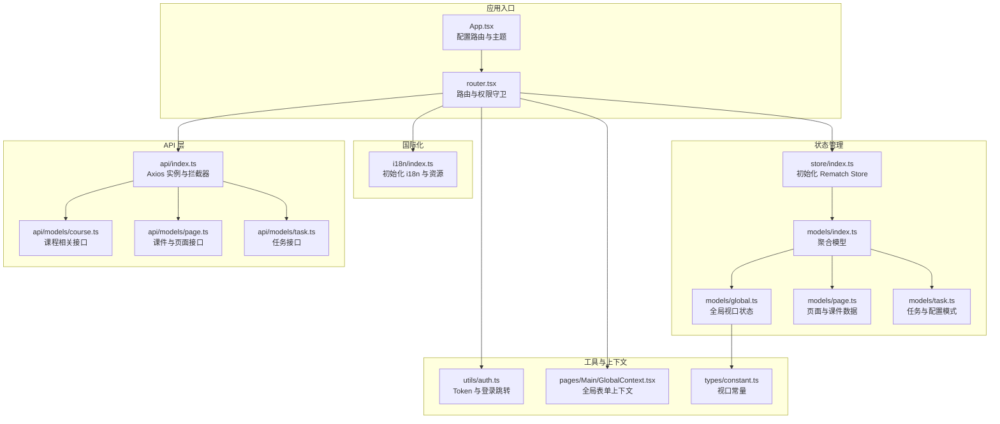
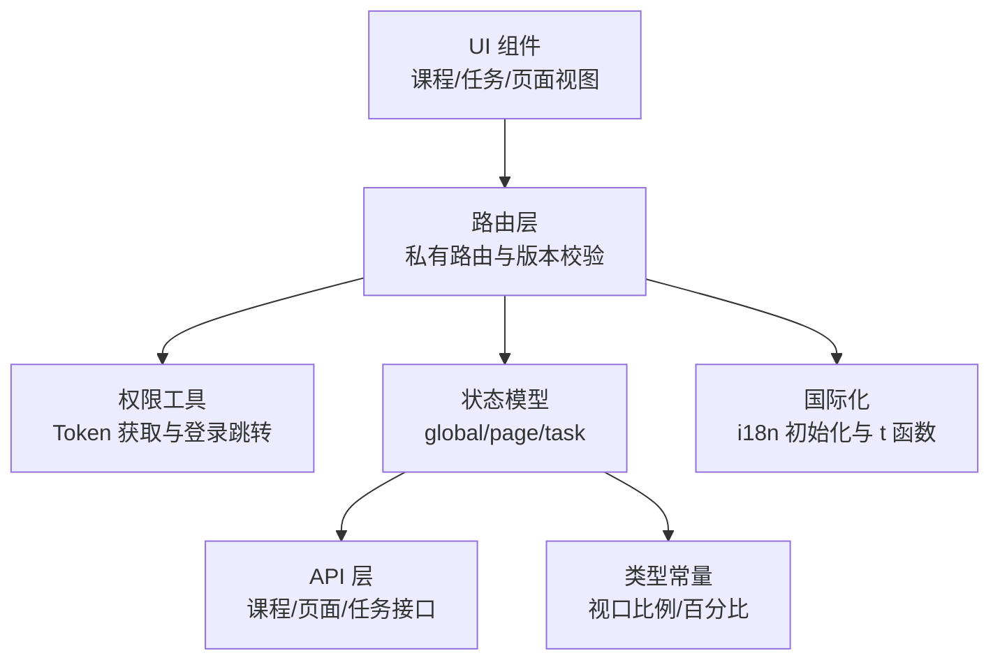
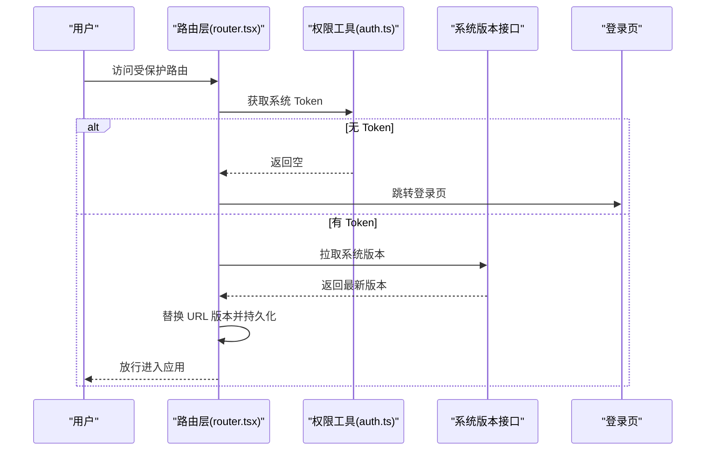
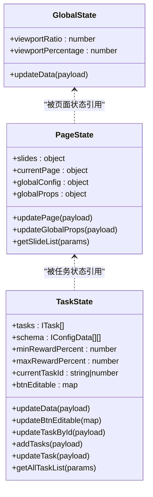
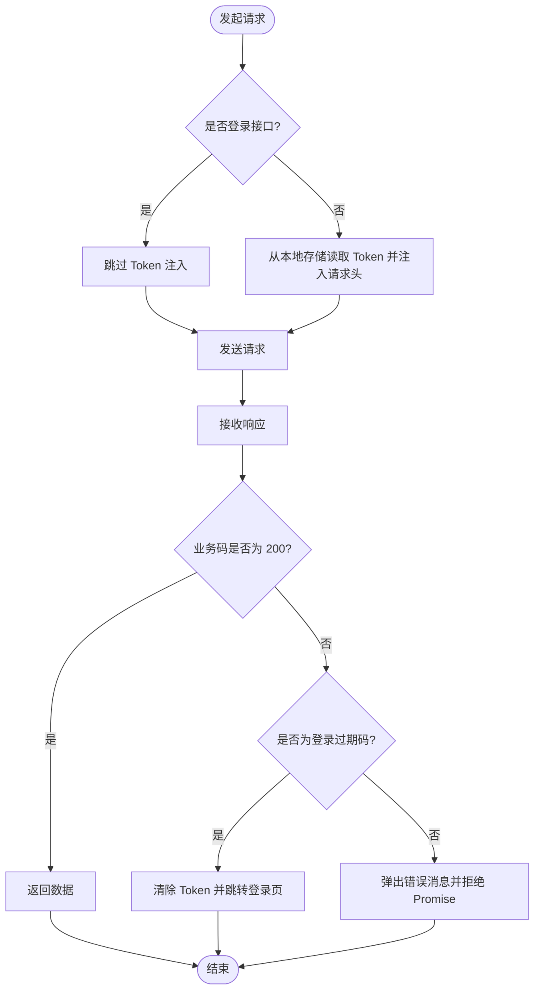
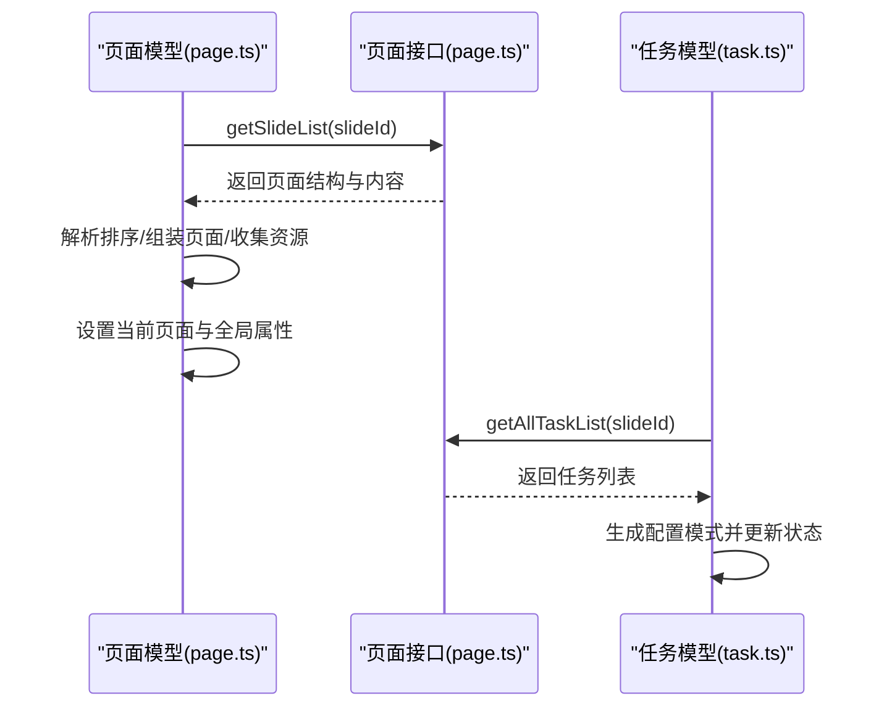
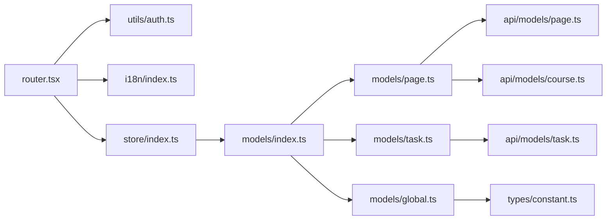

# 课堂任务系统

<cite>
**本文引用的文件**
- [App.tsx](file://task/src/App.tsx)
- [router.tsx](file://task/src/router.tsx)
- [index.ts](file://task/src/store/index.ts)
- [index.ts](file://task/src/store/models/index.ts)
- [global.ts](file://task/src/store/models/global.ts)
- [page.ts](file://task/src/store/models/page.ts)
- [task.ts](file://task/src/store/models/task.ts)
- [constant.ts](file://task/src/types/constant.ts)
- [index.ts](file://task/src/i18n/index.ts)
- [index.ts](file://task/src/api/index.ts)
- [course.ts](file://task/src/api/models/course.ts)
- [page.ts](file://task/src/api/models/page.ts)
- [task.ts](file://task/src/api/models/task.ts)
- [auth.ts](file://task/src/utils/auth.ts)
- [GlobalContext.tsx](file://task/src/pages/Main/GlobalContext.tsx)
</cite>

## 目录
1. [引言](#引言)
2. [项目结构](#项目结构)
3. [核心组件](#核心组件)
4. [架构总览](#架构总览)
5. [详细组件分析](#详细组件分析)
6. [依赖分析](#依赖分析)
7. [性能考虑](#性能考虑)
8. [故障排查指南](#故障排查指南)
9. [结论](#结论)
10. [附录](#附录)

## 引言
本文件面向 Slides Engine 课堂任务系统，围绕课程管理、页面管理与任务编排的整体设计理念进行系统化说明；同时深入解析状态管理体系（全局状态、页面状态、任务状态）、权限控制体系（认证、角色与访问控制）、API 设计与使用方式、国际化支持与多语言切换机制，并提供扩展开发指南与最佳实践，帮助开发者快速理解并高效迭代任务系统。

## 项目结构
任务系统位于仓库的 task 子目录，采用前端单页应用架构，结合路由守卫、状态管理与 API 层，形成“路由层 → 权限校验 → 状态模型 → API 模块”的清晰分层。主要结构要点如下：
- 路由与入口：通过 HashRouter 包裹，基于 React Router 进行页面级路由与懒加载；在路由层实现系统版本校验与私有路由守卫。
- 状态管理：Rematch + Immer 插件构建全局 Store，按领域拆分为 global、page、task、auth 等模型。
- 国际化：基于 i18next 初始化中英文资源，提供 t 函数与默认语言设置。
- API 层：统一拦截器处理请求头 Token 注入与响应错误处理，封装通用 GET/POST/PUT/DELETE 方法。
- 类型常量：集中定义视口比例、百分比等常量，供全局复用。

图表来源
- [App.tsx:1-25](file://task/src/App.tsx#L1-L25)
- [router.tsx:1-73](file://task/src/router.tsx#L1-L73)
- [index.ts:1-18](file://task/src/store/index.ts#L1-L18)
- [index.ts:1-19](file://task/src/store/models/index.ts#L1-L19)
- [global.ts:1-25](file://task/src/store/models/global.ts#L1-L25)
- [page.ts:1-152](file://task/src/store/models/page.ts#L1-L152)
- [task.ts:1-130](file://task/src/store/models/task.ts#L1-L130)
- [index.ts:1-38](file://task/src/i18n/index.ts#L1-L38)
- [index.ts:1-90](file://task/src/api/index.ts#L1-L90)
- [course.ts:1-119](file://task/src/api/models/course.ts#L1-L119)
- [page.ts:1-54](file://task/src/api/models/page.ts#L1-L54)
- [task.ts:1-48](file://task/src/api/models/task.ts#L1-L48)
- [auth.ts:1-31](file://task/src/utils/auth.ts#L1-L31)
- [GlobalContext.tsx:1-7](file://task/src/pages/Main/GlobalContext.tsx#L1-L7)
- [constant.ts:1-3](file://task/src/types/constant.ts#L1-L3)

章节来源
- [App.tsx:1-25](file://task/src/App.tsx#L1-L25)
- [router.tsx:1-73](file://task/src/router.tsx#L1-L73)
- [index.ts:1-18](file://task/src/store/index.ts#L1-L18)
- [index.ts:1-19](file://task/src/store/models/index.ts#L1-L19)
- [index.ts:1-38](file://task/src/i18n/index.ts#L1-L38)
- [index.ts:1-90](file://task/src/api/index.ts#L1-L90)

## 核心组件
- 应用入口与主题配置：在入口组件中配置 HashRouter、Ant Design ConfigProvider，并预加载字体资源，确保界面与字体一致。
- 路由与权限守卫：路由层实现私有路由保护，拉取系统版本并进行版本替换，同时注入系统 Token 到本地存储，保障访问一致性。
- 状态管理：通过 Rematch 初始化 Store，按领域划分模型，提供统一的更新与异步 effects，便于页面与任务数据的集中管理。
- 国际化：初始化 i18next，配置中英文资源与默认语言，提供 t 函数以满足多语言文案需求。
- API 层：统一的 Axios 实例与拦截器，自动注入 Token，统一对错误码与异常进行处理，提供通用 CRUD 方法。
- 工具与上下文：提供登录跳转与 Token 获取工具，以及全局表单上下文，支撑页面与任务配置面板。

章节来源
- [App.tsx:13-22](file://task/src/App.tsx#L13-L22)
- [router.tsx:18-41](file://task/src/router.tsx#L18-L41)
- [index.ts:1-18](file://task/src/store/index.ts#L1-L18)
- [index.ts:1-38](file://task/src/i18n/index.ts#L1-L38)
- [index.ts:1-90](file://task/src/api/index.ts#L1-L90)
- [auth.ts:1-31](file://task/src/utils/auth.ts#L1-L31)
- [GlobalContext.tsx:1-7](file://task/src/pages/Main/GlobalContext.tsx#L1-L7)

## 架构总览
系统采用“路由层 → 权限校验 → 状态模型 → API 模块”的分层设计，配合国际化与工具模块，形成清晰的职责边界与可扩展性。

图表来源
- [router.tsx:1-73](file://task/src/router.tsx#L1-L73)
- [auth.ts:1-31](file://task/src/utils/auth.ts#L1-L31)
- [index.ts:1-19](file://task/src/store/models/index.ts#L1-L19)
- [course.ts:1-119](file://task/src/api/models/course.ts#L1-L119)
- [page.ts:1-54](file://task/src/api/models/page.ts#L1-L54)
- [task.ts:1-48](file://task/src/api/models/task.ts#L1-L48)
- [index.ts:1-38](file://task/src/i18n/index.ts#L1-L38)
- [constant.ts:1-3](file://task/src/types/constant.ts#L1-L3)

## 详细组件分析

### 路由与权限控制
- 私有路由守卫：在路由层对未认证用户进行拦截，拉取系统版本并进行版本替换，避免缓存导致的版本不一致；同时从 URL 中提取 sysToken 并写入本地存储，保证系统 Token 的一致性。
- 登录跳转：当 Token 缺失时，重定向至统一登录地址，回调地址携带当前应用路径，提升用户体验。

图表来源
- [router.tsx:18-41](file://task/src/router.tsx#L18-L41)
- [auth.ts:4-30](file://task/src/utils/auth.ts#L4-L30)

章节来源
- [router.tsx:18-41](file://task/src/router.tsx#L18-L41)
- [auth.ts:1-31](file://task/src/utils/auth.ts#L1-L31)

### 状态管理系统
- 全局状态：维护视口比例与缩放百分比，提供统一更新方法，用于页面布局与预览适配。
- 页面状态：管理课件结构、当前页面、全局属性与资源文件列表，支持根据课件 ID 拉取页面列表并排序，同时记录资源文件清单。
- 任务状态：维护任务列表、配置模式、奖励比例范围与按钮可编辑标记；提供任务新增、更新、全量拉取与 Schema 同步等异步操作。

图表来源
- [global.ts:1-25](file://task/src/store/models/global.ts#L1-L25)
- [page.ts:1-152](file://task/src/store/models/page.ts#L1-L152)
- [task.ts:1-130](file://task/src/store/models/task.ts#L1-L130)

章节来源
- [global.ts:1-25](file://task/src/store/models/global.ts#L1-L25)
- [page.ts:1-152](file://task/src/store/models/page.ts#L1-L152)
- [task.ts:1-130](file://task/src/store/models/task.ts#L1-L130)
- [constant.ts:1-3](file://task/src/types/constant.ts#L1-L3)

### API 接口设计与使用
- 统一拦截器：请求前自动注入 Token，除登录接口外均附加 Token；响应层对业务码进行判断，统一错误提示与登出处理。
- 课程接口：提供学校列表、学年列表、产品属性、课程列表、课件绑定信息、课次详情与新增课程信息等接口。
- 页面接口：提供创建课件、获取课件列表、发布/取消发布课件、绑定课件等接口。
- 任务接口：提供保存任务、新增任务、获取页面任务、获取课件全部任务、按元素删除任务等接口。

图表来源
- [index.ts:11-67](file://task/src/api/index.ts#L11-L67)

章节来源
- [index.ts:1-90](file://task/src/api/index.ts#L1-L90)
- [course.ts:1-119](file://task/src/api/models/course.ts#L1-L119)
- [page.ts:1-54](file://task/src/api/models/page.ts#L1-L54)
- [task.ts:1-48](file://task/src/api/models/task.ts#L1-L48)

### 国际化支持与多语言切换
- 初始化：配置中英文资源映射，设置默认语言与插件，提供 t 函数以支持多语言文案。
- 使用建议：在组件中通过 t 函数读取翻译键值，避免硬编码文本；在需要切换语言时，调用 i18n.changeLanguage 并持久化用户偏好。

章节来源
- [index.ts:1-38](file://task/src/i18n/index.ts#L1-L38)

### 页面与任务编排流程
- 页面加载：根据 slideId 拉取课件列表，解析页面结构与内容，按排序规则组装页面数组并设置当前页面，同时收集资源文件清单。
- 任务编排：根据任务类型生成配置模式，支持批量新增与更新任务，同步更新 Schema，确保配置与数据一致。

图表来源
- [page.ts:111-149](file://task/src/store/models/page.ts#L111-L149)
- [task.ts:105-122](file://task/src/store/models/task.ts#L105-L122)
- [page.ts:29-31](file://task/src/api/models/page.ts#L29-L31)
- [task.ts:41-43](file://task/src/api/models/task.ts#L41-L43)

章节来源
- [page.ts:111-149](file://task/src/store/models/page.ts#L111-L149)
- [task.ts:105-122](file://task/src/store/models/task.ts#L105-L122)

## 依赖分析
- 路由与权限：路由层依赖权限工具与系统版本接口，确保访问安全与版本一致性。
- 状态模型：页面与任务模型依赖 API 层接口，完成数据拉取与更新；全局模型提供基础视口配置。
- 国际化：组件通过 t 函数使用多语言文案，无需直接依赖具体资源文件。
- 工具与上下文：全局表单上下文为配置面板提供共享状态，权限工具贯穿登录与 Token 管理。

图表来源
- [router.tsx:1-73](file://task/src/router.tsx#L1-L73)
- [auth.ts:1-31](file://task/src/utils/auth.ts#L1-L31)
- [index.ts:1-18](file://task/src/store/index.ts#L1-L18)
- [index.ts:1-19](file://task/src/store/models/index.ts#L1-L19)
- [page.ts:1-152](file://task/src/store/models/page.ts#L1-L152)
- [task.ts:1-130](file://task/src/store/models/task.ts#L1-L130)
- [global.ts:1-25](file://task/src/store/models/global.ts#L1-L25)
- [page.ts:1-54](file://task/src/api/models/page.ts#L1-L54)
- [task.ts:1-48](file://task/src/api/models/task.ts#L1-L48)
- [course.ts:1-119](file://task/src/api/models/course.ts#L1-L119)
- [constant.ts:1-3](file://task/src/types/constant.ts#L1-L3)

章节来源
- [router.tsx:1-73](file://task/src/router.tsx#L1-L73)
- [index.ts:1-18](file://task/src/store/index.ts#L1-L18)
- [index.ts:1-19](file://task/src/store/models/index.ts#L1-L19)

## 性能考虑
- 路由懒加载：通过动态导入与 Webpack 分包，减少首屏体积，提升初始加载速度。
- 状态更新：使用 Immer 插件进行不可变更新，降低深拷贝成本，提高渲染效率。
- 请求拦截：统一注入 Token 与错误处理，减少重复逻辑，提升网络层稳定性。
- 视口适配：通过全局视口比例与百分比控制，统一页面布局与预览体验，避免频繁计算。

## 故障排查指南
- 登录过期：响应拦截器检测到特定错误码时会清除 Token 并跳转登录页，需检查后端返回与环境变量配置。
- 版本不一致：路由层会对比 URL 版本与最新版本，若不一致则替换 URL 并刷新，确保前端资源一致性。
- Token 缺失：权限工具会在缺失时跳转登录页，需确认本地存储与登录流程是否正常。
- 网络异常：统一错误提示与 Promise 拒绝，便于上层捕获并进行降级处理。

章节来源
- [index.ts:36-67](file://task/src/api/index.ts#L36-L67)
- [router.tsx:21-32](file://task/src/router.tsx#L21-L32)
- [auth.ts:25-30](file://task/src/utils/auth.ts#L25-L30)

## 结论
课堂任务系统以清晰的分层架构为基础，结合路由守卫、状态模型与 API 层，实现了课程、页面与任务的协同管理。通过统一的国际化与工具模块，系统具备良好的可维护性与扩展性。建议在后续迭代中持续完善权限粒度、增强错误监控与日志上报，并逐步沉淀组件库与配置模式，提升开发效率与一致性。

## 附录
- 使用示例与最佳实践
  - 路由访问：受保护路由需先完成系统版本校验与 Token 注入，避免白屏或鉴权失败。
  - 状态更新：优先使用模型提供的 effects 与 reducers，避免直接修改状态，保持数据流可追踪。
  - API 调用：遵循统一拦截器约定，确保请求头与错误处理一致；对敏感接口进行幂等与重试策略设计。
  - 国际化：统一使用 t 函数，避免硬编码文本；在切换语言时持久化用户偏好。
  - 扩展开发：新增任务类型时，先完善配置模式与 Schema 生成逻辑，再接入 API 与 UI 配置面板，最后补充国际化文案与测试用例。