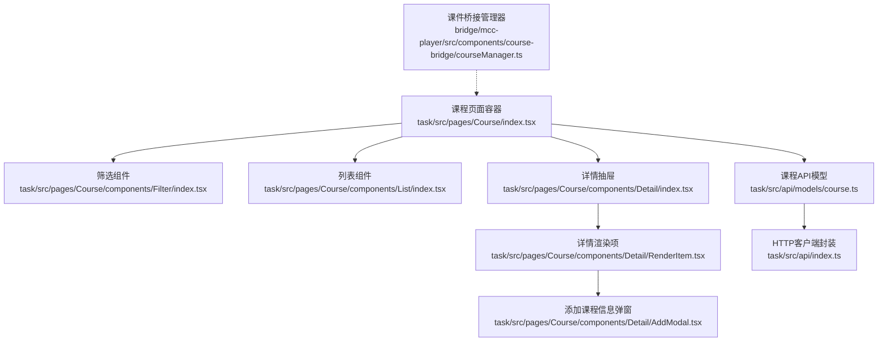
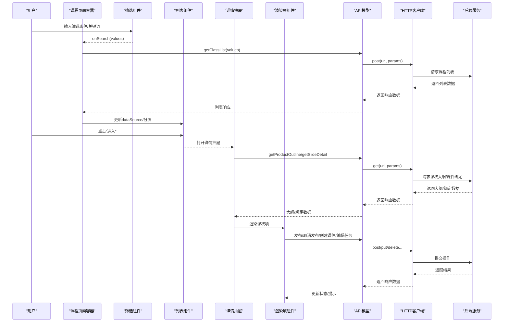
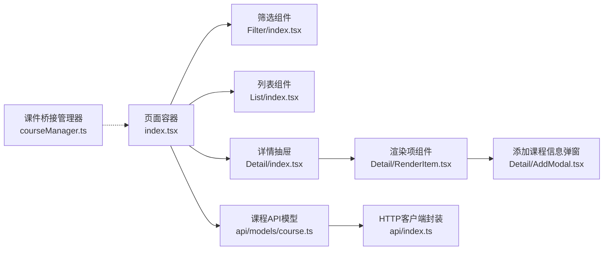

# 课程管理

<cite>
**本文引用的文件**
- [课程管理页面入口](file://task/src/pages/Course/index.tsx)
- [课程列表组件](file://task/src/pages/Course/components/List/index.tsx)
- [课程筛选组件](file://task/src/pages/Course/components/Filter/index.tsx)
- [课程详情抽屉组件](file://task/src/pages/Course/components/Detail/index.tsx)
- [课程详情渲染项组件](file://task/src/pages/Course/components/Detail/RenderItem.tsx)
- [课程详情添加课程信息弹窗](file://task/src/pages/Course/components/Detail/AddModal.tsx)
- [课程数据模型与API定义](file://task/src/api/models/course.ts)
- [通用HTTP客户端封装](file://task/src/api/index.ts)
- [课件桥接管理器](file://bridge/mcc-player/src/components/course-bridge/courseManager.ts)
- [课件桥接管理器索引](file://bridge/mcc-player/src/components/course-bridge/index.ts)
</cite>

## 目录
1. [简介](#简介)
2. [项目结构](#项目结构)
3. [核心组件](#核心组件)
4. [架构总览](#架构总览)
5. [详细组件分析](#详细组件分析)
6. [依赖分析](#依赖分析)
7. [性能考虑](#性能考虑)
8. [故障排查指南](#故障排查指南)
9. [结论](#结论)
10. [附录：API接口清单](#附录api接口清单)

## 简介
本文件面向“课程管理”模块，覆盖课程列表展示、课程详情查看、课程创建与编辑的完整流程；详解课程数据模型（基本信息、状态管理、权限控制相关字段）；解释搜索与筛选（关键词、分类链路、排序）的实现原理；阐述课件状态流转（草稿、发布、下线等）的业务规则；并提供课程管理相关API接口文档与使用示例路径，帮助开发者快速理解与落地。

## 项目结构
课程管理位于 task 应用中，采用页面-组件分层组织：
- 页面容器负责状态管理与分页、筛选、详情联动
- 列表组件负责表格渲染与分页回调
- 筛选组件负责多级联动筛选（分校→年份→产品类型→学季→年级→学科→版本）
- 详情抽屉负责展示课程基础信息与课次列表
- 渲染项组件负责课件创建/编辑/发布/取消发布/预览/任务编辑等操作
- 添加课程信息弹窗负责为课次补充“课程信息”
- API层提供课程列表、详情、课次大纲、课件绑定、发布/取消发布、新增课程信息等接口
- 桥接层提供与课件微应用通信的能力（用于尺寸、页码切换、状态恢复等）

图表来源
- [课程管理页面入口:1-62](file://task/src/pages/Course/index.tsx#L1-L62)
- [课程列表组件:1-96](file://task/src/pages/Course/components/List/index.tsx#L1-L96)
- [课程筛选组件:1-302](file://task/src/pages/Course/components/Filter/index.tsx#L1-L302)
- [课程详情抽屉组件:1-168](file://task/src/pages/Course/components/Detail/index.tsx#L1-L168)
- [课程详情渲染项组件:1-139](file://task/src/pages/Course/components/Detail/RenderItem.tsx#L1-L139)
- [课程详情添加课程信息弹窗:1-70](file://task/src/pages/Course/components/Detail/AddModal.tsx#L1-L70)
- [课程数据模型与API定义:1-119](file://task/src/api/models/course.ts#L1-L119)
- [通用HTTP客户端封装:1-90](file://task/src/api/index.ts#L1-L90)
- [课件桥接管理器:1-117](file://bridge/mcc-player/src/components/course-bridge/courseManager.ts#L1-L117)

章节来源
- [课程管理页面入口:1-62](file://task/src/pages/Course/index.tsx#L1-L62)
- [课程筛选组件:1-302](file://task/src/pages/Course/components/Filter/index.tsx#L1-L302)
- [课程列表组件:1-96](file://task/src/pages/Course/components/List/index.tsx#L1-L96)
- [课程详情抽屉组件:1-168](file://task/src/pages/Course/components/Detail/index.tsx#L1-L168)
- [课程详情渲染项组件:1-139](file://task/src/pages/Course/components/Detail/RenderItem.tsx#L1-L139)
- [课程详情添加课程信息弹窗:1-70](file://task/src/pages/Course/components/Detail/AddModal.tsx#L1-L70)
- [课程数据模型与API定义:1-119](file://task/src/api/models/course.ts#L1-L119)
- [通用HTTP客户端封装:1-90](file://task/src/api/index.ts#L1-L90)
- [课件桥接管理器:1-117](file://bridge/mcc-player/src/components/course-bridge/courseManager.ts#L1-L117)

## 核心组件
- 课程页面容器：聚合筛选、列表、详情，维护分页与加载状态，触发查询与详情打开
- 筛选组件：多级联动（分校→年份→产品类型→学季→年级→学科→版本），支持关键词（产品ID、产品名称）与清空
- 列表组件：表格列定义、分页回调、滚动适配
- 详情抽屉：展示课程基础信息，拉取课次大纲与课件绑定信息，定时刷新
- 渲染项组件：课件创建/编辑/任务编辑/预览/发布/取消发布/添加/修改课程信息
- 添加课程信息弹窗：校验并提交“课程信息”
- API模型：课程列表、筛选条件、课次大纲、课件绑定、发布/取消发布、新增课程信息
- HTTP客户端：统一拦截器、鉴权头注入、错误处理
- 课件桥接管理器：与课件微应用通信（翻页、恢复状态、尺寸、UID等）

章节来源
- [课程管理页面入口:1-62](file://task/src/pages/Course/index.tsx#L1-L62)
- [课程筛选组件:1-302](file://task/src/pages/Course/components/Filter/index.tsx#L1-L302)
- [课程列表组件:1-96](file://task/src/pages/Course/components/List/index.tsx#L1-L96)
- [课程详情抽屉组件:1-168](file://task/src/pages/Course/components/Detail/index.tsx#L1-L168)
- [课程详情渲染项组件:1-139](file://task/src/pages/Course/components/Detail/RenderItem.tsx#L1-L139)
- [课程详情添加课程信息弹窗:1-70](file://task/src/pages/Course/components/Detail/AddModal.tsx#L1-L70)
- [课程数据模型与API定义:1-119](file://task/src/api/models/course.ts#L1-L119)
- [通用HTTP客户端封装:1-90](file://task/src/api/index.ts#L1-L90)
- [课件桥接管理器:1-117](file://bridge/mcc-player/src/components/course-bridge/courseManager.ts#L1-L117)

## 架构总览
课程管理从前端到后端的数据流如下：
- 页面发起筛选与分页请求
- API层通过HTTP客户端封装调用后端接口
- 返回数据驱动列表与详情渲染
- 详情侧通过课次大纲与课件绑定信息，支持课件生命周期操作（创建、编辑、发布、取消发布、预览、任务编辑）
- 课件桥接管理器负责与课件微应用进行消息通信与状态同步

图表来源
- [课程管理页面入口:21-46](file://task/src/pages/Course/index.tsx#L21-L46)
- [课程筛选组件:193-198](file://task/src/pages/Course/components/Filter/index.tsx#L193-L198)
- [课程列表组件:77-90](file://task/src/pages/Course/components/List/index.tsx#L77-L90)
- [课程详情抽屉组件:79-92](file://task/src/pages/Course/components/Detail/index.tsx#L79-L92)
- [课程详情渲染项组件:38-59](file://task/src/pages/Course/components/Detail/RenderItem.tsx#L38-L59)
- [课程数据模型与API定义:74-119](file://task/src/api/models/course.ts#L74-L119)
- [通用HTTP客户端封装:69-88](file://task/src/api/index.ts#L69-L88)

## 详细组件分析

### 课程列表展示
- 列表列定义包含：操作（进入）、产品名称、产品ID、分校、年份、学季、年级、学科、版本
- 支持分页（页码、每页条数、页码选项、总数显示）
- 滚动区域根据表头高度动态计算，保证可视区域完整
- 加载状态由父容器传入，避免重复请求

章节来源
- [课程列表组件:13-96](file://task/src/pages/Course/components/List/index.tsx#L13-L96)

### 课程详情查看
- 打开方式：点击列表“进入”按钮，父容器将当前项传入详情抽屉
- 详情抽屉展示课程基础信息（产品ID、名称、分校、年份、学季、年级、学科、版本）
- 定时刷新（5秒）与可见性变化监听，确保课件状态与后台保持一致
- 课次列表来源于课次大纲与课件绑定信息的合并，先导课特殊处理

章节来源
- [课程管理页面入口:47-50](file://task/src/pages/Course/index.tsx#L47-L50)
- [课程详情抽屉组件:21-98](file://task/src/pages/Course/components/Detail/index.tsx#L21-L98)

### 课程创建与编辑
- 创建课件：渲染项组件调用创建接口生成课件ID，并绑定到对应课次，随后在新窗口打开编辑器
- 编辑课件：已有课件ID时，直接在新窗口打开编辑器
- 编辑任务：打开任务侧编辑界面
- 预览：打开任务侧预览模式
- 添加/修改课程信息：通过弹窗输入并提交，调用新增课程信息接口

章节来源
- [课程详情渲染项组件:38-59](file://task/src/pages/Course/components/Detail/RenderItem.tsx#L38-L59)
- [课程详情添加课程信息弹窗:27-43](file://task/src/pages/Course/components/Detail/AddModal.tsx#L27-L43)

### 课程搜索与筛选
- 关键词搜索：支持产品ID与产品名称
- 分类筛选：分校（城市）→年份→产品类型→学季→年级→学科→版本，逐级联动，前置字段为空则后续字段禁用
- 清空逻辑：清空任一字段会递归清空其后的所有字段及对应选项
- 学校搜索：支持输入框搜索分校选项
- 默认参数：筛选表单初始化包含sign标志位

章节来源
- [课程筛选组件:21-225](file://task/src/pages/Course/components/Filter/index.tsx#L21-L225)

### 课程状态流转
- 状态枚举：待发布、发布中、已发布
- 发布流程：从“待发布”到“发布中”，后台打包完成后状态变为“已发布”
- 取消发布：从“发布中”回到“待发布”
- 操作按钮根据当前状态智能显示（发布/更新发布/取消发布）
- 状态更新通过本地状态回写，配合定时刷新确保UI与后台一致

章节来源
- [课程详情渲染项组件:24-93](file://task/src/pages/Course/components/Detail/RenderItem.tsx#L24-L93)

### 课件桥接管理器
- 提供与课件微应用通信的能力：翻页、恢复状态、设置尺寸、接收实时消息、设置UID等
- 封装Promise化的消息传递，统一事件监听与分发
- 用于在播放器侧与课件微应用进行参数同步与状态恢复

章节来源
- [课件桥接管理器:13-117](file://bridge/mcc-player/src/components/course-bridge/courseManager.ts#L13-L117)
- [课件桥接管理器索引:1-16](file://bridge/mcc-player/src/components/course-bridge/index.ts#L1-L16)

## 依赖分析
- 页面容器依赖筛选、列表、详情组件，以及课程API模型
- 列表组件依赖Ant Design Table与分页配置
- 筛选组件依赖Ant Design Form/Select/Input/Button，以及课程API模型中的筛选接口
- 详情抽屉依赖课次大纲与课件绑定接口，内部组合渲染项组件与弹窗
- 渲染项组件依赖页面/课件API（创建、绑定、发布、取消发布），并使用版本号替换策略拼接编辑/主页地址
- API模型依赖HTTP客户端封装，统一处理鉴权与错误
- 课件桥接管理器依赖微应用SDK与事件工具库

图表来源
- [课程管理页面入口:1-62](file://task/src/pages/Course/index.tsx#L1-L62)
- [课程筛选组件:1-302](file://task/src/pages/Course/components/Filter/index.tsx#L1-L302)
- [课程列表组件:1-96](file://task/src/pages/Course/components/List/index.tsx#L1-L96)
- [课程详情抽屉组件:1-168](file://task/src/pages/Course/components/Detail/index.tsx#L1-L168)
- [课程详情渲染项组件:1-139](file://task/src/pages/Course/components/Detail/RenderItem.tsx#L1-L139)
- [课程详情添加课程信息弹窗:1-70](file://task/src/pages/Course/components/Detail/AddModal.tsx#L1-L70)
- [课程数据模型与API定义:1-119](file://task/src/api/models/course.ts#L1-L119)
- [通用HTTP客户端封装:1-90](file://task/src/api/index.ts#L1-L90)
- [课件桥接管理器:1-117](file://bridge/mcc-player/src/components/course-bridge/courseManager.ts#L1-L117)

## 性能考虑
- 列表分页与滚动区域动态计算，减少不必要的重排
- 详情抽屉仅在打开时拉取数据并定时刷新，降低请求频率
- 筛选组件按需请求选项，避免一次性加载全部数据
- 使用防抖/节流策略（如定时器）避免频繁请求
- 本地状态更新与远端状态同步结合，避免UI闪烁

## 故障排查指南
- 登录过期：HTTP拦截器检测到特定错误码时跳转登录页
- 请求失败：统一错误提示与拒绝处理
- 详情未刷新：检查定时器与可见性监听是否生效
- 发布/取消发布无响应：确认课件状态枚举与按钮文案匹配，检查接口返回
- 课件创建失败：确认创建接口返回的课件ID与绑定接口参数正确

章节来源
- [通用HTTP客户端封装:36-67](file://task/src/api/index.ts#L36-L67)
- [课程详情抽屉组件:93-114](file://task/src/pages/Course/components/Detail/index.tsx#L93-L114)
- [课程详情渲染项组件:83-93](file://task/src/pages/Course/components/Detail/RenderItem.tsx#L83-L93)

## 结论
课程管理模块以清晰的页面-组件分层实现了从筛选、列表到详情与课件生命周期操作的全链路能力。通过多级联动筛选与关键词搜索满足复杂查询需求；通过状态机与定时刷新保障UI与后台一致性；通过桥接管理器实现与课件微应用的稳定通信。API模型与HTTP封装提供了统一的后端交互方式，便于扩展与维护。

## 附录API接口清单

- 查询课程列表
  - 方法与路径：POST /classroom-slides/forward/bedrock-course/pyProduct/findProductList
  - 请求参数（部分）：pageNo, pageSize, id, name, year, productType, seasonId, gradeId, subjectId, bookVersion
  - 返回结构：records, current, size, total
  - 示例路径：[课程列表请求:27-33](file://task/src/pages/Course/index.tsx#L27-L33)、[API定义:74-79](file://task/src/api/models/course.ts#L74-L79)

- 获取课次大纲
  - 方法与路径：GET /classroom-slides/forward/bedrock-course/pyProductOutline/findProductOutline
  - 请求参数：productId
  - 返回结构：noNameBeanList（包含序号与名称）
  - 示例路径：[详情拉取大纲:83-92](file://task/src/pages/Course/components/Detail/index.tsx#L83-L92)、[API定义:105-110](file://task/src/api/models/course.ts#L105-L110)

- 获取课件绑定信息
  - 方法与路径：GET /classroom-slides/lesson-packages/{productId}
  - 请求参数：productId
  - 返回结构：bindSlideDtoList（包含主产品ID、课件ID、序号、名称、课时信息）
  - 示例路径：[详情拉取绑定:55-78](file://task/src/pages/Course/components/Detail/index.tsx#L55-L78)、[API定义:95-97](file://task/src/api/models/course.ts#L95-L97)

- 新增课程信息
  - 方法与路径：POST /classroom-slides/lesson-packages/lesson-information/add
  - 请求参数：mainId, serialNumber, lessonInformation
  - 返回结构：后端返回状态
  - 示例路径：[弹窗提交:32-43](file://task/src/pages/Course/components/Detail/AddModal.tsx#L32-L43)、[API定义:117-119](file://task/src/api/models/course.ts#L117-L119)

- 课件发布/取消发布
  - 方法与路径：POST /classroom-slides/.../publishSlides（发布）、POST /classroom-slides/.../cancelPublishSlides（取消发布）
  - 请求参数：slideId
  - 返回结构：后端返回状态
  - 示例路径：[发布/取消发布:83-93](file://task/src/pages/Course/components/Detail/RenderItem.tsx#L83-L93)

- 获取学校列表
  - 方法与路径：GET /classroom-slides/base-data/school/list
  - 返回结构：数组（包含名称、城市编码、简称）
  - 示例路径：[筛选组件使用:50-58](file://task/src/pages/Course/components/Filter/index.tsx#L50-L58)、[API定义:5-9](file://task/src/api/models/course.ts#L5-L9)

- 获取年份列表
  - 方法与路径：GET /classroom-slides/base-data/year/list
  - 返回结构：数字数组
  - 示例路径：[筛选组件使用:76-78](file://task/src/pages/Course/components/Filter/index.tsx#L76-L78)、[API定义:10-15](file://task/src/api/models/course.ts#L10-L15)

- 获取产品属性（多级联动）
  - 方法与路径：POST /classroom-slides/forward/bedrock-course/pyProduct/findProductAttributes
  - 请求参数：schoolCode, year, productType, seasonId, gradeId, subjectId, searchType, sign
  - 返回结构：标准ID/学校ID/学校名称等
  - 示例路径：[筛选组件使用:81-137](file://task/src/pages/Course/components/Filter/index.tsx#L81-L137)、[API定义:36-41](file://task/src/api/models/course.ts#L36-L41)

- 通用HTTP客户端
  - 功能：统一超时、Content-Type、Token注入、登录过期处理、错误提示
  - 示例路径：[HTTP封装:1-90](file://task/src/api/index.ts#L1-L90)