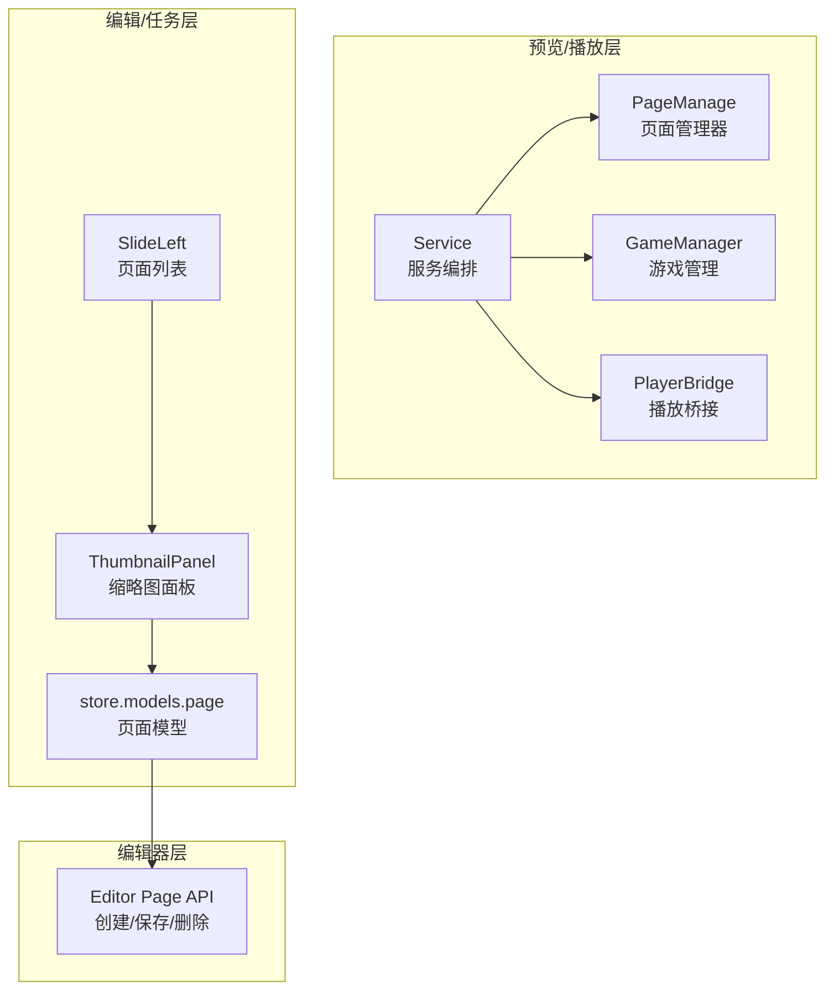
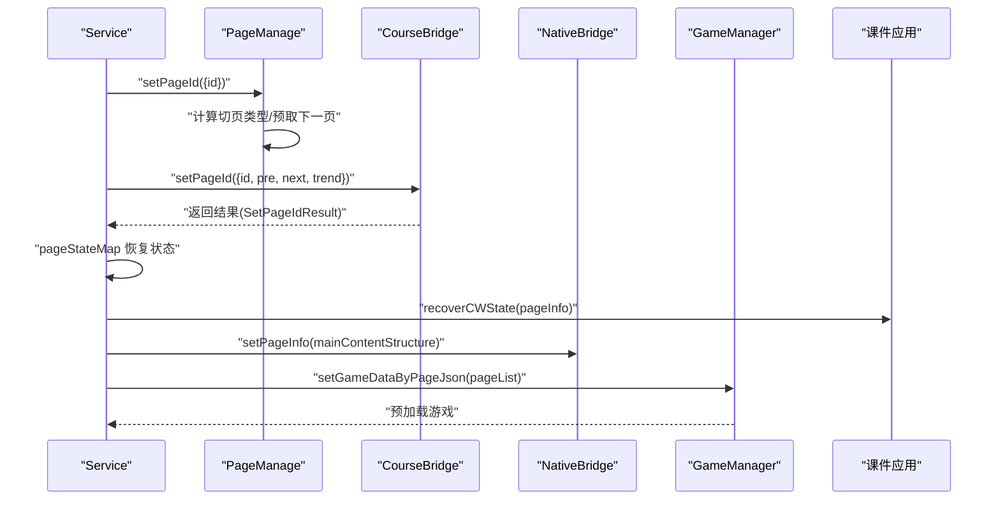
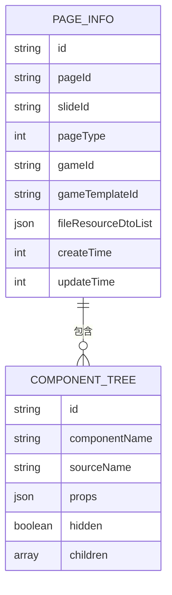
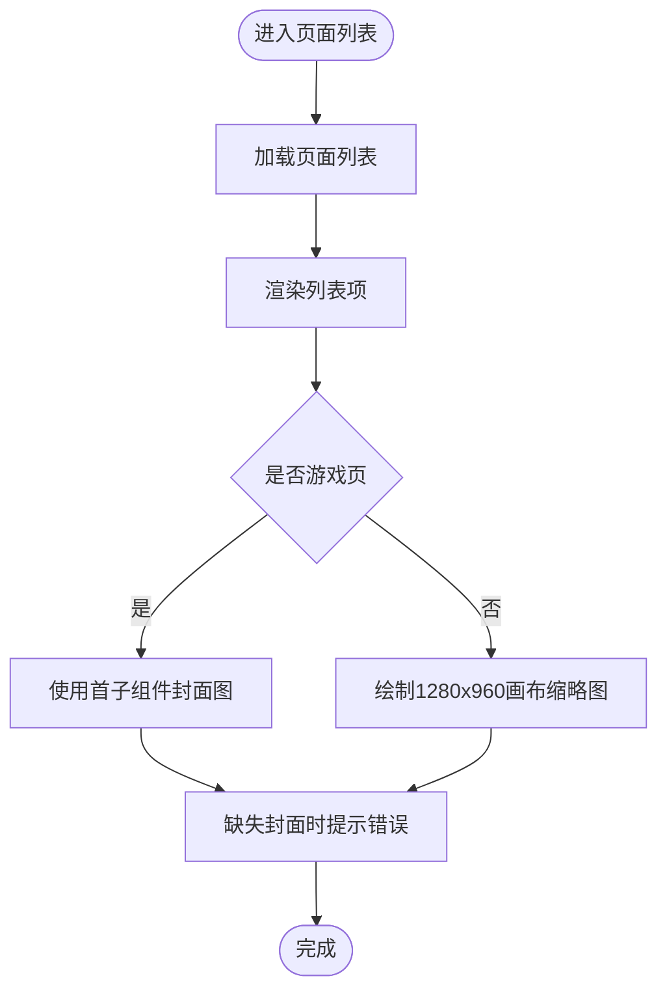
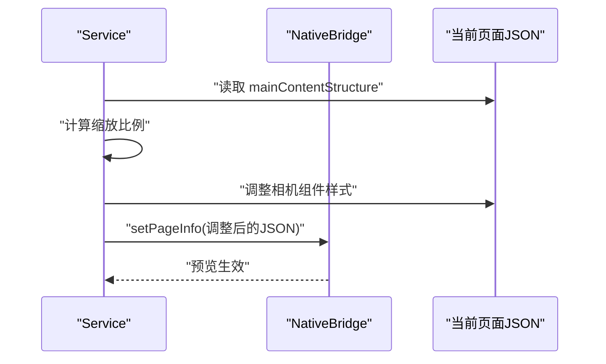
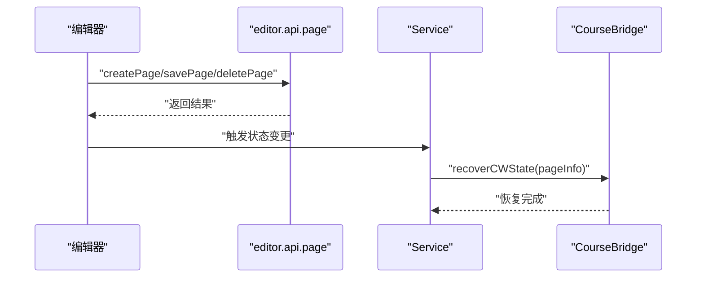
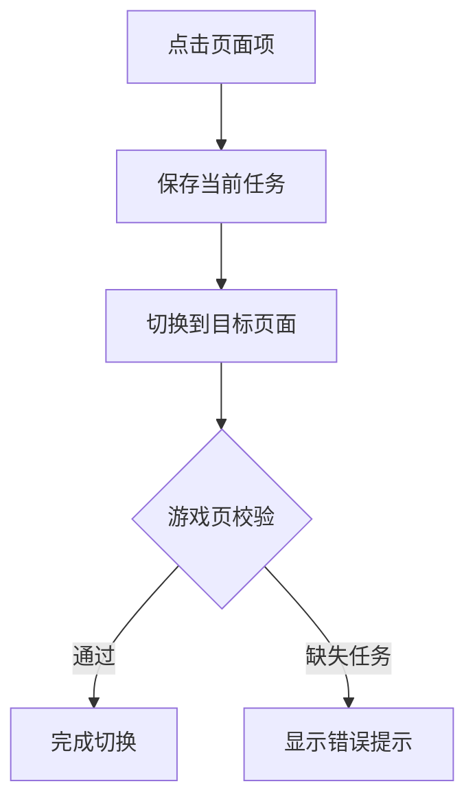
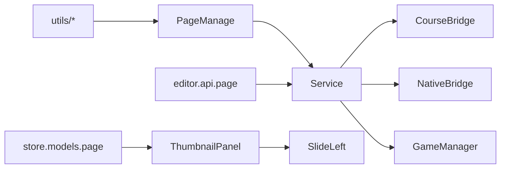

# 页面管理

<cite>
**本文档引用的文件**
- [bridge/mcc-player/src/components/page/pageManager.ts](file://bridge/mcc-player/src/components/page/pageManager.ts)
- [bridge/mcc-player/src/components/page/index.ts](file://bridge/mcc-player/src/components/page/index.ts)
- [bridge/mcc-player/src/components/page/type.ts](file://bridge/mcc-player/src/components/page/type.ts)
- [bridge/mcc-player/src/components/page/const.ts](file://bridge/mcc-player/src/components/page/const.ts)
- [bridge/mcc-player/src/components/service/index.ts](file://bridge/mcc-player/src/components/service/index.ts)
- [bridge/mcc-player/src/components/player/index.ts](file://bridge/mcc-player/src/components/player/index.ts)
- [bridge/mcc-player/src/components/game-manage/gameManager.ts](file://bridge/mcc-player/src/components/game-manage/gameManager.ts)
- [bridge/mcc-player/src/components/game-manage/gameBridge.ts](file://bridge/mcc-player/src/components/game-manage/gameBridge.ts)
- [bridge/mcc-player/src/utils/utils.ts](file://bridge/mcc-player/src/utils/utils.ts)
- [bridge/mcc-player/src/utils/index.ts](file://bridge/mcc-player/src/utils/index.ts)
- [common/animate/src/componments/animate.tsx](file://common/animate/src/componments/animate.tsx)
- [common/render-core/index.tsx](file://common/render-core/index.tsx)
- [editor/src/api/page.ts](file://editor/src/api/page.ts)
- [task/src/pages/Main/SlideLeft/ThumbnailPanel/index.tsx](file://task/src/pages/Main/SlideLeft/ThumbnailPanel/index.tsx)
- [task/src/pages/Main/SlideLeft/Item.tsx](file://task/src/pages/Main/SlideLeft/Item.tsx)
- [task/src/pages/Main/SlideLeft/index.tsx](file://task/src/pages/Main/SlideLeft/index.tsx)
- [task/src/store/models/page.ts](file://task/src/store/models/page.ts)
</cite>

## 目录
1. [简介](#简介)
2. [项目结构](#项目结构)
3. [核心组件](#核心组件)
4. [架构总览](#架构总览)
5. [详细组件分析](#详细组件分析)
6. [依赖关系分析](#依赖关系分析)
7. [性能考量](#性能考量)
8. [故障排查指南](#故障排查指南)
9. [结论](#结论)
10. [附录](#附录)

## 简介
本文件面向“页面管理”模块，系统性梳理页面列表展示、缩略图生成、页面状态与预览、编辑器集成、数据结构设计、API 接口与最佳实践。重点覆盖以下方面：
- 页面列表展示与缩略图生成逻辑
- 页面元信息、组件数据、布局信息等字段定义
- 页面预览与实时预览、缩放控制、导航切换
- 页面编辑器与主编辑器的通信机制、数据同步策略、保存流程
- 页面管理相关 API 的参数与行为说明
- 最佳实践与常见问题解决方案

## 项目结构
页面管理涉及三大层面：
- 预览/播放层：负责页面目录解析、资源加载、切页、状态恢复、与 Native/课件桥接
- 编辑/任务层：负责页面列表展示、缩略图生成、页面状态标注与校验
- 编辑器层：负责页面数据的创建、保存、删除等操作

**图表来源**
- [bridge/mcc-player/src/components/page/pageManager.ts:1-498](file://bridge/mcc-player/src/components/page/pageManager.ts#L1-L498)
- [bridge/mcc-player/src/components/service/index.ts:1-895](file://bridge/mcc-player/src/components/service/index.ts#L1-L895)
- [bridge/mcc-player/src/components/game-manage/gameManager.ts:1-176](file://bridge/mcc-player/src/components/game-manage/gameManager.ts#L1-L176)
- [task/src/pages/Main/SlideLeft/ThumbnailPanel/index.tsx:1-24](file://task/src/pages/Main/SlideLeft/ThumbnailPanel/index.tsx#L1-L24)
- [task/src/pages/Main/SlideLeft/index.tsx:1-82](file://task/src/pages/Main/SlideLeft/index.tsx#L1-L82)
- [task/src/store/models/page.ts:1-152](file://task/src/store/models/page.ts#L1-L152)
- [editor/src/api/page.ts:1-34](file://editor/src/api/page.ts#L1-L34)

**章节来源**
- [bridge/mcc-player/src/components/page/pageManager.ts:1-498](file://bridge/mcc-player/src/components/page/pageManager.ts#L1-L498)
- [bridge/mcc-player/src/components/service/index.ts:1-895](file://bridge/mcc-player/src/components/service/index.ts#L1-L895)
- [task/src/pages/Main/SlideLeft/ThumbnailPanel/index.tsx:1-24](file://task/src/pages/Main/SlideLeft/ThumbnailPanel/index.tsx#L1-L24)
- [task/src/pages/Main/SlideLeft/index.tsx:1-82](file://task/src/pages/Main/SlideLeft/index.tsx#L1-L82)
- [task/src/store/models/page.ts:1-152](file://task/src/store/models/page.ts#L1-L152)
- [editor/src/api/page.ts:1-34](file://editor/src/api/page.ts#L1-L34)

## 核心组件
- 页面管理器（PageManage）：负责目录解析、页面 JSON 加载、全局数据注入、切页与状态恢复
- 服务编排（Service）：统一注册原生/课件回调，协调切页、状态恢复、消息转发、预览桥接
- 游戏管理（GameManager）：根据页面内容设置游戏数据、预加载与心跳同步
- 页面列表与缩略图（SlideLeft/ThumbnailPanel）：编辑侧页面列表展示、缩略图生成、错误提示
- 页面模型（store.models.page）：页面数据结构、排序与资源列表
- 编辑器 API（editor.api.page）：页面创建、保存、删除

**章节来源**
- [bridge/mcc-player/src/components/page/pageManager.ts:1-498](file://bridge/mcc-player/src/components/page/pageManager.ts#L1-L498)
- [bridge/mcc-player/src/components/service/index.ts:1-895](file://bridge/mcc-player/src/components/service/index.ts#L1-L895)
- [bridge/mcc-player/src/components/game-manage/gameManager.ts:1-176](file://bridge/mcc-player/src/components/game-manage/gameManager.ts#L1-L176)
- [task/src/pages/Main/SlideLeft/ThumbnailPanel/index.tsx:1-24](file://task/src/pages/Main/SlideLeft/ThumbnailPanel/index.tsx#L1-L24)
- [task/src/pages/Main/SlideLeft/index.tsx:1-82](file://task/src/pages/Main/SlideLeft/index.tsx#L1-L82)
- [task/src/store/models/page.ts:1-152](file://task/src/store/models/page.ts#L1-L152)
- [editor/src/api/page.ts:1-34](file://editor/src/api/page.ts#L1-L34)

## 架构总览
页面管理的端到端流程如下：
- 初始化阶段：Service 注册回调，PageManage 解析目录与资源，注入微前端全局数据
- 切页阶段：Service 根据目标 pageId 设置切页类型、预取下一页、调用课件 setPageId 并等待结果
- 状态恢复：根据 pageStateMap 恢复课件状态；视频页做画布尺寸缩放适配
- 预览桥接：将页面 JSON 传递给 Native 层，支持实时预览与交互
- 编辑侧：任务面板渲染页面列表与缩略图，支持点击切换与错误提示

**图表来源**
- [bridge/mcc-player/src/components/service/index.ts:612-676](file://bridge/mcc-player/src/components/service/index.ts#L612-L676)
- [bridge/mcc-player/src/components/page/pageManager.ts:90-110](file://bridge/mcc-player/src/components/page/pageManager.ts#L90-L110)
- [bridge/mcc-player/src/components/game-manage/gameManager.ts:137-176](file://bridge/mcc-player/src/components/game-manage/gameManager.ts#L137-L176)

**章节来源**
- [bridge/mcc-player/src/components/service/index.ts:612-676](file://bridge/mcc-player/src/components/service/index.ts#L612-L676)
- [bridge/mcc-player/src/components/page/pageManager.ts:90-110](file://bridge/mcc-player/src/components/page/pageManager.ts#L90-L110)
- [bridge/mcc-player/src/components/game-manage/gameManager.ts:137-176](file://bridge/mcc-player/src/components/game-manage/gameManager.ts#L137-L176)

## 详细组件分析

### 页面数据结构设计
页面数据由两部分组成：
- 页面元信息（PageInfo）：标识页的唯一 id、所属课件、页类型、资源清单、时间戳等
- 页面内容（mainContentStructure）：以组件树形式表达的页面布局与组件属性

- 页面类型枚举（NORMAL_PAGE/GAME_PAGE/VIDEO_PAGE）用于区分渲染与交互策略
- 组件树中的 props、children、id 等字段决定页面布局与交互行为
- 资源清单（fileResourceDtoList）用于预览与播放阶段的资源定位

**图表来源**
- [bridge/mcc-player/src/components/page/type.ts:29-45](file://bridge/mcc-player/src/components/page/type.ts#L29-L45)
- [task/src/store/models/page.ts:16-69](file://task/src/store/models/page.ts#L16-L69)

**章节来源**
- [bridge/mcc-player/src/components/page/type.ts:29-45](file://bridge/mcc-player/src/components/page/type.ts#L29-L45)
- [task/src/store/models/page.ts:16-69](file://task/src/store/models/page.ts#L16-L69)

### 页面列表展示与缩略图生成
- 编辑侧页面列表（SlideLeft）：遍历页面列表，渲染序号、标题、类型标签与缩略图
- 缩略图生成（ThumbnailPanel）：基于默认宽高与缩放比例，将页面内容绘制到 1280×960 画布上
- 游戏页特殊处理：使用首子组件封面图作为缩略背景，缺失时提示错误

**图表来源**
- [task/src/pages/Main/SlideLeft/index.tsx:19-78](file://task/src/pages/Main/SlideLeft/index.tsx#L19-L78)
- [task/src/pages/Main/SlideLeft/Item.tsx:10-24](file://task/src/pages/Main/SlideLeft/Item.tsx#L10-L24)
- [task/src/pages/Main/SlideLeft/ThumbnailPanel/index.tsx:8-21](file://task/src/pages/Main/SlideLeft/ThumbnailPanel/index.tsx#L8-L21)

**章节来源**
- [task/src/pages/Main/SlideLeft/index.tsx:19-78](file://task/src/pages/Main/SlideLeft/index.tsx#L19-L78)
- [task/src/pages/Main/SlideLeft/Item.tsx:10-24](file://task/src/pages/Main/SlideLeft/Item.tsx#L10-L24)
- [task/src/pages/Main/SlideLeft/ThumbnailPanel/index.tsx:8-21](file://task/src/pages/Main/SlideLeft/ThumbnailPanel/index.tsx#L8-L21)

### 页面预览与实时预览
- Service 在 setPageIdResult 成功后，根据当前页类型与内容结构进行预览桥接
- 视频页进行画布尺寸缩放适配，确保相机组件样式与容器比例一致
- 预览桥接通过 NativeBridge.setPageInfo 将页面 JSON 传递给原生层，实现实时预览

**图表来源**
- [bridge/mcc-player/src/components/service/index.ts:231-295](file://bridge/mcc-player/src/components/service/index.ts#L231-L295)

**章节来源**
- [bridge/mcc-player/src/components/service/index.ts:231-295](file://bridge/mcc-player/src/components/service/index.ts#L231-L295)

### 页面编辑器集成与数据同步
- Service 统一注册原生与课件回调，处理切页、状态恢复、消息转发
- 课件状态通过 pageStateMap 与微前端全局数据进行同步，支持断线重连恢复
- 编辑器侧通过 editor.api.page 提供页面创建、保存、删除接口，供任务系统调用

**图表来源**
- [editor/src/api/page.ts:10-33](file://editor/src/api/page.ts#L10-L33)
- [bridge/mcc-player/src/components/service/index.ts:406-468](file://bridge/mcc-player/src/components/service/index.ts#L406-L468)

**章节来源**
- [editor/src/api/page.ts:10-33](file://editor/src/api/page.ts#L10-L33)
- [bridge/mcc-player/src/components/service/index.ts:406-468](file://bridge/mcc-player/src/components/service/index.ts#L406-L468)

### 页面状态显示与批量操作
- 页面状态显示：任务面板对游戏页进行校验，若缺少任务绑定则显示错误提示
- 批量操作：页面列表支持点击切换，保存任务后再切换页面，确保数据一致性

**图表来源**
- [task/src/pages/Main/SlideLeft/index.tsx:24-36](file://task/src/pages/Main/SlideLeft/index.tsx#L24-L36)

**章节来源**
- [task/src/pages/Main/SlideLeft/index.tsx:24-36](file://task/src/pages/Main/SlideLeft/index.tsx#L24-L36)

### 页面管理 API 接口说明
- 创建页面
  - 方法：POST
  - 路径：/classroom-slides/slides/pages/create
  - 参数：见 [editor/src/api/page.ts:10-15](file://editor/src/api/page.ts#L10-L15)
- 保存页面
  - 方法：POST
  - 路径：/classroom-slides/slides/pages/{pageId}/save
  - 参数：见 [editor/src/api/page.ts:26-33](file://editor/src/api/page.ts#L26-L33)
- 删除页面
  - 方法：POST
  - 路径：/classroom-slides/slides/pages/delete
  - 参数：见 [editor/src/api/page.ts:18-23](file://editor/src/api/page.ts#L18-L23)

**章节来源**
- [editor/src/api/page.ts:10-33](file://editor/src/api/page.ts#L10-L33)

## 依赖关系分析
- PageManage 依赖工具库（资源存在性检测、URL 占位符替换、Axios 实例）
- Service 依赖 PageManage、CourseBridge、NativeBridge、GameManager
- 编辑侧依赖 store.models.page 与 ThumbnailPanel/SlideLeft 组件
- 预览桥接依赖 NativeBridge.setPageInfo 与微前端全局数据

**图表来源**
- [bridge/mcc-player/src/utils/index.ts:1-4](file://bridge/mcc-player/src/utils/index.ts#L1-L4)
- [bridge/mcc-player/src/components/page/pageManager.ts:1-498](file://bridge/mcc-player/src/components/page/pageManager.ts#L1-L498)
- [bridge/mcc-player/src/components/service/index.ts:1-895](file://bridge/mcc-player/src/components/service/index.ts#L1-L895)
- [task/src/store/models/page.ts:1-152](file://task/src/store/models/page.ts#L1-L152)
- [task/src/pages/Main/SlideLeft/ThumbnailPanel/index.tsx:1-24](file://task/src/pages/Main/SlideLeft/ThumbnailPanel/index.tsx#L1-L24)
- [task/src/pages/Main/SlideLeft/index.tsx:1-82](file://task/src/pages/Main/SlideLeft/index.tsx#L1-L82)
- [editor/src/api/page.ts:1-34](file://editor/src/api/page.ts#L1-L34)

**章节来源**
- [bridge/mcc-player/src/utils/index.ts:1-4](file://bridge/mcc-player/src/utils/index.ts#L1-L4)
- [bridge/mcc-player/src/components/page/pageManager.ts:1-498](file://bridge/mcc-player/src/components/page/pageManager.ts#L1-L498)
- [bridge/mcc-player/src/components/service/index.ts:1-895](file://bridge/mcc-player/src/components/service/index.ts#L1-L895)
- [task/src/store/models/page.ts:1-152](file://task/src/store/models/page.ts#L1-L152)
- [task/src/pages/Main/SlideLeft/ThumbnailPanel/index.tsx:1-24](file://task/src/pages/Main/SlideLeft/ThumbnailPanel/index.tsx#L1-L24)
- [task/src/pages/Main/SlideLeft/index.tsx:1-82](file://task/src/pages/Main/SlideLeft/index.tsx#L1-L82)
- [editor/src/api/page.ts:1-34](file://editor/src/api/page.ts#L1-L34)

## 性能考量
- 历史快照节流：通过空闲时段合并序列化，降低主线程压力
- 响应式粒度：对节点属性采用细粒度可观测，减少无关重算
- 历史栈上限：限制历史记录数量，控制内存与序列化开销
- PWA 与资源更新：按需加载字体与静态资源，减少全量更新
- CDN 与全局配置：通过环境变量与 CDN 列表提升资源加载稳定性
- 异步路由与 Modal 销毁预览：及时释放 iframe 与握手连接，降低常驻内存

**章节来源**
- [bridge/mcc-player/src/components/service/index.ts:1-895](file://bridge/mcc-player/src/components/service/index.ts#L1-L895)

## 故障排查指南
- 切页失败
  - 现象：首次进入切页失败，埋点上报
  - 排查：确认目录与页面 JSON 加载是否成功；检查 pageStateMap 是否存在对应 pageId
  - 参考：[bridge/mcc-player/src/components/service/index.ts:296-309](file://bridge/mcc-player/src/components/service/index.ts#L296-L309)
- 资源加载失败
  - 现象：本地/远程资源均不可用
  - 排查：检查 isRemoteResourceExist 与 getRemoteJson 的回退逻辑
  - 参考：[bridge/mcc-player/src/components/page/pageManager.ts:426-465](file://bridge/mcc-player/src/components/page/pageManager.ts#L426-L465)
- 缩略图异常
  - 现象：游戏页无封面导致缩略图为空
  - 排查：检查 children 第一个子组件是否存在封面图；任务绑定是否完整
  - 参考：[task/src/pages/Main/SlideLeft/Item.tsx:12-22](file://task/src/pages/Main/SlideLeft/Item.tsx#L12-L22)
- 状态不同步
  - 现象：断线重连后状态未恢复
  - 排查：确认 pageStateMap 与微前端全局数据是否更新；检查 Service.recoverCWState 调用时机
  - 参考：[bridge/mcc-player/src/components/service/index.ts:406-468](file://bridge/mcc-player/src/components/service/index.ts#L406-L468)

**章节来源**
- [bridge/mcc-player/src/components/service/index.ts:296-309](file://bridge/mcc-player/src/components/service/index.ts#L296-L309)
- [bridge/mcc-player/src/components/page/pageManager.ts:426-465](file://bridge/mcc-player/src/components/page/pageManager.ts#L426-L465)
- [task/src/pages/Main/SlideLeft/Item.tsx:12-22](file://task/src/pages/Main/SlideLeft/Item.tsx#L12-L22)
- [bridge/mcc-player/src/components/service/index.ts:406-468](file://bridge/mcc-player/src/components/service/index.ts#L406-L468)

## 结论
页面管理模块通过“目录解析—资源加载—切页—状态恢复—预览桥接”的闭环，实现了稳定的页面浏览与交互体验。编辑侧与播放侧协同，既保证了编辑效率，又兼顾了预览性能与一致性。建议在复杂页面与大量资源场景下，结合缓存与懒加载策略进一步优化加载与渲染性能。

## 附录

### 页面类型与字段速查
- 页面类型（PageType）
  - NORMAL_PAGE：普通页面
  - GAME_PAGE：游戏页面
  - VIDEO_PAGE：视频页面
- 页面元信息（PageInfo）
  - id、pageId、slideId、pageType、gameId、gameTemplateId、fileResourceDtoList、createTime、updateTime
- 页面内容（mainContentStructure）
  - 以组件树形式表达，包含 props、children、id 等字段

**章节来源**
- [bridge/mcc-player/src/components/page/type.ts:29-45](file://bridge/mcc-player/src/components/page/type.ts#L29-L45)
- [task/src/store/models/page.ts:16-69](file://task/src/store/models/page.ts#L16-L69)