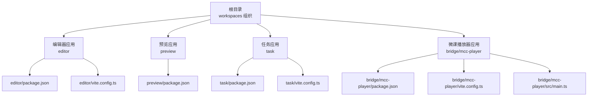
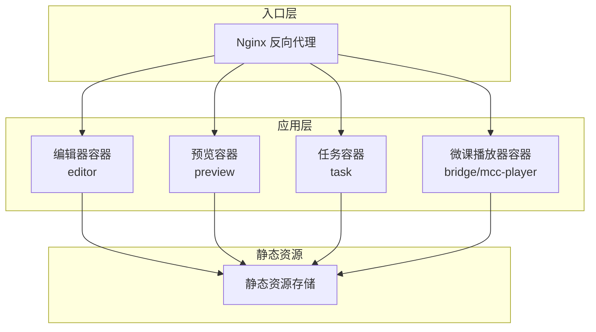
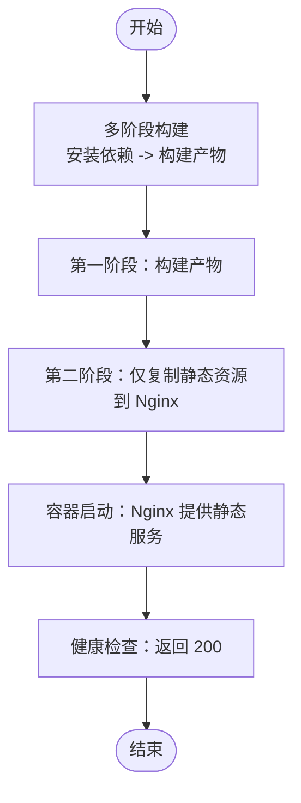
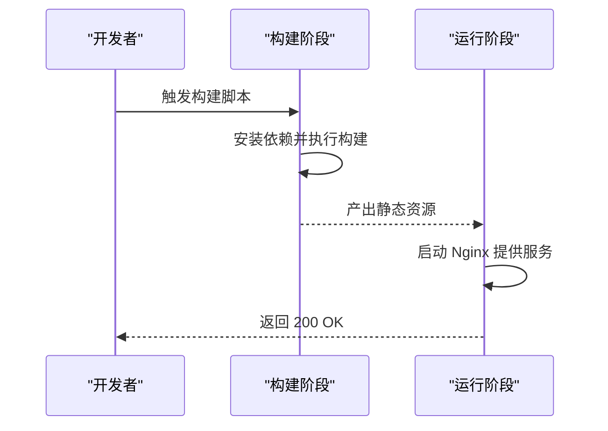
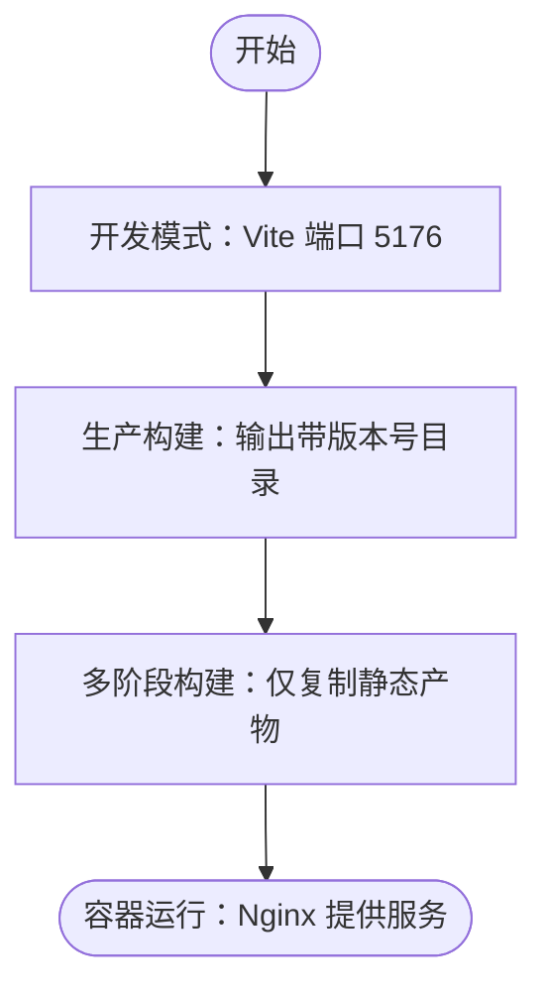
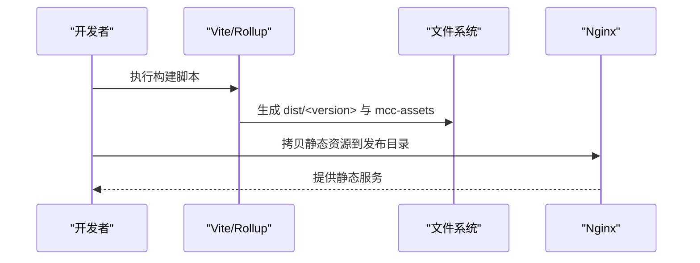
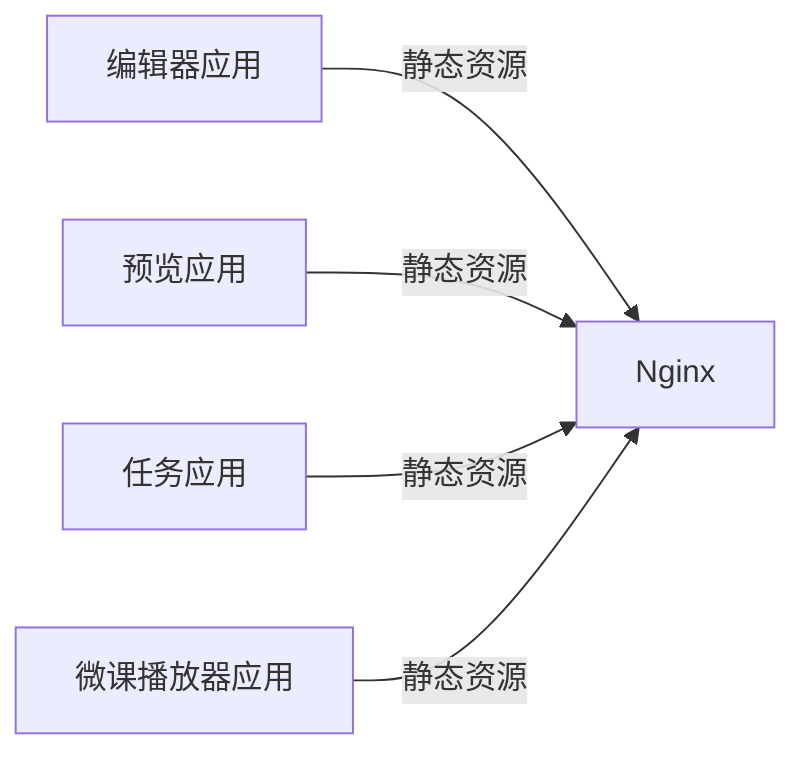

# Docker 部署

<cite>
**本文引用的文件**
- [package.json](file://package.json)
- [editor/package.json](file://editor/package.json)
- [editor/vite.config.ts](file://editor/vite.config.ts)
- [preview/package.json](file://preview/package.json)
- [task/package.json](file://task/package.json)
- [task/vite.config.ts](file://task/vite.config.ts)
- [bridge/mcc-player/package.json](file://bridge/mcc-player/package.json)
- [bridge/mcc-player/vite.config.ts](file://bridge/mcc-player/vite.config.ts)
- [bridge/mcc-player/src/main.ts](file://bridge/mcc-player/src/main.ts)
- [editor/src/main.tsx](file://editor/src/main.tsx)
</cite>

## 目录
1. [简介](#简介)
2. [项目结构](#项目结构)
3. [核心组件](#核心组件)
4. [架构总览](#架构总览)
5. [详细组件分析](#详细组件分析)
6. [依赖关系分析](#依赖关系分析)
7. [性能考虑](#性能考虑)
8. [故障排查指南](#故障排查指南)
9. [结论](#结论)
10. [附录](#附录)

## 简介
本文件面向 Slides Engine 项目，提供端到端的容器化部署方案，覆盖以下方面：
- 多应用模块的 Dockerfile 设计与多阶段构建策略
- 镜像优化与安全加固建议
- Docker Compose 编排与网络、存储、环境变量配置
- Kubernetes 部署清单（Deployment、Service、Ingress）示例
- 容器监控、日志收集与健康检查配置思路
- 镜像仓库管理、版本标签与自动构建流程指引

Slides Engine 采用 Vite 构建前端应用，结合工作区（workspaces）组织多包结构。本文将围绕 editor、preview、task、bridge/mcc-player 四个主要前端应用展开容器化设计。

## 项目结构
Slides Engine 使用 pnpm 工作区组织多个子包，根目录通过 workspaces 字段声明各子包路径。四个前端应用均使用 Vite 进行开发与构建，具备独立的构建脚本与配置文件。

图表来源
- [package.json:1-58](file://package.json#L1-L58)
- [editor/package.json:1-64](file://editor/package.json#L1-L64)
- [editor/vite.config.ts:1-76](file://editor/vite.config.ts#L1-L76)
- [preview/package.json:1-168](file://preview/package.json#L1-L168)
- [task/package.json:1-57](file://task/package.json#L1-L57)
- [task/vite.config.ts:1-37](file://task/vite.config.ts#L1-L37)
- [bridge/mcc-player/package.json:1-72](file://bridge/mcc-player/package.json#L1-L72)
- [bridge/mcc-player/vite.config.ts:1-31](file://bridge/mcc-player/vite.config.ts#L1-L31)
- [bridge/mcc-player/src/main.ts:1-20](file://bridge/mcc-player/src/main.ts#L1-L20)

章节来源
- [package.json:1-58](file://package.json#L1-L58)

## 核心组件
- 编辑器应用（editor）
  - 使用 Vite 开发，支持代理与 PWA 插件，构建输出带版本号目录。
  - 关键配置：开发端口、代理、PWA 缓存策略、环境目录。
- 预览应用（preview）
  - 使用 Webpack 脚本进行构建与发布，提供上传、更新等脚本。
  - 关键配置：构建脚本、上传脚本、Jest 测试配置。
- 任务应用（task）
  - 使用 Vite 开发，配置代理与基础路径，构建输出带版本号目录。
  - 关键配置：开发端口、代理、环境目录。
- 微课播放器应用（bridge/mcc-player）
  - 使用 Vite + Rollup 构建，产物目录按版本号分层，支持热更新脚本。
  - 关键配置：开发端口、构建输出、HTML 资源目录。

章节来源
- [editor/package.json:1-64](file://editor/package.json#L1-L64)
- [editor/vite.config.ts:1-76](file://editor/vite.config.ts#L1-L76)
- [preview/package.json:1-168](file://preview/package.json#L1-L168)
- [task/package.json:1-57](file://task/package.json#L1-L57)
- [task/vite.config.ts:1-37](file://task/vite.config.ts#L1-L37)
- [bridge/mcc-player/package.json:1-72](file://bridge/mcc-player/package.json#L1-L72)
- [bridge/mcc-player/vite.config.ts:1-31](file://bridge/mcc-player/vite.config.ts#L1-L31)

## 架构总览
下图展示容器化后的整体架构：每个前端应用在独立容器内运行，通过反向代理统一入口对外提供服务；应用间不直接通信，所有外部请求经由代理或入口路由进入对应容器。

（本图为概念性架构示意，无需代码映射）

## 详细组件分析

### 编辑器应用（editor）
- 构建与运行
  - 开发模式：Vite 启动，端口 5175，支持代理到测试后端。
  - 生产构建：输出目录包含版本号，便于多版本并行。
- 容器化要点
  - 基础镜像：选择轻量级 Nginx 或 Alpine + Nginx。
  - 多阶段构建：第一阶段安装依赖并构建，第二阶段仅复制静态产物至 Nginx 发布目录。
  - 安全加固：非特权用户运行、最小权限、禁用不必要的系统工具。
  - 健康检查：返回 200 即可，或基于首页可达性检查。
  - 环境变量：通过构建参数注入 API 地址、站点名称等。
- 关键配置参考
  - 开发端口与代理：[editor/vite.config.ts:18-29](file://editor/vite.config.ts#L18-L29)
  - 构建输出与版本目录：[editor/vite.config.ts:30-38](file://editor/vite.config.ts#L30-L38)
  - 环境目录：[editor/vite.config.ts:39](file://editor/vite.config.ts#L39)
  - 入口初始化与 Sentry 初始化：[editor/src/main.tsx:17-26](file://editor/src/main.tsx#L17-L26)

图表来源
- [editor/vite.config.ts:30-38](file://editor/vite.config.ts#L30-L38)
- [editor/src/main.tsx:17-26](file://editor/src/main.tsx#L17-L26)

章节来源
- [editor/vite.config.ts:18-39](file://editor/vite.config.ts#L18-L39)
- [editor/src/main.tsx:17-26](file://editor/src/main.tsx#L17-L26)

### 预览应用（preview）
- 构建与运行
  - 使用 Webpack 脚本进行构建与发布，提供上传、更新脚本。
  - 容器化建议：与编辑器类似，采用多阶段构建，仅保留静态产物。
- 关键配置参考
  - 构建脚本与上传脚本：[preview/package.json:76-88](file://preview/package.json#L76-L88)
  - Jest 与 Babel 配置（用于构建链路理解）：[preview/package.json:108-167](file://preview/package.json#L108-L167)

图表来源
- [preview/package.json:76-88](file://preview/package.json#L76-L88)

章节来源
- [preview/package.json:76-88](file://preview/package.json#L76-L88)
- [preview/package.json:108-167](file://preview/package.json#L108-L167)

### 任务应用（task）
- 构建与运行
  - Vite 开发，端口 5176，支持代理到测试后端。
  - 生产构建输出带版本号目录。
- 容器化要点
  - 与编辑器一致的多阶段构建策略。
  - 健康检查与非特权运行。
- 关键配置参考
  - 开发端口与代理：[task/vite.config.ts:20-35](file://task/vite.config.ts#L20-L35)
  - 构建输出与版本目录：[task/vite.config.ts:10-12](file://task/vite.config.ts#L10-L12)
  - 环境目录：[task/vite.config.ts:14](file://task/vite.config.ts#L14)

图表来源
- [task/vite.config.ts:10-12](file://task/vite.config.ts#L10-L12)
- [task/vite.config.ts:20-35](file://task/vite.config.ts#L20-L35)

章节来源
- [task/vite.config.ts:10-12](file://task/vite.config.ts#L10-L12)
- [task/vite.config.ts:20-35](file://task/vite.config.ts#L20-L35)

### 微课播放器应用（bridge/mcc-player）
- 构建与运行
  - Vite + Rollup 构建，产物目录按版本号分层，HTML 资源目录为 mcc-assets。
  - 支持热更新与替换文件脚本。
- 容器化要点
  - 多阶段构建：第一阶段编译 TS、打包 HTML、生成版本目录产物；第二阶段仅复制 mcc-assets 到 Nginx。
  - 安全加固：非特权用户、最小镜像、禁用 shell。
  - 健康检查：对首页或关键静态资源进行可达性检查。
- 关键配置参考
  - 构建输出与 HTML 资源目录：[bridge/mcc-player/vite.config.ts:16-24](file://bridge/mcc-player/vite.config.ts#L16-L24)
  - 入口初始化与 polyfill 注入：[bridge/mcc-player/src/main.ts:7-20](file://bridge/mcc-player/src/main.ts#L7-L20)

图表来源
- [bridge/mcc-player/vite.config.ts:16-24](file://bridge/mcc-player/vite.config.ts#L16-L24)
- [bridge/mcc-player/src/main.ts:7-20](file://bridge/mcc-player/src/main.ts#L7-L20)

章节来源
- [bridge/mcc-player/vite.config.ts:16-24](file://bridge/mcc-player/vite.config.ts#L16-L24)
- [bridge/mcc-player/src/main.ts:7-20](file://bridge/mcc-player/src/main.ts#L7-L20)

## 依赖关系分析
- 应用间无直接容器依赖，统一通过入口反向代理访问。
- 各应用的构建产物均为静态资源，适合以只读方式挂载至 Nginx。
- 外部依赖（如后端接口）通过 Vite 代理或环境变量注入。

（本图为概念性依赖示意，无需代码映射）

## 性能考虑
- 静态资源优化
  - 启用 Gzip/Brotli 压缩与缓存头，合理设置 Cache-Control。
  - 对图片、字体等资源启用长期缓存策略。
- 构建优化
  - 使用多核并行与缓存（pnpm store），减少重复安装时间。
  - 在 CI 中缓存 node_modules 与构建产物，提升流水线效率。
- 容器层优化
  - 使用多阶段构建，缩小最终镜像体积。
  - 选择精简的基础镜像（如 alpine），避免安装未使用软件包。
- 网络与并发
  - 合理设置 worker 数量与连接池，避免阻塞。
  - 使用 CDN 分担静态资源压力。

（本节为通用指导，无需代码映射）

## 故障排查指南
- 健康检查失败
  - 检查容器内进程状态与监听端口。
  - 确认静态资源已正确复制至发布目录。
- 代理或跨域问题
  - 核对 Vite 代理配置与环境变量注入。
  - 确认反向代理规则与上游地址可达。
- Sentry 或监控异常
  - 检查初始化参数与网络连通性。
  - 确认 DSN 与采样率配置正确。
- 日志收集
  - 将 Nginx 访问/错误日志挂载到宿主机或集中式日志系统。
  - 对应用侧错误日志统一输出到 stdout/stderr。

（本节为通用指导，无需代码映射）

## 结论
通过多阶段构建与静态资源容器化，Slides Engine 的四个前端应用可在统一入口下高效运行。配合合理的网络、存储与环境变量配置，以及监控与日志体系，可实现稳定、可观测、可维护的生产部署。

（本节为总结性内容，无需代码映射）

## 附录

### Dockerfile 多阶段构建模板（通用）
- 第一阶段：安装依赖、拉取代码、执行构建
- 第二阶段：仅复制构建产物至 Nginx 发布目录，设置非特权用户与健康检查

（本节为通用模板说明，无需代码映射）

### Docker Compose 编排要点
- 网络
  - 自定义桥接网络，隔离容器间通信。
- 存储
  - 将静态资源目录挂载为只读卷，避免写入冲突。
- 环境变量
  - 通过 env 文件或 compose 的 environment 字段注入 API 地址、站点名称等。
- 健康检查
  - 对每个服务配置 healthcheck，检测首页或关键接口。

（本节为通用编排指导，无需代码映射）

### Kubernetes 部署清单示例（概念性）
- Deployment
  - replicas、容器镜像、端口、资源限制与请求、健康检查。
- Service
  - ClusterIP/NodePort/LoadBalancer，选择合适的暴露方式。
- Ingress
  - TLS、路径路由、重写规则，确保静态资源与 API 请求正确转发。

（本节为概念性示例，无需代码映射）

### 镜像仓库管理与自动构建
- 版本标签
  - 使用语义化版本（主.次.补丁），并结合提交哈希形成可追溯标签。
- 自动构建
  - 在 CI 中触发构建与推送，按分支或标签策略打标签。
- 清理策略
  - 定期清理过期镜像，控制镜像仓库空间。

（本节为通用实践，无需代码映射）