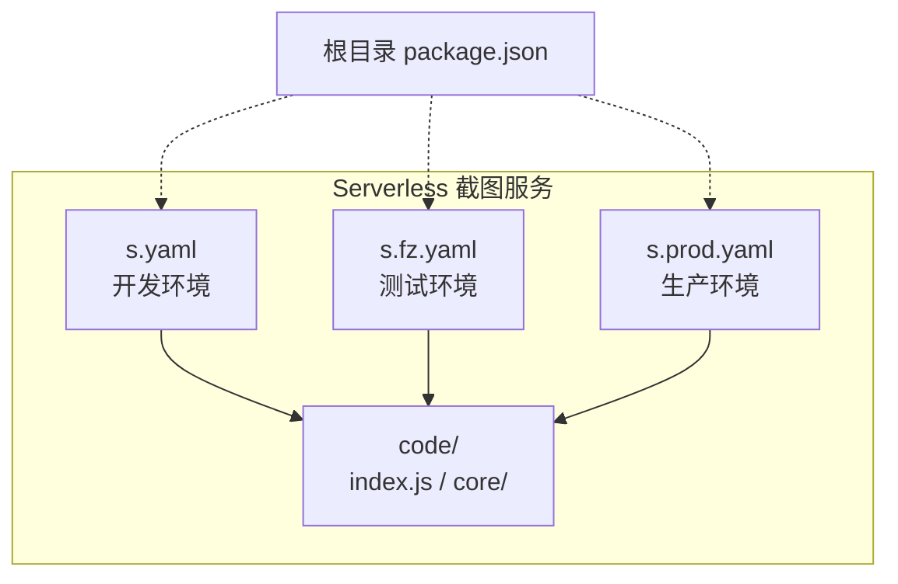
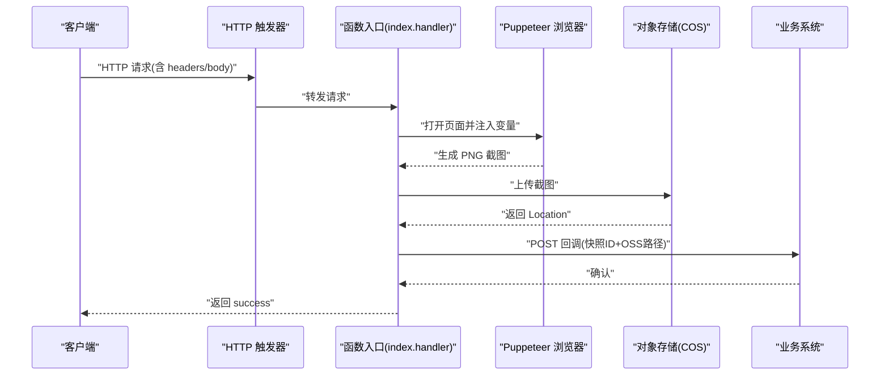
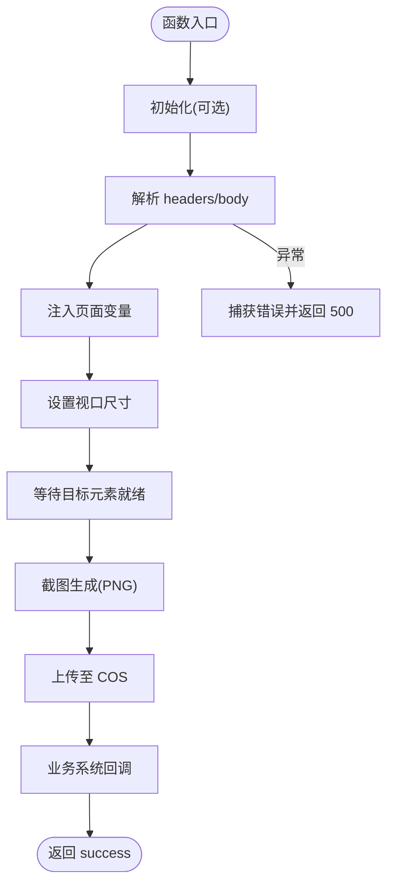
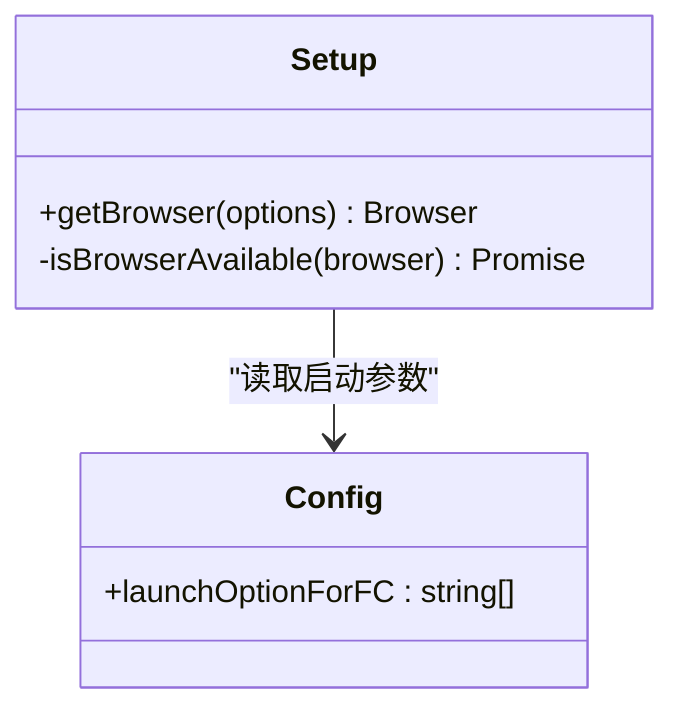
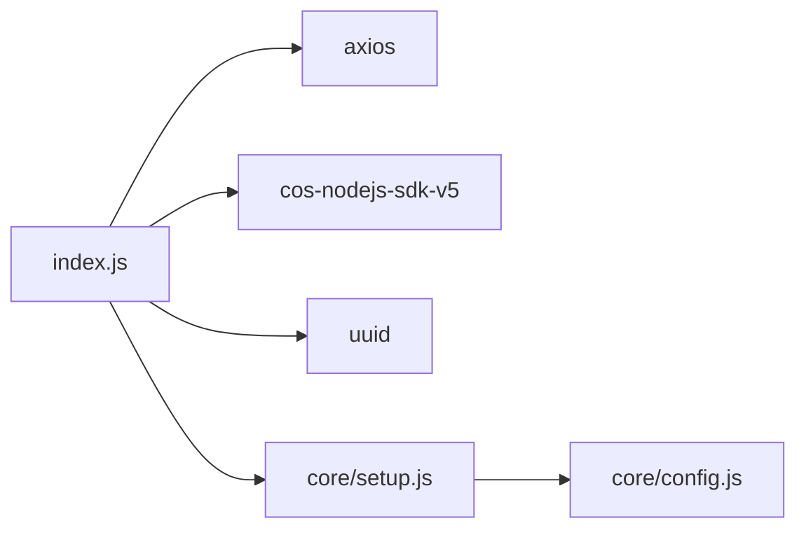

# Serverless 部署

<cite>
**本文引用的文件**
- [serverless/screenshot/s.yaml](file://serverless/screenshot/s.yaml)
- [serverless/screenshot/s.fz.yaml](file://serverless/screenshot/s.fz.yaml)
- [serverless/screenshot/s.prod.yaml](file://serverless/screenshot/s.prod.yaml)
- [serverless/screenshot/code/index.js](file://serverless/screenshot/code/index.js)
- [serverless/screenshot/code/core/setup.js](file://serverless/screenshot/code/core/setup.js)
- [serverless/screenshot/code/core/config.js](file://serverless/screenshot/code/core/config.js)
- [serverless/screenshot/code/package.json](file://serverless/screenshot/code/package.json)
- [package.json](file://package.json)
- [common/slide-editor/gitlab-ci.yml](file://common/slide-editor/gitlab-ci.yml)
</cite>

## 目录
1. [简介](#简介)
2. [项目结构](#项目结构)
3. [核心组件](#核心组件)
4. [架构总览](#架构总览)
5. [详细组件分析](#详细组件分析)
6. [依赖关系分析](#依赖关系分析)
7. [性能与成本优化](#性能与成本优化)
8. [监控与日志](#监控与日志)
9. [故障排除指南](#故障排除指南)
10. [结论](#结论)
11. [附录：部署脚本与配置](#附录部署脚本与配置)

## 简介
本文件面向 Slides Engine 的截图服务在阿里云函数计算（FC）上的 Serverless 部署，覆盖以下内容：
- 截图服务的 Serverless 配置与实施方法
- 阿里云 FC 的资源配置、权限与触发器配置
- 开发、测试、生产三套环境的部署脚本与配置差异说明
- Serverless Framework 的使用方法与最佳实践
- 冷启动优化、资源限制与成本控制策略
- 监控与日志配置，以及故障排除指南
- 部署自动化与 CI/CD 集成方案

## 项目结构
截图服务位于 serverless/screenshot 目录，包含：
- 三层 YAML 配置文件：开发（s.yaml）、测试（s.fz.yaml）、生产（s.prod.yaml）
- 代码目录 code：包含入口函数、Puppeteer 启动封装与依赖声明
- 根级 package.json：工作区与通用依赖定义

图表来源
- [serverless/screenshot/s.yaml:1-60](file://serverless/screenshot/s.yaml#L1-L60)
- [serverless/screenshot/s.fz.yaml:1-61](file://serverless/screenshot/s.fz.yaml#L1-L61)
- [serverless/screenshot/s.prod.yaml:1-61](file://serverless/screenshot/s.prod.yaml#L1-L61)
- [serverless/screenshot/code/index.js:1-153](file://serverless/screenshot/code/index.js#L1-L153)

章节来源
- [serverless/screenshot/s.yaml:1-60](file://serverless/screenshot/s.yaml#L1-L60)
- [serverless/screenshot/s.fz.yaml:1-61](file://serverless/screenshot/s.fz.yaml#L1-L61)
- [serverless/screenshot/s.prod.yaml:1-61](file://serverless/screenshot/s.prod.yaml#L1-L61)
- [serverless/screenshot/code/index.js:1-153](file://serverless/screenshot/code/index.js#L1-L153)
- [package.json:1-58](file://package.json#L1-L58)

## 核心组件
- 入口函数与业务逻辑：负责接收 HTTP 请求、解析参数、调用 Puppeteer 渲染并截图、上传至对象存储、回调业务系统。
- Puppeteer 启动封装：在容器内以无头模式启动浏览器，复用浏览器实例，避免频繁冷启动。
- 环境变量与触发器：通过环境变量注入 COS 凭据、Bucket、Region、HOST、SHOT_URL 等；HTTP 触发器支持多方法匿名访问。

章节来源
- [serverless/screenshot/code/index.js:1-153](file://serverless/screenshot/code/index.js#L1-L153)
- [serverless/screenshot/code/core/setup.js:1-57](file://serverless/screenshot/code/core/setup.js#L1-L57)
- [serverless/screenshot/code/core/config.js:1-18](file://serverless/screenshot/code/core/config.js#L1-L18)
- [serverless/screenshot/s.yaml:22-47](file://serverless/screenshot/s.yaml#L22-L47)

## 架构总览
截图服务整体调用链如下：
- 外部请求经 HTTP 触发器进入 FC
- 入口函数解析请求体与自定义头部，注入页面渲染所需数据
- 调用 Puppeteer 打开指定页面，等待目标元素就绪后截图
- 将二进制图片上传至对象存储，并向业务系统回调结果

图表来源
- [serverless/screenshot/code/index.js:120-152](file://serverless/screenshot/code/index.js#L120-L152)
- [serverless/screenshot/code/index.js:39-118](file://serverless/screenshot/code/index.js#L39-L118)
- [serverless/screenshot/s.yaml:48-60](file://serverless/screenshot/s.yaml#L48-L60)

## 详细组件分析

### 入口函数与处理流程
- 初始化：在 initializer 中预热浏览器实例，减少首次请求延迟
- 请求处理：读取自定义头部 pageSnapshotId，解析请求体，调用截图流程
- 截图流程：注入页面变量、设置视口、等待目标元素、截图、上传、回调
- 错误处理：捕获异常并返回 500

图表来源
- [serverless/screenshot/code/index.js:20-24](file://serverless/screenshot/code/index.js#L20-L24)
- [serverless/screenshot/code/index.js:120-152](file://serverless/screenshot/code/index.js#L120-L152)
- [serverless/screenshot/code/index.js:39-118](file://serverless/screenshot/code/index.js#L39-L118)

章节来源
- [serverless/screenshot/code/index.js:1-153](file://serverless/screenshot/code/index.js#L1-L153)

### Puppeteer 启动与复用
- 通过配置参数禁用沙箱与 GPU，适配 FC 容器环境
- 单例浏览器管理：检测可用性、避免并发重复启动
- 可选调试输出：dumpio 日志便于定位问题

图表来源
- [serverless/screenshot/code/core/setup.js:1-57](file://serverless/screenshot/code/core/setup.js#L1-L57)
- [serverless/screenshot/code/core/config.js:1-18](file://serverless/screenshot/code/core/config.js#L1-L18)

章节来源
- [serverless/screenshot/code/core/setup.js:1-57](file://serverless/screenshot/code/core/setup.js#L1-L57)
- [serverless/screenshot/code/core/config.js:1-18](file://serverless/screenshot/code/core/config.js#L1-L18)

### 触发器与环境变量
- 触发器类型：HTTP，支持 GET/POST/PUT/DELETE，匿名认证
- 关键环境变量：COS_SECRET_ID、COS_SECRET_KEY、COS_BUCKET、COS_REGION、HOST、SHOT_URL、NODE_PATH、LD_LIBRARY_PATH
- 不同环境的差异：测试与生产分别对应不同的服务名与回调地址

章节来源
- [serverless/screenshot/s.yaml:48-60](file://serverless/screenshot/s.yaml#L48-L60)
- [serverless/screenshot/s.fz.yaml:48-61](file://serverless/screenshot/s.fz.yaml#L48-L61)
- [serverless/screenshot/s.prod.yaml:48-61](file://serverless/screenshot/s.prod.yaml#L48-L61)
- [serverless/screenshot/code/index.js:33-41](file://serverless/screenshot/code/index.js#L33-L41)

## 依赖关系分析
- 代码依赖：axios、cos-nodejs-sdk-v5、uuid
- 运行时：Node.js 16，Puppeteer 层（官方层）
- 资源：内存 2GB、CPU 2、并发 2、超时 60 秒、磁盘 512MB

图表来源
- [serverless/screenshot/code/index.js:1-10](file://serverless/screenshot/code/index.js#L1-L10)
- [serverless/screenshot/code/package.json:1-8](file://serverless/screenshot/code/package.json#L1-L8)
- [serverless/screenshot/code/core/setup.js:1-2](file://serverless/screenshot/code/core/setup.js#L1-L2)
- [serverless/screenshot/code/core/config.js:1-18](file://serverless/screenshot/code/core/config.js#L1-L18)

章节来源
- [serverless/screenshot/code/package.json:1-8](file://serverless/screenshot/code/package.json#L1-L8)
- [serverless/screenshot/code/index.js:1-10](file://serverless/screenshot/code/index.js#L1-L10)

## 性能与成本优化
- 冷启动优化
  - 使用 initializer 预热浏览器，降低首包延迟
  - 复用浏览器实例，避免频繁启动
  - 禁用 GPU、禁用沙箱等参数减少启动开销
- 资源限制
  - 内存 2GB、CPU 2、并发 2，按需调整
  - 超时 60 秒，避免长时间占用
  - 磁盘 512MB，注意大体积截图对磁盘的影响
- 成本控制
  - 控制并发与超时，避免不必要的资源消耗
  - 对外网访问与日志采集进行评估，减少额外成本
  - 按环境区分资源规格，生产环境适度提升稳定性

章节来源
- [serverless/screenshot/code/index.js:20-24](file://serverless/screenshot/code/index.js#L20-L24)
- [serverless/screenshot/code/core/setup.js:4-47](file://serverless/screenshot/code/core/setup.js#L4-L47)
- [serverless/screenshot/code/core/config.js:1-14](file://serverless/screenshot/code/core/config.js#L1-L14)
- [serverless/screenshot/s.yaml:22-32](file://serverless/screenshot/s.yaml#L22-L32)

## 监控与日志
- FC 日志配置：启用请求指标与实例指标，日志起始规则默认正则
- 业务日志：函数内打印关键步骤（初始化、截图完成、上传成功、回调发送），便于排查
- 建议
  - 在业务系统侧记录回调结果与耗时
  - 结合阿里云日志服务（SLS）聚合日志，设置告警

章节来源
- [serverless/screenshot/s.yaml:10-15](file://serverless/screenshot/s.yaml#L10-L15)
- [serverless/screenshot/s.fz.yaml:10-15](file://serverless/screenshot/s.fz.yaml#L10-L15)
- [serverless/screenshot/s.prod.yaml:10-15](file://serverless/screenshot/s.prod.yaml#L10-L15)
- [serverless/screenshot/code/index.js:20-24](file://serverless/screenshot/code/index.js#L20-L24)
- [serverless/screenshot/code/index.js:62-99](file://serverless/screenshot/code/index.js#L62-L99)

## 故障排除指南
- 页面加载失败
  - 现象：goto 抛出异常或多次重试仍失败
  - 排查：检查 SHOT_URL 是否可达、网络连通性、HEADLESS 参数
- 截图为空或失败
  - 现象：元素选择器未找到或截图为空
  - 排查：确认目标元素存在、等待策略、视口尺寸
- 上传失败
  - 现象：COS 上传报错
  - 排查：核对 COS_SECRET_ID/KEY、Bucket/Region、节点路径
- 回调失败
  - 现象：业务系统未收到回调
  - 排查：检查 HOST 与接口路径、网络连通性、超时设置
- 并发冲突
  - 现象：浏览器实例被并发访问导致异常
  - 排查：确认单例复用逻辑、并发上限设置

章节来源
- [serverless/screenshot/code/index.js:102-118](file://serverless/screenshot/code/index.js#L102-L118)
- [serverless/screenshot/code/index.js:120-152](file://serverless/screenshot/code/index.js#L120-L152)
- [serverless/screenshot/code/index.js:72-99](file://serverless/screenshot/code/index.js#L72-L99)

## 结论
本方案基于 Serverless Framework 与阿里云 FC，结合 Puppeteer 实现截图服务的快速部署与弹性伸缩。通过 initializer 预热、浏览器复用、合理资源配置与日志监控，可在保证稳定性的同时有效控制成本。建议在生产环境进一步完善灰度发布与回滚机制，并持续优化页面渲染与上传链路。

## 附录：部署脚本与配置

### 部署前准备
- 安装 Serverless Framework CLI 并配置阿里云账号
- 准备对象存储（COS）与 Bucket 权限
- 准备业务系统回调地址与鉴权信息

章节来源
- [serverless/screenshot/s.yaml:8-21](file://serverless/screenshot/s.yaml#L8-L21)
- [serverless/screenshot/s.fz.yaml:8-21](file://serverless/screenshot/s.fz.yaml#L8-L21)
- [serverless/screenshot/s.prod.yaml:8-21](file://serverless/screenshot/s.prod.yaml#L8-L21)

### 环境差异化配置
- 开发（s.yaml）：用于本地联调与小流量验证
- 测试（s.fz.yaml）：与测试 API 地址对接
- 生产（s.prod.yaml）：独立服务名与回调地址，资源与安全策略更严格

章节来源
- [serverless/screenshot/s.yaml:1-60](file://serverless/screenshot/s.yaml#L1-L60)
- [serverless/screenshot/s.fz.yaml:1-61](file://serverless/screenshot/s.fz.yaml#L1-L61)
- [serverless/screenshot/s.prod.yaml:1-61](file://serverless/screenshot/s.prod.yaml#L1-L61)

### 部署命令示例（概念性说明）
- 切换工作目录至截图服务目录
- 使用对应环境 YAML 执行部署
- 验证 HTTP 触发器与回调行为

章节来源
- [serverless/screenshot/s.yaml:1-60](file://serverless/screenshot/s.yaml#L1-L60)
- [serverless/screenshot/s.fz.yaml:1-61](file://serverless/screenshot/s.fz.yaml#L1-L61)
- [serverless/screenshot/s.prod.yaml:1-61](file://serverless/screenshot/s.prod.yaml#L1-L61)

### CI/CD 集成（GitLab CI 示例思路）
- 使用根级工作区配置，按分支选择环境变量文件
- 在构建阶段安装依赖、打包代码
- 在部署阶段调用 Serverless Framework 部署对应环境
- 建议：为不同环境配置独立的触发器与回调地址

章节来源
- [common/slide-editor/gitlab-ci.yml:1-76](file://common/slide-editor/gitlab-ci.yml#L1-L76)
- [package.json:6-15](file://package.json#L6-L15)